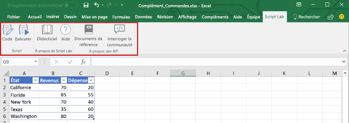
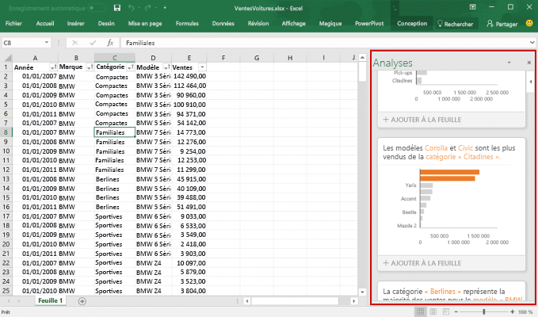
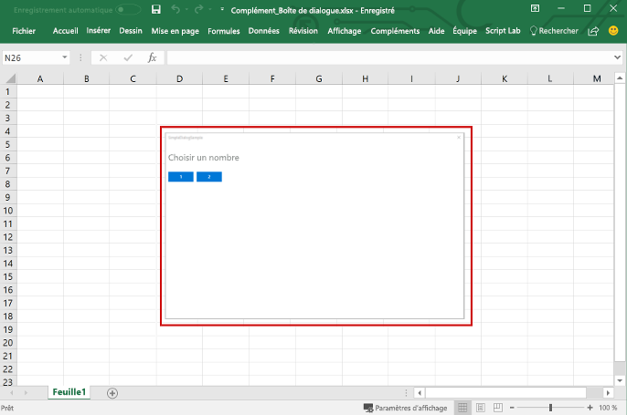
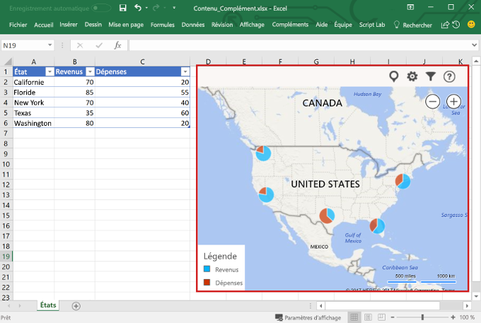

# Présentation des compléments Excel

Un complément Excel vous permet d’étendre les fonctionnalités de l’application Excel sur plusieurs plateformes, notamment Office pour Windows, Office Online, Office pour Mac et Office pour iPad. Utilisez les compléments Excel dans un classeur pour :

- Interagir avec des objets Excel, lire et écrire des données Excel 
- Étendre les fonctionnalités à l’aide du volet Office web ou du volet de contenu 
- Ajouter des boutons personnalisés au ruban ou des éléments au menu contextuel
- Fournir une interaction améliorée à l’aide de la fenêtre de dialogue 

La plateforme de compléments Office fournit la structure et les API JavaScript Office.js qui vous permettent de créer et d’exécuter des compléments Excel. En utilisant la plateforme de compléments Office pour créer votre complément Excel, vous bénéficierez des avantages suivants :

* **Prise en charge sur plusieurs plateformes** : les compléments Excel s’exécutent dans Office pour Windows, Mac, iOS et Office Online.
* **Déploiement centralisé** : les administrateurs peuvent rapidement et facilement déployer des compléments Excel vers les utilisateurs d’une organisation.
* **Utilisation de technologies web standard** : créez votre complément Excel en utilisant des technologies web connues telles qu’HTML, CSS et JavaScript.
* **Distribution via AppSource** : partagez votre complément Excel avec un large public en le publiant sur [AppSource](https://appsource.microsoft.com/marketplace/apps?product=office&page=1&src=office&corrid=53245fad-fcbe-41f8-9f97-b0840264f97c&omexanonuid=4a0102fb-b31a-4b9f-9bb0-39d4cc6b789d).

> [!NOTE]
> Les compléments Excel sont différents des compléments COM ou VST, qui sont des solutions d’intégration Office antérieures s’exécutant uniquement sur Office pour Windows. Contrairement aux compléments COM, les compléments Excel ne nécessitent pas l’installation de code sur l’appareil d’un utilisateur ou dans Excel. 

## Composants d’un complément Excel 

Un complément Excel comprend deux composants de base : une application web et un fichier de configuration, appelé fichier manifeste. 

L’application web utilise l’[API JavaScript pour Office](https://docs.microsoft.com/office/dev/add-ins/reference/javascript-api-for-office?view=office-js) pour interagir avec des objets dans Excel et peut également faciliter l’interaction avec les ressources en ligne. Par exemple, un complément peut effectuer une des opérations suivantes :

* Créer, lire, mettre à jour et supprimer des données dans le classeur (feuilles de calcul, plages, tableaux, graphiques, éléments nommés, etc.).
* Effectuer une autorisation utilisateur avec un service en ligne à l’aide du flux OAuth 2.0 standard.
* Émettre des demandes d’API à Microsoft Graph ou toute autre API.

L’application web peut être hébergée sur un serveur web et peut être créée à l’aide de structures de côté client (par exemple, Angular, React, jQuery) ou des technologies côté serveur (par exemple, ASP.NET, Node.js, PHP).

Le [manifeste](../develop/add-in-manifests.md) est un fichier de configuration XML qui définit la façon dont le complément est intégré dans les clients Office en spécifiant des paramètres et fonctionnalités telles que : 

* L’URL de l’application web du complément.
* Le nom d’affichage, la description, l’ID, la version et les paramètres régionaux par défaut du complément.
* La manière dont le complément est intégré à Excel, y compris toute interface utilisateur personnalisée créée par le complément (boutons du ruban, menus contextuels, etc.).
* Les autorisations requises par le complément, comme la lecture du document ou l’écriture dans celui-ci.

Pour permettre aux utilisateurs finals d’installer et d’utiliser un complément Excel, publiez son manifeste dans AppSource ou dans un catalogue de compléments. 

## Fonctionnalités d’un complément Excel

En plus d’interagir avec le contenu du classeur, les compléments Excel peuvent ajouter des boutons personnalisés au ruban ou des commandes de menu, insérer des volets de tâches, ouvrir des boîtes de dialogue et même incorporer des objets web riches, tels que des graphiques ou des visualisations interactives dans une feuille de calcul.

### Commandes de complément

Les commandes de complément sont des éléments d’interface utilisateur qui étendent l’interface utilisateur Excel et lancent des actions dans votre complément. Vous pouvez utiliser les commandes de complément pour ajouter un bouton au ruban ou un élément à un menu contextuel dans Excel. Lorsque les utilisateurs sélectionnent une commande de complément, ils lancent des actions telles que l’exécution de code JavaScript ou l’affichage d’une page du complément dans un volet Office. 

**Commandes de complément**

Pour plus d’informations sur les fonctionnalités des commandes, les plateformes prises en charge et les bonnes pratiques pour le développement de commandes, reportez-vous à la rubrique [Commandes de complément pour Excel, Word et PowerPoint](../design/add-in-commands.md).

### Volets Office

Les volets Office sont des surfaces d’interface qui s’affichent généralement sur le côté droit de la fenêtre dans Excel. Les volets Office permettent aux utilisateurs d’accéder à des contrôles d’interface qui exécutent du code pour modifier le document Excel ou afficher les données d’une source de données. 

**Volet Office**

Pour plus d’informations sur les volets Office, reportez-vous à [Volets Office dans les compléments Office](../design/task-pane-add-ins.md). Pour consulter un exemple qui implémente un volet Office dans Excel, reportez-vous à [Excel Add-in JS WoodGrove Expense Trends](https://github.com/OfficeDev/Excel-Add-in-WoodGrove-Expense-Trends).

### Boîtes de dialogue

Les boîtes de dialogue sont des surfaces qui flottent au-dessus de la fenêtre active de l’application Excel. Vous pouvez utiliser les boîtes de dialogue pour des tâches comme l’affichage de pages de connexion impossibles à ouvrir directement dans un volet Office, les demandes de confirmation d’une action par l’utilisateur ou l’hébergement de vidéos pouvant être trop petites si elles sont limitées à un volet Office. Utilisez l’[API de dialogue](https://docs.microsoft.com/javascript/api/office/office.ui?view=office-js) pour ouvrir des boîtes de dialogue dans votre complément Excel.

**Boîte de dialogue**

Pour plus d’informations sur les boîtes de dialogue et l’API de dialogue, reportez-vous aux rubriques [Boîtes de dialogue dans les compléments Office](../design/dialog-boxes.md) et [Utiliser l’API de dialogue dans vos compléments Office](../develop/dialog-api-in-office-add-ins.md).

### Compléments de contenu

Les compléments de contenu sont des surfaces que vous pouvez incorporer directement dans les documents Excel. Vous pouvez utiliser des compléments de contenu pour incorporer des objets riches, basés sur le web, tels que des graphiques, des visualisations de données ou des supports dans une feuille de calcul, ou autoriser l’accès des utilisateurs aux options d’interface qui exécutent le code pour modifier le document Excel ou afficher des données à partir d’une source de données. Utilisez les compléments de contenu lorsque vous souhaitez incorporer des fonctionnalités directement dans le document.

**Complément de contenu**

Pour plus d’informations sur les compléments de contenu, reportez-vous à [Compléments Office de contenu](../design/content-add-ins.md). Pour consulter un exemple qui implémente un complément de contenu dans Excel, reportez-vous à [Excel Content Add-in Humongous Insurance](https://github.com/OfficeDev/Excel-Content-Add-in-Humongous-Insurance) dans GitHub.

## API JavaScript permettant d’interagir avec le contenu du classeur

Un complément Excel interagit avec des objets dans Excel en utilisant l’[API JavaScript pour Office](https://docs.microsoft.com/office/dev/add-ins/reference/javascript-api-for-office?view=office-js), qui inclut deux modèles d’objets JavaScript :

* **API JavaScript pour Excel** : incluse dans Office 2016, l’[API JavaScript pour Excel](https://docs.microsoft.com/office/dev/add-ins/reference/overview/excel-add-ins-reference-overview?view=office-js) fournit des objets Excel fortement typés que vous pouvez utiliser pour accéder aux feuilles de calcul, aux plages, aux tableaux, aux graphiques et bien plus encore. 

* **API partagée** : incluse dans Office 2013, l’API partagée vous permet d’accéder à des fonctionnalités, comme l’interface utilisateur, les boîtes de dialogue et les paramètres du client, qui sont communes à plusieurs types d’applications hôtes, telles que Word, Excel et PowerPoint. Étant donné que l’API partagée fournit des fonctionnalités limitées pour une interaction avec Excel, vous pouvez l’utiliser si votre complément doit s’exécuter sur Excel 2013.

## Étapes suivantes

Apprenez à [créer votre premier complément Excel](excel-add-ins-get-started-overview.md). Découvrez ensuite les [concepts fondamentaux](excel-add-ins-core-concepts.md) de la création de compléments Excel.

## Voir aussi

- [Vue d’ensemble de la plateforme des compléments Office](../overview/office-add-ins.md)
- [Meilleures pratiques en matière de développement de compléments Office](../concepts/add-in-development-best-practices.md)
- [Instructions de conception pour les compléments Office](../design/add-in-design.md)
- [Concepts fondamentaux de programmation avec l’API JavaScript pour Excel](excel-add-ins-core-concepts.md)
- [Référence de l’API JavaScript pour Excel](https://docs.microsoft.com/office/dev/add-ins/reference/overview/excel-add-ins-reference-overview?view=office-js)
