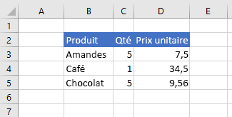
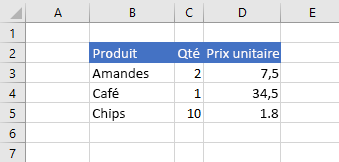
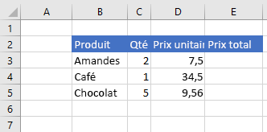
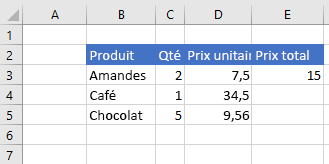
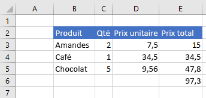

# <a name="set-and-get-range-values-text-or-formulas-using-the-excel-javascript-api"></a><span data-ttu-id="5a9fa-103">Définir et obtenir des valeurs de plage, du texte ou des formules à l’aide Excel API JavaScript</span><span class="sxs-lookup"><span data-stu-id="5a9fa-103">Set and get range values, text, or formulas using the Excel JavaScript API</span></span>

<span data-ttu-id="5a9fa-104">Cet article fournit des exemples de code qui définissent et obtiennent des valeurs de plage, du texte ou des formules avec Excel API JavaScript.</span><span class="sxs-lookup"><span data-stu-id="5a9fa-104">This article provides code samples that set and get range values, text, or formulas with the Excel JavaScript API.</span></span> <span data-ttu-id="5a9fa-105">Pour obtenir la liste complète des propriétés et méthodes que l’objet prend en `Range` charge, [voir Excel. Classe Range](/javascript/api/excel/excel.range).</span><span class="sxs-lookup"><span data-stu-id="5a9fa-105">For the complete list of properties and methods that the `Range` object supports, see [Excel.Range class](/javascript/api/excel/excel.range).</span></span>

[!include[Excel cells and ranges note](../includes/note-excel-cells-and-ranges.md)]

## <a name="set-values-or-formulas"></a><span data-ttu-id="5a9fa-106">Définir des valeurs ou des formules</span><span class="sxs-lookup"><span data-stu-id="5a9fa-106">Set values or formulas</span></span>

<span data-ttu-id="5a9fa-107">Les exemples de code suivants définissent des valeurs et des formules pour une seule cellule ou une plage de cellules.</span><span class="sxs-lookup"><span data-stu-id="5a9fa-107">The following code samples set values and formulas for a single cell or a range of cells.</span></span>

### <a name="set-value-for-a-single-cell"></a><span data-ttu-id="5a9fa-108">Définir une valeur pour une cellule unique</span><span class="sxs-lookup"><span data-stu-id="5a9fa-108">Set value for a single cell</span></span>

<span data-ttu-id="5a9fa-109">L’exemple de code suivant définit la valeur de la cellule **C3** sur « 5 », puis définit la largeur des colonnes pour mieux s’adapter aux données.</span><span class="sxs-lookup"><span data-stu-id="5a9fa-109">The following code sample sets the value of cell **C3** to "5" and then sets the width of the columns to best fit the data.</span></span>

```js
Excel.run(function (context) {
    var sheet = context.workbook.worksheets.getItem("Sample");

    var range = sheet.getRange("C3");
    range.values = [[ 5 ]];
    range.format.autofitColumns();

    return context.sync();
}).catch(errorHandlerFunction);
```

#### <a name="data-before-cell-value-is-updated"></a><span data-ttu-id="5a9fa-110">Données avant la mise à jour de la valeur de la cellule</span><span class="sxs-lookup"><span data-stu-id="5a9fa-110">Data before cell value is updated</span></span>


#### <a name="data-after-cell-value-is-updated"></a><span data-ttu-id="5a9fa-112">Données après la mise à jour de la valeur de la cellule</span><span class="sxs-lookup"><span data-stu-id="5a9fa-112">Data after cell value is updated</span></span>



### <a name="set-values-for-a-range-of-cells"></a><span data-ttu-id="5a9fa-114">Définir des valeurs pour une plage de cellules</span><span class="sxs-lookup"><span data-stu-id="5a9fa-114">Set values for a range of cells</span></span>

<span data-ttu-id="5a9fa-115">L’exemple de code suivant définit les valeurs des cellules de la plage **B5:D5**, puis définit la largeur des colonnes pour mieux s’adapter aux données.</span><span class="sxs-lookup"><span data-stu-id="5a9fa-115">The following code sample sets values for the cells in the range **B5:D5** and then sets the width of the columns to best fit the data.</span></span>

```js
Excel.run(function (context) {
    var sheet = context.workbook.worksheets.getItem("Sample");

    var data = [
        ["Potato Chips", 10, 1.80],
    ];

    var range = sheet.getRange("B5:D5");
    range.values = data;
    range.format.autofitColumns();

    return context.sync();
}).catch(errorHandlerFunction);
```

#### <a name="data-before-cell-values-are-updated"></a><span data-ttu-id="5a9fa-116">Données avant la mise à jour des valeurs des cellules</span><span class="sxs-lookup"><span data-stu-id="5a9fa-116">Data before cell values are updated</span></span>


#### <a name="data-after-cell-values-are-updated"></a><span data-ttu-id="5a9fa-118">Données après la mise à jour des valeurs des cellules</span><span class="sxs-lookup"><span data-stu-id="5a9fa-118">Data after cell values are updated</span></span>



### <a name="set-formula-for-a-single-cell"></a><span data-ttu-id="5a9fa-120">Définir la formule d’une cellule unique</span><span class="sxs-lookup"><span data-stu-id="5a9fa-120">Set formula for a single cell</span></span>

<span data-ttu-id="5a9fa-121">L’exemple de code suivant définit une formule pour la cellule **E3**, puis définit la largeur des colonnes pour mieux s’adapter aux données.</span><span class="sxs-lookup"><span data-stu-id="5a9fa-121">The following code sample sets a formula for cell **E3** and then sets the width of the columns to best fit the data.</span></span>

```js
Excel.run(function (context) {
    var sheet = context.workbook.worksheets.getItem("Sample");

    var range = sheet.getRange("E3");
    range.formulas = [[ "=C3 * D3" ]];
    range.format.autofitColumns();

    return context.sync();
}).catch(errorHandlerFunction);
```

#### <a name="data-before-cell-formula-is-set"></a><span data-ttu-id="5a9fa-122">Données avant la définition de la formule de la cellule</span><span class="sxs-lookup"><span data-stu-id="5a9fa-122">Data before cell formula is set</span></span>



#### <a name="data-after-cell-formula-is-set"></a><span data-ttu-id="5a9fa-124">Données après la définition de la formule de la cellule</span><span class="sxs-lookup"><span data-stu-id="5a9fa-124">Data after cell formula is set</span></span>



### <a name="set-formulas-for-a-range-of-cells"></a><span data-ttu-id="5a9fa-126">Définir des formules pour une plage de cellules</span><span class="sxs-lookup"><span data-stu-id="5a9fa-126">Set formulas for a range of cells</span></span>

<span data-ttu-id="5a9fa-127">L’exemple de code ci-dessous définit des formules pour les cellules de la plage **E2:E6**, puis définit la largeur des colonnes pour mieux s’adapter aux données.</span><span class="sxs-lookup"><span data-stu-id="5a9fa-127">The following code sample sets formulas for cells in the range **E2:E6** and then sets the width of the columns to best fit the data.</span></span>

```js
Excel.run(function (context) {
    var sheet = context.workbook.worksheets.getItem("Sample");

    var data = [
        ["=C3 * D3"],
        ["=C4 * D4"],
        ["=C5 * D5"],
        ["=SUM(E3:E5)"]
    ];

    var range = sheet.getRange("E3:E6");
    range.formulas = data;
    range.format.autofitColumns();

    return context.sync();
}).catch(errorHandlerFunction);
```

#### <a name="data-before-cell-formulas-are-set"></a><span data-ttu-id="5a9fa-128">Données avant la définition des formules des cellules</span><span class="sxs-lookup"><span data-stu-id="5a9fa-128">Data before cell formulas are set</span></span>


#### <a name="data-after-cell-formulas-are-set"></a><span data-ttu-id="5a9fa-130">Données après la définition des formules des cellules</span><span class="sxs-lookup"><span data-stu-id="5a9fa-130">Data after cell formulas are set</span></span>



## <a name="get-values-text-or-formulas"></a><span data-ttu-id="5a9fa-132">Obtenir des valeurs, du texte ou des formules</span><span class="sxs-lookup"><span data-stu-id="5a9fa-132">Get values, text, or formulas</span></span>

<span data-ttu-id="5a9fa-133">Ces exemples de code obtiennent des valeurs, du texte et des formules à partir d’une plage de cellules.</span><span class="sxs-lookup"><span data-stu-id="5a9fa-133">These code samples get values, text, and formulas from a range of cells.</span></span>

### <a name="get-values-from-a-range-of-cells"></a><span data-ttu-id="5a9fa-134">Obtenir des valeurs à partir d’une plage de cellules</span><span class="sxs-lookup"><span data-stu-id="5a9fa-134">Get values from a range of cells</span></span>

<span data-ttu-id="5a9fa-135">L’exemple de code suivant obtient la plage **B2:E6,** charge sa propriété et écrit les `values` valeurs dans la console.</span><span class="sxs-lookup"><span data-stu-id="5a9fa-135">The following code sample gets the range **B2:E6**, loads its `values` property, and writes the values to the console.</span></span> <span data-ttu-id="5a9fa-136">La `values` propriété d’une plage spécifie les valeurs brutes que contiennent les cellules.</span><span class="sxs-lookup"><span data-stu-id="5a9fa-136">The `values` property of a range specifies the raw values that the cells contain.</span></span> <span data-ttu-id="5a9fa-137">Même si certaines cellules d’une plage contiennent des formules, la propriété de la plage spécifie les valeurs brutes de ces cellules, et non l’une `values` des formules.</span><span class="sxs-lookup"><span data-stu-id="5a9fa-137">Even if some cells in a range contain formulas, the `values` property of the range specifies the raw values for those cells, not any of the formulas.</span></span>

```js
Excel.run(function (context) {
    var sheet = context.workbook.worksheets.getItem("Sample");
    var range = sheet.getRange("B2:E6");
    range.load("values");

    return context.sync()
        .then(function () {
            console.log(JSON.stringify(range.values, null, 4));
        });
}).catch(errorHandlerFunction);
```

#### <a name="data-in-range-values-in-column-e-are-a-result-of-formulas"></a><span data-ttu-id="5a9fa-138">Données de la plage (les valeurs de la colonne E sont le résultat des formules)</span><span class="sxs-lookup"><span data-stu-id="5a9fa-138">Data in range (values in column E are a result of formulas)</span></span>


#### <a name="rangevalues-as-logged-to-the-console-by-the-code-sample-above"></a><span data-ttu-id="5a9fa-140">range.values (comme consigné dans la console par l’exemple de code ci-dessus)</span><span class="sxs-lookup"><span data-stu-id="5a9fa-140">range.values (as logged to the console by the code sample above)</span></span>

```json
[
    [
        "Product",
        "Qty",
        "Unit Price",
        "Total Price"
    ],
    [
        "Almonds",
        2,
        7.5,
        15
    ],
    [
        "Coffee",
        1,
        34.5,
        34.5
    ],
    [
        "Chocolate",
        5,
        9.56,
        47.8
    ],
    [
        "",
        "",
        "",
        97.3
    ]
]
```

### <a name="get-text-from-a-range-of-cells"></a><span data-ttu-id="5a9fa-141">Obtenir du texte à partir d’une plage de cellules</span><span class="sxs-lookup"><span data-stu-id="5a9fa-141">Get text from a range of cells</span></span>

<span data-ttu-id="5a9fa-142">L’exemple de code suivant obtient la plage **B2:E6,** charge sa propriété `text` et l’écrit dans la console.</span><span class="sxs-lookup"><span data-stu-id="5a9fa-142">The following code sample gets the range **B2:E6**, loads its `text` property, and writes it to the console.</span></span> <span data-ttu-id="5a9fa-143">La `text` propriété d’une plage spécifie les valeurs d’affichage des cellules de la plage.</span><span class="sxs-lookup"><span data-stu-id="5a9fa-143">The `text` property of a range specifies the display values for cells in the range.</span></span> <span data-ttu-id="5a9fa-144">Même si certaines cellules d’une plage contiennent des formules, la propriété de la plage spécifie les valeurs d’affichage de ces cellules, et non des `text` formules.</span><span class="sxs-lookup"><span data-stu-id="5a9fa-144">Even if some cells in a range contain formulas, the `text` property of the range specifies the display values for those cells, not any of the formulas.</span></span>

```js
Excel.run(function (context) {
    var sheet = context.workbook.worksheets.getItem("Sample");
    var range = sheet.getRange("B2:E6");
    range.load("text");

    return context.sync()
        .then(function () {
            console.log(JSON.stringify(range.text, null, 4));
        });
}).catch(errorHandlerFunction);
```

#### <a name="data-in-range-values-in-column-e-are-a-result-of-formulas"></a><span data-ttu-id="5a9fa-145">Données de la plage (les valeurs de la colonne E sont le résultat des formules)</span><span class="sxs-lookup"><span data-stu-id="5a9fa-145">Data in range (values in column E are a result of formulas)</span></span>


#### <a name="rangetext-as-logged-to-the-console-by-the-code-sample-above"></a><span data-ttu-id="5a9fa-147">range.text (comme consigné dans la console par l’exemple de code ci-dessus)</span><span class="sxs-lookup"><span data-stu-id="5a9fa-147">range.text (as logged to the console by the code sample above)</span></span>

```json
[
    [
        "Product",
        "Qty",
        "Unit Price",
        "Total Price"
    ],
    [
        "Almonds",
        "2",
        "7.5",
        "15"
    ],
    [
        "Coffee",
        "1",
        "34.5",
        "34.5"
    ],
    [
        "Chocolate",
        "5",
        "9.56",
        "47.8"
    ],
    [
        "",
        "",
        "",
        "97.3"
    ]
]
```

### <a name="get-formulas-from-a-range-of-cells"></a><span data-ttu-id="5a9fa-148">Obtenir des formules à partir d’une plage de cellules</span><span class="sxs-lookup"><span data-stu-id="5a9fa-148">Get formulas from a range of cells</span></span>

<span data-ttu-id="5a9fa-149">L’exemple de code suivant obtient la plage **B2:E6,** charge sa propriété `formulas` et l’écrit dans la console.</span><span class="sxs-lookup"><span data-stu-id="5a9fa-149">The following code sample gets the range **B2:E6**, loads its `formulas` property, and writes it to the console.</span></span> <span data-ttu-id="5a9fa-150">La propriété d’une plage spécifie les formules des cellules de la plage qui contiennent des formules et les valeurs brutes des cellules de la plage qui ne contiennent pas `formulas` de formules.</span><span class="sxs-lookup"><span data-stu-id="5a9fa-150">The `formulas` property of a range specifies the formulas for cells in the range that contain formulas and the raw values for cells in the range that do not contain formulas.</span></span>

```js
Excel.run(function (context) {
    var sheet = context.workbook.worksheets.getItem("Sample");
    var range = sheet.getRange("B2:E6");
    range.load("formulas");

    return context.sync()
        .then(function () {
            console.log(JSON.stringify(range.formulas, null, 4));
        });
}).catch(errorHandlerFunction);
```

#### <a name="data-in-range-values-in-column-e-are-a-result-of-formulas"></a><span data-ttu-id="5a9fa-151">Données de la plage (les valeurs de la colonne E sont le résultat des formules)</span><span class="sxs-lookup"><span data-stu-id="5a9fa-151">Data in range (values in column E are a result of formulas)</span></span>


#### <a name="rangeformulas-as-logged-to-the-console-by-the-code-sample-above"></a><span data-ttu-id="5a9fa-153">range.formulas (comme consigné dans la console par l’exemple de code ci-dessus)</span><span class="sxs-lookup"><span data-stu-id="5a9fa-153">range.formulas (as logged to the console by the code sample above)</span></span>

```json
[
    [
        "Product",
        "Qty",
        "Unit Price",
        "Total Price"
    ],
    [
        "Almonds",
        2,
        7.5,
        "=C3 * D3"
    ],
    [
        "Coffee",
        1,
        34.5,
        "=C4 * D4"
    ],
    [
        "Chocolate",
        5,
        9.56,
        "=C5 * D5"
    ],
    [
        "",
        "",
        "",
        "=SUM(E3:E5)"
    ]
]
```

## <a name="see-also"></a><span data-ttu-id="5a9fa-154">Voir aussi</span><span class="sxs-lookup"><span data-stu-id="5a9fa-154">See also</span></span>

- [<span data-ttu-id="5a9fa-155">Modèle d’objet JavaScript Excel dans les compléments Office</span><span class="sxs-lookup"><span data-stu-id="5a9fa-155">Excel JavaScript object model in Office Add-ins</span></span>](excel-add-ins-core-concepts.md)
- [<span data-ttu-id="5a9fa-156">Utiliser des cellules à l’aide de Excel API JavaScript</span><span class="sxs-lookup"><span data-stu-id="5a9fa-156">Work with cells using the Excel JavaScript API</span></span>](excel-add-ins-cells.md)
- [<span data-ttu-id="5a9fa-157">Définir et obtenir des plages à l’aide de Excel API JavaScript</span><span class="sxs-lookup"><span data-stu-id="5a9fa-157">Set and get ranges using the Excel JavaScript API</span></span>](excel-add-ins-ranges-set-get.md)
- [<span data-ttu-id="5a9fa-158">Définir le format de plage à l’aide Excel API JavaScript</span><span class="sxs-lookup"><span data-stu-id="5a9fa-158">Set range format using the Excel JavaScript API</span></span>](excel-add-ins-ranges-set-format.md)
