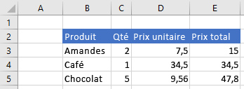
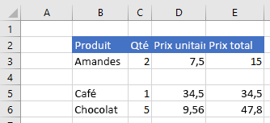
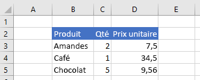
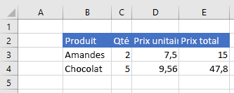
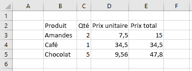
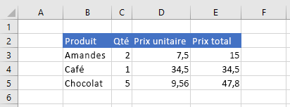
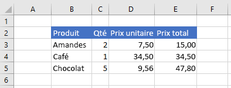

# <a name="work-with-ranges-using-the-excel-javascript-api"></a>Utilisation de plages à l’aide de l’API JavaScript pour Excel

Cet article fournit des exemples de code qui expliquent comment effectuer des tâches courantes avec des plages à l’aide de l’API JavaScript pour Excel. Pour obtenir la liste complète des propriétés et des méthodes `Range` prises en charge par l’objet, reportez-vous à la rubrique [objet Range (interface API JavaScript pour Excel)](/javascript/api/excel/excel.range).

> [!NOTE]
> Pour plus d’exemples de code qui montrent comment effectuer des tâches plus avancées avec des plages, consultez l’article [Utiliser les plages à l’aide de l’API JavaScript Excel (avancé)](excel-add-ins-ranges-advanced.md).

## <a name="get-a-range"></a>Obtenir une plage

Les exemples suivants montrent les différentes façons d’obtenir une référence à une plage dans une feuille de calcul.

### <a name="get-range-by-address"></a>Obtenir une plage en fonction d’une adresse

L’exemple de code suivant obtient la plage avec l’adresse **B2 : C5** à partir de la feuille de calcul nommée **Sample**, charge sa `address` propriété et écrit un message dans la console.

```js
Excel.run(function (context) {
    var sheet = context.workbook.worksheets.getItem("Sample");
    var range = sheet.getRange("B2:C5");
    range.load("address");

    return context.sync()
        .then(function () {
            console.log(`The address of the range B2:C5 is "${range.address}"`);
        });
}).catch(errorHandlerFunction);
```

### <a name="get-range-by-name"></a>Obtenir une plage en fonction d’un nom

L’exemple de code suivant obtient la plage nommée `MyRange` à partir de la feuille de calcul nommée **Sample**, charge sa `address` propriété et écrit un message dans la console.

```js
Excel.run(function (context) {
    var sheet = context.workbook.worksheets.getItem("Sample");
    var range = sheet.getRange("MyRange");
    range.load("address");

    return context.sync()
        .then(function () {
            console.log(`The address of the range "MyRange" is "${range.address}"`);
        });
}).catch(errorHandlerFunction);
```

### <a name="get-used-range"></a>Obtenir une plage utilisée

L’exemple de code suivant obtient la plage utilisée à partir de la feuille de calcul nommée **Sample**, charge sa `address` propriété et écrit un message dans la console. La plage utilisée est la plus petite plage qui englobe toutes les cellules de la feuille de calcul auxquelles une valeur ou un format est affecté. Si la feuille de calcul entière est vide, la `getUsedRange()` méthode renvoie une plage qui se compose uniquement de la cellule supérieure gauche de la feuille de calcul.

```js
Excel.run(function (context) {
    var sheet = context.workbook.worksheets.getItem("Sample");
    var range = sheet.getUsedRange();
    range.load("address");

    return context.sync()
        .then(function () {
            console.log(`The address of the used range in the worksheet is "${range.address}"`);
        });
}).catch(errorHandlerFunction);
```

### <a name="get-entire-range"></a>Obtenir l’intégralité d’une plage

L’exemple de code suivant obtient la plage entière de la feuille de calcul à partir de la feuille de calcul nommée **Sample**, charge sa `address` propriété et écrit un message dans la console.

```js
Excel.run(function (context) {
    var sheet = context.workbook.worksheets.getItem("Sample");
    var range = sheet.getRange();
    range.load("address");

    return context.sync()
        .then(function () {
            console.log(`The address of the entire worksheet range is "${range.address}"`);
        });
}).catch(errorHandlerFunction);
```

## <a name="insert-a-range-of-cells"></a>Insérer une plage de cellules

L’exemple de code suivant insère une plage de cellules dans l’emplacement **B4:E4** et déplace les autres cellules vers le bas pour laisser de l’espace pour les nouvelles cellules.

```js
Excel.run(function (context) {
    var sheet = context.workbook.worksheets.getItem("Sample");
    var range = sheet.getRange("B4:E4");

    range.insert(Excel.InsertShiftDirection.down);
    
    return context.sync();
}).catch(errorHandlerFunction);
```

**Données avant l’insertion de la plage**



**Données après l’insertion de la plage**



## <a name="clear-a-range-of-cells"></a>Effacer une plage de cellules

L’exemple de code suivant efface tout le contenu et la mise en forme des cellules de la plage **E2 : E5**.  

```js
Excel.run(function (context) {
    var sheet = context.workbook.worksheets.getItem("Sample");
    var range = sheet.getRange("E2:E5");

    range.clear();

    return context.sync();
}).catch(errorHandlerFunction);
```

**Données avant l’effacement de la plage**


**Données après l’effacement de plage**



## <a name="delete-a-range-of-cells"></a>Supprimer une plage de cellules

L’exemple de code suivant supprime les cellules de la plage **B4:E4** et déplace les autres cellules vers le haut pour remplir l’espace libre suite à la suppression des cellules.

```js
Excel.run(function (context) {
    var sheet = context.workbook.worksheets.getItem("Sample");
    var range = sheet.getRange("B4:E4");

    range.delete(Excel.DeleteShiftDirection.up);

    return context.sync();
}).catch(errorHandlerFunction);
```

**Données avant la suppression d’une plage**


**Données après la suppression d’une plage**



## <a name="set-the-selected-range"></a>Définir la plage sélectionnée

L’exemple de code suivant sélectionne la plage **B2:E6** dans la feuille de calcul active.

```js
Excel.run(function (context) {
    var sheet = context.workbook.worksheets.getActiveWorksheet();
    var range = sheet.getRange("B2:E6");

    range.select();

    return context.sync();
}).catch(errorHandlerFunction);
```

**Plage sélectionnée  B2:E6**


## <a name="get-the-selected-range"></a>Obtenir la plage sélectionnée

L’exemple de code suivant obtient la plage sélectionnée, charge sa `address` propriété et écrit un message dans la console. 

```js
Excel.run(function (context) {
    var range = context.workbook.getSelectedRange();
    range.load("address");

    return context.sync()
        .then(function () {
            console.log(`The address of the selected range is "${range.address}"`);
        });
}).catch(errorHandlerFunction);
```

## <a name="set-values-or-formulas"></a>Définir des valeurs ou des formules

Les exemples suivants indiquent comment définir des valeurs et des formules pour une cellule unique ou une plage de cellules.

### <a name="set-value-for-a-single-cell"></a>Définir une valeur pour une cellule unique

L’exemple de code suivant définit la valeur de la cellule **C3** sur « 5 », puis définit la largeur des colonnes pour mieux s’adapter aux données.

```js
Excel.run(function (context) {
    var sheet = context.workbook.worksheets.getItem("Sample");

    var range = sheet.getRange("C3");
    range.values = [[ 5 ]];
    range.format.autofitColumns();

    return context.sync();
}).catch(errorHandlerFunction);
```

**Données avant la mise à jour de la valeur de la cellule**


**Données après la mise à jour de la valeur de la cellule**


### <a name="set-values-for-a-range-of-cells"></a>Définir des valeurs pour une plage de cellules

L’exemple de code suivant définit les valeurs des cellules de la plage **B5:D5**, puis définit la largeur des colonnes pour mieux s’adapter aux données.

```js
Excel.run(function (context) {
    var sheet = context.workbook.worksheets.getItem("Sample");

    var data = [
        ["Potato Chips", 10, 1.80],
    ];
    
    var range = sheet.getRange("B5:D5");
    range.values = data;
    range.format.autofitColumns();

    return context.sync();
}).catch(errorHandlerFunction);
```

**Données avant la mise à jour des valeurs des cellules**


**Données après la mise à jour des valeurs des cellules**


### <a name="set-formula-for-a-single-cell"></a>Définir la formule d’une cellule unique

L’exemple de code suivant définit une formule pour la cellule **E3**, puis définit la largeur des colonnes pour mieux s’adapter aux données.

```js
Excel.run(function (context) {
    var sheet = context.workbook.worksheets.getItem("Sample");

    var range = sheet.getRange("E3");
    range.formulas = [[ "=C3 * D3" ]];
    range.format.autofitColumns();

    return context.sync();
}).catch(errorHandlerFunction);
```

**Données avant la définition de la formule de la cellule**


**Données après la définition de la formule de la cellule**


### <a name="set-formulas-for-a-range-of-cells"></a>Définir des formules pour une plage de cellules

L’exemple de code ci-dessous définit des formules pour les cellules de la plage **E2:E6**, puis définit la largeur des colonnes pour mieux s’adapter aux données.

```js
Excel.run(function (context) {
    var sheet = context.workbook.worksheets.getItem("Sample");

    var data = [
        ["=C3 * D3"],
        ["=C4 * D4"],
        ["=C5 * D5"],
        ["=SUM(E3:E5)"]
    ];
    
    var range = sheet.getRange("E3:E6");
    range.formulas = data;
    range.format.autofitColumns();

    return context.sync();
}).catch(errorHandlerFunction);
```

**Données avant la définition des formules des cellules**


**Données après la définition des formules des cellules**


## <a name="get-values-text-or-formulas"></a>Obtenir des valeurs, du texte ou des formules

Ces exemples montrent comment obtenir des valeurs, du texte et des formules à partir d’une plage de cellules.

### <a name="get-values-from-a-range-of-cells"></a>Obtenir des valeurs à partir d’une plage de cellules

L’exemple de code suivant obtient la plage **B2 : E6**, charge sa `values` propriété et écrit les valeurs dans la console. La `values` propriété d’une plage spécifie les valeurs brutes contenues dans les cellules. Même si certaines cellules d’une plage contiennent des formules, la `values` propriété de la plage spécifie les valeurs brutes de ces cellules, pas les formules.

```js
Excel.run(function (context) {
    var sheet = context.workbook.worksheets.getItem("Sample");
    var range = sheet.getRange("B2:E6");
    range.load("values");

    return context.sync()
        .then(function () {
            console.log(JSON.stringify(range.values, null, 4));
        });
}).catch(errorHandlerFunction);
```

**Données de la plage (les valeurs de la colonne E sont le résultat des formules)**


**range.values (comme consigné dans la console par l’exemple de code ci-dessus)**

```json
[
    [
        "Product",
        "Qty",
        "Unit Price",
        "Total Price"
    ],
    [
        "Almonds",
        2,
        7.5,
        15
    ],
    [
        "Coffee",
        1,
        34.5,
        34.5
    ],
    [
        "Chocolate",
        5,
        9.56,
        47.8
    ],
    [
        "",
        "",
        "",
        97.3
    ]
]
```

### <a name="get-text-from-a-range-of-cells"></a>Obtenir du texte à partir d’une plage de cellules

L’exemple de code suivant obtient la plage **B2 : E6**, charge sa `text` propriété et l’écrit dans la console. La `text` propriété d’une plage spécifie les valeurs d’affichage pour les cellules de la plage. Même si certaines cellules d’une plage contiennent des formules, la `text` propriété de la plage spécifie les valeurs d’affichage de ces cellules, et non des formules.

```js
Excel.run(function (context) {
    var sheet = context.workbook.worksheets.getItem("Sample");
    var range = sheet.getRange("B2:E6");
    range.load("text");

    return context.sync()
        .then(function () {
            console.log(JSON.stringify(range.text, null, 4));
        });
}).catch(errorHandlerFunction);
```

**Données de la plage (les valeurs de la colonne E sont le résultat des formules)**


**range.text (comme consigné dans la console par l’exemple de code ci-dessus)**

```json
[
    [
        "Product",
        "Qty",
        "Unit Price",
        "Total Price"
    ],
    [
        "Almonds",
        "2",
        "7.5",
        "15"
    ],
    [
        "Coffee",
        "1",
        "34.5",
        "34.5"
    ],
    [
        "Chocolate",
        "5",
        "9.56",
        "47.8"
    ],
    [
        "",
        "",
        "",
        "97.3"
    ]
]
```

### <a name="get-formulas-from-a-range-of-cells"></a>Obtenir des formules à partir d’une plage de cellules

L’exemple de code suivant obtient la plage **B2 : E6**, charge sa `formulas` propriété et l’écrit dans la console. La `formulas` propriété d’une plage spécifie les formules pour les cellules de la plage qui contiennent des formules et les valeurs brutes pour les cellules de la plage qui ne contiennent pas de formules.

```js
Excel.run(function (context) {
    var sheet = context.workbook.worksheets.getItem("Sample");
    var range = sheet.getRange("B2:E6");
    range.load("formulas");

    return context.sync()
        .then(function () {
            console.log(JSON.stringify(range.formulas, null, 4));
        });
}).catch(errorHandlerFunction);
```

**Données de la plage (les valeurs de la colonne E sont le résultat des formules)**


**range.formulas (comme consigné dans la console par l’exemple de code ci-dessus)**

```json
[
    [
        "Product",
        "Qty",
        "Unit Price",
        "Total Price"
    ],
    [
        "Almonds",
        2,
        7.5,
        "=C3 * D3"
    ],
    [
        "Coffee",
        1,
        34.5,
        "=C4 * D4"
    ],
    [
        "Chocolate",
        5,
        9.56,
        "=C5 * D5"
    ],
    [
        "",
        "",
        "",
        "=SUM(E3:E5)"
    ]
]
```

## <a name="set-range-format"></a>Définir le format de plage

Les exemples ci-dessous indiquent comment définir la couleur de police, la couleur de remplissage et le format de nombre pour des cellules dans une plage.

### <a name="set-font-color-and-fill-color"></a>Définir la couleur de police et la couleur de remplissage

L’exemple de code ci-dessous définit la couleur de police et la couleur de remplissage des cellules de la plage **B2:E2**.

```js
Excel.run(function (context) {
    var sheet = context.workbook.worksheets.getItem("Sample");

    var range = sheet.getRange("B2:E2");
    range.format.fill.color = "#4472C4";
    range.format.font.color = "white";

    return context.sync();
}).catch(errorHandlerFunction);
```

**Données de la plage avant la définition de la couleur de police et de la couleur de remplissage**



**Données de la plage après la définition de la couleur de police et de la couleur de remplissage**



### <a name="set-number-format"></a>Définir le format de nombre

L’exemple de code ci-dessous définit le format de nombre des cellules dans la plage **D3:E5**.

```js
Excel.run(function (context) {
    var sheet = context.workbook.worksheets.getItem("Sample");

    var formats = [
        ["0.00", "0.00"],
        ["0.00", "0.00"],
        ["0.00", "0.00"]
    ];

    var range = sheet.getRange("D3:E5");
    range.numberFormat = formats;

    return context.sync();
}).catch(errorHandlerFunction);
```

**Données de la plage avant la définition du format de nombre**


**Données de la plage après la définition du format de nombre**



### <a name="conditional-formatting-of-ranges"></a>Mise en forme conditionnelle de plages

Des plages peuvent présenter une mise en forme de cellules individuelles en fonction de certaines conditions. Pour plus d’informations à ce sujet, consultez l’article [Appliquer une mise en forme conditionnelle à des plages Excel](excel-add-ins-conditional-formatting.md).

## <a name="find-a-cell-using-string-matching"></a>Rechercher une cellule en utilisant la correspondance de chaîne

L’objet `Range` dispose d’une méthode`find` pour rechercher une chaîne spécifiée dans la plage. Elle renvoie la plage de la première cellule avec le texte correspondant. L’exemple de code suivant trouve la première cellule contenant une valeur égale à la chaîne **Nourriture** et connecte son adresse à la console. Notez que `find` génère une erreur `ItemNotFound` si la chaîne spécifiée n’existe pas dans la plage. Si vous pensez que la chaîne spécifiée peut ne pas exister dans la plage, utilisez la méthode[findAllOrNullObject](excel-add-ins-advanced-concepts.md#ornullobject-methods) à la place, pour que votre code gère ce scénario plus facilement.

```js
Excel.run(function (context) {
    var sheet = context.workbook.worksheets.getItem("Sample");
    var table = sheet.tables.getItem("ExpensesTable");
    var searchRange = table.getRange();
    var foundRange = searchRange.find("Food", {
        completeMatch: true, // find will match the whole cell value
        matchCase: false, // find will not match case
        searchDirection: Excel.SearchDirection.forward // find will start searching at the beginning of the range
    });

    foundRange.load("address");
    return context.sync()
        .then(function() {
            console.log(foundRange.address);
    });
}).catch(errorHandlerFunction);
```

Lorsque la méthode `find` est appelée sur une plage représentant une cellule simple, la feuille de calcul entière est recherchée. La recherche commence à cette cellule et continue dans la direction spécifiée par `SearchCriteria.searchDirection`, revenant à la ligne à la fin de la feuille de calcul si nécessaire.

## <a name="see-also"></a>Voir aussi

- [Utiliser les plages à l’aide de l’API JavaScript Excel (avancé)](excel-add-ins-ranges-advanced.md)
- [Concepts fondamentaux de programmation avec l’API JavaScript pour Excel](excel-add-ins-core-concepts.md)
