# <a name="work-with-tables-using-the-excel-javascript-api"></a>Utilisation de tableaux à l’aide de l’API JavaScript pour Excel

Cet article fournit des exemples de code qui expliquent comment effectuer des tâches courantes avec des tableaux à l’aide de l’API JavaScript pour Excel. Pour obtenir une liste complète des propriétés et des méthodes prises en charge par les objets **Table** et **TableCollection**, reportez-vous à la rubrique [Objet Table (API JavaScript pour Excel)](/javascript/api/excel/excel.table) et [Objet TableCollection (API JavaScript pour Excel)](/javascript/api/excel/excel.tablecollection).

## <a name="create-a-table"></a>Créer un tableau

L’exemple de code suivant crée un tableau dans la feuille de calcul nommée **Sample**. Le tableau comporte des en-têtes et contient quatre colonnes et sept lignes de données. Si l’application hôte Excel dans laquelle le code est en cours d’exécution prend en charge [l’ensemble de conditions requises](/office/dev/add-ins/reference/requirement-sets/excel-api-requirement-sets) **ExcelApi 1.2**, la largeur des colonnes et la hauteur des lignes sont définies pour s’ajuster au mieux aux données actuelles du tableau.

> [!NOTE]
> Pour spécifier le nom d’un tableau, vous devez d’abord créer le tableau, puis définir sa propriété **name**, comme indiqué dans l’exemple ci-dessous.

```js
Excel.run(function (context) {
    var sheet = context.workbook.worksheets.getItem("Sample");
    var expensesTable = sheet.tables.add("A1:D1", true /*hasHeaders*/);
    expensesTable.name = "ExpensesTable";

    expensesTable.getHeaderRowRange().values = [["Date", "Merchant", "Category", "Amount"]];

    expensesTable.rows.add(null /*add rows to the end of the table*/, [
        ["1/1/2017", "The Phone Company", "Communications", "$120"],
        ["1/2/2017", "Northwind Electric Cars", "Transportation", "$142"],
        ["1/5/2017", "Best For You Organics Company", "Groceries", "$27"],
        ["1/10/2017", "Coho Vineyard", "Restaurant", "$33"],
        ["1/11/2017", "Bellows College", "Education", "$350"],
        ["1/15/2017", "Trey Research", "Other", "$135"],
        ["1/15/2017", "Best For You Organics Company", "Groceries", "$97"]
    ]);

    if (Office.context.requirements.isSetSupported("ExcelApi", 1.2)) {
        sheet.getUsedRange().format.autofitColumns();
        sheet.getUsedRange().format.autofitRows();
    }

    sheet.activate();

    return context.sync();
}).catch(errorHandlerFunction);
```

**Nouveau tableau**

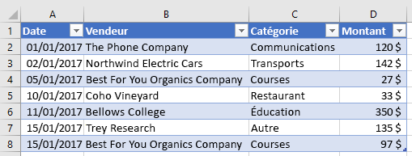

## <a name="add-rows-to-a-table"></a>Ajouter des lignes dans un tableau

L’exemple de code suivant ajoute sept nouvelles lignes au tableau nommé **ExpensesTable** au sein de la feuille de calcul **Sample**. Les nouvelles lignes sont ajoutées à la fin du tableau. Si l’application hôte Excel dans laquelle le code est en cours d’exécution prend en charge [l’ensemble de conditions requises](/office/dev/add-ins/reference/requirement-sets/excel-api-requirement-sets) **ExcelApi 1.2**, la largeur des colonnes et la hauteur des lignes sont définies pour s’ajuster au mieux aux données actuelles du tableau.

> [!NOTE]
> La propriété **index** d’un objet [TableRow](/javascript/api/excel/excel.tablerow) indique le numéro d’index de la ligne dans la collection de lignes du tableau. Un objet **TableRow** ne contient pas de propriété **id** qui peut être utilisée comme clé unique pour identifier la ligne.

```js
Excel.run(function (context) {
    var sheet = context.workbook.worksheets.getItem("Sample");
    var expensesTable = sheet.tables.getItem("ExpensesTable");

    expensesTable.rows.add(null /*add rows to the end of the table*/, [
        ["1/16/2017", "THE PHONE COMPANY", "Communications", "$120"],
        ["1/20/2017", "NORTHWIND ELECTRIC CARS", "Transportation", "$142"],
        ["1/20/2017", "BEST FOR YOU ORGANICS COMPANY", "Groceries", "$27"],
        ["1/21/2017", "COHO VINEYARD", "Restaurant", "$33"],
        ["1/25/2017", "BELLOWS COLLEGE", "Education", "$350"],
        ["1/28/2017", "TREY RESEARCH", "Other", "$135"],
        ["1/31/2017", "BEST FOR YOU ORGANICS COMPANY", "Groceries", "$97"]
    ]);

    if (Office.context.requirements.isSetSupported("ExcelApi", 1.2)) {
        sheet.getUsedRange().format.autofitColumns();
        sheet.getUsedRange().format.autofitRows();
    }

    return context.sync();
}).catch(errorHandlerFunction);
```

**Tableau avec de nouvelles lignes**

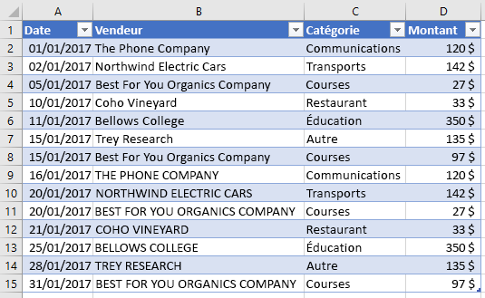

## <a name="add-a-column-to-a-table"></a>Ajouter une colonne à un tableau

Ces exemples montrent comment ajouter une colonne à un tableau. Le premier exemple remplit la nouvelle colonne avec des valeurs statiques ; le second exemple remplit la nouvelle colonne avec des formules.

> [!NOTE]
> La propriété **index** d’un objet [TableColumn](/javascript/api/excel/excel.tablecolumn) indique le numéro d’index de la colonne dans la collection de colonnes du tableau. La propriété **id** d’un objet **TableColumn** contient une clé unique qui identifie la colonne.

### <a name="add-a-column-that-contains-static-values"></a>Ajouter une colonne qui contient des valeurs statiques

L’exemple de code suivant ajoute une nouvelle colonne à la table nommée **ExpensesTable** au sein de la feuille de calcul **Sample**. La nouvelle colonne est ajoutée après les colonnes existantes du tableau et contient un en-tête (« Day of the Week ») ainsi que des données pour remplir les cellules de la colonne. Si l’application hôte Excel dans laquelle le code est en cours d’exécution prend en charge [l’ensemble de conditions requises](/office/dev/add-ins/reference/requirement-sets/excel-api-requirement-sets) **ExcelApi 1.2**, la largeur des colonnes et la hauteur des lignes sont définies pour s’ajuster au mieux aux données actuelles du tableau.

```js
Excel.run(function (context) {
    var sheet = context.workbook.worksheets.getItem("Sample");
    var expensesTable = sheet.tables.getItem("ExpensesTable");

    expensesTable.columns.add(null /*add columns to the end of the table*/, [
        ["Day of the Week"],
        ["Saturday"],
        ["Friday"],
        ["Monday"],
        ["Thursday"],
        ["Sunday"],
        ["Saturday"],
        ["Monday"]
    ]);

    if (Office.context.requirements.isSetSupported("ExcelApi", 1.2)) {
        sheet.getUsedRange().format.autofitColumns();
        sheet.getUsedRange().format.autofitRows();
    }

    return context.sync();
}).catch(errorHandlerFunction);
```

**Tableau avec une nouvelle colonne**

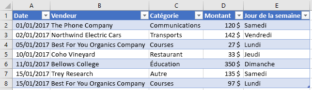

### <a name="add-a-column-that-contains-formulas"></a>Ajouter une colonne qui contient des formules

L’exemple de code suivant ajoute une nouvelle colonne à la table nommée **ExpensesTable** au sein de la feuille de calcul **Sample**. La nouvelle colonne est ajoutée à la fin du tableau, contient un en-tête («Type of the Day ») et utilise une formule pour remplir chaque cellule de données dans la colonne. Si l’application hôte Excel dans laquelle le code est en cours d’exécution prend en charge [l’ensemble de conditions requises](/office/dev/add-ins/reference/requirement-sets/excel-api-requirement-sets) **ExcelApi 1.2**, la largeur des colonnes et la hauteur des lignes sont définies pour s’ajuster au mieux aux données actuelles du tableau.

```js
Excel.run(function (context) {
    var sheet = context.workbook.worksheets.getItem("Sample");
    var expensesTable = sheet.tables.getItem("ExpensesTable");

    expensesTable.columns.add(null /*add columns to the end of the table*/, [
        ["Type of the Day"],
        ['=IF(OR((TEXT([DATE], "dddd") = "Saturday"), (TEXT([DATE], "dddd") = "Sunday")), "Weekend", "Weekday")'],
        ['=IF(OR((TEXT([DATE], "dddd") = "Saturday"), (TEXT([DATE], "dddd") = "Sunday")), "Weekend", "Weekday")'],
        ['=IF(OR((TEXT([DATE], "dddd") = "Saturday"), (TEXT([DATE], "dddd") = "Sunday")), "Weekend", "Weekday")'],
        ['=IF(OR((TEXT([DATE], "dddd") = "Saturday"), (TEXT([DATE], "dddd") = "Sunday")), "Weekend", "Weekday")'],
        ['=IF(OR((TEXT([DATE], "dddd") = "Saturday"), (TEXT([DATE], "dddd") = "Sunday")), "Weekend", "Weekday")'],
        ['=IF(OR((TEXT([DATE], "dddd") = "Saturday"), (TEXT([DATE], "dddd") = "Sunday")), "Weekend", "Weekday")'],
        ['=IF(OR((TEXT([DATE], "dddd") = "Saturday"), (TEXT([DATE], "dddd") = "Sunday")), "Weekend", "Weekday")']
    ]);

    if (Office.context.requirements.isSetSupported("ExcelApi", 1.2)) {
        sheet.getUsedRange().format.autofitColumns();
        sheet.getUsedRange().format.autofitRows();
    }

    return context.sync();
}).catch(errorHandlerFunction);
```

**Tableau avec une nouvelle colonne calculée**

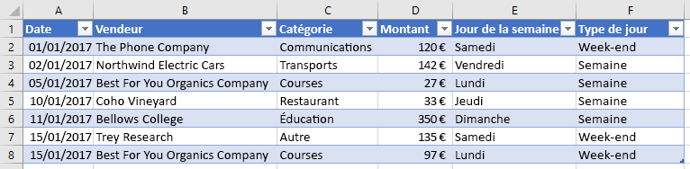

## <a name="update-column-name"></a>Mettre à jour un nom de colonne

L’exemple de code suivant remplace le nom de la première colonne du tableau par **Purchase date**. Si l’application hôte Excel dans laquelle le code est en cours d’exécution prend en charge [l’ensemble de conditions requises](/office/dev/add-ins/reference/requirement-sets/excel-api-requirement-sets) **ExcelApi 1.2**, la largeur des colonnes et la hauteur des lignes sont définies pour s’ajuster au mieux aux données actuelles du tableau.

```js
Excel.run(function (context) {
    var sheet = context.workbook.worksheets.getItem("Sample");

    var expensesTable = sheet.tables.getItem("ExpensesTable");
    expensesTable.columns.load("items");

    return context.sync()
        .then(function () {
            expensesTable.columns.items[0].name = "Purchase date";

            if (Office.context.requirements.isSetSupported("ExcelApi", 1.2)) {
                sheet.getUsedRange().format.autofitColumns();
                sheet.getUsedRange().format.autofitRows();
            }

            return context.sync();
        });
}).catch(errorHandlerFunction);
```

**Tableau avec un nouveau nom de colonne**

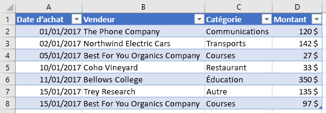

## <a name="get-data-from-a-table"></a>Obtenir des données à partir d’un tableau

L’exemple de code suivant lit les données d’un tableau nommé **ExpensesTable** à partir de la feuille de calcul **Sample**, puis génère ces données en dessous du tableau dans la même feuille de calcul.

```js
Excel.run(function (context) {
    var sheet = context.workbook.worksheets.getItem("Sample");
    var expensesTable = sheet.tables.getItem("ExpensesTable");

    // Get data from the header row
    var headerRange = expensesTable.getHeaderRowRange().load("values");

    // Get data from the table
    var bodyRange = expensesTable.getDataBodyRange().load("values");

    // Get data from a single column
    var columnRange = expensesTable.columns.getItem("Merchant").getDataBodyRange().load("values");

    // Get data from a single row
    var rowRange = expensesTable.rows.getItemAt(1).load("values");

    // Sync to populate proxy objects with data from Excel
    return context.sync()
        .then(function () {
            var headerValues = headerRange.values;
            var bodyValues = bodyRange.values;
            var merchantColumnValues = columnRange.values;
            var secondRowValues = rowRange.values;

            // Write data from table back to the sheet
            sheet.getRange("A11:A11").values = [["Results"]];
            sheet.getRange("A13:D13").values = headerValues;
            sheet.getRange("A14:D20").values = bodyValues;
            sheet.getRange("B23:B29").values = merchantColumnValues;
            sheet.getRange("A32:D32").values = secondRowValues;

            // Sync to update the sheet in Excel
            return context.sync();
        });
}).catch(errorHandlerFunction);
```

**Tableau et sortie des données**

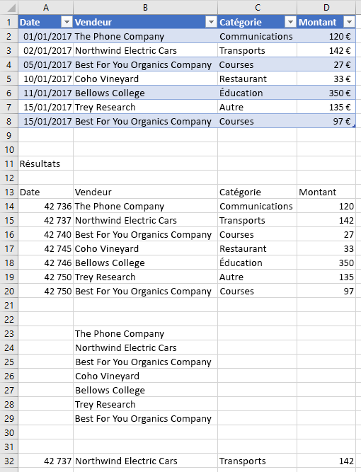

## <a name="sort-data-in-a-table"></a>Trier des données dans un tableau

L’exemple de code suivant trie les données d’un tableau dans l’ordre décroissant en fonction des valeurs de la quatrième colonne du tableau.

```js
Excel.run(function (context) {
    var sheet = context.workbook.worksheets.getItem("Sample");
    var expensesTable = sheet.tables.getItem("ExpensesTable");

    // Queue a command to sort data by the fourth column of the table (descending)
    var sortRange = expensesTable.getDataBodyRange();
    sortRange.sort.apply([
        {
            key: 3,
            ascending: false,
        },
    ]);

    // Sync to run the queued command in Excel
    return context.sync();
}).catch(errorHandlerFunction);
```

**Données de tableau triées par montant (décroissant)**

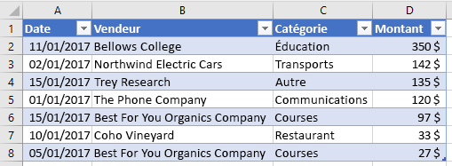

## <a name="apply-filters-to-a-table"></a>Appliquer des filtres à un tableau

L’exemple de code suivant applique des filtres aux colonnes **Amount** et **Category** d’un tableau. Grâce à l’utilisation des filtres, seules les lignes dans lesquelles **Category** est une des valeurs spécifiées et la valeur de **Amount** est inférieure à la valeur moyenne de toutes les lignes sont affichées.

```js
Excel.run(function (context) {
    var sheet = context.workbook.worksheets.getItem("Sample");
    var expensesTable = sheet.tables.getItem("ExpensesTable");

    // Queue a command to apply a filter on the Category column
    filter = expensesTable.columns.getItem("Category").filter;
    filter.apply({
        filterOn: Excel.FilterOn.values,
        values: ["Restaurant", "Groceries"]
    });

    // Queue a command to apply a filter on the Amount column
    var filter = expensesTable.columns.getItem("Amount").filter;
    filter.apply({
        filterOn: Excel.FilterOn.dynamic,
        dynamicCriteria: Excel.DynamicFilterCriteria.belowAverage
    });

    // Sync to run the queued commands in Excel
    return context.sync();
}).catch(errorHandlerFunction);
```

**Données de tableau avec des filtres appliqués pour les colonnes Category et Amount**

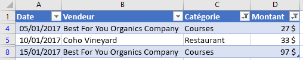

## <a name="clear-table-filters"></a>Effacer les filtres du tableau

L’exemple de code suivant efface tous les filtres appliqués actuellement sur le tableau.

```js
Excel.run(function (context) {
    var sheet = context.workbook.worksheets.getItem("Sample");
    var expensesTable = sheet.tables.getItem("ExpensesTable");

    expensesTable.clearFilters();

    return context.sync();
}).catch(errorHandlerFunction);
```

**Données de tableau sans filtre appliqué**

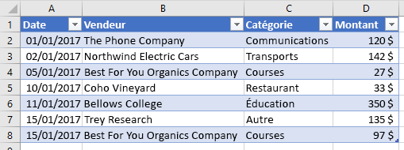

## <a name="get-the-visible-range-from-a-filtered-table"></a>Obtenir la plage visible à partir d’une table filtrée

L’exemple de code suivant recherche une plage qui contient des données uniquement pour des cellules qui sont actuellement visibles dans le tableau spécifié, et écrit ensuite les valeurs de la plage dans la console. Vous pouvez utiliser la méthode **getVisibleView()** comme indiqué ci-dessous pour rechercher le contenu d’un tableau visible dès que les filtres de colonne ont été appliqués.

```js
Excel.run(function (context) {
    var sheet = context.workbook.worksheets.getItem("Sample");
    var expensesTable = sheet.tables.getItem("ExpensesTable");

    var visibleRange = expensesTable.getDataBodyRange().getVisibleView();
    visibleRange.load("values");

    return context.sync()
        .then(function() {
            console.log(visibleRange.values);
        });
}).catch(errorHandlerFunction);
```

## <a name="format-a-table"></a>Mettre en forme un tableau

L’exemple de code suivant applique une mise en forme à un tableau. Il indique différentes couleurs de remplissage pour la ligne d’en-tête, le corps, la deuxième ligne et la première colonne du tableau. Pour plus d’informations sur les propriétés que vous pouvez utiliser pour spécifier un format, reportez-vous à la rubrique [Objet RangeFormat (API JavaScript pour Excel)](/javascript/api/excel/excel.rangeformat).

```js
Excel.run(function (context) {
    var sheet = context.workbook.worksheets.getItem("Sample");
    var expensesTable = sheet.tables.getItem("ExpensesTable");

    expensesTable.getHeaderRowRange().format.fill.color = "#C70039";
    expensesTable.getDataBodyRange().format.fill.color = "#DAF7A6";
    expensesTable.rows.getItemAt(1).getRange().format.fill.color = "#FFC300";
    expensesTable.columns.getItemAt(0).getDataBodyRange().format.fill.color = "#FFA07A";

    return context.sync();
}).catch(errorHandlerFunction);
```

**Tableau après application de la mise en forme**

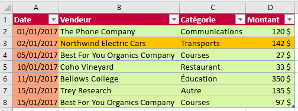

## <a name="convert-a-range-to-a-table"></a>Convertir une plage en tableau

L’exemple de code suivant crée une plage de données, puis la convertit en tableau.

```js
Excel.run(function (context) {
    var sheet = context.workbook.worksheets.getItem("Sample");

    // Define values for the range
    var values = [["Product", "Qtr1", "Qtr2", "Qtr3", "Qtr4"],
    ["Frames", 5000, 7000, 6544, 4377],
    ["Saddles", 400, 323, 276, 651],
    ["Brake levers", 12000, 8766, 8456, 9812],
    ["Chains", 1550, 1088, 692, 853],
    ["Mirrors", 225, 600, 923, 544],
    ["Spokes", 6005, 7634, 4589, 8765]];

    // Create the range
    var range = sheet.getRange("A1:E7");
    range.values = values;

    if (Office.context.requirements.isSetSupported("ExcelApi", 1.2)) {
        sheet.getUsedRange().format.autofitColumns();
        sheet.getUsedRange().format.autofitRows();
    }

    sheet.activate();

    // Convert the range to a table
    var expensesTable = sheet.tables.add('A1:E7', true);
    expensesTable.name = "ExpensesTable";

    return context.sync();
}).catch(errorHandlerFunction);
```

**Données de la plage (avant la conversion de la plage en tableau)**

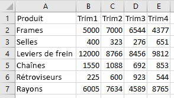

**Données du tableau (après la conversion de la plage en tableau)**

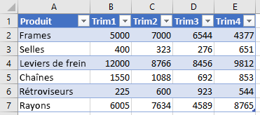

## <a name="import-json-data-into-a-table"></a>Importer des données JSON dans un tableau

L’exemple de code suivant crée un tableau dans la feuille de calcul nommée **Sample** , puis remplit le tableau à l’aide d’un objet JSON qui définit les deux lignes de données. Si l’application hôte Excel dans laquelle le code est en cours d’exécution prend en charge [l’ensemble de conditions requises](/office/dev/add-ins/reference/requirement-sets/excel-api-requirement-sets) **ExcelApi 1.2**, la largeur des colonnes et la hauteur des lignes sont définies pour s’ajuster au mieux aux données actuelles du tableau.

```js
Excel.run(function (context) {
    var sheet = context.workbook.worksheets.getItem("Sample");

    var expensesTable = sheet.tables.add("A1:D1", true /*hasHeaders*/);
    expensesTable.name = "ExpensesTable";
    expensesTable.getHeaderRowRange().values = [["Date", "Merchant", "Category", "Amount"]];

    var transactions = [
      {
        "DATE": "1/1/2017",
        "MERCHANT": "The Phone Company",
        "CATEGORY": "Communications",
        "AMOUNT": "$120"
      },
      {
        "DATE": "1/1/2017",
        "MERCHANT": "Southridge Video",
        "CATEGORY": "Entertainment",
        "AMOUNT": "$40"
      }
    ];

    var newData = transactions.map(item =>
        [item.DATE, item.MERCHANT, item.CATEGORY, item.AMOUNT]);

    expensesTable.rows.add(null, newData);

    if (Office.context.requirements.isSetSupported("ExcelApi", 1.2)) {
        sheet.getUsedRange().format.autofitColumns();
        sheet.getUsedRange().format.autofitRows();
    }

    sheet.activate();

    return context.sync();
}).catch(errorHandlerFunction);
```

**Nouveau tableau**

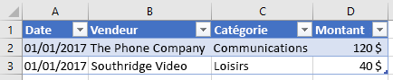

## <a name="see-also"></a>Voir aussi

- [Concepts fondamentaux de programmation avec l’API JavaScript pour Excel](excel-add-ins-core-concepts.md)
