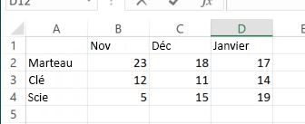

# <a name="call-built-in-excel-worksheet-functions"></a><span data-ttu-id="05bc3-102">Appel de fonctions de feuille de calcul Excel intégrées</span><span class="sxs-lookup"><span data-stu-id="05bc3-102">Call built-in Excel worksheet functions</span></span>

<span data-ttu-id="05bc3-103">Cet article explique comment appeler les fonctions de feuille de calcul Excel intégrées telles que `VLOOKUP` et `SUM` utilisant l’API JavaScript pour Excel.</span><span class="sxs-lookup"><span data-stu-id="05bc3-103">This article explains how to call built-in Excel worksheet functions such as `VLOOKUP` and `SUM` using the Excel JavaScript API.</span></span> <span data-ttu-id="05bc3-104">Il fournit également la liste complète des fonctions de feuille de calcul Excel intégrées pouvant être appelées à l’aide de l’API JavaScript pour Excel.</span><span class="sxs-lookup"><span data-stu-id="05bc3-104">It also provides the full list of built-in Excel worksheet functions that can be called using the Excel JavaScript API.</span></span>

> [!NOTE]
> <span data-ttu-id="05bc3-105">Pour plus d’informations sur la création de *fonctions personnalisées* dans Excel à l’aide de l’API JavaScript pour Excel, reportez-vous à la rubrique [Créer des fonctions personnalisées dans Excel](custom-functions-overview.md).</span><span class="sxs-lookup"><span data-stu-id="05bc3-105">For information about how to create *custom functions* in Excel using the Excel JavaScript API, see [Create custom functions in Excel](custom-functions-overview.md).</span></span>

## <a name="calling-a-worksheet-function"></a><span data-ttu-id="05bc3-106">Appel d’une fonction de feuille de calcul</span><span class="sxs-lookup"><span data-stu-id="05bc3-106">Calling a worksheet function</span></span>

<span data-ttu-id="05bc3-107">L’extrait de code suivant montre comment appeler une fonction de feuille de calcul où `sampleFunction()` est un espace réservé devant être remplacé par le nom de la fonction à appeler et les paramètres d’entrée nécessitant la fonction.</span><span class="sxs-lookup"><span data-stu-id="05bc3-107">The following code snippet shows how to call a worksheet function, where `sampleFunction()` is a placeholder that should be replaced with the name of the function to call and the input parameters that the function requires.</span></span> <span data-ttu-id="05bc3-108">La propriété **value** de l’objet **FunctionResult** renvoyée par une fonction de feuille de calcul contient le résultat de la fonction spécifiée.</span><span class="sxs-lookup"><span data-stu-id="05bc3-108">The **value** property of the **FunctionResult** object that's returned by a worksheet function contains the result of the specified function.</span></span> <span data-ttu-id="05bc3-109">Comme le montre cet exemple, vous devez charger (`load`) la propriété **value** de l’objet **FunctionResult** avant de pouvoir la lire.</span><span class="sxs-lookup"><span data-stu-id="05bc3-109">As this example shows, you must `load` the **value** property of the **FunctionResult** object before you can read it.</span></span> <span data-ttu-id="05bc3-110">Dans cet exemple, le résultat de la fonction est simplement écrit sur la console.</span><span class="sxs-lookup"><span data-stu-id="05bc3-110">In this example, the result of the function is simply being written to the console.</span></span> 

```js
var functionResult = context.workbook.functions.sampleFunction(); 
functionResult.load('value');
return context.sync()
    .then(function () {
        console.log('Result of the function: ' + functionResult.value);
    });
```

> [!TIP]
> <span data-ttu-id="05bc3-111">Reportez-vous à la section [Fonctions de feuille de calcul prises en charge](#supported-worksheet-functions) de cet article pour obtenir la liste des fonctions appelées à l’aide de l’API JavaScript pour Excel.</span><span class="sxs-lookup"><span data-stu-id="05bc3-111">See the [Supported worksheet functions](#supported-worksheet-functions) section of this article for a list of functions that can be called using the Excel JavaScript API.</span></span>

## <a name="sample-data"></a><span data-ttu-id="05bc3-112">Exemple de données</span><span class="sxs-lookup"><span data-stu-id="05bc3-112">Sample data</span></span>

<span data-ttu-id="05bc3-113">L’image suivante montre un tableau dans une feuille de calcul Excel contenant des données de ventes pour divers types d’outils sur une période de trois mois.</span><span class="sxs-lookup"><span data-stu-id="05bc3-113">The following image shows a table in an Excel worksheet that contains sales data for various types of tools over a three month period.</span></span> <span data-ttu-id="05bc3-114">Chaque numéro de la table représente le nombre d’unités vendues pour un outil spécifique lors d’un mois donné.</span><span class="sxs-lookup"><span data-stu-id="05bc3-114">Each number in the table represents the number of units sold for a specific tool in a specific month.</span></span> <span data-ttu-id="05bc3-115">Les exemples suivant expliquent comment appliquer des fonctions de feuille de calcul intégrées à ces données.</span><span class="sxs-lookup"><span data-stu-id="05bc3-115">The examples that follow will show how to apply built-in worksheet functions to this data.</span></span>



## <a name="example-1-single-function"></a><span data-ttu-id="05bc3-117">Exemple 1 : Fonction unique</span><span class="sxs-lookup"><span data-stu-id="05bc3-117">Example 1: Single function</span></span>

<span data-ttu-id="05bc3-118">L’exemple de code suivant applique la fonction `VLOOKUP` aux exemples de données décrits précédemment pour identifier le nombre de clés vendues au mois de novembre.</span><span class="sxs-lookup"><span data-stu-id="05bc3-118">The following code sample applies the `VLOOKUP` function to the sample data described previously to identify the number of wrenches sold in November.</span></span>

```js
Excel.run(function (context) {
    var range = context.workbook.worksheets.getItem("Sheet1").getRange("A1:D4");
    var unitSoldInNov = context.workbook.functions.vlookup("Wrench", range, 2, false);
    unitSoldInNov.load('value');

    return context.sync()
        .then(function () {
            console.log(' Number of wrenches sold in November = ' + unitSoldInNov.value);
        });
}).catch(errorHandlerFunction);
```

## <a name="example-2-nested-functions"></a><span data-ttu-id="05bc3-119">Exemple 2 : Fonctions imbriquées</span><span class="sxs-lookup"><span data-stu-id="05bc3-119">Example 2: Nested functions</span></span>

<span data-ttu-id="05bc3-120">L’exemple de code suivant applique la fonction `VLOOKUP` pour les exemples de données décrits précédemment afin d’identifier le nombre de clés vendues au mois de novembre et le nombre de clés vendues en décembre, puis applique la fonction `SUM` pour calculer le nombre total de clés vendues au cours de ces deux mois.</span><span class="sxs-lookup"><span data-stu-id="05bc3-120">The following code sample applies the `VLOOKUP` function to the sample data described previously to identify the number of wrenches sold in November and the number of wrenches sold in December, and then applies the `SUM` function to calculate the total number of wrenches sold during those two months.</span></span> 

<span data-ttu-id="05bc3-121">Comme indiqué dans cet exemple, si un ou plusieurs appels de fonction sont imbriqués dans un autre appel de fonction, vous devez uniquement charger (`load`) le résultat final que vous souhaitez lire par la suite (dans cet exemple, `sumOfTwoLookups`).</span><span class="sxs-lookup"><span data-stu-id="05bc3-121">As this example shows, when one or more function calls are nested within another function call, you only need to `load` the final result that you subsequently want to read (in this example, `sumOfTwoLookups`).</span></span> <span data-ttu-id="05bc3-122">Les résultats intermédiaires (dans cet exemple, le résultat de chaque fonction `VLOOKUP`) sont calculés et utilisés pour calculer le résultat final.</span><span class="sxs-lookup"><span data-stu-id="05bc3-122">Any intermediate results (in this example, the result of each `VLOOKUP` function) will be calculated and used to calculate the final result.</span></span>

```js
Excel.run(function (context) {
    var range = context.workbook.worksheets.getItem("Sheet1").getRange("A1:D4");
    var sumOfTwoLookups = context.workbook.functions.sum(
        context.workbook.functions.vlookup("Wrench", range, 2, false), 
        context.workbook.functions.vlookup("Wrench", range, 3, false)
    );
    sumOfTwoLookups.load('value');

    return context.sync()
        .then(function () {
            console.log(' Number of wrenches sold in November and December = ' + sumOfTwoLookups.value);
        });
}).catch(errorHandlerFunction);
```

## <a name="supported-worksheet-functions"></a><span data-ttu-id="05bc3-123">Fonctions de feuille de calcul prises en charge</span><span class="sxs-lookup"><span data-stu-id="05bc3-123">Supported worksheet functions</span></span>

<span data-ttu-id="05bc3-124">Les fonctions de feuille de calcul Excel intégrées suivantes peuvent être appelées à l’aide de l’API JavaScript pour Excel.</span><span class="sxs-lookup"><span data-stu-id="05bc3-124">The following built-in Excel worksheet functions can be called using the Excel JavaScript API.</span></span>

| <span data-ttu-id="05bc3-125">Fonction</span><span class="sxs-lookup"><span data-stu-id="05bc3-125">Function</span></span> | <span data-ttu-id="05bc3-126">Type de retour</span><span class="sxs-lookup"><span data-stu-id="05bc3-126">Return type</span></span> | <span data-ttu-id="05bc3-127">Description</span><span class="sxs-lookup"><span data-stu-id="05bc3-127">Description</span></span> |
|:---------------|:-------------|:-----------|
| <span data-ttu-id="05bc3-128"><a href="https://support.office.com/en-us/article/ABS-function-3420200f-5628-4e8c-99da-c99d7c87713c" target="_blank">Fonction ABS</a></span><span class="sxs-lookup"><span data-stu-id="05bc3-128"><a href="https://support.office.com/en-us/article/ABS-function-3420200f-5628-4e8c-99da-c99d7c87713c" target="_blank">ABS function</a></span></span> | <span data-ttu-id="05bc3-129">FunctionResult</span><span class="sxs-lookup"><span data-stu-id="05bc3-129">FunctionResult</span></span> | <span data-ttu-id="05bc3-130">Renvoie la valeur absolue d’un nombre</span><span class="sxs-lookup"><span data-stu-id="05bc3-130">Returns the absolute value of a number</span></span> |
| <span data-ttu-id="05bc3-131"><a href="https://support.office.com/en-us/article/ACCRINT-function-fe45d089-6722-4fb3-9379-e1f911d8dc74" target="_blank">Fonction ACCRINT</a></span><span class="sxs-lookup"><span data-stu-id="05bc3-131"><a href="https://support.office.com/en-us/article/ACCRINT-function-fe45d089-6722-4fb3-9379-e1f911d8dc74" target="_blank">ACCRINT function</a></span></span> | <span data-ttu-id="05bc3-132">FunctionResult</span><span class="sxs-lookup"><span data-stu-id="05bc3-132">FunctionResult</span></span> | <span data-ttu-id="05bc3-133">Renvoie l’intérêt couru non échu d’un titre dont l’intérêt est perçu périodiquement</span><span class="sxs-lookup"><span data-stu-id="05bc3-133">Returns the accrued interest for a security that pays periodic interest</span></span> |
| <span data-ttu-id="05bc3-134"><a href="https://support.office.com/en-us/article/ACCRINTM-function-f62f01f9-5754-4cc4-805b-0e70199328a7" target="_blank">Fonction ACCRINTM</a></span><span class="sxs-lookup"><span data-stu-id="05bc3-134"><a href="https://support.office.com/en-us/article/ACCRINTM-function-f62f01f9-5754-4cc4-805b-0e70199328a7" target="_blank">ACCRINTM function</a></span></span> | <span data-ttu-id="05bc3-135">FunctionResult</span><span class="sxs-lookup"><span data-stu-id="05bc3-135">FunctionResult</span></span> | <span data-ttu-id="05bc3-136">Renvoie l’intérêt couru non échu d’un titre dont l’intérêt est perçu à l’échéance</span><span class="sxs-lookup"><span data-stu-id="05bc3-136">Returns the accrued interest for a security that pays interest at maturity</span></span> |
| <span data-ttu-id="05bc3-137"><a href="https://support.office.com/en-us/article/ACOS-function-cb73173f-d089-4582-afa1-76e5524b5d5b" target="_blank">Fonction ACOS</a></span><span class="sxs-lookup"><span data-stu-id="05bc3-137"><a href="https://support.office.com/en-us/article/ACOS-function-cb73173f-d089-4582-afa1-76e5524b5d5b" target="_blank">ACOS function</a></span></span> | <span data-ttu-id="05bc3-138">FunctionResult</span><span class="sxs-lookup"><span data-stu-id="05bc3-138">FunctionResult</span></span> | <span data-ttu-id="05bc3-139">Renvoie l’arccosinus d’un nombre</span><span class="sxs-lookup"><span data-stu-id="05bc3-139">Returns the arccosine of a number</span></span> |
| <span data-ttu-id="05bc3-140"><a href="https://support.office.com/en-us/article/ACOSH-function-e3992cc1-103f-4e72-9f04-624b9ef5ebfe" target="_blank">Fonction ACOSH</a></span><span class="sxs-lookup"><span data-stu-id="05bc3-140"><a href="https://support.office.com/en-us/article/ACOSH-function-e3992cc1-103f-4e72-9f04-624b9ef5ebfe" target="_blank">ACOSH function</a></span></span> | <span data-ttu-id="05bc3-141">FunctionResult</span><span class="sxs-lookup"><span data-stu-id="05bc3-141">FunctionResult</span></span> | <span data-ttu-id="05bc3-142">Renvoie le cosinus hyperbolique inverse d’un nombre</span><span class="sxs-lookup"><span data-stu-id="05bc3-142">Returns the inverse hyperbolic cosine of a number</span></span> |
| <span data-ttu-id="05bc3-143"><a href="https://support.office.com/en-us/article/ACOT-function-dc7e5008-fe6b-402e-bdd6-2eea8383d905" target="_blank">Fonction ACOT</a></span><span class="sxs-lookup"><span data-stu-id="05bc3-143"><a href="https://support.office.com/en-us/article/ACOT-function-dc7e5008-fe6b-402e-bdd6-2eea8383d905" target="_blank">ACOT function</a></span></span> | <span data-ttu-id="05bc3-144">FunctionResult</span><span class="sxs-lookup"><span data-stu-id="05bc3-144">FunctionResult</span></span> | <span data-ttu-id="05bc3-145">Renvoie l’arccotangente d’un nombre</span><span class="sxs-lookup"><span data-stu-id="05bc3-145">Returns the arccotangent of a number</span></span> |
| <span data-ttu-id="05bc3-146"><a href="https://support.office.com/en-us/article/ACOTH-function-cc49480f-f684-4171-9fc5-73e4e852300f" target="_blank">Fonction ACOTH</a></span><span class="sxs-lookup"><span data-stu-id="05bc3-146"><a href="https://support.office.com/en-us/article/ACOTH-function-cc49480f-f684-4171-9fc5-73e4e852300f" target="_blank">ACOTH function</a></span></span> | <span data-ttu-id="05bc3-147">FunctionResult</span><span class="sxs-lookup"><span data-stu-id="05bc3-147">FunctionResult</span></span> | <span data-ttu-id="05bc3-148">Renvoie l’arccotangente hyperbolique d’un nombre</span><span class="sxs-lookup"><span data-stu-id="05bc3-148">Returns the hyperbolic arccotangent of a number</span></span> |
| <span data-ttu-id="05bc3-149"><a href="https://support.office.com/en-us/article/AMORDEGRC-function-a14d0ca1-64a4-42eb-9b3d-b0dededf9e51" target="_blank">Fonction AMORDEGRC</a></span><span class="sxs-lookup"><span data-stu-id="05bc3-149"><a href="https://support.office.com/en-us/article/AMORDEGRC-function-a14d0ca1-64a4-42eb-9b3d-b0dededf9e51" target="_blank">AMORDEGRC function</a></span></span> | <span data-ttu-id="05bc3-150">FunctionResult</span><span class="sxs-lookup"><span data-stu-id="05bc3-150">FunctionResult</span></span> | <span data-ttu-id="05bc3-151">Renvoie l’amortissement correspondant à chaque période comptable en utilisant un coefficient d’amortissement</span><span class="sxs-lookup"><span data-stu-id="05bc3-151">Returns the depreciation for each accounting period by using a depreciation coefficient</span></span> |
| <span data-ttu-id="05bc3-152"><a href="https://support.office.com/en-us/article/AMORLINC-function-7d417b45-f7f5-4dba-a0a5-3451a81079a8" target="_blank">Fonction AMORLINC</a></span><span class="sxs-lookup"><span data-stu-id="05bc3-152"><a href="https://support.office.com/en-us/article/AMORLINC-function-7d417b45-f7f5-4dba-a0a5-3451a81079a8" target="_blank">AMORLINC function</a></span></span> | <span data-ttu-id="05bc3-153">FunctionResult</span><span class="sxs-lookup"><span data-stu-id="05bc3-153">FunctionResult</span></span> | <span data-ttu-id="05bc3-154">Renvoie l’amortissement correspondant à chaque période comptable</span><span class="sxs-lookup"><span data-stu-id="05bc3-154">Returns the depreciation for each accounting period</span></span> |
| <span data-ttu-id="05bc3-155"><a href="https://support.office.com/en-us/article/AND-function-5f19b2e8-e1df-4408-897a-ce285a19e9d9" target="_blank">Fonction AND</a></span><span class="sxs-lookup"><span data-stu-id="05bc3-155"><a href="https://support.office.com/en-us/article/AND-function-5f19b2e8-e1df-4408-897a-ce285a19e9d9" target="_blank">AND function</a></span></span> | <span data-ttu-id="05bc3-156">FunctionResult</span><span class="sxs-lookup"><span data-stu-id="05bc3-156">FunctionResult</span></span> | <span data-ttu-id="05bc3-157">Renvoie `TRUE` si tous les arguments ont la valeur True</span><span class="sxs-lookup"><span data-stu-id="05bc3-157">Returns `TRUE` if all of its arguments are true</span></span> |
| <span data-ttu-id="05bc3-158"><a href="https://support.office.com/en-us/article/ARABIC-function-9a8da418-c17b-4ef9-a657-9370a30a674f" target="_blank">Fonction ARABIC</a></span><span class="sxs-lookup"><span data-stu-id="05bc3-158"><a href="https://support.office.com/en-us/article/ARABIC-function-9a8da418-c17b-4ef9-a657-9370a30a674f" target="_blank">ARABIC function</a></span></span> | <span data-ttu-id="05bc3-159">FunctionResult</span><span class="sxs-lookup"><span data-stu-id="05bc3-159">FunctionResult</span></span> | <span data-ttu-id="05bc3-160">Convertit un nombre romain en chiffre arabe</span><span class="sxs-lookup"><span data-stu-id="05bc3-160">Converts a Roman number to Arabic, as a number</span></span> |
| <span data-ttu-id="05bc3-161"><a href="https://support.office.com/en-us/article/AREAS-function-8392ba32-7a41-43b3-96b0-3695d2ec6152" target="_blank">Fonction AREAS</a></span><span class="sxs-lookup"><span data-stu-id="05bc3-161"><a href="https://support.office.com/en-us/article/AREAS-function-8392ba32-7a41-43b3-96b0-3695d2ec6152" target="_blank">AREAS function</a></span></span> | <span data-ttu-id="05bc3-162">FunctionResult</span><span class="sxs-lookup"><span data-stu-id="05bc3-162">FunctionResult</span></span> | <span data-ttu-id="05bc3-163">Renvoie le nombre de zones dans une référence</span><span class="sxs-lookup"><span data-stu-id="05bc3-163">Returns the number of areas in a reference</span></span> |
| <span data-ttu-id="05bc3-164"><a href="https://support.office.com/en-us/article/ASC-function-0b6abf1c-c663-4004-a964-ebc00b723266" target="_blank">Fonction ASC</a></span><span class="sxs-lookup"><span data-stu-id="05bc3-164"><a href="https://support.office.com/en-us/article/ASC-function-0b6abf1c-c663-4004-a964-ebc00b723266" target="_blank">ASC function</a></span></span> | <span data-ttu-id="05bc3-165">FunctionResult</span><span class="sxs-lookup"><span data-stu-id="05bc3-165">FunctionResult</span></span> | <span data-ttu-id="05bc3-166">Convertit les caractères anglais pleine chasse (codés sur deux octets) ou katakana dans une chaîne de caractères en caractères à demi-chasse (codés sur un octet)</span><span class="sxs-lookup"><span data-stu-id="05bc3-166">Changes full-width (double-byte) English letters or katakana within a character string to half-width (single-byte) characters</span></span> |
| <span data-ttu-id="05bc3-167"><a href="https://support.office.com/en-us/article/ASIN-function-81fb95e5-6d6f-48c4-bc45-58f955c6d347" target="_blank">Fonction ASIN</a></span><span class="sxs-lookup"><span data-stu-id="05bc3-167"><a href="https://support.office.com/en-us/article/ASIN-function-81fb95e5-6d6f-48c4-bc45-58f955c6d347" target="_blank">ASIN function</a></span></span> | <span data-ttu-id="05bc3-168">FunctionResult</span><span class="sxs-lookup"><span data-stu-id="05bc3-168">FunctionResult</span></span> | <span data-ttu-id="05bc3-169">Renvoie l’arcsinus d’un nombre</span><span class="sxs-lookup"><span data-stu-id="05bc3-169">Returns the arcsine of a number</span></span> |
| <span data-ttu-id="05bc3-170"><a href="https://support.office.com/en-us/article/ASINH-function-4e00475a-067a-43cf-926a-765b0249717c" target="_blank">Fonction ASINH</a></span><span class="sxs-lookup"><span data-stu-id="05bc3-170"><a href="https://support.office.com/en-us/article/ASINH-function-4e00475a-067a-43cf-926a-765b0249717c" target="_blank">ASINH function</a></span></span> | <span data-ttu-id="05bc3-171">FunctionResult</span><span class="sxs-lookup"><span data-stu-id="05bc3-171">FunctionResult</span></span> | <span data-ttu-id="05bc3-172">Renvoie le sinus hyperbolique inverse d’un nombre</span><span class="sxs-lookup"><span data-stu-id="05bc3-172">Returns the inverse hyperbolic sine of a number</span></span> |
| <span data-ttu-id="05bc3-173"><a href="https://support.office.com/en-us/article/ATAN-function-50746fa8-630a-406b-81d0-4a2aed395543" target="_blank">Fonction ATAN</a></span><span class="sxs-lookup"><span data-stu-id="05bc3-173"><a href="https://support.office.com/en-us/article/ATAN-function-50746fa8-630a-406b-81d0-4a2aed395543" target="_blank">ATAN function</a></span></span> | <span data-ttu-id="05bc3-174">FunctionResult</span><span class="sxs-lookup"><span data-stu-id="05bc3-174">FunctionResult</span></span> | <span data-ttu-id="05bc3-175">Renvoie l’arctangente d’un nombre</span><span class="sxs-lookup"><span data-stu-id="05bc3-175">Returns the arctangent of a number</span></span> |
| <span data-ttu-id="05bc3-176"><a href="https://support.office.com/en-us/article/ATAN2-function-c04592ab-b9e3-4908-b428-c96b3a565033" target="_blank">Fonction ATAN2</a></span><span class="sxs-lookup"><span data-stu-id="05bc3-176"><a href="https://support.office.com/en-us/article/ATAN2-function-c04592ab-b9e3-4908-b428-c96b3a565033" target="_blank">ATAN2 function</a></span></span> | <span data-ttu-id="05bc3-177">FunctionResult</span><span class="sxs-lookup"><span data-stu-id="05bc3-177">FunctionResult</span></span> | <span data-ttu-id="05bc3-178">Renvoie l’arctangente des coordonnées x et y</span><span class="sxs-lookup"><span data-stu-id="05bc3-178">Returns the arctangent from x- and y-coordinates</span></span> |
| <span data-ttu-id="05bc3-179"><a href="https://support.office.com/en-us/article/ATANH-function-3cd65768-0de7-4f1d-b312-d01c8c930d90" target="_blank">Fonction ATANH</a></span><span class="sxs-lookup"><span data-stu-id="05bc3-179"><a href="https://support.office.com/en-us/article/ATANH-function-3cd65768-0de7-4f1d-b312-d01c8c930d90" target="_blank">ATANH function</a></span></span> | <span data-ttu-id="05bc3-180">FunctionResult</span><span class="sxs-lookup"><span data-stu-id="05bc3-180">FunctionResult</span></span> | <span data-ttu-id="05bc3-181">Renvoie la tangente hyperbolique inverse d’un nombre</span><span class="sxs-lookup"><span data-stu-id="05bc3-181">Returns the inverse hyperbolic tangent of a number</span></span> |
| <span data-ttu-id="05bc3-182"><a href="https://support.office.com/en-us/article/AVEDEV-function-58fe8d65-2a84-4dc7-8052-f3f87b5c6639" target="_blank">Fonction AVEDEV</a></span><span class="sxs-lookup"><span data-stu-id="05bc3-182"><a href="https://support.office.com/en-us/article/AVEDEV-function-58fe8d65-2a84-4dc7-8052-f3f87b5c6639" target="_blank">AVEDEV function</a></span></span> | <span data-ttu-id="05bc3-183">FunctionResult</span><span class="sxs-lookup"><span data-stu-id="05bc3-183">FunctionResult</span></span> | <span data-ttu-id="05bc3-184">Renvoie la moyenne des écarts absolus des points de données par rapport à leur moyenne</span><span class="sxs-lookup"><span data-stu-id="05bc3-184">Returns the average of the absolute deviations of data points from their mean</span></span> |
| <span data-ttu-id="05bc3-185"><a href="https://support.office.com/en-us/article/AVERAGE-function-047bac88-d466-426c-a32b-8f33eb960cf6" target="_blank">Fonction AVERAGE</a></span><span class="sxs-lookup"><span data-stu-id="05bc3-185"><a href="https://support.office.com/en-us/article/AVERAGE-function-047bac88-d466-426c-a32b-8f33eb960cf6" target="_blank">AVERAGE function</a></span></span> | <span data-ttu-id="05bc3-186">FunctionResult</span><span class="sxs-lookup"><span data-stu-id="05bc3-186">FunctionResult</span></span> | <span data-ttu-id="05bc3-187">Renvoie la moyenne de ses arguments</span><span class="sxs-lookup"><span data-stu-id="05bc3-187">Returns the average of its arguments</span></span> |
| <span data-ttu-id="05bc3-188"><a href="https://support.office.com/en-us/article/AVERAGEA-function-f5f84098-d453-4f4c-bbba-3d2c66356091" target="_blank">Fonction AVERAGEA</a></span><span class="sxs-lookup"><span data-stu-id="05bc3-188"><a href="https://support.office.com/en-us/article/AVERAGEA-function-f5f84098-d453-4f4c-bbba-3d2c66356091" target="_blank">AVERAGEA function</a></span></span> | <span data-ttu-id="05bc3-189">FunctionResult</span><span class="sxs-lookup"><span data-stu-id="05bc3-189">FunctionResult</span></span> | <span data-ttu-id="05bc3-190">Renvoie la moyenne de ses arguments, y compris les nombres, le texte et les valeurs logiques</span><span class="sxs-lookup"><span data-stu-id="05bc3-190">Returns the average of its arguments, including numbers, text, and logical values</span></span> |
| <span data-ttu-id="05bc3-191"><a href="https://support.office.com/en-us/article/AVERAGEIF-function-faec8e2e-0dec-4308-af69-f5576d8ac642" target="_blank">Fonction AVERAGEIF</a></span><span class="sxs-lookup"><span data-stu-id="05bc3-191"><a href="https://support.office.com/en-us/article/AVERAGEIF-function-faec8e2e-0dec-4308-af69-f5576d8ac642" target="_blank">AVERAGEIF function</a></span></span> | <span data-ttu-id="05bc3-192">FunctionResult</span><span class="sxs-lookup"><span data-stu-id="05bc3-192">FunctionResult</span></span> | <span data-ttu-id="05bc3-193">Renvoie la moyenne (arithmétique) de toutes les cellules d’une plage respectant un critère donné</span><span class="sxs-lookup"><span data-stu-id="05bc3-193">Returns the average (arithmetic mean) of all the cells in a range that meet a given criteria</span></span> |
| <span data-ttu-id="05bc3-194"><a href="https://support.office.com/en-us/article/AVERAGEIFS-function-48910c45-1fc0-4389-a028-f7c5c3001690" target="_blank">Fonction AVERAGEIFS</a></span><span class="sxs-lookup"><span data-stu-id="05bc3-194"><a href="https://support.office.com/en-us/article/AVERAGEIFS-function-48910c45-1fc0-4389-a028-f7c5c3001690" target="_blank">AVERAGEIFS function</a></span></span> | <span data-ttu-id="05bc3-195">FunctionResult</span><span class="sxs-lookup"><span data-stu-id="05bc3-195">FunctionResult</span></span> | <span data-ttu-id="05bc3-196">Renvoie la moyenne (arithmétique) de toutes les cellules qui répondent à plusieurs critères</span><span class="sxs-lookup"><span data-stu-id="05bc3-196">Returns the average (arithmetic mean) of all cells that meet multiple criteria</span></span> |
| <span data-ttu-id="05bc3-197"><a href="https://support.office.com/en-us/article/BAHTTEXT-function-5ba4d0b4-abd3-4325-8d22-7a92d59aab9c" target="_blank">Fonction BAHTTEXT</a></span><span class="sxs-lookup"><span data-stu-id="05bc3-197"><a href="https://support.office.com/en-us/article/BAHTTEXT-function-5ba4d0b4-abd3-4325-8d22-7a92d59aab9c" target="_blank">BAHTTEXT function</a></span></span> | <span data-ttu-id="05bc3-198">FunctionResult</span><span class="sxs-lookup"><span data-stu-id="05bc3-198">FunctionResult</span></span> | <span data-ttu-id="05bc3-199">Convertit un nombre en texte en utilisant le format monétaire ß (baht)</span><span class="sxs-lookup"><span data-stu-id="05bc3-199">Converts a number to text, using the ß (baht) currency format</span></span> |
| <span data-ttu-id="05bc3-200"><a href="https://support.office.com/en-us/article/BASE-function-2ef61411-aee9-4f29-a811-1c42456c6342" target="_blank">Fonction BASE</a></span><span class="sxs-lookup"><span data-stu-id="05bc3-200"><a href="https://support.office.com/en-us/article/BASE-function-2ef61411-aee9-4f29-a811-1c42456c6342" target="_blank">BASE function</a></span></span> | <span data-ttu-id="05bc3-201">FunctionResult</span><span class="sxs-lookup"><span data-stu-id="05bc3-201">FunctionResult</span></span> | <span data-ttu-id="05bc3-202">Convertit un nombre en représentation textuelle avec la base spécifiée</span><span class="sxs-lookup"><span data-stu-id="05bc3-202">Converts a number into a text representation with the given radix (base)</span></span> |
| <span data-ttu-id="05bc3-203"><a href="https://support.office.com/en-us/article/BESSELI-function-8d33855c-9a8d-444b-98e0-852267b1c0df" target="_blank">Fonction BESSELI</a></span><span class="sxs-lookup"><span data-stu-id="05bc3-203"><a href="https://support.office.com/en-us/article/BESSELI-function-8d33855c-9a8d-444b-98e0-852267b1c0df" target="_blank">BESSELI function</a></span></span> | <span data-ttu-id="05bc3-204">FunctionResult</span><span class="sxs-lookup"><span data-stu-id="05bc3-204">FunctionResult</span></span> | <span data-ttu-id="05bc3-205">Renvoie la fonction de Bessel modifiée In(x)</span><span class="sxs-lookup"><span data-stu-id="05bc3-205">Returns the modified Bessel function In(x)</span></span> |
| <span data-ttu-id="05bc3-206"><a href="https://support.office.com/en-us/article/BESSELJ-function-839cb181-48de-408b-9d80-bd02982d94f7" target="_blank">Fonction BESSELJ</a></span><span class="sxs-lookup"><span data-stu-id="05bc3-206"><a href="https://support.office.com/en-us/article/BESSELJ-function-839cb181-48de-408b-9d80-bd02982d94f7" target="_blank">BESSELJ function</a></span></span> | <span data-ttu-id="05bc3-207">FunctionResult</span><span class="sxs-lookup"><span data-stu-id="05bc3-207">FunctionResult</span></span> | <span data-ttu-id="05bc3-208">Renvoie la fonction de Bessel Jn(x)</span><span class="sxs-lookup"><span data-stu-id="05bc3-208">Returns the Bessel function Jn(x)</span></span> |
| <span data-ttu-id="05bc3-209"><a href="https://support.office.com/en-us/article/BESSELK-function-606d11bc-06d3-4d53-9ecb-2803e2b90b70" target="_blank">Fonction BESSELK</a></span><span class="sxs-lookup"><span data-stu-id="05bc3-209"><a href="https://support.office.com/en-us/article/BESSELK-function-606d11bc-06d3-4d53-9ecb-2803e2b90b70" target="_blank">BESSELK function</a></span></span> | <span data-ttu-id="05bc3-210">FunctionResult</span><span class="sxs-lookup"><span data-stu-id="05bc3-210">FunctionResult</span></span> | <span data-ttu-id="05bc3-211">Renvoie la fonction de Bessel modifiée Kn(x)</span><span class="sxs-lookup"><span data-stu-id="05bc3-211">Returns the modified Bessel function Kn(x)</span></span> |
| <span data-ttu-id="05bc3-212"><a href="https://support.office.com/en-us/article/BESSELY-function-f3a356b3-da89-42c3-8974-2da54d6353a2" target="_blank">Fonction BESSELY</a></span><span class="sxs-lookup"><span data-stu-id="05bc3-212"><a href="https://support.office.com/en-us/article/BESSELY-function-f3a356b3-da89-42c3-8974-2da54d6353a2" target="_blank">BESSELY function</a></span></span> | <span data-ttu-id="05bc3-213">FunctionResult</span><span class="sxs-lookup"><span data-stu-id="05bc3-213">FunctionResult</span></span> | <span data-ttu-id="05bc3-214">Renvoie la fonction de Bessel Yn(x)</span><span class="sxs-lookup"><span data-stu-id="05bc3-214">Returns the Bessel function Yn(x)</span></span> |
| <span data-ttu-id="05bc3-215"><a href="https://support.office.com/en-us/article/BETADIST-function-11188c9c-780a-42c7-ba43-9ecb5a878d31" target="_blank">Fonction BETA.DIST</a></span><span class="sxs-lookup"><span data-stu-id="05bc3-215"><a href="https://support.office.com/en-us/article/BETADIST-function-11188c9c-780a-42c7-ba43-9ecb5a878d31" target="_blank">BETA.DIST function</a></span></span> | <span data-ttu-id="05bc3-216">FunctionResult</span><span class="sxs-lookup"><span data-stu-id="05bc3-216">FunctionResult</span></span> | <span data-ttu-id="05bc3-217">Renvoie la fonction de distribution cumulée suivant une loi Bêta</span><span class="sxs-lookup"><span data-stu-id="05bc3-217">Returns the beta cumulative distribution function</span></span> |
| <span data-ttu-id="05bc3-218"><a href="https://support.office.com/en-us/article/BETAINV-function-e84cb8aa-8df0-4cf6-9892-83a341d252eb" target="_blank">Fonction BETA.INV</a></span><span class="sxs-lookup"><span data-stu-id="05bc3-218"><a href="https://support.office.com/en-us/article/BETAINV-function-e84cb8aa-8df0-4cf6-9892-83a341d252eb" target="_blank">BETA.INV function</a></span></span> | <span data-ttu-id="05bc3-219">FunctionResult</span><span class="sxs-lookup"><span data-stu-id="05bc3-219">FunctionResult</span></span> | <span data-ttu-id="05bc3-220">Renvoie l’inverse de la fonction de distribution cumulée pour une distribution bêta spécifiée</span><span class="sxs-lookup"><span data-stu-id="05bc3-220">Returns the inverse of the cumulative distribution function for a specified beta distribution</span></span> |
| <span data-ttu-id="05bc3-221"><a href="https://support.office.com/en-us/article/BIN2DEC-function-63905b57-b3a0-453d-99f4-647bb519cd6c" target="_blank">Fonction BIN2DEC</a></span><span class="sxs-lookup"><span data-stu-id="05bc3-221"><a href="https://support.office.com/en-us/article/BIN2DEC-function-63905b57-b3a0-453d-99f4-647bb519cd6c" target="_blank">BIN2DEC function</a></span></span> | <span data-ttu-id="05bc3-222">FunctionResult</span><span class="sxs-lookup"><span data-stu-id="05bc3-222">FunctionResult</span></span> | <span data-ttu-id="05bc3-223">Convertit un nombre binaire en nombre décimal</span><span class="sxs-lookup"><span data-stu-id="05bc3-223">Converts a binary number to decimal</span></span> |
| <span data-ttu-id="05bc3-224"><a href="https://support.office.com/en-us/article/BIN2HEX-function-0375e507-f5e5-4077-9af8-28d84f9f41cc" target="_blank">Fonction BIN2HEX</a></span><span class="sxs-lookup"><span data-stu-id="05bc3-224"><a href="https://support.office.com/en-us/article/BIN2HEX-function-0375e507-f5e5-4077-9af8-28d84f9f41cc" target="_blank">BIN2HEX function</a></span></span> | <span data-ttu-id="05bc3-225">FunctionResult</span><span class="sxs-lookup"><span data-stu-id="05bc3-225">FunctionResult</span></span> | <span data-ttu-id="05bc3-226">Convertit un nombre binaire en nombre hexadécimal</span><span class="sxs-lookup"><span data-stu-id="05bc3-226">Converts a binary number to hexadecimal</span></span> |
| <span data-ttu-id="05bc3-227"><a href="https://support.office.com/en-us/article/BIN2OCT-function-0a4e01ba-ac8d-4158-9b29-16c25c4c23fd" target="_blank">Fonction BIN2OCT</a></span><span class="sxs-lookup"><span data-stu-id="05bc3-227"><a href="https://support.office.com/en-us/article/BIN2OCT-function-0a4e01ba-ac8d-4158-9b29-16c25c4c23fd" target="_blank">BIN2OCT function</a></span></span> | <span data-ttu-id="05bc3-228">FunctionResult</span><span class="sxs-lookup"><span data-stu-id="05bc3-228">FunctionResult</span></span> | <span data-ttu-id="05bc3-229">Convertit un nombre binaire en nombre octal</span><span class="sxs-lookup"><span data-stu-id="05bc3-229">Converts a binary number to octal</span></span> |
| <span data-ttu-id="05bc3-230"><a href="https://support.office.com/en-us/article/BINOMDIST-function-c5ae37b6-f39c-4be2-94c2-509a1480770c" target="_blank">Fonction BINOM.DIST</a></span><span class="sxs-lookup"><span data-stu-id="05bc3-230"><a href="https://support.office.com/en-us/article/BINOMDIST-function-c5ae37b6-f39c-4be2-94c2-509a1480770c" target="_blank">BINOM.DIST function</a></span></span> | <span data-ttu-id="05bc3-231">FunctionResult</span><span class="sxs-lookup"><span data-stu-id="05bc3-231">FunctionResult</span></span> | <span data-ttu-id="05bc3-232">Renvoie la probabilité d’une variable aléatoire discrète suivant la loi binomiale</span><span class="sxs-lookup"><span data-stu-id="05bc3-232">Returns the individual term binomial distribution probability</span></span> |
| <span data-ttu-id="05bc3-233"><a href="https://support.office.com/en-us/article/BINOMDISTRANGE-function-17331329-74c7-4053-bb4c-6653a7421595" target="_blank">Fonction BINOM.DIST.RANGE</a></span><span class="sxs-lookup"><span data-stu-id="05bc3-233"><a href="https://support.office.com/en-us/article/BINOMDISTRANGE-function-17331329-74c7-4053-bb4c-6653a7421595" target="_blank">BINOM.DIST.RANGE function</a></span></span> | <span data-ttu-id="05bc3-234">FunctionResult</span><span class="sxs-lookup"><span data-stu-id="05bc3-234">FunctionResult</span></span> | <span data-ttu-id="05bc3-235">Renvoie la probabilité d’un résultat de tirage en suivant une distribution binomiale</span><span class="sxs-lookup"><span data-stu-id="05bc3-235">Returns the probability of a trial result using a binomial distribution</span></span> |
| <span data-ttu-id="05bc3-236"><a href="https://support.office.com/en-us/article/BINOMINV-function-80a0370c-ada6-49b4-83e7-05a91ba77ac9" target="_blank">Fonction BINOM.INV</a></span><span class="sxs-lookup"><span data-stu-id="05bc3-236"><a href="https://support.office.com/en-us/article/BINOMINV-function-80a0370c-ada6-49b4-83e7-05a91ba77ac9" target="_blank">BINOM.INV function</a></span></span> | <span data-ttu-id="05bc3-237">FunctionResult</span><span class="sxs-lookup"><span data-stu-id="05bc3-237">FunctionResult</span></span> | <span data-ttu-id="05bc3-238">Renvoie la plus petite valeur pour laquelle la distribution binomiale cumulée est inférieure ou égale à une valeur critère</span><span class="sxs-lookup"><span data-stu-id="05bc3-238">Returns the smallest value for which the cumulative binomial distribution is less than or equal to a criterion value</span></span> |
| <span data-ttu-id="05bc3-239"><a href="https://support.office.com/en-us/article/BITAND-function-8a2be3d7-91c3-4b48-9517-64548008563a" target="_blank">Fonction BITAND</a></span><span class="sxs-lookup"><span data-stu-id="05bc3-239"><a href="https://support.office.com/en-us/article/BITAND-function-8a2be3d7-91c3-4b48-9517-64548008563a" target="_blank">BITAND function</a></span></span> | <span data-ttu-id="05bc3-240">FunctionResult</span><span class="sxs-lookup"><span data-stu-id="05bc3-240">FunctionResult</span></span> | <span data-ttu-id="05bc3-241">Renvoie une opération AND au niveau du bit de deux nombres</span><span class="sxs-lookup"><span data-stu-id="05bc3-241">Returns a 'Bitwise And' of two numbers</span></span> |
| <span data-ttu-id="05bc3-242"><a href="https://support.office.com/en-us/article/BITLSHIFT-function-c55bb27e-cacd-4c7c-b258-d80861a03c9c" target="_blank">Fonction BITLSHIFT</a></span><span class="sxs-lookup"><span data-stu-id="05bc3-242"><a href="https://support.office.com/en-us/article/BITLSHIFT-function-c55bb27e-cacd-4c7c-b258-d80861a03c9c" target="_blank">BITLSHIFT function</a></span></span> | <span data-ttu-id="05bc3-243">FunctionResult</span><span class="sxs-lookup"><span data-stu-id="05bc3-243">FunctionResult</span></span> | <span data-ttu-id="05bc3-244">Renvoie un nombre décalé vers la gauche de total_décalage bits.</span><span class="sxs-lookup"><span data-stu-id="05bc3-244">Returns a value number shifted left by shift_amount bits</span></span> |
| <span data-ttu-id="05bc3-245"><a href="https://support.office.com/en-us/article/BITOR-function-f6ead5c8-5b98-4c9e-9053-8ad5234919b2" target="_blank">Fonction BITOR</a></span><span class="sxs-lookup"><span data-stu-id="05bc3-245"><a href="https://support.office.com/en-us/article/BITOR-function-f6ead5c8-5b98-4c9e-9053-8ad5234919b2" target="_blank">BITOR function</a></span></span> | <span data-ttu-id="05bc3-246">FunctionResult</span><span class="sxs-lookup"><span data-stu-id="05bc3-246">FunctionResult</span></span> | <span data-ttu-id="05bc3-247">Renvoie une opération OR au niveau du bit de deux nombres</span><span class="sxs-lookup"><span data-stu-id="05bc3-247">Returns a bitwise OR of 2 numbers</span></span> |
| <span data-ttu-id="05bc3-248"><a href="https://support.office.com/en-us/article/BITRSHIFT-function-274d6996-f42c-4743-abdb-4ff95351222c" target="_blank">Fonction BITRSHIFT</a></span><span class="sxs-lookup"><span data-stu-id="05bc3-248"><a href="https://support.office.com/en-us/article/BITRSHIFT-function-274d6996-f42c-4743-abdb-4ff95351222c" target="_blank">BITRSHIFT function</a></span></span> | <span data-ttu-id="05bc3-249">FunctionResult</span><span class="sxs-lookup"><span data-stu-id="05bc3-249">FunctionResult</span></span> | <span data-ttu-id="05bc3-250">Renvoie un nombre décalé vers la droite de total_décalage bits</span><span class="sxs-lookup"><span data-stu-id="05bc3-250">Returns a value number shifted right by shift_amount bits</span></span> |
| <span data-ttu-id="05bc3-251"><a href="https://support.office.com/en-us/article/BITXOR-function-c81306a1-03f9-4e89-85ac-b86c3cba10e4" target="_blank">Fonction BITXOR</a></span><span class="sxs-lookup"><span data-stu-id="05bc3-251"><a href="https://support.office.com/en-us/article/BITXOR-function-c81306a1-03f9-4e89-85ac-b86c3cba10e4" target="_blank">BITXOR function</a></span></span> | <span data-ttu-id="05bc3-252">FunctionResult</span><span class="sxs-lookup"><span data-stu-id="05bc3-252">FunctionResult</span></span> | <span data-ttu-id="05bc3-253">Renvoie une opération Exclusive Or au niveau du bit de deux nombres</span><span class="sxs-lookup"><span data-stu-id="05bc3-253">Returns a bitwise 'Exclusive Or' of two numbers</span></span> |
| <span data-ttu-id="05bc3-254"><a href="https://support.office.com/en-us/article/CEILINGMATH-function-80f95d2f-b499-4eee-9f16-f795a8e306c8" target="_blank">Fonction CEILING.MATH</a></span><span class="sxs-lookup"><span data-stu-id="05bc3-254"><a href="https://support.office.com/en-us/article/CEILINGMATH-function-80f95d2f-b499-4eee-9f16-f795a8e306c8" target="_blank">CEILING.MATH function</a></span></span> | <span data-ttu-id="05bc3-255">FunctionResult</span><span class="sxs-lookup"><span data-stu-id="05bc3-255">FunctionResult</span></span> | <span data-ttu-id="05bc3-256">Arrondit un nombre à l’entier ou au multiple supérieur le plus proche de l’argument de précision</span><span class="sxs-lookup"><span data-stu-id="05bc3-256">Rounds a number up, to the nearest integer or to the nearest multiple of significance</span></span> |
| <span data-ttu-id="05bc3-257"><a href="https://support.office.com/en-us/article/CEILINGPRECISE-function-f366a774-527a-4c92-ba49-af0a196e66cb" target="_blank">Fonction CEILING.PRECISE</a></span><span class="sxs-lookup"><span data-stu-id="05bc3-257"><a href="https://support.office.com/en-us/article/CEILINGPRECISE-function-f366a774-527a-4c92-ba49-af0a196e66cb" target="_blank">CEILING.PRECISE function</a></span></span> | <span data-ttu-id="05bc3-258">FunctionResult</span><span class="sxs-lookup"><span data-stu-id="05bc3-258">FunctionResult</span></span> | <span data-ttu-id="05bc3-p105">Arrondit un nombre à l’entier ou au multiple le plus proche de l’argument de précision. Quel que soit le signe du nombre, le nombre est arrondi à l’unité supérieure.</span><span class="sxs-lookup"><span data-stu-id="05bc3-p105">Rounds a number the nearest integer or to the nearest multiple of significance. Regardless of the sign of the number, the number is rounded up.</span></span> |
| <span data-ttu-id="05bc3-261"><a href="https://support.office.com/en-us/article/CHAR-function-bbd249c8-b36e-4a91-8017-1c133f9b837a" target="_blank">Fonction CHAR</a></span><span class="sxs-lookup"><span data-stu-id="05bc3-261"><a href="https://support.office.com/en-us/article/CHAR-function-bbd249c8-b36e-4a91-8017-1c133f9b837a" target="_blank">CHAR function</a></span></span> | <span data-ttu-id="05bc3-262">FunctionResult</span><span class="sxs-lookup"><span data-stu-id="05bc3-262">FunctionResult</span></span> | <span data-ttu-id="05bc3-263">Renvoie le caractère spécifié par le code numérique</span><span class="sxs-lookup"><span data-stu-id="05bc3-263">Returns the character specified by the code number</span></span> |
| <span data-ttu-id="05bc3-264"><a href="https://support.office.com/en-us/article/CHISQDIST-function-8486b05e-5c05-4942-a9ea-f6b341518732" target="_blank">Fonction CHISQ.DIST</a></span><span class="sxs-lookup"><span data-stu-id="05bc3-264"><a href="https://support.office.com/en-us/article/CHISQDIST-function-8486b05e-5c05-4942-a9ea-f6b341518732" target="_blank">CHISQ.DIST function</a></span></span> | <span data-ttu-id="05bc3-265">FunctionResult</span><span class="sxs-lookup"><span data-stu-id="05bc3-265">FunctionResult</span></span> | <span data-ttu-id="05bc3-266">Renvoie la fonction de densité de probabilité bêta cumulative</span><span class="sxs-lookup"><span data-stu-id="05bc3-266">Returns the cumulative beta probability density function</span></span> |
| <span data-ttu-id="05bc3-267"><a href="https://support.office.com/en-us/article/CHISQDISTRT-function-dc4832e8-ed2b-49ae-8d7c-b28d5804c0f2" target="_blank">Fonction CHISQ.DIST.RT</a></span><span class="sxs-lookup"><span data-stu-id="05bc3-267"><a href="https://support.office.com/en-us/article/CHISQDISTRT-function-dc4832e8-ed2b-49ae-8d7c-b28d5804c0f2" target="_blank">CHISQ.DIST.RT function</a></span></span> | <span data-ttu-id="05bc3-268">FunctionResult</span><span class="sxs-lookup"><span data-stu-id="05bc3-268">FunctionResult</span></span> | <span data-ttu-id="05bc3-269">Renvoie la probabilité d’une variable aléatoire continue suivant une loi unilatérale du Khi-deux</span><span class="sxs-lookup"><span data-stu-id="05bc3-269">Returns the one-tailed probability of the chi-squared distribution</span></span> |
| <span data-ttu-id="05bc3-270"><a href="https://support.office.com/en-us/article/CHISQINV-function-400db556-62b3-472d-80b3-254723e7092f" target="_blank">Fonction CHISQ.INV</a></span><span class="sxs-lookup"><span data-stu-id="05bc3-270"><a href="https://support.office.com/en-us/article/CHISQINV-function-400db556-62b3-472d-80b3-254723e7092f" target="_blank">CHISQ.INV function</a></span></span> | <span data-ttu-id="05bc3-271">FunctionResult</span><span class="sxs-lookup"><span data-stu-id="05bc3-271">FunctionResult</span></span> | <span data-ttu-id="05bc3-272">Renvoie la fonction de densité de probabilité bêta cumulative</span><span class="sxs-lookup"><span data-stu-id="05bc3-272">Returns the cumulative beta probability density function</span></span> |
| <span data-ttu-id="05bc3-273"><a href="https://support.office.com/en-us/article/CHISQINVRT-function-435b5ed8-98d5-4da6-823f-293e2cbc94fe" target="_blank">Fonction CHISQ.INV.RT</a></span><span class="sxs-lookup"><span data-stu-id="05bc3-273"><a href="https://support.office.com/en-us/article/CHISQINVRT-function-435b5ed8-98d5-4da6-823f-293e2cbc94fe" target="_blank">CHISQ.INV.RT function</a></span></span> | <span data-ttu-id="05bc3-274">FunctionResult</span><span class="sxs-lookup"><span data-stu-id="05bc3-274">FunctionResult</span></span> | <span data-ttu-id="05bc3-275">Renvoie l’inverse de la probabilité d’une variable aléatoire continue suivant une loi unilatérale du Khi-deux</span><span class="sxs-lookup"><span data-stu-id="05bc3-275">Returns the inverse of the one-tailed probability of the chi-squared distribution</span></span> |
| <span data-ttu-id="05bc3-276"><a href="https://support.office.com/en-us/article/CHOOSE-function-fc5c184f-cb62-4ec7-a46e-38653b98f5bc" target="_blank">Fonction CHOOSE</a></span><span class="sxs-lookup"><span data-stu-id="05bc3-276"><a href="https://support.office.com/en-us/article/CHOOSE-function-fc5c184f-cb62-4ec7-a46e-38653b98f5bc" target="_blank">CHOOSE function</a></span></span> | <span data-ttu-id="05bc3-277">FunctionResult</span><span class="sxs-lookup"><span data-stu-id="05bc3-277">FunctionResult</span></span> | <span data-ttu-id="05bc3-278">Choisit une valeur dans une liste de valeurs</span><span class="sxs-lookup"><span data-stu-id="05bc3-278">Chooses a value from a list of values</span></span> |
| <span data-ttu-id="05bc3-279"><a href="https://support.office.com/en-us/article/CLEAN-function-26f3d7c5-475f-4a9c-90e5-4b8ba987ba41" target="_blank">Fonction CLEAN</a></span><span class="sxs-lookup"><span data-stu-id="05bc3-279"><a href="https://support.office.com/en-us/article/CLEAN-function-26f3d7c5-475f-4a9c-90e5-4b8ba987ba41" target="_blank">CLEAN function</a></span></span> | <span data-ttu-id="05bc3-280">FunctionResult</span><span class="sxs-lookup"><span data-stu-id="05bc3-280">FunctionResult</span></span> | <span data-ttu-id="05bc3-281">Supprime tous les caractères non imprimables du texte</span><span class="sxs-lookup"><span data-stu-id="05bc3-281">Removes all nonprintable characters from text</span></span> |
| <span data-ttu-id="05bc3-282"><a href="https://support.office.com/en-us/article/CODE-function-c32b692b-2ed0-4a04-bdd9-75640144b928" target="_blank">Fonction CODE</a></span><span class="sxs-lookup"><span data-stu-id="05bc3-282"><a href="https://support.office.com/en-us/article/CODE-function-c32b692b-2ed0-4a04-bdd9-75640144b928" target="_blank">CODE function</a></span></span> | <span data-ttu-id="05bc3-283">FunctionResult</span><span class="sxs-lookup"><span data-stu-id="05bc3-283">FunctionResult</span></span> | <span data-ttu-id="05bc3-284">Renvoie le code numérique du premier caractère d’une chaîne de texte</span><span class="sxs-lookup"><span data-stu-id="05bc3-284">Returns a numeric code for the first character in a text string</span></span> |
| <span data-ttu-id="05bc3-285"><a href="https://support.office.com/en-us/article/COLUMNS-function-4e8e7b4e-e603-43e8-b177-956088fa48ca" target="_blank">Fonction COLUMNS</a></span><span class="sxs-lookup"><span data-stu-id="05bc3-285"><a href="https://support.office.com/en-us/article/COLUMNS-function-4e8e7b4e-e603-43e8-b177-956088fa48ca" target="_blank">COLUMNS function</a></span></span> | <span data-ttu-id="05bc3-286">FunctionResult</span><span class="sxs-lookup"><span data-stu-id="05bc3-286">FunctionResult</span></span> | <span data-ttu-id="05bc3-287">Renvoie le nombre de colonnes dans une référence</span><span class="sxs-lookup"><span data-stu-id="05bc3-287">Returns the number of columns in a reference</span></span> |
| <span data-ttu-id="05bc3-288"><a href="https://support.office.com/en-us/article/COMBIN-function-12a3f276-0a21-423a-8de6-06990aaf638a" target="_blank">Fonction COMBIN</a></span><span class="sxs-lookup"><span data-stu-id="05bc3-288"><a href="https://support.office.com/en-us/article/COMBIN-function-12a3f276-0a21-423a-8de6-06990aaf638a" target="_blank">COMBIN function</a></span></span> | <span data-ttu-id="05bc3-289">FunctionResult</span><span class="sxs-lookup"><span data-stu-id="05bc3-289">FunctionResult</span></span> | <span data-ttu-id="05bc3-290">Renvoie le nombre de combinaisons pour un nombre d’objets donné</span><span class="sxs-lookup"><span data-stu-id="05bc3-290">Returns the number of combinations for a given number of objects</span></span> |
| <span data-ttu-id="05bc3-291"><a href="https://support.office.com/en-us/article/COMBINA-function-efb49eaa-4f4c-4cd2-8179-0ddfcf9d035d" target="_blank">Fonction COMBINA</a></span><span class="sxs-lookup"><span data-stu-id="05bc3-291"><a href="https://support.office.com/en-us/article/COMBINA-function-efb49eaa-4f4c-4cd2-8179-0ddfcf9d035d" target="_blank">COMBINA function</a></span></span> | <span data-ttu-id="05bc3-292">FunctionResult</span><span class="sxs-lookup"><span data-stu-id="05bc3-292">FunctionResult</span></span> | <span data-ttu-id="05bc3-293">Renvoie le nombre de combinaisons avec répétitions pour un nombre d’éléments donné</span><span class="sxs-lookup"><span data-stu-id="05bc3-293">Returns the number of combinations with repetitions for a given number of items</span></span> |
| <span data-ttu-id="05bc3-294"><a href="https://support.office.com/en-us/article/COMPLEX-function-f0b8f3a9-51cc-4d6d-86fb-3a9362fa4128" target="_blank">Fonction COMPLEX</a></span><span class="sxs-lookup"><span data-stu-id="05bc3-294"><a href="https://support.office.com/en-us/article/COMPLEX-function-f0b8f3a9-51cc-4d6d-86fb-3a9362fa4128" target="_blank">COMPLEX function</a></span></span> | <span data-ttu-id="05bc3-295">FunctionResult</span><span class="sxs-lookup"><span data-stu-id="05bc3-295">FunctionResult</span></span> | <span data-ttu-id="05bc3-296">Convertit des coefficients réels et imaginaires en nombre complexe</span><span class="sxs-lookup"><span data-stu-id="05bc3-296">Converts real and imaginary coefficients into a complex number</span></span> |
| <span data-ttu-id="05bc3-297"><a href="https://support.office.com/en-us/article/CONCATENATE-function-8f8ae884-2ca8-4f7a-b093-75d702bea31d" target="_blank">Fonction CONCATENATE</a></span><span class="sxs-lookup"><span data-stu-id="05bc3-297"><a href="https://support.office.com/en-us/article/CONCATENATE-function-8f8ae884-2ca8-4f7a-b093-75d702bea31d" target="_blank">CONCATENATE function</a></span></span> | <span data-ttu-id="05bc3-298">FunctionResult</span><span class="sxs-lookup"><span data-stu-id="05bc3-298">FunctionResult</span></span> | <span data-ttu-id="05bc3-299">Regroupe plusieurs éléments textuels en un élément textuel</span><span class="sxs-lookup"><span data-stu-id="05bc3-299">Joins several text items into one text item</span></span> |
| <span data-ttu-id="05bc3-300"><a href="https://support.office.com/en-us/article/CONFIDENCENORM-function-7cec58a6-85bb-488d-91c3-63828d4fbfd4" target="_blank">Fonction CONFIDENCE.NORM</a></span><span class="sxs-lookup"><span data-stu-id="05bc3-300"><a href="https://support.office.com/en-us/article/CONFIDENCENORM-function-7cec58a6-85bb-488d-91c3-63828d4fbfd4" target="_blank">CONFIDENCE.NORM function</a></span></span> | <span data-ttu-id="05bc3-301">FunctionResult</span><span class="sxs-lookup"><span data-stu-id="05bc3-301">FunctionResult</span></span> | <span data-ttu-id="05bc3-302">Renvoie l’intervalle de confiance pour la moyenne d’une population</span><span class="sxs-lookup"><span data-stu-id="05bc3-302">Returns the confidence interval for a population mean</span></span> |
| <span data-ttu-id="05bc3-303"><a href="https://support.office.com/en-us/article/CONFIDENCET-function-e8eca395-6c3a-4ba9-9003-79ccc61d3c53" target="_blank">Fonction CONFIDENCE.T</a></span><span class="sxs-lookup"><span data-stu-id="05bc3-303"><a href="https://support.office.com/en-us/article/CONFIDENCET-function-e8eca395-6c3a-4ba9-9003-79ccc61d3c53" target="_blank">CONFIDENCE.T function</a></span></span> | <span data-ttu-id="05bc3-304">FunctionResult</span><span class="sxs-lookup"><span data-stu-id="05bc3-304">FunctionResult</span></span> | <span data-ttu-id="05bc3-305">Renvoie l’intervalle de confiance pour la moyenne d’une population, à l’aide de la probabilité d’une variable aléatoire suivant une loi T de Student</span><span class="sxs-lookup"><span data-stu-id="05bc3-305">Returns the confidence interval for a population mean, using a Student's t distribution</span></span> |
| <span data-ttu-id="05bc3-306"><a href="https://support.office.com/en-us/article/CONVERT-function-d785bef1-808e-4aac-bdcd-666c810f9af2" target="_blank">Fonction CONVERT</a></span><span class="sxs-lookup"><span data-stu-id="05bc3-306"><a href="https://support.office.com/en-us/article/CONVERT-function-d785bef1-808e-4aac-bdcd-666c810f9af2" target="_blank">CONVERT function</a></span></span> | <span data-ttu-id="05bc3-307">FunctionResult</span><span class="sxs-lookup"><span data-stu-id="05bc3-307">FunctionResult</span></span> | <span data-ttu-id="05bc3-308">Convertit un nombre d’un système de mesure à un autre</span><span class="sxs-lookup"><span data-stu-id="05bc3-308">Converts a number from one measurement system to another</span></span> |
| <span data-ttu-id="05bc3-309"><a href="https://support.office.com/en-us/article/COS-function-0fb808a5-95d6-4553-8148-22aebdce5f05" target="_blank">Fonction COS</a></span><span class="sxs-lookup"><span data-stu-id="05bc3-309"><a href="https://support.office.com/en-us/article/COS-function-0fb808a5-95d6-4553-8148-22aebdce5f05" target="_blank">COS function</a></span></span> | <span data-ttu-id="05bc3-310">FunctionResult</span><span class="sxs-lookup"><span data-stu-id="05bc3-310">FunctionResult</span></span> | <span data-ttu-id="05bc3-311">Renvoie le cosinus d’un nombre</span><span class="sxs-lookup"><span data-stu-id="05bc3-311">Returns the cosine of a number</span></span> |
| <span data-ttu-id="05bc3-312"><a href="https://support.office.com/en-us/article/COSH-function-e460d426-c471-43e8-9540-a57ff3b70555" target="_blank">Fonction COSH</a></span><span class="sxs-lookup"><span data-stu-id="05bc3-312"><a href="https://support.office.com/en-us/article/COSH-function-e460d426-c471-43e8-9540-a57ff3b70555" target="_blank">COSH function</a></span></span> | <span data-ttu-id="05bc3-313">FunctionResult</span><span class="sxs-lookup"><span data-stu-id="05bc3-313">FunctionResult</span></span> | <span data-ttu-id="05bc3-314">Renvoie le cosinus hyperbolique d’un nombre</span><span class="sxs-lookup"><span data-stu-id="05bc3-314">Returns the hyperbolic cosine of a number</span></span> |
| <span data-ttu-id="05bc3-315"><a href="https://support.office.com/en-us/article/COT-function-c446f34d-6fe4-40dc-84f8-cf59e5f5e31a" target="_blank">Fonction COT</a></span><span class="sxs-lookup"><span data-stu-id="05bc3-315"><a href="https://support.office.com/en-us/article/COT-function-c446f34d-6fe4-40dc-84f8-cf59e5f5e31a" target="_blank">COT function</a></span></span> | <span data-ttu-id="05bc3-316">FunctionResult</span><span class="sxs-lookup"><span data-stu-id="05bc3-316">FunctionResult</span></span> | <span data-ttu-id="05bc3-317">Renvoie la cotangente d’un angle</span><span class="sxs-lookup"><span data-stu-id="05bc3-317">Returns the cotangent of an angle</span></span> |
| <span data-ttu-id="05bc3-318"><a href="https://support.office.com/en-us/article/COTH-function-2e0b4cb6-0ba0-403e-aed4-deaa71b49df5" target="_blank">Fonction COTH</a></span><span class="sxs-lookup"><span data-stu-id="05bc3-318"><a href="https://support.office.com/en-us/article/COTH-function-2e0b4cb6-0ba0-403e-aed4-deaa71b49df5" target="_blank">COTH function</a></span></span> | <span data-ttu-id="05bc3-319">FunctionResult</span><span class="sxs-lookup"><span data-stu-id="05bc3-319">FunctionResult</span></span> | <span data-ttu-id="05bc3-320">Renvoie la cotangente hyperbolique d’un nombre</span><span class="sxs-lookup"><span data-stu-id="05bc3-320">Returns the hyperbolic cotangent of a number</span></span> |
| <span data-ttu-id="05bc3-321"><a href="https://support.office.com/en-us/article/COUNT-function-a59cd7fc-b623-4d93-87a4-d23bf411294c" target="_blank">Fonction COUNT</a></span><span class="sxs-lookup"><span data-stu-id="05bc3-321"><a href="https://support.office.com/en-us/article/COUNT-function-a59cd7fc-b623-4d93-87a4-d23bf411294c" target="_blank">COUNT function</a></span></span> | <span data-ttu-id="05bc3-322">FunctionResult</span><span class="sxs-lookup"><span data-stu-id="05bc3-322">FunctionResult</span></span> | <span data-ttu-id="05bc3-323">Compte le nombre de chiffres compris dans la liste d’arguments</span><span class="sxs-lookup"><span data-stu-id="05bc3-323">Counts how many numbers are in the list of arguments</span></span> |
| <span data-ttu-id="05bc3-324"><a href="https://support.office.com/en-us/article/COUNTA-function-7dc98875-d5c1-46f1-9a82-53f3219e2509" target="_blank">Fonction COUNTA</a></span><span class="sxs-lookup"><span data-stu-id="05bc3-324"><a href="https://support.office.com/en-us/article/COUNTA-function-7dc98875-d5c1-46f1-9a82-53f3219e2509" target="_blank">COUNTA function</a></span></span> | <span data-ttu-id="05bc3-325">FunctionResult</span><span class="sxs-lookup"><span data-stu-id="05bc3-325">FunctionResult</span></span> | <span data-ttu-id="05bc3-326">Compte le nombre de valeurs comprises dans la liste d’arguments</span><span class="sxs-lookup"><span data-stu-id="05bc3-326">Counts how many values are in the list of arguments</span></span> |
| <span data-ttu-id="05bc3-327"><a href="https://support.office.com/en-us/article/COUNTBLANK-function-6a92d772-675c-4bee-b346-24af6bd3ac22" target="_blank">Fonction COUNTBLANK</a></span><span class="sxs-lookup"><span data-stu-id="05bc3-327"><a href="https://support.office.com/en-us/article/COUNTBLANK-function-6a92d772-675c-4bee-b346-24af6bd3ac22" target="_blank">COUNTBLANK function</a></span></span> | <span data-ttu-id="05bc3-328">FunctionResult</span><span class="sxs-lookup"><span data-stu-id="05bc3-328">FunctionResult</span></span> | <span data-ttu-id="05bc3-329">Compte le nombre de cellules vides dans une plage</span><span class="sxs-lookup"><span data-stu-id="05bc3-329">Counts the number of blank cells within a range</span></span> |
| <span data-ttu-id="05bc3-330"><a href="https://support.office.com/en-us/article/COUNTIF-function-e0de10c6-f885-4e71-abb4-1f464816df34" target="_blank">Fonction COUNTIF</a></span><span class="sxs-lookup"><span data-stu-id="05bc3-330"><a href="https://support.office.com/en-us/article/COUNTIF-function-e0de10c6-f885-4e71-abb4-1f464816df34" target="_blank">COUNTIF function</a></span></span> | <span data-ttu-id="05bc3-331">FunctionResult</span><span class="sxs-lookup"><span data-stu-id="05bc3-331">FunctionResult</span></span> | <span data-ttu-id="05bc3-332">Compte le nombre de cellules à l’intérieur d’une plage qui répondent aux critères donnés</span><span class="sxs-lookup"><span data-stu-id="05bc3-332">Counts the number of cells within a range that meet the given criteria</span></span> |
| <span data-ttu-id="05bc3-333"><a href="https://support.office.com/en-us/article/COUNTIFS-function-dda3dc6e-f74e-4aee-88bc-aa8c2a866842" target="_blank">Fonction COUNTIFS</a></span><span class="sxs-lookup"><span data-stu-id="05bc3-333"><a href="https://support.office.com/en-us/article/COUNTIFS-function-dda3dc6e-f74e-4aee-88bc-aa8c2a866842" target="_blank">COUNTIFS function</a></span></span> | <span data-ttu-id="05bc3-334">FunctionResult</span><span class="sxs-lookup"><span data-stu-id="05bc3-334">FunctionResult</span></span> | <span data-ttu-id="05bc3-335">Compte le nombre de cellules à l’intérieur d’une plage qui répondent à plusieurs critères</span><span class="sxs-lookup"><span data-stu-id="05bc3-335">Counts the number of cells within a range that meet multiple criteria</span></span> |
| <span data-ttu-id="05bc3-336"><a href="https://support.office.com/en-us/article/COUPDAYBS-function-eb9a8dfb-2fb2-4c61-8e5d-690b320cf872" target="_blank">Fonction COUPDAYBS</a></span><span class="sxs-lookup"><span data-stu-id="05bc3-336"><a href="https://support.office.com/en-us/article/COUPDAYBS-function-eb9a8dfb-2fb2-4c61-8e5d-690b320cf872" target="_blank">COUPDAYBS function</a></span></span> | <span data-ttu-id="05bc3-337">FunctionResult</span><span class="sxs-lookup"><span data-stu-id="05bc3-337">FunctionResult</span></span> | <span data-ttu-id="05bc3-338">Renvoie le nombre de jours entre le début de la période du coupon et la date d’escompte</span><span class="sxs-lookup"><span data-stu-id="05bc3-338">Returns the number of days from the beginning of the coupon period to the settlement date</span></span> |
| <span data-ttu-id="05bc3-339"><a href="https://support.office.com/en-us/article/COUPDAYS-function-cc64380b-315b-4e7b-950c-b30b0a76f671" target="_blank">Fonction COUPDAYS</a></span><span class="sxs-lookup"><span data-stu-id="05bc3-339"><a href="https://support.office.com/en-us/article/COUPDAYS-function-cc64380b-315b-4e7b-950c-b30b0a76f671" target="_blank">COUPDAYS function</a></span></span> | <span data-ttu-id="05bc3-340">FunctionResult</span><span class="sxs-lookup"><span data-stu-id="05bc3-340">FunctionResult</span></span> | <span data-ttu-id="05bc3-341">Renvoie le nombre de jours dans la période du coupon contenant la date d’escompte</span><span class="sxs-lookup"><span data-stu-id="05bc3-341">Returns the number of days in the coupon period that contains the settlement date</span></span> |
| <span data-ttu-id="05bc3-342"><a href="https://support.office.com/en-us/article/COUPDAYSNC-function-5ab3f0b2-029f-4a8b-bb65-47d525eea547" target="_blank">Fonction COUPDAYSNC</a></span><span class="sxs-lookup"><span data-stu-id="05bc3-342"><a href="https://support.office.com/en-us/article/COUPDAYSNC-function-5ab3f0b2-029f-4a8b-bb65-47d525eea547" target="_blank">COUPDAYSNC function</a></span></span> | <span data-ttu-id="05bc3-343">FunctionResult</span><span class="sxs-lookup"><span data-stu-id="05bc3-343">FunctionResult</span></span> | <span data-ttu-id="05bc3-344">Renvoie le nombre de jours séparant la date d’escompte de la date du prochain coupon</span><span class="sxs-lookup"><span data-stu-id="05bc3-344">Returns the number of days from the settlement date to the next coupon date</span></span> |
| <span data-ttu-id="05bc3-345"><a href="https://support.office.com/en-us/article/COUPNCD-function-fd962fef-506b-4d9d-8590-16df5393691f" target="_blank">Fonction COUPNCD</a></span><span class="sxs-lookup"><span data-stu-id="05bc3-345"><a href="https://support.office.com/en-us/article/COUPNCD-function-fd962fef-506b-4d9d-8590-16df5393691f" target="_blank">COUPNCD function</a></span></span> | <span data-ttu-id="05bc3-346">FunctionResult</span><span class="sxs-lookup"><span data-stu-id="05bc3-346">FunctionResult</span></span> | <span data-ttu-id="05bc3-347">Renvoie la date du prochain coupon suivant la date d’escompte</span><span class="sxs-lookup"><span data-stu-id="05bc3-347">Returns the next coupon date after the settlement date</span></span> |
| <span data-ttu-id="05bc3-348"><a href="https://support.office.com/en-us/article/COUPNUM-function-a90af57b-de53-4969-9c99-dd6139db2522" target="_blank">Fonction COUPNUM</a></span><span class="sxs-lookup"><span data-stu-id="05bc3-348"><a href="https://support.office.com/en-us/article/COUPNUM-function-a90af57b-de53-4969-9c99-dd6139db2522" target="_blank">COUPNUM function</a></span></span> | <span data-ttu-id="05bc3-349">FunctionResult</span><span class="sxs-lookup"><span data-stu-id="05bc3-349">FunctionResult</span></span> | <span data-ttu-id="05bc3-350">Renvoie le nombre de coupons à régler entre la date d’escompte et la date d’échéance</span><span class="sxs-lookup"><span data-stu-id="05bc3-350">Returns the number of coupons payable between the settlement date and maturity date</span></span> |
| <span data-ttu-id="05bc3-351"><a href="https://support.office.com/en-us/article/COUPPCD-function-2eb50473-6ee9-4052-a206-77a9a385d5b3" target="_blank">Fonction COUPPCD</a></span><span class="sxs-lookup"><span data-stu-id="05bc3-351"><a href="https://support.office.com/en-us/article/COUPPCD-function-2eb50473-6ee9-4052-a206-77a9a385d5b3" target="_blank">COUPPCD function</a></span></span> | <span data-ttu-id="05bc3-352">FunctionResult</span><span class="sxs-lookup"><span data-stu-id="05bc3-352">FunctionResult</span></span> | <span data-ttu-id="05bc3-353">Renvoie la date du coupon antérieur précédant la date d’escompte</span><span class="sxs-lookup"><span data-stu-id="05bc3-353">Returns the previous coupon date before the settlement date</span></span> |
| <span data-ttu-id="05bc3-354"><a href="https://support.office.com/en-us/article/CSC-function-07379361-219a-4398-8675-07ddc4f135c1" target="_blank">Fonction CSC</a></span><span class="sxs-lookup"><span data-stu-id="05bc3-354"><a href="https://support.office.com/en-us/article/CSC-function-07379361-219a-4398-8675-07ddc4f135c1" target="_blank">CSC function</a></span></span> | <span data-ttu-id="05bc3-355">FunctionResult</span><span class="sxs-lookup"><span data-stu-id="05bc3-355">FunctionResult</span></span> | <span data-ttu-id="05bc3-356">Renvoie la cosécante d’un angle</span><span class="sxs-lookup"><span data-stu-id="05bc3-356">Returns the cosecant of an angle</span></span> |
| <span data-ttu-id="05bc3-357"><a href="https://support.office.com/en-us/article/CSCH-function-f58f2c22-eb75-4dd6-84f4-a503527f8eeb" target="_blank">Fonction CSCH</a></span><span class="sxs-lookup"><span data-stu-id="05bc3-357"><a href="https://support.office.com/en-us/article/CSCH-function-f58f2c22-eb75-4dd6-84f4-a503527f8eeb" target="_blank">CSCH function</a></span></span> | <span data-ttu-id="05bc3-358">FunctionResult</span><span class="sxs-lookup"><span data-stu-id="05bc3-358">FunctionResult</span></span> | <span data-ttu-id="05bc3-359">Renvoie la cosécante hyperbolique d’un angle</span><span class="sxs-lookup"><span data-stu-id="05bc3-359">Returns the hyperbolic cosecant of an angle</span></span> |
| <span data-ttu-id="05bc3-360"><a href="https://support.office.com/en-us/article/CUMIPMT-function-61067bb0-9016-427d-b95b-1a752af0e606" target="_blank">Fonction CUMIPMT</a></span><span class="sxs-lookup"><span data-stu-id="05bc3-360"><a href="https://support.office.com/en-us/article/CUMIPMT-function-61067bb0-9016-427d-b95b-1a752af0e606" target="_blank">CUMIPMT function</a></span></span> | <span data-ttu-id="05bc3-361">FunctionResult</span><span class="sxs-lookup"><span data-stu-id="05bc3-361">FunctionResult</span></span> | <span data-ttu-id="05bc3-362">Renvoie les intérêts cumulés réglés entre deux périodes</span><span class="sxs-lookup"><span data-stu-id="05bc3-362">Returns the cumulative interest paid between two periods</span></span> |
| <span data-ttu-id="05bc3-363"><a href="https://support.office.com/en-us/article/CUMPRINC-function-94a4516d-bd65-41a1-bc16-053a6af4c04d" target="_blank">Fonction CUMPRINC</a></span><span class="sxs-lookup"><span data-stu-id="05bc3-363"><a href="https://support.office.com/en-us/article/CUMPRINC-function-94a4516d-bd65-41a1-bc16-053a6af4c04d" target="_blank">CUMPRINC function</a></span></span> | <span data-ttu-id="05bc3-364">FunctionResult</span><span class="sxs-lookup"><span data-stu-id="05bc3-364">FunctionResult</span></span> | <span data-ttu-id="05bc3-365">Renvoie le montant cumulé du remboursement du capital réglé entre deux périodes</span><span class="sxs-lookup"><span data-stu-id="05bc3-365">Returns the cumulative principal paid on a loan between two periods</span></span> |
| <span data-ttu-id="05bc3-366"><a href="https://support.office.com/en-us/article/DATE-function-e36c0c8c-4104-49da-ab83-82328b832349" target="_blank">Fonction DATE</a></span><span class="sxs-lookup"><span data-stu-id="05bc3-366"><a href="https://support.office.com/en-us/article/DATE-function-e36c0c8c-4104-49da-ab83-82328b832349" target="_blank">DATE function</a></span></span> | <span data-ttu-id="05bc3-367">FunctionResult</span><span class="sxs-lookup"><span data-stu-id="05bc3-367">FunctionResult</span></span> | <span data-ttu-id="05bc3-368">Renvoie le numéro de série d’une date précise</span><span class="sxs-lookup"><span data-stu-id="05bc3-368">Returns the serial number of a particular date</span></span> |
| <span data-ttu-id="05bc3-369"><a href="https://support.office.com/en-us/article/DATEVALUE-function-df8b07d4-7761-4a93-bc33-b7471bbff252" target="_blank">Fonction DATEVALUE</a></span><span class="sxs-lookup"><span data-stu-id="05bc3-369"><a href="https://support.office.com/en-us/article/DATEVALUE-function-df8b07d4-7761-4a93-bc33-b7471bbff252" target="_blank">DATEVALUE function</a></span></span> | <span data-ttu-id="05bc3-370">FunctionResult</span><span class="sxs-lookup"><span data-stu-id="05bc3-370">FunctionResult</span></span> | <span data-ttu-id="05bc3-371">Convertit une date au format texte en numéro de série</span><span class="sxs-lookup"><span data-stu-id="05bc3-371">Converts a date in the form of text to a serial number</span></span> |
| <span data-ttu-id="05bc3-372"><a href="https://support.office.com/en-us/article/DAVERAGE-function-a6a2d5ac-4b4b-48cd-a1d8-7b37834e5aee" target="_blank">Fonction DAVERAGE</a></span><span class="sxs-lookup"><span data-stu-id="05bc3-372"><a href="https://support.office.com/en-us/article/DAVERAGE-function-a6a2d5ac-4b4b-48cd-a1d8-7b37834e5aee" target="_blank">DAVERAGE function</a></span></span> | <span data-ttu-id="05bc3-373">FunctionResult</span><span class="sxs-lookup"><span data-stu-id="05bc3-373">FunctionResult</span></span> | <span data-ttu-id="05bc3-374">Renvoie la moyenne des entrées d’une base de données sélectionnée</span><span class="sxs-lookup"><span data-stu-id="05bc3-374">Returns the average of selected database entries</span></span> |
| <span data-ttu-id="05bc3-375"><a href="https://support.office.com/en-us/article/DAY-function-8a7d1cbb-6c7d-4ba1-8aea-25c134d03101" target="_blank">Fonction DAY</a></span><span class="sxs-lookup"><span data-stu-id="05bc3-375"><a href="https://support.office.com/en-us/article/DAY-function-8a7d1cbb-6c7d-4ba1-8aea-25c134d03101" target="_blank">DAY function</a></span></span> | <span data-ttu-id="05bc3-376">FunctionResult</span><span class="sxs-lookup"><span data-stu-id="05bc3-376">FunctionResult</span></span> | <span data-ttu-id="05bc3-377">Convertit un numéro de série en jour du mois</span><span class="sxs-lookup"><span data-stu-id="05bc3-377">Converts a serial number to a day of the month</span></span> |
| <span data-ttu-id="05bc3-378"><a href="https://support.office.com/en-us/article/DAYS-function-57740535-d549-4395-8728-0f07bff0b9df" target="_blank">Fonction DAYS</a></span><span class="sxs-lookup"><span data-stu-id="05bc3-378"><a href="https://support.office.com/en-us/article/DAYS-function-57740535-d549-4395-8728-0f07bff0b9df" target="_blank">DAYS function</a></span></span> | <span data-ttu-id="05bc3-379">FunctionResult</span><span class="sxs-lookup"><span data-stu-id="05bc3-379">FunctionResult</span></span> | <span data-ttu-id="05bc3-380">Renvoie le nombre de jours entre deux dates</span><span class="sxs-lookup"><span data-stu-id="05bc3-380">Returns the number of days between two dates</span></span> |
| <span data-ttu-id="05bc3-381"><a href="https://support.office.com/en-us/article/DAYS360-function-b9a509fd-49ef-407e-94df-0cbda5718c2a" target="_blank">Fonction DAYS360</a></span><span class="sxs-lookup"><span data-stu-id="05bc3-381"><a href="https://support.office.com/en-us/article/DAYS360-function-b9a509fd-49ef-407e-94df-0cbda5718c2a" target="_blank">DAYS360 function</a></span></span> | <span data-ttu-id="05bc3-382">FunctionResult</span><span class="sxs-lookup"><span data-stu-id="05bc3-382">FunctionResult</span></span> | <span data-ttu-id="05bc3-383">Calcule le nombre de jours entre deux dates sur la base d’une année de 360 jours</span><span class="sxs-lookup"><span data-stu-id="05bc3-383">Calculates the number of days between two dates based on a 360-day year</span></span> |
| <span data-ttu-id="05bc3-384"><a href="https://support.office.com/en-us/article/DB-function-354e7d28-5f93-4ff1-8a52-eb4ee549d9d7" target="_blank">Fonction DB</a></span><span class="sxs-lookup"><span data-stu-id="05bc3-384"><a href="https://support.office.com/en-us/article/DB-function-354e7d28-5f93-4ff1-8a52-eb4ee549d9d7" target="_blank">DB function</a></span></span> | <span data-ttu-id="05bc3-385">FunctionResult</span><span class="sxs-lookup"><span data-stu-id="05bc3-385">FunctionResult</span></span> | <span data-ttu-id="05bc3-386">Renvoie l’amortissement d’un bien durant une période spécifiée en utilisant la méthode de l’amortissement dégressif à taux fixe</span><span class="sxs-lookup"><span data-stu-id="05bc3-386">Returns the depreciation of an asset for a specified period by using the fixed-declining balance method</span></span> |
| <span data-ttu-id="05bc3-387"><a href="https://support.office.com/en-us/article/DBCS-function-a4025e73-63d2-4958-9423-21a24794c9e5" target="_blank">Fonction DBCS</a></span><span class="sxs-lookup"><span data-stu-id="05bc3-387"><a href="https://support.office.com/en-us/article/DBCS-function-a4025e73-63d2-4958-9423-21a24794c9e5" target="_blank">DBCS function</a></span></span> | <span data-ttu-id="05bc3-388">FunctionResult</span><span class="sxs-lookup"><span data-stu-id="05bc3-388">FunctionResult</span></span> | <span data-ttu-id="05bc3-389">Convertit les caractères anglais à demi-chasse (codés sur un octet) ou katakana dans une chaîne de caractères en caractères pleine chasse (codés sur deux octets)</span><span class="sxs-lookup"><span data-stu-id="05bc3-389">Changes half-width (single-byte) English letters or katakana within a character string to full-width (double-byte) characters</span></span> |
| <span data-ttu-id="05bc3-390"><a href="https://support.office.com/en-us/article/DCOUNT-function-c1fc7b93-fb0d-4d8d-97db-8d5f076eaeb1" target="_blank">Fonction DCOUNT</a></span><span class="sxs-lookup"><span data-stu-id="05bc3-390"><a href="https://support.office.com/en-us/article/DCOUNT-function-c1fc7b93-fb0d-4d8d-97db-8d5f076eaeb1" target="_blank">DCOUNT function</a></span></span> | <span data-ttu-id="05bc3-391">FunctionResult</span><span class="sxs-lookup"><span data-stu-id="05bc3-391">FunctionResult</span></span> | <span data-ttu-id="05bc3-392">Compte les cellules qui contiennent des nombres dans une base de données</span><span class="sxs-lookup"><span data-stu-id="05bc3-392">Counts the cells that contain numbers in a database</span></span> |
| <span data-ttu-id="05bc3-393"><a href="https://support.office.com/en-us/article/DCOUNTA-function-00232a6d-5a66-4a01-a25b-c1653fda1244" target="_blank">Fonction DCOUNTA</a></span><span class="sxs-lookup"><span data-stu-id="05bc3-393"><a href="https://support.office.com/en-us/article/DCOUNTA-function-00232a6d-5a66-4a01-a25b-c1653fda1244" target="_blank">DCOUNTA function</a></span></span> | <span data-ttu-id="05bc3-394">FunctionResult</span><span class="sxs-lookup"><span data-stu-id="05bc3-394">FunctionResult</span></span> | <span data-ttu-id="05bc3-395">Compte les cellules non vides d’une base de données</span><span class="sxs-lookup"><span data-stu-id="05bc3-395">Counts nonblank cells in a database</span></span> |
| <span data-ttu-id="05bc3-396"><a href="https://support.office.com/en-us/article/DDB-function-519a7a37-8772-4c96-85c0-ed2c209717a5" target="_blank">Fonction DDB</a></span><span class="sxs-lookup"><span data-stu-id="05bc3-396"><a href="https://support.office.com/en-us/article/DDB-function-519a7a37-8772-4c96-85c0-ed2c209717a5" target="_blank">DDB function</a></span></span> | <span data-ttu-id="05bc3-397">FunctionResult</span><span class="sxs-lookup"><span data-stu-id="05bc3-397">FunctionResult</span></span> | <span data-ttu-id="05bc3-398">Renvoie l’amortissement d’un bien durant une période spécifiée suivant la méthode de l’amortissement dégressif à taux double ou selon un coefficient à spécifier</span><span class="sxs-lookup"><span data-stu-id="05bc3-398">Returns the depreciation of an asset for a specified period by using the double-declining balance method or some other method that you specify</span></span> |
| <span data-ttu-id="05bc3-399"><a href="https://support.office.com/en-us/article/DEC2BIN-function-0f63dd0e-5d1a-42d8-b511-5bf5c6d43838" target="_blank">Fonction DEC2BIN</a></span><span class="sxs-lookup"><span data-stu-id="05bc3-399"><a href="https://support.office.com/en-us/article/DEC2BIN-function-0f63dd0e-5d1a-42d8-b511-5bf5c6d43838" target="_blank">DEC2BIN function</a></span></span> | <span data-ttu-id="05bc3-400">FunctionResult</span><span class="sxs-lookup"><span data-stu-id="05bc3-400">FunctionResult</span></span> | <span data-ttu-id="05bc3-401">Convertit un nombre décimal en nombre binaire</span><span class="sxs-lookup"><span data-stu-id="05bc3-401">Converts a decimal number to binary</span></span> |
| <span data-ttu-id="05bc3-402"><a href="https://support.office.com/en-us/article/DEC2HEX-function-6344ee8b-b6b5-4c6a-a672-f64666704619" target="_blank">Fonction DEC2HEX</a></span><span class="sxs-lookup"><span data-stu-id="05bc3-402"><a href="https://support.office.com/en-us/article/DEC2HEX-function-6344ee8b-b6b5-4c6a-a672-f64666704619" target="_blank">DEC2HEX function</a></span></span> | <span data-ttu-id="05bc3-403">FunctionResult</span><span class="sxs-lookup"><span data-stu-id="05bc3-403">FunctionResult</span></span> | <span data-ttu-id="05bc3-404">Convertit un nombre décimal en nombre hexadécimal</span><span class="sxs-lookup"><span data-stu-id="05bc3-404">Converts a decimal number to hexadecimal</span></span> |
| <span data-ttu-id="05bc3-405"><a href="https://support.office.com/en-us/article/DEC2OCT-function-c9d835ca-20b7-40c4-8a9e-d3be351ce00f" target="_blank">Fonction DEC2OCT</a></span><span class="sxs-lookup"><span data-stu-id="05bc3-405"><a href="https://support.office.com/en-us/article/DEC2OCT-function-c9d835ca-20b7-40c4-8a9e-d3be351ce00f" target="_blank">DEC2OCT function</a></span></span> | <span data-ttu-id="05bc3-406">FunctionResult</span><span class="sxs-lookup"><span data-stu-id="05bc3-406">FunctionResult</span></span> | <span data-ttu-id="05bc3-407">Convertit un nombre décimal en nombre octal</span><span class="sxs-lookup"><span data-stu-id="05bc3-407">Converts a decimal number to octal</span></span> |
| <span data-ttu-id="05bc3-408"><a href="https://support.office.com/en-us/article/DECIMAL-function-ee554665-6176-46ef-82de-0a283658da2e" target="_blank">Fonction DECIMAL</a></span><span class="sxs-lookup"><span data-stu-id="05bc3-408"><a href="https://support.office.com/en-us/article/DECIMAL-function-ee554665-6176-46ef-82de-0a283658da2e" target="_blank">DECIMAL function</a></span></span> | <span data-ttu-id="05bc3-409">FunctionResult</span><span class="sxs-lookup"><span data-stu-id="05bc3-409">FunctionResult</span></span> | <span data-ttu-id="05bc3-410">Convertit une représentation textuelle d’un nombre dans une base donnée en nombre décimal</span><span class="sxs-lookup"><span data-stu-id="05bc3-410">Converts a text representation of a number in a given base into a decimal number</span></span> |
| <span data-ttu-id="05bc3-411"><a href="https://support.office.com/en-us/article/DEGREES-function-4d6ec4db-e694-4b94-ace0-1cc3f61f9ba1" target="_blank">Fonction DEGREES</a></span><span class="sxs-lookup"><span data-stu-id="05bc3-411"><a href="https://support.office.com/en-us/article/DEGREES-function-4d6ec4db-e694-4b94-ace0-1cc3f61f9ba1" target="_blank">DEGREES function</a></span></span> | <span data-ttu-id="05bc3-412">FunctionResult</span><span class="sxs-lookup"><span data-stu-id="05bc3-412">FunctionResult</span></span> | <span data-ttu-id="05bc3-413">Convertit des radians en degrés</span><span class="sxs-lookup"><span data-stu-id="05bc3-413">Converts radians to degrees</span></span> |
| <span data-ttu-id="05bc3-414"><a href="https://support.office.com/en-us/article/DELTA-function-2f763672-c959-4e07-ac33-fe03220ba432" target="_blank">Fonction DELTA</a></span><span class="sxs-lookup"><span data-stu-id="05bc3-414"><a href="https://support.office.com/en-us/article/DELTA-function-2f763672-c959-4e07-ac33-fe03220ba432" target="_blank">DELTA function</a></span></span> | <span data-ttu-id="05bc3-415">FunctionResult</span><span class="sxs-lookup"><span data-stu-id="05bc3-415">FunctionResult</span></span> | <span data-ttu-id="05bc3-416">Vérifie si deux valeurs sont égales</span><span class="sxs-lookup"><span data-stu-id="05bc3-416">Tests whether two values are equal</span></span> |
| <span data-ttu-id="05bc3-417"><a href="https://support.office.com/en-us/article/DEVSQ-function-8b739616-8376-4df5-8bd0-cfe0a6caf444" target="_blank">Fonction DEVSQ</a></span><span class="sxs-lookup"><span data-stu-id="05bc3-417"><a href="https://support.office.com/en-us/article/DEVSQ-function-8b739616-8376-4df5-8bd0-cfe0a6caf444" target="_blank">DEVSQ function</a></span></span> | <span data-ttu-id="05bc3-418">FunctionResult</span><span class="sxs-lookup"><span data-stu-id="05bc3-418">FunctionResult</span></span> | <span data-ttu-id="05bc3-419">Renvoie la somme des carrés des écarts</span><span class="sxs-lookup"><span data-stu-id="05bc3-419">Returns the sum of squares of deviations</span></span> |
| <span data-ttu-id="05bc3-420"><a href="https://support.office.com/en-us/article/DGET-function-455568bf-4eef-45f7-90f0-ec250d00892e" target="_blank">Fonction DGET</a></span><span class="sxs-lookup"><span data-stu-id="05bc3-420"><a href="https://support.office.com/en-us/article/DGET-function-455568bf-4eef-45f7-90f0-ec250d00892e" target="_blank">DGET function</a></span></span> | <span data-ttu-id="05bc3-421">FunctionResult</span><span class="sxs-lookup"><span data-stu-id="05bc3-421">FunctionResult</span></span> | <span data-ttu-id="05bc3-422">Extrait d’une base de données un seul enregistrement correspondant aux critères spécifiés</span><span class="sxs-lookup"><span data-stu-id="05bc3-422">Extracts from a database a single record that matches the specified criteria</span></span> |
| <span data-ttu-id="05bc3-423"><a href="https://support.office.com/en-us/article/DISC-function-71fce9f3-3f05-4acf-a5a3-eac6ef4daa53" target="_blank">Fonction DISC</a></span><span class="sxs-lookup"><span data-stu-id="05bc3-423"><a href="https://support.office.com/en-us/article/DISC-function-71fce9f3-3f05-4acf-a5a3-eac6ef4daa53" target="_blank">DISC function</a></span></span> | <span data-ttu-id="05bc3-424">FunctionResult</span><span class="sxs-lookup"><span data-stu-id="05bc3-424">FunctionResult</span></span> | <span data-ttu-id="05bc3-425">Renvoie le taux d’escompte d’un titre</span><span class="sxs-lookup"><span data-stu-id="05bc3-425">Returns the discount rate for a security</span></span> |
| <span data-ttu-id="05bc3-426"><a href="https://support.office.com/en-us/article/DMAX-function-f4e8209d-8958-4c3d-a1ee-6351665d41c2" target="_blank">Fonction DMAX</a></span><span class="sxs-lookup"><span data-stu-id="05bc3-426"><a href="https://support.office.com/en-us/article/DMAX-function-f4e8209d-8958-4c3d-a1ee-6351665d41c2" target="_blank">DMAX function</a></span></span> | <span data-ttu-id="05bc3-427">FunctionResult</span><span class="sxs-lookup"><span data-stu-id="05bc3-427">FunctionResult</span></span> | <span data-ttu-id="05bc3-428">Renvoie la valeur maximale des entrées de base de données sélectionnées</span><span class="sxs-lookup"><span data-stu-id="05bc3-428">Returns the maximum value from selected database entries</span></span> |
| <span data-ttu-id="05bc3-429"><a href="https://support.office.com/en-us/article/DMIN-function-4ae6f1d9-1f26-40f1-a783-6dc3680192a3" target="_blank">Fonction DMIN</a></span><span class="sxs-lookup"><span data-stu-id="05bc3-429"><a href="https://support.office.com/en-us/article/DMIN-function-4ae6f1d9-1f26-40f1-a783-6dc3680192a3" target="_blank">DMIN function</a></span></span> | <span data-ttu-id="05bc3-430">FunctionResult</span><span class="sxs-lookup"><span data-stu-id="05bc3-430">FunctionResult</span></span> | <span data-ttu-id="05bc3-431">Renvoie la valeur minimale des entrées de base de données sélectionnées</span><span class="sxs-lookup"><span data-stu-id="05bc3-431">Returns the minimum value from selected database entries</span></span> |
| <span data-ttu-id="05bc3-432"><a href="https://support.office.com/en-us/article/DOLLAR-function-a6cd05d9-9740-4ad3-a469-8109d18ff611" target="_blank">Fonction DOLLAR</a></span><span class="sxs-lookup"><span data-stu-id="05bc3-432"><a href="https://support.office.com/en-us/article/DOLLAR-function-a6cd05d9-9740-4ad3-a469-8109d18ff611" target="_blank">DOLLAR function</a></span></span> | <span data-ttu-id="05bc3-433">FunctionResult</span><span class="sxs-lookup"><span data-stu-id="05bc3-433">FunctionResult</span></span> | <span data-ttu-id="05bc3-434">Convertit un nombre en texte en utilisant le format monétaire $ (dollar)</span><span class="sxs-lookup"><span data-stu-id="05bc3-434">Converts a number to text, using the $ (dollar) currency format</span></span> |
| <span data-ttu-id="05bc3-435"><a href="https://support.office.com/en-us/article/DOLLARDE-function-db85aab0-1677-428a-9dfd-a38476693427" target="_blank">Fonction DOLLARDE</a></span><span class="sxs-lookup"><span data-stu-id="05bc3-435"><a href="https://support.office.com/en-us/article/DOLLARDE-function-db85aab0-1677-428a-9dfd-a38476693427" target="_blank">DOLLARDE function</a></span></span> | <span data-ttu-id="05bc3-436">FunctionResult</span><span class="sxs-lookup"><span data-stu-id="05bc3-436">FunctionResult</span></span> | <span data-ttu-id="05bc3-437">Convertit un prix en dollars, exprimé sous forme de fraction, en un prix en dollars exprimé sous forme de nombre décimal</span><span class="sxs-lookup"><span data-stu-id="05bc3-437">Converts a dollar price, expressed as a fraction, into a dollar price, expressed as a decimal number</span></span> |
| <span data-ttu-id="05bc3-438"><a href="https://support.office.com/en-us/article/DOLLARFR-function-0835d163-3023-4a33-9824-3042c5d4f495" target="_blank">Fonction DOLLARFR</a></span><span class="sxs-lookup"><span data-stu-id="05bc3-438"><a href="https://support.office.com/en-us/article/DOLLARFR-function-0835d163-3023-4a33-9824-3042c5d4f495" target="_blank">DOLLARFR function</a></span></span> | <span data-ttu-id="05bc3-439">FunctionResult</span><span class="sxs-lookup"><span data-stu-id="05bc3-439">FunctionResult</span></span> | <span data-ttu-id="05bc3-440">Convertit un prix en dollars, exprimé sous forme de nombre décimal, en un prix en dollars exprimé sous forme de fraction</span><span class="sxs-lookup"><span data-stu-id="05bc3-440">Converts a dollar price, expressed as a decimal number, into a dollar price, expressed as a fraction</span></span> |
| <span data-ttu-id="05bc3-441"><a href="https://support.office.com/en-us/article/DPRODUCT-function-4f96b13e-d49c-47a7-b769-22f6d017cb31" target="_blank">Fonction DPRODUCT</a></span><span class="sxs-lookup"><span data-stu-id="05bc3-441"><a href="https://support.office.com/en-us/article/DPRODUCT-function-4f96b13e-d49c-47a7-b769-22f6d017cb31" target="_blank">DPRODUCT function</a></span></span> | <span data-ttu-id="05bc3-442">FunctionResult</span><span class="sxs-lookup"><span data-stu-id="05bc3-442">FunctionResult</span></span> | <span data-ttu-id="05bc3-443">Multiplie les valeurs d’un champ particulier dans des enregistrements correspondant aux critères d’une base de données</span><span class="sxs-lookup"><span data-stu-id="05bc3-443">Multiplies the values in a particular field of records that match the criteria in a database</span></span> |
| <span data-ttu-id="05bc3-444"><a href="https://support.office.com/en-us/article/DSTDEV-function-026b8c73-616d-4b5e-b072-241871c4ab96" target="_blank">Fonction DSTDEV</a></span><span class="sxs-lookup"><span data-stu-id="05bc3-444"><a href="https://support.office.com/en-us/article/DSTDEV-function-026b8c73-616d-4b5e-b072-241871c4ab96" target="_blank">DSTDEV function</a></span></span> | <span data-ttu-id="05bc3-445">FunctionResult</span><span class="sxs-lookup"><span data-stu-id="05bc3-445">FunctionResult</span></span> | <span data-ttu-id="05bc3-446">Calcule l’écart type en fonction d’un échantillon d’entrées de base de données sélectionnées</span><span class="sxs-lookup"><span data-stu-id="05bc3-446">Estimates the standard deviation based on a sample of selected database entries</span></span> |
| <span data-ttu-id="05bc3-447"><a href="https://support.office.com/en-us/article/DSTDEVP-function-04b78995-da03-4813-bbd9-d74fd0f5d94b" target="_blank">Fonction DSTDEVP</a></span><span class="sxs-lookup"><span data-stu-id="05bc3-447"><a href="https://support.office.com/en-us/article/DSTDEVP-function-04b78995-da03-4813-bbd9-d74fd0f5d94b" target="_blank">DSTDEVP function</a></span></span> | <span data-ttu-id="05bc3-448">FunctionResult</span><span class="sxs-lookup"><span data-stu-id="05bc3-448">FunctionResult</span></span> | <span data-ttu-id="05bc3-449">Calcule l’écart type en fonction de l’ensemble des entrées de base de données sélectionnées</span><span class="sxs-lookup"><span data-stu-id="05bc3-449">Calculates the standard deviation based on the entire population of selected database entries</span></span> |
| <span data-ttu-id="05bc3-450"><a href="https://support.office.com/en-us/article/DSUM-function-53181285-0c4b-4f5a-aaa3-529a322be41b" target="_blank">Fonction DSUM</a></span><span class="sxs-lookup"><span data-stu-id="05bc3-450"><a href="https://support.office.com/en-us/article/DSUM-function-53181285-0c4b-4f5a-aaa3-529a322be41b" target="_blank">DSUM function</a></span></span> | <span data-ttu-id="05bc3-451">FunctionResult</span><span class="sxs-lookup"><span data-stu-id="05bc3-451">FunctionResult</span></span> | <span data-ttu-id="05bc3-452">Ajoute les nombres dans la colonne Champ des enregistrements de la base de données correspondant aux critères</span><span class="sxs-lookup"><span data-stu-id="05bc3-452">Adds the numbers in the field column of records in the database that match the criteria</span></span> |
| <span data-ttu-id="05bc3-453"><a href="https://support.office.com/en-us/article/DURATION-function-b254ea57-eadc-4602-a86a-c8e369334038" target="_blank">Fonction DURATION</a></span><span class="sxs-lookup"><span data-stu-id="05bc3-453"><a href="https://support.office.com/en-us/article/DURATION-function-b254ea57-eadc-4602-a86a-c8e369334038" target="_blank">DURATION function</a></span></span> | <span data-ttu-id="05bc3-454">FunctionResult</span><span class="sxs-lookup"><span data-stu-id="05bc3-454">FunctionResult</span></span> | <span data-ttu-id="05bc3-455">Renvoie la durée annuelle d’un titre dont les intérêts sont perçus périodiquement</span><span class="sxs-lookup"><span data-stu-id="05bc3-455">Returns the annual duration of a security with periodic interest payments</span></span> |
| <span data-ttu-id="05bc3-456"><a href="https://support.office.com/en-us/article/DVAR-function-d6747ca9-99c7-48bb-996e-9d7af00f3ed1" target="_blank">Fonction DVAR</a></span><span class="sxs-lookup"><span data-stu-id="05bc3-456"><a href="https://support.office.com/en-us/article/DVAR-function-d6747ca9-99c7-48bb-996e-9d7af00f3ed1" target="_blank">DVAR function</a></span></span> | <span data-ttu-id="05bc3-457">FunctionResult</span><span class="sxs-lookup"><span data-stu-id="05bc3-457">FunctionResult</span></span> | <span data-ttu-id="05bc3-458">Estime la variance en fonction d’un échantillon d’entrées de base de données sélectionnées</span><span class="sxs-lookup"><span data-stu-id="05bc3-458">Estimates variance based on a sample from selected database entries</span></span> |
| <span data-ttu-id="05bc3-459"><a href="https://support.office.com/en-us/article/DVARP-function-eb0ba387-9cb7-45c8-81e9-0394912502fc" target="_blank">Fonction DVARP</a></span><span class="sxs-lookup"><span data-stu-id="05bc3-459"><a href="https://support.office.com/en-us/article/DVARP-function-eb0ba387-9cb7-45c8-81e9-0394912502fc" target="_blank">DVARP function</a></span></span> | <span data-ttu-id="05bc3-460">FunctionResult</span><span class="sxs-lookup"><span data-stu-id="05bc3-460">FunctionResult</span></span> | <span data-ttu-id="05bc3-461">Calcule la variance en fonction de l’ensemble des entrées de base de données sélectionnées</span><span class="sxs-lookup"><span data-stu-id="05bc3-461">Calculates variance based on the entire population of selected database entries</span></span> |
| <span data-ttu-id="05bc3-462"><a href="https://support.office.com/en-us/article/EDATE-function-3c920eb2-6e66-44e7-a1f5-753ae47ee4f5" target="_blank">Fonction EDATE</a></span><span class="sxs-lookup"><span data-stu-id="05bc3-462"><a href="https://support.office.com/en-us/article/EDATE-function-3c920eb2-6e66-44e7-a1f5-753ae47ee4f5" target="_blank">EDATE function</a></span></span> | <span data-ttu-id="05bc3-463">FunctionResult</span><span class="sxs-lookup"><span data-stu-id="05bc3-463">FunctionResult</span></span> | <span data-ttu-id="05bc3-464">Renvoie le numéro de série de la date qui représente le nombre indiqué de mois précédant ou suivant la date de début</span><span class="sxs-lookup"><span data-stu-id="05bc3-464">Returns the serial number of the date that is the indicated number of months before or after the start date</span></span> |
| <span data-ttu-id="05bc3-465"><a href="https://support.office.com/en-us/article/EFFECT-function-910d4e4c-79e2-4009-95e6-507e04f11bc4" target="_blank">Fonction EFFECT</a></span><span class="sxs-lookup"><span data-stu-id="05bc3-465"><a href="https://support.office.com/en-us/article/EFFECT-function-910d4e4c-79e2-4009-95e6-507e04f11bc4" target="_blank">EFFECT function</a></span></span> | <span data-ttu-id="05bc3-466">FunctionResult</span><span class="sxs-lookup"><span data-stu-id="05bc3-466">FunctionResult</span></span> | <span data-ttu-id="05bc3-467">Renvoie le taux d’intérêt annuel effectif</span><span class="sxs-lookup"><span data-stu-id="05bc3-467">Returns the effective annual interest rate</span></span> |
| <span data-ttu-id="05bc3-468"><a href="https://support.office.com/en-us/article/EOMONTH-function-7314ffa1-2bc9-4005-9d66-f49db127d628" target="_blank">Fonction EOMONTH</a></span><span class="sxs-lookup"><span data-stu-id="05bc3-468"><a href="https://support.office.com/en-us/article/EOMONTH-function-7314ffa1-2bc9-4005-9d66-f49db127d628" target="_blank">EOMONTH function</a></span></span> | <span data-ttu-id="05bc3-469">FunctionResult</span><span class="sxs-lookup"><span data-stu-id="05bc3-469">FunctionResult</span></span> | <span data-ttu-id="05bc3-470">Renvoie le numéro de série du dernier jour du mois précédant ou suivant un nombre de mois spécifié</span><span class="sxs-lookup"><span data-stu-id="05bc3-470">Returns the serial number of the last day of the month before or after a specified number of months</span></span> |
| <span data-ttu-id="05bc3-471"><a href="https://support.office.com/en-us/article/ERF-function-c53c7e7b-5482-4b6c-883e-56df3c9af349" target="_blank">Fonction ERF</a></span><span class="sxs-lookup"><span data-stu-id="05bc3-471"><a href="https://support.office.com/en-us/article/ERF-function-c53c7e7b-5482-4b6c-883e-56df3c9af349" target="_blank">ERF function</a></span></span> | <span data-ttu-id="05bc3-472">FunctionResult</span><span class="sxs-lookup"><span data-stu-id="05bc3-472">FunctionResult</span></span> | <span data-ttu-id="05bc3-473">Renvoie la valeur de la fonction d’erreur</span><span class="sxs-lookup"><span data-stu-id="05bc3-473">Returns the error function</span></span> |
| <span data-ttu-id="05bc3-474"><a href="https://support.office.com/en-us/article/ERFPRECISE-function-9a349593-705c-4278-9a98-e4122831a8e0" target="_blank">Fonction ERF.PRECISE</a></span><span class="sxs-lookup"><span data-stu-id="05bc3-474"><a href="https://support.office.com/en-us/article/ERFPRECISE-function-9a349593-705c-4278-9a98-e4122831a8e0" target="_blank">ERF.PRECISE function</a></span></span> | <span data-ttu-id="05bc3-475">FunctionResult</span><span class="sxs-lookup"><span data-stu-id="05bc3-475">FunctionResult</span></span> | <span data-ttu-id="05bc3-476">Renvoie la valeur de la fonction d’erreur</span><span class="sxs-lookup"><span data-stu-id="05bc3-476">Returns the error function</span></span> |
| <span data-ttu-id="05bc3-477"><a href="https://support.office.com/en-us/article/ERFC-function-736e0318-70ba-4e8b-8d08-461fe68b71b3" target="_blank">Fonction ERFC</a></span><span class="sxs-lookup"><span data-stu-id="05bc3-477"><a href="https://support.office.com/en-us/article/ERFC-function-736e0318-70ba-4e8b-8d08-461fe68b71b3" target="_blank">ERFC function</a></span></span> | <span data-ttu-id="05bc3-478">FunctionResult</span><span class="sxs-lookup"><span data-stu-id="05bc3-478">FunctionResult</span></span> | <span data-ttu-id="05bc3-479">Renvoie la valeur de la fonction d’erreur complémentaire</span><span class="sxs-lookup"><span data-stu-id="05bc3-479">Returns the complementary error function</span></span> |
| <span data-ttu-id="05bc3-480"><a href="https://support.office.com/en-us/article/ERFCPRECISE-function-e90e6bab-f45e-45df-b2ac-cd2eb4d4a273" target="_blank">Fonction ERFC.PRECISE</a></span><span class="sxs-lookup"><span data-stu-id="05bc3-480"><a href="https://support.office.com/en-us/article/ERFCPRECISE-function-e90e6bab-f45e-45df-b2ac-cd2eb4d4a273" target="_blank">ERFC.PRECISE function</a></span></span> | <span data-ttu-id="05bc3-481">FunctionResult</span><span class="sxs-lookup"><span data-stu-id="05bc3-481">FunctionResult</span></span> | <span data-ttu-id="05bc3-482">Renvoie la valeur de la fonction d’erreur complémentaire comprise entre x et l’infini</span><span class="sxs-lookup"><span data-stu-id="05bc3-482">Returns the complementary ERF function integrated between x and infinity</span></span> |
| <span data-ttu-id="05bc3-483"><a href="https://support.office.com/en-us/article/ERRORTYPE-function-10958677-7c8d-44f7-ae77-b9a9ee6eefaa" target="_blank">Fonction ERROR.TYPE</a></span><span class="sxs-lookup"><span data-stu-id="05bc3-483"><a href="https://support.office.com/en-us/article/ERRORTYPE-function-10958677-7c8d-44f7-ae77-b9a9ee6eefaa" target="_blank">ERROR.TYPE function</a></span></span> | <span data-ttu-id="05bc3-484">FunctionResult</span><span class="sxs-lookup"><span data-stu-id="05bc3-484">FunctionResult</span></span> | <span data-ttu-id="05bc3-485">Renvoie un nombre correspondant à un type d’erreur</span><span class="sxs-lookup"><span data-stu-id="05bc3-485">Returns a number corresponding to an error type</span></span> |
| <span data-ttu-id="05bc3-486"><a href="https://support.office.com/en-us/article/EVEN-function-197b5f06-c795-4c1e-8696-3c3b8a646cf9" target="_blank">Fonction EVEN</a></span><span class="sxs-lookup"><span data-stu-id="05bc3-486"><a href="https://support.office.com/en-us/article/EVEN-function-197b5f06-c795-4c1e-8696-3c3b8a646cf9" target="_blank">EVEN function</a></span></span> | <span data-ttu-id="05bc3-487">FunctionResult</span><span class="sxs-lookup"><span data-stu-id="05bc3-487">FunctionResult</span></span> | <span data-ttu-id="05bc3-488">Arrondit un nombre au nombre entier pair supérieur</span><span class="sxs-lookup"><span data-stu-id="05bc3-488">Rounds a number up to the nearest even integer</span></span> |
| <span data-ttu-id="05bc3-489"><a href="https://support.office.com/en-us/article/EXACT-function-d3087698-fc15-4a15-9631-12575cf29926" target="_blank">Fonction EXACT</a></span><span class="sxs-lookup"><span data-stu-id="05bc3-489"><a href="https://support.office.com/en-us/article/EXACT-function-d3087698-fc15-4a15-9631-12575cf29926" target="_blank">EXACT function</a></span></span> | <span data-ttu-id="05bc3-490">FunctionResult</span><span class="sxs-lookup"><span data-stu-id="05bc3-490">FunctionResult</span></span> | <span data-ttu-id="05bc3-491">Vérifie si deux valeurs textuelles sont identiques</span><span class="sxs-lookup"><span data-stu-id="05bc3-491">Checks to see if two text values are identical</span></span> |
| <span data-ttu-id="05bc3-492"><a href="https://support.office.com/en-us/article/EXP-function-c578f034-2c45-4c37-bc8c-329660a63abe" target="_blank">Fonction EXP</a></span><span class="sxs-lookup"><span data-stu-id="05bc3-492"><a href="https://support.office.com/en-us/article/EXP-function-c578f034-2c45-4c37-bc8c-329660a63abe" target="_blank">EXP function</a></span></span> | <span data-ttu-id="05bc3-493">FunctionResult</span><span class="sxs-lookup"><span data-stu-id="05bc3-493">FunctionResult</span></span> | <span data-ttu-id="05bc3-494">Renvoie le nombre e élevé à la puissance d’un nombre donné</span><span class="sxs-lookup"><span data-stu-id="05bc3-494">Returns e raised to the power of a given number</span></span> |
| <span data-ttu-id="05bc3-495"><a href="https://support.office.com/en-us/article/EXPONDIST-function-4c12ae24-e563-4155-bf3e-8b78b6ae140e" target="_blank">Fonction EXPON.DIST</a></span><span class="sxs-lookup"><span data-stu-id="05bc3-495"><a href="https://support.office.com/en-us/article/EXPONDIST-function-4c12ae24-e563-4155-bf3e-8b78b6ae140e" target="_blank">EXPON.DIST function</a></span></span> | <span data-ttu-id="05bc3-496">FunctionResult</span><span class="sxs-lookup"><span data-stu-id="05bc3-496">FunctionResult</span></span> | <span data-ttu-id="05bc3-497">Renvoie la distribution exponentielle</span><span class="sxs-lookup"><span data-stu-id="05bc3-497">Returns the exponential distribution</span></span> |
| <span data-ttu-id="05bc3-498"><a href="https://support.office.com/en-us/article/FDIST-function-a887efdc-7c8e-46cb-a74a-f884cd29b25d" target="_blank">Fonction F.DIST</a></span><span class="sxs-lookup"><span data-stu-id="05bc3-498"><a href="https://support.office.com/en-us/article/FDIST-function-a887efdc-7c8e-46cb-a74a-f884cd29b25d" target="_blank">F.DIST function</a></span></span> | <span data-ttu-id="05bc3-499">FunctionResult</span><span class="sxs-lookup"><span data-stu-id="05bc3-499">FunctionResult</span></span> | <span data-ttu-id="05bc3-500">Renvoie la distribution de probabilité F</span><span class="sxs-lookup"><span data-stu-id="05bc3-500">Returns the F probability distribution</span></span> |
| <span data-ttu-id="05bc3-501"><a href="https://support.office.com/en-us/article/FDISTRT-function-d74cbb00-6017-4ac9-b7d7-6049badc0520" target="_blank">Fonction F.DIST.RT</a></span><span class="sxs-lookup"><span data-stu-id="05bc3-501"><a href="https://support.office.com/en-us/article/FDISTRT-function-d74cbb00-6017-4ac9-b7d7-6049badc0520" target="_blank">F.DIST.RT function</a></span></span> | <span data-ttu-id="05bc3-502">FunctionResult</span><span class="sxs-lookup"><span data-stu-id="05bc3-502">FunctionResult</span></span> | <span data-ttu-id="05bc3-503">Renvoie la distribution de probabilité F</span><span class="sxs-lookup"><span data-stu-id="05bc3-503">Returns the F probability distribution</span></span> |
| <span data-ttu-id="05bc3-504"><a href="https://support.office.com/en-us/article/FINV-function-0dda0cf9-4ea0-42fd-8c3c-417a1ff30dbe" target="_blank">Fonction F.INV</a></span><span class="sxs-lookup"><span data-stu-id="05bc3-504"><a href="https://support.office.com/en-us/article/FINV-function-0dda0cf9-4ea0-42fd-8c3c-417a1ff30dbe" target="_blank">F.INV function</a></span></span> | <span data-ttu-id="05bc3-505">FunctionResult</span><span class="sxs-lookup"><span data-stu-id="05bc3-505">FunctionResult</span></span> | <span data-ttu-id="05bc3-506">Renvoie l’inverse de la distribution de probabilité F</span><span class="sxs-lookup"><span data-stu-id="05bc3-506">Returns the inverse of the F probability distribution</span></span> |
| <span data-ttu-id="05bc3-507"><a href="https://support.office.com/en-us/article/FINVRT-function-d371aa8f-b0b1-40ef-9cc2-496f0693ac00" target="_blank">Fonction F.INVERT.RT</a></span><span class="sxs-lookup"><span data-stu-id="05bc3-507"><a href="https://support.office.com/en-us/article/FINVRT-function-d371aa8f-b0b1-40ef-9cc2-496f0693ac00" target="_blank">F.INV.RT function</a></span></span> | <span data-ttu-id="05bc3-508">FunctionResult</span><span class="sxs-lookup"><span data-stu-id="05bc3-508">FunctionResult</span></span> | <span data-ttu-id="05bc3-509">Renvoie l’inverse de la distribution de probabilité F</span><span class="sxs-lookup"><span data-stu-id="05bc3-509">Returns the inverse of the F probability distribution</span></span> |
| <span data-ttu-id="05bc3-510"><a href="https://support.office.com/en-us/article/FACT-function-ca8588c2-15f2-41c0-8e8c-c11bd471a4f3" target="_blank">Fonction FACT</a></span><span class="sxs-lookup"><span data-stu-id="05bc3-510"><a href="https://support.office.com/en-us/article/FACT-function-ca8588c2-15f2-41c0-8e8c-c11bd471a4f3" target="_blank">FACT function</a></span></span> | <span data-ttu-id="05bc3-511">FunctionResult</span><span class="sxs-lookup"><span data-stu-id="05bc3-511">FunctionResult</span></span> | <span data-ttu-id="05bc3-512">Renvoie la factorielle d’un nombre</span><span class="sxs-lookup"><span data-stu-id="05bc3-512">Returns the factorial of a number</span></span> |
| <span data-ttu-id="05bc3-513"><a href="https://support.office.com/en-us/article/FACTDOUBLE-function-e67697ac-d214-48eb-b7b7-cce2589ecac8" target="_blank">Fonction FACTDOUBLE</a></span><span class="sxs-lookup"><span data-stu-id="05bc3-513"><a href="https://support.office.com/en-us/article/FACTDOUBLE-function-e67697ac-d214-48eb-b7b7-cce2589ecac8" target="_blank">FACTDOUBLE function</a></span></span> | <span data-ttu-id="05bc3-514">FunctionResult</span><span class="sxs-lookup"><span data-stu-id="05bc3-514">FunctionResult</span></span> | <span data-ttu-id="05bc3-515">Renvoie la factorielle double d’un nombre</span><span class="sxs-lookup"><span data-stu-id="05bc3-515">Returns the double factorial of a number</span></span> |
| <span data-ttu-id="05bc3-516"><a href="https://support.office.com/en-us/article/FALSE-function-2d58dfa5-9c03-4259-bf8f-f0ae14346904" target="_blank">Fonction FALSE</a></span><span class="sxs-lookup"><span data-stu-id="05bc3-516"><a href="https://support.office.com/en-us/article/FALSE-function-2d58dfa5-9c03-4259-bf8f-f0ae14346904" target="_blank">FALSE function</a></span></span> | <span data-ttu-id="05bc3-517">FunctionResult</span><span class="sxs-lookup"><span data-stu-id="05bc3-517">FunctionResult</span></span> | <span data-ttu-id="05bc3-518">Renvoie la valeur logique `FALSE`</span><span class="sxs-lookup"><span data-stu-id="05bc3-518">Returns the logical value `FALSE`</span></span> |
| <span data-ttu-id="05bc3-519"><a href="https://support.office.com/en-us/article/FIND-FINDB-functions-c7912941-af2a-4bdf-a553-d0d89b0a0628" target="_blank">Fonctions FIND, FINDB</a></span><span class="sxs-lookup"><span data-stu-id="05bc3-519"><a href="https://support.office.com/en-us/article/FIND-FINDB-functions-c7912941-af2a-4bdf-a553-d0d89b0a0628" target="_blank">FIND, FINDB functions</a></span></span> | <span data-ttu-id="05bc3-520">FunctionResult</span><span class="sxs-lookup"><span data-stu-id="05bc3-520">FunctionResult</span></span> | <span data-ttu-id="05bc3-521">Cherche une valeur textuelle dans une autre (en respectant la casse)</span><span class="sxs-lookup"><span data-stu-id="05bc3-521">Finds one text value within another (case-sensitive)</span></span> |
| <span data-ttu-id="05bc3-522"><a href="https://support.office.com/en-us/article/FISHER-function-d656523c-5076-4f95-b87b-7741bf236c69" target="_blank">Fonction FISHER</a></span><span class="sxs-lookup"><span data-stu-id="05bc3-522"><a href="https://support.office.com/en-us/article/FISHER-function-d656523c-5076-4f95-b87b-7741bf236c69" target="_blank">FISHER function</a></span></span> | <span data-ttu-id="05bc3-523">FunctionResult</span><span class="sxs-lookup"><span data-stu-id="05bc3-523">FunctionResult</span></span> | <span data-ttu-id="05bc3-524">Renvoie la transformation de Fisher</span><span class="sxs-lookup"><span data-stu-id="05bc3-524">Returns the Fisher transformation</span></span> |
| <span data-ttu-id="05bc3-525"><a href="https://support.office.com/en-us/article/FISHERINV-function-62504b39-415a-4284-a285-19c8e82f86bb" target="_blank">Fonction FISHERINV</a></span><span class="sxs-lookup"><span data-stu-id="05bc3-525"><a href="https://support.office.com/en-us/article/FISHERINV-function-62504b39-415a-4284-a285-19c8e82f86bb" target="_blank">FISHERINV function</a></span></span> | <span data-ttu-id="05bc3-526">FunctionResult</span><span class="sxs-lookup"><span data-stu-id="05bc3-526">FunctionResult</span></span> | <span data-ttu-id="05bc3-527">Renvoie l’inverse de la transformation de Fisher</span><span class="sxs-lookup"><span data-stu-id="05bc3-527">Returns the inverse of the Fisher transformation</span></span> |
| <span data-ttu-id="05bc3-528"><a href="https://support.office.com/en-us/article/FIXED-function-ffd5723c-324c-45e9-8b96-e41be2a8274a" target="_blank">Fonction FIXED</a></span><span class="sxs-lookup"><span data-stu-id="05bc3-528"><a href="https://support.office.com/en-us/article/FIXED-function-ffd5723c-324c-45e9-8b96-e41be2a8274a" target="_blank">FIXED function</a></span></span> | <span data-ttu-id="05bc3-529">FunctionResult</span><span class="sxs-lookup"><span data-stu-id="05bc3-529">FunctionResult</span></span> | <span data-ttu-id="05bc3-530">Convertit un nombre en texte avec un nombre de décimales fixe</span><span class="sxs-lookup"><span data-stu-id="05bc3-530">Formats a number as text with a fixed number of decimals</span></span> |
| <span data-ttu-id="05bc3-531"><a href="https://support.office.com/en-us/article/FLOOR-function-14bb497c-24f2-4e04-b327-b0b4de5a8886" target="_blank">Fonction FLOOR</a></span><span class="sxs-lookup"><span data-stu-id="05bc3-531"><a href="https://support.office.com/en-us/article/FLOOR-function-14bb497c-24f2-4e04-b327-b0b4de5a8886" target="_blank">FLOOR function</a></span></span> | <span data-ttu-id="05bc3-532">FunctionResult</span><span class="sxs-lookup"><span data-stu-id="05bc3-532">FunctionResult</span></span> | <span data-ttu-id="05bc3-533">Arrondit un nombre à la valeur d’arrondi la plus proche de zéro</span><span class="sxs-lookup"><span data-stu-id="05bc3-533">Rounds a number down, toward zero</span></span> |
| <span data-ttu-id="05bc3-534"><a href="https://support.office.com/en-us/article/FLOORMATH-function-c302b599-fbdb-4177-ba19-2c2b1249a2f5" target="_blank">Fonction FLOOR.MATH</a></span><span class="sxs-lookup"><span data-stu-id="05bc3-534"><a href="https://support.office.com/en-us/article/FLOORMATH-function-c302b599-fbdb-4177-ba19-2c2b1249a2f5" target="_blank">FLOOR.MATH function</a></span></span> | <span data-ttu-id="05bc3-535">FunctionResult</span><span class="sxs-lookup"><span data-stu-id="05bc3-535">FunctionResult</span></span> | <span data-ttu-id="05bc3-536">Arrondit un nombre à l’entier ou au multiple inférieur le plus proche de l’argument de précision</span><span class="sxs-lookup"><span data-stu-id="05bc3-536">Rounds a number down, to the nearest integer or to the nearest multiple of significance</span></span> |
| <span data-ttu-id="05bc3-537"><a href="https://support.office.com/en-us/article/FLOORPRECISE-function-f769b468-1452-4617-8dc3-02f842a0702e" target="_blank">Fonction FLOOR.PRECISE</a></span><span class="sxs-lookup"><span data-stu-id="05bc3-537"><a href="https://support.office.com/en-us/article/FLOORPRECISE-function-f769b468-1452-4617-8dc3-02f842a0702e" target="_blank">FLOOR.PRECISE function</a></span></span> | <span data-ttu-id="05bc3-538">FunctionResult</span><span class="sxs-lookup"><span data-stu-id="05bc3-538">FunctionResult</span></span> | <span data-ttu-id="05bc3-p106">Arrondit un nombre à l’entier ou au multiple inférieur le plus proche de l’argument de précision. Quel que soit le signe du nombre, le nombre est arrondi à l’unité inférieure.</span><span class="sxs-lookup"><span data-stu-id="05bc3-p106">Rounds a number down to the nearest integer or to the nearest multiple of significance. Regardless of the sign of the number, the number is rounded down.</span></span> |
| <span data-ttu-id="05bc3-541"><a href="https://support.office.com/en-us/article/FORECAST-function-50ca49c9-7b40-4892-94e4-7ad38bbeda99" target="_blank">Fonction FORECAST</a></span><span class="sxs-lookup"><span data-stu-id="05bc3-541"><a href="https://support.office.com/en-us/article/FORECAST-function-50ca49c9-7b40-4892-94e4-7ad38bbeda99" target="_blank">FORECAST function</a></span></span> | <span data-ttu-id="05bc3-542">FunctionResult</span><span class="sxs-lookup"><span data-stu-id="05bc3-542">FunctionResult</span></span> | <span data-ttu-id="05bc3-543">Renvoie une valeur par rapport à une tendance linéaire</span><span class="sxs-lookup"><span data-stu-id="05bc3-543">Returns a value along a linear trend</span></span> |
| <span data-ttu-id="05bc3-544"><a href="https://support.office.com/en-us/article/FORECASTETS-function-897a2fe9-6595-4680-a0b0-93e0308d5f6e" target="_blank">Fonction FORECAST.ETS</a></span><span class="sxs-lookup"><span data-stu-id="05bc3-544"><a href="https://support.office.com/en-us/article/FORECASTETS-function-897a2fe9-6595-4680-a0b0-93e0308d5f6e" target="_blank">FORECAST.ETS function</a></span></span> | <span data-ttu-id="05bc3-545">FunctionResult</span><span class="sxs-lookup"><span data-stu-id="05bc3-545">FunctionResult</span></span> | <span data-ttu-id="05bc3-546">Renvoie une valeur future en fonction des valeurs (historiques) existantes en utilisant la version AAA de l’algorithme de lissage exponentiel</span><span class="sxs-lookup"><span data-stu-id="05bc3-546">Returns a future value based on existing (historical) values by using the AAA version of the Exponential Smoothing (ETS) algorithm</span></span> |
| <span data-ttu-id="05bc3-547"><a href="https://support.office.com/en-us/article/FORECASTETSCONFINT-function-897a2fe9-6595-4680-a0b0-93e0308d5f6e" target="_blank">Fonction FORECAST.ETS.CONFINT</a></span><span class="sxs-lookup"><span data-stu-id="05bc3-547"><a href="https://support.office.com/en-us/article/FORECASTETSCONFINT-function-897a2fe9-6595-4680-a0b0-93e0308d5f6e" target="_blank">FORECAST.ETS.CONFINT function</a></span></span> | <span data-ttu-id="05bc3-548">FunctionResult</span><span class="sxs-lookup"><span data-stu-id="05bc3-548">FunctionResult</span></span> | <span data-ttu-id="05bc3-549">Renvoie un intervalle de confiance pour la valeur de prévision à la date cible spécifiée</span><span class="sxs-lookup"><span data-stu-id="05bc3-549">Returns a confidence interval for the forecast value at the specified target date</span></span> |
| <span data-ttu-id="05bc3-550"><a href="https://support.office.com/en-us/article/FORECASTETSSEASONALITY-function-897a2fe9-6595-4680-a0b0-93e0308d5f6e" target="_blank">Fonction FORECAST.ETS.SEASONALITY</a></span><span class="sxs-lookup"><span data-stu-id="05bc3-550"><a href="https://support.office.com/en-us/article/FORECASTETSSEASONALITY-function-897a2fe9-6595-4680-a0b0-93e0308d5f6e" target="_blank">FORECAST.ETS.SEASONALITY function</a></span></span> | <span data-ttu-id="05bc3-551">FunctionResult</span><span class="sxs-lookup"><span data-stu-id="05bc3-551">FunctionResult</span></span> | <span data-ttu-id="05bc3-552">Renvoie la longueur du motif répété qu’Excel détecte pour la série temporelle spécifiée</span><span class="sxs-lookup"><span data-stu-id="05bc3-552">Returns the length of the repetitive pattern Excel detects for the specified time series</span></span> |
| <span data-ttu-id="05bc3-553"><a href="https://support.office.com/en-us/article/FORECASTETSSTAT-function-897a2fe9-6595-4680-a0b0-93e0308d5f6e" target="_blank">Fonction FORECAST.ETS.STAT</a></span><span class="sxs-lookup"><span data-stu-id="05bc3-553"><a href="https://support.office.com/en-us/article/FORECASTETSSTAT-function-897a2fe9-6595-4680-a0b0-93e0308d5f6e" target="_blank">FORECAST.ETS.STAT function</a></span></span> | <span data-ttu-id="05bc3-554">FunctionResult</span><span class="sxs-lookup"><span data-stu-id="05bc3-554">FunctionResult</span></span> | <span data-ttu-id="05bc3-555">Renvoie une valeur statistique suite à une prévision de série chronologique</span><span class="sxs-lookup"><span data-stu-id="05bc3-555">Returns a statistical value as a result of time series forecasting</span></span> |
| <span data-ttu-id="05bc3-556"><a href="https://support.office.com/en-us/article/FORECASTLINEAR-function-897a2fe9-6595-4680-a0b0-93e0308d5f6e" target="_blank">Fonction FORECAST.LINEAR</a></span><span class="sxs-lookup"><span data-stu-id="05bc3-556"><a href="https://support.office.com/en-us/article/FORECASTLINEAR-function-897a2fe9-6595-4680-a0b0-93e0308d5f6e" target="_blank">FORECAST.LINEAR function</a></span></span> | <span data-ttu-id="05bc3-557">FunctionResult</span><span class="sxs-lookup"><span data-stu-id="05bc3-557">FunctionResult</span></span> | <span data-ttu-id="05bc3-558">Renvoie une valeur future en fonction des valeurs existantes</span><span class="sxs-lookup"><span data-stu-id="05bc3-558">Returns a future value based on existing values</span></span> |
| <span data-ttu-id="05bc3-559"><a href="https://support.office.com/en-us/article/FV-function-2eef9f44-a084-4c61-bdd8-4fe4bb1b71b3" target="_blank">Fonction FV</a></span><span class="sxs-lookup"><span data-stu-id="05bc3-559"><a href="https://support.office.com/en-us/article/FV-function-2eef9f44-a084-4c61-bdd8-4fe4bb1b71b3" target="_blank">FV function</a></span></span> | <span data-ttu-id="05bc3-560">FunctionResult</span><span class="sxs-lookup"><span data-stu-id="05bc3-560">FunctionResult</span></span> | <span data-ttu-id="05bc3-561">Renvoie la valeur future d’un investissement</span><span class="sxs-lookup"><span data-stu-id="05bc3-561">Returns the future value of an investment</span></span> |
| <span data-ttu-id="05bc3-562"><a href="https://support.office.com/en-us/article/FVSCHEDULE-function-bec29522-bd87-4082-bab9-a241f3fb251d" target="_blank">Fonction FVSCHEDULE</a></span><span class="sxs-lookup"><span data-stu-id="05bc3-562"><a href="https://support.office.com/en-us/article/FVSCHEDULE-function-bec29522-bd87-4082-bab9-a241f3fb251d" target="_blank">FVSCHEDULE function</a></span></span> | <span data-ttu-id="05bc3-563">FunctionResult</span><span class="sxs-lookup"><span data-stu-id="05bc3-563">FunctionResult</span></span> | <span data-ttu-id="05bc3-564">Renvoie la valeur future d’un investissement en appliquant une série de taux d’intérêt composites</span><span class="sxs-lookup"><span data-stu-id="05bc3-564">Returns the future value of an initial principal after applying a series of compound interest rates</span></span> |
| <span data-ttu-id="05bc3-565"><a href="https://support.office.com/en-us/article/GAMMA-function-ce1702b1-cf55-471d-8307-f83be0fc5297" target="_blank">Fonction GAMMA</a></span><span class="sxs-lookup"><span data-stu-id="05bc3-565"><a href="https://support.office.com/en-us/article/GAMMA-function-ce1702b1-cf55-471d-8307-f83be0fc5297" target="_blank">GAMMA function</a></span></span> | <span data-ttu-id="05bc3-566">FunctionResult</span><span class="sxs-lookup"><span data-stu-id="05bc3-566">FunctionResult</span></span> | <span data-ttu-id="05bc3-567">Renvoie la valeur de la fonction Gamma</span><span class="sxs-lookup"><span data-stu-id="05bc3-567">Returns the Gamma function value</span></span> |
| <span data-ttu-id="05bc3-568"><a href="https://support.office.com/en-us/article/GAMMADIST-function-9b6f1538-d11c-4d5f-8966-21f6a2201def" target="_blank">Fonction GAMMA.DIST</a></span><span class="sxs-lookup"><span data-stu-id="05bc3-568"><a href="https://support.office.com/en-us/article/GAMMADIST-function-9b6f1538-d11c-4d5f-8966-21f6a2201def" target="_blank">GAMMA.DIST function</a></span></span> | <span data-ttu-id="05bc3-569">FunctionResult</span><span class="sxs-lookup"><span data-stu-id="05bc3-569">FunctionResult</span></span> | <span data-ttu-id="05bc3-570">Renvoie la distribution suivant une loi Gamma</span><span class="sxs-lookup"><span data-stu-id="05bc3-570">Returns the gamma distribution</span></span> |
| <span data-ttu-id="05bc3-571"><a href="https://support.office.com/en-us/article/GAMMAINV-function-74991443-c2b0-4be5-aaab-1aa4d71fbb18" target="_blank">Fonction GAMMA.INV</a></span><span class="sxs-lookup"><span data-stu-id="05bc3-571"><a href="https://support.office.com/en-us/article/GAMMAINV-function-74991443-c2b0-4be5-aaab-1aa4d71fbb18" target="_blank">GAMMA.INV function</a></span></span> | <span data-ttu-id="05bc3-572">FunctionResult</span><span class="sxs-lookup"><span data-stu-id="05bc3-572">FunctionResult</span></span> | <span data-ttu-id="05bc3-573">Renvoie l’inverse de la distribution cumulée suivant une loi Gamma</span><span class="sxs-lookup"><span data-stu-id="05bc3-573">Returns the inverse of the gamma cumulative distribution</span></span> |
| <span data-ttu-id="05bc3-574"><a href="https://support.office.com/en-us/article/GAMMALN-function-b838c48b-c65f-484f-9e1d-141c55470eb9" target="_blank">Fonction GAMMALN</a></span><span class="sxs-lookup"><span data-stu-id="05bc3-574"><a href="https://support.office.com/en-us/article/GAMMALN-function-b838c48b-c65f-484f-9e1d-141c55470eb9" target="_blank">GAMMALN function</a></span></span> | <span data-ttu-id="05bc3-575">FunctionResult</span><span class="sxs-lookup"><span data-stu-id="05bc3-575">FunctionResult</span></span> | <span data-ttu-id="05bc3-576">Renvoie le logarithme népérien de la fonction gamma, Γ(x)</span><span class="sxs-lookup"><span data-stu-id="05bc3-576">Returns the natural logarithm of the gamma function, Γ(x)</span></span> |
| <span data-ttu-id="05bc3-577"><a href="https://support.office.com/en-us/article/GAMMALNPRECISE-function-5cdfe601-4e1e-4189-9d74-241ef1caa599" target="_blank">Fonction GAMMALN.PRECISE</a></span><span class="sxs-lookup"><span data-stu-id="05bc3-577"><a href="https://support.office.com/en-us/article/GAMMALNPRECISE-function-5cdfe601-4e1e-4189-9d74-241ef1caa599" target="_blank">GAMMALN.PRECISE function</a></span></span> | <span data-ttu-id="05bc3-578">FunctionResult</span><span class="sxs-lookup"><span data-stu-id="05bc3-578">FunctionResult</span></span> | <span data-ttu-id="05bc3-579">Renvoie le logarithme népérien de la fonction gamma, Γ(x)</span><span class="sxs-lookup"><span data-stu-id="05bc3-579">Returns the natural logarithm of the gamma function, Γ(x)</span></span> |
| <span data-ttu-id="05bc3-580"><a href="https://support.office.com/en-us/article/GAUSS-function-069f1b4e-7dee-4d6a-a71f-4b69044a6b33" target="_blank">Fonction GAUSS</a></span><span class="sxs-lookup"><span data-stu-id="05bc3-580"><a href="https://support.office.com/en-us/article/GAUSS-function-069f1b4e-7dee-4d6a-a71f-4b69044a6b33" target="_blank">GAUSS function</a></span></span> | <span data-ttu-id="05bc3-581">FunctionResult</span><span class="sxs-lookup"><span data-stu-id="05bc3-581">FunctionResult</span></span> | <span data-ttu-id="05bc3-582">Renvoie 0,5 de moins que la distribution cumulée suivant une loi normale centrée réduite</span><span class="sxs-lookup"><span data-stu-id="05bc3-582">Returns 0.5 less than the standard normal cumulative distribution</span></span> |
| <span data-ttu-id="05bc3-583"><a href="https://support.office.com/en-us/article/GCD-function-d5107a51-69e3-461f-8e4c-ddfc21b5073a" target="_blank">Fonction GCD</a></span><span class="sxs-lookup"><span data-stu-id="05bc3-583"><a href="https://support.office.com/en-us/article/GCD-function-d5107a51-69e3-461f-8e4c-ddfc21b5073a" target="_blank">GCD function</a></span></span> | <span data-ttu-id="05bc3-584">FunctionResult</span><span class="sxs-lookup"><span data-stu-id="05bc3-584">FunctionResult</span></span> | <span data-ttu-id="05bc3-585">Renvoie le plus grand diviseur commun</span><span class="sxs-lookup"><span data-stu-id="05bc3-585">Returns the greatest common divisor</span></span> |
| <span data-ttu-id="05bc3-586"><a href="https://support.office.com/en-us/article/GEOMEAN-function-db1ac48d-25a5-40a0-ab83-0b38980e40d5" target="_blank">Fonction GEOMEAN</a></span><span class="sxs-lookup"><span data-stu-id="05bc3-586"><a href="https://support.office.com/en-us/article/GEOMEAN-function-db1ac48d-25a5-40a0-ab83-0b38980e40d5" target="_blank">GEOMEAN function</a></span></span> | <span data-ttu-id="05bc3-587">FunctionResult</span><span class="sxs-lookup"><span data-stu-id="05bc3-587">FunctionResult</span></span> | <span data-ttu-id="05bc3-588">Renvoie la moyenne géométrique</span><span class="sxs-lookup"><span data-stu-id="05bc3-588">Returns the geometric mean</span></span> |
| <span data-ttu-id="05bc3-589"><a href="https://support.office.com/en-us/article/GESTEP-function-f37e7d2a-41da-4129-be95-640883fca9df" target="_blank">Fonction GESTEP</a></span><span class="sxs-lookup"><span data-stu-id="05bc3-589"><a href="https://support.office.com/en-us/article/GESTEP-function-f37e7d2a-41da-4129-be95-640883fca9df" target="_blank">GESTEP function</a></span></span> | <span data-ttu-id="05bc3-590">FunctionResult</span><span class="sxs-lookup"><span data-stu-id="05bc3-590">FunctionResult</span></span> | <span data-ttu-id="05bc3-591">Vérifie si un nombre est supérieur à une valeur seuil</span><span class="sxs-lookup"><span data-stu-id="05bc3-591">Tests whether a number is greater than a threshold value</span></span> |
| <span data-ttu-id="05bc3-592"><a href="https://support.office.com/en-us/article/HARMEAN-function-5efd9184-fab5-42f9-b1d3-57883a1d3bc6" target="_blank">Fonction HARMEAN</a></span><span class="sxs-lookup"><span data-stu-id="05bc3-592"><a href="https://support.office.com/en-us/article/HARMEAN-function-5efd9184-fab5-42f9-b1d3-57883a1d3bc6" target="_blank">HARMEAN function</a></span></span> | <span data-ttu-id="05bc3-593">FunctionResult</span><span class="sxs-lookup"><span data-stu-id="05bc3-593">FunctionResult</span></span> | <span data-ttu-id="05bc3-594">Renvoie la moyenne harmonique</span><span class="sxs-lookup"><span data-stu-id="05bc3-594">Returns the harmonic mean</span></span> |
| <span data-ttu-id="05bc3-595"><a href="https://support.office.com/en-us/article/HEX2BIN-function-a13aafaa-5737-4920-8424-643e581828c1" target="_blank">Fonction HEX2BIN</a></span><span class="sxs-lookup"><span data-stu-id="05bc3-595"><a href="https://support.office.com/en-us/article/HEX2BIN-function-a13aafaa-5737-4920-8424-643e581828c1" target="_blank">HEX2BIN function</a></span></span> | <span data-ttu-id="05bc3-596">FunctionResult</span><span class="sxs-lookup"><span data-stu-id="05bc3-596">FunctionResult</span></span> | <span data-ttu-id="05bc3-597">Convertit un nombre hexadécimal en nombre binaire</span><span class="sxs-lookup"><span data-stu-id="05bc3-597">Converts a hexadecimal number to binary</span></span> |
| <span data-ttu-id="05bc3-598"><a href="https://support.office.com/en-us/article/HEX2DEC-function-8c8c3155-9f37-45a5-a3ee-ee5379ef106e" target="_blank">Fonction HEX2DEC</a></span><span class="sxs-lookup"><span data-stu-id="05bc3-598"><a href="https://support.office.com/en-us/article/HEX2DEC-function-8c8c3155-9f37-45a5-a3ee-ee5379ef106e" target="_blank">HEX2DEC function</a></span></span> | <span data-ttu-id="05bc3-599">FunctionResult</span><span class="sxs-lookup"><span data-stu-id="05bc3-599">FunctionResult</span></span> | <span data-ttu-id="05bc3-600">Convertit un nombre hexadécimal en nombre décimal</span><span class="sxs-lookup"><span data-stu-id="05bc3-600">Converts a hexadecimal number to decimal</span></span> |
| <span data-ttu-id="05bc3-601"><a href="https://support.office.com/en-us/article/HEX2OCT-function-54d52808-5d19-4bd0-8a63-1096a5d11912" target="_blank">Fonction HEX2OCT</a></span><span class="sxs-lookup"><span data-stu-id="05bc3-601"><a href="https://support.office.com/en-us/article/HEX2OCT-function-54d52808-5d19-4bd0-8a63-1096a5d11912" target="_blank">HEX2OCT function</a></span></span> | <span data-ttu-id="05bc3-602">FunctionResult</span><span class="sxs-lookup"><span data-stu-id="05bc3-602">FunctionResult</span></span> | <span data-ttu-id="05bc3-603">Convertit un nombre hexadécimal en nombre octal</span><span class="sxs-lookup"><span data-stu-id="05bc3-603">Converts a hexadecimal number to octal</span></span> |
| <span data-ttu-id="05bc3-604"><a href="https://support.office.com/en-us/article/HLOOKUP-function-a3034eec-b719-4ba3-bb65-e1ad662ed95f" target="_blank">Fonction HLOOKUP</a></span><span class="sxs-lookup"><span data-stu-id="05bc3-604"><a href="https://support.office.com/en-us/article/HLOOKUP-function-a3034eec-b719-4ba3-bb65-e1ad662ed95f" target="_blank">HLOOKUP function</a></span></span> | <span data-ttu-id="05bc3-605">FunctionResult</span><span class="sxs-lookup"><span data-stu-id="05bc3-605">FunctionResult</span></span> | <span data-ttu-id="05bc3-606">Cherche dans la première ligne d’un tableau et renvoie la valeur de la cellule indiquée</span><span class="sxs-lookup"><span data-stu-id="05bc3-606">Looks in the top row of an array and returns the value of the indicated cell</span></span> |
| <span data-ttu-id="05bc3-607"><a href="https://support.office.com/en-us/article/HOUR-function-a3afa879-86cb-4339-b1b5-2dd2d7310ac7" target="_blank">Fonction HOUR</a></span><span class="sxs-lookup"><span data-stu-id="05bc3-607"><a href="https://support.office.com/en-us/article/HOUR-function-a3afa879-86cb-4339-b1b5-2dd2d7310ac7" target="_blank">HOUR function</a></span></span> | <span data-ttu-id="05bc3-608">FunctionResult</span><span class="sxs-lookup"><span data-stu-id="05bc3-608">FunctionResult</span></span> | <span data-ttu-id="05bc3-609">Convertit un numéro de série en heure</span><span class="sxs-lookup"><span data-stu-id="05bc3-609">Converts a serial number to an hour</span></span> |
| <span data-ttu-id="05bc3-610"><a href="https://support.office.com/en-us/article/HYPERLINK-function-333c7ce6-c5ae-4164-9c47-7de9b76f577f" target="_blank">Fonction HYPERLINK</a></span><span class="sxs-lookup"><span data-stu-id="05bc3-610"><a href="https://support.office.com/en-us/article/HYPERLINK-function-333c7ce6-c5ae-4164-9c47-7de9b76f577f" target="_blank">HYPERLINK function</a></span></span> | <span data-ttu-id="05bc3-611">FunctionResult</span><span class="sxs-lookup"><span data-stu-id="05bc3-611">FunctionResult</span></span> | <span data-ttu-id="05bc3-612">Crée un raccourci ou un renvoi qui ouvre un document stocké sur un serveur réseau, un intranet ou Internet</span><span class="sxs-lookup"><span data-stu-id="05bc3-612">Creates a shortcut or jump that opens a document stored on a network server, an intranet, or the Internet</span></span> |
| <span data-ttu-id="05bc3-613"><a href="https://support.office.com/en-us/article/HYPGEOMDIST-function-6dbd547f-1d12-4b1f-8ae5-b0d9e3d22fbf" target="_blank">Fonction HYPGEOM.DIST</a></span><span class="sxs-lookup"><span data-stu-id="05bc3-613"><a href="https://support.office.com/en-us/article/HYPGEOMDIST-function-6dbd547f-1d12-4b1f-8ae5-b0d9e3d22fbf" target="_blank">HYPGEOM.DIST function</a></span></span> | <span data-ttu-id="05bc3-614">FunctionResult</span><span class="sxs-lookup"><span data-stu-id="05bc3-614">FunctionResult</span></span> | <span data-ttu-id="05bc3-615">Renvoie la distribution suivant une loi hypergéométrique</span><span class="sxs-lookup"><span data-stu-id="05bc3-615">Returns the hypergeometric distribution</span></span> |
| <span data-ttu-id="05bc3-616"><a href="https://support.office.com/en-us/article/IF-function-69aed7c9-4e8a-4755-a9bc-aa8bbff73be2" target="_blank">Fonction IF</a></span><span class="sxs-lookup"><span data-stu-id="05bc3-616"><a href="https://support.office.com/en-us/article/IF-function-69aed7c9-4e8a-4755-a9bc-aa8bbff73be2" target="_blank">IF function</a></span></span> | <span data-ttu-id="05bc3-617">FunctionResult</span><span class="sxs-lookup"><span data-stu-id="05bc3-617">FunctionResult</span></span> | <span data-ttu-id="05bc3-618">Indique un test logique à effectuer</span><span class="sxs-lookup"><span data-stu-id="05bc3-618">Specifies a logical test to perform</span></span> |
| <span data-ttu-id="05bc3-619"><a href="https://support.office.com/en-us/article/IMABS-function-b31e73c6-d90c-4062-90bc-8eb351d765a1" target="_blank">Fonction IMABS</a></span><span class="sxs-lookup"><span data-stu-id="05bc3-619"><a href="https://support.office.com/en-us/article/IMABS-function-b31e73c6-d90c-4062-90bc-8eb351d765a1" target="_blank">IMABS function</a></span></span> | <span data-ttu-id="05bc3-620">FunctionResult</span><span class="sxs-lookup"><span data-stu-id="05bc3-620">FunctionResult</span></span> | <span data-ttu-id="05bc3-621">Renvoie la valeur absolue (module) d’un nombre complexe</span><span class="sxs-lookup"><span data-stu-id="05bc3-621">Returns the absolute value (modulus) of a complex number</span></span> |
| <span data-ttu-id="05bc3-622"><a href="https://support.office.com/en-us/article/IMAGINARY-function-dd5952fd-473d-44d9-95a1-9a17b23e428a" target="_blank">Fonction IMAGINARY</a></span><span class="sxs-lookup"><span data-stu-id="05bc3-622"><a href="https://support.office.com/en-us/article/IMAGINARY-function-dd5952fd-473d-44d9-95a1-9a17b23e428a" target="_blank">IMAGINARY function</a></span></span> | <span data-ttu-id="05bc3-623">FunctionResult</span><span class="sxs-lookup"><span data-stu-id="05bc3-623">FunctionResult</span></span> | <span data-ttu-id="05bc3-624">Renvoie le coefficient imaginaire d’un nombre complexe</span><span class="sxs-lookup"><span data-stu-id="05bc3-624">Returns the imaginary coefficient of a complex number</span></span> |
| <span data-ttu-id="05bc3-625"><a href="https://support.office.com/en-us/article/IMARGUMENT-function-eed37ec1-23b3-4f59-b9f3-d340358a034a" target="_blank">Fonction IMARGUMENT</a></span><span class="sxs-lookup"><span data-stu-id="05bc3-625"><a href="https://support.office.com/en-us/article/IMARGUMENT-function-eed37ec1-23b3-4f59-b9f3-d340358a034a" target="_blank">IMARGUMENT function</a></span></span> | <span data-ttu-id="05bc3-626">FunctionResult</span><span class="sxs-lookup"><span data-stu-id="05bc3-626">FunctionResult</span></span> | <span data-ttu-id="05bc3-627">Renvoie l’argument thêta, un angle exprimé en radians</span><span class="sxs-lookup"><span data-stu-id="05bc3-627">Returns the argument theta, an angle expressed in radians</span></span> |
| <span data-ttu-id="05bc3-628"><a href="https://support.office.com/en-us/article/IMCONJUGATE-function-2e2fc1ea-f32b-4f9b-9de6-233853bafd42" target="_blank">Fonction IMCONJUGATE</a></span><span class="sxs-lookup"><span data-stu-id="05bc3-628"><a href="https://support.office.com/en-us/article/IMCONJUGATE-function-2e2fc1ea-f32b-4f9b-9de6-233853bafd42" target="_blank">IMCONJUGATE function</a></span></span> | <span data-ttu-id="05bc3-629">FunctionResult</span><span class="sxs-lookup"><span data-stu-id="05bc3-629">FunctionResult</span></span> | <span data-ttu-id="05bc3-630">Renvoie le conjugué complexe d’un nombre complexe</span><span class="sxs-lookup"><span data-stu-id="05bc3-630">Returns the complex conjugate of a complex number</span></span> |
| <span data-ttu-id="05bc3-631"><a href="https://support.office.com/en-us/article/IMCOS-function-dad75277-f592-4a6b-ad6c-be93a808a53c" target="_blank">Fonction IMCOS</a></span><span class="sxs-lookup"><span data-stu-id="05bc3-631"><a href="https://support.office.com/en-us/article/IMCOS-function-dad75277-f592-4a6b-ad6c-be93a808a53c" target="_blank">IMCOS function</a></span></span> | <span data-ttu-id="05bc3-632">FunctionResult</span><span class="sxs-lookup"><span data-stu-id="05bc3-632">FunctionResult</span></span> | <span data-ttu-id="05bc3-633">Renvoie le cosinus d’un nombre complexe</span><span class="sxs-lookup"><span data-stu-id="05bc3-633">Returns the cosine of a complex number</span></span> |
| <span data-ttu-id="05bc3-634"><a href="https://support.office.com/en-us/article/IMCOSH-function-053e4ddb-4122-458b-be9a-457c405e90ff" target="_blank">Fonction IMCOSH</a></span><span class="sxs-lookup"><span data-stu-id="05bc3-634"><a href="https://support.office.com/en-us/article/IMCOSH-function-053e4ddb-4122-458b-be9a-457c405e90ff" target="_blank">IMCOSH function</a></span></span> | <span data-ttu-id="05bc3-635">FunctionResult</span><span class="sxs-lookup"><span data-stu-id="05bc3-635">FunctionResult</span></span> | <span data-ttu-id="05bc3-636">Renvoie le cosinus hyperbolique d’un nombre complexe</span><span class="sxs-lookup"><span data-stu-id="05bc3-636">Returns the hyperbolic cosine of a complex number</span></span> |
| <span data-ttu-id="05bc3-637"><a href="https://support.office.com/en-us/article/IMCOT-function-dc6a3607-d26a-4d06-8b41-8931da36442c" target="_blank">Fonction IMCOT</a></span><span class="sxs-lookup"><span data-stu-id="05bc3-637"><a href="https://support.office.com/en-us/article/IMCOT-function-dc6a3607-d26a-4d06-8b41-8931da36442c" target="_blank">IMCOT function</a></span></span> | <span data-ttu-id="05bc3-638">FunctionResult</span><span class="sxs-lookup"><span data-stu-id="05bc3-638">FunctionResult</span></span> | <span data-ttu-id="05bc3-639">Renvoie la cotangente d’un nombre complexe</span><span class="sxs-lookup"><span data-stu-id="05bc3-639">Returns the cotangent of a complex number</span></span> |
| <span data-ttu-id="05bc3-640"><a href="https://support.office.com/en-us/article/IMCSC-function-9e158d8f-2ddf-46cd-9b1d-98e29904a323" target="_blank">Fonction IMCSC</a></span><span class="sxs-lookup"><span data-stu-id="05bc3-640"><a href="https://support.office.com/en-us/article/IMCSC-function-9e158d8f-2ddf-46cd-9b1d-98e29904a323" target="_blank">IMCSC function</a></span></span> | <span data-ttu-id="05bc3-641">FunctionResult</span><span class="sxs-lookup"><span data-stu-id="05bc3-641">FunctionResult</span></span> | <span data-ttu-id="05bc3-642">Renvoie la cosécante d’un nombre complexe</span><span class="sxs-lookup"><span data-stu-id="05bc3-642">Returns the cosecant of a complex number</span></span> |
| <span data-ttu-id="05bc3-643"><a href="https://support.office.com/en-us/article/IMCSCH-function-c0ae4f54-5f09-4fef-8da0-dc33ea2c5ca9" target="_blank">Fonction IMCSCH</a></span><span class="sxs-lookup"><span data-stu-id="05bc3-643"><a href="https://support.office.com/en-us/article/IMCSCH-function-c0ae4f54-5f09-4fef-8da0-dc33ea2c5ca9" target="_blank">IMCSCH function</a></span></span> | <span data-ttu-id="05bc3-644">FunctionResult</span><span class="sxs-lookup"><span data-stu-id="05bc3-644">FunctionResult</span></span> | <span data-ttu-id="05bc3-645">Renvoie la cosécante hyperbolique d’un nombre complexe</span><span class="sxs-lookup"><span data-stu-id="05bc3-645">Returns the hyperbolic cosecant of a complex number</span></span> |
| <span data-ttu-id="05bc3-646"><a href="https://support.office.com/en-us/article/IMDIV-function-a505aff7-af8a-4451-8142-77ec3d74d83f" target="_blank">Fonction IMDIV</a></span><span class="sxs-lookup"><span data-stu-id="05bc3-646"><a href="https://support.office.com/en-us/article/IMDIV-function-a505aff7-af8a-4451-8142-77ec3d74d83f" target="_blank">IMDIV function</a></span></span> | <span data-ttu-id="05bc3-647">FunctionResult</span><span class="sxs-lookup"><span data-stu-id="05bc3-647">FunctionResult</span></span> | <span data-ttu-id="05bc3-648">Renvoie le quotient de deux nombres complexes</span><span class="sxs-lookup"><span data-stu-id="05bc3-648">Returns the quotient of two complex numbers</span></span> |
| <span data-ttu-id="05bc3-649"><a href="https://support.office.com/en-us/article/IMEXP-function-c6f8da1f-e024-4c0c-b802-a60e7147a95f" target="_blank">Fonction IMEXP</a></span><span class="sxs-lookup"><span data-stu-id="05bc3-649"><a href="https://support.office.com/en-us/article/IMEXP-function-c6f8da1f-e024-4c0c-b802-a60e7147a95f" target="_blank">IMEXP function</a></span></span> | <span data-ttu-id="05bc3-650">FunctionResult</span><span class="sxs-lookup"><span data-stu-id="05bc3-650">FunctionResult</span></span> | <span data-ttu-id="05bc3-651">Renvoie la fonction exponentielle d’un nombre complexe</span><span class="sxs-lookup"><span data-stu-id="05bc3-651">Returns the exponential of a complex number</span></span> |
| <span data-ttu-id="05bc3-652"><a href="https://support.office.com/en-us/article/IMLN-function-32b98bcf-8b81-437c-a636-6fb3aad509d8" target="_blank">Fonction IMLN</a></span><span class="sxs-lookup"><span data-stu-id="05bc3-652"><a href="https://support.office.com/en-us/article/IMLN-function-32b98bcf-8b81-437c-a636-6fb3aad509d8" target="_blank">IMLN function</a></span></span> | <span data-ttu-id="05bc3-653">FunctionResult</span><span class="sxs-lookup"><span data-stu-id="05bc3-653">FunctionResult</span></span> | <span data-ttu-id="05bc3-654">Renvoie le logarithme népérien d’un nombre complexe</span><span class="sxs-lookup"><span data-stu-id="05bc3-654">Returns the natural logarithm of a complex number</span></span> |
| <span data-ttu-id="05bc3-655"><a href="https://support.office.com/en-us/article/IMLOG10-function-58200fca-e2a2-4271-8a98-ccd4360213a5" target="_blank">Fonction IMLOG10</a></span><span class="sxs-lookup"><span data-stu-id="05bc3-655"><a href="https://support.office.com/en-us/article/IMLOG10-function-58200fca-e2a2-4271-8a98-ccd4360213a5" target="_blank">IMLOG10 function</a></span></span> | <span data-ttu-id="05bc3-656">FunctionResult</span><span class="sxs-lookup"><span data-stu-id="05bc3-656">FunctionResult</span></span> | <span data-ttu-id="05bc3-657">Calcule le logarithme d’un nombre complexe en base 10</span><span class="sxs-lookup"><span data-stu-id="05bc3-657">Returns the base-10 logarithm of a complex number</span></span> |
| <span data-ttu-id="05bc3-658"><a href="https://support.office.com/en-us/article/IMLOG2-function-152e13b4-bc79-486c-a243-e6a676878c51" target="_blank">Fonction IMLOG2</a></span><span class="sxs-lookup"><span data-stu-id="05bc3-658"><a href="https://support.office.com/en-us/article/IMLOG2-function-152e13b4-bc79-486c-a243-e6a676878c51" target="_blank">IMLOG2 function</a></span></span> | <span data-ttu-id="05bc3-659">FunctionResult</span><span class="sxs-lookup"><span data-stu-id="05bc3-659">FunctionResult</span></span> | <span data-ttu-id="05bc3-660">Calcule le logarithme d’un nombre complexe en base 2</span><span class="sxs-lookup"><span data-stu-id="05bc3-660">Returns the base-2 logarithm of a complex number</span></span> |
| <span data-ttu-id="05bc3-661"><a href="https://support.office.com/en-us/article/IMPOWER-function-210fd2f5-f8ff-4c6a-9d60-30e34fbdef39" target="_blank">Fonction IMPOWER</a></span><span class="sxs-lookup"><span data-stu-id="05bc3-661"><a href="https://support.office.com/en-us/article/IMPOWER-function-210fd2f5-f8ff-4c6a-9d60-30e34fbdef39" target="_blank">IMPOWER function</a></span></span> | <span data-ttu-id="05bc3-662">FunctionResult</span><span class="sxs-lookup"><span data-stu-id="05bc3-662">FunctionResult</span></span> | <span data-ttu-id="05bc3-663">Renvoie un nombre complexe élevé à une puissance entière</span><span class="sxs-lookup"><span data-stu-id="05bc3-663">Returns a complex number raised to an integer power</span></span> |
| <span data-ttu-id="05bc3-664"><a href="https://support.office.com/en-us/article/IMPRODUCT-function-2fb8651a-a4f2-444f-975e-8ba7aab3a5ba" target="_blank">Fonction IMPRODUCT</a></span><span class="sxs-lookup"><span data-stu-id="05bc3-664"><a href="https://support.office.com/en-us/article/IMPRODUCT-function-2fb8651a-a4f2-444f-975e-8ba7aab3a5ba" target="_blank">IMPRODUCT function</a></span></span> | <span data-ttu-id="05bc3-665">FunctionResult</span><span class="sxs-lookup"><span data-stu-id="05bc3-665">FunctionResult</span></span> | <span data-ttu-id="05bc3-666">Renvoie le produit de 2 à 255 nombres complexes</span><span class="sxs-lookup"><span data-stu-id="05bc3-666">Returns the product of from 2 to 255 complex numbers</span></span> |
| <span data-ttu-id="05bc3-667"><a href="https://support.office.com/en-us/article/IMREAL-function-d12bc4c0-25d0-4bb3-a25f-ece1938bf366" target="_blank">Fonction IMREAL</a></span><span class="sxs-lookup"><span data-stu-id="05bc3-667"><a href="https://support.office.com/en-us/article/IMREAL-function-d12bc4c0-25d0-4bb3-a25f-ece1938bf366" target="_blank">IMREAL function</a></span></span> | <span data-ttu-id="05bc3-668">FunctionResult</span><span class="sxs-lookup"><span data-stu-id="05bc3-668">FunctionResult</span></span> | <span data-ttu-id="05bc3-669">Renvoie le coefficient réel d’un nombre complexe</span><span class="sxs-lookup"><span data-stu-id="05bc3-669">Returns the real coefficient of a complex number</span></span> |
| <span data-ttu-id="05bc3-670"><a href="https://support.office.com/en-us/article/IMSEC-function-6df11132-4411-4df4-a3dc-1f17372459e0" target="_blank">Fonction IMSEC</a></span><span class="sxs-lookup"><span data-stu-id="05bc3-670"><a href="https://support.office.com/en-us/article/IMSEC-function-6df11132-4411-4df4-a3dc-1f17372459e0" target="_blank">IMSEC function</a></span></span> | <span data-ttu-id="05bc3-671">FunctionResult</span><span class="sxs-lookup"><span data-stu-id="05bc3-671">FunctionResult</span></span> | <span data-ttu-id="05bc3-672">Renvoie la sécante d’un nombre complexe</span><span class="sxs-lookup"><span data-stu-id="05bc3-672">Returns the secant of a complex number</span></span> |
| <span data-ttu-id="05bc3-673"><a href="https://support.office.com/en-us/article/IMSECH-function-f250304f-788b-4505-954e-eb01fa50903b" target="_blank">Fonction IMSECH</a></span><span class="sxs-lookup"><span data-stu-id="05bc3-673"><a href="https://support.office.com/en-us/article/IMSECH-function-f250304f-788b-4505-954e-eb01fa50903b" target="_blank">IMSECH function</a></span></span> | <span data-ttu-id="05bc3-674">FunctionResult</span><span class="sxs-lookup"><span data-stu-id="05bc3-674">FunctionResult</span></span> | <span data-ttu-id="05bc3-675">Renvoie la sécante hyperbolique d’un nombre complexe</span><span class="sxs-lookup"><span data-stu-id="05bc3-675">Returns the hyperbolic secant of a complex number</span></span> |
| <span data-ttu-id="05bc3-676"><a href="https://support.office.com/en-us/article/IMSIN-function-1ab02a39-a721-48de-82ef-f52bf37859f6" target="_blank">Fonction IMSIN</a></span><span class="sxs-lookup"><span data-stu-id="05bc3-676"><a href="https://support.office.com/en-us/article/IMSIN-function-1ab02a39-a721-48de-82ef-f52bf37859f6" target="_blank">IMSIN function</a></span></span> | <span data-ttu-id="05bc3-677">FunctionResult</span><span class="sxs-lookup"><span data-stu-id="05bc3-677">FunctionResult</span></span> | <span data-ttu-id="05bc3-678">Renvoie le sinus d’un nombre complexe</span><span class="sxs-lookup"><span data-stu-id="05bc3-678">Returns the sine of a complex number</span></span> |
| <span data-ttu-id="05bc3-679"><a href="https://support.office.com/en-us/article/IMSINH-function-dfb9ec9e-8783-4985-8c42-b028e9e8da3d" target="_blank">Fonction IMSINH</a></span><span class="sxs-lookup"><span data-stu-id="05bc3-679"><a href="https://support.office.com/en-us/article/IMSINH-function-dfb9ec9e-8783-4985-8c42-b028e9e8da3d" target="_blank">IMSINH function</a></span></span> | <span data-ttu-id="05bc3-680">FunctionResult</span><span class="sxs-lookup"><span data-stu-id="05bc3-680">FunctionResult</span></span> | <span data-ttu-id="05bc3-681">Renvoie le sinus hyperbolique d’un nombre complexe</span><span class="sxs-lookup"><span data-stu-id="05bc3-681">Returns the hyperbolic sine of a complex number</span></span> |
| <span data-ttu-id="05bc3-682"><a href="https://support.office.com/en-us/article/IMSQRT-function-e1753f80-ba11-4664-a10e-e17368396b70" target="_blank">Fonction IMSQRT</a></span><span class="sxs-lookup"><span data-stu-id="05bc3-682"><a href="https://support.office.com/en-us/article/IMSQRT-function-e1753f80-ba11-4664-a10e-e17368396b70" target="_blank">IMSQRT function</a></span></span> | <span data-ttu-id="05bc3-683">FunctionResult</span><span class="sxs-lookup"><span data-stu-id="05bc3-683">FunctionResult</span></span> | <span data-ttu-id="05bc3-684">Renvoie la racine carrée d’un nombre complexe</span><span class="sxs-lookup"><span data-stu-id="05bc3-684">Returns the square root of a complex number</span></span> |
| <span data-ttu-id="05bc3-685"><a href="https://support.office.com/en-us/article/IMSUB-function-2e404b4d-4935-4e85-9f52-cb08b9a45054" target="_blank">Fonction IMSUB</a></span><span class="sxs-lookup"><span data-stu-id="05bc3-685"><a href="https://support.office.com/en-us/article/IMSUB-function-2e404b4d-4935-4e85-9f52-cb08b9a45054" target="_blank">IMSUB function</a></span></span> | <span data-ttu-id="05bc3-686">FunctionResult</span><span class="sxs-lookup"><span data-stu-id="05bc3-686">FunctionResult</span></span> | <span data-ttu-id="05bc3-687">Renvoie la différence entre deux nombres complexes</span><span class="sxs-lookup"><span data-stu-id="05bc3-687">Returns the difference between two complex numbers</span></span> |
| <span data-ttu-id="05bc3-688"><a href="https://support.office.com/en-us/article/IMSUM-function-81542999-5f1c-4da6-9ffe-f1d7aaa9457f" target="_blank">Fonction IMSUM</a></span><span class="sxs-lookup"><span data-stu-id="05bc3-688"><a href="https://support.office.com/en-us/article/IMSUM-function-81542999-5f1c-4da6-9ffe-f1d7aaa9457f" target="_blank">IMSUM function</a></span></span> | <span data-ttu-id="05bc3-689">FunctionResult</span><span class="sxs-lookup"><span data-stu-id="05bc3-689">FunctionResult</span></span> | <span data-ttu-id="05bc3-690">Renvoie la somme de plusieurs nombres complexes</span><span class="sxs-lookup"><span data-stu-id="05bc3-690">Returns the sum of complex numbers</span></span> |
| <span data-ttu-id="05bc3-691"><a href="https://support.office.com/en-us/article/IMTAN-function-8478f45d-610a-43cf-8544-9fc0b553a132" target="_blank">Fonction IMTAN</a></span><span class="sxs-lookup"><span data-stu-id="05bc3-691"><a href="https://support.office.com/en-us/article/IMTAN-function-8478f45d-610a-43cf-8544-9fc0b553a132" target="_blank">IMTAN function</a></span></span> | <span data-ttu-id="05bc3-692">FunctionResult</span><span class="sxs-lookup"><span data-stu-id="05bc3-692">FunctionResult</span></span> | <span data-ttu-id="05bc3-693">Renvoie la tangente d’un nombre complexe</span><span class="sxs-lookup"><span data-stu-id="05bc3-693">Returns the tangent of a complex number</span></span> |
| <span data-ttu-id="05bc3-694"><a href="https://support.office.com/en-us/article/INT-function-a6c4af9e-356d-4369-ab6a-cb1fd9d343ef" target="_blank">Fonction INT</a></span><span class="sxs-lookup"><span data-stu-id="05bc3-694"><a href="https://support.office.com/en-us/article/INT-function-a6c4af9e-356d-4369-ab6a-cb1fd9d343ef" target="_blank">INT function</a></span></span> | <span data-ttu-id="05bc3-695">FunctionResult</span><span class="sxs-lookup"><span data-stu-id="05bc3-695">FunctionResult</span></span> | <span data-ttu-id="05bc3-696">Arrondit un nombre à l’entier inférieur le plus proche</span><span class="sxs-lookup"><span data-stu-id="05bc3-696">Rounds a number down to the nearest integer</span></span> |
| <span data-ttu-id="05bc3-697"><a href="https://support.office.com/en-us/article/INTRATE-function-5cb34dde-a221-4cb6-b3eb-0b9e55e1316f" target="_blank">Fonction INTRATE</a></span><span class="sxs-lookup"><span data-stu-id="05bc3-697"><a href="https://support.office.com/en-us/article/INTRATE-function-5cb34dde-a221-4cb6-b3eb-0b9e55e1316f" target="_blank">INTRATE function</a></span></span> | <span data-ttu-id="05bc3-698">FunctionResult</span><span class="sxs-lookup"><span data-stu-id="05bc3-698">FunctionResult</span></span> | <span data-ttu-id="05bc3-699">Renvoie le taux d’intérêt pour un titre totalement investi</span><span class="sxs-lookup"><span data-stu-id="05bc3-699">Returns the interest rate for a fully invested security</span></span> |
| <span data-ttu-id="05bc3-700"><a href="https://support.office.com/en-us/article/IPMT-function-5cce0ad6-8402-4a41-8d29-61a0b054cb6f" target="_blank">Fonction IPMT</a></span><span class="sxs-lookup"><span data-stu-id="05bc3-700"><a href="https://support.office.com/en-us/article/IPMT-function-5cce0ad6-8402-4a41-8d29-61a0b054cb6f" target="_blank">IPMT function</a></span></span> | <span data-ttu-id="05bc3-701">FunctionResult</span><span class="sxs-lookup"><span data-stu-id="05bc3-701">FunctionResult</span></span> | <span data-ttu-id="05bc3-702">Renvoie le montant des intérêts d’un investissement pour une période donnée</span><span class="sxs-lookup"><span data-stu-id="05bc3-702">Returns the interest payment for an investment for a given period</span></span> |
| <span data-ttu-id="05bc3-703"><a href="https://support.office.com/en-us/article/IRR-function-64925eaa-9988-495b-b290-3ad0c163c1bc" target="_blank">Fonction IRR</a></span><span class="sxs-lookup"><span data-stu-id="05bc3-703"><a href="https://support.office.com/en-us/article/IRR-function-64925eaa-9988-495b-b290-3ad0c163c1bc" target="_blank">IRR function</a></span></span> | <span data-ttu-id="05bc3-704">FunctionResult</span><span class="sxs-lookup"><span data-stu-id="05bc3-704">FunctionResult</span></span> | <span data-ttu-id="05bc3-705">Renvoie le taux de rendement interne pour une série de mouvements de trésorerie</span><span class="sxs-lookup"><span data-stu-id="05bc3-705">Returns the internal rate of return for a series of cash flows</span></span> |
| <span data-ttu-id="05bc3-706"><a href="https://support.office.com/en-us/article/ISERR-function-0f2d7971-6019-40a0-a171-f2d869135665" target="_blank">Fonction ISERR</a></span><span class="sxs-lookup"><span data-stu-id="05bc3-706"><a href="https://support.office.com/en-us/article/ISERR-function-0f2d7971-6019-40a0-a171-f2d869135665" target="_blank">ISERR function</a></span></span> | <span data-ttu-id="05bc3-707">FunctionResult</span><span class="sxs-lookup"><span data-stu-id="05bc3-707">FunctionResult</span></span> | <span data-ttu-id="05bc3-708">Renvoie `TRUE` si la valeur est une valeur d’erreur, sauf #N/A</span><span class="sxs-lookup"><span data-stu-id="05bc3-708">Returns `TRUE` if the value is any error value except #N/A</span></span> |
| <span data-ttu-id="05bc3-709"><a href="https://support.office.com/en-us/article/ISERROR-function-0f2d7971-6019-40a0-a171-f2d869135665" target="_blank">Fonction ISERROR</a></span><span class="sxs-lookup"><span data-stu-id="05bc3-709"><a href="https://support.office.com/en-us/article/ISERROR-function-0f2d7971-6019-40a0-a171-f2d869135665" target="_blank">ISERROR function</a></span></span> | <span data-ttu-id="05bc3-710">FunctionResult</span><span class="sxs-lookup"><span data-stu-id="05bc3-710">FunctionResult</span></span> | <span data-ttu-id="05bc3-711">Renvoie `TRUE` si la valeur est une valeur d’erreur</span><span class="sxs-lookup"><span data-stu-id="05bc3-711">Returns `TRUE` if the value is any error value</span></span> |
| <span data-ttu-id="05bc3-712"><a href="https://support.office.com/en-us/article/ISEVEN-function-aa15929a-d77b-4fbb-92f4-2f479af55356" target="_blank">Fonction ISEVEN</a></span><span class="sxs-lookup"><span data-stu-id="05bc3-712"><a href="https://support.office.com/en-us/article/ISEVEN-function-aa15929a-d77b-4fbb-92f4-2f479af55356" target="_blank">ISEVEN function</a></span></span> | <span data-ttu-id="05bc3-713">FunctionResult</span><span class="sxs-lookup"><span data-stu-id="05bc3-713">FunctionResult</span></span> | <span data-ttu-id="05bc3-714">Renvoie `TRUE` si le nombre est pair</span><span class="sxs-lookup"><span data-stu-id="05bc3-714">Returns `TRUE` if the number is even</span></span> |
| <span data-ttu-id="05bc3-715"><a href="https://support.office.com/en-us/article/ISFORMULA-function-e4d1355f-7121-4ef2-801e-3839bfd6b1e5" target="_blank">Fonction ISFORMULA</a></span><span class="sxs-lookup"><span data-stu-id="05bc3-715"><a href="https://support.office.com/en-us/article/ISFORMULA-function-e4d1355f-7121-4ef2-801e-3839bfd6b1e5" target="_blank">ISFORMULA function</a></span></span> | <span data-ttu-id="05bc3-716">FunctionResult</span><span class="sxs-lookup"><span data-stu-id="05bc3-716">FunctionResult</span></span> | <span data-ttu-id="05bc3-717">Renvoie `TRUE` s’il existe une référence à une cellule qui contient une formule</span><span class="sxs-lookup"><span data-stu-id="05bc3-717">Returns `TRUE` if there is a reference to a cell that contains a formula</span></span> |
| <span data-ttu-id="05bc3-718"><a href="https://support.office.com/en-us/article/ISLOGICAL-function-0f2d7971-6019-40a0-a171-f2d869135665" target="_blank">Fonction ISLOGICAL</a></span><span class="sxs-lookup"><span data-stu-id="05bc3-718"><a href="https://support.office.com/en-us/article/ISLOGICAL-function-0f2d7971-6019-40a0-a171-f2d869135665" target="_blank">ISLOGICAL function</a></span></span> | <span data-ttu-id="05bc3-719">FunctionResult</span><span class="sxs-lookup"><span data-stu-id="05bc3-719">FunctionResult</span></span> | <span data-ttu-id="05bc3-720">Renvoie `TRUE` si la valeur est une valeur logique</span><span class="sxs-lookup"><span data-stu-id="05bc3-720">Returns `TRUE` if the value is a logical value</span></span> |
| <span data-ttu-id="05bc3-721"><a href="https://support.office.com/en-us/article/ISNA-function-0f2d7971-6019-40a0-a171-f2d869135665" target="_blank">Fonction ISNA</a></span><span class="sxs-lookup"><span data-stu-id="05bc3-721"><a href="https://support.office.com/en-us/article/ISNA-function-0f2d7971-6019-40a0-a171-f2d869135665" target="_blank">ISNA function</a></span></span> | <span data-ttu-id="05bc3-722">FunctionResult</span><span class="sxs-lookup"><span data-stu-id="05bc3-722">FunctionResult</span></span> | <span data-ttu-id="05bc3-723">Renvoie `TRUE` si la valeur est la valeur d’erreur #N/A</span><span class="sxs-lookup"><span data-stu-id="05bc3-723">Returns `TRUE` if the value is the #N/A error value</span></span> |
| <span data-ttu-id="05bc3-724"><a href="https://support.office.com/en-us/article/ISNONTEXT-function-0f2d7971-6019-40a0-a171-f2d869135665" target="_blank">Fonction ISNONTEXT</a></span><span class="sxs-lookup"><span data-stu-id="05bc3-724"><a href="https://support.office.com/en-us/article/ISNONTEXT-function-0f2d7971-6019-40a0-a171-f2d869135665" target="_blank">ISNONTEXT function</a></span></span> | <span data-ttu-id="05bc3-725">FunctionResult</span><span class="sxs-lookup"><span data-stu-id="05bc3-725">FunctionResult</span></span> | <span data-ttu-id="05bc3-726">Renvoie `TRUE` si la valeur n’est pas textuelle</span><span class="sxs-lookup"><span data-stu-id="05bc3-726">Returns `TRUE` if the value is not text</span></span> |
| <span data-ttu-id="05bc3-727"><a href="https://support.office.com/en-us/article/ISNUMBER-function-0f2d7971-6019-40a0-a171-f2d869135665" target="_blank">Fonction ISNUMBER</a></span><span class="sxs-lookup"><span data-stu-id="05bc3-727"><a href="https://support.office.com/en-us/article/ISNUMBER-function-0f2d7971-6019-40a0-a171-f2d869135665" target="_blank">ISNUMBER function</a></span></span> | <span data-ttu-id="05bc3-728">FunctionResult</span><span class="sxs-lookup"><span data-stu-id="05bc3-728">FunctionResult</span></span> | <span data-ttu-id="05bc3-729">Renvoie `TRUE` si la valeur est un nombre</span><span class="sxs-lookup"><span data-stu-id="05bc3-729">Returns `TRUE` if the value is a number</span></span> |
| <span data-ttu-id="05bc3-730"><a href="https://support.office.com/en-us/article/ISOCEILING-function-e587bb73-6cc2-4113-b664-ff5b09859a83" target="_blank">Fonction ISO.CEILING</a></span><span class="sxs-lookup"><span data-stu-id="05bc3-730"><a href="https://support.office.com/en-us/article/ISOCEILING-function-e587bb73-6cc2-4113-b664-ff5b09859a83" target="_blank">ISO.CEILING function</a></span></span> | <span data-ttu-id="05bc3-731">FunctionResult</span><span class="sxs-lookup"><span data-stu-id="05bc3-731">FunctionResult</span></span> | <span data-ttu-id="05bc3-732">Renvoie un nombre arrondi à l’entier ou au multiple supérieur le plus proche de l’argument de précision</span><span class="sxs-lookup"><span data-stu-id="05bc3-732">Returns a number that is rounded up to the nearest integer or to the nearest multiple of significance</span></span> |
| <span data-ttu-id="05bc3-733"><a href="https://support.office.com/en-us/article/ISODD-function-0f2d7971-6019-40a0-a171-f2d869135665" target="_blank">Fonction ISODD</a></span><span class="sxs-lookup"><span data-stu-id="05bc3-733"><a href="https://support.office.com/en-us/article/ISODD-function-0f2d7971-6019-40a0-a171-f2d869135665" target="_blank">ISODD function</a></span></span> | <span data-ttu-id="05bc3-734">FunctionResult</span><span class="sxs-lookup"><span data-stu-id="05bc3-734">FunctionResult</span></span> | <span data-ttu-id="05bc3-735">Renvoie `TRUE` si le nombre est impair</span><span class="sxs-lookup"><span data-stu-id="05bc3-735">Returns `TRUE` if the number is odd</span></span> |
| <span data-ttu-id="05bc3-736"><a href="https://support.office.com/en-us/article/ISOWEEKNUM-function-1c2d0afe-d25b-4ab1-8894-8d0520e90e0e" target="_blank">Fonction ISOWEEKNUM</a></span><span class="sxs-lookup"><span data-stu-id="05bc3-736"><a href="https://support.office.com/en-us/article/ISOWEEKNUM-function-1c2d0afe-d25b-4ab1-8894-8d0520e90e0e" target="_blank">ISOWEEKNUM function</a></span></span> | <span data-ttu-id="05bc3-737">FunctionResult</span><span class="sxs-lookup"><span data-stu-id="05bc3-737">FunctionResult</span></span> | <span data-ttu-id="05bc3-738">Renvoie le numéro de la semaine ISO de l’année pour une date donnée</span><span class="sxs-lookup"><span data-stu-id="05bc3-738">Returns the number of the ISO week number of the year for a given date</span></span> |
| <span data-ttu-id="05bc3-739"><a href="https://support.office.com/en-us/article/ISPMT-function-fa58adb6-9d39-4ce0-8f43-75399cea56cc" target="_blank">Fonction ISPMT</a></span><span class="sxs-lookup"><span data-stu-id="05bc3-739"><a href="https://support.office.com/en-us/article/ISPMT-function-fa58adb6-9d39-4ce0-8f43-75399cea56cc" target="_blank">ISPMT function</a></span></span> | <span data-ttu-id="05bc3-740">FunctionResult</span><span class="sxs-lookup"><span data-stu-id="05bc3-740">FunctionResult</span></span> | <span data-ttu-id="05bc3-741">Calcule le montant des intérêts payés au cours d’une période spécifique d’un investissement</span><span class="sxs-lookup"><span data-stu-id="05bc3-741">Calculates the interest paid during a specific period of an investment</span></span> |
| <span data-ttu-id="05bc3-742"><a href="https://support.office.com/en-us/article/ISREF-function-0f2d7971-6019-40a0-a171-f2d869135665" target="_blank">Fonction ISREF</a></span><span class="sxs-lookup"><span data-stu-id="05bc3-742"><a href="https://support.office.com/en-us/article/ISREF-function-0f2d7971-6019-40a0-a171-f2d869135665" target="_blank">ISREF function</a></span></span> | <span data-ttu-id="05bc3-743">FunctionResult</span><span class="sxs-lookup"><span data-stu-id="05bc3-743">FunctionResult</span></span> | <span data-ttu-id="05bc3-744">Renvoie `TRUE` si la valeur est une référence</span><span class="sxs-lookup"><span data-stu-id="05bc3-744">Returns `TRUE` if the value is a reference</span></span> |
| <span data-ttu-id="05bc3-745"><a href="https://support.office.com/en-us/article/ISTEXT-function-0f2d7971-6019-40a0-a171-f2d869135665" target="_blank">Fonction ISTEXT</a></span><span class="sxs-lookup"><span data-stu-id="05bc3-745"><a href="https://support.office.com/en-us/article/ISTEXT-function-0f2d7971-6019-40a0-a171-f2d869135665" target="_blank">ISTEXT function</a></span></span> | <span data-ttu-id="05bc3-746">FunctionResult</span><span class="sxs-lookup"><span data-stu-id="05bc3-746">FunctionResult</span></span> | <span data-ttu-id="05bc3-747">Renvoie `TRUE` si la valeur est textuelle</span><span class="sxs-lookup"><span data-stu-id="05bc3-747">Returns `TRUE` if the value is text</span></span> |
| <span data-ttu-id="05bc3-748"><a href="https://support.office.com/en-us/article/KURT-function-bc3a265c-5da4-4dcb-b7fd-c237789095ab" target="_blank">Fonction KURT</a></span><span class="sxs-lookup"><span data-stu-id="05bc3-748"><a href="https://support.office.com/en-us/article/KURT-function-bc3a265c-5da4-4dcb-b7fd-c237789095ab" target="_blank">KURT function</a></span></span> | <span data-ttu-id="05bc3-749">FunctionResult</span><span class="sxs-lookup"><span data-stu-id="05bc3-749">FunctionResult</span></span> | <span data-ttu-id="05bc3-750">Renvoie le kurtosis d’un jeu de données</span><span class="sxs-lookup"><span data-stu-id="05bc3-750">Returns the kurtosis of a data set</span></span> |
| <span data-ttu-id="05bc3-751"><a href="https://support.office.com/en-us/article/LARGE-function-3af0af19-1190-42bb-bb8b-01672ec00a64" target="_blank">Fonction LARGE</a></span><span class="sxs-lookup"><span data-stu-id="05bc3-751"><a href="https://support.office.com/en-us/article/LARGE-function-3af0af19-1190-42bb-bb8b-01672ec00a64" target="_blank">LARGE function</a></span></span> | <span data-ttu-id="05bc3-752">FunctionResult</span><span class="sxs-lookup"><span data-stu-id="05bc3-752">FunctionResult</span></span> | <span data-ttu-id="05bc3-753">Renvoie la k-ième plus grande valeur d’un jeu de données</span><span class="sxs-lookup"><span data-stu-id="05bc3-753">Returns the k-th largest value in a data set</span></span> |
| <span data-ttu-id="05bc3-754"><a href="https://support.office.com/en-us/article/LCM-function-7152b67a-8bb5-4075-ae5c-06ede5563c94" target="_blank">Fonction LCM</a></span><span class="sxs-lookup"><span data-stu-id="05bc3-754"><a href="https://support.office.com/en-us/article/LCM-function-7152b67a-8bb5-4075-ae5c-06ede5563c94" target="_blank">LCM function</a></span></span> | <span data-ttu-id="05bc3-755">FunctionResult</span><span class="sxs-lookup"><span data-stu-id="05bc3-755">FunctionResult</span></span> | <span data-ttu-id="05bc3-756">Renvoie le plus petit dénominateur commun</span><span class="sxs-lookup"><span data-stu-id="05bc3-756">Returns the least common multiple</span></span> |
| <span data-ttu-id="05bc3-757"><a href="https://support.office.com/en-us/article/LEFT-LEFTB-functions-9203d2d2-7960-479b-84c6-1ea52b99640c" target="_blank">Fonctions LEFT, LEFTB</a></span><span class="sxs-lookup"><span data-stu-id="05bc3-757"><a href="https://support.office.com/en-us/article/LEFT-LEFTB-functions-9203d2d2-7960-479b-84c6-1ea52b99640c" target="_blank">LEFT, LEFTB functions</a></span></span> | <span data-ttu-id="05bc3-758">FunctionResult</span><span class="sxs-lookup"><span data-stu-id="05bc3-758">FunctionResult</span></span> | <span data-ttu-id="05bc3-759">Renvoie les caractères les plus à gauche d’une valeur textuelle</span><span class="sxs-lookup"><span data-stu-id="05bc3-759">Returns the leftmost characters from a text value</span></span> |
| <span data-ttu-id="05bc3-760"><a href="https://support.office.com/en-us/article/LEN-LENB-functions-29236f94-cedc-429d-affd-b5e33d2c67cb" target="_blank">Fonctions LEN, LENB</a></span><span class="sxs-lookup"><span data-stu-id="05bc3-760"><a href="https://support.office.com/en-us/article/LEN-LENB-functions-29236f94-cedc-429d-affd-b5e33d2c67cb" target="_blank">LEN, LENB functions</a></span></span> | <span data-ttu-id="05bc3-761">FunctionResult</span><span class="sxs-lookup"><span data-stu-id="05bc3-761">FunctionResult</span></span> | <span data-ttu-id="05bc3-762">Renvoie le nombre de caractères dans une chaîne de texte</span><span class="sxs-lookup"><span data-stu-id="05bc3-762">Returns the number of characters in a text string</span></span> |
| <span data-ttu-id="05bc3-763"><a href="https://support.office.com/en-us/article/LN-function-81fe1ed7-dac9-4acd-ba1d-07a142c6118f" target="_blank">Fonction LN</a></span><span class="sxs-lookup"><span data-stu-id="05bc3-763"><a href="https://support.office.com/en-us/article/LN-function-81fe1ed7-dac9-4acd-ba1d-07a142c6118f" target="_blank">LN function</a></span></span> | <span data-ttu-id="05bc3-764">FunctionResult</span><span class="sxs-lookup"><span data-stu-id="05bc3-764">FunctionResult</span></span> | <span data-ttu-id="05bc3-765">Renvoie le logarithme népérien d’un nombre</span><span class="sxs-lookup"><span data-stu-id="05bc3-765">Returns the natural logarithm of a number</span></span> |
| <span data-ttu-id="05bc3-766"><a href="https://support.office.com/en-us/article/LOG-function-4e82f196-1ca9-4747-8fb0-6c4a3abb3280" target="_blank">Fonction LOG</a></span><span class="sxs-lookup"><span data-stu-id="05bc3-766"><a href="https://support.office.com/en-us/article/LOG-function-4e82f196-1ca9-4747-8fb0-6c4a3abb3280" target="_blank">LOG function</a></span></span> | <span data-ttu-id="05bc3-767">FunctionResult</span><span class="sxs-lookup"><span data-stu-id="05bc3-767">FunctionResult</span></span> | <span data-ttu-id="05bc3-768">Renvoie le logarithme d’un nombre selon la base spécifiée</span><span class="sxs-lookup"><span data-stu-id="05bc3-768">Returns the logarithm of a number to a specified base</span></span> |
| <span data-ttu-id="05bc3-769"><a href="https://support.office.com/en-us/article/LOG10-function-c75b881b-49dd-44fb-b6f4-37e3486a0211" target="_blank">Fonction LOG10</a></span><span class="sxs-lookup"><span data-stu-id="05bc3-769"><a href="https://support.office.com/en-us/article/LOG10-function-c75b881b-49dd-44fb-b6f4-37e3486a0211" target="_blank">LOG10 function</a></span></span> | <span data-ttu-id="05bc3-770">FunctionResult</span><span class="sxs-lookup"><span data-stu-id="05bc3-770">FunctionResult</span></span> | <span data-ttu-id="05bc3-771">Renvoie le logarithme d’un nombre en base 10</span><span class="sxs-lookup"><span data-stu-id="05bc3-771">Returns the base-10 logarithm of a number</span></span> |
| <span data-ttu-id="05bc3-772"><a href="https://support.office.com/en-us/article/LOGNORMDIST-function-eb60d00b-48a9-4217-be2b-6074aee6b070" target="_blank">Fonction LOGNORM.DIST</a></span><span class="sxs-lookup"><span data-stu-id="05bc3-772"><a href="https://support.office.com/en-us/article/LOGNORMDIST-function-eb60d00b-48a9-4217-be2b-6074aee6b070" target="_blank">LOGNORM.DIST function</a></span></span> | <span data-ttu-id="05bc3-773">FunctionResult</span><span class="sxs-lookup"><span data-stu-id="05bc3-773">FunctionResult</span></span> | <span data-ttu-id="05bc3-774">Renvoie la distribution suivant une loi lognormale cumulée</span><span class="sxs-lookup"><span data-stu-id="05bc3-774">Returns the cumulative lognormal distribution</span></span> |
| <span data-ttu-id="05bc3-775"><a href="https://support.office.com/en-us/article/LOGNORMINV-function-fe79751a-f1f2-4af8-a0a1-e151b2d4f600" target="_blank">Fonction LOGNORM.INV</a></span><span class="sxs-lookup"><span data-stu-id="05bc3-775"><a href="https://support.office.com/en-us/article/LOGNORMINV-function-fe79751a-f1f2-4af8-a0a1-e151b2d4f600" target="_blank">LOGNORM.INV function</a></span></span> | <span data-ttu-id="05bc3-776">FunctionResult</span><span class="sxs-lookup"><span data-stu-id="05bc3-776">FunctionResult</span></span> | <span data-ttu-id="05bc3-777">Renvoie l’inverse de la distribution cumulée suivant une loi lognormale</span><span class="sxs-lookup"><span data-stu-id="05bc3-777">Returns the inverse of the lognormal cumulative distribution</span></span> |
| <span data-ttu-id="05bc3-778"><a href="https://support.office.com/en-us/article/LOOKUP-function-446d94af-663b-451d-8251-369d5e3864cb" target="_blank">Fonction LOOKUP</a></span><span class="sxs-lookup"><span data-stu-id="05bc3-778"><a href="https://support.office.com/en-us/article/LOOKUP-function-446d94af-663b-451d-8251-369d5e3864cb" target="_blank">LOOKUP function</a></span></span> | <span data-ttu-id="05bc3-779">FunctionResult</span><span class="sxs-lookup"><span data-stu-id="05bc3-779">FunctionResult</span></span> | <span data-ttu-id="05bc3-780">Cherche des valeurs dans un vecteur ou un tableau</span><span class="sxs-lookup"><span data-stu-id="05bc3-780">Looks up values in a vector or array</span></span> |
| <span data-ttu-id="05bc3-781"><a href="https://support.office.com/en-us/article/LOWER-function-3f21df02-a80c-44b2-afaf-81358f9fdeb4" target="_blank">Fonction LOWER</a></span><span class="sxs-lookup"><span data-stu-id="05bc3-781"><a href="https://support.office.com/en-us/article/LOWER-function-3f21df02-a80c-44b2-afaf-81358f9fdeb4" target="_blank">LOWER function</a></span></span> | <span data-ttu-id="05bc3-782">FunctionResult</span><span class="sxs-lookup"><span data-stu-id="05bc3-782">FunctionResult</span></span> | <span data-ttu-id="05bc3-783">Convertit le texte en minuscules</span><span class="sxs-lookup"><span data-stu-id="05bc3-783">Converts text to lowercase</span></span> |
| <span data-ttu-id="05bc3-784"><a href="https://support.office.com/en-us/article/MATCH-function-e8dffd45-c762-47d6-bf89-533f4a37673a" target="_blank">Fonction MATCH</a></span><span class="sxs-lookup"><span data-stu-id="05bc3-784"><a href="https://support.office.com/en-us/article/MATCH-function-e8dffd45-c762-47d6-bf89-533f4a37673a" target="_blank">MATCH function</a></span></span> | <span data-ttu-id="05bc3-785">FunctionResult</span><span class="sxs-lookup"><span data-stu-id="05bc3-785">FunctionResult</span></span> | <span data-ttu-id="05bc3-786">Cherche des valeurs dans une référence ou un tableau</span><span class="sxs-lookup"><span data-stu-id="05bc3-786">Looks up values in a reference or array</span></span> |
| <span data-ttu-id="05bc3-787"><a href="https://support.office.com/en-us/article/MAX-function-e0012414-9ac8-4b34-9a47-73e662c08098" target="_blank">Fonction MAX</a></span><span class="sxs-lookup"><span data-stu-id="05bc3-787"><a href="https://support.office.com/en-us/article/MAX-function-e0012414-9ac8-4b34-9a47-73e662c08098" target="_blank">MAX function</a></span></span> | <span data-ttu-id="05bc3-788">FunctionResult</span><span class="sxs-lookup"><span data-stu-id="05bc3-788">FunctionResult</span></span> | <span data-ttu-id="05bc3-789">Renvoie la valeur maximale contenue dans une liste d’arguments</span><span class="sxs-lookup"><span data-stu-id="05bc3-789">Returns the maximum value in a list of arguments</span></span> |
| <span data-ttu-id="05bc3-790"><a href="https://support.office.com/en-us/article/MAXA-function-814bda1e-3840-4bff-9365-2f59ac2ee62d" target="_blank">Fonction MAXA</a></span><span class="sxs-lookup"><span data-stu-id="05bc3-790"><a href="https://support.office.com/en-us/article/MAXA-function-814bda1e-3840-4bff-9365-2f59ac2ee62d" target="_blank">MAXA function</a></span></span> | <span data-ttu-id="05bc3-791">FunctionResult</span><span class="sxs-lookup"><span data-stu-id="05bc3-791">FunctionResult</span></span> | <span data-ttu-id="05bc3-792">Renvoie la valeur maximale contenue dans une liste d’arguments, y compris les nombres, le texte et les valeurs logiques</span><span class="sxs-lookup"><span data-stu-id="05bc3-792">Returns the maximum value in a list of arguments, including numbers, text, and logical values</span></span> |
| <span data-ttu-id="05bc3-793"><a href="https://support.office.com/en-us/article/MDURATION-function-b3786a69-4f20-469a-94ad-33e5b90a763c" target="_blank">Fonction MDURATION</a></span><span class="sxs-lookup"><span data-stu-id="05bc3-793"><a href="https://support.office.com/en-us/article/MDURATION-function-b3786a69-4f20-469a-94ad-33e5b90a763c" target="_blank">MDURATION function</a></span></span> | <span data-ttu-id="05bc3-794">FunctionResult</span><span class="sxs-lookup"><span data-stu-id="05bc3-794">FunctionResult</span></span> | <span data-ttu-id="05bc3-795">Renvoie la durée modifiée de Macauley pour un titre avec une valeur estimée à 100 dollars</span><span class="sxs-lookup"><span data-stu-id="05bc3-795">Returns the Macauley modified duration for a security with an assumed par value of $100</span></span> |
| <span data-ttu-id="05bc3-796"><a href="https://support.office.com/en-us/article/MEDIAN-function-d0916313-4753-414c-8537-ce85bdd967d2" target="_blank">Fonction MEDIAN</a></span><span class="sxs-lookup"><span data-stu-id="05bc3-796"><a href="https://support.office.com/en-us/article/MEDIAN-function-d0916313-4753-414c-8537-ce85bdd967d2" target="_blank">MEDIAN function</a></span></span> | <span data-ttu-id="05bc3-797">FunctionResult</span><span class="sxs-lookup"><span data-stu-id="05bc3-797">FunctionResult</span></span> | <span data-ttu-id="05bc3-798">Renvoie la valeur médiane des nombres donnés</span><span class="sxs-lookup"><span data-stu-id="05bc3-798">Returns the median of the given numbers</span></span> |
| <span data-ttu-id="05bc3-799"><a href="https://support.office.com/en-us/article/MID-MIDB-functions-d5f9e25c-d7d6-472e-b568-4ecb12433028" target="_blank">Fonction MID, MIDB</a></span><span class="sxs-lookup"><span data-stu-id="05bc3-799"><a href="https://support.office.com/en-us/article/MID-MIDB-functions-d5f9e25c-d7d6-472e-b568-4ecb12433028" target="_blank">MID, MIDB functions</a></span></span> | <span data-ttu-id="05bc3-800">FunctionResult</span><span class="sxs-lookup"><span data-stu-id="05bc3-800">FunctionResult</span></span> | <span data-ttu-id="05bc3-801">Renvoie un nombre déterminé de caractères d’une chaîne de texte en commençant à la position indiquée</span><span class="sxs-lookup"><span data-stu-id="05bc3-801">Returns a specific number of characters from a text string starting at the position you specify</span></span> |
| <span data-ttu-id="05bc3-802"><a href="https://support.office.com/en-us/article/MIN-function-61635d12-920f-4ce2-a70f-96f202dcc152" target="_blank">Fonction MIN</a></span><span class="sxs-lookup"><span data-stu-id="05bc3-802"><a href="https://support.office.com/en-us/article/MIN-function-61635d12-920f-4ce2-a70f-96f202dcc152" target="_blank">MIN function</a></span></span> | <span data-ttu-id="05bc3-803">FunctionResult</span><span class="sxs-lookup"><span data-stu-id="05bc3-803">FunctionResult</span></span> | <span data-ttu-id="05bc3-804">Renvoie la valeur minimale contenue dans une liste d’arguments</span><span class="sxs-lookup"><span data-stu-id="05bc3-804">Returns the minimum value in a list of arguments</span></span> |
| <span data-ttu-id="05bc3-805"><a href="https://support.office.com/en-us/article/MINA-function-245a6f46-7ca5-4dc7-ab49-805341bc31d3" target="_blank">Fonction MINA</a></span><span class="sxs-lookup"><span data-stu-id="05bc3-805"><a href="https://support.office.com/en-us/article/MINA-function-245a6f46-7ca5-4dc7-ab49-805341bc31d3" target="_blank">MINA function</a></span></span> | <span data-ttu-id="05bc3-806">FunctionResult</span><span class="sxs-lookup"><span data-stu-id="05bc3-806">FunctionResult</span></span> | <span data-ttu-id="05bc3-807">Renvoie la plus petite valeur contenue dans une liste d’arguments, y compris les nombres, le texte et les valeurs logiques</span><span class="sxs-lookup"><span data-stu-id="05bc3-807">Returns the smallest value in a list of arguments, including numbers, text, and logical values</span></span> |
| <span data-ttu-id="05bc3-808"><a href="https://support.office.com/en-us/article/MINUTE-function-af728df0-05c4-4b07-9eed-a84801a60589" target="_blank">Fonction MINUTE</a></span><span class="sxs-lookup"><span data-stu-id="05bc3-808"><a href="https://support.office.com/en-us/article/MINUTE-function-af728df0-05c4-4b07-9eed-a84801a60589" target="_blank">MINUTE function</a></span></span> | <span data-ttu-id="05bc3-809">FunctionResult</span><span class="sxs-lookup"><span data-stu-id="05bc3-809">FunctionResult</span></span> | <span data-ttu-id="05bc3-810">Convertit un numéro de série en minute</span><span class="sxs-lookup"><span data-stu-id="05bc3-810">Converts a serial number to a minute</span></span> |
| <span data-ttu-id="05bc3-811"><a href="https://support.office.com/en-us/article/MIRR-function-b020f038-7492-4fb4-93c1-35c345b53524" target="_blank">Fonction MIRR</a></span><span class="sxs-lookup"><span data-stu-id="05bc3-811"><a href="https://support.office.com/en-us/article/MIRR-function-b020f038-7492-4fb4-93c1-35c345b53524" target="_blank">MIRR function</a></span></span> | <span data-ttu-id="05bc3-812">FunctionResult</span><span class="sxs-lookup"><span data-stu-id="05bc3-812">FunctionResult</span></span> | <span data-ttu-id="05bc3-813">Renvoie le taux de rendement interne lorsque des mouvements de trésorerie positifs et négatifs sont financés à des taux différents</span><span class="sxs-lookup"><span data-stu-id="05bc3-813">Returns the internal rate of return where positive and negative cash flows are financed at different rates</span></span> |
| <span data-ttu-id="05bc3-814"><a href="https://support.office.com/en-us/article/MOD-function-9b6cd169-b6ee-406a-a97b-edf2a9dc24f3" target="_blank">Fonction MOD</a></span><span class="sxs-lookup"><span data-stu-id="05bc3-814"><a href="https://support.office.com/en-us/article/MOD-function-9b6cd169-b6ee-406a-a97b-edf2a9dc24f3" target="_blank">MOD function</a></span></span> | <span data-ttu-id="05bc3-815">FunctionResult</span><span class="sxs-lookup"><span data-stu-id="05bc3-815">FunctionResult</span></span> | <span data-ttu-id="05bc3-816">Renvoie le reste d’une division</span><span class="sxs-lookup"><span data-stu-id="05bc3-816">Returns the remainder from division</span></span> |
| <span data-ttu-id="05bc3-817"><a href="https://support.office.com/en-us/article/MONTH-function-579a2881-199b-48b2-ab90-ddba0eba86e8" target="_blank">Fonction MONTH</a></span><span class="sxs-lookup"><span data-stu-id="05bc3-817"><a href="https://support.office.com/en-us/article/MONTH-function-579a2881-199b-48b2-ab90-ddba0eba86e8" target="_blank">MONTH function</a></span></span> | <span data-ttu-id="05bc3-818">FunctionResult</span><span class="sxs-lookup"><span data-stu-id="05bc3-818">FunctionResult</span></span> | <span data-ttu-id="05bc3-819">Convertit un numéro de série en mois</span><span class="sxs-lookup"><span data-stu-id="05bc3-819">Converts a serial number to a month</span></span> |
| <span data-ttu-id="05bc3-820"><a href="https://support.office.com/en-us/article/MROUND-function-c299c3b0-15a5-426d-aa4b-d2d5b3baf427" target="_blank">Fonction MROUND</a></span><span class="sxs-lookup"><span data-stu-id="05bc3-820"><a href="https://support.office.com/en-us/article/MROUND-function-c299c3b0-15a5-426d-aa4b-d2d5b3baf427" target="_blank">MROUND function</a></span></span> | <span data-ttu-id="05bc3-821">FunctionResult</span><span class="sxs-lookup"><span data-stu-id="05bc3-821">FunctionResult</span></span> | <span data-ttu-id="05bc3-822">Renvoie un nombre arrondi au dénominateur souhaité</span><span class="sxs-lookup"><span data-stu-id="05bc3-822">Returns a number rounded to the desired multiple</span></span> |
| <span data-ttu-id="05bc3-823"><a href="https://support.office.com/en-us/article/MULTINOMIAL-function-6fa6373c-6533-41a2-a45e-a56db1db1bf6" target="_blank">Fonction MULTINOMIAL</a></span><span class="sxs-lookup"><span data-stu-id="05bc3-823"><a href="https://support.office.com/en-us/article/MULTINOMIAL-function-6fa6373c-6533-41a2-a45e-a56db1db1bf6" target="_blank">MULTINOMIAL function</a></span></span> | <span data-ttu-id="05bc3-824">FunctionResult</span><span class="sxs-lookup"><span data-stu-id="05bc3-824">FunctionResult</span></span> | <span data-ttu-id="05bc3-825">Calcule la multinomiale d’un ensemble de nombres</span><span class="sxs-lookup"><span data-stu-id="05bc3-825">Returns the multinomial of a set of numbers</span></span> |
| <span data-ttu-id="05bc3-826"><a href="https://support.office.com/en-us/article/N-function-a624cad1-3635-4208-b54a-29733d1278c9" target="_blank">Fonction N</a></span><span class="sxs-lookup"><span data-stu-id="05bc3-826"><a href="https://support.office.com/en-us/article/N-function-a624cad1-3635-4208-b54a-29733d1278c9" target="_blank">N function</a></span></span> | <span data-ttu-id="05bc3-827">FunctionResult</span><span class="sxs-lookup"><span data-stu-id="05bc3-827">FunctionResult</span></span> | <span data-ttu-id="05bc3-828">Renvoie une valeur convertie en nombre</span><span class="sxs-lookup"><span data-stu-id="05bc3-828">Returns a value converted to a number</span></span> |
| <span data-ttu-id="05bc3-829"><a href="https://support.office.com/en-us/article/NA-function-5469c2d1-a90c-4fb5-9bbc-64bd9bb6b47c" target="_blank">Fonction NA</a></span><span class="sxs-lookup"><span data-stu-id="05bc3-829"><a href="https://support.office.com/en-us/article/NA-function-5469c2d1-a90c-4fb5-9bbc-64bd9bb6b47c" target="_blank">NA function</a></span></span> | <span data-ttu-id="05bc3-830">FunctionResult</span><span class="sxs-lookup"><span data-stu-id="05bc3-830">FunctionResult</span></span> | <span data-ttu-id="05bc3-831">Renvoie la valeur d’erreur #N/A</span><span class="sxs-lookup"><span data-stu-id="05bc3-831">Returns the error value #N/A</span></span> |
| <span data-ttu-id="05bc3-832"><a href="https://support.office.com/en-us/article/NEGBINOMDIST-function-c8239f89-c2d0-45bd-b6af-172e570f8599" target="_blank">Fonction NEGBINOM.DIST</a></span><span class="sxs-lookup"><span data-stu-id="05bc3-832"><a href="https://support.office.com/en-us/article/NEGBINOMDIST-function-c8239f89-c2d0-45bd-b6af-172e570f8599" target="_blank">NEGBINOM.DIST function</a></span></span> | <span data-ttu-id="05bc3-833">FunctionResult</span><span class="sxs-lookup"><span data-stu-id="05bc3-833">FunctionResult</span></span> | <span data-ttu-id="05bc3-834">Renvoie la distribution négative binomiale</span><span class="sxs-lookup"><span data-stu-id="05bc3-834">Returns the negative binomial distribution</span></span> |
| <span data-ttu-id="05bc3-835"><a href="https://support.office.com/en-us/article/NETWORKDAYS-function-48e717bf-a7a3-495f-969e-5005e3eb18e7" target="_blank">Fonction NETWORKDAYS</a></span><span class="sxs-lookup"><span data-stu-id="05bc3-835"><a href="https://support.office.com/en-us/article/NETWORKDAYS-function-48e717bf-a7a3-495f-969e-5005e3eb18e7" target="_blank">NETWORKDAYS function</a></span></span> | <span data-ttu-id="05bc3-836">FunctionResult</span><span class="sxs-lookup"><span data-stu-id="05bc3-836">FunctionResult</span></span> | <span data-ttu-id="05bc3-837">Renvoie le nombre de jours ouvrés entiers entre deux dates</span><span class="sxs-lookup"><span data-stu-id="05bc3-837">Returns the number of whole workdays between two dates</span></span> |
| <span data-ttu-id="05bc3-838"><a href="https://support.office.com/en-us/article/NETWORKDAYSINTL-function-a9b26239-4f20-46a1-9ab8-4e925bfd5e28" target="_blank">Fonction NETWORKDAYS.INTL</a></span><span class="sxs-lookup"><span data-stu-id="05bc3-838"><a href="https://support.office.com/en-us/article/NETWORKDAYSINTL-function-a9b26239-4f20-46a1-9ab8-4e925bfd5e28" target="_blank">NETWORKDAYS.INTL function</a></span></span> | <span data-ttu-id="05bc3-839">FunctionResult</span><span class="sxs-lookup"><span data-stu-id="05bc3-839">FunctionResult</span></span> | <span data-ttu-id="05bc3-840">Renvoie le nombre de jours ouvrés entiers compris entre deux dates à l’aide de paramètres indiquant le nombre de jours compris dans un week-end</span><span class="sxs-lookup"><span data-stu-id="05bc3-840">Returns the number of whole workdays between two dates using parameters to indicate which and how many days are weekend days</span></span> |
| <span data-ttu-id="05bc3-841"><a href="https://support.office.com/en-us/article/NOMINAL-function-7f1ae29b-6b92-435e-b950-ad8b190ddd2b" target="_blank">Fonction NOMINAL</a></span><span class="sxs-lookup"><span data-stu-id="05bc3-841"><a href="https://support.office.com/en-us/article/NOMINAL-function-7f1ae29b-6b92-435e-b950-ad8b190ddd2b" target="_blank">NOMINAL function</a></span></span> | <span data-ttu-id="05bc3-842">FunctionResult</span><span class="sxs-lookup"><span data-stu-id="05bc3-842">FunctionResult</span></span> | <span data-ttu-id="05bc3-843">Renvoie le taux d’intérêt nominal annuel</span><span class="sxs-lookup"><span data-stu-id="05bc3-843">Returns the annual nominal interest rate</span></span> |
| <span data-ttu-id="05bc3-844"><a href="https://support.office.com/en-us/article/NORMDIST-function-edb1cc14-a21c-4e53-839d-8082074c9f8d" target="_blank">Fonction NORM.DIST</a></span><span class="sxs-lookup"><span data-stu-id="05bc3-844"><a href="https://support.office.com/en-us/article/NORMDIST-function-edb1cc14-a21c-4e53-839d-8082074c9f8d" target="_blank">NORM.DIST function</a></span></span> | <span data-ttu-id="05bc3-845">FunctionResult</span><span class="sxs-lookup"><span data-stu-id="05bc3-845">FunctionResult</span></span> | <span data-ttu-id="05bc3-846">Renvoie la distribution cumulée suivant une loi normale</span><span class="sxs-lookup"><span data-stu-id="05bc3-846">Returns the normal cumulative distribution</span></span> |
| <span data-ttu-id="05bc3-847"><a href="https://support.office.com/en-us/article/NORMINV-function-54b30935-fee7-493c-bedb-2278a9db7e13" target="_blank">Fonction NORM.INV</a></span><span class="sxs-lookup"><span data-stu-id="05bc3-847"><a href="https://support.office.com/en-us/article/NORMINV-function-54b30935-fee7-493c-bedb-2278a9db7e13" target="_blank">NORM.INV function</a></span></span> | <span data-ttu-id="05bc3-848">FunctionResult</span><span class="sxs-lookup"><span data-stu-id="05bc3-848">FunctionResult</span></span> | <span data-ttu-id="05bc3-849">Renvoie l’inverse de la distribution cumulée suivant une loi normale</span><span class="sxs-lookup"><span data-stu-id="05bc3-849">Returns the inverse of the normal cumulative distribution</span></span> |
| <span data-ttu-id="05bc3-850"><a href="https://support.office.com/en-us/article/NORMSDIST-function-1e787282-3832-4520-a9ae-bd2a8d99ba88" target="_blank">Fonction NORM.S.DIST</a></span><span class="sxs-lookup"><span data-stu-id="05bc3-850"><a href="https://support.office.com/en-us/article/NORMSDIST-function-1e787282-3832-4520-a9ae-bd2a8d99ba88" target="_blank">NORM.S.DIST function</a></span></span> | <span data-ttu-id="05bc3-851">FunctionResult</span><span class="sxs-lookup"><span data-stu-id="05bc3-851">FunctionResult</span></span> | <span data-ttu-id="05bc3-852">Renvoie la distribution cumulée suivant une loi normale centrée réduite</span><span class="sxs-lookup"><span data-stu-id="05bc3-852">Returns the standard normal cumulative distribution</span></span> |
| <span data-ttu-id="05bc3-853"><a href="https://support.office.com/en-us/article/NORMSINV-function-d6d556b4-ab7f-49cd-b526-5a20918452b1" target="_blank">Fonction NORM.S.INV</a></span><span class="sxs-lookup"><span data-stu-id="05bc3-853"><a href="https://support.office.com/en-us/article/NORMSINV-function-d6d556b4-ab7f-49cd-b526-5a20918452b1" target="_blank">NORM.S.INV function</a></span></span> | <span data-ttu-id="05bc3-854">FunctionResult</span><span class="sxs-lookup"><span data-stu-id="05bc3-854">FunctionResult</span></span> | <span data-ttu-id="05bc3-855">Renvoie l’inverse de la distribution cumulée suivant une loi normale centrée réduite</span><span class="sxs-lookup"><span data-stu-id="05bc3-855">Returns the inverse of the standard normal cumulative distribution</span></span> |
| <span data-ttu-id="05bc3-856"><a href="https://support.office.com/en-us/article/NOT-function-9cfc6011-a054-40c7-a140-cd4ba2d87d77" target="_blank">Fonction NOT</a></span><span class="sxs-lookup"><span data-stu-id="05bc3-856"><a href="https://support.office.com/en-us/article/NOT-function-9cfc6011-a054-40c7-a140-cd4ba2d87d77" target="_blank">NOT function</a></span></span> | <span data-ttu-id="05bc3-857">FunctionResult</span><span class="sxs-lookup"><span data-stu-id="05bc3-857">FunctionResult</span></span> | <span data-ttu-id="05bc3-858">Inverse la logique de son argument</span><span class="sxs-lookup"><span data-stu-id="05bc3-858">Reverses the logic of its argument</span></span> |
| <span data-ttu-id="05bc3-859"><a href="https://support.office.com/en-us/article/NOW-function-3337fd29-145a-4347-b2e6-20c904739c46" target="_blank">Fonction NOW</a></span><span class="sxs-lookup"><span data-stu-id="05bc3-859"><a href="https://support.office.com/en-us/article/NOW-function-3337fd29-145a-4347-b2e6-20c904739c46" target="_blank">NOW function</a></span></span> | <span data-ttu-id="05bc3-860">FunctionResult</span><span class="sxs-lookup"><span data-stu-id="05bc3-860">FunctionResult</span></span> | <span data-ttu-id="05bc3-861">Renvoie le numéro de série de la date et de l’heure actuelles</span><span class="sxs-lookup"><span data-stu-id="05bc3-861">Returns the serial number of the current date and time</span></span> |
| <span data-ttu-id="05bc3-862"><a href="https://support.office.com/en-us/article/NPER-function-240535b5-6653-4d2d-bfcf-b6a38151d815" target="_blank">Fonction NPER</a></span><span class="sxs-lookup"><span data-stu-id="05bc3-862"><a href="https://support.office.com/en-us/article/NPER-function-240535b5-6653-4d2d-bfcf-b6a38151d815" target="_blank">NPER function</a></span></span> | <span data-ttu-id="05bc3-863">FunctionResult</span><span class="sxs-lookup"><span data-stu-id="05bc3-863">FunctionResult</span></span> | <span data-ttu-id="05bc3-864">Renvoie le nombre de paiements d’un investissement</span><span class="sxs-lookup"><span data-stu-id="05bc3-864">Returns the number of periods for an investment</span></span> |
| <span data-ttu-id="05bc3-865"><a href="https://support.office.com/en-us/article/NPV-function-8672cb67-2576-4d07-b67b-ac28acf2a568" target="_blank">Fonction NPV</a></span><span class="sxs-lookup"><span data-stu-id="05bc3-865"><a href="https://support.office.com/en-us/article/NPV-function-8672cb67-2576-4d07-b67b-ac28acf2a568" target="_blank">NPV function</a></span></span> | <span data-ttu-id="05bc3-866">FunctionResult</span><span class="sxs-lookup"><span data-stu-id="05bc3-866">FunctionResult</span></span> | <span data-ttu-id="05bc3-867">Renvoie la valeur nette actuelle d’un investissement, en fonction d’une série de flux de trésorerie périodiques et d’un taux d’escompte</span><span class="sxs-lookup"><span data-stu-id="05bc3-867">Returns the net present value of an investment based on a series of periodic cash flows and a discount rate</span></span> |
| <span data-ttu-id="05bc3-868"><a href="https://support.office.com/en-us/article/NUMBERVALUE-function-1b05c8cf-2bfa-4437-af70-596c7ea7d879" target="_blank">Fonction NUMBERVALUE</a></span><span class="sxs-lookup"><span data-stu-id="05bc3-868"><a href="https://support.office.com/en-us/article/NUMBERVALUE-function-1b05c8cf-2bfa-4437-af70-596c7ea7d879" target="_blank">NUMBERVALUE function</a></span></span> | <span data-ttu-id="05bc3-869">FunctionResult</span><span class="sxs-lookup"><span data-stu-id="05bc3-869">FunctionResult</span></span> | <span data-ttu-id="05bc3-870">Convertit le texte en nombre quels que soient les paramètres régionaux</span><span class="sxs-lookup"><span data-stu-id="05bc3-870">Converts text to number in a locale-independent manner</span></span> |
| <span data-ttu-id="05bc3-871"><a href="https://support.office.com/en-us/article/OCT2BIN-function-55383471-3c56-4d27-9522-1a8ec646c589" target="_blank">Fonction OCT2BIN</a></span><span class="sxs-lookup"><span data-stu-id="05bc3-871"><a href="https://support.office.com/en-us/article/OCT2BIN-function-55383471-3c56-4d27-9522-1a8ec646c589" target="_blank">OCT2BIN function</a></span></span> | <span data-ttu-id="05bc3-872">FunctionResult</span><span class="sxs-lookup"><span data-stu-id="05bc3-872">FunctionResult</span></span> | <span data-ttu-id="05bc3-873">Convertit un nombre octal en nombre binaire</span><span class="sxs-lookup"><span data-stu-id="05bc3-873">Converts an octal number to binary</span></span> |
| <span data-ttu-id="05bc3-874"><a href="https://support.office.com/en-us/article/OCT2DEC-function-87606014-cb98-44b2-8dbb-e48f8ced1554" target="_blank">Fonction OCT2DEC</a></span><span class="sxs-lookup"><span data-stu-id="05bc3-874"><a href="https://support.office.com/en-us/article/OCT2DEC-function-87606014-cb98-44b2-8dbb-e48f8ced1554" target="_blank">OCT2DEC function</a></span></span> | <span data-ttu-id="05bc3-875">FunctionResult</span><span class="sxs-lookup"><span data-stu-id="05bc3-875">FunctionResult</span></span> | <span data-ttu-id="05bc3-876">Convertit un nombre octal en nombre décimal</span><span class="sxs-lookup"><span data-stu-id="05bc3-876">Converts an octal number to decimal</span></span> |
| <span data-ttu-id="05bc3-877"><a href="https://support.office.com/en-us/article/OCT2HEX-function-912175b4-d497-41b4-a029-221f051b858f" target="_blank">Fonction OCT2HEX</a></span><span class="sxs-lookup"><span data-stu-id="05bc3-877"><a href="https://support.office.com/en-us/article/OCT2HEX-function-912175b4-d497-41b4-a029-221f051b858f" target="_blank">OCT2HEX function</a></span></span> | <span data-ttu-id="05bc3-878">FunctionResult</span><span class="sxs-lookup"><span data-stu-id="05bc3-878">FunctionResult</span></span> | <span data-ttu-id="05bc3-879">Convertit un nombre octal en nombre hexadécimal</span><span class="sxs-lookup"><span data-stu-id="05bc3-879">Converts an octal number to hexadecimal</span></span> |
| <span data-ttu-id="05bc3-880"><a href="https://support.office.com/en-us/article/ODD-function-deae64eb-e08a-4c88-8b40-6d0b42575c98" target="_blank">Fonction ODD</a></span><span class="sxs-lookup"><span data-stu-id="05bc3-880"><a href="https://support.office.com/en-us/article/ODD-function-deae64eb-e08a-4c88-8b40-6d0b42575c98" target="_blank">ODD function</a></span></span> | <span data-ttu-id="05bc3-881">FunctionResult</span><span class="sxs-lookup"><span data-stu-id="05bc3-881">FunctionResult</span></span> | <span data-ttu-id="05bc3-882">Arrondit un nombre à l’entier impair supérieur le plus proche</span><span class="sxs-lookup"><span data-stu-id="05bc3-882">Rounds a number up to the nearest odd integer</span></span> |
| <span data-ttu-id="05bc3-883"><a href="https://support.office.com/en-us/article/ODDFPRICE-function-d7d664a8-34df-4233-8d2b-922bcf6a69e1" target="_blank">Fonction ODDFPRICE</a></span><span class="sxs-lookup"><span data-stu-id="05bc3-883"><a href="https://support.office.com/en-us/article/ODDFPRICE-function-d7d664a8-34df-4233-8d2b-922bcf6a69e1" target="_blank">ODDFPRICE function</a></span></span> | <span data-ttu-id="05bc3-884">FunctionResult</span><span class="sxs-lookup"><span data-stu-id="05bc3-884">FunctionResult</span></span> | <span data-ttu-id="05bc3-885">Renvoie le prix par valeur faciale de 100 dollars d’un titre dont la première période est irrégulière</span><span class="sxs-lookup"><span data-stu-id="05bc3-885">Returns the price per $100 face value of a security with an odd first period</span></span> |
| <span data-ttu-id="05bc3-886"><a href="https://support.office.com/en-us/article/ODDFYIELD-function-66bc8b7b-6501-4c93-9ce3-2fd16220fe37" target="_blank">Fonction ODDFYIELD</a></span><span class="sxs-lookup"><span data-stu-id="05bc3-886"><a href="https://support.office.com/en-us/article/ODDFYIELD-function-66bc8b7b-6501-4c93-9ce3-2fd16220fe37" target="_blank">ODDFYIELD function</a></span></span> | <span data-ttu-id="05bc3-887">FunctionResult</span><span class="sxs-lookup"><span data-stu-id="05bc3-887">FunctionResult</span></span> | <span data-ttu-id="05bc3-888">Renvoie le rendement d’un titre dont la première période est irrégulière</span><span class="sxs-lookup"><span data-stu-id="05bc3-888">Returns the yield of a security with an odd first period</span></span> |
| <span data-ttu-id="05bc3-889"><a href="https://support.office.com/en-us/article/ODDLPRICE-function-fb657749-d200-4902-afaf-ed5445027fc4" target="_blank">Fonction ODDLPRICE</a></span><span class="sxs-lookup"><span data-stu-id="05bc3-889"><a href="https://support.office.com/en-us/article/ODDLPRICE-function-fb657749-d200-4902-afaf-ed5445027fc4" target="_blank">ODDLPRICE function</a></span></span> | <span data-ttu-id="05bc3-890">FunctionResult</span><span class="sxs-lookup"><span data-stu-id="05bc3-890">FunctionResult</span></span> | <span data-ttu-id="05bc3-891">Renvoie le prix par valeur faciale de 100 dollars d’un titre dont la dernière période est irrégulière</span><span class="sxs-lookup"><span data-stu-id="05bc3-891">Returns the price per $100 face value of a security with an odd last period</span></span> |
| <span data-ttu-id="05bc3-892"><a href="https://support.office.com/en-us/article/ODDLYIELD-function-c873d088-cf40-435f-8d41-c8232fee9238" target="_blank">Fonction ODDLYIELD</a></span><span class="sxs-lookup"><span data-stu-id="05bc3-892"><a href="https://support.office.com/en-us/article/ODDLYIELD-function-c873d088-cf40-435f-8d41-c8232fee9238" target="_blank">ODDLYIELD function</a></span></span> | <span data-ttu-id="05bc3-893">FunctionResult</span><span class="sxs-lookup"><span data-stu-id="05bc3-893">FunctionResult</span></span> | <span data-ttu-id="05bc3-894">Renvoie le rendement d’un titre dont la dernière période est irrégulière</span><span class="sxs-lookup"><span data-stu-id="05bc3-894">Returns the yield of a security with an odd last period</span></span> |
| <span data-ttu-id="05bc3-895"><a href="https://support.office.com/en-us/article/OR-function-7d17ad14-8700-4281-b308-00b131e22af0" target="_blank">Fonction OR</a></span><span class="sxs-lookup"><span data-stu-id="05bc3-895"><a href="https://support.office.com/en-us/article/OR-function-7d17ad14-8700-4281-b308-00b131e22af0" target="_blank">OR function</a></span></span> | <span data-ttu-id="05bc3-896">FunctionResult</span><span class="sxs-lookup"><span data-stu-id="05bc3-896">FunctionResult</span></span> | <span data-ttu-id="05bc3-897">Renvoie `TRUE` si un argument a la valeur True</span><span class="sxs-lookup"><span data-stu-id="05bc3-897">Returns `TRUE` if any argument is true</span></span> |
| <span data-ttu-id="05bc3-898"><a href="https://support.office.com/en-us/article/PDURATION-function-44f33460-5be5-4c90-b857-22308892adaf" target="_blank">Fonction PDURATION</a></span><span class="sxs-lookup"><span data-stu-id="05bc3-898"><a href="https://support.office.com/en-us/article/PDURATION-function-44f33460-5be5-4c90-b857-22308892adaf" target="_blank">PDURATION function</a></span></span> | <span data-ttu-id="05bc3-899">FunctionResult</span><span class="sxs-lookup"><span data-stu-id="05bc3-899">FunctionResult</span></span> | <span data-ttu-id="05bc3-900">Renvoie le nombre de périodes requises par un investissement pour atteindre une valeur spécifiée</span><span class="sxs-lookup"><span data-stu-id="05bc3-900">Returns the number of periods required by an investment to reach a specified value</span></span> |
| <span data-ttu-id="05bc3-901"><a href="https://support.office.com/en-us/article/PERCENTILEEXC-function-bbaa7204-e9e1-4010-85bf-c31dc5dce4ba" target="_blank">Fonction PERCENTILE.EXC</a></span><span class="sxs-lookup"><span data-stu-id="05bc3-901"><a href="https://support.office.com/en-us/article/PERCENTILEEXC-function-bbaa7204-e9e1-4010-85bf-c31dc5dce4ba" target="_blank">PERCENTILE.EXC function</a></span></span> | <span data-ttu-id="05bc3-902">FunctionResult</span><span class="sxs-lookup"><span data-stu-id="05bc3-902">FunctionResult</span></span> | <span data-ttu-id="05bc3-903">Renvoie le k-ième centile de valeur d’une plage, où k se trouve dans la plage de 0 à 1 exclus</span><span class="sxs-lookup"><span data-stu-id="05bc3-903">Returns the k-th percentile of values in a range, where k is in the range 0..1, exclusive</span></span> |
| <span data-ttu-id="05bc3-904"><a href="https://support.office.com/en-us/article/PERCENTILEINC-function-680f9539-45eb-410b-9a5e-c1355e5fe2ed" target="_blank">Fonction PERCENTILE.INC</a></span><span class="sxs-lookup"><span data-stu-id="05bc3-904"><a href="https://support.office.com/en-us/article/PERCENTILEINC-function-680f9539-45eb-410b-9a5e-c1355e5fe2ed" target="_blank">PERCENTILE.INC function</a></span></span> | <span data-ttu-id="05bc3-905">FunctionResult</span><span class="sxs-lookup"><span data-stu-id="05bc3-905">FunctionResult</span></span> | <span data-ttu-id="05bc3-906">Renvoie le k-ième centile des valeurs d’une plage</span><span class="sxs-lookup"><span data-stu-id="05bc3-906">Returns the k-th percentile of values in a range</span></span> |
| <span data-ttu-id="05bc3-907"><a href="https://support.office.com/en-us/article/PERCENTRANKEXC-function-d8afee96-b7e2-4a2f-8c01-8fcdedaa6314" target="_blank">Fonction PERCENTRANK.EXC</a></span><span class="sxs-lookup"><span data-stu-id="05bc3-907"><a href="https://support.office.com/en-us/article/PERCENTRANKEXC-function-d8afee96-b7e2-4a2f-8c01-8fcdedaa6314" target="_blank">PERCENTRANK.EXC function</a></span></span> | <span data-ttu-id="05bc3-908">FunctionResult</span><span class="sxs-lookup"><span data-stu-id="05bc3-908">FunctionResult</span></span> | <span data-ttu-id="05bc3-909">Renvoie le rang d’une valeur dans un ensemble de données défini comme pourcentage (0..1, exclus) de cet ensemble</span><span class="sxs-lookup"><span data-stu-id="05bc3-909">Returns the rank of a value in a data set as a percentage (0..1, exclusive) of the data set</span></span> |
| <span data-ttu-id="05bc3-910"><a href="https://support.office.com/en-us/article/PERCENTRANKINC-function-149592c9-00c0-49ba-86c1-c1f45b80463a" target="_blank">Fonction PERCENTRANK.INC</a></span><span class="sxs-lookup"><span data-stu-id="05bc3-910"><a href="https://support.office.com/en-us/article/PERCENTRANKINC-function-149592c9-00c0-49ba-86c1-c1f45b80463a" target="_blank">PERCENTRANK.INC function</a></span></span> | <span data-ttu-id="05bc3-911">FunctionResult</span><span class="sxs-lookup"><span data-stu-id="05bc3-911">FunctionResult</span></span> | <span data-ttu-id="05bc3-912">Renvoie le rang en pourcentage d’une valeur dans un jeu de données</span><span class="sxs-lookup"><span data-stu-id="05bc3-912">Returns the percentage rank of a value in a data set</span></span> |
| <span data-ttu-id="05bc3-913"><a href="https://support.office.com/en-us/article/PERMUT-function-3bd1cb9a-2880-41ab-a197-f246a7a602d3" target="_blank">Fonction PERMUT</a></span><span class="sxs-lookup"><span data-stu-id="05bc3-913"><a href="https://support.office.com/en-us/article/PERMUT-function-3bd1cb9a-2880-41ab-a197-f246a7a602d3" target="_blank">PERMUT function</a></span></span> | <span data-ttu-id="05bc3-914">FunctionResult</span><span class="sxs-lookup"><span data-stu-id="05bc3-914">FunctionResult</span></span> | <span data-ttu-id="05bc3-915">Renvoie le nombre de permutations pour un nombre d’objets donné</span><span class="sxs-lookup"><span data-stu-id="05bc3-915">Returns the number of permutations for a given number of objects</span></span> |
| <span data-ttu-id="05bc3-916"><a href="https://support.office.com/en-us/article/PERMUTATIONA-function-6c7d7fdc-d657-44e6-aa19-2857b25cae4e" target="_blank">Fonction PERMUTATIONA</a></span><span class="sxs-lookup"><span data-stu-id="05bc3-916"><a href="https://support.office.com/en-us/article/PERMUTATIONA-function-6c7d7fdc-d657-44e6-aa19-2857b25cae4e" target="_blank">PERMUTATIONA function</a></span></span> | <span data-ttu-id="05bc3-917">FunctionResult</span><span class="sxs-lookup"><span data-stu-id="05bc3-917">FunctionResult</span></span> | <span data-ttu-id="05bc3-918">Renvoie le nombre de permutations pour un nombre d’objets donné (avec répétitions) pouvant être sélectionnés à partir du nombre total d’objets</span><span class="sxs-lookup"><span data-stu-id="05bc3-918">Returns the number of permutations for a given number of objects (with repetitions) that can be selected from the total objects</span></span> |
| <span data-ttu-id="05bc3-919"><a href="https://support.office.com/en-us/article/PHI-function-23e49bc6-a8e8-402d-98d3-9ded87f6295c" target="_blank">Fonction PHI</a></span><span class="sxs-lookup"><span data-stu-id="05bc3-919"><a href="https://support.office.com/en-us/article/PHI-function-23e49bc6-a8e8-402d-98d3-9ded87f6295c" target="_blank">PHI function</a></span></span> | <span data-ttu-id="05bc3-920">FunctionResult</span><span class="sxs-lookup"><span data-stu-id="05bc3-920">FunctionResult</span></span> | <span data-ttu-id="05bc3-921">Renvoie la valeur de la fonction de densité pour une distribution suivant une loi normale centrée réduite</span><span class="sxs-lookup"><span data-stu-id="05bc3-921">Returns the value of the density function for a standard normal distribution</span></span> |
| <span data-ttu-id="05bc3-922"><a href="https://support.office.com/en-us/article/PI-function-264199d0-a3ba-46b8-975a-c4a04608989b" target="_blank">Fonction PI</a></span><span class="sxs-lookup"><span data-stu-id="05bc3-922"><a href="https://support.office.com/en-us/article/PI-function-264199d0-a3ba-46b8-975a-c4a04608989b" target="_blank">PI function</a></span></span> | <span data-ttu-id="05bc3-923">FunctionResult</span><span class="sxs-lookup"><span data-stu-id="05bc3-923">FunctionResult</span></span> | <span data-ttu-id="05bc3-924">Renvoie la valeur de pi</span><span class="sxs-lookup"><span data-stu-id="05bc3-924">Returns the value of pi</span></span> |
| <span data-ttu-id="05bc3-925"><a href="https://support.office.com/en-us/article/PMT-function-0214da64-9a63-4996-bc20-214433fa6441" target="_blank">Fonction PMT</a></span><span class="sxs-lookup"><span data-stu-id="05bc3-925"><a href="https://support.office.com/en-us/article/PMT-function-0214da64-9a63-4996-bc20-214433fa6441" target="_blank">PMT function</a></span></span> | <span data-ttu-id="05bc3-926">FunctionResult</span><span class="sxs-lookup"><span data-stu-id="05bc3-926">FunctionResult</span></span> | <span data-ttu-id="05bc3-927">Renvoie le montant périodique d’une annuité</span><span class="sxs-lookup"><span data-stu-id="05bc3-927">Returns the periodic payment for an annuity</span></span> |
| <span data-ttu-id="05bc3-928"><a href="https://support.office.com/en-us/article/POISSONDIST-function-8fe148ff-39a2-46cb-abf3-7772695d9636" target="_blank">Fonction POISSON.DIST</a></span><span class="sxs-lookup"><span data-stu-id="05bc3-928"><a href="https://support.office.com/en-us/article/POISSONDIST-function-8fe148ff-39a2-46cb-abf3-7772695d9636" target="_blank">POISSON.DIST function</a></span></span> | <span data-ttu-id="05bc3-929">FunctionResult</span><span class="sxs-lookup"><span data-stu-id="05bc3-929">FunctionResult</span></span> | <span data-ttu-id="05bc3-930">Renvoie la distribution suivant une loi de Poisson</span><span class="sxs-lookup"><span data-stu-id="05bc3-930">Returns the Poisson distribution</span></span> |
| <span data-ttu-id="05bc3-931"><a href="https://support.office.com/en-us/article/POWER-function-d3f2908b-56f4-4c3f-895a-07fb519c362a" target="_blank">Fonction POWER</a></span><span class="sxs-lookup"><span data-stu-id="05bc3-931"><a href="https://support.office.com/en-us/article/POWER-function-d3f2908b-56f4-4c3f-895a-07fb519c362a" target="_blank">POWER function</a></span></span> | <span data-ttu-id="05bc3-932">FunctionResult</span><span class="sxs-lookup"><span data-stu-id="05bc3-932">FunctionResult</span></span> | <span data-ttu-id="05bc3-933">Renvoie le résultat d’un nombre élevé à une puissance</span><span class="sxs-lookup"><span data-stu-id="05bc3-933">Returns the result of a number raised to a power</span></span> |
| <span data-ttu-id="05bc3-934"><a href="https://support.office.com/en-us/article/PPMT-function-c370d9e3-7749-4ca4-beea-b06c6ac95e1b" target="_blank">Fonction PPMT</a></span><span class="sxs-lookup"><span data-stu-id="05bc3-934"><a href="https://support.office.com/en-us/article/PPMT-function-c370d9e3-7749-4ca4-beea-b06c6ac95e1b" target="_blank">PPMT function</a></span></span> | <span data-ttu-id="05bc3-935">FunctionResult</span><span class="sxs-lookup"><span data-stu-id="05bc3-935">FunctionResult</span></span> | <span data-ttu-id="05bc3-936">Renvoie la part de remboursement du principal d’un emprunt pour une période donnée</span><span class="sxs-lookup"><span data-stu-id="05bc3-936">Returns the payment on the principal for an investment for a given period</span></span> |
| <span data-ttu-id="05bc3-937"><a href="https://support.office.com/en-us/article/PRICE-function-3ea9deac-8dfa-436f-a7c8-17ea02c21b0a" target="_blank">Fonction PRICE</a></span><span class="sxs-lookup"><span data-stu-id="05bc3-937"><a href="https://support.office.com/en-us/article/PRICE-function-3ea9deac-8dfa-436f-a7c8-17ea02c21b0a" target="_blank">PRICE function</a></span></span> | <span data-ttu-id="05bc3-938">FunctionResult</span><span class="sxs-lookup"><span data-stu-id="05bc3-938">FunctionResult</span></span> | <span data-ttu-id="05bc3-939">Renvoie le prix par valeur faciale de 100 dollars d’un titre dont les intérêts sont payés périodiquement</span><span class="sxs-lookup"><span data-stu-id="05bc3-939">Returns the price per $100 face value of a security that pays periodic interest</span></span> |
| <span data-ttu-id="05bc3-940"><a href="https://support.office.com/en-us/article/PRICEDISC-function-d06ad7c1-380e-4be7-9fd9-75e3079acfd3" target="_blank">Fonction PRICEDISC</a></span><span class="sxs-lookup"><span data-stu-id="05bc3-940"><a href="https://support.office.com/en-us/article/PRICEDISC-function-d06ad7c1-380e-4be7-9fd9-75e3079acfd3" target="_blank">PRICEDISC function</a></span></span> | <span data-ttu-id="05bc3-941">FunctionResult</span><span class="sxs-lookup"><span data-stu-id="05bc3-941">FunctionResult</span></span> | <span data-ttu-id="05bc3-942">Renvoie le prix par valeur faciale de 100 dollars pour un titre escompté</span><span class="sxs-lookup"><span data-stu-id="05bc3-942">Returns the price per $100 face value of a discounted security</span></span> |
| <span data-ttu-id="05bc3-943"><a href="https://support.office.com/en-us/article/PRICEMAT-function-52c3b4da-bc7e-476a-989f-a95f675cae77" target="_blank">Fonction PRICEMAT</a></span><span class="sxs-lookup"><span data-stu-id="05bc3-943"><a href="https://support.office.com/en-us/article/PRICEMAT-function-52c3b4da-bc7e-476a-989f-a95f675cae77" target="_blank">PRICEMAT function</a></span></span> | <span data-ttu-id="05bc3-944">FunctionResult</span><span class="sxs-lookup"><span data-stu-id="05bc3-944">FunctionResult</span></span> | <span data-ttu-id="05bc3-945">Renvoie le prix par valeur faciale de 100 dollars d’un titre dont les intérêts sont payés à échéance</span><span class="sxs-lookup"><span data-stu-id="05bc3-945">Returns the price per $100 face value of a security that pays interest at maturity</span></span> |
| <span data-ttu-id="05bc3-946"><a href="https://support.office.com/en-us/article/PROB-function-9ac30561-c81c-4259-8253-34f0a238fc49" target="_blank">Fonction PROB</a></span><span class="sxs-lookup"><span data-stu-id="05bc3-946"><a href="https://support.office.com/en-us/article/PROB-function-9ac30561-c81c-4259-8253-34f0a238fc49" target="_blank">PROB function</a></span></span> | <span data-ttu-id="05bc3-947">FunctionResult</span><span class="sxs-lookup"><span data-stu-id="05bc3-947">FunctionResult</span></span> | <span data-ttu-id="05bc3-948">Renvoie la probabilité que des valeurs dans une plage soient comprises entre deux limites</span><span class="sxs-lookup"><span data-stu-id="05bc3-948">Returns the probability that values in a range are between two limits</span></span> |
| <span data-ttu-id="05bc3-949"><a href="https://support.office.com/en-us/article/PRODUCT-function-8e6b5b24-90ee-4650-aeec-80982a0512ce" target="_blank">Fonction PRODUCT</a></span><span class="sxs-lookup"><span data-stu-id="05bc3-949"><a href="https://support.office.com/en-us/article/PRODUCT-function-8e6b5b24-90ee-4650-aeec-80982a0512ce" target="_blank">PRODUCT function</a></span></span> | <span data-ttu-id="05bc3-950">FunctionResult</span><span class="sxs-lookup"><span data-stu-id="05bc3-950">FunctionResult</span></span> | <span data-ttu-id="05bc3-951">Multiplie ses arguments</span><span class="sxs-lookup"><span data-stu-id="05bc3-951">Multiplies its arguments</span></span> |
| <span data-ttu-id="05bc3-952"><a href="https://support.office.com/en-us/article/PROPER-function-52a5a283-e8b2-49be-8506-b2887b889f94" target="_blank">Fonction PROPER</a></span><span class="sxs-lookup"><span data-stu-id="05bc3-952"><a href="https://support.office.com/en-us/article/PROPER-function-52a5a283-e8b2-49be-8506-b2887b889f94" target="_blank">PROPER function</a></span></span> | <span data-ttu-id="05bc3-953">FunctionResult</span><span class="sxs-lookup"><span data-stu-id="05bc3-953">FunctionResult</span></span> | <span data-ttu-id="05bc3-954">Met en majuscule la première lettre de chaque mot d’une valeur textuelle</span><span class="sxs-lookup"><span data-stu-id="05bc3-954">Capitalizes the first letter in each word of a text value</span></span> |
| <span data-ttu-id="05bc3-955"><a href="https://support.office.com/en-us/article/PV-function-23879d31-0e02-4321-be01-da16e8168cbd" target="_blank">Fonction PV</a></span><span class="sxs-lookup"><span data-stu-id="05bc3-955"><a href="https://support.office.com/en-us/article/PV-function-23879d31-0e02-4321-be01-da16e8168cbd" target="_blank">PV function</a></span></span> | <span data-ttu-id="05bc3-956">FunctionResult</span><span class="sxs-lookup"><span data-stu-id="05bc3-956">FunctionResult</span></span> | <span data-ttu-id="05bc3-957">Renvoie la valeur actuelle d’un investissement</span><span class="sxs-lookup"><span data-stu-id="05bc3-957">Returns the present value of an investment</span></span> |
| <span data-ttu-id="05bc3-958"><a href="https://support.office.com/en-us/article/QUARTILEEXC-function-5a355b7a-840b-4a01-b0f1-f538c2864cad" target="_blank">Fonction QUARTILE.EXC</a></span><span class="sxs-lookup"><span data-stu-id="05bc3-958"><a href="https://support.office.com/en-us/article/QUARTILEEXC-function-5a355b7a-840b-4a01-b0f1-f538c2864cad" target="_blank">QUARTILE.EXC function</a></span></span> | <span data-ttu-id="05bc3-959">FunctionResult</span><span class="sxs-lookup"><span data-stu-id="05bc3-959">FunctionResult</span></span> | <span data-ttu-id="05bc3-960">Renvoie le quartile de l’ensemble de données d’après des valeurs de centile comprises entre 0 et 1, exclus</span><span class="sxs-lookup"><span data-stu-id="05bc3-960">Returns the quartile of the data set, based on percentile values from 0..1, exclusive</span></span> |
| <span data-ttu-id="05bc3-961"><a href="https://support.office.com/en-us/article/QUARTILEINC-function-1bbacc80-5075-42f1-aed6-47d735c4819d" target="_blank">Fonction QUARTILE.INC</a></span><span class="sxs-lookup"><span data-stu-id="05bc3-961"><a href="https://support.office.com/en-us/article/QUARTILEINC-function-1bbacc80-5075-42f1-aed6-47d735c4819d" target="_blank">QUARTILE.INC function</a></span></span> | <span data-ttu-id="05bc3-962">FunctionResult</span><span class="sxs-lookup"><span data-stu-id="05bc3-962">FunctionResult</span></span> | <span data-ttu-id="05bc3-963">Renvoie le quartile d’un jeu de données</span><span class="sxs-lookup"><span data-stu-id="05bc3-963">Returns the quartile of a data set</span></span> |
| <span data-ttu-id="05bc3-964"><a href="https://support.office.com/en-us/article/QUOTIENT-function-9f7bf099-2a18-4282-8fa4-65290cc99dee" target="_blank">Fonction QUOTIENT</a></span><span class="sxs-lookup"><span data-stu-id="05bc3-964"><a href="https://support.office.com/en-us/article/QUOTIENT-function-9f7bf099-2a18-4282-8fa4-65290cc99dee" target="_blank">QUOTIENT function</a></span></span> | <span data-ttu-id="05bc3-965">FunctionResult</span><span class="sxs-lookup"><span data-stu-id="05bc3-965">FunctionResult</span></span> | <span data-ttu-id="05bc3-966">Renvoie la partie entière d’une division</span><span class="sxs-lookup"><span data-stu-id="05bc3-966">Returns the integer portion of a division</span></span> |
| <span data-ttu-id="05bc3-967"><a href="https://support.office.com/en-us/article/RADIANS-function-ac409508-3d48-45f5-ac02-1497c92de5bf" target="_blank">Fonction RADIANS</a></span><span class="sxs-lookup"><span data-stu-id="05bc3-967"><a href="https://support.office.com/en-us/article/RADIANS-function-ac409508-3d48-45f5-ac02-1497c92de5bf" target="_blank">RADIANS function</a></span></span> | <span data-ttu-id="05bc3-968">FunctionResult</span><span class="sxs-lookup"><span data-stu-id="05bc3-968">FunctionResult</span></span> | <span data-ttu-id="05bc3-969">Convertit des degrés en radians</span><span class="sxs-lookup"><span data-stu-id="05bc3-969">Converts degrees to radians</span></span> |
| <span data-ttu-id="05bc3-970"><a href="https://support.office.com/en-us/article/RAND-function-4cbfa695-8869-4788-8d90-021ea9f5be73" target="_blank">Fonction RAND</a></span><span class="sxs-lookup"><span data-stu-id="05bc3-970"><a href="https://support.office.com/en-us/article/RAND-function-4cbfa695-8869-4788-8d90-021ea9f5be73" target="_blank">RAND function</a></span></span> | <span data-ttu-id="05bc3-971">FunctionResult</span><span class="sxs-lookup"><span data-stu-id="05bc3-971">FunctionResult</span></span> | <span data-ttu-id="05bc3-972">Renvoie un nombre aléatoire compris entre 0 et 1</span><span class="sxs-lookup"><span data-stu-id="05bc3-972">Returns a random number between 0 and 1</span></span> |
| <span data-ttu-id="05bc3-973"><a href="https://support.office.com/en-us/article/RANDBETWEEN-function-4cc7f0d1-87dc-4eb7-987f-a469ab381685" target="_blank">Fonction RANDBETWEEN</a></span><span class="sxs-lookup"><span data-stu-id="05bc3-973"><a href="https://support.office.com/en-us/article/RANDBETWEEN-function-4cc7f0d1-87dc-4eb7-987f-a469ab381685" target="_blank">RANDBETWEEN function</a></span></span> | <span data-ttu-id="05bc3-974">FunctionResult</span><span class="sxs-lookup"><span data-stu-id="05bc3-974">FunctionResult</span></span> | <span data-ttu-id="05bc3-975">Renvoie un nombre aléatoire entre les nombres que vous spécifiez</span><span class="sxs-lookup"><span data-stu-id="05bc3-975">Returns a random number between the numbers you specify</span></span> |
| <span data-ttu-id="05bc3-976"><a href="https://support.office.com/en-us/article/RANKAVG-function-bd406a6f-eb38-4d73-aa8e-6d1c3c72e83a" target="_blank">Fonction RANK.AVG</a></span><span class="sxs-lookup"><span data-stu-id="05bc3-976"><a href="https://support.office.com/en-us/article/RANKAVG-function-bd406a6f-eb38-4d73-aa8e-6d1c3c72e83a" target="_blank">RANK.AVG function</a></span></span> | <span data-ttu-id="05bc3-977">FunctionResult</span><span class="sxs-lookup"><span data-stu-id="05bc3-977">FunctionResult</span></span> | <span data-ttu-id="05bc3-978">Renvoie le rang d’un nombre dans une liste de nombres</span><span class="sxs-lookup"><span data-stu-id="05bc3-978">Returns the rank of a number in a list of numbers</span></span> |
| <span data-ttu-id="05bc3-979"><a href="https://support.office.com/en-us/article/RANKEQ-function-284858ce-8ef6-450e-b662-26245be04a40" target="_blank">Fonction RANK.EQ</a></span><span class="sxs-lookup"><span data-stu-id="05bc3-979"><a href="https://support.office.com/en-us/article/RANKEQ-function-284858ce-8ef6-450e-b662-26245be04a40" target="_blank">RANK.EQ function</a></span></span> | <span data-ttu-id="05bc3-980">FunctionResult</span><span class="sxs-lookup"><span data-stu-id="05bc3-980">FunctionResult</span></span> | <span data-ttu-id="05bc3-981">Renvoie le rang d’un nombre dans une liste de nombres</span><span class="sxs-lookup"><span data-stu-id="05bc3-981">Returns the rank of a number in a list of numbers</span></span> |
| <span data-ttu-id="05bc3-982"><a href="https://support.office.com/en-us/article/RATE-function-9f665657-4a7e-4bb7-a030-83fc59e748ce" target="_blank">Fonction RATE</a></span><span class="sxs-lookup"><span data-stu-id="05bc3-982"><a href="https://support.office.com/en-us/article/RATE-function-9f665657-4a7e-4bb7-a030-83fc59e748ce" target="_blank">RATE function</a></span></span> | <span data-ttu-id="05bc3-983">FunctionResult</span><span class="sxs-lookup"><span data-stu-id="05bc3-983">FunctionResult</span></span> | <span data-ttu-id="05bc3-984">Renvoie le taux d’intérêt par période pour une annuité</span><span class="sxs-lookup"><span data-stu-id="05bc3-984">Returns the interest rate per period of an annuity</span></span> |
| <span data-ttu-id="05bc3-985"><a href="https://support.office.com/en-us/article/RECEIVED-function-7a3f8b93-6611-4f81-8576-828312c9b5e5" target="_blank">Fonction RECEIVED</a></span><span class="sxs-lookup"><span data-stu-id="05bc3-985"><a href="https://support.office.com/en-us/article/RECEIVED-function-7a3f8b93-6611-4f81-8576-828312c9b5e5" target="_blank">RECEIVED function</a></span></span> | <span data-ttu-id="05bc3-986">FunctionResult</span><span class="sxs-lookup"><span data-stu-id="05bc3-986">FunctionResult</span></span> | <span data-ttu-id="05bc3-987">Renvoie le montant reçu lorsqu’un titre totalement investi arrive à échéance</span><span class="sxs-lookup"><span data-stu-id="05bc3-987">Returns the amount received at maturity for a fully invested security</span></span> |
| <span data-ttu-id="05bc3-988"><a href="https://support.office.com/en-us/article/REPLACE-REPLACEB-functions-8d799074-2425-4a8a-84bc-82472868878a" target="_blank">Fonctions REPLACE, REPLACEB</a></span><span class="sxs-lookup"><span data-stu-id="05bc3-988"><a href="https://support.office.com/en-us/article/REPLACE-REPLACEB-functions-8d799074-2425-4a8a-84bc-82472868878a" target="_blank">REPLACE, REPLACEB functions</a></span></span> | <span data-ttu-id="05bc3-989">FunctionResult</span><span class="sxs-lookup"><span data-stu-id="05bc3-989">FunctionResult</span></span> | <span data-ttu-id="05bc3-990">Remplace des caractères dans un texte</span><span class="sxs-lookup"><span data-stu-id="05bc3-990">Replaces characters within text</span></span> |
| <span data-ttu-id="05bc3-991"><a href="https://support.office.com/en-us/article/REPT-function-04c4d778-e712-43b4-9c15-d656582bb061" target="_blank">Fonction REPT</a></span><span class="sxs-lookup"><span data-stu-id="05bc3-991"><a href="https://support.office.com/en-us/article/REPT-function-04c4d778-e712-43b4-9c15-d656582bb061" target="_blank">REPT function</a></span></span> | <span data-ttu-id="05bc3-992">FunctionResult</span><span class="sxs-lookup"><span data-stu-id="05bc3-992">FunctionResult</span></span> | <span data-ttu-id="05bc3-993">Répète un texte un certain nombre de fois</span><span class="sxs-lookup"><span data-stu-id="05bc3-993">Repeats text a given number of times</span></span> |
| <span data-ttu-id="05bc3-994"><a href="https://support.office.com/en-us/article/RIGHT-RIGHTB-functions-240267ee-9afa-4639-a02b-f19e1786cf2f" target="_blank">Fonctions RIGHT, RIGHTB</a></span><span class="sxs-lookup"><span data-stu-id="05bc3-994"><a href="https://support.office.com/en-us/article/RIGHT-RIGHTB-functions-240267ee-9afa-4639-a02b-f19e1786cf2f" target="_blank">RIGHT, RIGHTB functions</a></span></span> | <span data-ttu-id="05bc3-995">FunctionResult</span><span class="sxs-lookup"><span data-stu-id="05bc3-995">FunctionResult</span></span> | <span data-ttu-id="05bc3-996">Renvoie les caractères les plus à droite d’une valeur textuelle</span><span class="sxs-lookup"><span data-stu-id="05bc3-996">Returns the rightmost characters from a text value</span></span> |
| <span data-ttu-id="05bc3-997"><a href="https://support.office.com/en-us/article/ROMAN-function-d6b0b99e-de46-4704-a518-b45a0f8b56f5" target="_blank">Fonction ROMAN</a></span><span class="sxs-lookup"><span data-stu-id="05bc3-997"><a href="https://support.office.com/en-us/article/ROMAN-function-d6b0b99e-de46-4704-a518-b45a0f8b56f5" target="_blank">ROMAN function</a></span></span> | <span data-ttu-id="05bc3-998">FunctionResult</span><span class="sxs-lookup"><span data-stu-id="05bc3-998">FunctionResult</span></span> | <span data-ttu-id="05bc3-999">Convertit un numéral arabe en caractères romans, sous forme de texte</span><span class="sxs-lookup"><span data-stu-id="05bc3-999">Converts an Arabic numeral to Roman, as text</span></span> |
| <span data-ttu-id="05bc3-1000"><a href="https://support.office.com/en-us/article/ROUND-function-c018c5d8-40fb-4053-90b1-b3e7f61a213c" target="_blank">Fonction ROUND</a></span><span class="sxs-lookup"><span data-stu-id="05bc3-1000"><a href="https://support.office.com/en-us/article/ROUND-function-c018c5d8-40fb-4053-90b1-b3e7f61a213c" target="_blank">ROUND function</a></span></span> | <span data-ttu-id="05bc3-1001">FunctionResult</span><span class="sxs-lookup"><span data-stu-id="05bc3-1001">FunctionResult</span></span> | <span data-ttu-id="05bc3-1002">Arrondit un nombre à un nombre de chiffres spécifié</span><span class="sxs-lookup"><span data-stu-id="05bc3-1002">Rounds a number to a specified number of digits</span></span> |
| <span data-ttu-id="05bc3-1003"><a href="https://support.office.com/en-us/article/ROUNDDOWN-function-2ec94c73-241f-4b01-8c6f-17e6d7968f53" target="_blank">Fonction ROUNDDOWN</a></span><span class="sxs-lookup"><span data-stu-id="05bc3-1003"><a href="https://support.office.com/en-us/article/ROUNDDOWN-function-2ec94c73-241f-4b01-8c6f-17e6d7968f53" target="_blank">ROUNDDOWN function</a></span></span> | <span data-ttu-id="05bc3-1004">FunctionResult</span><span class="sxs-lookup"><span data-stu-id="05bc3-1004">FunctionResult</span></span> | <span data-ttu-id="05bc3-1005">Arrondit un nombre à la valeur d’arrondi la plus proche de zéro</span><span class="sxs-lookup"><span data-stu-id="05bc3-1005">Rounds a number down, toward zero</span></span> |
| <span data-ttu-id="05bc3-1006"><a href="https://support.office.com/en-us/article/ROUNDUP-function-f8bc9b23-e795-47db-8703-db171d0c42a7" target="_blank">Fonction ROUNDUP</a></span><span class="sxs-lookup"><span data-stu-id="05bc3-1006"><a href="https://support.office.com/en-us/article/ROUNDUP-function-f8bc9b23-e795-47db-8703-db171d0c42a7" target="_blank">ROUNDUP function</a></span></span> | <span data-ttu-id="05bc3-1007">FunctionResult</span><span class="sxs-lookup"><span data-stu-id="05bc3-1007">FunctionResult</span></span> | <span data-ttu-id="05bc3-1008">Arrondit un nombre à la valeur d’arrondi la plus éloignée de zéro</span><span class="sxs-lookup"><span data-stu-id="05bc3-1008">Rounds a number up, away from zero</span></span> |
| <span data-ttu-id="05bc3-1009"><a href="https://support.office.com/en-us/article/ROWS-function-b592593e-3fc2-47f2-bec1-bda493811597" target="_blank">Fonction ROWS</a></span><span class="sxs-lookup"><span data-stu-id="05bc3-1009"><a href="https://support.office.com/en-us/article/ROWS-function-b592593e-3fc2-47f2-bec1-bda493811597" target="_blank">ROWS function</a></span></span> | <span data-ttu-id="05bc3-1010">FunctionResult</span><span class="sxs-lookup"><span data-stu-id="05bc3-1010">FunctionResult</span></span> | <span data-ttu-id="05bc3-1011">Renvoie le nombre de lignes dans une référence</span><span class="sxs-lookup"><span data-stu-id="05bc3-1011">Returns the number of rows in a reference</span></span> |
| <span data-ttu-id="05bc3-1012"><a href="https://support.office.com/en-us/article/RRI-function-6f5822d8-7ef1-4233-944c-79e8172930f4" target="_blank">Fonction RRI</a></span><span class="sxs-lookup"><span data-stu-id="05bc3-1012"><a href="https://support.office.com/en-us/article/RRI-function-6f5822d8-7ef1-4233-944c-79e8172930f4" target="_blank">RRI function</a></span></span> | <span data-ttu-id="05bc3-1013">FunctionResult</span><span class="sxs-lookup"><span data-stu-id="05bc3-1013">FunctionResult</span></span> | <span data-ttu-id="05bc3-1014">Renvoie un taux d’intérêt équivalent pour la croissance d’un investissement</span><span class="sxs-lookup"><span data-stu-id="05bc3-1014">Returns an equivalent interest rate for the growth of an investment</span></span> |
| <span data-ttu-id="05bc3-1015"><a href="https://support.office.com/en-us/article/RTD-function-e0cc001a-56f0-470a-9b19-9455dc0eb593" target="_blank">Fonction RTD</a></span><span class="sxs-lookup"><span data-stu-id="05bc3-1015"><a href="https://support.office.com/en-us/article/RTD-function-e0cc001a-56f0-470a-9b19-9455dc0eb593" target="_blank">RTD function</a></span></span> | <span data-ttu-id="05bc3-1016">FunctionResult</span><span class="sxs-lookup"><span data-stu-id="05bc3-1016">FunctionResult</span></span> | <span data-ttu-id="05bc3-1017">Extrait les données en temps réel d’un programme qui prend en charge l’automatisation COM</span><span class="sxs-lookup"><span data-stu-id="05bc3-1017">Retrieves real-time data from a program that supports COM automation</span></span> |
| <span data-ttu-id="05bc3-1018"><a href="https://support.office.com/en-us/article/SEC-function-ff224717-9c87-4170-9b58-d069ced6d5f7" target="_blank">Fonction SEC</a></span><span class="sxs-lookup"><span data-stu-id="05bc3-1018"><a href="https://support.office.com/en-us/article/SEC-function-ff224717-9c87-4170-9b58-d069ced6d5f7" target="_blank">SEC function</a></span></span> | <span data-ttu-id="05bc3-1019">FunctionResult</span><span class="sxs-lookup"><span data-stu-id="05bc3-1019">FunctionResult</span></span> | <span data-ttu-id="05bc3-1020">Renvoie la sécante d’un angle</span><span class="sxs-lookup"><span data-stu-id="05bc3-1020">Returns the secant of an angle</span></span> |
| <span data-ttu-id="05bc3-1021"><a href="https://support.office.com/en-us/article/SECH-function-e05a789f-5ff7-4d7f-984a-5edb9b09556f" target="_blank">Fonction SECH</a></span><span class="sxs-lookup"><span data-stu-id="05bc3-1021"><a href="https://support.office.com/en-us/article/SECH-function-e05a789f-5ff7-4d7f-984a-5edb9b09556f" target="_blank">SECH function</a></span></span> | <span data-ttu-id="05bc3-1022">FunctionResult</span><span class="sxs-lookup"><span data-stu-id="05bc3-1022">FunctionResult</span></span> | <span data-ttu-id="05bc3-1023">Renvoie la sécante hyperbolique d’un angle</span><span class="sxs-lookup"><span data-stu-id="05bc3-1023">Returns the hyperbolic secant of an angle</span></span> |
| <span data-ttu-id="05bc3-1024"><a href="https://support.office.com/en-us/article/SECOND-function-740d1cfc-553c-4099-b668-80eaa24e8af1" target="_blank">Fonction SECOND</a></span><span class="sxs-lookup"><span data-stu-id="05bc3-1024"><a href="https://support.office.com/en-us/article/SECOND-function-740d1cfc-553c-4099-b668-80eaa24e8af1" target="_blank">SECOND function</a></span></span> | <span data-ttu-id="05bc3-1025">FunctionResult</span><span class="sxs-lookup"><span data-stu-id="05bc3-1025">FunctionResult</span></span> | <span data-ttu-id="05bc3-1026">Convertit un numéro de série en seconde</span><span class="sxs-lookup"><span data-stu-id="05bc3-1026">Converts a serial number to a second</span></span> |
| <span data-ttu-id="05bc3-1027"><a href="https://support.office.com/en-us/article/SERIESSUM-function-a3ab25b5-1093-4f5b-b084-96c49087f637" target="_blank">Fonction SERIESSUM</a></span><span class="sxs-lookup"><span data-stu-id="05bc3-1027"><a href="https://support.office.com/en-us/article/SERIESSUM-function-a3ab25b5-1093-4f5b-b084-96c49087f637" target="_blank">SERIESSUM function</a></span></span> | <span data-ttu-id="05bc3-1028">FunctionResult</span><span class="sxs-lookup"><span data-stu-id="05bc3-1028">FunctionResult</span></span> | <span data-ttu-id="05bc3-1029">Renvoie le total d’une série de puissance basé sur la formule</span><span class="sxs-lookup"><span data-stu-id="05bc3-1029">Returns the sum of a power series based on the formula</span></span> |
| <span data-ttu-id="05bc3-1030"><a href="https://support.office.com/en-us/article/SHEET-function-44718b6f-8b87-47a1-a9d6-b701c06cff24" target="_blank">Fonction SHEET</a></span><span class="sxs-lookup"><span data-stu-id="05bc3-1030"><a href="https://support.office.com/en-us/article/SHEET-function-44718b6f-8b87-47a1-a9d6-b701c06cff24" target="_blank">SHEET function</a></span></span> | <span data-ttu-id="05bc3-1031">FunctionResult</span><span class="sxs-lookup"><span data-stu-id="05bc3-1031">FunctionResult</span></span> | <span data-ttu-id="05bc3-1032">Renvoie le numéro de la feuille référencée</span><span class="sxs-lookup"><span data-stu-id="05bc3-1032">Returns the sheet number of the referenced sheet</span></span> |
| <span data-ttu-id="05bc3-1033"><a href="https://support.office.com/en-us/article/SHEETS-function-770515eb-e1e8-45ce-8066-b557e5e4b80b" target="_blank">Fonction SHEETS</a></span><span class="sxs-lookup"><span data-stu-id="05bc3-1033"><a href="https://support.office.com/en-us/article/SHEETS-function-770515eb-e1e8-45ce-8066-b557e5e4b80b" target="_blank">SHEETS function</a></span></span> | <span data-ttu-id="05bc3-1034">FunctionResult</span><span class="sxs-lookup"><span data-stu-id="05bc3-1034">FunctionResult</span></span> | <span data-ttu-id="05bc3-1035">Renvoie le nombre de feuilles dans une référence</span><span class="sxs-lookup"><span data-stu-id="05bc3-1035">Returns the number of sheets in a reference</span></span> |
| <span data-ttu-id="05bc3-1036"><a href="https://support.office.com/en-us/article/SIGN-function-109c932d-fcdc-4023-91f1-2dd0e916a1d8" target="_blank">Fonction SIGN</a></span><span class="sxs-lookup"><span data-stu-id="05bc3-1036"><a href="https://support.office.com/en-us/article/SIGN-function-109c932d-fcdc-4023-91f1-2dd0e916a1d8" target="_blank">SIGN function</a></span></span> | <span data-ttu-id="05bc3-1037">FunctionResult</span><span class="sxs-lookup"><span data-stu-id="05bc3-1037">FunctionResult</span></span> | <span data-ttu-id="05bc3-1038">Renvoie le signe d’un nombre</span><span class="sxs-lookup"><span data-stu-id="05bc3-1038">Returns the sign of a number</span></span> |
| <span data-ttu-id="05bc3-1039"><a href="https://support.office.com/en-us/article/SIN-function-cf0e3432-8b9e-483c-bc55-a76651c95602" target="_blank">Fonction SIN</a></span><span class="sxs-lookup"><span data-stu-id="05bc3-1039"><a href="https://support.office.com/en-us/article/SIN-function-cf0e3432-8b9e-483c-bc55-a76651c95602" target="_blank">SIN function</a></span></span> | <span data-ttu-id="05bc3-1040">FunctionResult</span><span class="sxs-lookup"><span data-stu-id="05bc3-1040">FunctionResult</span></span> | <span data-ttu-id="05bc3-1041">Renvoie le sinus d’un angle donné</span><span class="sxs-lookup"><span data-stu-id="05bc3-1041">Returns the sine of the given angle</span></span> |
| <span data-ttu-id="05bc3-1042"><a href="https://support.office.com/en-us/article/SINH-function-1e4e8b9f-2b65-43fc-ab8a-0a37f4081fa7" target="_blank">Fonction SINH</a></span><span class="sxs-lookup"><span data-stu-id="05bc3-1042"><a href="https://support.office.com/en-us/article/SINH-function-1e4e8b9f-2b65-43fc-ab8a-0a37f4081fa7" target="_blank">SINH function</a></span></span> | <span data-ttu-id="05bc3-1043">FunctionResult</span><span class="sxs-lookup"><span data-stu-id="05bc3-1043">FunctionResult</span></span> | <span data-ttu-id="05bc3-1044">Renvoie le sinus hyperbolique d’un nombre</span><span class="sxs-lookup"><span data-stu-id="05bc3-1044">Returns the hyperbolic sine of a number</span></span> |
| <span data-ttu-id="05bc3-1045"><a href="https://support.office.com/en-us/article/SKEW-function-bdf49d86-b1ef-4804-a046-28eaea69c9fa" target="_blank">Fonction SKEW</a></span><span class="sxs-lookup"><span data-stu-id="05bc3-1045"><a href="https://support.office.com/en-us/article/SKEW-function-bdf49d86-b1ef-4804-a046-28eaea69c9fa" target="_blank">SKEW function</a></span></span> | <span data-ttu-id="05bc3-1046">FunctionResult</span><span class="sxs-lookup"><span data-stu-id="05bc3-1046">FunctionResult</span></span> | <span data-ttu-id="05bc3-1047">Renvoie l’asymétrie d’une distribution</span><span class="sxs-lookup"><span data-stu-id="05bc3-1047">Returns the skewness of a distribution</span></span> |
| <span data-ttu-id="05bc3-1048"><a href="https://support.office.com/en-us/article/SKEWP-function-76530a5c-99b9-48a1-8392-26632d542fcb" target="_blank">Fonction SKEW.P</a></span><span class="sxs-lookup"><span data-stu-id="05bc3-1048"><a href="https://support.office.com/en-us/article/SKEWP-function-76530a5c-99b9-48a1-8392-26632d542fcb" target="_blank">SKEW.P function</a></span></span> | <span data-ttu-id="05bc3-1049">FunctionResult</span><span class="sxs-lookup"><span data-stu-id="05bc3-1049">FunctionResult</span></span> | <span data-ttu-id="05bc3-1050">Renvoie l’asymétrie d’une distribution en fonction d’une population : la caractérisation du degré d’asymétrie d’une distribution par rapport à sa moyenne</span><span class="sxs-lookup"><span data-stu-id="05bc3-1050">Returns the skewness of a distribution based on a population: a characterization of the degree of asymmetry of a distribution around its mean</span></span> |
| <span data-ttu-id="05bc3-1051"><a href="https://support.office.com/en-us/article/SLN-function-cdb666e5-c1c6-40a7-806a-e695edc2f1c8" target="_blank">Fonction SLN</a></span><span class="sxs-lookup"><span data-stu-id="05bc3-1051"><a href="https://support.office.com/en-us/article/SLN-function-cdb666e5-c1c6-40a7-806a-e695edc2f1c8" target="_blank">SLN function</a></span></span> | <span data-ttu-id="05bc3-1052">FunctionResult</span><span class="sxs-lookup"><span data-stu-id="05bc3-1052">FunctionResult</span></span> | <span data-ttu-id="05bc3-1053">Renvoie l’amortissement linéaire d’une immobilisation pour une période</span><span class="sxs-lookup"><span data-stu-id="05bc3-1053">Returns the straight-line depreciation of an asset for one period</span></span> |
| <span data-ttu-id="05bc3-1054"><a href="https://support.office.com/en-us/article/SMALL-function-17da8222-7c82-42b2-961b-14c45384df07" target="_blank">Fonction SMALL</a></span><span class="sxs-lookup"><span data-stu-id="05bc3-1054"><a href="https://support.office.com/en-us/article/SMALL-function-17da8222-7c82-42b2-961b-14c45384df07" target="_blank">SMALL function</a></span></span> | <span data-ttu-id="05bc3-1055">FunctionResult</span><span class="sxs-lookup"><span data-stu-id="05bc3-1055">FunctionResult</span></span> | <span data-ttu-id="05bc3-1056">Renvoie la k-ième plus petite valeur d’un jeu de données</span><span class="sxs-lookup"><span data-stu-id="05bc3-1056">Returns the k-th smallest value in a data set</span></span> |
| <span data-ttu-id="05bc3-1057"><a href="https://support.office.com/en-us/article/SQRT-function-654975c2-05c4-4831-9a24-2c65e4040fdf" target="_blank">Fonction SQRT</a></span><span class="sxs-lookup"><span data-stu-id="05bc3-1057"><a href="https://support.office.com/en-us/article/SQRT-function-654975c2-05c4-4831-9a24-2c65e4040fdf" target="_blank">SQRT function</a></span></span> | <span data-ttu-id="05bc3-1058">FunctionResult</span><span class="sxs-lookup"><span data-stu-id="05bc3-1058">FunctionResult</span></span> | <span data-ttu-id="05bc3-1059">Renvoie une racine carrée positive</span><span class="sxs-lookup"><span data-stu-id="05bc3-1059">Returns a positive square root</span></span> |
| <span data-ttu-id="05bc3-1060"><a href="https://support.office.com/en-us/article/SQRTPI-function-1fb4e63f-9b51-46d6-ad68-b3e7a8b519b4" target="_blank">Fonction SQRTPI</a></span><span class="sxs-lookup"><span data-stu-id="05bc3-1060"><a href="https://support.office.com/en-us/article/SQRTPI-function-1fb4e63f-9b51-46d6-ad68-b3e7a8b519b4" target="_blank">SQRTPI function</a></span></span> | <span data-ttu-id="05bc3-1061">FunctionResult</span><span class="sxs-lookup"><span data-stu-id="05bc3-1061">FunctionResult</span></span> | <span data-ttu-id="05bc3-1062">Renvoie la racine carrée de (nombre \* pi).</span><span class="sxs-lookup"><span data-stu-id="05bc3-1062">Returns the square root of (number \* pi)</span></span> |
| <span data-ttu-id="05bc3-1063"><a href="https://support.office.com/en-us/article/STANDARDIZE-function-81d66554-2d54-40ec-ba83-6437108ee775" target="_blank">Fonction STANDARDIZE</a></span><span class="sxs-lookup"><span data-stu-id="05bc3-1063"><a href="https://support.office.com/en-us/article/STANDARDIZE-function-81d66554-2d54-40ec-ba83-6437108ee775" target="_blank">STANDARDIZE function</a></span></span> | <span data-ttu-id="05bc3-1064">FunctionResult</span><span class="sxs-lookup"><span data-stu-id="05bc3-1064">FunctionResult</span></span> | <span data-ttu-id="05bc3-1065">Renvoie une valeur normalisée</span><span class="sxs-lookup"><span data-stu-id="05bc3-1065">Returns a normalized value</span></span> |
| <span data-ttu-id="05bc3-1066"><a href="https://support.office.com/en-us/article/STDEVP-function-6e917c05-31a0-496f-ade7-4f4e7462f285" target="_blank">Fonction STDEV.P</a></span><span class="sxs-lookup"><span data-stu-id="05bc3-1066"><a href="https://support.office.com/en-us/article/STDEVP-function-6e917c05-31a0-496f-ade7-4f4e7462f285" target="_blank">STDEV.P function</a></span></span> | <span data-ttu-id="05bc3-1067">FunctionResult</span><span class="sxs-lookup"><span data-stu-id="05bc3-1067">FunctionResult</span></span> | <span data-ttu-id="05bc3-1068">Calcule l’écart type en fonction de la population entière</span><span class="sxs-lookup"><span data-stu-id="05bc3-1068">Calculates standard deviation based on the entire population</span></span> |
| <span data-ttu-id="05bc3-1069"><a href="https://support.office.com/en-us/article/STDEVS-function-7d69cf97-0c1f-4acf-be27-f3e83904cc23" target="_blank">Fonction STDEV.S</a></span><span class="sxs-lookup"><span data-stu-id="05bc3-1069"><a href="https://support.office.com/en-us/article/STDEVS-function-7d69cf97-0c1f-4acf-be27-f3e83904cc23" target="_blank">STDEV.S function</a></span></span> | <span data-ttu-id="05bc3-1070">FunctionResult</span><span class="sxs-lookup"><span data-stu-id="05bc3-1070">FunctionResult</span></span> | <span data-ttu-id="05bc3-1071">Évalue l’écart type en fonction d’un échantillon</span><span class="sxs-lookup"><span data-stu-id="05bc3-1071">Estimates standard deviation based on a sample</span></span> |
| <span data-ttu-id="05bc3-1072"><a href="https://support.office.com/en-us/article/STDEVA-function-5ff38888-7ea5-48de-9a6d-11ed73b29e9d" target="_blank">Fonction STDEVA</a></span><span class="sxs-lookup"><span data-stu-id="05bc3-1072"><a href="https://support.office.com/en-us/article/STDEVA-function-5ff38888-7ea5-48de-9a6d-11ed73b29e9d" target="_blank">STDEVA function</a></span></span> | <span data-ttu-id="05bc3-1073">FunctionResult</span><span class="sxs-lookup"><span data-stu-id="05bc3-1073">FunctionResult</span></span> | <span data-ttu-id="05bc3-1074">Évalue l’écart type en fonction d’un échantillon, y compris les nombres, le texte et les valeurs logiques</span><span class="sxs-lookup"><span data-stu-id="05bc3-1074">Estimates standard deviation based on a sample, including numbers, text, and logical values</span></span> |
| <span data-ttu-id="05bc3-1075"><a href="https://support.office.com/en-us/article/STDEVPA-function-5578d4d6-455a-4308-9991-d405afe2c28c" target="_blank">Fonction STDEVPA</a></span><span class="sxs-lookup"><span data-stu-id="05bc3-1075"><a href="https://support.office.com/en-us/article/STDEVPA-function-5578d4d6-455a-4308-9991-d405afe2c28c" target="_blank">STDEVPA function</a></span></span> | <span data-ttu-id="05bc3-1076">FunctionResult</span><span class="sxs-lookup"><span data-stu-id="05bc3-1076">FunctionResult</span></span> | <span data-ttu-id="05bc3-1077">Calcule l’écart type en fonction de la population entière, y compris les nombres, le texte et les valeurs logiques</span><span class="sxs-lookup"><span data-stu-id="05bc3-1077">Calculates standard deviation based on the entire population, including numbers, text, and logical values</span></span> |
| <span data-ttu-id="05bc3-1078"><a href="https://support.office.com/en-us/article/SUBSTITUTE-function-6434944e-a904-4336-a9b0-1e58df3bc332" target="_blank">Fonction SUBSTITUTE</a></span><span class="sxs-lookup"><span data-stu-id="05bc3-1078"><a href="https://support.office.com/en-us/article/SUBSTITUTE-function-6434944e-a904-4336-a9b0-1e58df3bc332" target="_blank">SUBSTITUTE function</a></span></span> | <span data-ttu-id="05bc3-1079">FunctionResult</span><span class="sxs-lookup"><span data-stu-id="05bc3-1079">FunctionResult</span></span> | <span data-ttu-id="05bc3-1080">Remplace le nouveau texte par l’ancien texte d’une chaîne de texte</span><span class="sxs-lookup"><span data-stu-id="05bc3-1080">Substitutes new text for old text in a text string</span></span> |
| <span data-ttu-id="05bc3-1081"><a href="https://support.office.com/en-us/article/SUBTOTAL-function-7b027003-f060-4ade-9040-e478765b9939" target="_blank">Fonction SUBTOTAL</a></span><span class="sxs-lookup"><span data-stu-id="05bc3-1081"><a href="https://support.office.com/en-us/article/SUBTOTAL-function-7b027003-f060-4ade-9040-e478765b9939" target="_blank">SUBTOTAL function</a></span></span> | <span data-ttu-id="05bc3-1082">FunctionResult</span><span class="sxs-lookup"><span data-stu-id="05bc3-1082">FunctionResult</span></span> | <span data-ttu-id="05bc3-1083">Renvoie un sous-total dans une liste ou une base de données</span><span class="sxs-lookup"><span data-stu-id="05bc3-1083">Returns a subtotal in a list or database</span></span> |
| <span data-ttu-id="05bc3-1084"><a href="https://support.office.com/en-us/article/SUM-function-043e1c7d-7726-4e80-8f32-07b23e057f89" target="_blank">Fonction SUM</a></span><span class="sxs-lookup"><span data-stu-id="05bc3-1084"><a href="https://support.office.com/en-us/article/SUM-function-043e1c7d-7726-4e80-8f32-07b23e057f89" target="_blank">SUM function</a></span></span> | <span data-ttu-id="05bc3-1085">FunctionResult</span><span class="sxs-lookup"><span data-stu-id="05bc3-1085">FunctionResult</span></span> | <span data-ttu-id="05bc3-1086">Ajoute ses arguments</span><span class="sxs-lookup"><span data-stu-id="05bc3-1086">Adds its arguments</span></span> |
| <span data-ttu-id="05bc3-1087"><a href="https://support.office.com/en-us/article/SUMIF-function-169b8c99-c05c-4483-a712-1697a653039b" target="_blank">Fonction SUMIF</a></span><span class="sxs-lookup"><span data-stu-id="05bc3-1087"><a href="https://support.office.com/en-us/article/SUMIF-function-169b8c99-c05c-4483-a712-1697a653039b" target="_blank">SUMIF function</a></span></span> | <span data-ttu-id="05bc3-1088">FunctionResult</span><span class="sxs-lookup"><span data-stu-id="05bc3-1088">FunctionResult</span></span> | <span data-ttu-id="05bc3-1089">Ajoute les cellules spécifiées par un critère donné</span><span class="sxs-lookup"><span data-stu-id="05bc3-1089">Adds the cells specified by a given criteria</span></span> |
| <span data-ttu-id="05bc3-1090"><a href="https://support.office.com/en-us/article/SUMIFS-function-c9e748f5-7ea7-455d-9406-611cebce642b" target="_blank">Fonction SUMIFS</a></span><span class="sxs-lookup"><span data-stu-id="05bc3-1090"><a href="https://support.office.com/en-us/article/SUMIFS-function-c9e748f5-7ea7-455d-9406-611cebce642b" target="_blank">SUMIFS function</a></span></span> | <span data-ttu-id="05bc3-1091">FunctionResult</span><span class="sxs-lookup"><span data-stu-id="05bc3-1091">FunctionResult</span></span> | <span data-ttu-id="05bc3-1092">Ajoute les cellules d’une plage répondant à plusieurs critères</span><span class="sxs-lookup"><span data-stu-id="05bc3-1092">Adds the cells in a range that meet multiple criteria</span></span> |
| <span data-ttu-id="05bc3-1093"><a href="https://support.office.com/en-us/article/SUMSQ-function-e3313c02-51cc-4963-aae6-31442d9ec307" target="_blank">Fonction SUMSQ</a></span><span class="sxs-lookup"><span data-stu-id="05bc3-1093"><a href="https://support.office.com/en-us/article/SUMSQ-function-e3313c02-51cc-4963-aae6-31442d9ec307" target="_blank">SUMSQ function</a></span></span> | <span data-ttu-id="05bc3-1094">FunctionResult</span><span class="sxs-lookup"><span data-stu-id="05bc3-1094">FunctionResult</span></span> | <span data-ttu-id="05bc3-1095">Renvoie le total des carrés des arguments</span><span class="sxs-lookup"><span data-stu-id="05bc3-1095">Returns the sum of the squares of the arguments</span></span> |
| <span data-ttu-id="05bc3-1096"><a href="https://support.office.com/en-us/article/SYD-function-069f8106-b60b-4ca2-98e0-2a0f206bdb27" target="_blank">Fonction SYD</a></span><span class="sxs-lookup"><span data-stu-id="05bc3-1096"><a href="https://support.office.com/en-us/article/SYD-function-069f8106-b60b-4ca2-98e0-2a0f206bdb27" target="_blank">SYD function</a></span></span> | <span data-ttu-id="05bc3-1097">FunctionResult</span><span class="sxs-lookup"><span data-stu-id="05bc3-1097">FunctionResult</span></span> | <span data-ttu-id="05bc3-1098">Renvoie l’amortissement des chiffres cumulés sur l’année d’une immobilisation pour une période spécifique</span><span class="sxs-lookup"><span data-stu-id="05bc3-1098">Returns the sum-of-years' digits depreciation of an asset for a specified period</span></span> |
| <span data-ttu-id="05bc3-1099"><a href="https://support.office.com/en-us/article/T-function-fb83aeec-45e7-4924-af95-53e073541228" target="_blank">Fonction T</a></span><span class="sxs-lookup"><span data-stu-id="05bc3-1099"><a href="https://support.office.com/en-us/article/T-function-fb83aeec-45e7-4924-af95-53e073541228" target="_blank">T function</a></span></span> | <span data-ttu-id="05bc3-1100">FunctionResult</span><span class="sxs-lookup"><span data-stu-id="05bc3-1100">FunctionResult</span></span> | <span data-ttu-id="05bc3-1101">Convertit ses arguments en texte</span><span class="sxs-lookup"><span data-stu-id="05bc3-1101">Converts its arguments to text</span></span> |
| <span data-ttu-id="05bc3-1102"><a href="https://support.office.com/en-us/article/TDIST-function-4329459f-ae91-48c2-bba8-1ead1c6c21b2" target="_blank">Fonction T.DIST</a></span><span class="sxs-lookup"><span data-stu-id="05bc3-1102"><a href="https://support.office.com/en-us/article/TDIST-function-4329459f-ae91-48c2-bba8-1ead1c6c21b2" target="_blank">T.DIST function</a></span></span> | <span data-ttu-id="05bc3-1103">FunctionResult</span><span class="sxs-lookup"><span data-stu-id="05bc3-1103">FunctionResult</span></span> | <span data-ttu-id="05bc3-1104">Renvoie les points de pourcentage (probabilité) pour la distribution suivant la loi T de Student</span><span class="sxs-lookup"><span data-stu-id="05bc3-1104">Returns the Percentage Points (probability) for the Student t-distribution</span></span> |
| <span data-ttu-id="05bc3-1105"><a href="https://support.office.com/en-us/article/TDIST2T-function-198e9340-e360-4230-bd21-f52f22ff5c28" target="_blank">Fonction T.DIST.2T</a></span><span class="sxs-lookup"><span data-stu-id="05bc3-1105"><a href="https://support.office.com/en-us/article/TDIST2T-function-198e9340-e360-4230-bd21-f52f22ff5c28" target="_blank">T.DIST.2T function</a></span></span> | <span data-ttu-id="05bc3-1106">FunctionResult</span><span class="sxs-lookup"><span data-stu-id="05bc3-1106">FunctionResult</span></span> | <span data-ttu-id="05bc3-1107">Renvoie les points de pourcentage (probabilité) pour la distribution suivant la loi T de Student</span><span class="sxs-lookup"><span data-stu-id="05bc3-1107">Returns the Percentage Points (probability) for the Student t-distribution</span></span> |
| <span data-ttu-id="05bc3-1108"><a href="https://support.office.com/en-us/article/TDISTRT-function-20a30020-86f9-4b35-af1f-7ef6ae683eda" target="_blank">Fonction T.DIST.RT</a></span><span class="sxs-lookup"><span data-stu-id="05bc3-1108"><a href="https://support.office.com/en-us/article/TDISTRT-function-20a30020-86f9-4b35-af1f-7ef6ae683eda" target="_blank">T.DIST.RT function</a></span></span> | <span data-ttu-id="05bc3-1109">FunctionResult</span><span class="sxs-lookup"><span data-stu-id="05bc3-1109">FunctionResult</span></span> | <span data-ttu-id="05bc3-1110">Renvoie la distribution suivant la loi T de Student</span><span class="sxs-lookup"><span data-stu-id="05bc3-1110">Returns the Student's t-distribution</span></span> |
| <span data-ttu-id="05bc3-1111"><a href="https://support.office.com/en-us/article/TINV-function-2908272b-4e61-4942-9df9-a25fec9b0e2e" target="_blank">Fonction T.INV</a></span><span class="sxs-lookup"><span data-stu-id="05bc3-1111"><a href="https://support.office.com/en-us/article/TINV-function-2908272b-4e61-4942-9df9-a25fec9b0e2e" target="_blank">T.INV function</a></span></span> | <span data-ttu-id="05bc3-1112">FunctionResult</span><span class="sxs-lookup"><span data-stu-id="05bc3-1112">FunctionResult</span></span> | <span data-ttu-id="05bc3-1113">Renvoie la valeur t de la distribution suivant la loi T de Student sous forme de fonction de probabilité et de degrés de liberté</span><span class="sxs-lookup"><span data-stu-id="05bc3-1113">Returns the t-value of the Student's t-distribution as a function of the probability and the degrees of freedom</span></span> |
| <span data-ttu-id="05bc3-1114"><a href="https://support.office.com/en-us/article/TINV2T-function-ce72ea19-ec6c-4be7-bed2-b9baf2264f17" target="_blank">Fonction T.INV.2T</a></span><span class="sxs-lookup"><span data-stu-id="05bc3-1114"><a href="https://support.office.com/en-us/article/TINV2T-function-ce72ea19-ec6c-4be7-bed2-b9baf2264f17" target="_blank">T.INV.2T function</a></span></span> | <span data-ttu-id="05bc3-1115">FunctionResult</span><span class="sxs-lookup"><span data-stu-id="05bc3-1115">FunctionResult</span></span> | <span data-ttu-id="05bc3-1116">Renvoie l’inverse de la distribution suivant la loi T de Student</span><span class="sxs-lookup"><span data-stu-id="05bc3-1116">Returns the inverse of the Student's t-distribution</span></span> |
| <span data-ttu-id="05bc3-1117"><a href="https://support.office.com/en-us/article/TAN-function-08851a40-179f-4052-b789-d7f699447401" target="_blank">Fonction TAN</a></span><span class="sxs-lookup"><span data-stu-id="05bc3-1117"><a href="https://support.office.com/en-us/article/TAN-function-08851a40-179f-4052-b789-d7f699447401" target="_blank">TAN function</a></span></span> | <span data-ttu-id="05bc3-1118">FunctionResult</span><span class="sxs-lookup"><span data-stu-id="05bc3-1118">FunctionResult</span></span> | <span data-ttu-id="05bc3-1119">Renvoie la tangente d’un nombre</span><span class="sxs-lookup"><span data-stu-id="05bc3-1119">Returns the tangent of a number</span></span> |
| <span data-ttu-id="05bc3-1120"><a href="https://support.office.com/en-us/article/TANH-function-017222f0-a0c3-4f69-9787-b3202295dc6c" target="_blank">Fonction TANH</a></span><span class="sxs-lookup"><span data-stu-id="05bc3-1120"><a href="https://support.office.com/en-us/article/TANH-function-017222f0-a0c3-4f69-9787-b3202295dc6c" target="_blank">TANH function</a></span></span> | <span data-ttu-id="05bc3-1121">FunctionResult</span><span class="sxs-lookup"><span data-stu-id="05bc3-1121">FunctionResult</span></span> | <span data-ttu-id="05bc3-1122">Renvoie la tangente hyperbolique d’un nombre</span><span class="sxs-lookup"><span data-stu-id="05bc3-1122">Returns the hyperbolic tangent of a number</span></span> |
| <span data-ttu-id="05bc3-1123"><a href="https://support.office.com/en-us/article/TBILLEQ-function-2ab72d90-9b4d-4efe-9fc2-0f81f2c19c8c" target="_blank">Fonction TBILLEQ</a></span><span class="sxs-lookup"><span data-stu-id="05bc3-1123"><a href="https://support.office.com/en-us/article/TBILLEQ-function-2ab72d90-9b4d-4efe-9fc2-0f81f2c19c8c" target="_blank">TBILLEQ function</a></span></span> | <span data-ttu-id="05bc3-1124">FunctionResult</span><span class="sxs-lookup"><span data-stu-id="05bc3-1124">FunctionResult</span></span> | <span data-ttu-id="05bc3-1125">Renvoie le rapport lié aux titres pour un bon du Trésor</span><span class="sxs-lookup"><span data-stu-id="05bc3-1125">Returns the bond-equivalent yield for a Treasury bill</span></span> |
| <span data-ttu-id="05bc3-1126"><a href="https://support.office.com/en-us/article/TBILLPRICE-function-eacca992-c29d-425a-9eb8-0513fe6035a2" target="_blank">Fonction TBILLPRICE</a></span><span class="sxs-lookup"><span data-stu-id="05bc3-1126"><a href="https://support.office.com/en-us/article/TBILLPRICE-function-eacca992-c29d-425a-9eb8-0513fe6035a2" target="_blank">TBILLPRICE function</a></span></span> | <span data-ttu-id="05bc3-1127">FunctionResult</span><span class="sxs-lookup"><span data-stu-id="05bc3-1127">FunctionResult</span></span> | <span data-ttu-id="05bc3-1128">Renvoie le prix par valeur faciale de 100 dollars pour un bon du Trésor</span><span class="sxs-lookup"><span data-stu-id="05bc3-1128">Returns the price per $100 face value for a Treasury bill</span></span> |
| <span data-ttu-id="05bc3-1129"><a href="https://support.office.com/en-us/article/TBILLYIELD-function-6d381232-f4b0-4cd5-8e97-45b9c03468ba" target="_blank">Fonction TBILLYIELD</a></span><span class="sxs-lookup"><span data-stu-id="05bc3-1129"><a href="https://support.office.com/en-us/article/TBILLYIELD-function-6d381232-f4b0-4cd5-8e97-45b9c03468ba" target="_blank">TBILLYIELD function</a></span></span> | <span data-ttu-id="05bc3-1130">FunctionResult</span><span class="sxs-lookup"><span data-stu-id="05bc3-1130">FunctionResult</span></span> | <span data-ttu-id="05bc3-1131">Renvoie le rapport pour un bon du Trésor</span><span class="sxs-lookup"><span data-stu-id="05bc3-1131">Returns the yield for a Treasury bill</span></span> |
| <span data-ttu-id="05bc3-1132"><a href="https://support.office.com/en-us/article/TEXT-function-20d5ac4d-7b94-49fd-bb38-93d29371225c" target="_blank">Fonction TEXT</a></span><span class="sxs-lookup"><span data-stu-id="05bc3-1132"><a href="https://support.office.com/en-us/article/TEXT-function-20d5ac4d-7b94-49fd-bb38-93d29371225c" target="_blank">TEXT function</a></span></span> | <span data-ttu-id="05bc3-1133">FunctionResult</span><span class="sxs-lookup"><span data-stu-id="05bc3-1133">FunctionResult</span></span> | <span data-ttu-id="05bc3-1134">Met en forme un nombre et le convertit en texte</span><span class="sxs-lookup"><span data-stu-id="05bc3-1134">Formats a number and converts it to text</span></span> |
| <span data-ttu-id="05bc3-1135"><a href="https://support.office.com/en-us/article/TIME-function-9a5aff99-8f7d-4611-845e-747d0b8d5457" target="_blank">Fonction TIME</a></span><span class="sxs-lookup"><span data-stu-id="05bc3-1135"><a href="https://support.office.com/en-us/article/TIME-function-9a5aff99-8f7d-4611-845e-747d0b8d5457" target="_blank">TIME function</a></span></span> | <span data-ttu-id="05bc3-1136">FunctionResult</span><span class="sxs-lookup"><span data-stu-id="05bc3-1136">FunctionResult</span></span> | <span data-ttu-id="05bc3-1137">Renvoie le numéro de série d’une heure précise</span><span class="sxs-lookup"><span data-stu-id="05bc3-1137">Returns the serial number of a particular time</span></span> |
| <span data-ttu-id="05bc3-1138"><a href="https://support.office.com/en-us/article/TIMEVALUE-function-0b615c12-33d8-4431-bf3d-f3eb6d186645" target="_blank">Fonction TIMEVALUE</a></span><span class="sxs-lookup"><span data-stu-id="05bc3-1138"><a href="https://support.office.com/en-us/article/TIMEVALUE-function-0b615c12-33d8-4431-bf3d-f3eb6d186645" target="_blank">TIMEVALUE function</a></span></span> | <span data-ttu-id="05bc3-1139">FunctionResult</span><span class="sxs-lookup"><span data-stu-id="05bc3-1139">FunctionResult</span></span> | <span data-ttu-id="05bc3-1140">Convertit une heure au format texte en numéro de série</span><span class="sxs-lookup"><span data-stu-id="05bc3-1140">Converts a time in the form of text to a serial number</span></span> |
| <span data-ttu-id="05bc3-1141"><a href="https://support.office.com/en-us/article/TODAY-function-5eb3078d-a82c-4736-8930-2f51a028fdd9" target="_blank">Fonction TODAY</a></span><span class="sxs-lookup"><span data-stu-id="05bc3-1141"><a href="https://support.office.com/en-us/article/TODAY-function-5eb3078d-a82c-4736-8930-2f51a028fdd9" target="_blank">TODAY function</a></span></span> | <span data-ttu-id="05bc3-1142">FunctionResult</span><span class="sxs-lookup"><span data-stu-id="05bc3-1142">FunctionResult</span></span> | <span data-ttu-id="05bc3-1143">Renvoie le numéro de série de la date du jour</span><span class="sxs-lookup"><span data-stu-id="05bc3-1143">Returns the serial number of today's date</span></span> |
| <span data-ttu-id="05bc3-1144"><a href="https://support.office.com/en-us/article/TRIM-function-410388fa-c5df-49c6-b16c-9e5630b479f9" target="_blank">Fonction TRIM</a></span><span class="sxs-lookup"><span data-stu-id="05bc3-1144"><a href="https://support.office.com/en-us/article/TRIM-function-410388fa-c5df-49c6-b16c-9e5630b479f9" target="_blank">TRIM function</a></span></span> | <span data-ttu-id="05bc3-1145">FunctionResult</span><span class="sxs-lookup"><span data-stu-id="05bc3-1145">FunctionResult</span></span> | <span data-ttu-id="05bc3-1146">Supprime les espaces du texte</span><span class="sxs-lookup"><span data-stu-id="05bc3-1146">Removes spaces from text</span></span> |
| <span data-ttu-id="05bc3-1147"><a href="https://support.office.com/en-us/article/TRIMMEAN-function-d90c9878-a119-4746-88fa-63d988f511d3" target="_blank">Fonction TRIMMEAN</a></span><span class="sxs-lookup"><span data-stu-id="05bc3-1147"><a href="https://support.office.com/en-us/article/TRIMMEAN-function-d90c9878-a119-4746-88fa-63d988f511d3" target="_blank">TRIMMEAN function</a></span></span> | <span data-ttu-id="05bc3-1148">FunctionResult</span><span class="sxs-lookup"><span data-stu-id="05bc3-1148">FunctionResult</span></span> | <span data-ttu-id="05bc3-1149">Renvoie la moyenne de la partie intérieure d’un jeu de données</span><span class="sxs-lookup"><span data-stu-id="05bc3-1149">Returns the mean of the interior of a data set</span></span> |
| <span data-ttu-id="05bc3-1150"><a href="https://support.office.com/en-us/article/TRUE-function-7652c6e3-8987-48d0-97cd-ef223246b3fb" target="_blank">Fonction TRUE</a></span><span class="sxs-lookup"><span data-stu-id="05bc3-1150"><a href="https://support.office.com/en-us/article/TRUE-function-7652c6e3-8987-48d0-97cd-ef223246b3fb" target="_blank">TRUE function</a></span></span> | <span data-ttu-id="05bc3-1151">FunctionResult</span><span class="sxs-lookup"><span data-stu-id="05bc3-1151">FunctionResult</span></span> | <span data-ttu-id="05bc3-1152">Renvoie la valeur logique `TRUE`</span><span class="sxs-lookup"><span data-stu-id="05bc3-1152">Returns the logical value `TRUE`</span></span> |
| <span data-ttu-id="05bc3-1153"><a href="https://support.office.com/en-us/article/TRUNC-function-8b86a64c-3127-43db-ba14-aa5ceb292721" target="_blank">Fonction TRUNC</a></span><span class="sxs-lookup"><span data-stu-id="05bc3-1153"><a href="https://support.office.com/en-us/article/TRUNC-function-8b86a64c-3127-43db-ba14-aa5ceb292721" target="_blank">TRUNC function</a></span></span> | <span data-ttu-id="05bc3-1154">FunctionResult</span><span class="sxs-lookup"><span data-stu-id="05bc3-1154">FunctionResult</span></span> | <span data-ttu-id="05bc3-1155">Tronque un nombre en entier</span><span class="sxs-lookup"><span data-stu-id="05bc3-1155">Truncates a number to an integer</span></span> |
| <span data-ttu-id="05bc3-1156"><a href="https://support.office.com/en-us/article/TYPE-function-45b4e688-4bc3-48b3-a105-ffa892995899" target="_blank">Fonction TYPE</a></span><span class="sxs-lookup"><span data-stu-id="05bc3-1156"><a href="https://support.office.com/en-us/article/TYPE-function-45b4e688-4bc3-48b3-a105-ffa892995899" target="_blank">TYPE function</a></span></span> | <span data-ttu-id="05bc3-1157">FunctionResult</span><span class="sxs-lookup"><span data-stu-id="05bc3-1157">FunctionResult</span></span> | <span data-ttu-id="05bc3-1158">Renvoie un nombre indiquant le type de données d’une valeur</span><span class="sxs-lookup"><span data-stu-id="05bc3-1158">Returns a number indicating the data type of a value</span></span> |
| <span data-ttu-id="05bc3-1159"><a href="https://support.office.com/en-us/article/UNICHAR-function-ffeb64f5-f131-44c6-b332-5cd72f0659b8" target="_blank">Fonction UNICHAR</a></span><span class="sxs-lookup"><span data-stu-id="05bc3-1159"><a href="https://support.office.com/en-us/article/UNICHAR-function-ffeb64f5-f131-44c6-b332-5cd72f0659b8" target="_blank">UNICHAR function</a></span></span> | <span data-ttu-id="05bc3-1160">FunctionResult</span><span class="sxs-lookup"><span data-stu-id="05bc3-1160">FunctionResult</span></span> | <span data-ttu-id="05bc3-1161">Renvoie le caractère unicode référencé par la valeur numérique donnée</span><span class="sxs-lookup"><span data-stu-id="05bc3-1161">Returns the Unicode character that is references by the given numeric value</span></span> |
| <span data-ttu-id="05bc3-1162"><a href="https://support.office.com/en-us/article/UNICODE-function-adb74aaa-a2a5-4dde-aff6-966e4e81f16f" target="_blank">Fonction UNICODE</a></span><span class="sxs-lookup"><span data-stu-id="05bc3-1162"><a href="https://support.office.com/en-us/article/UNICODE-function-adb74aaa-a2a5-4dde-aff6-966e4e81f16f" target="_blank">UNICODE function</a></span></span> | <span data-ttu-id="05bc3-1163">FunctionResult</span><span class="sxs-lookup"><span data-stu-id="05bc3-1163">FunctionResult</span></span> | <span data-ttu-id="05bc3-1164">Renvoie le nombre (point de code) qui correspond au premier caractère du texte</span><span class="sxs-lookup"><span data-stu-id="05bc3-1164">Returns the number (code point) that corresponds to the first character of the text</span></span> |
| <span data-ttu-id="05bc3-1165"><a href="https://support.office.com/en-us/article/UPPER-function-c11f29b3-d1a3-4537-8df6-04d0049963d6" target="_blank">Fonction UPPER</a></span><span class="sxs-lookup"><span data-stu-id="05bc3-1165"><a href="https://support.office.com/en-us/article/UPPER-function-c11f29b3-d1a3-4537-8df6-04d0049963d6" target="_blank">UPPER function</a></span></span> | <span data-ttu-id="05bc3-1166">FunctionResult</span><span class="sxs-lookup"><span data-stu-id="05bc3-1166">FunctionResult</span></span> | <span data-ttu-id="05bc3-1167">Convertit le texte en majuscules</span><span class="sxs-lookup"><span data-stu-id="05bc3-1167">Converts text to uppercase</span></span> |
| <span data-ttu-id="05bc3-1168"><a href="https://support.office.com/en-us/article/VALUE-function-257d0108-07dc-437d-ae1c-bc2d3953d8c2" target="_blank">Fonction VALUE</a></span><span class="sxs-lookup"><span data-stu-id="05bc3-1168"><a href="https://support.office.com/en-us/article/VALUE-function-257d0108-07dc-437d-ae1c-bc2d3953d8c2" target="_blank">VALUE function</a></span></span> | <span data-ttu-id="05bc3-1169">FunctionResult</span><span class="sxs-lookup"><span data-stu-id="05bc3-1169">FunctionResult</span></span> | <span data-ttu-id="05bc3-1170">Convertit un argument textuel en nombre</span><span class="sxs-lookup"><span data-stu-id="05bc3-1170">Converts a text argument to a number</span></span> |
| <span data-ttu-id="05bc3-1171"><a href="https://support.office.com/en-us/article/VARP-function-73d1285c-108c-4843-ba5d-a51f90656f3a" target="_blank">Fonction VAR.P</a></span><span class="sxs-lookup"><span data-stu-id="05bc3-1171"><a href="https://support.office.com/en-us/article/VARP-function-73d1285c-108c-4843-ba5d-a51f90656f3a" target="_blank">VAR.P function</a></span></span> | <span data-ttu-id="05bc3-1172">FunctionResult</span><span class="sxs-lookup"><span data-stu-id="05bc3-1172">FunctionResult</span></span> | <span data-ttu-id="05bc3-1173">Calcule l’écart en fonction de la population entière</span><span class="sxs-lookup"><span data-stu-id="05bc3-1173">Calculates variance based on the entire population</span></span> |
| <span data-ttu-id="05bc3-1174"><a href="https://support.office.com/en-us/article/VARS-function-913633de-136b-449d-813e-65a00b2b990b" target="_blank">Fonction VAR.S</a></span><span class="sxs-lookup"><span data-stu-id="05bc3-1174"><a href="https://support.office.com/en-us/article/VARS-function-913633de-136b-449d-813e-65a00b2b990b" target="_blank">VAR.S function</a></span></span> | <span data-ttu-id="05bc3-1175">FunctionResult</span><span class="sxs-lookup"><span data-stu-id="05bc3-1175">FunctionResult</span></span> | <span data-ttu-id="05bc3-1176">Fournit une estimation de l’écart à partir d’un échantillon</span><span class="sxs-lookup"><span data-stu-id="05bc3-1176">Estimates variance based on a sample</span></span> |
| <span data-ttu-id="05bc3-1177"><a href="https://support.office.com/en-us/article/VARA-function-3de77469-fa3a-47b4-85fd-81758a1e1d07" target="_blank">Fonction VARA</a></span><span class="sxs-lookup"><span data-stu-id="05bc3-1177"><a href="https://support.office.com/en-us/article/VARA-function-3de77469-fa3a-47b4-85fd-81758a1e1d07" target="_blank">VARA function</a></span></span> | <span data-ttu-id="05bc3-1178">FunctionResult</span><span class="sxs-lookup"><span data-stu-id="05bc3-1178">FunctionResult</span></span> | <span data-ttu-id="05bc3-1179">Évalue la varianceen fonction d’un échantillon, y compris les nombres, le texte et les valeurs logiques</span><span class="sxs-lookup"><span data-stu-id="05bc3-1179">Estimates variance based on a sample, including numbers, text, and logical values</span></span> |
| <span data-ttu-id="05bc3-1180"><a href="https://support.office.com/en-us/article/VARPA-function-59a62635-4e89-4fad-88ac-ce4dc0513b96" target="_blank">Fonction VARPA</a></span><span class="sxs-lookup"><span data-stu-id="05bc3-1180"><a href="https://support.office.com/en-us/article/VARPA-function-59a62635-4e89-4fad-88ac-ce4dc0513b96" target="_blank">VARPA function</a></span></span> | <span data-ttu-id="05bc3-1181">FunctionResult</span><span class="sxs-lookup"><span data-stu-id="05bc3-1181">FunctionResult</span></span> | <span data-ttu-id="05bc3-1182">Calcule la variance en fonction de la population entière, y compris les nombres, le texte et les valeurs logiques</span><span class="sxs-lookup"><span data-stu-id="05bc3-1182">Calculates variance based on the entire population, including numbers, text, and logical values</span></span> |
| <span data-ttu-id="05bc3-1183"><a href="https://support.office.com/en-us/article/VDB-function-dde4e207-f3fa-488d-91d2-66d55e861d73" target="_blank">Fonction VDB</a></span><span class="sxs-lookup"><span data-stu-id="05bc3-1183"><a href="https://support.office.com/en-us/article/VDB-function-dde4e207-f3fa-488d-91d2-66d55e861d73" target="_blank">VDB function</a></span></span> | <span data-ttu-id="05bc3-1184">FunctionResult</span><span class="sxs-lookup"><span data-stu-id="05bc3-1184">FunctionResult</span></span> | <span data-ttu-id="05bc3-1185">Renvoie l’amortissement d’un bien durant une période spécifiée ou partielle en utilisant une méthode d’amortissement dégressif</span><span class="sxs-lookup"><span data-stu-id="05bc3-1185">Returns the depreciation of an asset for a specified or partial period by using a declining balance method</span></span> |
| <span data-ttu-id="05bc3-1186"><a href="https://support.office.com/en-us/article/VLOOKUP-function-0bbc8083-26fe-4963-8ab8-93a18ad188a1" target="_blank">Fonction VLOOKUP</a></span><span class="sxs-lookup"><span data-stu-id="05bc3-1186"><a href="https://support.office.com/en-us/article/VLOOKUP-function-0bbc8083-26fe-4963-8ab8-93a18ad188a1" target="_blank">VLOOKUP function</a></span></span> | <span data-ttu-id="05bc3-1187">FunctionResult</span><span class="sxs-lookup"><span data-stu-id="05bc3-1187">FunctionResult</span></span> | <span data-ttu-id="05bc3-1188">Cherche dans la première colonne d’un tableau et se déplace horizontalement pour renvoyer la valeur d’une cellule</span><span class="sxs-lookup"><span data-stu-id="05bc3-1188">Looks in the first column of an array and moves across the row to return the value of a cell</span></span> |
| <span data-ttu-id="05bc3-1189"><a href="https://support.office.com/en-us/article/WEEKDAY-function-60e44483-2ed1-439f-8bd0-e404c190949a" target="_blank">Fonction WEEKDAY</a></span><span class="sxs-lookup"><span data-stu-id="05bc3-1189"><a href="https://support.office.com/en-us/article/WEEKDAY-function-60e44483-2ed1-439f-8bd0-e404c190949a" target="_blank">WEEKDAY function</a></span></span> | <span data-ttu-id="05bc3-1190">FunctionResult</span><span class="sxs-lookup"><span data-stu-id="05bc3-1190">FunctionResult</span></span> | <span data-ttu-id="05bc3-1191">Convertit un numéro de série en jour de la semaine</span><span class="sxs-lookup"><span data-stu-id="05bc3-1191">Converts a serial number to a day of the week</span></span> |
| <span data-ttu-id="05bc3-1192"><a href="https://support.office.com/en-us/article/WEEKNUM-function-e5c43a03-b4ab-426c-b411-b18c13c75340" target="_blank">Fonction WEEKNUM</a></span><span class="sxs-lookup"><span data-stu-id="05bc3-1192"><a href="https://support.office.com/en-us/article/WEEKNUM-function-e5c43a03-b4ab-426c-b411-b18c13c75340" target="_blank">WEEKNUM function</a></span></span> | <span data-ttu-id="05bc3-1193">FunctionResult</span><span class="sxs-lookup"><span data-stu-id="05bc3-1193">FunctionResult</span></span> | <span data-ttu-id="05bc3-1194">Convertit un numéro de série en un numéro de semaine correspondant à l’année</span><span class="sxs-lookup"><span data-stu-id="05bc3-1194">Converts a serial number to a number representing where the week falls numerically with a year</span></span> |
| <span data-ttu-id="05bc3-1195"><a href="https://support.office.com/en-us/article/WEIBULLDIST-function-4e783c39-9325-49be-bbc9-a83ef82b45db" target="_blank">Fonction WEIBULL.DIST</a></span><span class="sxs-lookup"><span data-stu-id="05bc3-1195"><a href="https://support.office.com/en-us/article/WEIBULLDIST-function-4e783c39-9325-49be-bbc9-a83ef82b45db" target="_blank">WEIBULL.DIST function</a></span></span> | <span data-ttu-id="05bc3-1196">FunctionResult</span><span class="sxs-lookup"><span data-stu-id="05bc3-1196">FunctionResult</span></span> | <span data-ttu-id="05bc3-1197">Renvoie la distribution suivant la loi de Weibull</span><span class="sxs-lookup"><span data-stu-id="05bc3-1197">Returns the Weibull distribution</span></span> |
| <span data-ttu-id="05bc3-1198"><a href="https://support.office.com/en-us/article/WORKDAY-function-f764a5b7-05fc-4494-9486-60d494efbf33" target="_blank">Fonction WORKDAY</a></span><span class="sxs-lookup"><span data-stu-id="05bc3-1198"><a href="https://support.office.com/en-us/article/WORKDAY-function-f764a5b7-05fc-4494-9486-60d494efbf33" target="_blank">WORKDAY function</a></span></span> | <span data-ttu-id="05bc3-1199">FunctionResult</span><span class="sxs-lookup"><span data-stu-id="05bc3-1199">FunctionResult</span></span> | <span data-ttu-id="05bc3-1200">Renvoie le numéro de série de la date précédant ou suivant un nombre de jours ouvrés spécifié</span><span class="sxs-lookup"><span data-stu-id="05bc3-1200">Returns the serial number of the date before or after a specified number of workdays</span></span> |
| <span data-ttu-id="05bc3-1201"><a href="https://support.office.com/en-us/article/WORKDAYINTL-function-a378391c-9ba7-4678-8a39-39611a9bf81d" target="_blank">Fonction WORKDAY.INTL</a></span><span class="sxs-lookup"><span data-stu-id="05bc3-1201"><a href="https://support.office.com/en-us/article/WORKDAYINTL-function-a378391c-9ba7-4678-8a39-39611a9bf81d" target="_blank">WORKDAY.INTL function</a></span></span> | <span data-ttu-id="05bc3-1202">FunctionResult</span><span class="sxs-lookup"><span data-stu-id="05bc3-1202">FunctionResult</span></span> | <span data-ttu-id="05bc3-1203">Renvoie le numéro de série de la date précédant ou suivant un nombre spécifié de jours ouvrés à l’aide de paramètres indiquant le nombre de jours compris dans un week-end</span><span class="sxs-lookup"><span data-stu-id="05bc3-1203">Returns the serial number of the date before or after a specified number of workdays using parameters to indicate which and how many days are weekend days</span></span> |
| <span data-ttu-id="05bc3-1204"><a href="https://support.office.com/en-us/article/XIRR-function-de1242ec-6477-445b-b11b-a303ad9adc9d" target="_blank">Fonction XIRR</a></span><span class="sxs-lookup"><span data-stu-id="05bc3-1204"><a href="https://support.office.com/en-us/article/XIRR-function-de1242ec-6477-445b-b11b-a303ad9adc9d" target="_blank">XIRR function</a></span></span> | <span data-ttu-id="05bc3-1205">FunctionResult</span><span class="sxs-lookup"><span data-stu-id="05bc3-1205">FunctionResult</span></span> | <span data-ttu-id="05bc3-1206">Renvoie le taux de rendement interne d’une planification de flux financiers qui n’est pas nécessairement périodique</span><span class="sxs-lookup"><span data-stu-id="05bc3-1206">Returns the internal rate of return for a schedule of cash flows that is not necessarily periodic</span></span> |
| <span data-ttu-id="05bc3-1207"><a href="https://support.office.com/en-us/article/XNPV-function-1b42bbf6-370f-4532-a0eb-d67c16b664b7" target="_blank">Fonction XNPV</a></span><span class="sxs-lookup"><span data-stu-id="05bc3-1207"><a href="https://support.office.com/en-us/article/XNPV-function-1b42bbf6-370f-4532-a0eb-d67c16b664b7" target="_blank">XNPV function</a></span></span> | <span data-ttu-id="05bc3-1208">FunctionResult</span><span class="sxs-lookup"><span data-stu-id="05bc3-1208">FunctionResult</span></span> | <span data-ttu-id="05bc3-1209">Renvoie la valeur actuelle nette d’une planification de flux financiers qui n’est pas nécessairement périodique</span><span class="sxs-lookup"><span data-stu-id="05bc3-1209">Returns the net present value for a schedule of cash flows that is not necessarily periodic</span></span> |
| <span data-ttu-id="05bc3-1210"><a href="https://support.office.com/en-us/article/XOR-function-1548d4c2-5e47-4f77-9a92-0533bba14f37" target="_blank">Fonction XOR</a></span><span class="sxs-lookup"><span data-stu-id="05bc3-1210"><a href="https://support.office.com/en-us/article/XOR-function-1548d4c2-5e47-4f77-9a92-0533bba14f37" target="_blank">XOR function</a></span></span> | <span data-ttu-id="05bc3-1211">FunctionResult</span><span class="sxs-lookup"><span data-stu-id="05bc3-1211">FunctionResult</span></span> | <span data-ttu-id="05bc3-1212">Renvoie une valeur logique exclusive OR de tous les arguments</span><span class="sxs-lookup"><span data-stu-id="05bc3-1212">Returns a logical exclusive OR of all arguments</span></span> |
| <span data-ttu-id="05bc3-1213"><a href="https://support.office.com/en-us/article/YEAR-function-c64f017a-1354-490d-981f-578e8ec8d3b9" target="_blank">Fonction YEAR</a></span><span class="sxs-lookup"><span data-stu-id="05bc3-1213"><a href="https://support.office.com/en-us/article/YEAR-function-c64f017a-1354-490d-981f-578e8ec8d3b9" target="_blank">YEAR function</a></span></span> | <span data-ttu-id="05bc3-1214">FunctionResult</span><span class="sxs-lookup"><span data-stu-id="05bc3-1214">FunctionResult</span></span> | <span data-ttu-id="05bc3-1215">Convertit un numéro de série en année</span><span class="sxs-lookup"><span data-stu-id="05bc3-1215">Converts a serial number to a year</span></span> |
| <span data-ttu-id="05bc3-1216"><a href="https://support.office.com/en-us/article/YEARFRAC-function-3844141e-c76d-4143-82b6-208454ddc6a8" target="_blank">Fonction YEARFRAC</a></span><span class="sxs-lookup"><span data-stu-id="05bc3-1216"><a href="https://support.office.com/en-us/article/YEARFRAC-function-3844141e-c76d-4143-82b6-208454ddc6a8" target="_blank">YEARFRAC function</a></span></span> | <span data-ttu-id="05bc3-1217">FunctionResult</span><span class="sxs-lookup"><span data-stu-id="05bc3-1217">FunctionResult</span></span> | <span data-ttu-id="05bc3-1218">Renvoie la fraction de l’année représentant le nombre de jours entiers compris entre start_date et end_date</span><span class="sxs-lookup"><span data-stu-id="05bc3-1218">Returns the year fraction representing the number of whole days between start_date and end_date</span></span> |
| <span data-ttu-id="05bc3-1219"><a href="https://support.office.com/en-us/article/YIELD-function-f5f5ca43-c4bd-434f-8bd2-ed3c9727a4fe" target="_blank">Fonction YIELD</a></span><span class="sxs-lookup"><span data-stu-id="05bc3-1219"><a href="https://support.office.com/en-us/article/YIELD-function-f5f5ca43-c4bd-434f-8bd2-ed3c9727a4fe" target="_blank">YIELD function</a></span></span> | <span data-ttu-id="05bc3-1220">FunctionResult</span><span class="sxs-lookup"><span data-stu-id="05bc3-1220">FunctionResult</span></span> | <span data-ttu-id="05bc3-1221">Renvoie le rendement d’un titre rapportant des intérêts périodiquement</span><span class="sxs-lookup"><span data-stu-id="05bc3-1221">Returns the yield on a security that pays periodic interest</span></span> |
| <span data-ttu-id="05bc3-1222"><a href="https://support.office.com/en-us/article/YIELDDISC-function-a9dbdbae-7dae-46de-b995-615faffaaed7" target="_blank">Fonction YIELDDISC</a></span><span class="sxs-lookup"><span data-stu-id="05bc3-1222"><a href="https://support.office.com/en-us/article/YIELDDISC-function-a9dbdbae-7dae-46de-b995-615faffaaed7" target="_blank">YIELDDISC function</a></span></span> | <span data-ttu-id="05bc3-1223">FunctionResult</span><span class="sxs-lookup"><span data-stu-id="05bc3-1223">FunctionResult</span></span> | <span data-ttu-id="05bc3-1224">Renvoie le rendement annuel d’un titre escompté, par exemple, un bon du Trésor</span><span class="sxs-lookup"><span data-stu-id="05bc3-1224">Returns the annual yield for a discounted security; for example, a Treasury bill</span></span> |
| <span data-ttu-id="05bc3-1225"><a href="https://support.office.com/en-us/article/YIELDMAT-function-ba7d1809-0d33-4bcb-96c7-6c56ec62ef6f" target="_blank">Fonction YIELDMAT</a></span><span class="sxs-lookup"><span data-stu-id="05bc3-1225"><a href="https://support.office.com/en-us/article/YIELDMAT-function-ba7d1809-0d33-4bcb-96c7-6c56ec62ef6f" target="_blank">YIELDMAT function</a></span></span> | <span data-ttu-id="05bc3-1226">FunctionResult</span><span class="sxs-lookup"><span data-stu-id="05bc3-1226">FunctionResult</span></span> | <span data-ttu-id="05bc3-1227">Renvoie le rendement annuel d’un titre pour lequel des intérêts sont payés à l’échéance</span><span class="sxs-lookup"><span data-stu-id="05bc3-1227">Returns the annual yield of a security that pays interest at maturity</span></span> |
| <span data-ttu-id="05bc3-1228"><a href="https://support.office.com/en-us/article/ZTEST-function-d633d5a3-2031-4614-a016-92180ad82bee" target="_blank">Fonction Z.TEST</a></span><span class="sxs-lookup"><span data-stu-id="05bc3-1228"><a href="https://support.office.com/en-us/article/ZTEST-function-d633d5a3-2031-4614-a016-92180ad82bee" target="_blank">Z.TEST function</a></span></span> | <span data-ttu-id="05bc3-1229">FunctionResult</span><span class="sxs-lookup"><span data-stu-id="05bc3-1229">FunctionResult</span></span> | <span data-ttu-id="05bc3-1230">Renvoie la valeur de probabilité unilatérale du test Z</span><span class="sxs-lookup"><span data-stu-id="05bc3-1230">Returns the one-tailed probability-value of a z-test</span></span> |

## <a name="see-also"></a><span data-ttu-id="05bc3-1231">Voir aussi</span><span class="sxs-lookup"><span data-stu-id="05bc3-1231">See also</span></span>

- [<span data-ttu-id="05bc3-1232">Concepts de base de l’API JavaScript pour Excel</span><span class="sxs-lookup"><span data-stu-id="05bc3-1232">Excel JavaScript API core concepts</span></span>](excel-add-ins-core-concepts.md)
- [<span data-ttu-id="05bc3-1233">Spécification d’ouverture d’API JavaScript pour Excel</span><span class="sxs-lookup"><span data-stu-id="05bc3-1233">Excel JavaScript API Open Specification</span></span>](https://github.com/OfficeDev/office-js-docs/tree/ExcelJs_OpenSpec)
- [<span data-ttu-id="05bc3-1234">Objet de fonctions de feuille de calcul (API JavaScript pour Excel)</span><span class="sxs-lookup"><span data-stu-id="05bc3-1234">Worksheet Functions Object (JavaScript API for Excel)</span></span>](https://dev.office.com/reference/add-ins/excel/functions)
