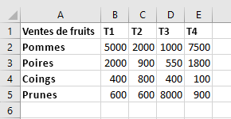
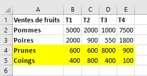
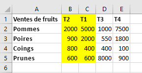

# <a name="work-with-worksheets-using-the-excel-javascript-api"></a><span data-ttu-id="234d0-103">Utiliser des feuilles de calcul à l’aide de l’API JavaScript pour Excel</span><span class="sxs-lookup"><span data-stu-id="234d0-103">Work with worksheets using the Excel JavaScript API</span></span>

<span data-ttu-id="234d0-p101">Cet article fournit des exemples de code qui montrent comment effectuer des tâches courantes à l’aide de feuilles de calcul utilisant l’API JavaScript pour Excel. Pour une liste complète des propriétés et des méthodes prises en charge par les objets `Worksheet` et `WorksheetCollection`, reportez-vous aux rubriques [Objet Worksheet (API JavaScript pour Excel)](/javascript/api/excel/excel.worksheet) et [Objet WorksheetCollection (API JavaScript pour Excel)](/javascript/api/excel/excel.worksheetcollection).</span><span class="sxs-lookup"><span data-stu-id="234d0-p101">This article provides code samples that show how to perform common tasks with worksheets using the Excel JavaScript API. For the complete list of properties and methods that the `Worksheet` and `WorksheetCollection` objects support, see [Worksheet Object (JavaScript API for Excel)](/javascript/api/excel/excel.worksheet) and [WorksheetCollection Object (JavaScript API for Excel)](/javascript/api/excel/excel.worksheetcollection).</span></span>

> [!NOTE]
> <span data-ttu-id="234d0-106">les informations contenues dans cet article s’appliquent uniquement aux feuilles de calcul standard. Elles ne concernent pas les feuilles « chart » ou « macro ».</span><span class="sxs-lookup"><span data-stu-id="234d0-106">The information in this article applies only to regular worksheets; it does not apply to "chart" sheets or "macro" sheets.</span></span>

## <a name="get-worksheets"></a><span data-ttu-id="234d0-107">Obtenir des feuilles de calcul</span><span class="sxs-lookup"><span data-stu-id="234d0-107">Get worksheets</span></span>

<span data-ttu-id="234d0-108">L’exemple de code suivant obtient la collection de feuilles de calcul, charge la propriété `name` de chaque feuille de calcul et écrit un message dans la console.</span><span class="sxs-lookup"><span data-stu-id="234d0-108">The following code sample gets the collection of worksheets, loads the `name` property of each worksheet, and writes a message to the console.</span></span>

```js
Excel.run(function (context) {
    var sheets = context.workbook.worksheets;
    sheets.load("items/name");

    return context.sync()
        .then(function () {
            if (sheets.items.length > 1) {
                console.log(`There are ${sheets.items.length} worksheets in the workbook:`);
            } else {
                console.log(`There is one worksheet in the workbook:`);
            }
            sheets.items.forEach(function (sheet) {
              console.log(sheet.name);
            });
        });
}).catch(errorHandlerFunction);
```

> [!NOTE]
> <span data-ttu-id="234d0-p102">La propriété `id` d’une feuille de calcul identifie de manière unique la feuille de calcul dans un classeur donné et sa valeur ne change pas, même lorsque la feuille de calcul est renommée ou déplacée. Lorsqu’une feuille de calcul est supprimée d’un classeur dans Excel sur Mac, la propriété `id` de la feuille de calcul supprimée peut être réaffectée à une nouvelle feuille de calcul créée par la suite.</span><span class="sxs-lookup"><span data-stu-id="234d0-p102">The `id` property of a worksheet uniquely identifies the worksheet in a given workbook and its value will remain the same even when the worksheet is renamed or moved. When a worksheet is deleted from a workbook in Excel on Mac, the `id` of the deleted worksheet may be reassigned to a new worksheet that is subsequently created.</span></span>

## <a name="get-the-active-worksheet"></a><span data-ttu-id="234d0-111">Obtenir la feuille de calcul active</span><span class="sxs-lookup"><span data-stu-id="234d0-111">Get the active worksheet</span></span>

<span data-ttu-id="234d0-112">L’exemple de code suivant obtient la feuille de calcul active, charge sa propriété `name` et écrit un message dans la console.</span><span class="sxs-lookup"><span data-stu-id="234d0-112">The following code sample gets the active worksheet, loads its `name` property, and writes a message to the console.</span></span>

```js
Excel.run(function (context) {
    var sheet = context.workbook.worksheets.getActiveWorksheet();
    sheet.load("name");

    return context.sync()
        .then(function () {
            console.log(`The active worksheet is "${sheet.name}"`);
        });
}).catch(errorHandlerFunction);
```

## <a name="set-the-active-worksheet"></a><span data-ttu-id="234d0-113">Définir la feuille de calcul active</span><span class="sxs-lookup"><span data-stu-id="234d0-113">Set the active worksheet</span></span>

<span data-ttu-id="234d0-p103">L’exemple de code suivant définit la feuille de calcul active sur la feuille de calcul nommée **Sample**, charge sa propriété `name` et écrit un message dans la console. S’il n’existe aucune feuille de calcul portant ce nom, la méthode `activate()` lève une erreur `ItemNotFound`.</span><span class="sxs-lookup"><span data-stu-id="234d0-p103">The following code sample sets the active worksheet to the worksheet named **Sample**, loads its `name` property, and writes a message to the console. If there is no worksheet with that name, the `activate()` method throws an `ItemNotFound` error.</span></span>

```js
Excel.run(function (context) {
    var sheet = context.workbook.worksheets.getItem("Sample");
    sheet.activate();
    sheet.load("name");

    return context.sync()
        .then(function () {
            console.log(`The active worksheet is "${sheet.name}"`);
        });
}).catch(errorHandlerFunction);
```

## <a name="reference-worksheets-by-relative-position"></a><span data-ttu-id="234d0-116">Référencer des feuilles de calcul en fonction de leur position relative</span><span class="sxs-lookup"><span data-stu-id="234d0-116">Reference worksheets by relative position</span></span>

<span data-ttu-id="234d0-117">Ces exemples montrent comment référencer une feuille de calcul en fonction de sa position relative.</span><span class="sxs-lookup"><span data-stu-id="234d0-117">These examples show how to reference a worksheet by its relative position.</span></span>

### <a name="get-the-first-worksheet"></a><span data-ttu-id="234d0-118">Obtenir la première feuille de calcul</span><span class="sxs-lookup"><span data-stu-id="234d0-118">Get the first worksheet</span></span>

<span data-ttu-id="234d0-119">L’exemple de code suivant obtient la première feuille de calcul du classeur, charge sa propriété `name` et écrit un message dans la console.</span><span class="sxs-lookup"><span data-stu-id="234d0-119">The following code sample gets the first worksheet in the workbook, loads its `name` property, and writes a message to the console.</span></span>

```js
Excel.run(function (context) {
    var firstSheet = context.workbook.worksheets.getFirst();
    firstSheet.load("name");

    return context.sync()
        .then(function () {
            console.log(`The name of the first worksheet is "${firstSheet.name}"`);
        });
}).catch(errorHandlerFunction);
```

### <a name="get-the-last-worksheet"></a><span data-ttu-id="234d0-120">Obtenir la dernière feuille de calcul</span><span class="sxs-lookup"><span data-stu-id="234d0-120">Get the last worksheet</span></span>

<span data-ttu-id="234d0-121">L’exemple de code suivant obtient la dernière feuille de calcul du classeur, charge sa propriété `name` et écrit un message dans la console.</span><span class="sxs-lookup"><span data-stu-id="234d0-121">The following code sample gets the last worksheet in the workbook, loads its `name` property, and writes a message to the console.</span></span>

```js
Excel.run(function (context) {
    var lastSheet = context.workbook.worksheets.getLast();
    lastSheet.load("name");

    return context.sync()
        .then(function () {
            console.log(`The name of the last worksheet is "${lastSheet.name}"`);
        });
}).catch(errorHandlerFunction);
```

### <a name="get-the-next-worksheet"></a><span data-ttu-id="234d0-122">Obtenir la feuille de calcul suivante</span><span class="sxs-lookup"><span data-stu-id="234d0-122">Get the next worksheet</span></span>

<span data-ttu-id="234d0-p104">L’exemple de code suivant obtient la feuille de calcul qui suit la feuille de calcul active du classeur, charge sa propriété `name` et écrit un message dans la console. S’il n’existe aucune feuille de calcul après la feuille de calcul active, la méthode `getNext()` lève une erreur `ItemNotFound`.</span><span class="sxs-lookup"><span data-stu-id="234d0-p104">The following code sample gets the worksheet that follows the active worksheet in the workbook, loads its `name` property, and writes a message to the console. If there is no worksheet after the active worksheet, the `getNext()` method throws an `ItemNotFound` error.</span></span>

```js
 Excel.run(function (context) {
    var currentSheet = context.workbook.worksheets.getActiveWorksheet();
    var nextSheet = currentSheet.getNext();
    nextSheet.load("name");

    return context.sync()
        .then(function () {
            console.log(`The name of the sheet that follows the active worksheet is "${nextSheet.name}"`);
        });
}).catch(errorHandlerFunction);
```

### <a name="get-the-previous-worksheet"></a><span data-ttu-id="234d0-125">Obtenir la feuille de calcul précédente</span><span class="sxs-lookup"><span data-stu-id="234d0-125">Get the previous worksheet</span></span>

<span data-ttu-id="234d0-p105">L’exemple de code suivant obtient la feuille de calcul qui précède la feuille de calcul active du classeur, charge sa propriété `name` et écrit un message dans la console. S’il n’existe aucune feuille de calcul avant la feuille de calcul active, la méthode `getPrevious()` lève une erreur `ItemNotFound`.</span><span class="sxs-lookup"><span data-stu-id="234d0-p105">The following code sample gets the worksheet that precedes the active worksheet in the workbook, loads its `name` property, and writes a message to the console. If there is no worksheet before the active worksheet, the `getPrevious()` method throws an `ItemNotFound` error.</span></span>

```js
Excel.run(function (context) {
    var currentSheet = context.workbook.worksheets.getActiveWorksheet();
    var previousSheet = currentSheet.getPrevious();
    previousSheet.load("name");

    return context.sync()
        .then(function () {
            console.log(`The name of the sheet that precedes the active worksheet is "${previousSheet.name}"`);
        });
}).catch(errorHandlerFunction);
```

## <a name="add-a-worksheet"></a><span data-ttu-id="234d0-128">Ajouter une feuille de calcul</span><span class="sxs-lookup"><span data-stu-id="234d0-128">Add a worksheet</span></span>

<span data-ttu-id="234d0-p106">L’exemple de code suivant ajoute une nouvelle feuille de calcul nommée **Sample** au classeur, charge ses propriétés `name` et `position`, et écrit un message dans la console. Le nouveau tableur est ajouté après toutes les feuilles de calcul existantes.</span><span class="sxs-lookup"><span data-stu-id="234d0-p106">The following code sample adds a new worksheet named **Sample** to the workbook, loads its `name` and `position` properties, and writes a message to the console. The new worksheet is added after all existing worksheets.</span></span>

```js
Excel.run(function (context) {
    var sheets = context.workbook.worksheets;

    var sheet = sheets.add("Sample");
    sheet.load("name, position");

    return context.sync()
        .then(function () {
            console.log(`Added worksheet named "${sheet.name}" in position ${sheet.position}`);
        });
}).catch(errorHandlerFunction);
```

### <a name="copy-an-existing-worksheet"></a><span data-ttu-id="234d0-131">Copier une feuille de calcul existante</span><span class="sxs-lookup"><span data-stu-id="234d0-131">Copy an existing worksheet</span></span>

<span data-ttu-id="234d0-132">`Worksheet.copy` ajoute une nouvelle feuille de calcul qui est une copie d’une feuille de calcul existante.</span><span class="sxs-lookup"><span data-stu-id="234d0-132">`Worksheet.copy` adds a new worksheet that is a copy of an existing worksheet.</span></span> <span data-ttu-id="234d0-133">Le nom de la nouvelle feuille de calcul aura un nombre ajouté à la fin, de façon cohérente avec la copie d’une feuille de calcul dans l’interface utilisateur d’Excel (par exemple, **MySheet (2)**).</span><span class="sxs-lookup"><span data-stu-id="234d0-133">The new worksheet's name will have a number appended to the end, in a manner consistent with copying a worksheet through the Excel UI (for example, **MySheet (2)**).</span></span> <span data-ttu-id="234d0-134">`Worksheet.copy` peut prendre deux paramètres, qui sont tous deux facultatifs :</span><span class="sxs-lookup"><span data-stu-id="234d0-134">`Worksheet.copy` can take two parameters, both of which are optional:</span></span>

- <span data-ttu-id="234d0-135">`positionType` – Un enum [WorksheetPositionType ](/javascript/api/excel/excel.worksheetpositiontype) spécifiant l’emplacement dans le classeur où la nouvelle feuille de calcul doit être ajoutée.</span><span class="sxs-lookup"><span data-stu-id="234d0-135">`positionType` - A [WorksheetPositionType](/javascript/api/excel/excel.worksheetpositiontype) enum specifying where in the workbook the new worksheet is to be added.</span></span>
- <span data-ttu-id="234d0-136">`relativeTo` – Si le `positionType` est `Before` ou `After`, vous devez spécifier une feuille de calcul par rapport à laquelle ajouter la nouvelle feuille (ce paramètre répond à la question « Avant ou après quoi ? »).</span><span class="sxs-lookup"><span data-stu-id="234d0-136">`relativeTo` - If the `positionType` is `Before` or `After`, you need to specify a worksheet relative to which the new sheet is to be added (this parameter answers the question "Before or after what?").</span></span>

<span data-ttu-id="234d0-137">L’exemple de code suivant copie la feuille de calcul active et insère la nouvelle feuille directement après la feuille de calcul active.</span><span class="sxs-lookup"><span data-stu-id="234d0-137">The following code sample copies the current worksheet and inserts the new sheet directly after the current worksheet.</span></span>

```js
Excel.run(function (context) {
    var myWorkbook = context.workbook;
    var sampleSheet = myWorkbook.worksheets.getActiveWorksheet();
    var copiedSheet = sampleSheet.copy(Excel.WorksheetPositionType.after, sampleSheet);
    return context.sync();
});
```

## <a name="delete-a-worksheet"></a><span data-ttu-id="234d0-138">Supprimer une feuille de calcul</span><span class="sxs-lookup"><span data-stu-id="234d0-138">Delete a worksheet</span></span>

<span data-ttu-id="234d0-139">L’exemple de code suivant supprime la dernière feuille de calcul dans le classeur (sous réserve qu’il ne s’agisse pas de la seule feuille dans le classeur) et écrit un message dans la console.</span><span class="sxs-lookup"><span data-stu-id="234d0-139">The following code sample deletes the final worksheet in the workbook (as long as it's not the only sheet in the workbook) and writes a message to the console.</span></span>

```js
Excel.run(function (context) {
    var sheets = context.workbook.worksheets;
    sheets.load("items/name");

    return context.sync()
        .then(function () {
            if (sheets.items.length === 1) {
                console.log("Unable to delete the only worksheet in the workbook");
            } else {
                var lastSheet = sheets.items[sheets.items.length - 1];

                console.log(`Deleting worksheet named "${lastSheet.name}"`);
                lastSheet.delete();

                return context.sync();
            };
        });
}).catch(errorHandlerFunction);
```

> [!NOTE]
> <span data-ttu-id="234d0-140">Une feuille de calcul avec une visibilité «[Très masquée](/javascript/api/excel/excel.sheetvisibility)» ne peut pas être supprimée avec la méthode `delete`.</span><span class="sxs-lookup"><span data-stu-id="234d0-140">A worksheet with a visibility of "[Very Hidden](/javascript/api/excel/excel.sheetvisibility)" cannot be deleted with the `delete` method.</span></span> <span data-ttu-id="234d0-141">Si vous souhaitez quand-même supprimer la feuille de calcul, vous devez commencer par modifier la visibilité.</span><span class="sxs-lookup"><span data-stu-id="234d0-141">If you wish to delete the worksheet anyway, you must first change the visibility.</span></span>

## <a name="rename-a-worksheet"></a><span data-ttu-id="234d0-142">Renommer une feuille de calcul</span><span class="sxs-lookup"><span data-stu-id="234d0-142">Rename a worksheet</span></span>

<span data-ttu-id="234d0-143">L’exemple de code suivant renomme la feuille de calcul active comme suit : **New Name**.</span><span class="sxs-lookup"><span data-stu-id="234d0-143">The following code sample changes the name of the active worksheet to **New Name**.</span></span>

```js
Excel.run(function (context) {
    var currentSheet = context.workbook.worksheets.getActiveWorksheet();
    currentSheet.name = "New Name";

    return context.sync();
}).catch(errorHandlerFunction);
```

## <a name="move-a-worksheet"></a><span data-ttu-id="234d0-144">Déplacer une feuille de calcul</span><span class="sxs-lookup"><span data-stu-id="234d0-144">Move a worksheet</span></span>

<span data-ttu-id="234d0-145">L’exemple de code suivant fait passer une feuille de calcul de la dernière position à la première position dans le classeur.</span><span class="sxs-lookup"><span data-stu-id="234d0-145">The following code sample moves a worksheet from the last position in the workbook to the first position in the workbook.</span></span>

```js
Excel.run(function (context) {
    var sheets = context.workbook.worksheets;
    sheets.load("items");

    return context.sync()
        .then(function () {
            var lastSheet = sheets.items[sheets.items.length - 1];
            lastSheet.position = 0;

            return context.sync();
        });
}).catch(errorHandlerFunction);
```

## <a name="set-worksheet-visibility"></a><span data-ttu-id="234d0-146">Définir la visibilité d’une feuille de calcul</span><span class="sxs-lookup"><span data-stu-id="234d0-146">Set worksheet visibility</span></span>

<span data-ttu-id="234d0-147">Ces exemples montrent comment définir la visibilité d’une feuille de calcul.</span><span class="sxs-lookup"><span data-stu-id="234d0-147">These examples show how to set the visibility of a worksheet.</span></span>

### <a name="hide-a-worksheet"></a><span data-ttu-id="234d0-148">Masquer une feuille de calcul</span><span class="sxs-lookup"><span data-stu-id="234d0-148">Hide a worksheet</span></span>

<span data-ttu-id="234d0-149">L’exemple de code suivant définit la visibilité de la feuille de calcul nommée **Exemple** à masquer, charge sa propriété `name` et écrit un message dans la console.</span><span class="sxs-lookup"><span data-stu-id="234d0-149">The following code sample sets the visibility of worksheet named **Sample** to hidden, loads its `name` property, and writes a message to the console.</span></span>

```js
Excel.run(function (context) {
    var sheet = context.workbook.worksheets.getItem("Sample");
    sheet.visibility = Excel.SheetVisibility.hidden;
    sheet.load("name");

    return context.sync()
        .then(function () {
            console.log(`Worksheet with name "${sheet.name}" is hidden`);
        });
}).catch(errorHandlerFunction);
```

### <a name="unhide-a-worksheet"></a><span data-ttu-id="234d0-150">Afficher une feuille de calcul</span><span class="sxs-lookup"><span data-stu-id="234d0-150">Unhide a worksheet</span></span>

<span data-ttu-id="234d0-151">L’exemple de code suivant définit la visibilité de la feuille de calcul nommée **Exemple** à afficher, charge sa propriété `name` et écrit un message dans la console.</span><span class="sxs-lookup"><span data-stu-id="234d0-151">The following code sample sets the visibility of worksheet named **Sample** to visible, loads its `name` property, and writes a message to the console.</span></span>

```js
Excel.run(function (context) {
    var sheet = context.workbook.worksheets.getItem("Sample");
    sheet.visibility = Excel.SheetVisibility.visible;
    sheet.load("name");

    return context.sync()
        .then(function () {
            console.log(`Worksheet with name "${sheet.name}" is visible`);
        });
}).catch(errorHandlerFunction);
```

## <a name="get-a-single-cell-within-a-worksheet"></a><span data-ttu-id="234d0-152">Obtenir une cellule simple dans une feuille de calcul</span><span class="sxs-lookup"><span data-stu-id="234d0-152">Get a single cell within a worksheet</span></span>

<span data-ttu-id="234d0-153">L’exemple de code suivant obtient la cellule située ligne 2, colonne 5 de la feuille de calcul nommée **Sample**, charge ses propriétés `address` et `values`, et écrit un message dans la console.</span><span class="sxs-lookup"><span data-stu-id="234d0-153">The following code sample gets the cell that is located in row 2, column 5 of the worksheet named **Sample**, loads its `address` and `values` properties, and writes a message to the console.</span></span> <span data-ttu-id="234d0-154">Les valeurs transmises par la méthode `getCell(row: number, column:number)` sont le numéro de ligne avec indice zéro et le numéro de colonne pour la cellule en cours d’extraction.</span><span class="sxs-lookup"><span data-stu-id="234d0-154">The values that are passed into the `getCell(row: number, column:number)` method are the zero-indexed row number and column number for the cell that is being retrieved.</span></span>

```js
Excel.run(function (context) {
    var sheet = context.workbook.worksheets.getItem("Sample");
    var cell = sheet.getCell(1, 4);
    cell.load("address, values");

    return context.sync()
        .then(function() {
            console.log(`The value of the cell in row 2, column 5 is "${cell.values[0][0]}" and the address of that cell is "${cell.address}"`);
        })
}).catch(errorHandlerFunction);
```

## <a name="detect-data-changes"></a><span data-ttu-id="234d0-155">Détecter les modifications de données</span><span class="sxs-lookup"><span data-stu-id="234d0-155">Detect data changes</span></span>

<span data-ttu-id="234d0-156">Votre complément peut avoir besoin de réagir aux utilisateurs modifiant les données dans une feuille de calcul.</span><span class="sxs-lookup"><span data-stu-id="234d0-156">Your add-in may need to react to users changing the data in a worksheet.</span></span> <span data-ttu-id="234d0-157">Pour détecter ces modifications, vous pouvez [inscrire un gestionnaire d’événements](excel-add-ins-events.md#register-an-event-handler) à l’événement `onChanged` d’une feuille de calcul.</span><span class="sxs-lookup"><span data-stu-id="234d0-157">To detect these changes, you can [register an event handler](excel-add-ins-events.md#register-an-event-handler) for the `onChanged` event of a worksheet.</span></span> <span data-ttu-id="234d0-158">Le gestionnaires d’événements de l’événement `onChanged` reçoit un objet [WorksheetChangedEventArgs](/javascript/api/excel/excel.worksheetchangedeventargs) lorsque l’événement se déclenche.</span><span class="sxs-lookup"><span data-stu-id="234d0-158">Event handlers for the `onChanged` event receive a [WorksheetChangedEventArgs](/javascript/api/excel/excel.worksheetchangedeventargs) object when the event fires.</span></span>

<span data-ttu-id="234d0-159">L’objet `WorksheetChangedEventArgs` fournit des informations sur les modifications et la source.</span><span class="sxs-lookup"><span data-stu-id="234d0-159">The `WorksheetChangedEventArgs` object provides information about the changes and the source.</span></span> <span data-ttu-id="234d0-160">Puisque `onChanged` se déclenche lorsque le format ou la valeur des données sont modifiés, il peut être utile que votre complément vérifie si les valeurs ont réellement été modifiées.</span><span class="sxs-lookup"><span data-stu-id="234d0-160">Since `onChanged` fires when either the format or value of the data changes, it can be useful to have your add-in check if the values have actually changed.</span></span> <span data-ttu-id="234d0-161">La propriété de `details` regroupe ces informations en tant qu’un [ChangedEventDetail](/javascript/api/excel/excel.changedeventdetail).</span><span class="sxs-lookup"><span data-stu-id="234d0-161">The `details` property encapsulates this information as a [ChangedEventDetail](/javascript/api/excel/excel.changedeventdetail).</span></span> <span data-ttu-id="234d0-162">L’exemple de code suivant illustre la procédure d’affichage des valeurs et des types d’une cellule qui a été modifiée, avant et après modification.</span><span class="sxs-lookup"><span data-stu-id="234d0-162">The following code sample shows how to display the before and after values and types of a cell that has been changed.</span></span>

```js
// This function would be used as an event handler for the Worksheet.onChanged event.
function onWorksheetChanged(eventArgs) {
    Excel.run(function (context) {
        var details = eventArgs.details;
        var address = eventArgs.address;

        // Print the before and after types and values to the console.
        console.log(`Change at ${address}: was ${details.valueBefore}(${details.valueTypeBefore}),`
            + ` now is ${details.valueAfter}(${details.valueTypeAfter})`);
        return context.sync();
    });
}
```

## <a name="handle-sorting-events"></a><span data-ttu-id="234d0-163">Gérer les événements de tri</span><span class="sxs-lookup"><span data-stu-id="234d0-163">Handle sorting events</span></span>

<span data-ttu-id="234d0-164">Les  événements `onColumnSorted` et `onRowSorted` indiquent quand les données d’une feuille de calcul sont triées.</span><span class="sxs-lookup"><span data-stu-id="234d0-164">The `onColumnSorted` and `onRowSorted` events indicate when any worksheet data is sorted.</span></span> <span data-ttu-id="234d0-165">Ces événements sont connectés à des objets individuels `Worksheet` et aux classeurs `WorkbookCollection`.</span><span class="sxs-lookup"><span data-stu-id="234d0-165">These events are connected to individual `Worksheet` objects and to the workbook's `WorkbookCollection`.</span></span> <span data-ttu-id="234d0-166">Il se déclenche si le tri est effectué par programme ou manuellement via l’interface utilisateur d’Excel.</span><span class="sxs-lookup"><span data-stu-id="234d0-166">They fire whether the sorting is done programmatically or manually through the Excel user interface.</span></span>

> [!NOTE]
> <span data-ttu-id="234d0-167">`onColumnSorted` est déclenché lorsque les colonnes sont triées suite à une opération de tri de gauche à droite.</span><span class="sxs-lookup"><span data-stu-id="234d0-167">`onColumnSorted` fires when columns are sorted as the result of a left-to-right sort operation.</span></span> <span data-ttu-id="234d0-168">`onRowSorted` est déclenché lorsque les lignes sont triées suite à une opération de tri de haut en bas.</span><span class="sxs-lookup"><span data-stu-id="234d0-168">`onRowSorted` fires when rows are sorted as the result of a top-to-bottom sort operation.</span></span> <span data-ttu-id="234d0-169">Le tri d’un tableau à l’aide du menu déroulant sur un en-tête de colonne génère un événement `onRowSorted`.</span><span class="sxs-lookup"><span data-stu-id="234d0-169">Sorting a table using the drop-down menu on a column header results in an `onRowSorted` event.</span></span> <span data-ttu-id="234d0-170">L’événement correspond au déplacement, et non à ce qui est considéré comme les critères de tri.</span><span class="sxs-lookup"><span data-stu-id="234d0-170">The event corresponds with what is moving, not what is being considered as the sorting criteria.</span></span>

<span data-ttu-id="234d0-171">Les événements `onColumnSorted` et `onRowSorted` fournissent leurs rappels avec [WorksheetColumnSortedEventArgs](/javascript/api/excel/excel.worksheetcolumnsortedeventargs) ou [WorksheetRowSortedEventArgs](/javascript/api/excel/excel.worksheetrowsortedeventargs), respectivement.</span><span class="sxs-lookup"><span data-stu-id="234d0-171">The `onColumnSorted` and `onRowSorted` events provide their callbacks with [WorksheetColumnSortedEventArgs](/javascript/api/excel/excel.worksheetcolumnsortedeventargs) or [WorksheetRowSortedEventArgs](/javascript/api/excel/excel.worksheetrowsortedeventargs), respectively.</span></span> <span data-ttu-id="234d0-172">Ces éléments fournissent des détails supplémentaires sur l’événement.</span><span class="sxs-lookup"><span data-stu-id="234d0-172">These give more details about the event.</span></span> <span data-ttu-id="234d0-173">En particulier, les `EventArgs` ont une propriété `address` qui représente les lignes ou les colonnes déplacées suite à l’opération de tri.</span><span class="sxs-lookup"><span data-stu-id="234d0-173">In particular, both `EventArgs` have an `address` property that represents the rows or columns moved as a result of the sort operation.</span></span> <span data-ttu-id="234d0-174">Une cellule avec du contenu trié est incluse, même si la valeur de cette cellule ne faisait pas partie des critères de tri.</span><span class="sxs-lookup"><span data-stu-id="234d0-174">Any cell with sorted content is included, even if that cell's value was not part of the sorting criteria.</span></span>

<span data-ttu-id="234d0-175">Les images suivantes montrent les plages retournées par la propriété `address` pour les événements de tri.</span><span class="sxs-lookup"><span data-stu-id="234d0-175">The following images show the ranges returned by the `address` property for sort events.</span></span> <span data-ttu-id="234d0-176">Voici d’abord les exemples de données avant le tri :</span><span class="sxs-lookup"><span data-stu-id="234d0-176">First, here is the sample data before sorting:</span></span>



<span data-ttu-id="234d0-178">Si un tri de haut en bas est effectué sur «**Q1**» (valeurs dans «**B**»), les lignes en surbrillance suivantes sont renvoyées par `WorksheetRowSortedEventArgs.address`:</span><span class="sxs-lookup"><span data-stu-id="234d0-178">If a top-to-bottom sort is performed on "**Q1**" (the values in "**B**"), the following highlighted rows are returned by `WorksheetRowSortedEventArgs.address`:</span></span>



<span data-ttu-id="234d0-181">Si un tri de gauche à droite est effectué sur «**Quinces**» (valeurs dans «**4**») sur les données d’origine, les colonnes en surbrillance suivantes sont renvoyées par `WorksheetColumnsSortedEventArgs.address` :</span><span class="sxs-lookup"><span data-stu-id="234d0-181">If a left-to-right sort is performed on "**Quinces**" (the values in "**4**") on the original data, the following highlighted columns are returned by `WorksheetColumnsSortedEventArgs.address`:</span></span>



<span data-ttu-id="234d0-184">L’exemple de code suivant montre comment inscrire un gestionnaire d’événements pour l’événement `Worksheet.onRowSorted`.</span><span class="sxs-lookup"><span data-stu-id="234d0-184">The following code sample shows how to register an event handler for the `Worksheet.onRowSorted` event.</span></span> <span data-ttu-id="234d0-185">Le rappel du gestionnaire efface la couleur de remplissage de la plage, puis remplit les cellules des lignes déplacées.</span><span class="sxs-lookup"><span data-stu-id="234d0-185">The handler's callback clears the fill color for the range, then fills the cells of the moved rows.</span></span>

```js
Excel.run(function (context) {
    var sheet = context.workbook.worksheets.getActiveWorksheet();

    // This will fire whenever a row has been moved as the result of a sort action.
    sheet.onRowSorted.add(function (event) {
        return Excel.run(function (context) {
            console.log("Row sorted: " + event.address);
            var sheet = context.workbook.worksheets.getActiveWorksheet();

            // Clear formatting for section, then highlight the sorted area.
            sheet.getRange("A1:E5").format.fill.clear();
            if (event.address !== "") {
                sheet.getRanges(event.address).format.fill.color = "yellow";
            }

            return context.sync();
        });
    });

    return context.sync();
}).catch(errorHandlerFunction);
```

## <a name="find-all-cells-with-matching-text"></a><span data-ttu-id="234d0-186">Trouver toutes les cellules avec du texte correspondant</span><span class="sxs-lookup"><span data-stu-id="234d0-186">Find all cells with matching text</span></span>

<span data-ttu-id="234d0-187">L’objet `Worksheet` dispose d’une méthode`find` pour rechercher une chaîne spécifiée dans la feuille de calcul.</span><span class="sxs-lookup"><span data-stu-id="234d0-187">The `Worksheet` object has a `find` method to search for a specified string within the worksheet.</span></span> <span data-ttu-id="234d0-188">Il renvoie un objet`RangeAreas`, qui est une collection d’objets `Range` qui peuvent être modifiés tous en même temps.</span><span class="sxs-lookup"><span data-stu-id="234d0-188">It returns a `RangeAreas` object, which is a collection of `Range` objects that can be edited all at once.</span></span> <span data-ttu-id="234d0-189">L’exemple de code suivant recherche toutes les cellules contenant des valeurs égales à la chaîne **Complète** et les colore en vert.</span><span class="sxs-lookup"><span data-stu-id="234d0-189">The following code sample finds all cells with values equal to the string **Complete** and colors them green.</span></span> <span data-ttu-id="234d0-190">Notez que `findAll` génère une erreur `ItemNotFound` si la chaîne spécifiée n’existe pas dans la feuille de calcul.</span><span class="sxs-lookup"><span data-stu-id="234d0-190">Note that `findAll` will throw an `ItemNotFound` error if the specified string doesn't exist in the worksheet.</span></span> <span data-ttu-id="234d0-191">Si vous pensez que la chaîne spécifiée peut ne pas exister dans la feuille de calcul, utilisez la méthode[findAllOrNullObject](excel-add-ins-advanced-concepts.md#ornullobject-methods) à la place, pour que votre code gère ce scénario plus facilement.</span><span class="sxs-lookup"><span data-stu-id="234d0-191">If you expect that the specified string may not exist in the worksheet, use the [findAllOrNullObject](excel-add-ins-advanced-concepts.md#ornullobject-methods) method instead, so your code gracefully handles that scenario.</span></span>

```js
Excel.run(function (context) {
    var sheet = context.workbook.worksheets.getItem("Sample");
    var foundRanges = sheet.findAll("Complete", {
        completeMatch: true, // findAll will match the whole cell value
        matchCase: false // findAll will not match case
    });

    return context.sync()
        .then(function() {
            foundRanges.format.fill.color = "green"
    });
}).catch(errorHandlerFunction);
```

> [!NOTE]
> <span data-ttu-id="234d0-192">Cette section décrit comment rechercher des cellules et plages à l’aide des `Worksheet` fonctions de l’objet.</span><span class="sxs-lookup"><span data-stu-id="234d0-192">This section describes how to find cells and ranges using the `Worksheet` object's functions.</span></span> <span data-ttu-id="234d0-193">Plus d’informations sur l’extraction de plage sont disponibles dans les articles spécifiques.</span><span class="sxs-lookup"><span data-stu-id="234d0-193">More range retrieval information can be found in object-specific articles.</span></span>
> - <span data-ttu-id="234d0-194">Pour obtenir des exemples qui montrent comment obtenir une plage dans une feuille de calcul à l’aide de l’objet `Range`, reportez-vous à la rubrique [Utiliser des plages à l’aide de l’API JavaScript pour Excel](excel-add-ins-ranges.md).</span><span class="sxs-lookup"><span data-stu-id="234d0-194">For examples that show how to get a range within a worksheet using the `Range` object, see [Work with ranges using the Excel JavaScript API](excel-add-ins-ranges.md).</span></span>
> - <span data-ttu-id="234d0-195">Pour obtenir des exemples qui montrent comment obtenir une plage dans un objet `Table`, reportez-vous à la rubrique [Utiliser des tableaux à l’aide de l’API JavaScript pour Excel](excel-add-ins-tables.md).</span><span class="sxs-lookup"><span data-stu-id="234d0-195">For examples that show how to get ranges from a `Table` object, see [Work with tables using the Excel JavaScript API](excel-add-ins-tables.md).</span></span>
> - <span data-ttu-id="234d0-196">Pour consulter des exemples qui montrent comment rechercher une grande plage pour plusieurs sous-plages basées sur les caractéristiques de cellule, voir [Travailler avec plusieurs plages simultanément dans des compléments Excel](excel-add-ins-multiple-ranges.md).</span><span class="sxs-lookup"><span data-stu-id="234d0-196">For examples that show how to search a large range for multiple sub-ranges based on cell characteristics, see [Work with multiple ranges simultaneously in Excel add-ins](excel-add-ins-multiple-ranges.md).</span></span>

## <a name="filter-data"></a><span data-ttu-id="234d0-197">Filtrer les données</span><span class="sxs-lookup"><span data-stu-id="234d0-197">Filter data</span></span>

<span data-ttu-id="234d0-198">Un [filtre automatique](/javascript/api/excel/excel.autofilter) applique des filtres de données sur une plage de cellules dans la feuille de calcul.</span><span class="sxs-lookup"><span data-stu-id="234d0-198">An [AutoFilter](/javascript/api/excel/excel.autofilter) applies data filters across a range within the worksheet.</span></span> <span data-ttu-id="234d0-199">Cela a été créé avec `Worksheet.autoFilter.apply`, qui comporte les paramètres suivants:</span><span class="sxs-lookup"><span data-stu-id="234d0-199">This is created with `Worksheet.autoFilter.apply`, which has the following parameters:</span></span>

- <span data-ttu-id="234d0-200">`range`: La plage à laquelle le filtre est appliqué, spécifiée sous la forme d’un`Range` objet ou d’une chaîne.</span><span class="sxs-lookup"><span data-stu-id="234d0-200">`range`: The range to which the filter is applied, specified as either a `Range` object or a string.</span></span>
- <span data-ttu-id="234d0-201">`columnIndex`: L’index de colonne de base zéro par rapport à laquelle les critères de filtre sont évaluées.</span><span class="sxs-lookup"><span data-stu-id="234d0-201">`columnIndex`: The zero-based column index against which the filter criteria is evaluated.</span></span>
- <span data-ttu-id="234d0-202">`criteria`: Un objet[FilterCriteria](/javascript/api/excel/excel.filtercriteria)afin de déterminer les lignes doivent être filtrées en fonction de la cellule de la colonne.</span><span class="sxs-lookup"><span data-stu-id="234d0-202">`criteria`: A [FilterCriteria](/javascript/api/excel/excel.filtercriteria) object determining which rows should be filtered based on the column's cell.</span></span>

<span data-ttu-id="234d0-203">Le premier exemple de code montre comment ajouter un filtre à la plage utilisée de la feuille de calcul.</span><span class="sxs-lookup"><span data-stu-id="234d0-203">The first code sample shows how to add a filter to the worksheet's used range.</span></span> <span data-ttu-id="234d0-204">Ce filtre masque les entrées qui ne sont pas dans les premiers 25%, basé sur les valeurs de colonne **3**.</span><span class="sxs-lookup"><span data-stu-id="234d0-204">This filter will hide entries that are not in the top 25%, based on the values in column **3**.</span></span>

```js
Excel.run(function (context) {
    var sheet = context.workbook.worksheets.getActiveWorksheet();
    var farmData = sheet.getUsedRange();

    // This filter will only show the rows with the top 25% of values in column 3.
    sheet.autoFilter.apply(farmData, 3, { criterion1: "25", filterOn: Excel.FilterOn.topPercent });
    return context.sync();
}).catch(errorHandlerFunction);
```

<span data-ttu-id="234d0-205">L’exemple de code suivant montre comment actualiser le filtre automatique à l’aide de la méthode`reapply`.</span><span class="sxs-lookup"><span data-stu-id="234d0-205">The next code sample shows how to refresh the auto-filter using the `reapply` method.</span></span> <span data-ttu-id="234d0-206">Cette opération doit être effectuée lorsque les données dans la plage changent.</span><span class="sxs-lookup"><span data-stu-id="234d0-206">This should be done when the data in the range changes.</span></span>

```js
Excel.run(function (context) {
    var sheet = context.workbook.worksheets.getActiveWorksheet();
    sheet.autoFilter.reapply();
    return context.sync();
}).catch(errorHandlerFunction);
```

<span data-ttu-id="234d0-207">L’exemple de code de filtre automatique final montre comment supprimer le filtre automatique de la feuille de calcul avec la méthode`remove`.</span><span class="sxs-lookup"><span data-stu-id="234d0-207">The final auto-filter code sample shows how to remove the auto-filter from the worksheet with the `remove` method.</span></span>

```js
Excel.run(function (context) {
    var sheet = context.workbook.worksheets.getActiveWorksheet();
    sheet.autoFilter.remove();
    return context.sync();
}).catch(errorHandlerFunction);
```

<span data-ttu-id="234d0-208">Un `AutoFilter` peut également être appliqué aux tableaux individuels.</span><span class="sxs-lookup"><span data-stu-id="234d0-208">An `AutoFilter` can also be applied to individual tables.</span></span> <span data-ttu-id="234d0-209">Pour plus d’informations, consultez [Utiliser des tableaux avec l’API JavaScript Excel](excel-add-ins-tables.md#autofilter).</span><span class="sxs-lookup"><span data-stu-id="234d0-209">See [Work with tables using the Excel JavaScript API](excel-add-ins-tables.md#autofilter) for more information.</span></span>

## <a name="data-protection"></a><span data-ttu-id="234d0-210">Protection des données</span><span class="sxs-lookup"><span data-stu-id="234d0-210">Data protection</span></span>

<span data-ttu-id="234d0-211">Votre complément permet de contrôler la possibilité qu’a un utilisateur de modifier des données dans une feuille de calcul.</span><span class="sxs-lookup"><span data-stu-id="234d0-211">Your add-in can control a user's ability to edit data in a worksheet.</span></span> <span data-ttu-id="234d0-212">La propriété `protection` de la feuille de calcul est un objet [WorksheetProtection](/javascript/api/excel/excel.worksheetprotection) avec une méthode `protect()`.</span><span class="sxs-lookup"><span data-stu-id="234d0-212">The worksheet's `protection` property is a [WorksheetProtection](/javascript/api/excel/excel.worksheetprotection) object with a `protect()` method.</span></span> <span data-ttu-id="234d0-213">L’exemple suivant illustre un scénario de base permettant d’activer/de désactiver la protection complète de la feuille de calcul active.</span><span class="sxs-lookup"><span data-stu-id="234d0-213">The following example shows a basic scenario toggling the complete protection of the active worksheet.</span></span>

```js
Excel.run(function (context) {
    var activeSheet = context.workbook.worksheets.getActiveWorksheet();
    activeSheet.load("protection/protected");

    return context.sync().then(function() {
        if (!activeSheet.protection.protected) {
            activeSheet.protection.protect();
        }
    })
}).catch(errorHandlerFunction);
```

<span data-ttu-id="234d0-214">La méthode `protect` présente deux paramètres facultatifs :</span><span class="sxs-lookup"><span data-stu-id="234d0-214">The `protect` method has two optional parameters:</span></span>

- <span data-ttu-id="234d0-215">`options` : objet [WorksheetProtectionOptions](/javascript/api/excel/excel.worksheetprotectionoptions) définissant des restrictions de modification spécifiques.</span><span class="sxs-lookup"><span data-stu-id="234d0-215">`options`: A [WorksheetProtectionOptions](/javascript/api/excel/excel.worksheetprotectionoptions) object defining specific editing restrictions.</span></span>
- <span data-ttu-id="234d0-216">`password` : chaîne représentant le mot de passe nécessaire pour qu’un utilisateur puisse ignorer la protection et modifier la feuille de calcul.</span><span class="sxs-lookup"><span data-stu-id="234d0-216">`password`: A string representing the password needed for a user to bypass protection and edit the worksheet.</span></span>

<span data-ttu-id="234d0-217">L’article [Protéger une feuille de calcul](https://support.office.com/article/protect-a-worksheet-3179efdb-1285-4d49-a9c3-f4ca36276de6) comporte davantage d’informations sur la protection des feuilles de calcul et leur modification via l’interface utilisateur Excel.</span><span class="sxs-lookup"><span data-stu-id="234d0-217">The article [Protect a worksheet](https://support.office.com/article/protect-a-worksheet-3179efdb-1285-4d49-a9c3-f4ca36276de6) has more information about worksheet protection and how to change it through the Excel UI.</span></span>

## <a name="page-layout-and-print-settings"></a><span data-ttu-id="234d0-218">Mise en page et paramètres d’impression</span><span class="sxs-lookup"><span data-stu-id="234d0-218">Page layout and print settings</span></span>

<span data-ttu-id="234d0-219">Les compléments ont accès aux paramètres de mise en page à un niveau de feuille de calcul.</span><span class="sxs-lookup"><span data-stu-id="234d0-219">Add-ins have access to page layout settings at a worksheet level.</span></span> <span data-ttu-id="234d0-220">Ils contrôlent comment la feuille est imprimée.</span><span class="sxs-lookup"><span data-stu-id="234d0-220">These control how the sheet is printed.</span></span> <span data-ttu-id="234d0-221">Un `Worksheet` objet a trois propriétés de mise en page : `horizontalPageBreaks`, `verticalPageBreaks`, `pageLayout`.</span><span class="sxs-lookup"><span data-stu-id="234d0-221">A `Worksheet` object has three layout-related properties: `horizontalPageBreaks`, `verticalPageBreaks`, `pageLayout`.</span></span>

<span data-ttu-id="234d0-222">`Worksheet.horizontalPageBreaks` et `Worksheet.verticalPageBreaks` sont [PageBreakCollections](/javascript/api/excel/excel.pagebreakcollection).</span><span class="sxs-lookup"><span data-stu-id="234d0-222">`Worksheet.horizontalPageBreaks` and `Worksheet.verticalPageBreaks` are [PageBreakCollections](/javascript/api/excel/excel.pagebreakcollection).</span></span> <span data-ttu-id="234d0-223">Il s’agit de collections de [PageBreaks](/javascript/api/excel/excel.pagebreak), lequel spécifient des plages dans lesquelles les sauts de page manuels sont insérés.</span><span class="sxs-lookup"><span data-stu-id="234d0-223">These are collections of [PageBreaks](/javascript/api/excel/excel.pagebreak), which specify ranges where manual page breaks are inserted.</span></span> <span data-ttu-id="234d0-224">Exemple de code suivant ajoute un saut de page horizontal au-dessus de la ligne **21**.</span><span class="sxs-lookup"><span data-stu-id="234d0-224">The following code sample adds a horizontal page break above row **21**.</span></span>

```js
Excel.run(function (context) {
    var sheet = context.workbook.worksheets.getActiveWorksheet();
    sheet.horizontalPageBreaks.add("A21:E21"); // The page break is added above this range.
    return context.sync();
}).catch(errorHandlerFunction);
```

<span data-ttu-id="234d0-225">`Worksheet.pageLayout` est un objet [PageLayout](/javascript/api/excel/excel.pagelayout).</span><span class="sxs-lookup"><span data-stu-id="234d0-225">`Worksheet.pageLayout` is a [PageLayout](/javascript/api/excel/excel.pagelayout) object.</span></span> <span data-ttu-id="234d0-226">Cet objet contient les paramètres de mise en page et impression qui ne dépendent pas d’une implémentation spécifique à l’imprimante.</span><span class="sxs-lookup"><span data-stu-id="234d0-226">This object contains layout and print settings that are not dependent any printer-specific implementation.</span></span> <span data-ttu-id="234d0-227">Ces paramètres incluent marges, orientation, numérotation, lignes de titre et zone d’impression.</span><span class="sxs-lookup"><span data-stu-id="234d0-227">These settings include margins, orientation, page numbering, title rows, and print area.</span></span>

<span data-ttu-id="234d0-228">Exemple de code suivant centre la page (horizontalement et verticalement), définit une ligne de titre qui est imprimée en haut de chaque page et définit la zone imprimée sur une sous-section de la feuille de calcul.</span><span class="sxs-lookup"><span data-stu-id="234d0-228">The following code sample centers the page (both vertically and horizontally), sets a title row that will be printed at the top of every page, and sets the printed area to a subsection of the worksheet.</span></span>

```js
Excel.run(function (context) {
    var sheet = context.workbook.worksheets.getActiveWorksheet();

    // Center the page in both directions.
    sheet.pageLayout.centerHorizontally = true;
    sheet.pageLayout.centerVertically = true;

    // Set the first row as the title row for every page.
    sheet.pageLayout.setPrintTitleRows("$1:$1");

    // Limit the area to be printed to the range "A1:D100".
    sheet.pageLayout.setPrintArea("A1:D100");

    return context.sync();
}).catch(errorHandlerFunction);
```

## <a name="see-also"></a><span data-ttu-id="234d0-229">Voir aussi</span><span class="sxs-lookup"><span data-stu-id="234d0-229">See also</span></span>

- [<span data-ttu-id="234d0-230">Concepts fondamentaux de programmation avec l’API JavaScript pour Excel</span><span class="sxs-lookup"><span data-stu-id="234d0-230">Fundamental programming concepts with the Excel JavaScript API</span></span>](excel-add-ins-core-concepts.md)
