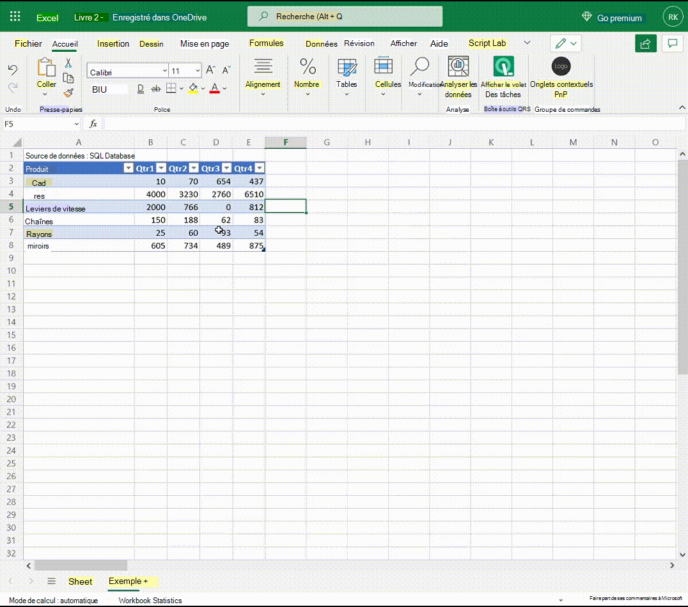

L’animation suivante montre comment les événements peuvent activer la visibilité des onglets contextuels et modifier l’état activé des boutons.

1. Au début, le focus n’est pas sur le tableau.
1. Un clic est fait sur une cellule de tableau et l’onglet contextuel Personnalisé **Données** de table apparaît sur le ruban (en plus de l’onglet contextuel intégré **Table Design).**
1. La sélection de **l’onglet Données** de table l’ouvre. Deux des boutons de l’onglet sont désactivés.
1. La modification des données dans une cellule active les deux boutons.
1. Cliquer sur l’un des boutons désactive à nouveau les deux boutons.
1. Cliquer sur une cellule en dehors du tableau supprime le focus du tableau et les deux onglets contextuels sont supprimés du ruban.

