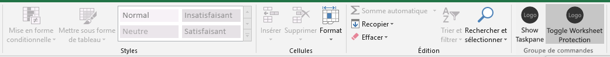

Dans cette étape du didacticiel, vous allez ajouter un autre bouton au ruban qui, lorsque l’utilisateur clique dessus, exécute une fonction qui vous allez définir et qui active/désactive la protection de la feuille de calcul.

> [!NOTE]
> Cette page décrit une étape individuelle du didacticiel sur le complément Excel. Si vous êtes arrivé à cette page via les résultats du moteur de recherche ou d’un autre lien direct, accédez à la page d’introduction du [didacticiel sur le complément Excel](../tutorials/excel-tutorial.yml) pour démarrer le didacticiel à partir du début.

## <a name="configure-the-manifest-to-add-a-second-ribbon-button"></a>Configuration du manifeste pour ajouter un deuxième bouton de ruban

1. Ouvrez le fichier manifeste **my-office-add-in-manifest.xml**.
2. Recherchez l’élément `<Control>`. Cet élément définit le bouton **Afficher le volet des pages** sur le ruban **Accueil** que vous utilisez pour lancer le complément. Nous allons ajouter un deuxième bouton au même groupe sur le ruban **Accueil**. Entre la balise Control de fin (`</Control>`) et la balise Group de fin (`</Group>`), ajoutez le balisage suivant.

    ```xml
    <Control xsi:type="Button" id="<!--TODO1: Unique (in manifest) name for button -->">
        <Label resid="<!--TODO2: Button label -->" />
        <Supertip>            
            <Title resid="<!-- TODO3: Button tool tip title -->" />
            <Description resid="<!-- TODO4: Button tool tip description -->" />
        </Supertip>
        <Icon>
            <bt:Image size="16" resid="Contoso.tpicon_16x16" />
            <bt:Image size="32" resid="Contoso.tpicon_32x32" />
            <bt:Image size="80" resid="Contoso.tpicon_80x80" />
        </Icon>
        <Action xsi:type="<!-- TODO5: Specify the type of action-->">
            <!-- TODO6: Identify the function.-->
        </Action>
    </Control>
    ```

3. Remplacez `TODO1` par une chaîne qui attribue un ID unique au bouton au sein de ce fichier manifeste. Il n’existe qu’un seul autre bouton dans le fichier manifeste, donc ce n’est pas difficile. Étant donné que notre bouton va activer ou désactiver la protection de la feuille de calcul, utilisez « ToggleProtection ». Lorsque vous avez terminé, la balise Control de début doit ressembler à ce qui suit :

    ```xml
    <Control xsi:type="Button" id="ToggleProtection">
    ```

4. Les trois éléments `TODO` suivants définissent les éléments « resid », c’est-à-dire les ID de ressource. Une ressource est une chaîne. Vous allez créer ces trois chaînes lors d’une étape ultérieure. Pour l’instant, vous devez attribuer des ID aux ressources. L’étiquette du bouton doit indiquer « Toggle Protection », mais l’*ID* de cette chaîne doit être « ProtectionButtonLabel », donc l’élément `Label` terminé doit ressembler au code suivant :

    ```xml
    <Label resid="ProtectionButtonLabel" />
    ```

5. L’élément `SuperTip` définit l’info-bulle du bouton. Le titre de l’info-bulle doit être identique à l’étiquette du bouton, nous utilisons donc le même ID de ressource : « ProtectionButtonLabel ». La description de l’info-bulle sera « Cliquez pour activer/désactiver la protection de la feuille de calcul ». Néanmoins, l’élément `ID` doit être « ProtectionButtonToolTip ». Ainsi, lorsque vous avez terminé, l’ensemble du balisage `SuperTip` doit ressembler au code suivant : 

    ```xml
    <Supertip>            
        <Title resid="ProtectionButtonLabel" />
        <Description resid="ProtectionButtonToolTip" />
    </Supertip>
    ```

   > [!NOTE] 
   > Dans un complément de production, vous n’utiliseriez pas la même icône pour deux boutons différents, mais pour simplifier ce didacticiel, nous allons le faire. Par conséquent, le balisage `Icon` de notre nouvel élément `Control` est simplement une copie de l’élément `Icon` provenant de l’élément `Control` existant. 

6. Le type de l’élément `Action` se trouvant à l’intérieur de l’élément `Control` d’origine qui était déjà présent dans le fichier manifeste est défini sur `ShowTaskpane`, mais notre nouveau bouton ne va pas ouvrir un volet Office, il va exécuter une fonction personnalisée que vous allez créer à une étape ultérieure. Il faut donc remplacer `TODO5` par `ExecuteFunction`, c’est-à-dire le type d’action pour les boutons qui déclenchent des fonctions personnalisées. La balise `Action` de début doit ressembler au code suivant :
 
    ```xml
    <Action xsi:type="ExecuteFunction">
    ```

7. L’élément `Action` d’origine possède des éléments enfants qui spécifient un ID de volet Office ainsi qu’une URL de la page qui doit être ouverte dans le volet Office. Toutefois, un élément `Action` de type `ExecuteFunction` comporte un élément enfant unique qui nomme la fonction que le contrôle exécute. Vous créerez cette fonction à une étape ultérieure, et la nommerez `toggleProtection`. Par conséquent, remplacez `TODO6` par le balisage suivant :
 
    ```xml
    <FunctionName>toggleProtection</FunctionName>
    ```

    Le balisage `Control` complet doit à présent ressembler à ce qui suit :

    ```xml
    <Control xsi:type="Button" id="ToggleProtection">
        <Label resid="ProtectionButtonLabel" />
        <Supertip>            
            <Title resid="ProtectionButtonLabel" />
            <Description resid="ProtectionButtonToolTip" />
        </Supertip>
        <Icon>
            <bt:Image size="16" resid="Contoso.tpicon_16x16" />
            <bt:Image size="32" resid="Contoso.tpicon_32x32" />
            <bt:Image size="80" resid="Contoso.tpicon_80x80" />
        </Icon>
        <Action xsi:type="ExecuteFunction">
           <FunctionName>toggleProtection</FunctionName>
        </Action>
    </Control>
    ```

8. Faites défiler vers le bas jusqu’à la section `Resources` du manifeste.

9. Ajoutez le balisage suivant en tant qu’enfant de l’élément `bt:ShortStrings`.

    ```xml
    <bt:String id="ProtectionButtonLabel" DefaultValue="Toggle Worksheet Protection" />
    ```

10. Ajoutez le balisage suivant en tant qu’enfant de l’élément `bt:LongStrings`.

    ```xml
    <bt:String id="ProtectionButtonToolTip" DefaultValue="Click to protect or unprotect the current worksheet." />
    ```

11. Enregistrez le fichier.

## <a name="create-the-function-that-protects-the-sheet"></a>Création de la fonction qui protège la feuille

1. Ouvrez le fichier \function-file\function-file.js.

2. Le fichier possède déjà une expression de fonction appelée immédiatement (IIFE). Aucune logique d’initialisation personnalisée n’est nécessaire, donc laissez la fonction qui a été attribuée à `Office.initialize` avec un corps vide. (Mais ne la supprimez pas. La propriété `Office.initialize` ne peut pas être null ou non définie.) *En dehors de l’IIFE*, ajoutez le code suivant. Notez que nous spécifions un paramètre `args` pour la méthode et que la toute dernière ligne de la méthode appelle `args.completed`. Il s’agit d’une condition requise pour toutes les commandes de type **ExecuteFunction**. Elle signale à l’application hôte Office que la fonction est terminée et que l’interface utilisateur est à nouveau réactive.

    ```javascript
    function toggleProtection(args) {
        Excel.run(function (context) {
            
            // TODO1: Queue commands to reverse the protection status of the current worksheet.

            return context.sync();
        })
        .catch(function (error) {
            console.log("Error: " + error);
            if (error instanceof OfficeExtension.Error) {
                console.log("Debug info: " + JSON.stringify(error.debugInfo));
            }
        });
        args.completed();
    }
    ```

3. Remplacez `TODO1` par le code suivant. Ce code utilise la propriété de protection de l’objet de feuille de calcul dans un modèle de bouton bascule standard. L’élément `TODO2` sera expliqué dans la section suivante.

    ```javascript
    const sheet = context.workbook.worksheets.getActiveWorksheet();

    // TODO2: Queue command to load the sheet's "protection.protected" property from
    //        the document and re-synchronize the document and task pane.

     if (sheet.protection.protected) {
        sheet.protection.unprotect();
    } else {
        sheet.protection.protect();
    }
    ``` 

## <a name="add-code-to-fetch-document-properties-into-the-task-panes-script-objects"></a>Ajoutez du code pour récupérer des propriétés de document dans les objets de script du volet Office

Dans toutes les fonctions précédentes de cette série de didacticiels, vous avez mis en file d’attente des commandes pour écrire (*write*) dans le document Office. Chaque fonction se terminait par un appel de la méthode `context.sync()` qui envoie les commandes en file d’attente au document pour qu’elles soient exécutées. Cependant, le code que vous avez ajouté dans la dernière étape appelle la propriété `sheet.protection.protected` et c’est une différence significative par rapport aux fonctions antérieures que vous avez écrites, car l’objet `sheet` est uniquement un objet de proxy qui existe dans le script de votre volet Office. Il ne connaît pas l’état de protection réel du document, donc sa propriété `protection.protected` ne peut pas contenir une valeur réelle. Tout d’abord, il faut récupérer l’état de protection dans le document et l’utiliser pour définir la valeur de `sheet.protection.protected`. Seulement ensuite, la propriété `sheet.protection.protected` peut être appelée sans générer d’exception. Ce processus de récupération comporte trois étapes :

   1. Mettez en file d’attente une commande de chargement (c’est-à-dire, fetch) des propriétés que votre code doit lire.
   2. Appelez la méthode `sync` de l’objet de contexte pour envoyer la commande mise en file d’attente vers le document pour exécution, et renvoyez les informations demandées.
   3. Étant donné que la méthode `sync` est asynchrone, assurez-vous qu’elle est terminée avant que votre code appelle les propriétés qui ont été récupérées.

Ces étapes doivent être effectuées à chaque fois que votre code doit lire (*read*) des informations provenant du document Office.

1. Dans la fonction `toggleProtection`, remplacez `TODO2` par le code suivant. Remarque :
   - Chaque objet Excel possède une méthode `load`. Vous spécifiez les propriétés de l’objet que vous voulez lire dans le paramètre en tant que chaîne de noms séparés par des virgules. Dans ce cas, la propriété que vous devez lire est une sous-propriété de la propriété `protection`. Pour référence la sous-propriété, procédez presque exactement de la même façon que vous le feriez à n’importe quel autre emplacement de votre code, sauf que vous devez utiliser une barre oblique (« / ») au lieu d’un point « . ».
   - Pour être sûr que la logique de bouton bascule, qui lit `sheet.protection.protected`, ne s’exécute pas tant que la synchronisation (`sync`) n’est pas terminée et que l’élément `sheet.protection.protected` n’a pas été affecté à la valeur correcte récupérée à partir du document, elle sera déplacée (à l’étape suivante) dans une fonction `then` qui ne s’exécutera pas tant que la synchronisation (`sync`) ne sera pas terminée. 

    ```javascript
    sheet.load('protection/protected');
    return context.sync()
        .then(
            function() {
                // TODO3: Move the queued toggle logic here.
            }
        )
        // TODO4: Move the final call of `context.sync` here and ensure that it
        //        does not run until the toggle logic has been queued.
    ``` 

2. Il n’est pas possible que deux instructions `return` se trouvent dans le même chemin de code, donc supprimez la dernière ligne `return context.sync();` à la fin de la fonction `Excel.run`. Vous ajouterez un nouvel élément final `context.sync` dans une étape ultérieure.
3. Coupez la structurer `if ... else` dans la fonction `toggleProtection` et collez-la à la place de `TODO3`.
4. Remplacez `TODO4` par le code suivant. Veuillez noter les informations suivantes :
   - Le fait de transmettre la méthode `sync` à une fonction `then` permet de s’assurer qu’elle n’est pas exécutée tant que `sheet.protection.unprotect()` ou `sheet.protection.protect()` n’a pas été mis en file d’attente.
   - La méthode `then` appelle n’importe quelle fonction qui lui est transmise, et vous ne souhaitez pas appeler `sync` deux fois, donc omettez les parenthèses « () » à la fin de `context.sync`.

    ```javascript
    .then(context.sync);
    ```

   Lorsque vous avez terminé, la fonction entière doit ressembler à ce qui suit :

    ```javascript
    function toggleProtection(args) {
        Excel.run(function (context) {            
          const sheet = context.workbook.worksheets.getActiveWorksheet();          
          sheet.load('protection/protected');

          return context.sync()
              .then(
                  function() {
                    if (sheet.protection.protected) {
                        sheet.protection.unprotect();
                    } else {
                        sheet.protection.protect();
                    }
                  }
              )
              .then(context.sync);
        })
        .catch(function (error) {
            console.log("Error: " + error);
            if (error instanceof OfficeExtension.Error) {
                console.log("Debug info: " + JSON.stringify(error.debugInfo));
            }
        });
        args.completed();
    }
    ```


## <a name="configure-the-script-loading-html-file"></a>Configuration du fichier HTML de chargement de script

Ouvrez le fichier /function-file/function-file.html. Il s’agit d’un fichier HTML sans interface utilisateur qui est appelé lorsque l’utilisateur appuie sur le bouton **Toggle Worksheet Protection**. Son objectif consiste à charger la méthode JavaScript qui doit s’exécuter lorsque l’utilisateur appuie sur le bouton. Vous n’allez pas modifier ce fichier. Remarquez simplement que la deuxième balise `<script>` charge le fichier functionfile.js.

   > [!NOTE]
   > Le fichier function-file.html et le fichier function-file.js qu’il charge s’exécutent dans un processus Internet Explorer entièrement distinct dans le volet Office du complément. Si le fichier function-file.js était transpilé dans le même fichier bundle.js en tant que fichier app.js, le complément devrait charger deux copies du fichier bundle.js, ce qui irait à l’encontre l’objectif de groupement. En outre, le fichier function-file.js ne contient pas de code JavaScript car Internet Explorer ne prend pas en charge ce type de code. C’est pour ces deux raisons que ce complément ne transpile pas le fichier function-file.js du tout. 

## <a name="test-the-add-in"></a>Test du complément

1. Fermez toutes les applications Office, y compris Excel. 
2. Supprimez le cache Office en supprimant le contenu du dossier de cache. Cette opération est nécessaire pour effacer complètement de l’hôte l’ancienne version du complément. 
    - Pour Windows : `%LOCALAPPDATA%\Microsoft\Office\16.0\Wef\`.
    - Pour Mac : `/Users/{your_name_on_the_device}/Library/Containers/com.Microsoft.OsfWebHost/Data/`.
3. Si, pour une quelconque raison, votre serveur n’est pas en cours d’exécution, accédez au dossier **Start** du projet et exécutez la commande `npm start` dans une fenêtre Git Bash ou une invite système Node.JS. Vous n’avez pas besoin de recréer le projet, car le seul fichier JavaScript que vous avez modifié ne fait pas partie du fichier bundle.js créé.
4. À l’aide de la nouvelle version du fichier manifeste modifié, répétez le processus de chargement de version test en utilisant l’une des méthodes suivantes. *Vous devez remplacer la copie précédente du fichier manifeste.*
    - Windows : [Chargement de version test des compléments Office](../testing/create-a-network-shared-folder-catalog-for-task-pane-and-content-add-ins.md)
    - Excel Online : [Chargement de versions test des compléments Office dans Office Online](../testing/sideload-office-add-ins-for-testing.md#sideload-an-office-add-in-on-office-online)
    - iPad et Mac : [Chargement de version test des compléments Office sur iPad et Mac](../testing/sideload-an-office-add-in-on-ipad-and-mac.md)
7. Ouvrez une feuille de calcul dans Excel.
8. Sur le ruban **Accueil**, sélectionnez **Toggle Worksheet Protection** (Activer/Désactiver la protection de la feuille de calcul). Notez que la plupart des contrôles figurant sur le ruban sont désactivés (et visuellement grisés) comme illustré dans la capture d’écran ci-dessous. 
9. Sélectionnez une cellule comme vous le feriez si vous vouliez modifier son contenu. Vous rencontrez une erreur indiquant que la feuille de calcul est protégée.
10. Sélectionnez **Toggle Worksheet Protection** à nouveau pour réactiver les contrôles. Vous pouvez alors modifier une nouvelle fois les valeurs de cellule.

    
