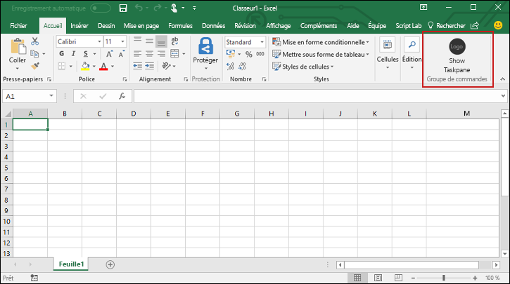
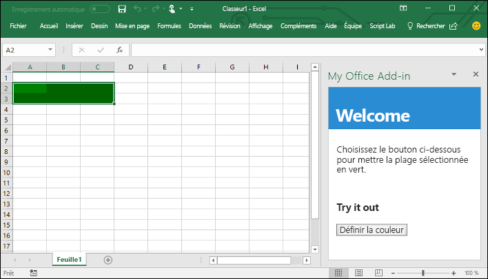

# <a name="build-an-excel-add-in-using-angular"></a>Créer un complément Excel à l’aide d’Angular

Dans cet article, vous allez découvrir le processus de création d’un complément Excel à l’aide d’Angular et de l’API JavaScript pour Excel.

## <a name="prerequisites"></a>Conditions préalables

- [Node.js](https://nodejs.org)

- Installez la dernière version de [Yeoman](https://github.com/yeoman/yo) et le [générateur Yeoman pour les compléments Office](https://github.com/OfficeDev/generator-office) globalement.

    ```bash
    npm install -g yo generator-office
    ```

## <a name="create-the-web-app"></a>Création de l’application web

1. Utilisez le générateur Yeoman afin de créer un projet de complément Excel. Exécutez la commande suivante, puis répondez aux invites comme suit :

    ```bash
    yo office
    ```

    - **Sélectionnez un type de projet :** `Office Add-in project using Angular framework`
    - **Sélectionnez un type de script :** `Typescript`
    - **Comment souhaitez-vous nommer votre complément ? :** `My Office Add-in`
    - **Quelle application client Office voulez-vous prendre en charge ? :**`Excel`

    
    
    Après avoir exécuté l’assistant, le générateur crée le projet et installe les composants de nœud de la prise en charge.

2. Accédez au dossier racine du projet.

    ```bash
    cd "My Office Add-in"
    ```

## <a name="update-the-code"></a>Mise à jour du code

1. Dans votre éditeur de code, ouvrez le fichier **app.css**, ajoutez les styles suivants à la fin du fichier et enregistrez-le.

    ```css
    #content-header {
        background: #2a8dd4;
        color: #fff;
        position: absolute;
        top: 0;
        left: 0;
        width: 100%;
        height: 80px; 
        overflow: hidden;
        font-family: Arial;
        padding-top: 25px;
    }

    #content-main {
        background: #fff;
        position: fixed;
        top: 80px;
        left: 0;
        right: 0;
        bottom: 0;
        overflow: auto; 
        font-family: Arial;
    }

    .padding {
        padding: 15px;
    }

    .padding-sm {
        padding: 4px;
    }

    .normal-button {
        width: 80px;
        padding: 2px;
    }
    ```

2. Ouvrez le fichier **src/app/app.component.html**, remplacez-en tout le contenu par le code suivant et enregistrez le fichier.

    ```html
    <div id="content-header">
        <div class="padding">
            <h1>{{welcomeMessage}}</h1>
        </div>
    </div>
    <div id="content-main">
        <div class="padding">
            <p>Choose the button below to set the color of the selected range to green.</p>
            <br />
            <h3>Try it out</h3>
            <br />
            <div role="button" class="ms-Button" (click)="setColor()">
                <span class="ms-Button-label">Set color</span>
                <span class="ms-Button-icon"><i class="ms-Icon ms-Icon--ChevronRight"></i></span>
            </div>
        </div>
    </div>
    ```

3. Ouvrez le fichier **src/app/app.component.ts**, remplacez-en tout le contenu par le code suivant et enregistrez le fichier.

    ```typescript
    import { Component } from '@angular/core';
    import * as OfficeHelpers from '@microsoft/office-js-helpers';

    const template = require('./app.component.html');

    @Component({
        selector: 'app-home',
        template
    })
    export default class AppComponent {
        welcomeMessage = 'Welcome';

        async setColor() {
            try {
                await Excel.run(async context => {
                    const range = context.workbook.getSelectedRange();
                    range.load('address');
                    range.format.fill.color = 'green';
                    await context.sync();
                    console.log(`The range address was ${range.address}.`);
                });
            } catch (error) {
                OfficeHelpers.UI.notify(error);
                OfficeHelpers.Utilities.log(error);
            }
        }

    }
    ```

## <a name="update-the-manifest"></a>Mise à jour du manifeste

1. Ouvrez le fichier nommé **manifest.xml** pour définir les paramètres et les fonctionnalités du complément. 

2. L’élément `ProviderName` possède une valeur d’espace réservé. Remplacez-le par votre nom.

3. L’attribut `DefaultValue` de l’élément `Description` possède un espace réservé. Remplacez-le par **A task pane add-in for Excel**.

4. Enregistrez le fichier.

    ```xml
    ...
    <ProviderName>John Doe</ProviderName>
    <DefaultLocale>en-US</DefaultLocale>
    <!-- The display name of your add-in. Used on the store and various places of the Office UI such as the add-ins dialog. -->
    <DisplayName DefaultValue="My Office Add-in" />
    <Description DefaultValue="A task pane add-in for Excel"/>
    ...
    ```

## <a name="start-the-dev-server"></a>Démarrage du serveur de développement

[!include[Start server section](../includes/quickstart-yo-start-server.md)] 

## <a name="try-it-out"></a>Try it out

1. Suivez les instructions pour la plateforme que vous utiliserez pour exécuter votre complément et chargez une version test du complément dans Excel.

    - Windows : [Chargement de version test des compléments Office sur Windows](../testing/create-a-network-shared-folder-catalog-for-task-pane-and-content-add-ins.md)
    - Excel Online : [Chargement de versions test des compléments Office dans Office Online](../testing/sideload-office-add-ins-for-testing.md#sideload-an-office-add-in-in-office-online)
    - iPad et Mac : [Chargement de version test des compléments Office sur iPad et Mac](../testing/sideload-an-office-add-in-on-ipad-and-mac.md)

   
2. Dans Excel, sélectionnez l’onglet **Accueil**, puis choisissez le bouton **Afficher le volet Office** du ruban pour ouvrir le volet Office du complément.

    

3. Sélectionnez une plage de cellules dans la feuille de calcul.

4. Dans le volet Office, cliquez sur le bouton **Définir couleur** pour définir la couleur de la plage sélectionnée en vert.

    

## <a name="next-steps"></a>Étapes suivantes

Félicitations, vous avez créé un complément Excel à l’aide d’Angular ! Découvrez à présent les fonctionnalités des compléments Excel et créez un complément plus complexe en continuant le didacticiel sur le complément Excel.

> [!div class="nextstepaction"]
> [Didacticiel sur les compléments Excel](../tutorials/excel-tutorial.yml)

## <a name="see-also"></a>Voir aussi

* [Didacticiel sur les compléments Excel](../tutorials/excel-tutorial-create-table.md)
* [Concepts fondamentaux de programmation avec l’API JavaScript pour Excel](../excel/excel-add-ins-core-concepts.md)
* [Exemples de code pour les compléments Excel](https://developer.microsoft.com/office/gallery/?filterBy=Samples,Excel)
* [Référence de l’API JavaScript pour Excel](https://docs.microsoft.com/office/dev/add-ins/reference/overview/excel-add-ins-reference-overview)
