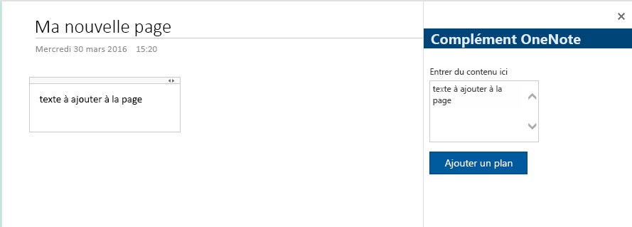

# <a name="build-your-first-onenote-add-in"></a><span data-ttu-id="5c570-101">Créer votre premier complément OneNote</span><span class="sxs-lookup"><span data-stu-id="5c570-101">Build your first OneNote add-in</span></span>

<span data-ttu-id="5c570-102">Cet article décrit le processus de création d’un complément OneNote à l’aide de jQuery et de l’API JavaScript pour Office.</span><span class="sxs-lookup"><span data-stu-id="5c570-102">In this article, you'll walk through the process of building a OneNote add-in by using jQuery and the Office JavaScript API.</span></span>

## <a name="prerequisites"></a><span data-ttu-id="5c570-103">Conditions préalables</span><span class="sxs-lookup"><span data-stu-id="5c570-103">Prerequisites</span></span>

- [<span data-ttu-id="5c570-104">Node.js</span><span class="sxs-lookup"><span data-stu-id="5c570-104">Node.js</span></span>](https://nodejs.org)

- <span data-ttu-id="5c570-105">Installez la dernière version de [Yeoman](https://github.com/yeoman/yo) et le [générateur Yeoman pour les compléments Office](https://github.com/OfficeDev/generator-office) globalement.</span><span class="sxs-lookup"><span data-stu-id="5c570-105">Install the latest version of [Yeoman](https://github.com/yeoman/yo) and the [Yeoman generator for Office Add-ins](https://github.com/OfficeDev/generator-office) globally.</span></span>

    ```bash
    npm install -g yo generator-office
    ```

## <a name="create-the-add-in-project"></a><span data-ttu-id="5c570-106">Création du projet de complément</span><span class="sxs-lookup"><span data-stu-id="5c570-106">Create the add-in project</span></span>

1. <span data-ttu-id="5c570-107">Créez un dossier sur votre lecteur local et nommez-le `my-onenote-addin`.</span><span class="sxs-lookup"><span data-stu-id="5c570-107">Create a folder on your local drive and name it `my-onenote-addin`.</span></span> <span data-ttu-id="5c570-108">Il s’agit de l’emplacement dans lequel vous allez créer les fichiers de votre complément.</span><span class="sxs-lookup"><span data-stu-id="5c570-108">This is where you'll create the files for your add-in.</span></span>

2. <span data-ttu-id="5c570-109">Accédez à votre nouveau dossier.</span><span class="sxs-lookup"><span data-stu-id="5c570-109">Navigate to your new folder.</span></span>

    ```bash
    cd my-onenote-addin
    ```

3. <span data-ttu-id="5c570-110">Utilisez le générateur Yeoman afin de créer un projet de complément OneNote.</span><span class="sxs-lookup"><span data-stu-id="5c570-110">Use the Yeoman generator to create a OneNote add-in project.</span></span> <span data-ttu-id="5c570-111">Exécutez la commande suivante, puis répondez aux invites comme suit :</span><span class="sxs-lookup"><span data-stu-id="5c570-111">Run the following command and then answer the prompts as follows:</span></span>

    ```bash
    yo office
    ```

    - <span data-ttu-id="5c570-112">**Choisissez un type de projet :** `Office Add-in project using Jquery framework`</span><span class="sxs-lookup"><span data-stu-id="5c570-112">**Choose a project type:** `Office Add-in project using Jquery framework`</span></span>
    - <span data-ttu-id="5c570-113">**Choisissez un type de script :** `Javascript`</span><span class="sxs-lookup"><span data-stu-id="5c570-113">**Choose a script type:** `Javascript`</span></span>
    - <span data-ttu-id="5c570-114">**Comment souhaitez-vous nommer votre complément ? :** `My Office Add-in`</span><span class="sxs-lookup"><span data-stu-id="5c570-114">**What do you want to name your add-in?:** `My Office Add-in`</span></span>
    - <span data-ttu-id="5c570-115">**Quelle application client Office voulez-vous prendre en charge ? :** `Onenote`</span><span class="sxs-lookup"><span data-stu-id="5c570-115">**Which Office client application would you like to support?:** `Onenote`</span></span>

    
    
    <span data-ttu-id="5c570-117">Une fois que vois avez terminé avec l'assistant, le générateur crée le projet et installe les composants Node de prise en charge.</span><span class="sxs-lookup"><span data-stu-id="5c570-117">After you complete the wizard, the generator will create the project and install supporting Node components.</span></span>


## <a name="update-the-code"></a><span data-ttu-id="5c570-118">Mise à jour du code</span><span class="sxs-lookup"><span data-stu-id="5c570-118">Update the code</span></span>

1. <span data-ttu-id="5c570-119">Dans votre éditeur de code, ouvrez **index.html** à la racine du projet.</span><span class="sxs-lookup"><span data-stu-id="5c570-119">In your code editor, open **index.html** in the root of the project.</span></span> <span data-ttu-id="5c570-120">Ce fichier contient le code HTML qui s’affichera dans le volet Office du complément.</span><span class="sxs-lookup"><span data-stu-id="5c570-120">This file contains the HTML that will be rendered in the add-in's task pane.</span></span>

2. <span data-ttu-id="5c570-121">Remplacez l’élément `<main>` dans l’élément `<body>` par le balisage suivant et enregistrez le fichier.</span><span class="sxs-lookup"><span data-stu-id="5c570-121">Replace the `<main>` element inside the `<body>` element with the following markup and save the file.</span></span> <span data-ttu-id="5c570-122">Cette option ajoute une zone de texte et un bouton à l’aide des [composants de la structure de l’interface utilisateur d’Office](http://dev.office.com/fabric/components).</span><span class="sxs-lookup"><span data-stu-id="5c570-122">This adds a text area and a button using [Office UI Fabric components](http://dev.office.com/fabric/components).</span></span>

    ```html
    <main class="ms-welcome__main">
        <br />
        <p class="ms-font-l">Enter content below</p>
        <div class="ms-TextField ms-TextField--placeholder">
            <textarea id="textBox" rows="5"></textarea>
        </div>
        <button id="addOutline" class="ms-welcome__action ms-Button ms-Button--hero ms-u-slideUpIn20">
            <span class="ms-Button-label">Add Outline</span>
            <span class="ms-Button-icon"><i class="ms-Icon"></i></span>
            <span class="ms-Button-description">Adds the content above to the current page.</span>
        </button>
    </main>
    ```

3. <span data-ttu-id="5c570-123">Ouvrez le fichier **src\index.js** pour spécifier le script du complément.</span><span class="sxs-lookup"><span data-stu-id="5c570-123">Open the file **app.js** to specify the script for the add-in.</span></span> <span data-ttu-id="5c570-124">Remplacez tout le contenu par le code suivant, puis enregistrez le fichier.</span><span class="sxs-lookup"><span data-stu-id="5c570-124">Replace the entire contents with the following code and save the file.</span></span>

    ```js
    'use strict';

    (function () {

        Office.initialize = function (reason) {
            $(document).ready(function () {
                // Set up event handler for the UI.
                $('#addOutline').click(addOutlineToPage);
            });
        };

        // Add the contents of the text area to the page.
        function addOutlineToPage() {        
            OneNote.run(function (context) {
                var html = '<p>' + $('#textBox').val() + '</p>';

                // Get the current page.
                var page = context.application.getActivePage();

                // Queue a command to load the page with the title property.             
                page.load('title'); 

                // Add an outline with the specified HTML to the page.
                var outline = page.addOutline(40, 90, html);

                // Run the queued commands, and return a promise to indicate task completion.
                return context.sync()
                    .then(function() {
                        console.log('Added outline to page ' + page.title);
                    })
                    .catch(function(error) {
                        app.showNotification("Error: " + error); 
                        console.log("Error: " + error); 
                        if (error instanceof OfficeExtension.Error) { 
                            console.log("Debug info: " + JSON.stringify(error.debugInfo)); 
                        } 
                    }); 
            });
        }
    })();
    ```

## <a name="update-the-manifest"></a><span data-ttu-id="5c570-125">Mise à jour du manifeste</span><span class="sxs-lookup"><span data-stu-id="5c570-125">Update the manifest</span></span>

1. <span data-ttu-id="5c570-126">Ouvrez le fichier nommé **one-note-add-in-manifest.xml** pour définir les paramètres et les fonctionnalités du complément.</span><span class="sxs-lookup"><span data-stu-id="5c570-126">Open the file **one-note-add-in-manifest.xml** to define the add-in's settings and capabilities.</span></span>

2. <span data-ttu-id="5c570-127">L’élément `ProviderName` possède une valeur d’espace réservé.</span><span class="sxs-lookup"><span data-stu-id="5c570-127">The `ProviderName` element has a placeholder value.</span></span> <span data-ttu-id="5c570-128">Remplacez-le par votre nom.</span><span class="sxs-lookup"><span data-stu-id="5c570-128">Replace it with your name.</span></span>

3. <span data-ttu-id="5c570-129">L’attribut `DefaultValue` de l’élément `Description` possède un espace réservé.</span><span class="sxs-lookup"><span data-stu-id="5c570-129">The `DefaultValue` attribute of the `Description` element has a placeholder.</span></span> <span data-ttu-id="5c570-130">Remplacez-le par **A task pane add-in for OneNote**.</span><span class="sxs-lookup"><span data-stu-id="5c570-130">Replace it with **A task pane add-in for OneNote**.</span></span>

4. <span data-ttu-id="5c570-131">Enregistrez le fichier.</span><span class="sxs-lookup"><span data-stu-id="5c570-131">Save the file.</span></span>

    ```xml
    ...
    <ProviderName>John Doe</ProviderName>
    <DefaultLocale>en-US</DefaultLocale>
    <!-- The display name of your add-in. Used on the store and various places of the Office UI such as the add-ins dialog. -->
    <DisplayName DefaultValue="OneNote Add-in" />
    <Description DefaultValue="A task pane add-in for OneNote"/>
    ...
    ```

## <a name="start-the-dev-server"></a><span data-ttu-id="5c570-132">Démarrage du serveur de développement</span><span class="sxs-lookup"><span data-stu-id="5c570-132">Start the dev server</span></span>

[!include[Start server section](../includes/quickstart-yo-start-server.md)]

## <a name="try-it-out"></a><span data-ttu-id="5c570-133">Essayez !</span><span class="sxs-lookup"><span data-stu-id="5c570-133">Try it out</span></span>

1. <span data-ttu-id="5c570-134">Dans [OneNote Online](https://www.onenote.com/notebooks), ouvrez un bloc-notes.</span><span class="sxs-lookup"><span data-stu-id="5c570-134">In [OneNote Online](https://www.onenote.com/notebooks), open a notebook.</span></span>

2. <span data-ttu-id="5c570-135">Choisissez **Insertion > Compléments Office** pour ouvrir la boîte de dialogue Compléments Office.</span><span class="sxs-lookup"><span data-stu-id="5c570-135">Choose **Insert > Office Add-ins** to open the Office Add-ins dialog.</span></span>

    - <span data-ttu-id="5c570-136">Si vous êtes connecté avec votre compte de consommateur, sélectionnez l’onglet **MES COMPLÉMENTS**, puis choisissez **Télécharger mon complément**.</span><span class="sxs-lookup"><span data-stu-id="5c570-136">If you're signed in with your consumer account, select the **MY ADD-INS** tab, and then choose **Upload My Add-in**.</span></span>

    - <span data-ttu-id="5c570-137">Si vous êtes connecté avec votre compte professionnel ou scolaire, sélectionnez l’onglet **MON ORGANISATION**, puis choisissez **Télécharger mon complément**.</span><span class="sxs-lookup"><span data-stu-id="5c570-137">If you're signed in with your work or school account, select the **MY ORGANIZATION** tab, and then select **Upload My Add-in**.</span></span> 

    <span data-ttu-id="5c570-138">L’image suivante montre l’onglet **MES COMPLÉMENTS** pour les blocs-notes de consommateurs.</span><span class="sxs-lookup"><span data-stu-id="5c570-138">The following image shows the **MY ADD-INS** tab for consumer notebooks.</span></span>

    

3. <span data-ttu-id="5c570-139">Dans la boîte de dialogue Télécharger le complément, accédez à **one-note-add-in-manifest.xml** dans le dossier de projet, puis choisissez **Télécharger**.</span><span class="sxs-lookup"><span data-stu-id="5c570-139">In the Upload Add-in dialog, browse to **one-note-add-in-manifest.xml** in your project folder, and then choose **Upload**.</span></span> 

4. <span data-ttu-id="5c570-140">Dans l’onglet **Accueil,** cliquez sur le bouton **Afficher le volet des tâches** du ruban.</span><span class="sxs-lookup"><span data-stu-id="5c570-140">In Excel, choose the **Home** tab, and then choose the **Show Taskpane** button in the ribbon to open the add-in task pane.</span></span> <span data-ttu-id="5c570-141">Le complément volet Office s’ouvre dans un iFrame à côté de la page OneNote.</span><span class="sxs-lookup"><span data-stu-id="5c570-141">6- The add-in opens in an iFrame next to the OneNote page.</span></span>

5. <span data-ttu-id="5c570-142">Entrez du texte dans la zone de texte, puis choisissez **Ajouter un contour**.</span><span class="sxs-lookup"><span data-stu-id="5c570-142">Enter some text in the text area and then choose **Add outline**.</span></span> <span data-ttu-id="5c570-143">Le texte que vous avez entré est ajouté à la page.</span><span class="sxs-lookup"><span data-stu-id="5c570-143">The text you entered is added to the page.</span></span> 

    

## <a name="troubleshooting-and-tips"></a><span data-ttu-id="5c570-145">Conseils et résolution des problèmes</span><span class="sxs-lookup"><span data-stu-id="5c570-145">Troubleshooting and tips</span></span>

- <span data-ttu-id="5c570-p110">Vous pouvez déboguer le complément à l’aide des outils de développement de votre navigateur. Lorsque vous utilisez le serveur web Gulp et le débogage dans Internet Explorer ou Chrome, vous pouvez enregistrer les modifications localement et simplement actualiser l’iFrame du complément.</span><span class="sxs-lookup"><span data-stu-id="5c570-p110">You can debug the add-in using your browser's developer tools. When you're using the Gulp web server and debugging in Internet Explorer or Chrome, you can save your changes locally and then just refresh the add-in's iFrame.</span></span>

- <span data-ttu-id="5c570-p111">Lorsque vous examinez un objet OneNote, les propriétés qui sont actuellement disponibles affichent les valeurs réelles. Les propriétés qui doivent être chargées sont affichées comme *non définies*. Développez le nœud `_proto_` pour visualiser les propriétés qui sont définies sur l’objet, mais qui ne sont pas encore chargées.</span><span class="sxs-lookup"><span data-stu-id="5c570-p111">When you inspect a OneNote object, the properties that are currently available for use display actual values. Properties that need to be loaded display *undefined*. Expand the `_proto_` node to see properties that are defined on the object but are not yet loaded.</span></span>

   

- <span data-ttu-id="5c570-p112">Vous devez activer le contenu mixte dans le navigateur si votre complément utilise des ressources HTTP. Les compléments de production doivent uniquement utiliser des ressources HTTPS sécurisées.</span><span class="sxs-lookup"><span data-stu-id="5c570-p112">You need to enable mixed content in the browser if your add-in uses any HTTP resources. Production add-ins should use only secure HTTPS resources.</span></span>

- <span data-ttu-id="5c570-154">Les compléments de volet Office peuvent être ouverts à partir de n’importe où, mais les compléments de contenu peuvent uniquement être insérés à l’intérieur de contenu de page normal (et non dans des titres, des images, des iFrames, etc.).</span><span class="sxs-lookup"><span data-stu-id="5c570-154">Task pane add-ins can be opened from anywhere, but content add-ins can only be inserted inside regular page content (i.e. not in titles, images, iFrames, etc.).</span></span> 

## <a name="next-steps"></a><span data-ttu-id="5c570-155">Étapes suivantes</span><span class="sxs-lookup"><span data-stu-id="5c570-155">Next steps</span></span>

<span data-ttu-id="5c570-156">Félicitations, vous avez créé un complément OneNote !</span><span class="sxs-lookup"><span data-stu-id="5c570-156">Congratulations, you've successfully created a OneNote add-in!</span></span> <span data-ttu-id="5c570-157">Ensuite, vous allez étudier en détail les concepts fondamentaux de la création de compléments Excel.</span><span class="sxs-lookup"><span data-stu-id="5c570-157">Next, learn more about the core concepts of building OneNote add-ins.</span></span>

> [!div class="nextstepaction"]
> [<span data-ttu-id="5c570-158">Vue d’ensemble de la programmation de l’API JavaScript de OneNote</span><span class="sxs-lookup"><span data-stu-id="5c570-158">OneNote JavaScript API programming overview</span></span>](../onenote/onenote-add-ins-programming-overview.md)

## <a name="see-also"></a><span data-ttu-id="5c570-159">Voir aussi</span><span class="sxs-lookup"><span data-stu-id="5c570-159">See also</span></span>

- [<span data-ttu-id="5c570-160">Vue d’ensemble de la programmation de l’API JavaScript de OneNote</span><span class="sxs-lookup"><span data-stu-id="5c570-160">OneNote JavaScript API programming overview</span></span>](../onenote/onenote-add-ins-programming-overview.md)
- [<span data-ttu-id="5c570-161">Référence de l’API JavaScript de OneNote</span><span class="sxs-lookup"><span data-stu-id="5c570-161">OneNote JavaScript API reference</span></span>](https://dev.office.com/reference/add-ins/onenote/onenote-add-ins-javascript-reference)
- [<span data-ttu-id="5c570-162">Exemple de grille d’évaluation</span><span class="sxs-lookup"><span data-stu-id="5c570-162">Rubric Grader sample</span></span>](https://github.com/OfficeDev/OneNote-Add-in-Rubric-Grader)
- [<span data-ttu-id="5c570-163">Vue d’ensemble de la plateforme des compléments Office</span><span class="sxs-lookup"><span data-stu-id="5c570-163">Office Add-ins platform overview</span></span>](../overview/office-add-ins.md)
