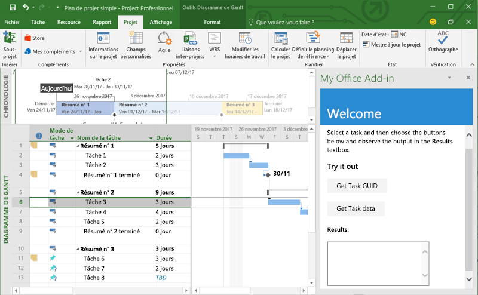
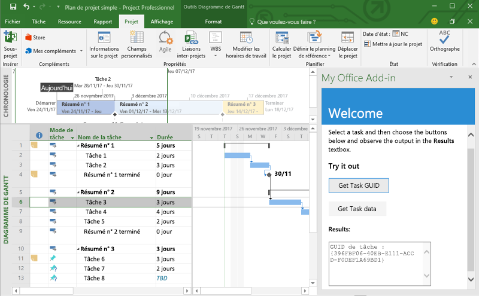
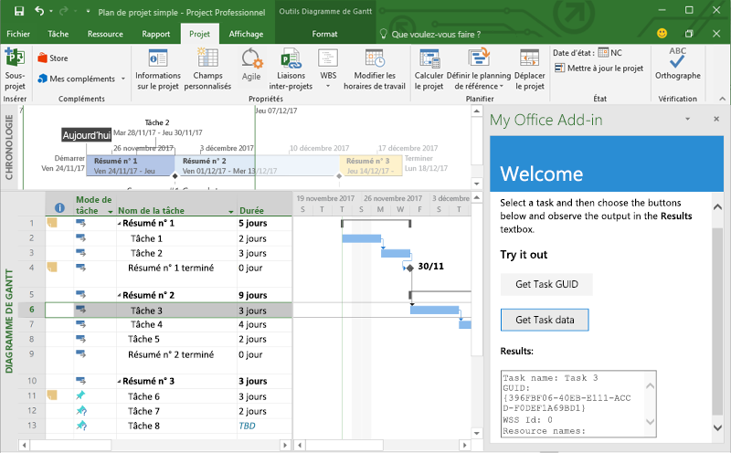

# <a name="build-your-first-project-add-in"></a>Création de votre premier complément Project

Cet article décrit le processus de création d’un complément Project à l’aide de jQuery et de l’API JavaScript pour Office.

## <a name="prerequisites"></a>Conditions préalables

- [Node.js](https://nodejs.org)

- Installez la dernière version de [Yeoman](https://github.com/yeoman/yo) et le [générateur Yeoman pour les compléments Office](https://github.com/OfficeDev/generator-office) globalement.

    ```bash
    npm install -g yo generator-office
    ```

## <a name="create-the-add-in"></a>Créer le complément

1. Utilisez le générateur Yeoman afin de créer un projet de complément Project. Exécutez la commande suivante, puis répondez aux invites comme suit :

    ```bash
    yo office
    ```

    - **Sélectionnez un type de projet :** `Office Add-in project using Jquery framework`
    - **Sélectionnez un type de script :** `Javascript`
    - **Comment souhaitez-vous nommer votre complément ? :** `My Office Add-in`
    - **Quelle application client Office voulez-vous prendre en charge ? :** `Project`

    
    
    Après avoir exécuté l’assistant, le générateur crée le projet et installe les composants de nœud de la prise en charge.
    
2. Accédez au dossier racine du projet.

    ```bash
    cd "My Office Add-in"
    ```

## <a name="update-the-code"></a>Mise à jour du code

1. Dans votre éditeur de code, ouvrez **index.html** à la racine du projet. Ce fichier contient le code HTML qui s’affichera dans le volet Office du complément.

2. Remplacez l’élément `<body>` par le balisage suivant.

    ```html
    <body class="ms-font-m ms-welcome">
        <div id="content-header">
            <div class="padding">
                <h1>Welcome</h1>
            </div>
        </div>
        <div id="content-main">
            <div class="padding">
                <p>Select a task and then choose the buttons below and observe the output in the <b>Results</b> textbox.</p>
                <h3>Try it out</h3>
                <button class="ms-Button" id="get-task-guid">Get Task GUID</button>
                <br/><br/>
                <button class="ms-Button" id="get-task">Get Task data</button>
                <br/>
                <h4>Results:</h4>
                <textarea id="result" rows="6" cols="25"></textarea>
            </div>
        </div>
        <script type="text/javascript" src="node_modules/jquery/dist/jquery.js"></script>
        <script type="text/javascript" src="node_modules/office-ui-fabric-js/dist/js/fabric.js"></script>
    </body>
    ```

3. Ouvrez le fichier **src/index.js** afin de spécifier le script pour le complément. Remplacez tout le contenu par le code suivant, puis enregistrez le fichier.

    ```js
    'use strict';

    (function () {

        var taskGuid;

        Office.onReady(function() {
            // Office is ready
            $(document).ready(function () {
                // The document is ready
                $('#get-task-guid').click(getTaskGUID);
                $('#get-task').click(getTask);
            });
        });

        function getTaskGUID() {
            Office.context.document.getSelectedTaskAsync(function (asyncResult) {
                if (asyncResult.status == Office.AsyncResultStatus.Succeeded) {
                    result.value = "Task GUID: " + asyncResult.value;
                    taskGuid = asyncResult.value;
                }
                else {
                    console.log(asyncResult.error.message);
                }
            });
        }

        function getTask() {
            if (taskGuid != undefined) {
                Office.context.document.getTaskAsync(
                    taskGuid,
                    function (asyncResult) {
                        if (asyncResult.status === Office.AsyncResultStatus.Succeeded) {
                            var taskInfo = asyncResult.value;
                            var taskOutput = "Task name: " + taskInfo.taskName +
                                            "\nGUID: " + taskGuid +
                                            "\nWSS Id: " + taskInfo.wssTaskId +
                                            "\nResource names: " + taskInfo.resourceNames;
                            result.value = taskOutput;
                        } else {
                            console.log(asyncResult.error.message);
                        }
                    }
                );
            } else {
                result.value = 'Task GUID not valid:\n' + taskGuid;
            } 
        }
    })();
    ```

4. Ouvrez le fichier **app.css** à la racine du projet pour spécifier les styles personnalisés du complément. Remplacez tout le contenu par le code suivant, puis enregistrez le fichier.

    ```css
    #content-header {
        background: #2a8dd4;
        color: #fff;
        position: absolute;
        top: 0;
        left: 0;
        width: 100%;
        height: 80px; 
        overflow: hidden;
    }

    #content-main {
        background: #fff;
        position: fixed;
        top: 80px;
        left: 0;
        right: 0;
        bottom: 0;
        overflow: auto; 
    }

    .padding {
        padding: 15px;
    }
    ```

## <a name="update-the-manifest"></a>Mise à jour du manifeste

1. Ouvrez le fichier nommé **manifest.xml** pour définir les paramètres et les fonctionnalités du complément.

2. L’élément `ProviderName` possède une valeur d’espace réservé. Remplacez-le par votre nom.

3. L’attribut `DefaultValue` de l’élément `Description` possède un espace réservé. Remplacez-le par **A task pane add-in for Project**.

4. Enregistrez le fichier.

    ```xml
    ...
    <ProviderName>John Doe</ProviderName>
    <DefaultLocale>en-US</DefaultLocale>
    <!-- The display name of your add-in. Used on the store and various places of the Office UI such as the add-ins dialog. -->
    <DisplayName DefaultValue="My Office Add-in" />
    <Description DefaultValue="A task pane add-in for Project"/>
    ...
    ```

## <a name="start-the-dev-server"></a>Démarrage du serveur de développement

[!include[Start server section](../includes/quickstart-yo-start-server.md)] 

## <a name="try-it-out"></a>Essayez !

1. Dans Project, créez un projet simple comportant au moins une tâche.

2. Suivez les instructions pour la plateforme que vous utiliserez afin d’exécuter votre complément en vue d’en charger une version test dans Project.

    - Windows : [Chargement de version test des compléments Office sur Windows](../testing/create-a-network-shared-folder-catalog-for-task-pane-and-content-add-ins.md)
    - Project Online : [Chargement de version test des compléments Office dans Office Online](../testing/sideload-office-add-ins-for-testing.md#sideload-an-office-add-in-in-office-online)
    - iPad et Mac : [Chargement de version test des compléments Office sur iPad et Mac](../testing/sideload-an-office-add-in-on-ipad-and-mac.md)

3. Dans Project, sélectionnez une tâche.

    

4. Dans le volet Office, sélectionnez le bouton **Get Task GUID** pour écrire le GUID de la tâche dans la zone de texte **Results**.

    

5. Dans le volet Office, sélectionnez le bouton **Get Task data** pour écrire plusieurs propriétés de la tâche sélectionnée dans la zone de texte **Results**.

    

## <a name="next-steps"></a>Étapes suivantes

Félicitations, vous avez créé un complément Project ! Ensuite, découvrez les fonctionnalités d’un complément Project et explorez des scénarios plus courants.

> [!div class="nextstepaction"]
> [Compléments Project](../project/project-add-ins.md)
