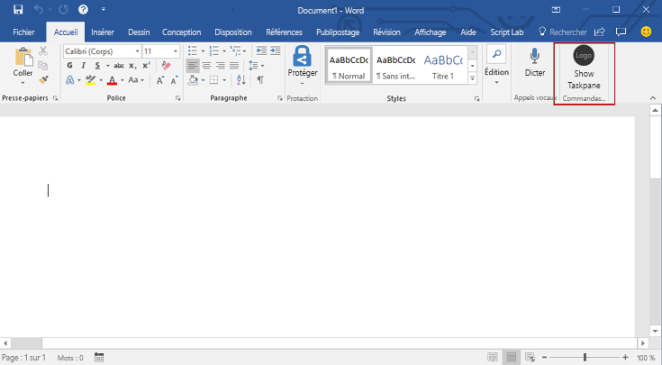
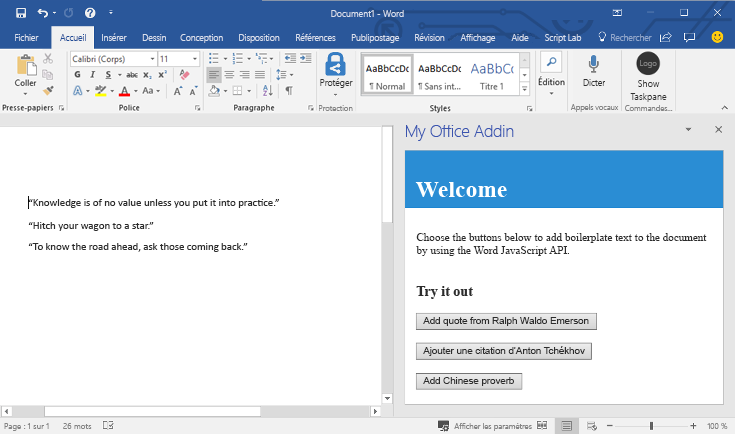

# <a name="build-your-first-word-add-in"></a><span data-ttu-id="b20d3-101">Cr?er votre premier compl?ment Word</span><span class="sxs-lookup"><span data-stu-id="b20d3-101">Build your first Word add-in</span></span>

<span data-ttu-id="b20d3-102">_S?applique ? : Word 2016, Word pour iPad, Word pour Mac_</span><span class="sxs-lookup"><span data-stu-id="b20d3-102">_Applies to: Word 2016, Word for iPad, Word for Mac_</span></span>

<span data-ttu-id="b20d3-103">Cet article d?crit le processus de cr?ation d?un compl?ment Word ? l?aide de jQuery et de l?API JavaScript pour Word.</span><span class="sxs-lookup"><span data-stu-id="b20d3-103">In this article, you'll walk through the process of building a Word add-in by using jQuery and the Word JavaScript API.</span></span> 

## <a name="create-the-add-in"></a><span data-ttu-id="b20d3-104">Cr?er le compl?ment</span><span class="sxs-lookup"><span data-stu-id="b20d3-104">Create the add-in</span></span> 

[!include[Choose your editor](../includes/quickstart-choose-editor.md)]

# <a name="visual-studiotabvisual-studio"></a>[<span data-ttu-id="b20d3-105">Visual Studio</span><span class="sxs-lookup"><span data-stu-id="b20d3-105">Visual Studio</span></span>](#tab/visual-studio)

### <a name="prerequisites"></a><span data-ttu-id="b20d3-106">Conditions pr?alables</span><span class="sxs-lookup"><span data-stu-id="b20d3-106">Prerequisites</span></span>

[!include[Quickstart prerequisites](../includes/quickstart-vs-prerequisites.md)]

### <a name="create-the-add-in-project"></a><span data-ttu-id="b20d3-107">Cr?ation du projet de compl?ment</span><span class="sxs-lookup"><span data-stu-id="b20d3-107">Create the add-in project</span></span>

1. <span data-ttu-id="b20d3-108">Dans la barre de menu de Visual Studio, choisissez successivement **Fichier** > **Nouveau** > **Projet**.</span><span class="sxs-lookup"><span data-stu-id="b20d3-108">On the Visual Studio menu bar, choose  **File** > **New** > **Project**.</span></span>
    
2. <span data-ttu-id="b20d3-109">Dans la liste des types de projets, sous **Visual C#** ou **Visual Basic**, d?veloppez **Office/SharePoint**, choisissez **Compl?ments**, puis **Compl?ment Word Web** pour le type de projet.</span><span class="sxs-lookup"><span data-stu-id="b20d3-109">In the list of project types under **Visual C#** or **Visual Basic**, expand  **Office/SharePoint**, choose **Add-ins**, and then choose **Word Web Add-in** as the project type.</span></span> 

3. <span data-ttu-id="b20d3-110">Nommez le projet, puis cliquez sur **OK**.</span><span class="sxs-lookup"><span data-stu-id="b20d3-110">Name the project, and then choose **OK**.</span></span>

4. <span data-ttu-id="b20d3-p101">Visual Studio cr?e une solution et ses deux projets apparaissent dans l?**explorateur de solutions**. Le fichier **Home.html** s?ouvre dans Visual Studio.</span><span class="sxs-lookup"><span data-stu-id="b20d3-p101">Visual Studio creates a solution and its two projects appear in **Solution Explorer**. The **Home.html** file opens in Visual Studio.</span></span>
    
### <a name="explore-the-visual-studio-solution"></a><span data-ttu-id="b20d3-113">Explorer la solution Visual Studio</span><span class="sxs-lookup"><span data-stu-id="b20d3-113">Explore the Visual Studio solution</span></span>

[!include[Description of Visual Studio projects](../includes/quickstart-vs-solution.md)]

### <a name="update-the-code"></a><span data-ttu-id="b20d3-114">Mise ? jour du code</span><span class="sxs-lookup"><span data-stu-id="b20d3-114">Update the code</span></span>

1. <span data-ttu-id="b20d3-115">**Home.html** sp?cifie le code HTML qui s?affichera dans le volet Office du compl?ment.</span><span class="sxs-lookup"><span data-stu-id="b20d3-115">**Home.html** specifies the HTML that will be rendered in the add-in's task pane.</span></span> <span data-ttu-id="b20d3-116">Dans **Home.html**, remplacez l??l?ment `<body>` par le balisage suivant et enregistrez le fichier.</span><span class="sxs-lookup"><span data-stu-id="b20d3-116">In **Home.html**, replace the `<body>` element with the following markup and save the file.</span></span>
 
    ```html
    <body>
        <div id="content-header">
            <div class="padding">
                <h1>Welcome</h1>
            </div>
        </div>    
        <div id="content-main">
            <div class="padding">
                <p>Choose the buttons below to add boilerplate text to the document by using the Word JavaScript API.</p>
                <br />
                <h3>Try it out</h3>
                <button id="emerson">Add quote from Ralph Waldo Emerson</button>
                <br /><br />
                <button id="checkhov">Add quote from Anton Chekhov</button>
                <br /><br />
                <button id="proverb">Add Chinese proverb</button>
            </div>
        </div>
        <br />
        <div id="supportedVersion"/>
    </body>
    ```

2. <span data-ttu-id="b20d3-117">Ouvrez le fichier **Home.js** ? la racine du projet d?application web.</span><span class="sxs-lookup"><span data-stu-id="b20d3-117">Open the file **Home.js** in the root of the web application project.</span></span> <span data-ttu-id="b20d3-118">Ce fichier sp?cifie le script pour le compl?ment.</span><span class="sxs-lookup"><span data-stu-id="b20d3-118">This file specifies the script for the add-in.</span></span> <span data-ttu-id="b20d3-119">Remplacez tout le contenu par le code suivant, puis enregistrez le fichier.</span><span class="sxs-lookup"><span data-stu-id="b20d3-119">Replace the entire contents with the following code and save the file.</span></span>

    ```js
    'use strict';
    
    (function () {

        // The initialize function is run each time the page is loaded.
        Office.initialize = function (reason) {
            $(document).ready(function () {

                // Use this to check whether the API is supported in the Word client.
                if (Office.context.requirements.isSetSupported('WordApi', 1.1)) {
                    // Do something that is only available via the new APIs
                    $('#emerson').click(insertEmersonQuoteAtSelection);
                    $('#checkhov').click(insertChekhovQuoteAtTheBeginning);
                    $('#proverb').click(insertChineseProverbAtTheEnd);
                    $('#supportedVersion').html('This code is using Word 2016 or greater.');
                }
                else {
                    // Just letting you know that this code will not work with your version of Word.
                    $('#supportedVersion').html('This code requires Word 2016 or greater.');
                }
            });
        };

        function insertEmersonQuoteAtSelection() {
            Word.run(function (context) {

                // Create a proxy object for the document.
                var thisDocument = context.document;

                // Queue a command to get the current selection.
                // Create a proxy range object for the selection.
                var range = thisDocument.getSelection();

                // Queue a command to replace the selected text.
                range.insertText('"Hitch your wagon to a star."\n', Word.InsertLocation.replace);

                // Synchronize the document state by executing the queued commands,
                // and return a promise to indicate task completion.
                return context.sync().then(function () {
                    console.log('Added a quote from Ralph Waldo Emerson.');
                });
            })
            .catch(function (error) {
                console.log('Error: ' + JSON.stringify(error));
                if (error instanceof OfficeExtension.Error) {
                    console.log('Debug info: ' + JSON.stringify(error.debugInfo));
                }
            });
        }

        function insertChekhovQuoteAtTheBeginning() {
            Word.run(function (context) {

                // Create a proxy object for the document body.
                var body = context.document.body;

                // Queue a command to insert text at the start of the document body.
                body.insertText('"Knowledge is of no value unless you put it into practice."\n', Word.InsertLocation.start);

                // Synchronize the document state by executing the queued commands,
                // and return a promise to indicate task completion.
                return context.sync().then(function () {
                    console.log('Added a quote from Anton Chekhov.');
                });
            })
            .catch(function (error) {
                console.log('Error: ' + JSON.stringify(error));
                if (error instanceof OfficeExtension.Error) {
                    console.log('Debug info: ' + JSON.stringify(error.debugInfo));
                }
            });
        }

        function insertChineseProverbAtTheEnd() {
            Word.run(function (context) {

                // Create a proxy object for the document body.
                var body = context.document.body;

                // Queue a command to insert text at the end of the document body.
                body.insertText('"To know the road ahead, ask those coming back."\n', Word.InsertLocation.end);

                // Synchronize the document state by executing the queued commands,
                // and return a promise to indicate task completion.
                return context.sync().then(function () {
                    console.log('Added a quote from a Chinese proverb.');
                });
            })
            .catch(function (error) {
                console.log('Error: ' + JSON.stringify(error));
                if (error instanceof OfficeExtension.Error) {
                    console.log('Debug info: ' + JSON.stringify(error.debugInfo));
                }
            });
        }
    })();
    ```

3. <span data-ttu-id="b20d3-120">Ouvrez le fichier **Home.css** ? la racine du projet d?application web.</span><span class="sxs-lookup"><span data-stu-id="b20d3-120">Open the file **Home.css** in the root of the web application project.</span></span> <span data-ttu-id="b20d3-121">Ce fichier sp?cifie les styles personnalis?s pour le compl?ment.</span><span class="sxs-lookup"><span data-stu-id="b20d3-121">This file specifies the custom styles for the add-in.</span></span> <span data-ttu-id="b20d3-122">Remplacez tout le contenu par le code suivant, puis enregistrez le fichier.</span><span class="sxs-lookup"><span data-stu-id="b20d3-122">Replace the entire contents with the following code and save the file.</span></span>

    ```css
    #content-header {
        background: #2a8dd4;
        color: #fff;
        position: absolute;
        top: 0;
        left: 0;
        width: 100%;
        height: 80px; 
        overflow: hidden;
    }

    #content-main {
        background: #fff;
        position: fixed;
        top: 80px;
        left: 0;
        right: 0;
        bottom: 0;
        overflow: auto; 
    }

    .padding {
        padding: 15px;
    }
    ```

### <a name="update-the-manifest"></a><span data-ttu-id="b20d3-123">Mise ? jour du manifeste</span><span class="sxs-lookup"><span data-stu-id="b20d3-123">Update the manifest</span></span>

1. <span data-ttu-id="b20d3-124">Ouvrez le fichier manifeste XML dans le projet de compl?ment.</span><span class="sxs-lookup"><span data-stu-id="b20d3-124">Open the XML manifest file in the Add-in project.</span></span> <span data-ttu-id="b20d3-125">Ce fichier d?finit les param?tres et les fonctionnalit?s du compl?ment.</span><span class="sxs-lookup"><span data-stu-id="b20d3-125">This file defines the add-in's settings and capabilities.</span></span>

2. <span data-ttu-id="b20d3-126">L??l?ment `ProviderName` poss?de une valeur d?espace r?serv?.</span><span class="sxs-lookup"><span data-stu-id="b20d3-126">The `ProviderName` element has a placeholder value.</span></span> <span data-ttu-id="b20d3-127">Remplacez-le par votre nom.</span><span class="sxs-lookup"><span data-stu-id="b20d3-127">Replace it with your name.</span></span>

3. <span data-ttu-id="b20d3-128">L?attribut `DefaultValue` de l??l?ment `DisplayName` poss?de un espace r?serv?.</span><span class="sxs-lookup"><span data-stu-id="b20d3-128">The `DefaultValue` attribute of the `DisplayName` element has a placeholder.</span></span> <span data-ttu-id="b20d3-129">Remplacez-le par **My Office Add-in**.</span><span class="sxs-lookup"><span data-stu-id="b20d3-129">Replace it with **My Office Add-in**.</span></span>

4. <span data-ttu-id="b20d3-130">L?attribut `DefaultValue` de l??l?ment `Description` poss?de un espace r?serv?.</span><span class="sxs-lookup"><span data-stu-id="b20d3-130">The `DefaultValue` attribute of the `Description` element has a placeholder.</span></span> <span data-ttu-id="b20d3-131">Remplacez-le par **A task pane add-in for Word**.</span><span class="sxs-lookup"><span data-stu-id="b20d3-131">Replace it with **A task pane add-in for Word**.</span></span>

5. <span data-ttu-id="b20d3-132">Enregistrez le fichier.</span><span class="sxs-lookup"><span data-stu-id="b20d3-132">Save the file.</span></span>

    ```xml
    ...
    <ProviderName>John Doe</ProviderName>
    <DefaultLocale>en-US</DefaultLocale>
    <!-- The display name of your add-in. Used on the store and various places of the Office UI such as the add-ins dialog. -->
    <DisplayName DefaultValue="My Office Add-in" />
    <Description DefaultValue="A task pane add-in for Word"/>
    ...
    ```

### <a name="try-it-out"></a><span data-ttu-id="b20d3-133">Essayez !</span><span class="sxs-lookup"><span data-stu-id="b20d3-133">Try it out</span></span>

1. <span data-ttu-id="b20d3-p109">? l?aide de Visual Studio, testez le nouveau compl?ment en appuyant sur F5 ou en choisissant le bouton **D?marrer** pour lancer Word avec le bouton du compl?ment **Show Taskpane** (Afficher le volet Office) qui appara?t dans le ruban. Le compl?ment sera h?berg? localement sur IIS.</span><span class="sxs-lookup"><span data-stu-id="b20d3-p109">Using Visual Studio, test the newly created Word add-in by pressing F5 or choosing the **Start** button to launch Word with the **Show Taskpane** add-in button displayed in the ribbon. The add-in will be hosted locally on IIS.</span></span>

2. <span data-ttu-id="b20d3-136">Dans Word, s?lectionnez l?onglet **Accueil**, puis choisissez le bouton **Afficher le volet Office** du ruban pour ouvrir le volet Office du compl?ment.</span><span class="sxs-lookup"><span data-stu-id="b20d3-136">In Word, choose the **Home** tab, and then choose the **Show Taskpane** button in the ribbon to open the add-in task pane.</span></span>

    

3. <span data-ttu-id="b20d3-138">Dans le volet Office, choisissez l?un des boutons pour ajouter du texte r?utilisable dans le document.</span><span class="sxs-lookup"><span data-stu-id="b20d3-138">In the task pane, choose any of the buttons to add boilerplate text to the document.</span></span>

    

# <a name="any-editortabvisual-studio-code"></a>[<span data-ttu-id="b20d3-140">Tous les ?diteurs</span><span class="sxs-lookup"><span data-stu-id="b20d3-140">Any editor</span></span>](#tab/visual-studio-code)

### <a name="prerequisites"></a><span data-ttu-id="b20d3-141">Conditions pr?alables</span><span class="sxs-lookup"><span data-stu-id="b20d3-141">Prerequisites</span></span>

- [<span data-ttu-id="b20d3-142">Node.js</span><span class="sxs-lookup"><span data-stu-id="b20d3-142">Node.js</span></span>](https://nodejs.org)

- <span data-ttu-id="b20d3-143">Installez la derni?re version de [Yeoman](https://github.com/yeoman/yo) et le [g?n?rateur Yeoman pour les compl?ments Office](https://github.com/OfficeDev/generator-office) globalement.</span><span class="sxs-lookup"><span data-stu-id="b20d3-143">Install the latest version of [Yeoman](https://github.com/yeoman/yo) and the [Yeoman generator for Office Add-ins](https://github.com/OfficeDev/generator-office) globally.</span></span>

    ```bash
    npm install -g yo generator-office
    ```

### <a name="create-the-add-in-project"></a><span data-ttu-id="b20d3-144">Cr?ation du projet de compl?ment</span><span class="sxs-lookup"><span data-stu-id="b20d3-144">Create the add-in project</span></span>

1. <span data-ttu-id="b20d3-145">Cr?ez un dossier sur votre lecteur local et nommez-le `my-word-addin`.</span><span class="sxs-lookup"><span data-stu-id="b20d3-145">Create a folder on your local drive and name it `my-word-addin`.</span></span> <span data-ttu-id="b20d3-146">Il s?agit de l?emplacement dans lequel vous allez cr?er les fichiers de votre compl?ment.</span><span class="sxs-lookup"><span data-stu-id="b20d3-146">This is where you'll create the files for your add-in.</span></span>

2. <span data-ttu-id="b20d3-147">Acc?dez ? votre nouveau dossier.</span><span class="sxs-lookup"><span data-stu-id="b20d3-147">Navigate to your new folder.</span></span>

    ```bash
    cd my-word-addin
    ```

3. <span data-ttu-id="b20d3-148">Utilisez le g?n?rateur Yeoman afin de cr?er un projet de compl?ment Word.</span><span class="sxs-lookup"><span data-stu-id="b20d3-148">Use the Yeoman generator to create a Word add-in project.</span></span> <span data-ttu-id="b20d3-149">Ex?cutez la commande suivante, puis r?pondez aux invites comme suit :</span><span class="sxs-lookup"><span data-stu-id="b20d3-149">Run the following command and then answer the prompts as follows:</span></span>

    ```bash
    yo office
    ```

    - <span data-ttu-id="b20d3-150">**Voulez-vous cr?er un sous-dossier de votre projet ? :** `No`</span><span class="sxs-lookup"><span data-stu-id="b20d3-150">**Would you like to create a new subfolder for your project?:** `No`</span></span>
    - <span data-ttu-id="b20d3-151">**Comment souhaitez-vous nommer votre compl?ment ? :** `My Office Add-in`</span><span class="sxs-lookup"><span data-stu-id="b20d3-151">**What do you want to name your add-in?:** `My Office Add-in`</span></span>
    - <span data-ttu-id="b20d3-152">**Quelle application client Office voulez-vous prendre en charge ? :** `Word`</span><span class="sxs-lookup"><span data-stu-id="b20d3-152">**Which Office client application would you like to support?:** `Word`</span></span>
    - <span data-ttu-id="b20d3-153">**Voulez-vous cr?er un compl?ment ? :** `Yes`</span><span class="sxs-lookup"><span data-stu-id="b20d3-153">**Would you like to create a new add-in?:** `Yes`</span></span>
    - <span data-ttu-id="b20d3-154">**Souhaitez-vous utiliser TypeScript ? :** `No`</span><span class="sxs-lookup"><span data-stu-id="b20d3-154">**Would you like to use TypeScript?:** `No`</span></span>
    - <span data-ttu-id="b20d3-155">**Choisissez une infrastructure :** `Jquery`</span><span class="sxs-lookup"><span data-stu-id="b20d3-155">**Choose a framework:** `Jquery`</span></span>

    <span data-ttu-id="b20d3-p112">Le g?n?rateur demande ensuite si vous voulez ouvrir **resource.html**. Il n?est pas n?cessaire de l?ouvrir pour ce didacticiel, mais n?h?sitez pas ? l?ouvrir si vous ?tes curieux. Cliquez sur Oui ou Non pour fermer l?assistant et laisser le g?n?rateur faire son travail.</span><span class="sxs-lookup"><span data-stu-id="b20d3-p112">The generator will then ask you if you want to open **resource.html**. It isn't necessary to open it for this tutorial, but feel free to open it if you're curious! Choose yes or no to complete the wizard and allow the generator to do its work.</span></span>

    

### <a name="update-the-code"></a><span data-ttu-id="b20d3-160">Mise ? jour du code</span><span class="sxs-lookup"><span data-stu-id="b20d3-160">Update the code</span></span>

1. <span data-ttu-id="b20d3-161">Dans votre ?diteur de code, ouvrez **index.html** ? la racine du projet.</span><span class="sxs-lookup"><span data-stu-id="b20d3-161">In your code editor, open **index.html** in the root of the project.</span></span> <span data-ttu-id="b20d3-162">Ce fichier contient le code HTML qui s?affichera dans le volet Office du compl?ment.</span><span class="sxs-lookup"><span data-stu-id="b20d3-162">This file contains the HTML that will be rendered in the add-in's task pane.</span></span> <span data-ttu-id="b20d3-163">Remplacez tout le contenu par le code suivant, puis enregistrez le fichier.</span><span class="sxs-lookup"><span data-stu-id="b20d3-163">Replace the entire contents with the following code and save the file.</span></span> <span data-ttu-id="b20d3-164">Ce compl?ment affichera trois boutons et, lorsque l?un d?eux sera choisi, du texte r?utilisable sera ajout? au document.</span><span class="sxs-lookup"><span data-stu-id="b20d3-164">This add-in will display three buttons and when any of the buttons are chosen, boilerplate text will be added to the document.</span></span>

    ```html
    <!DOCTYPE html>
    <html>
        <head>
            <meta charset="UTF-8" />
            <meta http-equiv="X-UA-Compatible" content="IE=Edge" />
            <title>Boilerplate text app</title>
            <script src="https://ajax.aspnetcdn.com/ajax/jQuery/jquery-2.1.4.min.js"></script>
            <script src="https://appsforoffice.microsoft.com/lib/1/hosted/office.js" type="text/javascript"></script>
            <script src="app.js" type="text/javascript"></script>
            <link href="app.css" rel="stylesheet" type="text/css" />
        </head>
        <body>
            <div id="content-header">
                <div class="padding">
                    <h1>Welcome</h1>
                </div>
            </div>    
            <div id="content-main">
                <div class="padding">
                    <p>Choose the buttons below to add boilerplate text to the document by using the Word JavaScript API.</p>
                    <br />
                    <h3>Try it out</h3>
                    <button id="emerson">Add quote from Ralph Waldo Emerson</button>
                    <br /><br />
                    <button id="checkhov">Add quote from Anton Chekhov</button>
                    <br /><br />
                    <button id="proverb">Add Chinese proverb</button>
                </div>
            </div>
            <br />
            <div id="supportedVersion"/>
        </body>
    </html>
    ```

2. <span data-ttu-id="b20d3-165">Ouvrez le fichier **app.js** pour sp?cifier le script pour le compl?ment.</span><span class="sxs-lookup"><span data-stu-id="b20d3-165">Open the file **app.js** to specify the script for the add-in.</span></span> <span data-ttu-id="b20d3-166">Remplacez tout le contenu par le code suivant, puis enregistrez le fichier.</span><span class="sxs-lookup"><span data-stu-id="b20d3-166">Replace the entire contents with the following code and save the file.</span></span> <span data-ttu-id="b20d3-167">Ce script contient le code d?initialisation ainsi que le code qui apporte des modifications au document Word en ins?rant du texte dans le document lorsqu?un bouton est choisi.</span><span class="sxs-lookup"><span data-stu-id="b20d3-167">This script contains initialization code as well as the code that makes changes to the Word document, by inserting text into the document when a button is chosen.</span></span> 

    ```js
    'use strict';
    
    (function () {

        // The initialize function is run each time the page is loaded.
        Office.initialize = function (reason) {
            $(document).ready(function () {

                // Use this to check whether the API is supported in the Word client.
                if (Office.context.requirements.isSetSupported('WordApi', 1.1)) {
                    // Do something that is only available via the new APIs
                    $('#emerson').click(insertEmersonQuoteAtSelection);
                    $('#checkhov').click(insertChekhovQuoteAtTheBeginning);
                    $('#proverb').click(insertChineseProverbAtTheEnd);
                    $('#supportedVersion').html('This code is using Word 2016 or greater.');
                }
                else {
                    // Just letting you know that this code will not work with your version of Word.
                    $('#supportedVersion').html('This code requires Word 2016 or greater.');
                }
            });
        };

        function insertEmersonQuoteAtSelection() {
            Word.run(function (context) {

                // Create a proxy object for the document.
                var thisDocument = context.document;

                // Queue a command to get the current selection.
                // Create a proxy range object for the selection.
                var range = thisDocument.getSelection();

                // Queue a command to replace the selected text.
                range.insertText('"Hitch your wagon to a star."\n', Word.InsertLocation.replace);

                // Synchronize the document state by executing the queued commands,
                // and return a promise to indicate task completion.
                return context.sync().then(function () {
                    console.log('Added a quote from Ralph Waldo Emerson.');
                });
            })
            .catch(function (error) {
                console.log('Error: ' + JSON.stringify(error));
                if (error instanceof OfficeExtension.Error) {
                    console.log('Debug info: ' + JSON.stringify(error.debugInfo));
                }
            });
        }

        function insertChekhovQuoteAtTheBeginning() {
            Word.run(function (context) {

                // Create a proxy object for the document body.
                var body = context.document.body;

                // Queue a command to insert text at the start of the document body.
                body.insertText('"Knowledge is of no value unless you put it into practice."\n', Word.InsertLocation.start);

                // Synchronize the document state by executing the queued commands,
                // and return a promise to indicate task completion.
                return context.sync().then(function () {
                    console.log('Added a quote from Anton Chekhov.');
                });
            })
            .catch(function (error) {
                console.log('Error: ' + JSON.stringify(error));
                if (error instanceof OfficeExtension.Error) {
                    console.log('Debug info: ' + JSON.stringify(error.debugInfo));
                }
            });
        }

        function insertChineseProverbAtTheEnd() {
            Word.run(function (context) {

                // Create a proxy object for the document body.
                var body = context.document.body;

                // Queue a command to insert text at the end of the document body.
                body.insertText('"To know the road ahead, ask those coming back."\n', Word.InsertLocation.end);

                // Synchronize the document state by executing the queued commands,
                // and return a promise to indicate task completion.
                return context.sync().then(function () {
                    console.log('Added a quote from a Chinese proverb.');
                });
            })
            .catch(function (error) {
                console.log('Error: ' + JSON.stringify(error));
                if (error instanceof OfficeExtension.Error) {
                    console.log('Debug info: ' + JSON.stringify(error.debugInfo));
                }
            });
        }
    })();
    ```

3. <span data-ttu-id="b20d3-168">Ouvrez le fichier **app.css** ? la racine du projet pour sp?cifier les styles personnalis?s du compl?ment.</span><span class="sxs-lookup"><span data-stu-id="b20d3-168">Open the file **app.css** in the root of the project to specify the custom styles for the add-in.</span></span> <span data-ttu-id="b20d3-169">Remplacez tout le contenu par le code suivant, puis enregistrez le fichier.</span><span class="sxs-lookup"><span data-stu-id="b20d3-169">Replace the entire contents with the following and save the file.</span></span>

    ```css
    #content-header {
        background: #2a8dd4;
        color: #fff;
        position: absolute;
        top: 0;
        left: 0;
        width: 100%;
        height: 80px; 
        overflow: hidden;
    }

    #content-main {
        background: #fff;
        position: fixed;
        top: 80px;
        left: 0;
        right: 0;
        bottom: 0;
        overflow: auto; 
    }

    .padding {
        padding: 15px;
    }
    ```

### <a name="update-the-manifest"></a><span data-ttu-id="b20d3-170">Mise ? jour du manifeste</span><span class="sxs-lookup"><span data-stu-id="b20d3-170">Update the manifest</span></span>

1. <span data-ttu-id="b20d3-171">Ouvrez le fichier nomm? **my-office-add-in-manifest.xml** pour d?finir les param?tres et les fonctionnalit?s du compl?ment.</span><span class="sxs-lookup"><span data-stu-id="b20d3-171">Open the file **my-office-add-in-manifest.xml** to define the add-in's settings and capabilities.</span></span>

2. <span data-ttu-id="b20d3-172">L??l?ment `ProviderName` poss?de une valeur d?espace r?serv?.</span><span class="sxs-lookup"><span data-stu-id="b20d3-172">The `ProviderName` element has a placeholder value.</span></span> <span data-ttu-id="b20d3-173">Remplacez-le par votre nom.</span><span class="sxs-lookup"><span data-stu-id="b20d3-173">Replace it with your name.</span></span>

3. <span data-ttu-id="b20d3-174">L?attribut `DefaultValue` de l??l?ment `Description` poss?de un espace r?serv?.</span><span class="sxs-lookup"><span data-stu-id="b20d3-174">The `DefaultValue` attribute of the `Description` element has a placeholder.</span></span> <span data-ttu-id="b20d3-175">Remplacez-le par **A task pane add-in for Word**.</span><span class="sxs-lookup"><span data-stu-id="b20d3-175">Replace it with **A task pane add-in for Word**.</span></span>

4. <span data-ttu-id="b20d3-176">Enregistrez le fichier.</span><span class="sxs-lookup"><span data-stu-id="b20d3-176">Save the file.</span></span>

    ```xml
    ...
    <ProviderName>John Doe</ProviderName>
    <DefaultLocale>en-US</DefaultLocale>
    <!-- The display name of your add-in. Used on the store and various places of the Office UI such as the add-ins dialog. -->
    <DisplayName DefaultValue="My Office Add-in" />
    <Description DefaultValue="A task pane add-in for Word"/>
    ...
    ```

### <a name="start-the-dev-server"></a><span data-ttu-id="b20d3-177">D?marrage du serveur de d?veloppement</span><span class="sxs-lookup"><span data-stu-id="b20d3-177">Start the dev server</span></span>

[!include[Start server section](../includes/quickstart-yo-start-server.md)] 

### <a name="try-it-out"></a><span data-ttu-id="b20d3-178">Essayez !</span><span class="sxs-lookup"><span data-stu-id="b20d3-178">Try it out</span></span>

1. <span data-ttu-id="b20d3-179">Suivez les instructions pour la plateforme que vous utiliserez afin d?ex?cuter votre compl?ment en vue d?en charger une version test dans Word.</span><span class="sxs-lookup"><span data-stu-id="b20d3-179">To sideload the add-in within Word, follow the instructions for the platform you'll use to run your add-in.</span></span>

    - <span data-ttu-id="b20d3-180">Windows : [Chargement de version test des compl?ments Office sur Windows](../testing/create-a-network-shared-folder-catalog-for-task-pane-and-content-add-ins.md)</span><span class="sxs-lookup"><span data-stu-id="b20d3-180">Windows: [Sideload Office Add-ins on Windows](../testing/create-a-network-shared-folder-catalog-for-task-pane-and-content-add-ins.md)</span></span>
    - <span data-ttu-id="b20d3-181">Word Online : [Chargement d?une version test des compl?ments Office dans Office Online](../testing/sideload-office-add-ins-for-testing.md#sideload-an-office-add-in-on-office-online)</span><span class="sxs-lookup"><span data-stu-id="b20d3-181">Word Online: [Sideload Office Add-ins in Office Online](../testing/sideload-office-add-ins-for-testing.md#sideload-an-office-add-in-on-office-online)</span></span>
    - <span data-ttu-id="b20d3-182">iPad et Mac : [Chargement de version test des compl?ments Office sur iPad et Mac](../testing/sideload-an-office-add-in-on-ipad-and-mac.md)</span><span class="sxs-lookup"><span data-stu-id="b20d3-182">iPad and Mac: [Sideload Office Add-ins on iPad and Mac](../testing/sideload-an-office-add-in-on-ipad-and-mac.md)</span></span>

2. <span data-ttu-id="b20d3-183">Dans Word, s?lectionnez l?onglet **Accueil**, puis choisissez le bouton **Afficher le volet Office** du ruban pour ouvrir le volet Office du compl?ment.</span><span class="sxs-lookup"><span data-stu-id="b20d3-183">In Word, choose the **Home** tab, and then choose the **Show Taskpane** button in the ribbon to open the add-in task pane.</span></span>

    

3. <span data-ttu-id="b20d3-185">Dans le volet Office, choisissez l?un des boutons pour ajouter du texte r?utilisable dans le document.</span><span class="sxs-lookup"><span data-stu-id="b20d3-185">In the task pane, choose any of the buttons to add boilerplate text to the document.</span></span>

    

---

## <a name="next-steps"></a><span data-ttu-id="b20d3-187">?tapes suivantes</span><span class="sxs-lookup"><span data-stu-id="b20d3-187">Next steps</span></span>

<span data-ttu-id="b20d3-188">F?licitations, vous avez cr?? un compl?ment Word ? l?aide de jQuery !</span><span class="sxs-lookup"><span data-stu-id="b20d3-188">Congratulations, you've successfully created a Word add-in using jQuery!</span></span> <span data-ttu-id="b20d3-189">Ensuite, d?couvrez les fonctionnalit?s d?un compl?ment Word et cr?ez-en un plus complexe en suivant le didacticiel sur les compl?ments Word.</span><span class="sxs-lookup"><span data-stu-id="b20d3-189">Next, learn more about the capabilities of an Excel add-in and build a more complex add-in by following along with the Excel add-in tutorial.</span></span>

> [!div class="nextstepaction"]
> [<span data-ttu-id="b20d3-190">Didacticiel sur les compl?ments Word</span><span class="sxs-lookup"><span data-stu-id="b20d3-190">Word add-in tutorial</span></span>](../tutorials/word-tutorial.yml)

## <a name="see-also"></a><span data-ttu-id="b20d3-191">Voir aussi</span><span class="sxs-lookup"><span data-stu-id="b20d3-191">See also</span></span>

* [<span data-ttu-id="b20d3-192">Pr?sentation des compl?ments Word</span><span class="sxs-lookup"><span data-stu-id="b20d3-192">Word add-ins overview</span></span>](../word/word-add-ins-programming-overview.md)
* [<span data-ttu-id="b20d3-193">Exemples de code pour les compl?ments Word</span><span class="sxs-lookup"><span data-stu-id="b20d3-193">Word add-in code samples</span></span>](http://dev.office.com/code-samples#?filters=word,office%20add-ins)
* [<span data-ttu-id="b20d3-194">R?f?rence d?API JavaScript pour Word</span><span class="sxs-lookup"><span data-stu-id="b20d3-194">Word JavaScript API reference</span></span>](https://dev.office.com/reference/add-ins/word/word-add-ins-reference-overview)
