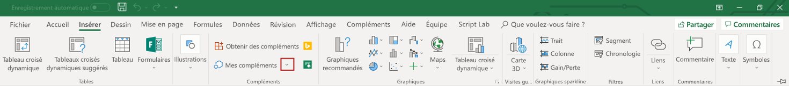

# <a name="tutorial-create-custom-functions-in-excel"></a>Didacticiel : créer des fonctions personnalisées dans Excel

## <a name="introduction"></a>Présentation

Les fonctions personnalisées vous permettent d’ajouter de nouvelles fonctions dans Excel en définissant ces fonctions dans JavaScript dans le cadre d’un complément. Les utilisateurs d’Excel peuvent accéder aux fonctions personnalisées comme ils le feraient pour n’importe quelle fonction native d’Excel, telle que `SUM()`. Vous pouvez créer des fonctions personnalisées qui effectuent des tâches simples telles que des calculs personnalisés ou des tâches plus complexes telles que la diffusion en continu des données en temps réel à partir du web dans une feuille de calcul.

Dans ce didacticiel, vous allez :
> [!div class="checklist"]
> * Créer un projet de fonctions personnalisées à l’aide du générateur Yo Office
> * Utiliser une fonction personnalisée prédéfinie pour effectuer un calcul simple
> * Créer une fonction personnalisée qui demande les données à partir du web
> * Créer une fonction personnalisée qui diffuse les données en temps réel à partir du web

[!include[Excel custom functions note](../includes/excel-custom-functions-note.md)]

## <a name="prerequisites"></a>Conditions requises

* [Node.js](https://nodejs.org/en/) (version 8.0.0 ou ultérieure)

* [Git Bash](https://git-scm.com/downloads) (ou un autre client Git)

* La dernière version de[Yeoman](https://yeoman.io/) et de [Yeoman Générateur de compléments Office](https://www.npmjs.com/package/generator-office). Pour installer ces outils globalement, exécutez la commande suivante à partir de l’invite de commande :

    ```
    npm install -g yo generator-office
    ```

    > [!NOTE]
    > Même si vous avez précédemment installé la Yeoman générateur, nous vous recommandons une mise à jour de votre package à partir de la dernière version de npm.

* Excel pour Windows (version 64 bits 1810 ou ultérieure) ou Excel Online

* Rejoignez le[programme Office Insider](https://products.office.com/office-insider)(** niveau**Insider, anciennement appelé « Insider Fast »)

## <a name="create-a-custom-functions-project"></a>Créer un projet de fonctions personnalisées

 Pour commencer, vous utiliserez le Yeoman Générateur pour créer le projet de fonctions personnalisées. Cette option définit votre projet, avec la structure de dossiers correct, les fichiers source et les dépendances pour commencer le codage de vos fonctions personnalisées.

1. Exécutez la commande suivante, puis répondez aux invitations comme suit.

    ```
    yo office
    ```

    * Choisissez un type de projet : `Excel Custom Functions Add-in project (...)`

    * Choisissez un type de script : `JavaScript`

    * Comment souhaitez-vous nommer votre complément ? `stock-ticker`

    

    Le générateur crée le projet et installe les composants Node.js de la prise en charge. Les fichiers de projet proviennent des référentiels [fonctions personnalisées Excel](https://github.com/OfficeDev/Excel-Custom-Functions)GitHub.

2. Accédez au dossier du projet.

    ```
    cd stock-ticker
    ```

3. Approuver le certificat auto-signé est nécessaire pour exécuter ce projet. Pour obtenir des instructions détaillées pour Windows ou Mac, voir [Ajout des Certificats Auto-signés comme Certificat Racine Approuvé](https://github.com/OfficeDev/generator-office/blob/master/src/docs/ssl.md).  

4. Construire le projet.

    ```
    npm run build
    ```

5. Démarrez le serveur web local qui est exécuté dans Node.js.

    * Si vous utilisez Excel pour Windows pour tester vos fonctions personnalisées, exécutez la commande suivante pour démarrer le serveur web local, ouvrir Excel et charger le complément :

        ```
         npm run start
        ```
        Après avoir exécuté cette commande, votre invite de commandes affiche les détails sur ce que vous avez terminé, une autre fenêtre npm s’ouvre et affiche les détails de la génération et Excel commence par votre complément chargé. Si vous complément ne charge pas, vérifiez que vous avez correctement terminé l’étape 3.

    * Si vous utilisez Excel Online pour tester vos fonctions personnalisées, exécutez la commande suivante pour démarrer le serveur web local :

        ```
        npm run start-web
        ```

         Après avoir exécuté cette commande, une autre fenêtre s’ouvre et affiche les détails de la génération. Pour utiliser les fonctions, ouvrez un nouveau classeur dans Office Online.

## <a name="try-out-a-prebuilt-custom-function"></a>Essayer une fonction personnalisée prédéfinie

Le projet de fonctions personnalisées que vous avez créé à l’aide du générateur Office Yo contient certaines fonctions personnalisées prédéfinies, définies dans le fichier **src/customfunction.js**. Le fichier**manifest.xml**dans le répertoire racine du projet indique que toutes les fonctions personnalisées appartiennent à l’ `CONTOSO` espace de noms.

Essayez de reproduire la`ADD` fonction personnalisée en complétant les étapes suivantes dans un classeur Excel :

1. Dans une cellule, tapez **= CONTOSO**. Notez que le menu de saisie semi-automatique affiche la liste de toutes les fonctions dans l’`CONTOSO` espace de noms.

2. Exécutez la`CONTOSO.ADD` fonction, avec les nombres `10` et `200` comme paramètres d’entrée, en spécifiant la valeur`=CONTOSO.ADD(10,200)`suivante dans la cellule et appuyez sur entrée.

Le `ADD` fonction personnalisée calcule la somme des deux nombres que vous avez spécifiés comme paramètres d’entrée. La saisie de`=CONTOSO.ADD(10,200)` doit générer le résultat **210** dans la cellule une fois que vous appuyez sur ENTRÉE.

## <a name="create-a-custom-function-that-requests-data-from-the-web"></a>Créer une fonction personnalisée qui demande les données à partir du web

Que se passe-t-il si vous avez besoin d’une fonction qui peut demander le prix d’une action à partir d’une API et afficher le résultat dans la cellule d’une feuille de calcul ? Les fonctions personnalisées sont conçues de sorte que vous pouvez facilement demander les données à partir du web de façon asynchrone.

Procédez comme suit pour créer une fonction personnalisée nommée `stockPrice` qui accepte une action (par exemple, **MSFT**) et renvoie le prix de cette action. Cette fonction personnalisée utilise l’API de cotation IEX, qui est gratuit et ne requiert pas d’authentification.

1. Dans le projet **Bourse** que le Générateur de Yo Office a créé, recherchez le fichier**src/customfunctions.js** et ouvrez-le dans votre éditeur de code.

2. Dans**customfunctions.js**, recherchez la`increment` fonction et ajoutez le code suivant immédiatement après cette fonction.

    ```js
    function stockPrice(ticker) {
        var url = "https://api.iextrading.com/1.0/stock/" + ticker + "/price";
        return fetch(url)
            .then(function(response) {
                return response.text();
            })
            .then(function(text) {
                return parseFloat(text);
            });

        // Note: in case of an error, the returned rejected Promise
        //    will be bubbled up to Excel to indicate an error.
    }

3. In **customfunctions.js**, locate the line`CustomFunctionMappings.INCREMENT = increment;`, add the following line of code immediately after that line, and save the file.

    ```js
    CustomFunctionMappings.STOCKPRICE = stockPrice;
    ```

4. Avant qu’Excel puisse rendre cette nouvelle fonction disponible, vous devez spécifier les métadonnées qui décrivent cette fonction à Excel. Ouvrez le fichier**config/customfunctions.json**. Ajoutez l’objet JSON suivante à la matrice « fonctions » et enregistrez le fichier.

    Cet élément JSON décrit la`stockPrice` fonction.

    ```JSON
    {
        "id": "STOCKPRICE",
        "name": "STOCKPRICE",
        "description": "Fetches current stock price",
        "helpUrl": "http://www.contoso.com/help",
        "result": {
            "type": "number",
            "dimensionality": "scalar"
        },  
        "parameters": [
            {
                "name": "ticker",
                "description": "stock ticker name",
                "type": "string",
                "dimensionality": "scalar"
            }
        ]
    }
    ```

5. Vous devez réenregistrer le complément dans Excel afin que la nouvelle fonction soit disponible pour les utilisateurs finaux. Complétez les étapes pour la plateforme que vous utiliserez dorénavant dans ce didacticiel.

    * Si vous utilisez Excel pour Windows :

        1. Fermez Excel, puis ouvrez de nouveau Excel.

        2. Dans Excel, sélectionnez l’onglet**insérer**, puis cliquez sur la flèche vers le bas située à droite de **mes compléments**.  

        3. Dans la liste des compléments disponibles, recherchez la section **Compléments Développeur** et sélectionnez votre complément**bourse** pour effectuer cette opération.
            

    * Si vous utilisez Excel Online :

        1. Dans Excel Online, sélectionnez l’onglet **insérer**, puis **compléments**. 

        2. Sélectionnez**Gérer mes compléments** et sélectionnez **Télécharger mon complément**. 

        3. Sélectionnez **Parcourir... ** et accédez au répertoire racine du projet créé par le Générateur de Yo Office. 

        4. Sélectionnez le fichier**manifest.xml** puis sélectionnez**Ouvrir**, puis sélectionnez **Télécharger**.

6. À présent, nous allons essayer la nouvelle fonction. Dans la cellule **B1**, tapez le texte `=CONTOSO.STOCKPRICE("MSFT")` et appuyez sur ENTRÉE. Vous devriez voir que le résultat dans la cellule **B1** est le prix boursier actuel pour un partage de stock Microsoft.

## <a name="create-a-streaming-asynchronous-custom-function"></a>Créer une fonction personnalisée asynchrone diffusion en continu

La `stockPrice` fonction que vous venez de créer renvoie le prix d’une action à un moment donné, mais les prix des actions changent constamment. Nous allons créer une fonction personnalisée des flux de données à partir d’une API pour obtenir des mises à jour en temps réel sur un prix boursier.

Procédez comme suit pour créer une fonction personnalisée nommée `stockPriceStream` qui demande le prix d’une action boursière spécifique chaque 1000 millisecondes (à condition que la demande précédente soit terminée). Pendant la requête initiale en cours, vous pourrez afficher la valeur de l’espace réservé **## CHARGEMENT_DONNEES** la cellule dans laquelle la fonction est appelée. Lorsqu’une valeur est renvoyée par la fonction **## CHARGEMENT_DONNEES** sera remplacée par cette valeur dans la cellule.

1. Dans le projet **Bourse** que le Générateur de Yo Office a créé, ajoutez le fichier **src/customfunctions.js** et enregistrez le fichier.

    ```js
    function stockPriceStream(ticker, handler) {
        var updateFrequency = 1000 /* milliseconds*/;
        var isPending = false;

        var timer = setInterval(function() {
            // If there is already a pending request, skip this iteration:
            if (isPending) {
                return;
            }

            var url = "https://api.iextrading.com/1.0/stock/" + ticker + "/price";
            isPending = true;

            fetch(url)
                .then(function(response) {
                    return response.text();
                })
                .then(function(text) {
                    handler.setResult(parseFloat(text));
                })
                .catch(function(error) {
                    handler.setResult(error);
                })
                .then(function() {
                    isPending = false;
                });
        }, updateFrequency);

        handler.onCanceled = () => {
            clearInterval(timer);
        };
    }

    CustomFunctionMappings.STOCKPRICESTREAM = stockPriceStream;
    ```

2. Avant qu’Excel puisse rendre cette nouvelle fonction disponible aux utilisateurs, vous devez spécifier les métadonnées qui décrivent cette fonction. Dans le projet **Bourse** que le Générateur de Yo Office a créé, ajoutez l’objet suivant à la `functions` matrice au sein du fichier**config/customfunctions.json** et enregistrez le fichier.

    Cet élément JSON décrit la`stockPriceStream` fonction. Pour n’importe quelle fonction de diffusion en continu, la propriété`stream` et la propriété`cancelable`doivent être définies `true` au sein de l’ `options` objet, comme illustré dans cet exemple de code.

    ```json
    { 
        "id": "STOCKPRICESTREAM",
        "name": "STOCKPRICESTREAM",
        "description": "Streams real time stock price",
        "helpUrl": "http://www.contoso.com/help",
        "result": {
            "type": "number",
            "dimensionality": "scalar"
        },  
        "parameters": [
            {
                "name": "ticker",
                "description": "stock ticker name",
                "type": "string",
                "dimensionality": "scalar"
            }
        ],
        "options": {
            "stream": true,
            "cancelable": true
        }
    }
    ```

3. Vous devez réenregistrer le complément dans Excel afin que la nouvelle fonction soit disponible pour les utilisateurs finaux. Complétez les étapes pour la plateforme que vous utiliserez dorénavant dans ce didacticiel.

    * Si vous utilisez Excel pour Windows :

        1. Fermez Excel, puis ouvrez de nouveau Excel.
        
        2. Dans Excel, sélectionnez l’onglet**insérer**, puis cliquez sur la flèche vers le bas située à droite de **mes compléments**.  

        3. Dans la liste des compléments disponibles, recherchez la section **Compléments Développeur** et sélectionnez votre complément**bourse** pour effectuer cette opération.
            

    * Si vous utilisez Excel Online :

        1. Dans Excel Online, sélectionnez l’onglet **insérer**, puis **compléments**. 

        2. Sélectionnez**Gérer mes compléments** et sélectionnez **Télécharger mon complément**.

        3. Sélectionnez **Parcourir... ** et accédez au répertoire racine du projet créé par le Générateur de Yo Office.

        4. Sélectionnez le fichier**manifest.xml** puis sélectionnez**Ouvrir**, puis sélectionnez **Télécharger**.

4. À présent, nous allons essayer la nouvelle fonction. Dans la cellule **C1**, tapez le texte `=CONTOSO.STOCKPRICESTREAM("MSFT")` et appuyez sur ENTRÉE. Si le marché est ouvert, vous devriez voir que le résultat dans la cellule **C1** constamment mis à jour pour refléter le prix en temps réel pour un partage d’actions Microsoft.

## <a name="next-steps"></a>Étapes suivantes

Dans ce didacticiel, vous avez créé un nouveau projet de fonctions personnalisées, essayé une fonction prédéfinie, créé une fonction personnalisée qui demande les données à partir du web et créé une fonction personnalisée qui diffuse les données en temps réel à partir du web. Pour en savoir plus sur les fonctions personnalisées dans Excel, passez à l’article suivant :

> [!div class="nextstepaction"]
> [Créer des fonctions personnalisées dans Excel](../excel/custom-functions-overview.md)

## <a name="legal-information"></a>Informations légales

Données fournies gratuitement par [IEX](https://iextrading.com/developer/). Afficher les [conditions d’utilisation de IEX](https://iextrading.com/api-exhibit-a/). L’utilisation de Microsoft de l’API IEX dans ce didacticiel est uniquement à des fins d’enseignement.
