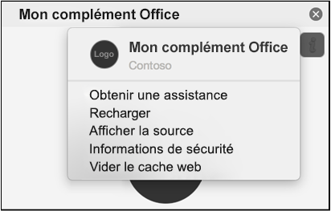

Les compléments sont souvent mis en cache dans Office pour Mac, pour des raisons de performances.Add-ins are often cached in Office for Mac, for performance reasons. En règle générale, vous pouvez effacer le cache en rechargeant le complément.Normally, the cache is cleared by reloading the add-in. S’il existe plusieurs compléments dans le même document, le processus de suppression automatique du cache lors du rechargement n’est peut-être pas fiable.If more than one add-in exists in the same document, the process of automatically clearing the cache on reload might not be reliable.

Vous pouvez effacer le cache à l’aide du menu personnalité de n’importe quel complément du volet Office.You can clear the cache by using the personality menu of any task pane add-in.
- Sélectionnez le menu personnalité.Choose the personality menu. Ensuite, sélectionnez **Vider le cache Web**.Then choose **Clear Web Cache**.
    > [!NOTE]
    > Vous devez exécuter macOS version 10.13.6 ou version ultérieure pour afficher le menu personnalité.You must run macOS version 10.13.6 or later to see the personality menu.
    
    

Vous pouvez également effacer le cache manuellement en supprimant le contenu du `~/Library/Containers/com.Microsoft.OsfWebHost/Data/` dossier.You can also clear the cache manually by deleting the contents of the `~/Library/Containers/com.Microsoft.OsfWebHost/Data/` folder.

> [!NOTE]
> Si ce dossier n’existe pas, recherchez les dossiers suivants et, le cas échéant, supprimez le contenu du dossier :If that folder doesn't exist, check for the following folders and if found, delete the contents of the folder:
>    - `~/Library/Containers/com.microsoft.{host}/Data/Library/Caches/`où `{host}` se trouve l’hôte Office (par exemple `Excel`,)`~/Library/Containers/com.microsoft.{host}/Data/Library/Caches/` where `{host}` is the Office host (e.g., `Excel`)
>    - `~/Library/Containers/com.microsoft.{host}/Data/Library/Application Support/Microsoft/Office/16.0/Wef/`où `{host}` se trouve l’hôte Office (par exemple `Excel`,)`~/Library/Containers/com.microsoft.{host}/Data/Library/Application Support/Microsoft/Office/16.0/Wef/` where `{host}` is the Office host (e.g., `Excel`)
>    - `com.microsoft.Office365ServiceV2/Data/Caches/com.microsoft.Office365ServiceV2/`
