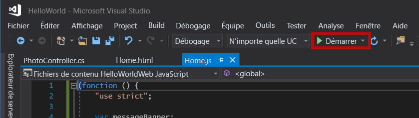
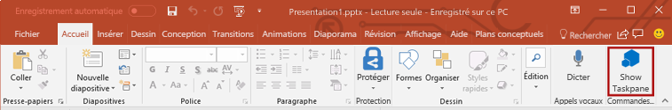
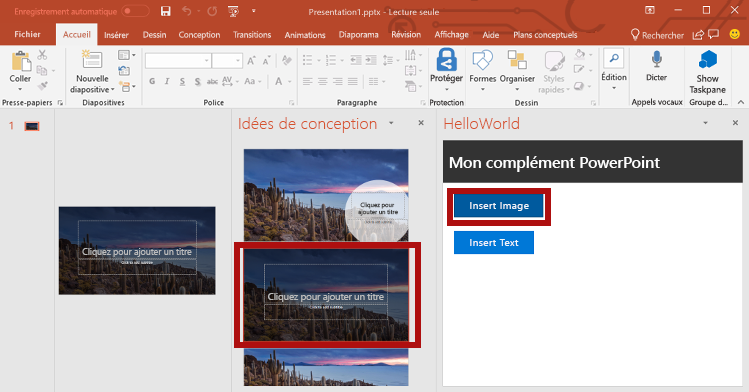
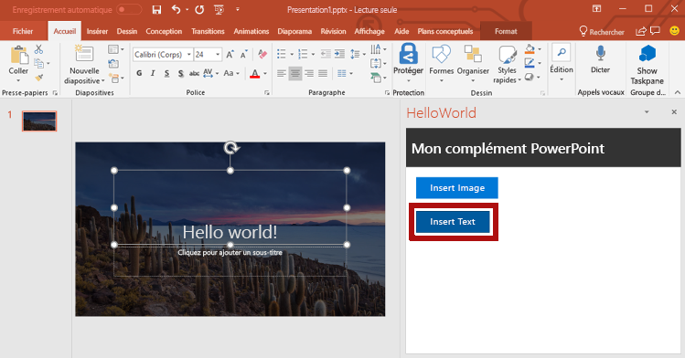
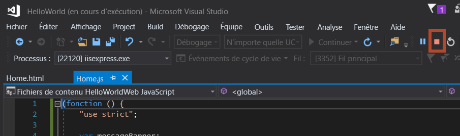

<span data-ttu-id="d6e14-101">Dans cette étape du didacticiel, vous allez ajouter du texte à la diapositive de titre qui contient la photo [Bing](https://www.bing.com) du jour.</span><span class="sxs-lookup"><span data-stu-id="d6e14-101">In this step of the tutorial, you'll add text to the title slide that contains the [Bing](https://www.bing.com) photo of the day.</span></span>

> [!NOTE]
> <span data-ttu-id="d6e14-102">Cette page décrit une étape individuelle du didacticiel sur le complément PowerPoint.</span><span class="sxs-lookup"><span data-stu-id="d6e14-102">This page describes an individual step of the PowerPoint add-in tutorial.</span></span> <span data-ttu-id="d6e14-103">Si vous êtes arrivé à cette page via les résultats du moteur de recherche ou d’un autre lien direct, accédez à la page d’introduction du [didacticiel sur le complément PowerPoint](../tutorials/powerpoint-tutorial.yml) pour démarrer le didacticiel à partir du début.</span><span class="sxs-lookup"><span data-stu-id="d6e14-103">If you’ve arrived at this page via search engine results or other direct link, please go to the [PowerPoint add-in tutorial](../tutorials/powerpoint-tutorial.yml) introduction page to start the tutorial from the beginning.</span></span>

## <a name="add-text-to-a-slide"></a><span data-ttu-id="d6e14-104">Ajout de texte à une diapositive</span><span class="sxs-lookup"><span data-stu-id="d6e14-104">Add text to a slide</span></span> 

1. <span data-ttu-id="d6e14-105">Dans le fichier **Home.html**, remplacez `TODO3` par le balisage suivant.</span><span class="sxs-lookup"><span data-stu-id="d6e14-105">In the **Home.html** file, replace `TODO3` with the following markup.</span></span> <span data-ttu-id="d6e14-106">Ce balisage définit le bouton **Insert Text** (Insérer du texte) qui s’affiche dans le volet Office du complément.</span><span class="sxs-lookup"><span data-stu-id="d6e14-106">This markup defines the **Insert Text** button that will appear within the add-in's task pane.</span></span>

    ```html
        <br /><br />
        <button class="ms-Button ms-Button--primary" id="insert-text">
            <span class="ms-Button-icon"><i class="ms-Icon ms-Icon--plus"></i></span>
            <span class="ms-Button-label">Insert Text</span>
            <span class="ms-Button-description">Inserts text into the slide.</span>
        </button>
    ```

2. <span data-ttu-id="d6e14-107">Dans le fichier **Home.js**, remplacez `TODO4` par le code suivant pour attribuer le gestionnaire d’événements pour le bouton **Insert Text** (Insérer du texte).</span><span class="sxs-lookup"><span data-stu-id="d6e14-107">In the **Home.js** file, replace `TODO4` with the following code to assign the event handler for the **Insert Text** button.</span></span>

    ```js
    $('#insert-text').click(insertText);
    ```

3. <span data-ttu-id="d6e14-108">Dans le fichier **Home.js**, remplacez `TODO5` par le code suivant pour définir la fonction **insertText**.</span><span class="sxs-lookup"><span data-stu-id="d6e14-108">In the **Home.js** file, replace `TODO5` with the following code to define the **insertText** function.</span></span> <span data-ttu-id="d6e14-109">Cette fonction insère du texte dans la diapositive active.</span><span class="sxs-lookup"><span data-stu-id="d6e14-109">This function inserts text into the current slide.</span></span>

    ```js
    function insertText() {
        Office.context.document.setSelectedDataAsync('Hello World!',
            function (asyncResult) {
                if (asyncResult.status === Office.AsyncResultStatus.Failed) {
                    showNotification("Error", asyncResult.error.message);
                }
            });
    }
    ```

## <a name="test-the-add-in"></a><span data-ttu-id="d6e14-110">Tester le complément</span><span class="sxs-lookup"><span data-stu-id="d6e14-110">Test the add-in</span></span>

1. <span data-ttu-id="d6e14-p104">À l’aide de Visual Studio, testez le complément en appuyant sur `F5` ou en choisissant le bouton **Démarrer** pour lancer PowerPoint avec le bouton du complément **Show Taskpane** (Afficher le volet Office) qui apparaît dans le ruban. Le complément sera hébergé localement sur IIS.</span><span class="sxs-lookup"><span data-stu-id="d6e14-p104">Using Visual Studio, test the add-in by pressing `F5` or choosing the **Start** button to launch PowerPoint with the **Show Taskpane** add-in button displayed in the ribbon. The add-in will be hosted locally on IIS.</span></span>

    

2. <span data-ttu-id="d6e14-114">Dans PowerPoint, sélectionnez le bouton **Show Taskpane** (Afficher le volet Office) dans le ruban pour ouvrir le volet Office du complément.</span><span class="sxs-lookup"><span data-stu-id="d6e14-114">In PowerPoint, select the **Show Taskpane** button in the ribbon to open the add-in task pane.</span></span>

    

3. <span data-ttu-id="d6e14-116">Dans le volet Office, sélectionnez le bouton **Insert Image** (Insérer une image) pour ajouter la photo Bing du jour sur la diapositive active et choisissez une mise en page pour la diapositive qui contient une zone de texte pour le titre.</span><span class="sxs-lookup"><span data-stu-id="d6e14-116">In the task pane, choose the **Insert Image** button to add the Bing photo of the day to the current slide and choose a design for the slide that contains a text box for the title.</span></span>

    

4. <span data-ttu-id="d6e14-118">Placez votre curseur dans la zone de texte sur la diapositive de titre, dans le volet Office, sélectionnez le bouton **Insert Text** (Insérer du texte) permettant d’ajouter du texte à la diapositive.</span><span class="sxs-lookup"><span data-stu-id="d6e14-118">Put your cursor in the text box on the title slide and then in the task pane, choose the **Insert Text** button to add text to the slide.</span></span>

    


5. <span data-ttu-id="d6e14-120">Dans Visual Studio, arrêtez le complément en appuyant sur `Shift + F5` ou en choisissant le bouton **Arrêter**.</span><span class="sxs-lookup"><span data-stu-id="d6e14-120">In Visual Studio, stop the add-in by pressing `Shift + F5` or choosing the **Stop** button.</span></span> <span data-ttu-id="d6e14-121">PowerPoint se ferme automatiquement lorsque le complément est arrêté.</span><span class="sxs-lookup"><span data-stu-id="d6e14-121">PowerPoint will automatically close when the add-in is stopped.</span></span>

    