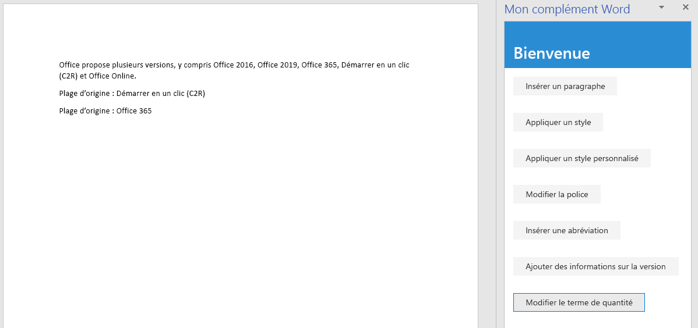

<span data-ttu-id="6cc55-101">Dans cette étape du didacticiel, vous ajouterez du texte dans les plages de texte sélectionnées et en dehors de celles-ci, puis remplacerez le texte de la plage sélectionnée.</span><span class="sxs-lookup"><span data-stu-id="6cc55-101">In this step of the tutorial, you'll add text inside and outside of selected ranges of text, and replace the text of a selected range.</span></span>

> [!NOTE]
> <span data-ttu-id="6cc55-p101">Cette page décrit une étape individuelle d’un didacticiel sur les compléments Word. Si vous êtes arrivé à cette page via les résultats du moteur de recherche ou d’un autre lien direct, accédez à la page d’introduction du [didacticiel sur les compléments Word](../tutorials/word-tutorial.yml) pour démarrer le didacticiel à partir du début.</span><span class="sxs-lookup"><span data-stu-id="6cc55-p101">This page describes an individual step of a Word add-in tutorial. If you’ve arrived at this page via search engine results or other direct link, please go to the [Word add-in tutorial](../tutorials/word-tutorial.yml) introduction page to start the tutorial from the beginning.</span></span>

## <a name="add-text-inside-a-range"></a><span data-ttu-id="6cc55-104">Ajouter du texte dans une plage</span><span class="sxs-lookup"><span data-stu-id="6cc55-104">Add text inside a range</span></span>

1. <span data-ttu-id="6cc55-105">Ouvrez le projet dans votre éditeur de code.</span><span class="sxs-lookup"><span data-stu-id="6cc55-105">Open the project in your code editor.</span></span>
2. <span data-ttu-id="6cc55-106">Ouvrez le fichier index.html.</span><span class="sxs-lookup"><span data-stu-id="6cc55-106">Open the file index.html.</span></span>
3. <span data-ttu-id="6cc55-107">En dessous de la balise `div` qui contient le bouton `change-font`, ajoutez le balisage suivant :</span><span class="sxs-lookup"><span data-stu-id="6cc55-107">Below the `div` that contains the `change-font` button, add the following markup:</span></span>

    ```html
    <div class="padding">
        <button class="ms-Button" id="insert-text-into-range">Insert Abbreviation</button>
    </div>
    ```

4. <span data-ttu-id="6cc55-108">Ouvrez le fichier app.js.</span><span class="sxs-lookup"><span data-stu-id="6cc55-108">Open the app.js file.</span></span>

5. <span data-ttu-id="6cc55-109">Sous la ligne qui attribue un gestionnaire de clics au bouton `change-font`, ajoutez le code suivant :</span><span class="sxs-lookup"><span data-stu-id="6cc55-109">Below the line that assigns a click handler to the `change-font` button, add the following code:</span></span>

    ```js
    $('#insert-text-into-range').click(insertTextIntoRange);
    ```

6. <span data-ttu-id="6cc55-110">Sous la fonction `changeFont`, ajoutez la fonction suivante :</span><span class="sxs-lookup"><span data-stu-id="6cc55-110">Below the `changeFont` function, add the following function:</span></span>

    ```js
    function insertTextIntoRange() {
        Word.run(function (context) {

            // TODO1: Queue commands to insert text into a selected range.

            // TODO2: Load the text of the range and sync so that the
            //        current range text can be read.

            // TODO3: Queue commands to repeat the text of the original
            //        range at the end of the document.

            return context.sync();
        })
        .catch(function (error) {
            console.log("Error: " + error);
            if (error instanceof OfficeExtension.Error) {
                console.log("Debug info: " + JSON.stringify(error.debugInfo));
            }
        });
    }
    ``` 

7. <span data-ttu-id="6cc55-p102">Remplacez `TODO1` par le code suivant. Tenez compte des informations suivantes :</span><span class="sxs-lookup"><span data-stu-id="6cc55-p102">Replace `TODO1` with the following code. Note:</span></span>
   - <span data-ttu-id="6cc55-113">La méthode est destinée à insérer l’abréviation [« (C2R) »] à la fin de la plage dont le texte est « Click-to-Run » (Démarrer en un clic).</span><span class="sxs-lookup"><span data-stu-id="6cc55-113">The method is intended to insert the abbreviation ["(C2R)"] into the end of the Range whose text is "Click-to-Run".</span></span> <span data-ttu-id="6cc55-114">Cela permet d’émettre une hypothèse simplifiée selon laquelle la chaîne est présente et l’utilisateur l’a sélectionnée.</span><span class="sxs-lookup"><span data-stu-id="6cc55-114">It makes a simplifying assumption that the string is present and the user has selected it.</span></span>
   - <span data-ttu-id="6cc55-115">Le premier paramètre de la méthode `Range.insertText` correspond à la chaîne à insérer dans l’objet `Range`.</span><span class="sxs-lookup"><span data-stu-id="6cc55-115">The first parameter of the `Range.insertText` method is the string to insert into the `Range` object.</span></span>
   - <span data-ttu-id="6cc55-116">Le deuxième paramètre spécifie l’emplacement où le texte supplémentaire doit être inséré dans la plage.</span><span class="sxs-lookup"><span data-stu-id="6cc55-116">The second parameter specifies where in the range the additional text should be inserted.</span></span> <span data-ttu-id="6cc55-117">Outre « Fin », les autres options possibles sont : « Début », « Avant », « Après » et « Remplacer ».</span><span class="sxs-lookup"><span data-stu-id="6cc55-117">Besides "End", the other possible options are "Start", "Before", "After", and "Replace".</span></span> 
   - <span data-ttu-id="6cc55-118">La différence entre « Fin » et « Après » est que « Fin » insère le nouveau texte à la fin de la plage existante, tandis que l’option « Après » crée une plage avec la chaîne et insère la nouvelle plage après la plage existante.</span><span class="sxs-lookup"><span data-stu-id="6cc55-118">The difference between "End" and "After" is that "End" inserts the new text inside the end of the existing range, but "After" creates a new range with the string and inserts the new range after the existing range.</span></span> <span data-ttu-id="6cc55-119">De même, « Début » insère le texte au début de la plage existante, tandis que l’option « Avant » insère une nouvelle plage.</span><span class="sxs-lookup"><span data-stu-id="6cc55-119">Similarly, "Start" inserts text inside the beginning of the existing range and "Before" inserts a new range.</span></span> <span data-ttu-id="6cc55-120">L’option « Remplacer » remplace le texte de la plage existante par la chaîne dans le premier paramètre.</span><span class="sxs-lookup"><span data-stu-id="6cc55-120">"Replace" replaces the text of the existing range with the string in the first parameter.</span></span>
   - <span data-ttu-id="6cc55-121">Vous avez vu lors d’une étape précédente du didacticiel que les méthodes insert\* de l’objet corps ne disposent pas des options « Avant » et « Après ».</span><span class="sxs-lookup"><span data-stu-id="6cc55-121">You saw in an earlier stage of the tutorial that the insert\* methods of the body object do not have the "Before" and "After" options.</span></span> <span data-ttu-id="6cc55-122">Cela est dû au fait que vous ne pouvez pas placer de contenu en dehors du corps du document.</span><span class="sxs-lookup"><span data-stu-id="6cc55-122">This is because you can't put content outside of the document's body.</span></span>

    ```js
    const doc = context.document;
    const originalRange = doc.getSelection();
    originalRange.insertText(" (C2R)", "End");
    ```

8. <span data-ttu-id="6cc55-123">Nous ignorerons `TODO2` jusqu’à la section suivante.</span><span class="sxs-lookup"><span data-stu-id="6cc55-123">We'll skip over `TODO2` until the next section.</span></span> <span data-ttu-id="6cc55-124">Remplacez `TODO3` par le code suivant.</span><span class="sxs-lookup"><span data-stu-id="6cc55-124">Replace `TODO3` with the following code:</span></span> <span data-ttu-id="6cc55-125">Ce code est similaire au code que vous avez créé lors de la première phase du didacticiel, sauf que, maintenant, vous insérez un nouveau paragraphe à la fin du document plutôt qu’au début.</span><span class="sxs-lookup"><span data-stu-id="6cc55-125">This code is similar to the code you created in the first stage of the tutorial, except that now you are inserting a new paragraph at the end of the document instead of at the start.</span></span> <span data-ttu-id="6cc55-126">Ce nouveau paragraphe montre que le nouveau texte fait désormais partie de la plage d’origine.</span><span class="sxs-lookup"><span data-stu-id="6cc55-126">This new paragraph will demonstrate that the new text is now part of the original range.</span></span>

    ```js
    doc.body.insertParagraph("Original range: " + originalRange.text,
                             "End");
    ```

## <a name="add-code-to-fetch-document-properties-into-the-task-panes-script-objects"></a><span data-ttu-id="6cc55-127">Ajouter du code pour récupérer des propriétés de document dans les objets de script du volet Office</span><span class="sxs-lookup"><span data-stu-id="6cc55-127">Add code to fetch document properties into the task pane's script objects</span></span>

<span data-ttu-id="6cc55-128">Dans toutes les fonctions précédentes de cette série de didacticiels, vous avez mis en file d’attente des commandes pour écrire (*write*) dans le document Office.</span><span class="sxs-lookup"><span data-stu-id="6cc55-128">In all the previous functions in this series of tutorials, you queued commands to *write* to the Office document.</span></span> <span data-ttu-id="6cc55-129">Chaque fonction se terminait par un appel de la méthode `context.sync()` qui envoie les commandes en file d’attente au document pour qu’elles soient exécutées.</span><span class="sxs-lookup"><span data-stu-id="6cc55-129">Each function ended with a call to the `context.sync()` method which sends the queued commands to the document to be executed.</span></span> <span data-ttu-id="6cc55-130">Cependant, le code que vous avez ajouté dans la dernière étape appelle la propriété `originalRange.text` et c’est une différence significative par rapport aux fonctions antérieures que vous avez écrites, car l’objet `originalRange` est uniquement un objet de proxy qui existe dans le script de votre volet Office.</span><span class="sxs-lookup"><span data-stu-id="6cc55-130">But the code you added in the last step calls the `originalRange.text` property, and this is a significant difference from the earlier functions you wrote, because the `originalRange` object is only a proxy object that exists in your task pane's script.</span></span> <span data-ttu-id="6cc55-131">Il ne connaît pas le texte réel de la plage dans le document, donc sa propriété `text` ne peut pas contenir de valeur réelle.</span><span class="sxs-lookup"><span data-stu-id="6cc55-131">It doesn't know what the actual text of the range in the document is, so its `text` property can't have a real value.</span></span> <span data-ttu-id="6cc55-132">Il est nécessaire de récupérer d’abord la valeur de texte de la plage à partir du document, puis de l’utiliser pour définir la valeur de `originalRange.text`.</span><span class="sxs-lookup"><span data-stu-id="6cc55-132">It is necessary to first fetch the text value of the range from the document and use it to set the value of `originalRange.text`.</span></span> <span data-ttu-id="6cc55-133">Seulement ensuite, la propriété `originalRange.text` peut être appelée sans générer d’exception.</span><span class="sxs-lookup"><span data-stu-id="6cc55-133">Only then can `originalRange.text` be called without causing an exception to be thrown.</span></span> <span data-ttu-id="6cc55-134">Ce processus de récupération comporte trois étapes :</span><span class="sxs-lookup"><span data-stu-id="6cc55-134">This fetching process has three steps:</span></span>

   1. <span data-ttu-id="6cc55-135">Mettez en file d’attente une commande de chargement (c’est-à-dire, fetch) des propriétés que votre code doit lire.</span><span class="sxs-lookup"><span data-stu-id="6cc55-135">Queue a command to load (that is; fetch) the properties that your code needs to read.</span></span>
   2. <span data-ttu-id="6cc55-136">Appelez la méthode `sync` de l’objet de contexte pour envoyer la commande mise en file d’attente vers le document pour exécution, et renvoyez les informations demandées.</span><span class="sxs-lookup"><span data-stu-id="6cc55-136">Call the context object's `sync` method to send the queued command to the document for execution and return the requested information.</span></span>
   3. <span data-ttu-id="6cc55-137">Étant donné que la méthode `sync` est asynchrone, assurez-vous qu’elle est terminée avant que votre code appelle les propriétés qui ont été récupérées.</span><span class="sxs-lookup"><span data-stu-id="6cc55-137">Because the `sync` method is asynchronous, ensure that it has completed before your code calls the properties that were fetched.</span></span>

<span data-ttu-id="6cc55-138">Ces étapes doivent être effectuées à chaque fois que votre code doit lire (*read*) des informations provenant du document Office.</span><span class="sxs-lookup"><span data-stu-id="6cc55-138">These steps must be completed whenever your code needs to *read* information from the Office document.</span></span>

1. <span data-ttu-id="6cc55-139">Remplacez `TODO2` par le code suivant.</span><span class="sxs-lookup"><span data-stu-id="6cc55-139">Replace `TODO2` with the following code:</span></span>
  
    ```js
    originalRange.load("text");
    return context.sync()
        .then(function() {

                // TODO4: Move the doc.body.insertParagraph line here.

            }
        )
            // TODO5: Move the final call of context.sync here and ensure
            //        that it does not run until the insertParagraph has
            //        been queued.
    ```

2. <span data-ttu-id="6cc55-p109">Il est impossible que deux instructions `return` se trouvent dans le même chemin de code, supprimez donc la dernière ligne `return context.sync();` à la fin de la fonction `Word.run`. Vous ajouterez une nouvelle ligne finale `context.sync` par la suite dans ce didacticiel.</span><span class="sxs-lookup"><span data-stu-id="6cc55-p109">You can't have two `return` statements in the same unbranching code path, so delete the final line `return context.sync();` at the end of the `Word.run`. You'll add a new final `context.sync` later in this tutorial.</span></span>
3. <span data-ttu-id="6cc55-142">Coupez la ligne `doc.body.insertParagraph` et collez-la à la place de `TODO4`.</span><span class="sxs-lookup"><span data-stu-id="6cc55-142">Cut the `doc.body.insertParagraph` line and paste in place of `TODO4`.</span></span>
4. <span data-ttu-id="6cc55-p110">Remplacez `TODO5` par le code suivant. Remarque :</span><span class="sxs-lookup"><span data-stu-id="6cc55-p110">Replace `TODO5` with the following code. Note:</span></span>
   - <span data-ttu-id="6cc55-145">Le fait de transmettre la méthode `sync` à une fonction `then` permet de s’assurer qu’elle n’est pas exécutée tant que la logique `insertParagraph` n’a pas été mise en file d’attente.</span><span class="sxs-lookup"><span data-stu-id="6cc55-145">Passing the `sync` method to a `then` function ensures that it does not run until the `insertParagraph` logic has been queued.</span></span>
   - <span data-ttu-id="6cc55-146">La méthode `then` appelle n’importe quelle fonction qui lui est transmise, et vous ne souhaitez pas appeler `sync` deux fois, donc omettez les parenthèses « () » à la fin de context.sync.</span><span class="sxs-lookup"><span data-stu-id="6cc55-146">The `then` method invokes whatever function is passed to it, and you don't want `sync` to be invoked twice, so leave off the "()" from the end of context.sync.</span></span>

    ```js
    .then(context.sync);
    ```

<span data-ttu-id="6cc55-147">Lorsque vous avez terminé, la fonction entière doit ressembler à ce qui suit :</span><span class="sxs-lookup"><span data-stu-id="6cc55-147">When you are done, the entire function should look like the following:</span></span>


```js
function insertTextIntoRange() {
    Word.run(function (context) {

        const doc = context.document;
        const originalRange = doc.getSelection();
        originalRange.insertText(" (C2R)", "End");

        originalRange.load("text");
        return context.sync()
            .then(function() {
                        doc.body.insertParagraph("Current text of original range: " + originalRange.text,
                                                "End");
                }
            )
            .then(context.sync);
    })
    .catch(function (error) {
        console.log("Error: " + error);
        if (error instanceof OfficeExtension.Error) {
            console.log("Debug info: " + JSON.stringify(error.debugInfo));
        }
    });
}
```

## <a name="add-text-between-ranges"></a><span data-ttu-id="6cc55-148">Ajouter du texte entre les plages</span><span class="sxs-lookup"><span data-stu-id="6cc55-148">Add text between ranges</span></span>

1. <span data-ttu-id="6cc55-149">Ouvrez le fichier index.html.</span><span class="sxs-lookup"><span data-stu-id="6cc55-149">Open the file index.html.</span></span>
2. <span data-ttu-id="6cc55-150">En dessous de la balise `div` qui contient le bouton `insert-text-into-range`, ajoutez le balisage suivant :</span><span class="sxs-lookup"><span data-stu-id="6cc55-150">Below the `div` that contains the `insert-text-into-range` button, add the following markup:</span></span>

    ```html
    <div class="padding">
        <button class="ms-Button" id="insert-text-outside-range">Add Version Info</button>
    </div>
    ```

3. <span data-ttu-id="6cc55-151">Ouvrez le fichier app.js.</span><span class="sxs-lookup"><span data-stu-id="6cc55-151">Open the app.js file.</span></span>

4. <span data-ttu-id="6cc55-152">Sous la ligne qui attribue un gestionnaire de clics au bouton `insert-text-into-range`, ajoutez le code suivant :</span><span class="sxs-lookup"><span data-stu-id="6cc55-152">Below the line that assigns a click handler to the `insert-text-into-range` button, add the following code:</span></span>

    ```js
    $('#insert-text-outside-range').click(insertTextBeforeRange);
    ```

5. <span data-ttu-id="6cc55-153">Sous la fonction `insertTextIntoRange`, ajoutez la fonction suivante :</span><span class="sxs-lookup"><span data-stu-id="6cc55-153">Below the `insertTextIntoRange` function, add the following function:</span></span>

    ```js
    function insertTextBeforeRange() {
        Word.run(function (context) {

            // TODO1: Queue commands to insert a new range before the
            //        selected range.

            // TODO2: Load the text of the original range and sync so that the
            //        range text can be read and inserted.

        })
        .catch(function (error) {
            console.log("Error: " + error);
            if (error instanceof OfficeExtension.Error) {
                console.log("Debug info: " + JSON.stringify(error.debugInfo));
            }
        });
    }
    ```

6. <span data-ttu-id="6cc55-p111">Remplacez `TODO1` par le code suivant. Tenez compte des informations suivantes :</span><span class="sxs-lookup"><span data-stu-id="6cc55-p111">Replace `TODO1` with the following code. Note:</span></span>
   - <span data-ttu-id="6cc55-156">La méthode est destinée à ajouter une plage dont le texte est « Office 2019 », avant la plage contenant le texte « Office 365 ».</span><span class="sxs-lookup"><span data-stu-id="6cc55-156">The method is intended to add a range whose text is "Office 2019, " before the range with text "Office 365".</span></span> <span data-ttu-id="6cc55-157">Cela permet d’émettre une hypothèse simplifiée selon laquelle la chaîne est présente et l’utilisateur l’a sélectionnée.</span><span class="sxs-lookup"><span data-stu-id="6cc55-157">It makes a simplifying assumption that the string is present and the user has selected it.</span></span>
   - <span data-ttu-id="6cc55-158">Le premier paramètre de la méthode `Range.insertText` correspond à la chaîne à ajouter.</span><span class="sxs-lookup"><span data-stu-id="6cc55-158">The first parameter of the `Range.insertText` method is the string to add.</span></span>
   - <span data-ttu-id="6cc55-159">Le deuxième paramètre spécifie l’emplacement où le texte supplémentaire doit être inséré dans la plage.</span><span class="sxs-lookup"><span data-stu-id="6cc55-159">The second parameter specifies where in the range the additional text should be inserted.</span></span> <span data-ttu-id="6cc55-160">Pour plus d’informations sur les options d’emplacement, reportez-vous à la discussion précédente sur la fonction `insertTextIntoRange`.</span><span class="sxs-lookup"><span data-stu-id="6cc55-160">For more details about the location options, see the previous discussion of the `insertTextIntoRange` function.</span></span>

    ```js
    const doc = context.document;
    const originalRange = doc.getSelection();
    originalRange.insertText("Office 2019, ", "Before");
    ```

7. <span data-ttu-id="6cc55-161">Remplacez `TODO2` par le code suivant.</span><span class="sxs-lookup"><span data-stu-id="6cc55-161">Replace `TODO2` with the following code:</span></span>

     ```js
    originalRange.load("text");
    return context.sync()
        .then(function() {

                // TODO3: Queue commands to insert the original range as a
                //        paragraph at the end of the document.

                }
            )

            // TODO4: Make a final call of context.sync here and ensure
            //        that it does not run until the insertParagraph has
            //        been queued.
    ```

8. <span data-ttu-id="6cc55-162">Remplacez `TODO3` par le code suivant.</span><span class="sxs-lookup"><span data-stu-id="6cc55-162">Replace `TODO3` with the following code:</span></span> <span data-ttu-id="6cc55-163">Ce nouveau paragraphe montre que le nouveau texte n’entre ***pas*** dans la plage sélectionnée d’origine.</span><span class="sxs-lookup"><span data-stu-id="6cc55-163">This new paragraph will demonstrate the fact that the new text is ***not*** part of the original selected range.</span></span> <span data-ttu-id="6cc55-164">La plage d’origine contient toujours le texte qu’elle contenait lorsqu’elle avait été sélectionnée uniquement.</span><span class="sxs-lookup"><span data-stu-id="6cc55-164">The original range still has only the text it had when it was selected.</span></span>

    ```js
    doc.body.insertParagraph("Current text of original range: " + originalRange.text,
                             "End");
    ```

9. <span data-ttu-id="6cc55-165">Remplacez `TODO4` par le code suivant :</span><span class="sxs-lookup"><span data-stu-id="6cc55-165">Replace `TODO4` with the following code:</span></span>

    ```js
    .then(context.sync);
    ```


## <a name="replace-the-text-of-a-range"></a><span data-ttu-id="6cc55-166">Remplacer le texte d’une plage</span><span class="sxs-lookup"><span data-stu-id="6cc55-166">Replace the text of a range</span></span>

1. <span data-ttu-id="6cc55-167">Ouvrez le fichier index.html.</span><span class="sxs-lookup"><span data-stu-id="6cc55-167">Open the file index.html.</span></span>
2. <span data-ttu-id="6cc55-168">En dessous de la balise `div` qui contient le bouton `insert-text-outside-range`, ajoutez le balisage suivant :</span><span class="sxs-lookup"><span data-stu-id="6cc55-168">Below the `div` that contains the `insert-text-outside-range` button, add the following markup:</span></span>

    ```html
    <div class="padding">
        <button class="ms-Button" id="replace-text">Change Quantity Term</button>
    </div>
    ```

3. <span data-ttu-id="6cc55-169">Ouvrez le fichier app.js.</span><span class="sxs-lookup"><span data-stu-id="6cc55-169">Open the app.js file.</span></span>

4. <span data-ttu-id="6cc55-170">Sous la ligne qui attribue un gestionnaire de clics au bouton `insert-text-outside-range`, ajoutez le code suivant :</span><span class="sxs-lookup"><span data-stu-id="6cc55-170">Below the line that assigns a click handler to the `insert-text-outside-range` button, add the following code:</span></span>

    ```js
    $('#replace-text').click(replaceText);
    ```

5. <span data-ttu-id="6cc55-171">Sous la fonction `insertTextBeforeRange`, ajoutez la fonction suivante :</span><span class="sxs-lookup"><span data-stu-id="6cc55-171">Below the `insertTextBeforeRange` function, add the following function:</span></span>

    ```js
    function replaceText() {
        Word.run(function (context) {

            // TODO1: Queue commands to replace the text.

            return context.sync();
        })
        .catch(function (error) {
            console.log("Error: " + error);
            if (error instanceof OfficeExtension.Error) {
                console.log("Debug info: " + JSON.stringify(error.debugInfo));
            }
        });
    }
    ```

6. <span data-ttu-id="6cc55-172">Remplacez `TODO1` par le code suivant.</span><span class="sxs-lookup"><span data-stu-id="6cc55-172">Replace `TODO1` with the following code:</span></span> <span data-ttu-id="6cc55-173">La méthode est destinée à remplacer la chaîne « several » (plusieurs) par la chaîne « many » (beaucoup).</span><span class="sxs-lookup"><span data-stu-id="6cc55-173">Note that the method is intended to replace the string "several" with the string "many".</span></span> <span data-ttu-id="6cc55-174">Cela permet d’émettre une hypothèse simplifiée selon laquelle la chaîne est présente et l’utilisateur l’a sélectionnée.</span><span class="sxs-lookup"><span data-stu-id="6cc55-174">It makes a simplifying assumption that the string is present and the user has selected it.</span></span>

    ```js
    const doc = context.document;
    const originalRange = doc.getSelection();
    originalRange.insertText("many", "Replace");
    ```

## <a name="test-the-add-in"></a><span data-ttu-id="6cc55-175">Test du complément</span><span class="sxs-lookup"><span data-stu-id="6cc55-175">Test the add-in</span></span>

1. <span data-ttu-id="6cc55-176">Si la fenêtre Git Bash, ou l’invite système Node.JS, de l’étape précédente du didacticiel est encore ouverte, appuyez sur Ctrl+C à deux reprises pour arrêter le serveur web en cours d’exécution.</span><span class="sxs-lookup"><span data-stu-id="6cc55-176">If the Git bash window, or Node.JS-enabled system prompt, from the previous stage tutorial is still open, enter Ctrl-C twice to stop the running web server.</span></span> <span data-ttu-id="6cc55-177">Sinon, ouvrez une fenêtre Git Bash, ou une invite système Node.JS, et accédez au dossier **Start** du projet.</span><span class="sxs-lookup"><span data-stu-id="6cc55-177">Otherwise, open a Git bash window, or Node.JS-enabled system prompt, and navigate to the **Start** folder of the project.</span></span>

     > [!NOTE]
     > <span data-ttu-id="6cc55-178">Bien que le serveur synchronisé au navigateur recharge votre complément dans le volet Office chaque fois que vous apportez une modification à un fichier, y compris le fichier app.js, il ne retranspile pas le code JavaScript. Vous devez donc de nouveau utiliser la commande build afin que les modifications apportées à app.js prennent effet.</span><span class="sxs-lookup"><span data-stu-id="6cc55-178">Although the browser-sync server reloads your add-in in the task pane every time you make a change to any file, including the app.js file, it does not retranspile the JavaScript, so you must repeat the build command in order for your changes to app.js to take effect.</span></span> <span data-ttu-id="6cc55-179">Pour ce faire, vous devez arrêter le processus du serveur pour pouvoir obtenir une invite et saisir la commande build.</span><span class="sxs-lookup"><span data-stu-id="6cc55-179">In order to do this, you need to kill the server process so that the prompt appears and you can enter the build command.</span></span> <span data-ttu-id="6cc55-180">Après la commande build, redémarrez le serveur.</span><span class="sxs-lookup"><span data-stu-id="6cc55-180">After the build, restart the server.</span></span> <span data-ttu-id="6cc55-181">Les prochaines étapes vous permettent d’effectuer ce processus.</span><span class="sxs-lookup"><span data-stu-id="6cc55-181">The next few steps carry out this process.</span></span>

2. <span data-ttu-id="6cc55-182">Exécutez la commande `npm run build` afin de transpiler votre code source ES6 vers une version antérieure de JavaScript prise en charge par tous les hôtes sur lesquels les compléments Office peuvent être exécutés.</span><span class="sxs-lookup"><span data-stu-id="6cc55-182">Run the command `npm run build` to transpile your ES6 source code to an earlier version of JavaScript that is supported by all the hosts where Office Add-ins can run.</span></span>
3. <span data-ttu-id="6cc55-183">Exécutez la commande `npm start` pour démarrer un serveur web en cours d’exécution sur localhost.</span><span class="sxs-lookup"><span data-stu-id="6cc55-183">Run the command `npm start` to start a web server running on localhost.</span></span>
4. <span data-ttu-id="6cc55-184">Rechargez le volet des tâches en le fermant, puis dans le menu **Accueil**, sélectionnez **Afficher le volet des tâches** pour rouvrir le complément.</span><span class="sxs-lookup"><span data-stu-id="6cc55-184">Reload the task pane by closing it, and then on the **Home** menu, select **Show Taskpane** to reopen the add-in.</span></span>
5. <span data-ttu-id="6cc55-185">Dans le volet Office, sélectionnez **Insérer un paragraphe** pour vous assurer qu’un paragraphe apparaît au début du document.</span><span class="sxs-lookup"><span data-stu-id="6cc55-185">In the taskpane, choose **Insert Paragraph** to ensure that there is a paragraph at the start of the document.</span></span>
6. <span data-ttu-id="6cc55-186">Sélectionnez du texte.</span><span class="sxs-lookup"><span data-stu-id="6cc55-186">Select some text.</span></span> <span data-ttu-id="6cc55-187">Sélectionner l’expression « Click-to-Run » (Démarrer en un clic) semble le plus approprié.</span><span class="sxs-lookup"><span data-stu-id="6cc55-187">Selecting the phrase "Click-to-Run" will make the most sense.</span></span> <span data-ttu-id="6cc55-188">*Veillez à ne pas inclure tout espace précédent ou suivant dans la sélection.*</span><span class="sxs-lookup"><span data-stu-id="6cc55-188">*Be careful not to include the preceding or following space in the selection.*</span></span>
7. <span data-ttu-id="6cc55-189">Sélectionnez le bouton **Insérer une abréviation**.</span><span class="sxs-lookup"><span data-stu-id="6cc55-189">Choose the **Insert Abbreviation** button.</span></span> <span data-ttu-id="6cc55-190">L’abréviation « (C2R) » est ajoutée.</span><span class="sxs-lookup"><span data-stu-id="6cc55-190">Note that " (C2R)" is added.</span></span> <span data-ttu-id="6cc55-191">Notez également qu’en bas du document, un nouveau paragraphe est ajouté avec l’intégralité du texte développé, car la nouvelle chaîne a été ajoutée à la plage existante.</span><span class="sxs-lookup"><span data-stu-id="6cc55-191">Note also that at the bottom of the document a new paragraph is added with the entire expanded text because the new string was added to the existing range.</span></span>
8. <span data-ttu-id="6cc55-192">Sélectionnez du texte.</span><span class="sxs-lookup"><span data-stu-id="6cc55-192">Select some text.</span></span> <span data-ttu-id="6cc55-193">Sélectionner l’expression « Office 365 » semble le plus approprié.</span><span class="sxs-lookup"><span data-stu-id="6cc55-193">Selecting the phrase "Office 365" will make the most sense.</span></span> <span data-ttu-id="6cc55-194">*Veillez à ne pas inclure tout espace précédent ou suivant dans la sélection.*</span><span class="sxs-lookup"><span data-stu-id="6cc55-194">*Be careful not to include the preceding or following space in the selection.*</span></span>
9. <span data-ttu-id="6cc55-195">Sélectionnez le bouton **Ajouter les informations de version**.</span><span class="sxs-lookup"><span data-stu-id="6cc55-195">Choose the **Add Version Info** button.</span></span> <span data-ttu-id="6cc55-196">L’expression « Office 2019 » est insérée entre « Office 2016 » et « Office 365 ».</span><span class="sxs-lookup"><span data-stu-id="6cc55-196">Note that "Office 2019, " is inserted between "Office 2016" and "Office 365".</span></span> <span data-ttu-id="6cc55-197">Notez également qu’en bas du document, un nouveau paragraphe est ajouté. Celui-ci contient uniquement le texte sélectionné à l’origine, car la nouvelle chaîne est devenue une nouvelle plage plutôt que d’être ajoutée à la plage d’origine.</span><span class="sxs-lookup"><span data-stu-id="6cc55-197">Note also that at the bottom of the document a new paragraph is added but it contains only the originally selected text because the new string became a new range rather than being added to the original range.</span></span>
10. <span data-ttu-id="6cc55-198">Sélectionnez du texte.</span><span class="sxs-lookup"><span data-stu-id="6cc55-198">Select some text.</span></span> <span data-ttu-id="6cc55-199">Sélectionner le mot « several » (plusieurs) semble le plus approprié.</span><span class="sxs-lookup"><span data-stu-id="6cc55-199">Selecting the word "several" will make the most sense.</span></span> <span data-ttu-id="6cc55-200">*Veillez à ne pas inclure tout espace précédent ou suivant dans la sélection.*</span><span class="sxs-lookup"><span data-stu-id="6cc55-200">*Be careful not to include the preceding or following space in the selection.*</span></span>
11. <span data-ttu-id="6cc55-201">Sélectionnez le bouton permettant de **modifier la condition de quantité** (Change Quantity Term).</span><span class="sxs-lookup"><span data-stu-id="6cc55-201">Choose the **Change Quantity Term** button.</span></span> <span data-ttu-id="6cc55-202">Notez que « many » (beaucoup) remplace le texte sélectionné.</span><span class="sxs-lookup"><span data-stu-id="6cc55-202">Note that "many" replaces the selected text.</span></span>

    
