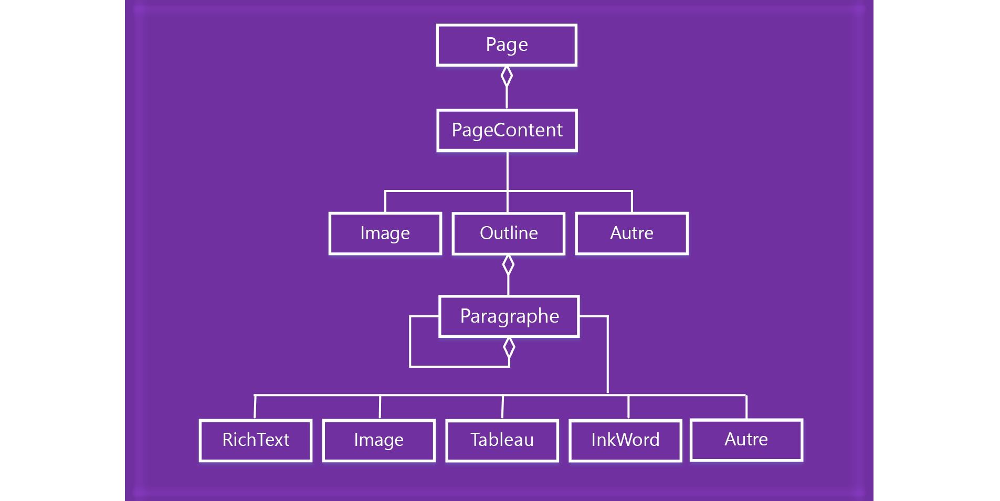

# Utiliser du contenu de page OneNote

Dans l’API JavaScript des compléments OneNote, le contenu de page est représenté par le modèle objet suivant.

  

- Un objet Page contient une collection d’objets PageContent.
- Un objet PageContent contient un type de contenu de Outline, Image ou Other.
- Un objet Outline contient une collection d’objets Paragraph.
- Un objet Paragraph contient un type de contenu RichText, Image, Table ou Other.

Pour créer une page OneNote vide, utilisez l’une des méthodes suivantes :

- [Section.addPage](/javascript/api/onenote/onenote.section#addpage-title-)
- [Page.insertPageAsSibling](/javascript/api/onenote/onenote.section#insertsectionassibling-location--title-)

Utilisez ensuite les méthodes dans les objets suivants pour travailler avec le contenu de la page, comme `Page.addOutline` et `Outline.appendHtml`.

- [Page](/javascript/api/onenote/onenote.page)
- [Outline](/javascript/api/onenote/onenote.outline)
- [Paragraph](/javascript/api/onenote/onenote.paragraph)

Le contenu et la structure d’une page OneNote sont représentés par du code HTML. Seul un sous-ensemble de code HTML est pris en charge pour créer ou mettre à jour du contenu de page, comme décrit ci-dessous.

## HTML pris en charge

L’API JavaScript des compléments OneNote prend en charge le code HTML suivant pour créer et mettre à jour du contenu de page :

- `<html>`, `<body>`, `
`, ``, ` `
- `
`
- ``
- `<a>`
- `<ul>`, `<ol>`, `<li>`
- `<table>`, `<tr>`, `<td>`
- `<h1>` ... `<h6>`
- `<b>`, `<em>`, `<strong>`, `<i>`, `<u>`, `<del>`, ``, ``, `<cite>`

> [!NOTE]
> L’importation du code HTML dans OneNote consolide les espaces blancs. Le contenu obtenu est collé dans un plan.

OneNote fait de son mieux pour traduire le code HTML en contenu de page tout en assurant la sécurité des utilisateurs. Les normes HTML et CSS ne correspondent pas exactement au modèle de contenu de OneNote, il y aura donc des différences d'apparence, en particulier avec les styles CSS. Nous vous recommandons d’utiliser les objets JavaScript si une mise en forme spécifique est nécessaire.

## Accès au contenu de la page

Vous pouvez uniquement accéder au *contenu de la page* via `Page#load` pour la page actuellement active. Pour modifier la page active, appelez `navigateToPage($page)`.

Des métadonnées, telles que le titre, peuvent toujours être interrogées pour n’importe quelle page.

## Voir aussi

- [Vue d’ensemble de la programmation de l’API JavaScript de OneNote](onenote-add-ins-programming-overview.md)
- [Référence de l’API JavaScript de OneNote](../reference/overview/onenote-add-ins-javascript-reference.md)
- [Exemple de grille d’évaluation](https://github.com/OfficeDev/OneNote-Add-in-Rubric-Grader)
- [Vue d’ensemble de la plateforme des compléments Office](../overview/office-add-ins.md)
