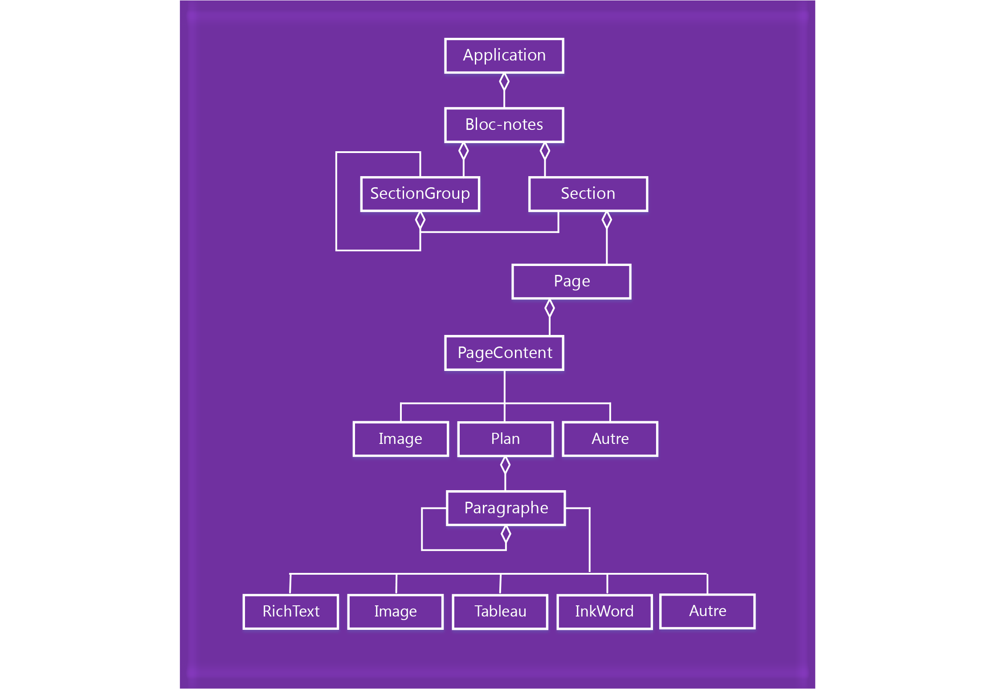

# <a name="onenote-javascript-api-programming-overview"></a><span data-ttu-id="3b446-102">Vue d’ensemble de la programmation de l’API JavaScript de OneNote</span><span class="sxs-lookup"><span data-stu-id="3b446-102">OneNote JavaScript API programming overview</span></span>

<span data-ttu-id="3b446-103">OneNote présente une API JavaScript pour les compléments OneNote Online. Vous pouvez créer des compléments de volet de tâches et de contenu, ainsi que des commandes de complément qui interagissent avec les objets OneNote et se connectent à des services web ou à d’autres ressources basées sur le web.</span><span class="sxs-lookup"><span data-stu-id="3b446-103">OneNote introduces a JavaScript API for OneNote Online add-ins. You can create task pane add-ins, content add-ins, and add-in commands that interact with OneNote objects and connect to web services or other web-based resources.</span></span>

> [!NOTE]
> <span data-ttu-id="3b446-p101">Si vous prévoyez de [publier](../publish/publish.md) votre complément sur AppSource et de le rendre disponible dans l’expérience Office, assurez-vous que vous respectez les [stratégies de validation AppSource](https://docs.microsoft.com/en-us/office/dev/store/validation-policies). Par exemple, pour réussir la validation, votre complément doit fonctionner sur toutes les plateformes prenant en charge les méthodes définies (pour en savoir plus, consultez la [section 4.12](https://docs.microsoft.com/en-us/office/dev/store/validation-policies#4-apps-and-add-ins-behave-predictably) et la [page relative à la disponibilité des compléments Office sur les plateformes et les hôtes](../overview/office-add-in-availability.md)).</span><span class="sxs-lookup"><span data-stu-id="3b446-p101">If you plan to [publish](../publish/publish.md) your add-in to AppSource and make it available within the Office experience, make sure that you conform to the [AppSource validation policies](https://docs.microsoft.com/en-us/office/dev/store/validation-policies). For example, to pass validation, your add-in must work across all platforms that support the methods that you define (for more information, see [section 4.12](https://docs.microsoft.com/en-us/office/dev/store/validation-policies#4-apps-and-add-ins-behave-predictably) and the [Office Add-in host and availability page](../overview/office-add-in-availability.md)).</span></span>

## <a name="components-of-an-office-add-in"></a><span data-ttu-id="3b446-106">Composants d’un complément Office</span><span class="sxs-lookup"><span data-stu-id="3b446-106">Components of an Office Add-in</span></span>

<span data-ttu-id="3b446-107">Les compléments sont constitués de deux composants de base :</span><span class="sxs-lookup"><span data-stu-id="3b446-107">Add-ins consist of two basic components:</span></span>

- <span data-ttu-id="3b446-p102">Une **application web** comportant une page web et les fichiers CSS, JavaScript ou autres requis. Ces fichiers sont hébergés sur un serveur web ou un service d’hébergement web, tel que Microsoft Azure. Dans OneNote Online, l’application web s’affiche dans un contrôle de navigateur ou un iFrame.</span><span class="sxs-lookup"><span data-stu-id="3b446-p102">A **web application** consisting of a webpage and any required JavaScript, CSS, or other files. These files are hosted on a web server or web hosting service, such as Microsoft Azure. In OneNote Online, the web application displays in a browser control or iframe.</span></span>
    
- <span data-ttu-id="3b446-p103">Un **manifeste XML** spécifiant l’URL de la page web du complément, ainsi que les conditions d’accès, les paramètres et fonctionnalités du complément. Ce fichier est stocké sur le client. Les compléments OneNote utilisent le même format de [manifeste](../develop/add-in-manifests.md) que les autres compléments Office.</span><span class="sxs-lookup"><span data-stu-id="3b446-p103">An **XML manifest** that specifies the URL of the add-in's webpage and any access requirements, settings, and capabilities for the add-in. This file is stored on the client. OneNote add-ins use the same [manifest](../develop/add-in-manifests.md) format as other Office Add-ins.</span></span>

<span data-ttu-id="3b446-114">**Complément pour Office = manifeste + page web**</span><span class="sxs-lookup"><span data-stu-id="3b446-114">**Office Add-in = Manifest + Webpage**</span></span>


## <a name="using-the-javascript-api"></a><span data-ttu-id="3b446-116">Utilisation de l’API JavaScript</span><span class="sxs-lookup"><span data-stu-id="3b446-116">Using the JavaScript API</span></span>

<span data-ttu-id="3b446-p104">Les compléments utilisent le contexte d’exécution de l’application hôte pour accéder à l’API JavaScript. L’API comporte deux couches :</span><span class="sxs-lookup"><span data-stu-id="3b446-p104">Add-ins use the runtime context of the host application to access the JavaScript API. The API has two layers:</span></span> 

- <span data-ttu-id="3b446-119">Une **API enrichie** pour les opérations spécifiques de OneNote, accessible via l’objet **Application**.</span><span class="sxs-lookup"><span data-stu-id="3b446-119">A **rich API** for OneNote-specific operations, accessed through the **Application** object.</span></span>
- <span data-ttu-id="3b446-120">Une **API commune** qui est partagée entre les applications Office, accessible via l’objet **Document**.</span><span class="sxs-lookup"><span data-stu-id="3b446-120">A **common API** that's shared across Office applications, accessed through the **Document** object.</span></span>

### <a name="accessing-the-rich-api-through-the-application-object"></a><span data-ttu-id="3b446-121">Accès à l’API enrichie via l’objet *Application*</span><span class="sxs-lookup"><span data-stu-id="3b446-121">Accessing the rich API through the *Application* object</span></span>

<span data-ttu-id="3b446-p105">Utilisez l’objet **Application** pour accéder aux objets OneNote tels que **Notebook**, **Section** et **Page**. Grâce à l’API enrichie, vous pouvez exécuter des opérations par lot sur les objets proxy. Le flux de base ressemble à ceci :</span><span class="sxs-lookup"><span data-stu-id="3b446-p105">Use the **Application** object to access OneNote objects such as **Notebook**, **Section**, and **Page**. With rich APIs, you run batch operations on proxy objects. The basic flow goes something like this:</span></span> 

1. <span data-ttu-id="3b446-125">Obtenir l’instance de l’application à partir du contexte.</span><span class="sxs-lookup"><span data-stu-id="3b446-125">Get the application instance from the context.</span></span>

2. <span data-ttu-id="3b446-p106">Créer un proxy qui représente l’objet OneNote que vous souhaitez utiliser. Vous interagissez simultanément avec les objets proxy en lisant et en écrivant leurs propriétés et en appelant leurs méthodes.</span><span class="sxs-lookup"><span data-stu-id="3b446-p106">Create a proxy that represents the OneNote object you want to work with. You interact synchronously with proxy objects by reading and writing their properties and calling their methods.</span></span> 

3. <span data-ttu-id="3b446-p107">Appelez la méthode **load** sur le serveur proxy pour la remplir avec les valeurs de propriété spécifiées dans le paramètre. Cet appel est ajouté à la file d’attente des commandes.</span><span class="sxs-lookup"><span data-stu-id="3b446-p107">Call **load** on the proxy to fill it with the property values specified in the parameter. This call is added to the queue of commands.</span></span>

   > [!NOTE]
   > <span data-ttu-id="3b446-130">Les appels de méthode à l’API (tels que `context.application.getActiveSection().pages;`) sont également ajoutés à la file d’attente.</span><span class="sxs-lookup"><span data-stu-id="3b446-130">Method calls to the API (such as `context.application.getActiveSection().pages;`) are also added to the queue.</span></span>

4. <span data-ttu-id="3b446-p108">Appelez la méthode **context.sync** pour exécuter toutes les commandes en attente dans l’ordre dans lequel elles ont été mises en file d’attente. Cela permet de synchroniser l’état entre votre script d’exécution et les objets réels, en récupérant les propriétés des objets OneNote chargés à utiliser dans vos scripts. Vous pouvez utiliser l’objet Promise renvoyé pour créer une chaîne avec les actions supplémentaires.</span><span class="sxs-lookup"><span data-stu-id="3b446-p108">Call **context.sync** to run all queued commands in the order that they were queued. This synchronizes the state between your running script and the real objects, and by retrieving properties of loaded OneNote objects for use in your script. You can use the returned promise object for chaining additional actions.</span></span>

<span data-ttu-id="3b446-134">Par exemple :</span><span class="sxs-lookup"><span data-stu-id="3b446-134">For example:</span></span> 

```js
function getPagesInSection() {
    OneNote.run(function (context) {
        
        // Get the pages in the current section.
        var pages = context.application.getActiveSection().pages;
        
        // Queue a command to load the id and title for each page.            
        pages.load('id,title');
        
        // Run the queued commands, and return a promise to indicate task completion.
        return context.sync()
            .then(function () {
                
                // Read the id and title of each page. 
                $.each(pages.items, function(index, page) {
                    var pageId = page.id;
                    var pageTitle = page.title;
                    console.log(pageTitle + ': ' + pageId); 
                });
            })
            .catch(function (error) {
                app.showNotification("Error: " + error);
                console.log("Error: " + error);
                if (error instanceof OfficeExtension.Error) {
                    console.log("Debug info: " + JSON.stringify(error.debugInfo));
                }
            });
    });
}
```

<span data-ttu-id="3b446-135">Vous pouvez déterminer les objets et les opérations OneNote pris en charge dans la [référence de l’API](https://dev.office.com/reference/add-ins/onenote/onenote-add-ins-javascript-reference).</span><span class="sxs-lookup"><span data-stu-id="3b446-135">You can find supported OneNote objects and operations in the [API reference](https://dev.office.com/reference/add-ins/onenote/onenote-add-ins-javascript-reference).</span></span>

### <a name="accessing-the-common-api-through-the-document-object"></a><span data-ttu-id="3b446-136">Accès à l’API commune via l’objet *Document*</span><span class="sxs-lookup"><span data-stu-id="3b446-136">Accessing the common API through the *Document* object</span></span>

<span data-ttu-id="3b446-137">Utilisez l’objet **Document** pour accéder à l’API commune, par exemple les méthodes [getSelectedDataAsync](https://dev.office.com/reference/add-ins/shared/document.getselecteddataasync) et [setSelectedDataAsync](https://dev.office.com/reference/add-ins/shared/document.setselecteddataasync).</span><span class="sxs-lookup"><span data-stu-id="3b446-137">Use the **Document** object to access the common API, such as the [getSelectedDataAsync](https://dev.office.com/reference/add-ins/shared/document.getselecteddataasync) and [setSelectedDataAsync](https://dev.office.com/reference/add-ins/shared/document.setselecteddataasync) methods.</span></span> 

<span data-ttu-id="3b446-138">Par exemple :</span><span class="sxs-lookup"><span data-stu-id="3b446-138">For example:</span></span>  

```js
function getSelectionFromPage() {
    Office.context.document.getSelectedDataAsync(
        Office.CoercionType.Text,
        { valueFormat: "unformatted" },
        function (asyncResult) {
            var error = asyncResult.error;
            if (asyncResult.status === Office.AsyncResultStatus.Failed) {
                console.log(error.message);
            }
            else $('#input').val(asyncResult.value);
        });
}
```
<span data-ttu-id="3b446-139">Les compléments OneNote prennent en charge uniquement les API communes suivantes :</span><span class="sxs-lookup"><span data-stu-id="3b446-139">OneNote add-ins support only the following common APIs:</span></span>

| <span data-ttu-id="3b446-140">API</span><span class="sxs-lookup"><span data-stu-id="3b446-140">API</span></span> | <span data-ttu-id="3b446-141">Commentaires</span><span class="sxs-lookup"><span data-stu-id="3b446-141">Notes</span></span> |
|:------|:------|
| [<span data-ttu-id="3b446-142">Office.context.document.getSelectedDataAsync</span><span class="sxs-lookup"><span data-stu-id="3b446-142">Office.context.document.getSelectedDataAsync</span></span>](https://dev.office.com/reference/add-ins/shared/document.getselecteddataasync) | <span data-ttu-id="3b446-143">**Office.CoercionType.Text** et **Office.CoercionType.Matrix** uniquement</span><span class="sxs-lookup"><span data-stu-id="3b446-143">**Office.CoercionType.Text** and **Office.CoercionType.Matrix** only</span></span> |
| [<span data-ttu-id="3b446-144">Office.context.document.setSelectedDataAsync</span><span class="sxs-lookup"><span data-stu-id="3b446-144">Office.context.document.setSelectedDataAsync</span></span>](https://dev.office.com/reference/add-ins/shared/document.setselecteddataasync) | <span data-ttu-id="3b446-145">**Office.CoercionType.Text**, **Office.CoercionType.Image** et **Office.CoercionType.Html** uniquement</span><span class="sxs-lookup"><span data-stu-id="3b446-145">**Office.CoercionType.Text**, **Office.CoercionType.Image**, and **Office.CoercionType.Html** only</span></span> | 
| [<span data-ttu-id="3b446-146">var mySetting = Office.context.document.settings.get(name);</span><span class="sxs-lookup"><span data-stu-id="3b446-146">var mySetting = Office.context.document.settings.get(name);</span></span>](https://dev.office.com/reference/add-ins/shared/settings.get) | <span data-ttu-id="3b446-147">Les paramètres sont pris en charge par les compléments de contenu uniquement</span><span class="sxs-lookup"><span data-stu-id="3b446-147">Settings are supported by content add-ins only</span></span> | 
| [<span data-ttu-id="3b446-148">Office.context.document.settings.set(name, value);</span><span class="sxs-lookup"><span data-stu-id="3b446-148">Office.context.document.settings.set(name, value);</span></span>](https://dev.office.com/reference/add-ins/shared/settings.set) | <span data-ttu-id="3b446-149">Les paramètres sont pris en charge par les compléments de contenu uniquement</span><span class="sxs-lookup"><span data-stu-id="3b446-149">Settings are supported by content add-ins only</span></span> | 
| [<span data-ttu-id="3b446-150">Office.EventType.DocumentSelectionChanged</span><span class="sxs-lookup"><span data-stu-id="3b446-150">Office.EventType.DocumentSelectionChanged</span></span>](https://dev.office.com/reference/add-ins/shared/document.selectionchanged.event) ||

<span data-ttu-id="3b446-p109">En règle générale, vous utilisez uniquement l’API commune pour effectuer une action qui n’est pas prise en charge dans l’API enrichie. Pour en savoir plus sur l’utilisation de l’API commune, voir la [documentation](../overview/office-add-ins.md) et les [références](https://dev.office.com/reference/add-ins/javascript-api-for-office) concernant les compléments Office.</span><span class="sxs-lookup"><span data-stu-id="3b446-p109">In general, you only use the common API to do something that isn't supported in the rich API. To learn more about using the common API, see the Office Add-ins [documentation](../overview/office-add-ins.md) and [reference](https://dev.office.com/reference/add-ins/javascript-api-for-office).</span></span>


<a name="om-diagram"></a>
## <a name="onenote-object-model-diagram"></a><span data-ttu-id="3b446-153">Diagramme du modèle objet OneNote</span><span class="sxs-lookup"><span data-stu-id="3b446-153">OneNote object model diagram</span></span> 
<span data-ttu-id="3b446-154">Le diagramme suivant représente ce qui est actuellement disponible dans l’API JavaScript de OneNote.</span><span class="sxs-lookup"><span data-stu-id="3b446-154">The following diagram represents what's currently available in the OneNote JavaScript API.</span></span>

  


## <a name="see-also"></a><span data-ttu-id="3b446-156">Voir aussi</span><span class="sxs-lookup"><span data-stu-id="3b446-156">See also</span></span>

- [<span data-ttu-id="3b446-157">Créer votre premier complément OneNote</span><span class="sxs-lookup"><span data-stu-id="3b446-157">Build your first OneNote add-in</span></span>](onenote-add-ins-getting-started.md)
- [<span data-ttu-id="3b446-158">Référence de l’API JavaScript de OneNote</span><span class="sxs-lookup"><span data-stu-id="3b446-158">OneNote JavaScript API reference</span></span>](https://dev.office.com/reference/add-ins/onenote/onenote-add-ins-javascript-reference)
- [<span data-ttu-id="3b446-159">Exemple de grille d’évaluation</span><span class="sxs-lookup"><span data-stu-id="3b446-159">Rubric Grader sample</span></span>](https://github.com/OfficeDev/OneNote-Add-in-Rubric-Grader)
- [<span data-ttu-id="3b446-160">Vue d’ensemble de la plateforme des compléments Office</span><span class="sxs-lookup"><span data-stu-id="3b446-160">Office Add-ins platform overview</span></span>](../overview/office-add-ins.md)
