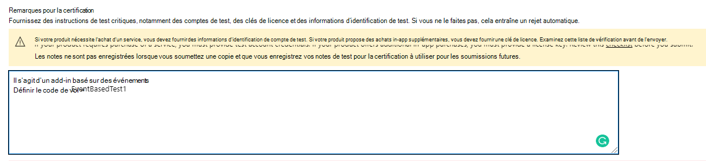
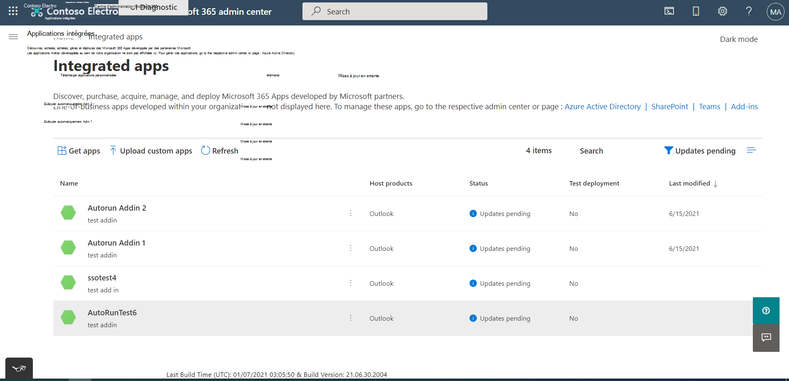
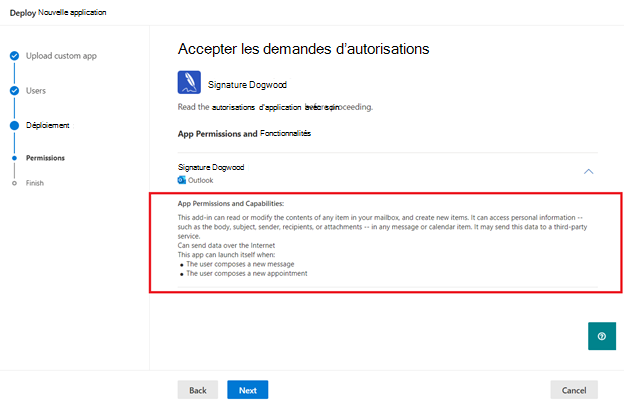
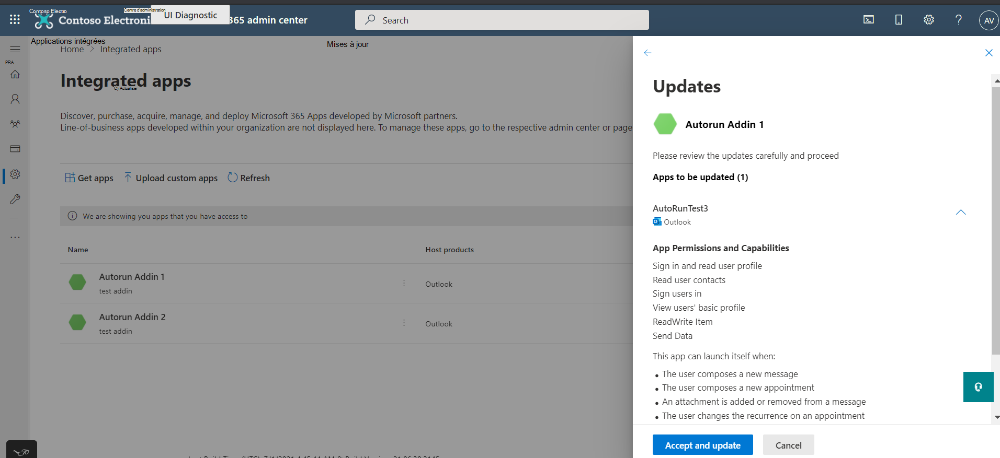

# <a name="appsource-listing-options-for-your-event-based-outlook-add-in"></a>Options de liste AppSource pour votre Outlook d’événements

Pour l’instant, les add-ins doivent être déployés par les administrateurs d’une organisation pour que les utilisateurs finaux accèdent à la fonctionnalité basée sur les événements. Nous limitons l’activation basée sur les événements si l’utilisateur final a acquis le complément directement à partir d’AppSource. Par exemple, si le add-in Contoso inclut le point d’extension avec au moins un point défini sous le nœud, l’appel automatique du module ne se produit que si le module a été installé pour l’utilisateur final par l’administrateur de son organisation. Dans le cas `LaunchEvent` `LaunchEvent Type` contraire, l’appel automatique du module est `LaunchEvents` bloqué. Consultez l’extrait suivant d’un exemple de manifeste de add-in.

```xml
...
<ExtensionPoint xsi:type="LaunchEvent">
  <LaunchEvents>
    <LaunchEvent Type="OnNewMessageCompose" FunctionName="onMessageComposeHandler"/>
    ...
```

Un utilisateur final ou un administrateur peut acquérir des applications par le biais d’AppSource ou de l’application Office Store. Si le scénario ou le flux de travail principal de votre complément nécessite une activation basée sur des événements, vous pouvez limiter la mise à disposition de vos compléments au déploiement de l’administrateur. Pour activer cette restriction, nous pouvons fournir des URL de code de vol. Grâce aux codes de vol, seuls les utilisateurs finaux ayant ces URL spéciales peuvent accéder à la liste. Voici un exemple d’URL.

`https://appsource.microsoft.com/product/office/WA200002862?flightCodes=EventBasedTest1`

Les utilisateurs et les administrateurs ne peuvent pas rechercher explicitement un application par son nom dans AppSource ou dans le Office Store in-app lorsqu’un code de vol est activé pour celui-ci. En tant que créateur du add-in, vous pouvez partager en privé ces codes de vol avec les administrateurs de l’organisation pour le déploiement de ces derniers.

> [!NOTE]
> Bien que les utilisateurs finaux peuvent installer le complément à l’aide d’un code de vol, le complément n’inclut pas l’activation basée sur des événements.

## <a name="specify-a-flight-code"></a>Spécifier un code de vol

Pour spécifier le code de la flight que vous souhaitez pour votre add-in, partagez ces informations dans les Notes de **certification** lorsque vous publiez votre add-in. _**Important**:_ Les codes de vol sont sensibles à la cas.



## <a name="deploy-add-in-with-flight-code"></a>Déployer un add-in avec un code de vol

Une fois les codes de vol définies, vous recevrez l’URL de l’équipe de certification des applications. Vous pouvez ensuite partager l’URL avec les administrateurs en privé.

Pour déployer le add-in, l’administrateur peut suivre les étapes suivantes.

- Connectez-vous admin.microsoft.com ou AppSource.com avec votre compte Microsoft 365 administrateur. Si l' sign-on unique (SSO) est activée pour le add-in, des informations d’identification d’administrateur général sont nécessaires.
- Ouvrez l’URL du code de vol dans un navigateur web.
- On the add-in listing page, select **Get it now**. Vous devez être redirigé vers le portail d’application intégré.

## <a name="unrestricted-appsource-listing"></a>Liste AppSource non restreinte

Si votre complément n’utilise pas l’activation basée sur les événements pour les scénarios critiques (autrement dit, votre complément fonctionne bien sans appel automatique), envisagez de répertorier votre complément dans AppSource sans codes de vol spéciaux. Si un utilisateur final obtient votre complément à partir d’AppSource, l’activation automatique ne se produit pas pour l’utilisateur. Toutefois, ils peuvent utiliser d’autres composants de votre add-in, tels qu’un volet Des tâches ou une commande sans interface utilisateur.

> [!IMPORTANT]
> Il s’agit d’une restriction temporaire. À l’avenir, nous prévoyons d’activer l’activation de complément basée sur des événements pour les utilisateurs finaux qui achètent directement votre complément.

## <a name="update-existing-add-ins-to-include-event-based-activation"></a>Mettre à jour les compléments existants pour inclure l’activation basée sur des événements

Vous pouvez mettre à jour votre complément existant pour inclure l’activation basée sur un événement, puis le resoumettre pour validation et décider si vous souhaitez une liste AppSource restreinte ou non.

Une fois le add-in mis à jour approuvé, les administrateurs de l’organisation qui ont précédemment déployé le add-in reçoivent un message de mise à jour dans la **section** Applications intégrées du Centre d’administration. Le message informe l’administrateur des modifications apportées à l’activation basée sur l’événement. Une fois que l’administrateur a accepté les modifications, la mise à jour est déployée pour les utilisateurs finaux.



Pour les utilisateurs finaux qui ont installé le complément eux-mêmes, la fonctionnalité d’activation basée sur des événements ne fonctionne pas même après la mise à jour du complément.

## <a name="admin-consent-for-installing-event-based-add-ins"></a>Consentement de l’administrateur pour l’installation de add-ins basés sur des événements

Chaque fois qu’un complément basé sur  un événement est déployé à partir de l’écran Applications intégrées, l’administrateur obtient des détails sur les fonctionnalités d’activation basée sur les événements du complément dans l’Assistant de déploiement. Les détails apparaissent dans la section **Autorisations et fonctionnalités de l’application.** L’administrateur doit voir tous les événements dans lequel le add-in peut s’activer automatiquement.



De même, lorsqu’un add-in existant est mis à jour vers une fonctionnalité basée sur les événements, l’administrateur voit l’état « Mettre à jour en attente » sur le add-in. Le add-in mis à jour est déployé uniquement si l’administrateur consent aux modifications notées dans la section Autorisations et fonctionnalités de l’application, y compris l’ensemble des **événements** dans lesquels le module peut s’activer automatiquement.

Chaque fois que vous ajoutez de nouvelles informations à votre complément, les administrateurs voient le flux de mise à jour dans le portail d’administration et doivent donner leur consentement pour `LaunchEvent Type` d’autres événements.



## <a name="see-also"></a>Voir aussi

- [Configurer votre complément Outlook pour l’activation basée sur des événements](autolaunch.md)
