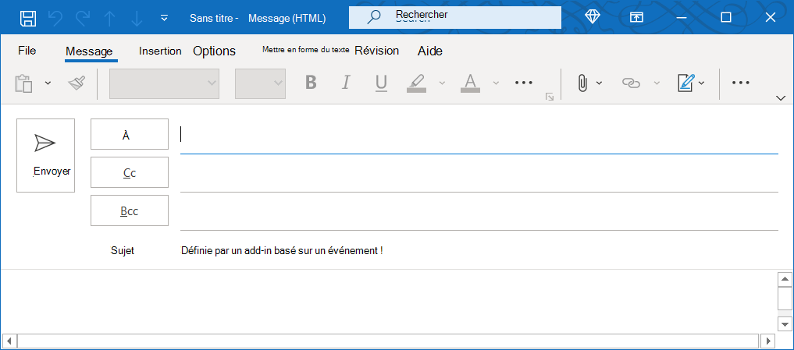

# <a name="configure-your-outlook-add-in-for-event-based-activation-preview"></a>Configurer votre complément Outlook pour l’activation basée sur des événements (aperçu)

Sans la fonctionnalité d’activation basée sur des événements, un utilisateur doit lancer explicitement un complément pour effectuer ses tâches. Cette fonctionnalité permet à votre application d’exécuter des tâches basées sur certains événements, en particulier pour les opérations qui s’appliquent à chaque élément. Vous pouvez également intégrer le volet Des tâches et la fonctionnalité sans interface utilisateur. Pour l’instant, les événements suivants sont pris en charge.

- `OnNewMessageCompose`: Lors de la composition d’un nouveau message (y compris répondre, répondre à tous et transmettre)
- `OnNewAppointmentOrganizer`: Lors de la création d’un rendez-vous

  > [!IMPORTANT]
  > Cette fonctionnalité ne **s’active** pas lors de la modification d’un élément, par exemple un brouillon ou un rendez-vous existant.

À la fin de cette walkthrough, vous aurez un module qui s’exécute chaque fois qu’un nouveau message est créé.

> [!IMPORTANT]
> Cette fonctionnalité est uniquement prise en charge pour la [prévisualisation](../reference/objectmodel/preview-requirement-set/outlook-requirement-set-preview.md) dans Outlook sur le web et sur Windows avec un abonnement Microsoft 365. Pour [plus d’informations,](#how-to-preview-the-event-based-activation-feature) voir comment afficher un aperçu de la fonctionnalité d’activation basée sur des événements dans cet article.
>
> Étant donné que les fonctionnalités d’aperçu sont sujettes à modification sans préavis, elles ne doivent pas être utilisées dans les modules de production.

## <a name="how-to-preview-the-event-based-activation-feature"></a>Comment afficher un aperçu de la fonctionnalité d’activation basée sur des événements

Nous vous invitons à tester la fonctionnalité d’activation basée sur des événements ! Faites-nous part de vos scénarios et de la façon dont nous pouvons les améliorer en nous faisant part de vos commentaires via GitHub (voir la **section** Commentaires à la fin de cette page).

Pour afficher un aperçu de cette fonctionnalité :

- Pour Outlook sur le web :
  - [Configurez la version ciblée sur votre client Microsoft 365.](/microsoft-365/admin/manage/release-options-in-office-365?view=o365-worldwide&preserve-view=true#set-up-the-release-option-in-the-admin-center)
  - Référencez **la bibliothèque** bêta sur le CDN ( https://appsforoffice.microsoft.com/lib/beta/hosted/office.js) . Le [fichier de définition de](https://appsforoffice.microsoft.com/lib/beta/hosted/office.d.ts) type pour la compilation et la IntelliSense TypeScript se trouve dans le CDN et [DefinitelyTyped](https://raw.githubusercontent.com/DefinitelyTyped/DefinitelyTyped/master/types/office-js-preview/index.d.ts). Vous pouvez installer ces types avec `npm install --save-dev @types/office-js-preview` .
- Pour Outlook sur Windows : la build minimale requise est 16.0.13729.20000. Rejoignez le [programme Office Insider pour](https://insider.office.com) accéder aux versions bêta d’Office.

## <a name="set-up-your-environment"></a>Configuration de votre environnement

Terminez [le démarrage rapide d’Outlook](../quickstarts/outlook-quickstart.md?tabs=yeomangenerator) qui crée un projet de compl?ment avec le générateur Yeoman pour les compl?ments Office.

## <a name="configure-the-manifest"></a>Configurer le manifeste

Pour activer l’activation basée sur des événements de votre complément, vous devez configurer l’élément [Runtimes](../reference/manifest/runtimes.md) et le point d’extension [LaunchEvent](../reference/manifest/extensionpoint.md#launchevent-preview) dans le nœud `VersionOverridesV1_1` du manifeste. Pour l’instant, `DesktopFormFactor` est le seul facteur de forme pris en charge.

1. Dans votre éditeur de code, ouvrez le projet de démarrage rapide.

1. Ouvrez **lemanifest.xml** situé à la racine de votre projet.

1. Sélectionnez l’intégralité du nœud (y compris les balises d’ouverture et de fermeture) et remplacez-le `<VersionOverrides>` par le code XML suivant.

```XML
<VersionOverrides xmlns="http://schemas.microsoft.com/office/mailappversionoverrides" xsi:type="VersionOverridesV1_0">
  <VersionOverrides xmlns="http://schemas.microsoft.com/office/mailappversionoverrides/1.1" xsi:type="VersionOverridesV1_1">
    <Requirements>
      <bt:Sets DefaultMinVersion="1.3">
        <bt:Set Name="Mailbox" />
      </bt:Sets>
    </Requirements>
    <Hosts>
      <Host xsi:type="MailHost">
        <!-- Event-based activation happens in a lightweight runtime.-->
        <Runtimes>
          <!-- HTML file including reference to or inline JavaScript event handlers.
               This is used by Outlook on the web. -->
          <Runtime resid="WebViewRuntime.Url">
            <!-- JavaScript file containing event handlers. This is used by Outlook Desktop. -->
            <Override type="javascript" resid="JSRuntime.Url"/>
          </Runtime>
        </Runtimes>
        <DesktopFormFactor>
          <FunctionFile resid="Commands.Url" />
          <ExtensionPoint xsi:type="MessageReadCommandSurface">
            <OfficeTab id="TabDefault">
              <Group id="msgReadGroup">
                <Label resid="GroupLabel" />
                <Control xsi:type="Button" id="msgReadOpenPaneButton">
                  <Label resid="TaskpaneButton.Label" />
                  <Supertip>
                    <Title resid="TaskpaneButton.Label" />
                    <Description resid="TaskpaneButton.Tooltip" />
                  </Supertip>
                  <Icon>
                    <bt:Image size="16" resid="Icon.16x16" />
                    <bt:Image size="32" resid="Icon.32x32" />
                    <bt:Image size="80" resid="Icon.80x80" />
                  </Icon>
                  <Action xsi:type="ShowTaskpane">
                    <SourceLocation resid="Taskpane.Url" />
                  </Action>
                </Control>
                <Control xsi:type="Button" id="ActionButton">
                  <Label resid="ActionButton.Label"/>
                  <Supertip>
                    <Title resid="ActionButton.Label"/>
                    <Description resid="ActionButton.Tooltip"/>
                  </Supertip>
                  <Icon>
                    <bt:Image size="16" resid="Icon.16x16"/>
                    <bt:Image size="32" resid="Icon.32x32"/>
                    <bt:Image size="80" resid="Icon.80x80"/>
                  </Icon>
                  <Action xsi:type="ExecuteFunction">
                    <FunctionName>action</FunctionName>
                  </Action>
                </Control>
              </Group>
            </OfficeTab>
          </ExtensionPoint>

          <!-- Can configure other command surface extension points for add-in command support. -->

          <!-- Enable launching the add-in on the included events. -->
          <ExtensionPoint xsi:type="LaunchEvent">
            <LaunchEvents>
              <LaunchEvent Type="OnNewMessageCompose" FunctionName="onMessageComposeHandler"/>
              <LaunchEvent Type="OnNewAppointmentOrganizer" FunctionName="onAppointmentComposeHandler"/>
            </LaunchEvents>
            <!-- Identifies the runtime to be used (also referenced by the Runtime element). -->
            <SourceLocation resid="WebViewRuntime.Url"/>
          </ExtensionPoint>
        </DesktopFormFactor>
      </Host>
    </Hosts>
    <Resources>
      <bt:Images>
        <bt:Image id="Icon.16x16" DefaultValue="https://localhost:3000/assets/icon-16.png"/>
        <bt:Image id="Icon.32x32" DefaultValue="https://localhost:3000/assets/icon-32.png"/>
        <bt:Image id="Icon.80x80" DefaultValue="https://localhost:3000/assets/icon-80.png"/>
      </bt:Images>
      <bt:Urls>
        <bt:Url id="Commands.Url" DefaultValue="https://localhost:3000/commands.html" />
        <bt:Url id="Taskpane.Url" DefaultValue="https://localhost:3000/taskpane.html" />
        <bt:Url id="WebViewRuntime.Url" DefaultValue="https://localhost:3000/commands.html" />
        <!-- Entry needed for Outlook Desktop. -->
        <bt:Url id="JSRuntime.Url" DefaultValue="https://localhost:3000/src/commands/commands.js" />
      </bt:Urls>
      <bt:ShortStrings>
        <bt:String id="GroupLabel" DefaultValue="Contoso Add-in"/>
        <bt:String id="TaskpaneButton.Label" DefaultValue="Show Taskpane"/>
        <bt:String id="ActionButton.Label" DefaultValue="Perform an action"/>
      </bt:ShortStrings>
      <bt:LongStrings>
        <bt:String id="TaskpaneButton.Tooltip" DefaultValue="Opens a pane displaying all available properties."/>
        <bt:String id="ActionButton.Tooltip" DefaultValue="Perform an action when clicked."/>
      </bt:LongStrings>
    </Resources>
  </VersionOverrides>
</VersionOverrides>
```

Outlook sur Windows utilise un fichier JavaScript, tandis qu’Outlook sur le web utilise un fichier HTML qui peut référencer le même fichier JavaScript. Vous devez fournir des références à ces deux fichiers dans le nœud du manifeste, car la plateforme Outlook détermine en fin de compte s’il faut utiliser du code HTML ou JavaScript en fonction du `Resources` client Outlook. En tant que tel, pour configurer la gestion des événements, fournissez l’emplacement du code HTML dans l’élément, puis, dans son élément enfant, fournissez l’emplacement du fichier JavaScript indiqué ou référencé par le `Runtime` `Override` code HTML.

> [!TIP]
> Pour en savoir plus sur les manifestes pour les add-ins Outlook, consultez les [manifestes de ces derniers.](manifests.md)

## <a name="implement-event-handling"></a>Implémenter la gestion des événements

Vous devez implémenter la gestion de vos événements sélectionnés.

Dans ce scénario, vous allez ajouter la gestion de la composition de nouveaux éléments.

1. À partir du même projet de démarrage rapide, ouvrez le fichier **./src/commands/commands.js** dans votre éditeur de code.

1. Après la `action` fonction, insérez les fonctions JavaScript suivantes.

    ```js
    function onMessageComposeHandler(event) {
      setSubject(event);
    }
    function onAppointmentComposeHandler(event) {
      setSubject(event);
    }
    function setSubject(event) {
      Office.context.mailbox.item.subject.setAsync(
        "Set by an event-based add-in!",
        {
          "asyncContext" : event
        },
        function (asyncResult) {
          // Handle success or error.
          if (asyncResult.status !== Office.AsyncResultStatus.Succeeded) {
            console.error("Failed to set subject: " + JSON.stringify(asyncResult.error));
          }
    
          // Call event.completed() after all work is done.
          asyncResult.asyncContext.completed();
        });
    }
    ```

1. Pour que les fonctions fonctionnent dans **Outlook sur le web** avec ce projet généré par le générateur Yeoman pour les applications Office, ajoutez les instructions suivantes à la fin du fichier.

    ```js
    g.onMessageComposeHandler = onMessageComposeHandler;
    g.onAppointmentComposeHandler = onAppointmentComposeHandler;
    ```

1. Pour que les fonctions fonctionnent **dans Outlook sur Windows,** ajoutez le code JavaScript suivant à la fin du fichier.

    ```js
    if (Office.actions) {
      // 1st parameter: FunctionName of LaunchEvent in the manifest; 2nd parameter: Its implementation in this .js file.
      Office.actions.associate("onMessageComposeHandler", onMessageComposeHandler);
      Office.actions.associate("onAppointmentComposeHandler", onAppointmentComposeHandler);
    }
    ```

    **Remarque**: la vérification `Office.actions` permet de s’assurer qu’Outlook sur le web ignore ces instructions.

## <a name="try-it-out"></a>Try it out

1. Exécutez la commande suivante dans le répertoire racine de votre projet. Lorsque vous exécutez cette commande, le serveur web local démarre (s’il n’est pas déjà en cours d’exécution) et votre add-in est chargé de nouveau.

    ```command&nbsp;line
    npm start
    ```

1. Dans Outlook sur le web, créez un message.

    

1. Dans Outlook sur Windows, créez un message.

    

## <a name="event-based-activation-behavior-and-limitations"></a>Comportement et limitations de l’activation basée sur des événements

Les add-ins qui s’activent en fonction des événements sont censés être de courte durée, légers et aussi légers que possible. Pour signaler que votre add-in a terminé le traitement de l’événement de lancement, nous vous recommandons de demander à votre module d’appeler la `event.completed` méthode. Si cet appel n’est pas effectué, le délai d’un délai d’environ 300 secondes s’élève à environ 300 secondes, soit la durée maximale autorisée pour l’exécution de ces derniers. Le add-in se termine également lorsque l’utilisateur ferme la fenêtre de composition.

Si l’utilisateur a plusieurs add-ins abonnés au même événement, la plateforme Outlook lance les modules dans un ordre particulier. Actuellement, seuls cinq add-ins basés sur des événements peuvent être activement en cours d’exécution. Tous les compléments supplémentaires sont dirigés vers une file d’attente, puis exécutés à mesure que les compléments précédemment actifs sont terminés ou désactivés.

L’utilisateur peut basculer ou naviguer à partir de l’élément de messagerie actuel où le module a commencé à s’exécute. Le module qui a été lancé terminera son opération en arrière-plan.

Certaines Office.js API qui modifient ou modifient l’interface utilisateur ne sont pas autorisées à partir des add-ins basés sur des événements. Les API bloquées sont les suivantes :

- Sous `Office.context.auth` :
  - `getAccessToken`
  - `getAccessTokenAsync`
- Sous `Office.context.mailbox` :
  - `displayAppointmentForm`
  - `displayMessageForm`
  - `displayNewAppointmentForm`
  - `displayNewMessageForm`
- Sous `Office.context.mailbox.item` :
  - `close`
- Sous `Office.context.ui` :
  - `displayDialogAsync`
  - `messageParent`

## <a name="see-also"></a>Voir aussi

[Manifestes de complément Outlook](manifests.md)