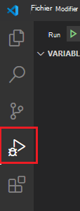

# <a name="debug-your-event-based-outlook-add-in-preview"></a>Déboguer votre Outlook d’événement (prévisualisation)

Cet article fournit des instructions de débogage lorsque vous implémentez l’activation basée sur des [événements](autolaunch.md) dans votre complément. La fonctionnalité d’activation basée sur des événements est actuellement en prévisualisation.

> [!IMPORTANT]
> Cette fonctionnalité de débogage est uniquement prise en charge pour la prévisualisation dans Outlook sur Windows avec un abonnement Microsoft 365'abonnement. Pour plus d’informations, voir la section [Débogage d’aperçu](#preview-debugging-for-the-event-based-activation-feature) pour la fonctionnalité d’activation basée sur des événements dans cet article.

Dans cet article, nous abordons les étapes clés pour activer le débogage.

- [Marquer le add-in pour le débogage](#mark-your-add-in-for-debugging)
- [Configurer Visual Studio Code](#configure-visual-studio-code)
- [Attacher les Visual Studio Code](#attach-visual-studio-code)
- [Debug](#debug)

Plusieurs options s’offrent à vous pour créer votre projet de add-in. En fonction de l’option que vous utilisez, les étapes peuvent varier. Si c’est le cas, si vous avez utilisé le générateur Yeoman pour les compléments Office pour créer votre projet de complément (par exemple, en  faisant la procédure pas à pas [d’activation](autolaunch.md)basée sur l’événement), suivez les étapes de **yo office,** sinon suivez les autres étapes. Visual Studio Code doit être au moins la version 1.56.1.

## <a name="preview-debugging-for-the-event-based-activation-feature"></a>Prévisualiser le débogage pour la fonctionnalité d’activation basée sur des événements

Nous vous invitons à tester la fonctionnalité de débogage pour la fonctionnalité d’activation basée sur des événements ! Faites-nous part de vos scénarios et de la façon dont nous pouvons les améliorer en nous faisant part de vos commentaires GitHub (voir la **section** Commentaires à la fin de cette page).

Pour prévisualiser cette fonctionnalité Outlook sur Windows, la version minimale requise est 16.0.13729.20000. Pour accéder à Office versions bêta, rejoignez [le programme Office Insider.](https://insider.office.com)

## <a name="mark-your-add-in-for-debugging"></a>Marquer votre add-in pour le débogage

1. Définissez la clé de `HKEY_CURRENT_USER\SOFTWARE\Microsoft\Office\16.0\Wef\Developer\[Add-in ID]\UseDirectDebugger` Registre. `[Add-in ID]` est **l’ID** dans le manifeste du add-in.

    **yo office**: dans une fenêtre de ligne de commande, accédez à la racine du dossier de votre add-in, puis exécutez la commande suivante.

    ```command&nbsp;line
    npm start
    ```

    Outre la création du code et le démarrage du serveur local, cette commande doit définir la clé de Registre pour `UseDirectDebugger` ce complément sur `1` .

    **Autre**: ajoutez la `UseDirectDebugger` clé de Registre sous `HKEY_CURRENT_USER\SOFTWARE\Microsoft\Office\16.0\WEF\Developer\[Add-in ID]\` . Remplacez `[Add-in ID]` par **l’ID** du manifeste du module. Définissez la clé de Registre sur `1` .

    [!include[Developer registry key](../includes/developer-registry-key.md)]

1. Démarrez Outlook bureau (ou redémarrez Outlook s’il est déjà ouvert).
1. Rédigez un nouveau message ou rendez-vous. Vous devriez voir la boîte de dialogue suivante. *N’interagissez* pas encore avec la boîte de dialogue.

    

## <a name="configure-visual-studio-code"></a>Configurer Visual Studio Code

### <a name="yo-office"></a>yo office

1. De retour dans la fenêtre de ligne de commande, ouvrez Visual Studio Code.

    ```command&nbsp;line
    code .
    ```

1. Dans Visual Studio Code, ouvrez le fichier **./.vscode/launch.js** et ajoutez l’extrait suivant à votre liste de configurations. Enregistrez vos modifications.

    ```json
    {
      "name": "Direct Debugging",
      "type": "node",
      "request": "attach",
      "port": 9229,
      "protocol": "inspector",
      "timeout": 600000,
      "trace": true
    }
    ```

### <a name="other"></a>Autres

1. Créez un dossier appelé **Débogage** (éventuellement dans votre **dossier Bureau).**
1. Ouvrez Visual Studio Code.
1. Accédez **à Dossier**  >  **d’ouverture de** fichier, accédez au dossier que vous avez créé, puis **sélectionnez Sélectionner un dossier.**
1. Dans la barre d’activité, sélectionnez **l’élément Débogage** (Ctrl+Shift+D).

    

1. Sélectionnez **créer une launch.jssur le lien de** fichier.

    

1. Dans la **dropdown Sélectionner un** environnement, **sélectionnez Edge : Lancer** pour créer une launch.jsfichier.
1. Ajoutez l’extrait suivant à votre liste de configurations. Enregistrez vos modifications.

    ```json
    {
      "name": "Direct Debugging",
      "type": "node",
      "request": "attach",
      "port": 9229,
      "protocol": "inspector",
      "timeout": 600000,
      "trace": true
    }
    ```

## <a name="attach-visual-studio-code"></a>Attacher les Visual Studio Code

1. Pour rechercher l’ID **dubundle.js,** ouvrez le dossier suivant dans l’Explorateur Windows et recherchez l’ID de votre Windows (trouvé dans le manifeste). 

    ```text
    %LOCALAPPDATA%\Microsoft\Office\16.0\Wef
    ```

    Ouvrez le dossier précédé de cet ID et copiez son chemin d’accès complet. Dans Visual Studio Code, ouvrez **bundle.js** à partir de ce dossier. Le modèle du chemin d’accès au fichier doit être le suivant :

    `%LOCALAPPDATA%\Microsoft\Office\16.0\Wef\{[Outlook profile GUID]}\[encoding]\Javascript\[Add-in ID]_[Add-in Version]_[locale]\bundle.js`

1. Placez les points d’arrêt bundle.js l’endroit où vous souhaitez que le débogger s’arrête.
1. Dans la **dropdown DEBUG,** sélectionnez le nom **Débogage** direct, puis sélectionnez **Exécuter**.

    

## <a name="debug"></a>Débogage

1. Après avoir confirmé que le déboguer est attaché, revenir  à Outlook, puis dans la boîte de dialogue de débogage basée sur l’événement, choisissez **OK** .

1. Vous pouvez désormais atteindre vos points d’arrêt dans Visual Studio Code, ce qui vous permet de déboguer votre code d’activation basé sur des événements.

## <a name="stop-debugging"></a>Arrêter le débogage

Pour arrêter le débogage pour le reste de la session de bureau Outlook en cours, dans la boîte de dialogue **Debug Event-based handler** ( Annuler ). Pour ré-activer le débogage, redémarrez Outlook bureau.

Pour empêcher que la boîte de dialogue du **handler** basé sur un événement de débogage s’insérable et arrêter le débogage pour les sessions Outlook suivantes, supprimez la clé de Registre associée ou définissez sa valeur sur : `0` `HKEY_CURRENT_USER\SOFTWARE\Microsoft\Office\16.0\Wef\Developer\[Add-in ID]\UseDirectDebugger` .

## <a name="see-also"></a>Voir aussi

- [Configurer votre complément Outlook pour l’activation basée sur des événements](autolaunch.md)
- [Déboguer votre complément avec la journalisation runtime](../testing/runtime-logging.md#runtime-logging-on-windows)
