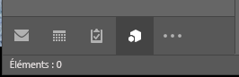
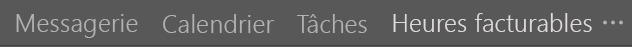
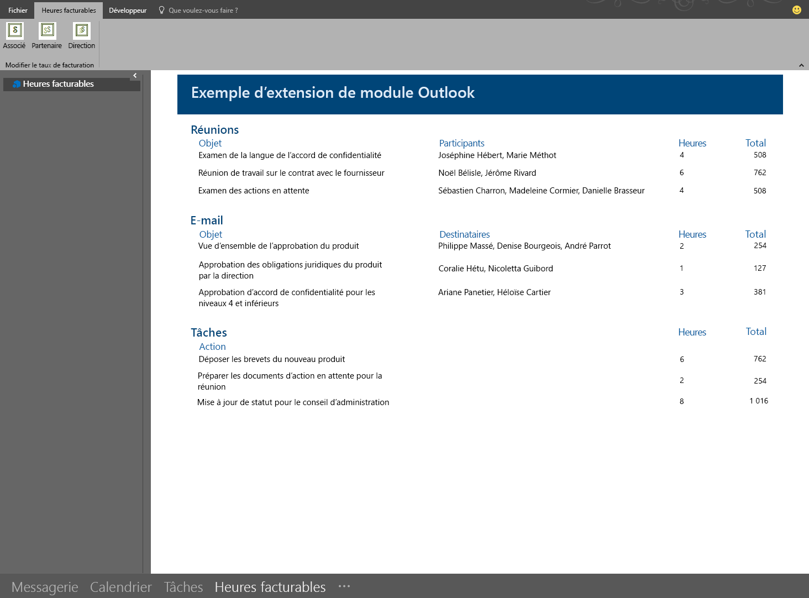

# <a name="module-extension-outlook-add-ins"></a>Compléments Outlook d’extension de module

Les compléments d’extension de module figurent dans la barre de navigation Outlook, en regard des onglets Courrier, Tâches et Calendriers. Une extension de module n’utilise pas seulement les informations de courrier et de rendez-vous. Vous pouvez créer des applications qui s’exécutent dans Outlook pour simplifier l’accès des utilisateurs aux outils d’informations professionnelles et de productivité sans quitter Outlook.

> [!NOTE]
> Les extensions de module sont uniquement prises en charge par Outlook 2016 ou version ultérieure sous Windows.  

## <a name="open-a-module-extension"></a>Ouvrir une extension de module

Pour ouvrir une extension de module, les utilisateurs doivent cliquer sur le nom ou l’icône du module dans la barre de navigation Outlook. Si la navigation compacte est sélectionnée, la barre de navigation affiche une icône indiquant qu’une extension est chargée.



Si l’utilisateur n’utilise pas la navigation compacte, la barre de navigation se présente de deux façons. Si une extension est chargée, elle affiche le nom du complément.



Lorsque plusieurs compléments sont chargés, elle affiche le mot **Compléments**. Si vous cliquez sur l’un ou l’autre, l’interface utilisateur de l’extension s’ouvre.


Lorsque vous cliquez sur une extension, Outlook remplace le module intégré par votre module personnalisé pour permettre aux utilisateurs d’interagir avec le complément. Vous pouvez utiliser toutes les fonctionnalités de l’interface API JavaScript pour Outlook dans votre complément et créer des boutons de commande dans le ruban Outlook pour interagir avec le contenu du complément. Les captures d’écran ci-dessous montrent un complément intégré dans la barre de navigation Outlook et comportant des commandes de ruban qui mettent à jour le contenu du complément.



## <a name="example"></a>Exemple

Vous trouverez ci-dessous une section d’un fichier de manifeste qui définit une extension de module.

```xml
<!-- Add Outlook module extension point -->
<VersionOverrides xmlns="http://schemas.microsoft.com/office/mailappversionoverrides"
                  xsi:type="VersionOverridesV1_0">
  <VersionOverrides xmlns="http://schemas.microsoft.com/office/mailappversionoverrides/1.1"
                    xsi:type="VersionOverridesV1_1">

    <!-- Begin override of existing elements -->
    <Description resid="residVersionOverrideDesc" />

    <Requirements>
      <bt:Sets DefaultMinVersion="1.3">
        <bt:Set Name="Mailbox" />
      </bt:Sets>
    </Requirements>
    <!-- End override of existing elements -->

    <Hosts>
      <Host xsi:type="MailHost">
        <DesktopFormFactor>
          <!-- Set the URL of the file that contains the
                JavaScript function that controls the extension -->
          <FunctionFile resid="residFunctionFileUrl" />

          <!--New Extension Point - Module for a ModuleApp -->
          <ExtensionPoint xsi:type="Module">
            <SourceLocation resid="residExtensionPointUrl" />
            <Label resid="residExtensionPointLabel" />

            <CommandSurface>
              <CustomTab id="idTab">
                <Group id="idGroup">
                  <Label resid="residGroupLabel" />

                  <Control xsi:type="Button" id="group.changeToAssociate">
                    <Label resid="residChangeToAssociateLabel" />
                    <Supertip>
                      <Title resid="residChangeToAssociateLabel" />
                      <Description resid="residChangeToAssociateDesc" />
                    </Supertip>
                    <Icon>
                      <bt:Image size="16" resid="residAssociateIcon16" />
                      <bt:Image size="32" resid="residAssociateIcon32" />
                      <bt:Image size="80" resid="residAssociateIcon80" />
                    </Icon>
                    <Action xsi:type="ExecuteFunction">
                      <FunctionName>changeToAssociateRate</FunctionName>
                    </Action>
                  </Control>
                  
              </Group>
                <Label resid="residCustomTabLabel" />
              </CustomTab>
            </CommandSurface>
          </ExtensionPoint>
        </DesktopFormFactor>
      </Host>
    </Hosts>

    <Resources>
      <bt:Images>
        <bt:Image id="residAddinIcon16" 
                  DefaultValue="https://localhost:8080/Executive-16.png" />
        <bt:Image id="residAddinIcon32" 
                  DefaultValue="https://localhost:8080/Executive-32.png" />
        <bt:Image id="residAddinIcon80" 
                  DefaultValue="https://localhost:8080/Executive-80.png" />
      
        <bt:Image id="residAssociateIcon16" 
                  DefaultValue="https://localhost:8080/Associate-16.png" />
        <bt:Image id="residAssociateIcon32" 
                  DefaultValue="https://localhost:8080/Associate-32.png" />
        <bt:Image id="residAssociateIcon80" 
                  DefaultValue="https://localhost:8080/Associate-80.png" />
      </bt:Images>

      <bt:Urls>
        <bt:Url id="residFunctionFileUrl" 
                DefaultValue="https://localhost:8080/" />
        <bt:Url id="residExtensionPointUrl" 
                DefaultValue="https://localhost:8080/" />
      </bt:Urls>

      <!--Short strings must be less than 30 characters long -->
      <bt:ShortStrings>
        <bt:String id="residExtensionPointLabel" 
                    DefaultValue="Billable Hours" />
        <bt:String id="residGroupLabel" 
                    DefaultValue="Change billing rate" />
        <bt:String id="residCustomTabLabel" 
                    DefaultValue="Billable hours" />

        <bt:String id="residChangeToAssociateLabel" 
                    DefaultValue="Associate" />
      </bt:ShortStrings>

      <bt:LongStrings>
        <bt:String id="residVersionOverrideDesc" 
                    DefaultValue="Version override description" />

        <bt:String id="residChangeToAssociateDesc" 
                    DefaultValue="Change to the associate billing rate: $127/hr" />
      </bt:LongStrings>
    </Resources>
  </VersionOverrides>
</VersionOverrides>
```

## <a name="see-also"></a>Voir aussi

- [Manifestes de complément Outlook](manifests.md)
- [Commandes de complément pour Outlook](add-in-commands-for-outlook.md)
- [Exemple d’heures facturables d’extensions de module Outlook](https://github.com/OfficeDev/Outlook-Add-in-JavaScript-ModuleExtension)
