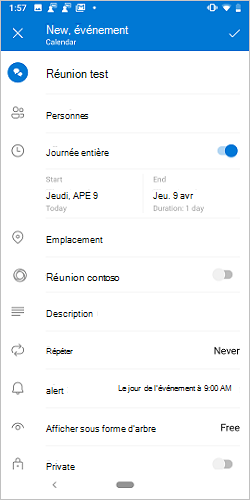
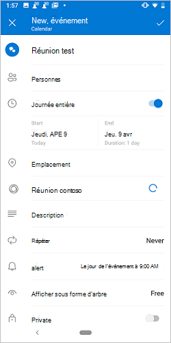
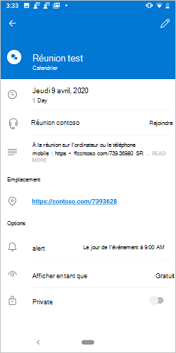

# <a name="create-an-outlook-mobile-add-in-for-an-online-meeting-provider"></a>Créer un complément Outlook Mobile pour un fournisseur de réunion en ligne

La configuration d’une réunion en ligne est une expérience de base pour un utilisateur d’Outlook, et il est facile de [créer une réunion teams avec Outlook](/microsoftteams/teams-add-in-for-outlook) mobile. Toutefois, la création d’une réunion en ligne dans Outlook avec un service non-Microsoft peut être lourde. En implémentant cette fonctionnalité, les fournisseurs de services peuvent rationaliser l’expérience de création des réunions en ligne pour leurs utilisateurs des compléments Outlook.

> [!IMPORTANT]
> Cette fonctionnalité est uniquement prise en charge sur Android avec un abonnement Office 365.

Dans cet article, vous apprendrez à configurer votre complément Outlook Mobile pour permettre aux utilisateurs d’organiser et de participer à une réunion à l’aide de votre service de réunion en ligne. Tout au long de cet article, nous allons utiliser un fournisseur de services de réunion en ligne fictif, « contoso ».

## <a name="set-up-your-environment"></a>Configuration de votre environnement

Terminez le [démarrage rapide Outlook](../quickstarts/outlook-quickstart.md?tabs=yeomangenerator) qui crée un projet de complément avec le générateur Yeoman pour les compléments Office.

## <a name="configure-the-manifest"></a>Configurer le manifeste

Pour permettre aux utilisateurs de créer des réunions en ligne avec votre complément, vous devez configurer le `MobileOnlineMeetingCommandSurface` point d’extension dans le manifeste sous l’élément parent `MobileFormFactor` . Les autres facteurs de forme ne sont pas pris en charge.

1. Dans votre éditeur de code, ouvrez le projet Quick Start.

1. Ouvrez le fichier **manifest.xml** situé à la racine de votre projet.

1. Sélectionnez le `<VersionOverrides>` nœud entier (y compris les balises ouvrantes et fermantes) et remplacez-le par le code XML suivant.

```xml
<VersionOverrides xmlns="http://schemas.microsoft.com/office/mailappversionoverrides" xsi:type="VersionOverridesV1_0">
  <VersionOverrides xmlns="http://schemas.microsoft.com/office/mailappversionoverrides/1.1" xsi:type="VersionOverridesV1_1">
    <Description resid="residDescription"></Description>
    <Requirements>
      <bt:Sets>
        <bt:Set Name="Mailbox" MinVersion="1.3"/>
      </bt:Sets>
    </Requirements>
    <Hosts>
      <Host xsi:type="MailHost">
        <DesktopFormFactor>
          <FunctionFile resid="residFunctionFile"/>
          <ExtensionPoint xsi:type="AppointmentOrganizerCommandSurface">
            <OfficeTab id="TabDefault">
              <Group id="apptComposeGroup">
                <Label resid="residDescription"/>
                <Control xsi:type="Button" id="insertMeetingButton">
                  <Label resid="residLabel"/>
                  <Supertip>
                    <Title resid="residLabel"/>
                    <Description resid="residTooltip"/>
                  </Supertip>
                  <Icon>
                    <bt:Image size="16" resid="icon-16"/>
                    <bt:Image size="32" resid="icon-32"/>
                    <bt:Image size="64" resid="icon-64"/>
                    <bt:Image size="80" resid="icon-80"/>
                  </Icon>
                  <Action xsi:type="ExecuteFunction">
                    <FunctionName>insertContosoMeeting</FunctionName>
                  </Action>
                </Control>
              </Group>
            </OfficeTab>
          </ExtensionPoint>
        </DesktopFormFactor>

        <MobileFormFactor>
          <FunctionFile resid="residFunctionFile"/>
          <ExtensionPoint xsi:type="MobileOnlineMeetingCommandSurface">
            <Control xsi:type="MobileButton" id="insertMeetingButton">
              <Label resid="residLabel"/>
              <Icon>
                <bt:Image size="25" scale="1" resid="icon-16"/>
                <bt:Image size="25" scale="2" resid="icon-16"/>
                <bt:Image size="25" scale="3" resid="icon-16"/>

                <bt:Image size="32" scale="1" resid="icon-32"/>
                <bt:Image size="32" scale="2" resid="icon-32"/>
                <bt:Image size="32" scale="3" resid="icon-32"/>

                <bt:Image size="48" scale="1" resid="icon-48"/>
                <bt:Image size="48" scale="2" resid="icon-48"/>
                <bt:Image size="48" scale="3" resid="icon-48"/>
              </Icon>
              <Action xsi:type="ExecuteFunction">
                <FunctionName>insertContosoMeeting</FunctionName>
              </Action>
            </Control>
          </ExtensionPoint>
        </MobileFormFactor>
      </Host>
    </Hosts>
    <Resources>
      <bt:Images>
        <bt:Image id="icon-16" DefaultValue="https://contoso.com/assets/icon-16.png"/>
        <bt:Image id="icon-32" DefaultValue="https://contoso.com/assets/icon-32.png"/>
        <bt:Image id="icon-48" DefaultValue="https://contoso.com/assets/icon-48.png"/>
        <bt:Image id="icon-64" DefaultValue="https://contoso.com/assets/icon-64.png"/>
        <bt:Image id="icon-80" DefaultValue="https://contoso.com/assets/icon-80.png"/>
      </bt:Images>
      <bt:Urls>
        <bt:Url id="residFunctionFile" DefaultValue="https://contoso.com/commands.html"/>
      </bt:Urls>
      <bt:ShortStrings>
        <bt:String id="residDescription" DefaultValue="Contoso meeting"/>
        <bt:String id="residLabel" DefaultValue="Add a contoso meeting"/>
      </bt:ShortStrings>
      <bt:LongStrings>
        <bt:String id="residTooltip" DefaultValue="Add a contoso meeting to this appointment."/>
      </bt:LongStrings>
    </Resources>
  </VersionOverrides>
</VersionOverrides>
```

> [!TIP]
> Pour en savoir plus sur les manifestes pour les compléments Outlook, consultez la rubrique [manifestes des compléments Outlook](manifests.md) et [Ajouter la prise en charge des commandes de complément pour Outlook Mobile](add-mobile-support.md).

## <a name="implement-adding-online-meeting-details"></a>Implémenter l’ajout des détails de la réunion en ligne

Dans cette section, Découvrez comment votre script de complément peut mettre à jour la réunion d’un utilisateur pour inclure les détails de la réunion en ligne.

1. À partir du même projet de démarrage rapide, ouvrez le fichier **./src/commands/commands.js** dans votre éditeur de code.

1. Remplacez l’intégralité du contenu du fichier **commands.js** par le code JavaScript suivant.

    ```js
    // 1. How to construct online meeting details.
    // Not shown: How to get the meeting organizer's ID and other details from your service.
    const newBody = '<br>' +
        '<a href="https://contoso.com/meeting?id=123456789" target="_blank">Join Contoso meeting</a>' +
        '<br><br>' +
        'Phone Dial-in: +1(123)456-7890' +
        '<br><br>' +
        'Meeting ID: 123 456 789' +
        '<br><br>' +
        'Want to test your video connection?' +
        '<br><br>' +
        '<a href="https://contoso.com/testmeeting" target="_blank">Join test meeting</a>' +
        '<br><br>';

    var mailboxItem;

    // Office is ready.
    Office.onReady(function () {
            mailboxItem = Office.context.mailbox.item;
        }
    );

    // 2. How to define a UI-less function named `insertContosoMeeting` (referenced in the manifest)
    //    to update the meeting body with the online meeting details.
    function insertContosoMeeting(event) {
        // Get HTML body from the client.
        mailboxItem.body.getAsync("html",
            { asyncContext: event },
            function (getBodyResult) {
                if (getBodyResult.status === Office.AsyncResultStatus.Succeeded) {
                    updateBody(getBodyResult.asyncContext, getBodyResult.value);
                } else {
                    console.error("Failed to get HTML body.");
                    getBodyResult.asyncContext.completed({ allowEvent: false });
                }
            }
        );
    }

    // 3. How to implement a supporting function `updateBody`
    //    that appends the online meeting details to the current body of the meeting.
    function updateBody(event, existingBody) {
        // Append new body to the existing body.
        mailboxItem.body.setAsync(existingBody + newBody,
            { asyncContext: event, coercionType: "html" },
            function (setBodyResult) {
                if (setBodyResult.status === Office.AsyncResultStatus.Succeeded) {
                    setBodyResult.asyncContext.completed({ allowEvent: true });
                } else {
                    console.error("Failed to set HTML body.");
                    setBodyResult.asyncContext.completed({ allowEvent: false });
                }
            }
        );
    }

    function getGlobal() {
      return typeof self !== "undefined"
        ? self
        : typeof window !== "undefined"
        ? window
        : typeof global !== "undefined"
        ? global
        : undefined;
    }

    const g = getGlobal();

    // The add-in command functions need to be available in global scope.
    g.insertContosoMeeting = insertContosoMeeting;
    ```

## <a name="testing-and-validation"></a>Test et validation

Suivez les instructions habituelles pour [tester et valider votre complément](testing-and-tips.md). Après avoir [chargement](sideload-outlook-add-ins-for-testing.md) dans Outlook sur le Web, Windows ou Mac, redémarrez Outlook sur votre appareil mobile Android. (Android est le seul client pris en charge pour le moment.) Ensuite, dans un nouvel écran de réunion, vérifiez que le bouton bascule Microsoft teams ou Skype est remplacé par le vôtre.

### <a name="create-meeting-ui"></a>Créer une interface utilisateur de réunion

En tant qu’organisateur de la réunion, vous devez voir des écrans semblables aux trois images suivantes lors de la création d’une réunion.

[ ](../images/outlook-android-create-online-meeting-off-expanded.png#lightbox) la [ ](../images/outlook-android-create-online-meeting-load-expanded.png#lightbox) [ ](../images/outlook-android-create-online-meeting-on-expanded.png#lightbox) /désactiver

### <a name="join-meeting-ui"></a>Interface utilisateur joindre une réunion

En tant que participant à la réunion, vous devriez voir un écran semblable à l’image suivante lorsque vous affichez la réunion.

[](../images/outlook-android-join-online-meeting-view-1-expanded.png#lightbox)

> [!IMPORTANT]
> Si vous ne voyez pas le lien **joindre** , il se peut que le modèle de réunion en ligne pour votre service ne soit pas enregistré sur nos serveurs. Pour plus d’informations, consultez la section [enregistrer votre modèle de réunion en ligne](#register-your-online-meeting-template) .

## <a name="register-your-online-meeting-template"></a>Enregistrer votre modèle de réunion en ligne

Si vous souhaitez enregistrer le modèle de réunion en ligne pour votre service, vous pouvez créer un problème GitHub avec les détails. Ensuite, nous vous contacterons pour coordonner la chronologie de l’inscription.

1. Accédez à la section **Commentaires** à la fin de cet article.
1. Appuyez sur le lien **cette page** .
1. Définissez le **titre** du nouveau problème sur « enregistrer le modèle de réunion en ligne pour mon-service » en `my-service` le remplaçant par le nom de votre service.
1. Dans le corps du problème, remplacez la chaîne « [Entrez une évaluation ici] » par la chaîne que vous avez définie dans la `newBody` variable ou similaire de la section [implémenter l’ajout en ligne des détails](#implement-adding-online-meeting-details) de la réunion plus haut dans cet article.
1. Cliquez sur **Submit New issue**.


## <a name="available-apis"></a>API disponibles

Les API suivantes sont disponibles pour cette fonctionnalité.

- API d’organisateur de rendez-vous
  - [Office. Context. Mailbox. Item. Subject](/javascript/api/outlook/office.appointmentcompose?view=outlook-js-preview#subject) ([Subject](/javascript/api/outlook/office.subject?view=outlook-js-preview))
  - [Office. Context. Mailbox. Item. Start](/javascript/api/outlook/office.appointmentcompose?view=outlook-js-preview#start) ([Time](/javascript/api/outlook/office.time?view=outlook-js-preview))
  - [Office. Context. Mailbox. Item. end](/javascript/api/outlook/office.appointmentcompose?view=outlook-js-preview#end) ([heure](/javascript/api/outlook/office.time?view=outlook-js-preview))
  - [Office. Context. Mailbox. Item. Location](/javascript/api/outlook/office.appointmentcompose?view=outlook-js-preview#location) ([emplacement](/javascript/api/outlook/office.location?view=outlook-js-preview))
  - [Office. Context. Mailbox. Item. optionalAttendees](/javascript/api/outlook/office.appointmentcompose?view=outlook-js-preview#optionalattendees) ([Recipients](/javascript/api/outlook/office.recipients?view=outlook-js-preview))
  - [Office. Context. Mailbox. Item. requiredAttendees](/javascript/api/outlook/office.appointmentcompose?view=outlook-js-preview#requiredattendees) ([Recipients](/javascript/api/outlook/office.recipients?view=outlook-js-preview))
  - [Office. Context. Mailbox. Item. Body](/javascript/api/outlook/office.appointmentcompose?view=outlook-js-preview#body) ([Body. getAsync](/javascript/api/outlook/office.body?view=outlook-js-preview#getasync-coerciontype--options--callback-), [Body. setAsync](/javascript/api/outlook/office.body?view=outlook-js-preview#setasync-data--options--callback-))
  - [Office. Context. Mailbox. Item. loadCustomPropertiesAsync](/javascript/api/outlook/office.appointmentcompose?view=outlook-js-preview#loadcustompropertiesasync-callback--usercontext-) ([CustomProperties](/javascript/api/outlook/office.customproperties?view=outlook-js-preview))
  - [Office. Context. roamingSettings](../reference/objectmodel/preview-requirement-set/office.context.md?view=outlook-js-preview#roamingsettings-roamingsettings) ([roamingSettings](/javascript/api/outlook/office.roamingsettings?view=outlook-js-preview))
- Gérer le flux d’authentification
  - [API de boîte de dialogue](../develop/dialog-api-in-office-add-ins.md)

## <a name="restrictions"></a>Restrictions

Plusieurs restrictions s’appliquent.

- Applicable uniquement aux fournisseurs de service de réunion en ligne.
- À présent, Android est le seul client pris en charge. Le support sur iOS sera bientôt disponible.
- Seuls les compléments installés par l’administrateur apparaissent sur l’écran de composition de la réunion et remplacent l’option teams ou Skype par défaut. Les compléments installés par l’utilisateur ne peuvent pas être activés.
- L’icône du complément doit être en nuances de gris à l’aide de code hexadécimal `#919191` ou de son équivalent dans d' [autres formats de couleur](https://convertingcolors.com/hex-color-919191.html).
- Une seule commande sans interface utilisateur est prise en charge dans le mode organisateur de rendez-vous (composition).

## <a name="see-also"></a>Voir aussi

- [Compléments pour Outlook Mobile](outlook-mobile-addins.md)
- [Ajouter la prise en charge des commandes de complément pour Outlook Mobile](add-mobile-support.md)
