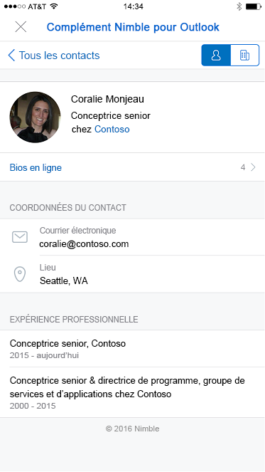

# Compléments pour Outlook Mobile

Les compléments fonctionnent désormais sur Outlook Mobile, avec les mêmes API que celles disponibles pour d’autres points de terminaison Outlook. Si vous avez déjà créé un complément pour Outlook, il est facile de le faire fonctionner sur Outlook Mobile.

Les compléments mobiles Outlook sont pris en charge sur tous les comptes d’entreprise Microsoft 365 et les comptes Outlook.com. Toutefois, la prise en charge n’est actuellement pas disponible sur les comptes Gmail.

**Exemple de volet Office dans Outlook sur iOS**

 

**Exemple de volet Office dans Outlook sur Android**

## Qu’est-ce qui est différent sur mobile ?

- La taille réduite et la rapidité des interactions compliquent la conception pour les environnements mobiles. Pour garantir la qualité des expériences pour nos clients, nous définissons des critères de validation stricts qui doivent être respectés par un complément qui déclare prendre en charge les environnements mobiles pour être approuvé dans AppSource.
  - Le complément **DOIT** respecter les [instructions concernant l’interface utilisateur](outlook-addin-design.md).
  - Le scénario du complément **DOIT** [être pertinent sur mobile](#what-makes-a-good-scenario-for-mobile-add-ins).

- En général, seul le mode lecture des messages est pris en charge pour l’instant. Cela signifie qu’il `MobileMessageReadCommandSurface` s’agit du seul [Point d’extension](/javascript/api/manifest/extensionpoint#mobilemessagereadcommandsurface) que vous devez déclarer dans la section mobile de votre manifeste. Toutefois, il existe quelques exceptions :
  1. Le mode Organisateur de rendez-vous est pris en charge pour les compléments intégrés du fournisseur de réunion en ligne qui déclarent à la place le [point d’extension MobileOnlineMeetingCommandSurface](/javascript/api/manifest/extensionpoint#mobileonlinemeetingcommandsurface). Pour plus d’informations sur ce scénario, consultez l’article [Créer un complément mobile Outlook pour un fournisseur de réunions en ligne](online-meeting.md) .
  1. Le mode Participant au rendez-vous est pris en charge pour les compléments intégrés créés par les fournisseurs d’applications CRM (Customer Relationship Management). Ces compléments doivent à la place déclarer le [point d’extension MobileLogEventAppointmentAttendee](/javascript/api/manifest/extensionpoint#mobilelogeventappointmentattendee). Pour plus d’informations sur ce scénario, consultez les [notes de rendez-vous du journal d’une application externe dans les compléments mobiles Outlook](mobile-log-appointments.md) .

- L’API [makeEwsRequestAsync](/javascript/api/requirement-sets/outlook/preview-requirement-set/office.context.mailbox#methods) n’est pas prise en charge sur mobile dans la mesure où l’application mobile utilise les API REST pour communiquer avec le serveur. Si le serveur principal de votre application doit se connecter au serveur Exchange, vous pouvez utiliser le jeton de rappel pour émettre des appels d’API REST. Pour plus d’informations, voir [Utilisation des API REST Outlook à partir d’un complément Outlook](use-rest-api.md).

- Lorsque vous soumettez votre complément dans le magasin avec l’élément [MobileFormFactor](/javascript/api/manifest/mobileformfactor) dans le manifeste, vous devez accepter notre addendum pour les développeurs de compléments sur iOS, et envoyer votre ID de développeur Apple pour vérification.

- Enfin, votre manifeste devra déclarer l’élément `MobileFormFactor`, et inclure les types de [contrôles](/javascript/api/manifest/control) et de [tailles d’icône](/javascript/api/manifest/icon) corrects.

## Qu’est-ce qu’un bon scénario pour les compléments mobiles ?

N’oubliez pas que la durée moyenne d’une session Outlook sur un téléphone est beaucoup plus courte que sur un PC. Cela signifie que votre complément doit être rapide et que le scénario doit permettre à l’utilisateur d’accéder à votre complément, d’en sortir et de traiter ses messages.

Voici quelques exemples de scénarios pertinents dans Outlook Mobile.

- Le complément apporte des informations précieuses dans Outlook et aide les utilisateurs à trier leurs messages et à y répondre correctement. Exemple : un complément CRM qui permet à l’utilisateur de voir les informations client et de partager des informations appropriées.

- Le complément apporte de la valeur ajoutée au contenu des messages de l’utilisateur en enregistrant les informations dans un système de suivi, de collaboration ou de type similaire. Exemple : un complément qui permet aux utilisateurs de transformer les messages électroniques en tâches afin de suivre des projets ou en demandes d’aide pour une équipe de support technique.

**Exemple d’interaction utilisateur pour créer une carte Trello à partir d’un message électronique sur iOS**

 

**Exemple d’interaction utilisateur pour créer une carte Trello à partir d’un message électronique sur Android**

## Test de vos compléments sur mobile

Pour tester un complément sur Outlook Mobile, [commencez par charger un complément](sideload-outlook-add-ins-for-testing.md) sur un compte Microsoft 365 ou Outlook.com sur le web, Windows ou Mac. Assurez-vous que votre manifeste est correctement mis en forme pour contenir `MobileFormFactor` ou qu’il ne se charge pas dans votre client Outlook sur mobile.

Une fois que votre complément fonctionne, testez-le sur différentes tailles d’écran, y compris sur des téléphones et des tablettes. Vous devez vous assurer qu’il respecte les instructions d’accessibilité en matière de contraste, de taille de police et de couleur, et qu’il peut être utilisé avec un lecteur d’écran comme VoiceOver sur iOS ou TalkBack sur Android.

La résolution des problèmes sur les appareils mobiles peut être difficile, car vous n’avez peut-être pas les outils auxquels vous êtes habitué. Toutefois, une option de résolution des problèmes sur iOS consiste à utiliser Fiddler (consultez [ce tutoriel sur son utilisation avec un appareil iOS](https://www.telerik.com/blogs/using-fiddler-with-apple-ios-devices)).

> [!NOTE]
> Les Outlook sur le web modernes sur les smartphones iPhone et Android ne sont plus nécessaires ni disponibles pour tester les compléments Outlook. En outre, les compléments ne sont pas pris en charge dans Outlook sur Android, sur iOS et le web mobile moderne avec des comptes Exchange locaux. Certains appareils iOS prennent toujours en charge les compléments lors de l’utilisation de comptes Exchange locaux avec des Outlook sur le web classiques. Pour plus d’informations sur les appareils pris en charge, consultez [Configuration requise pour l’exécution des compléments Office](../concepts/requirements-for-running-office-add-ins.md#client-requirements-non-windows-smartphone-and-tablet).

## Étapes suivantes

Découvrez comment :

- [ajouter la prise en charge mobile au manifeste de votre complément](add-mobile-support.md),
- [concevoir une expérience mobile exceptionnelle pour votre complément](outlook-addin-design.md),
- [obtenir un jeton d’accès et appeler des API REST Outlook](use-rest-api.md) à partir de votre complément.
