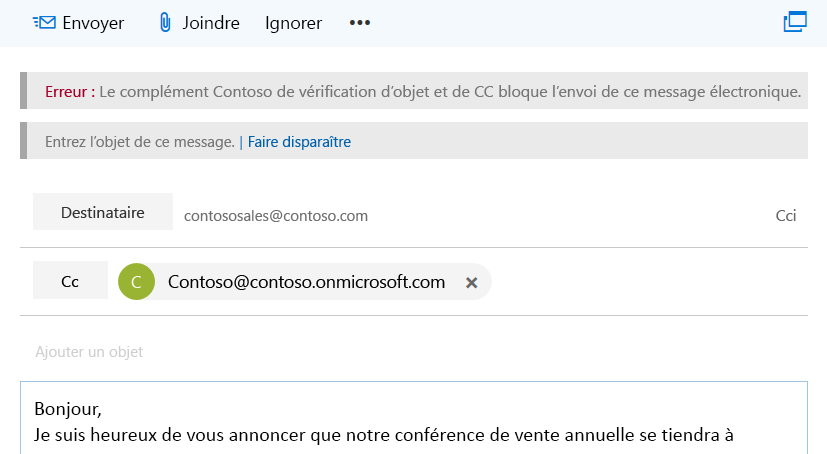
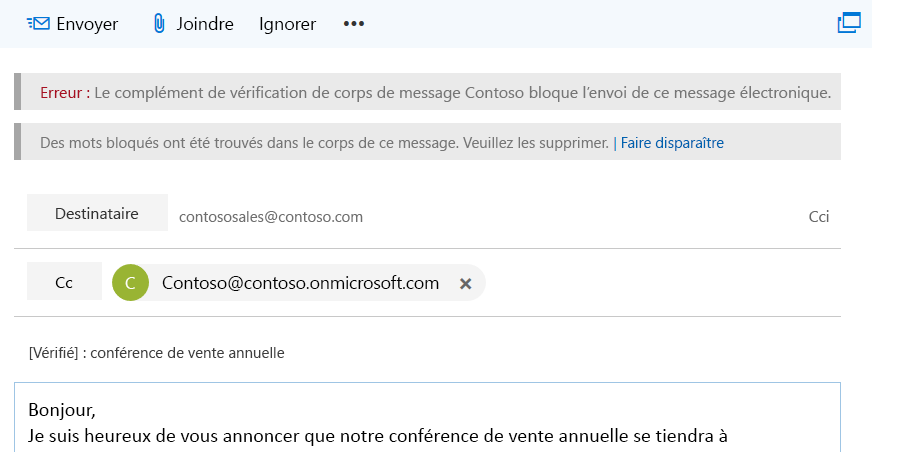

# <a name="on-send-feature-for-outlook-add-ins"></a><span data-ttu-id="c86e9-103">Fonctionnalité d’envoi des compléments Outlook</span><span class="sxs-lookup"><span data-stu-id="c86e9-103">On-send feature for Outlook add-ins</span></span>

<span data-ttu-id="c86e9-p101">La fonctionnalité d’envoi des compléments Outlook vous permet de traiter un élément de message ou réunion, ou d’empêcher les utilisateurs d’effectuer certaines actions. Elle permet aussi aux compléments de définir certaines propriétés pendant l’envoi. Par exemple, vous pouvez utiliser la fonctionnalité d’envoi pour :</span><span class="sxs-lookup"><span data-stu-id="c86e9-p101">The on-send feature for Outlook add-ins provides a way to handle a message or meeting item, or block users from certain actions, and allows an add-in to set certain properties on send. For example, you can use the on-send feature to:</span></span>

- <span data-ttu-id="c86e9-106">Empêcher un utilisateur d’envoyer des informations sensibles ou de laisser la ligne d’objet vide.</span><span class="sxs-lookup"><span data-stu-id="c86e9-106">Prevent a user from sending sensitive information or leaving the subject line blank.</span></span>  
- <span data-ttu-id="c86e9-107">Ajouter un destinataire spécifique à la ligne CC dans les messages ou à la ligne destinataires facultatifs des réunions.</span><span class="sxs-lookup"><span data-stu-id="c86e9-107">Add a specific recipient to the CC line in messages, or to the optional recipients line in meetings.</span></span>

> [!NOTE]
> <span data-ttu-id="c86e9-108">La fonctionnalité d’envoi est prise en charge pour Outlook sur le web dans Exchange Online (Office 365), Exchange 2016 en local (mise à jour cumulative 6 ou ultérieure) et Exchange 2019 en local (mise à jour cumulative 1 ou ultérieure).</span><span class="sxs-lookup"><span data-stu-id="c86e9-108">The on-send feature is currently supported for Outlook on the web in Exchange Online (Office 365), Exchange 2016 on-premises (Cumulative Update 6 or later), and Exchange 2019 on-premises (Cumulative Update 1 or later).</span></span> <span data-ttu-id="c86e9-109">Cette fonctionnalité est également disponible dans les derniers builds Outlook sur Windows et Mac connectés à Exchange Online (Office 365).</span><span class="sxs-lookup"><span data-stu-id="c86e9-109">This feature is also available in the latest Outlook builds on Windows and Mac, connected to Exchange Online (Office 365).</span></span> <span data-ttu-id="c86e9-110">La fonctionnalité a été introduite dans l’ensemble de conditions requises 1,8 (pour plus d’informations, consultez la rubrique [Current Server and client support](../reference/requirement-sets/outlook-api-requirement-sets.md#requirement-sets-supported-by-exchange-servers-and-outlook-clients) ).</span><span class="sxs-lookup"><span data-stu-id="c86e9-110">The feature was introduced in requirement set 1.8 (see [current server and client support](../reference/requirement-sets/outlook-api-requirement-sets.md#requirement-sets-supported-by-exchange-servers-and-outlook-clients) for details).</span></span>

> [!IMPORTANT]
> <span data-ttu-id="c86e9-111">Les compléments qui utilisent la fonctionnalité d’envoi ne sont pas autorisés dans [AppSource](https://appsource.microsoft.com).</span><span class="sxs-lookup"><span data-stu-id="c86e9-111">Add-ins that use the on-send feature aren't allowed in [AppSource](https://appsource.microsoft.com).</span></span>

<span data-ttu-id="c86e9-112">La fonctionnalité d’envoi est déclenchée par le type d’événement `ItemSend` et est sans interface utilisateur.</span><span class="sxs-lookup"><span data-stu-id="c86e9-112">The on-send feature is triggered by the `ItemSend` event type and is UI-less.</span></span>

<span data-ttu-id="c86e9-113">Pour en savoir plus sur les limites de la fonctionnalité d’envoi, consultez la section [Limites](#limitations) plus loin dans cet article.</span><span class="sxs-lookup"><span data-stu-id="c86e9-113">For information about limitations related to the on-send feature, see [Limitations](#limitations) later in this article.</span></span>

## <a name="how-does-the-on-send-feature-work"></a><span data-ttu-id="c86e9-114">Comment marche la fonctionnalité d’envoi ?</span><span class="sxs-lookup"><span data-stu-id="c86e9-114">How does the on-send feature work?</span></span>

<span data-ttu-id="c86e9-115">Vous pouvez utiliser la fonctionnalité d’envoi pour créer un complément Outlook qui intègre l’événement synchrone `ItemSend`.</span><span class="sxs-lookup"><span data-stu-id="c86e9-115">You can use the on-send feature to build an Outlook add-in that integrates the `ItemSend` synchronous event.</span></span> <span data-ttu-id="c86e9-116">Cet événement détecte le moment où l’utilisateur clique sur le bouton **Envoyer**(ou le bouton **Envoyer mise à jour** pour les réunions existantes) et peut servir à bloquer l’envoi de l’élément s’il n’est pas validé.</span><span class="sxs-lookup"><span data-stu-id="c86e9-116">This event detects that the user is pressing the **Send** button (or the **Send Update** button for existing meetings) and can be used to block the item from sending if the validation fails.</span></span> <span data-ttu-id="c86e9-117">Par exemple, quand un utilisateur déclenche un événement d’envoi de message, un complément Outlook qui utilise la fonctionnalité d’envoi peut :</span><span class="sxs-lookup"><span data-stu-id="c86e9-117">For example, when a user triggers a message send event, an Outlook add-in that uses the on-send feature can:</span></span>

- <span data-ttu-id="c86e9-118">Lire et valider le contenu du message</span><span class="sxs-lookup"><span data-stu-id="c86e9-118">Read and validate the email message contents</span></span>
- <span data-ttu-id="c86e9-119">Vérifier que la ligne d’objet du message est remplie</span><span class="sxs-lookup"><span data-stu-id="c86e9-119">Verify that the message includes a subject line</span></span>
- <span data-ttu-id="c86e9-120">Définir un destinataire prédéterminé</span><span class="sxs-lookup"><span data-stu-id="c86e9-120">Set a predetermined recipient</span></span>

<span data-ttu-id="c86e9-121">La validation est effectuée côté client dans Outlook lorsque l’événement Send est déclenché, et le complément dispose d’un maximum de 5 minutes avant que celui-ci n’expire. Si la validation échoue, l’envoi de l’élément est bloqué et un message d’erreur s’affiche dans une barre d’informations qui invite l’utilisateur à agir.</span><span class="sxs-lookup"><span data-stu-id="c86e9-121">Validation is done on the client side in Outlook when the send event is triggered, and the add-in has up to 5 minutes before it times out. If validation fails, the sending of the item is blocked, and an error message is displayed in an information bar that prompts the user to take action.</span></span>

<span data-ttu-id="c86e9-122">La capture d’écran suivante montre une barre d’informations invitant l’expéditeur à renseigner l’objet du message.</span><span class="sxs-lookup"><span data-stu-id="c86e9-122">The following screenshot shows an information bar that notifies the sender to add a subject.</span></span>

<br/>



<br/>

<br/>

<span data-ttu-id="c86e9-124">La capture d’écran suivante montre une barre d’informations informant l’expéditeur que des mots bloqués ont été trouvés.</span><span class="sxs-lookup"><span data-stu-id="c86e9-124">The following screenshot shows an information bar that notifies the sender that blocked words were found.</span></span>

<br/>



## <a name="limitations"></a><span data-ttu-id="c86e9-126">Limites</span><span class="sxs-lookup"><span data-stu-id="c86e9-126">Limitations</span></span>

<span data-ttu-id="c86e9-127">Les limites de la fonctionnalité d’envoi sont les suivantes.</span><span class="sxs-lookup"><span data-stu-id="c86e9-127">The on-send feature currently has the following limitations.</span></span>

- <span data-ttu-id="c86e9-128">**AppSource** &ndash; Vous ne pouvez pas publier de compléments Outlook qui utilisent la fonctionnalité d’envoi sur [AppSource](https://appsource.microsoft.com). car ils ne seront pas validés par AppSource.</span><span class="sxs-lookup"><span data-stu-id="c86e9-128">**AppSource** &ndash; You can't publish Outlook add-ins that use the on-send feature to [AppSource](https://appsource.microsoft.com) as they will fail AppSource validation.</span></span> <span data-ttu-id="c86e9-129">Les compléments qui utilisent la fonctionnalité d’envoi doivent être déployés par les administrateurs.</span><span class="sxs-lookup"><span data-stu-id="c86e9-129">Add-ins that use the on-send feature should be deployed by administrators.</span></span>
- <span data-ttu-id="c86e9-130">**Manifeste** &ndash; Le complément prend en charge un seul événement `ItemSend`.</span><span class="sxs-lookup"><span data-stu-id="c86e9-130">**Manifest** &ndash; Only one `ItemSend` event is supported per add-in.</span></span> <span data-ttu-id="c86e9-131">Si votre manifeste comprend plusieurs événements `ItemSend`, il ne sera pas validé.</span><span class="sxs-lookup"><span data-stu-id="c86e9-131">If you have two or more `ItemSend` events in a manifest, the manifest will fail validation.</span></span>
- <span data-ttu-id="c86e9-p106">**Performances**&ndash; : plusieurs allers-retours vers le serveur web hébergeant le complément peuvent nuire aux performances du complément. Imaginez alors ce qu’occasionnerait la création de compléments nécessitant plusieurs opérations de messagerie ou réunions.</span><span class="sxs-lookup"><span data-stu-id="c86e9-p106">**Performance** &ndash; Multiple roundtrips to the web server that hosts the add-in can affect the performance of the add-in. Consider the effects on performance when you create add-ins that require multiple message- or meeting-based operations.</span></span>
- <span data-ttu-id="c86e9-134">**Envoyer plus tard** (Mac uniquement) &ndash; S’il y a des compléments d’envoi, la fonctionnalité **Envoyer plus tard** n’est pas disponible.</span><span class="sxs-lookup"><span data-stu-id="c86e9-134">**Send Later** (Mac only) &ndash; If there are on-send add-ins, the **Send Later** feature will be unavailable.</span></span>

### <a name="mailbox-typemode-limitations"></a><span data-ttu-id="c86e9-135">Limites concernant le type ou le mode de boîte aux lettres</span><span class="sxs-lookup"><span data-stu-id="c86e9-135">Mailbox type/mode limitations</span></span>

<span data-ttu-id="c86e9-136">La fonctionnalité d’envoi est uniquement prise en charge pour les boîtes aux lettres utilisateur dans Outlook sur le web, sur Windows et sur Mac.</span><span class="sxs-lookup"><span data-stu-id="c86e9-136">On-send functionality is only supported for user mailboxes in Outlook on the web, Windows, and Mac.</span></span> <span data-ttu-id="c86e9-137">La fonctionnalité n’est pas prise en charge pour les types et modes de boîte aux lettres suivants.</span><span class="sxs-lookup"><span data-stu-id="c86e9-137">The functionality is not currently supported for the following mailbox types and modes.</span></span>

- <span data-ttu-id="c86e9-138">Boîtes aux lettres partagées\*</span><span class="sxs-lookup"><span data-stu-id="c86e9-138">Shared mailboxes\*</span></span>
- <span data-ttu-id="c86e9-139">Boîtes aux lettres de groupe</span><span class="sxs-lookup"><span data-stu-id="c86e9-139">Group mailboxes</span></span>
- <span data-ttu-id="c86e9-140">Mode hors connexion</span><span class="sxs-lookup"><span data-stu-id="c86e9-140">Offline mode</span></span>

<span data-ttu-id="c86e9-141">Outlook bloque l’envoi si la fonctionnalité d’envoi est activée pour ces scénarios de boîtes aux lettres.</span><span class="sxs-lookup"><span data-stu-id="c86e9-141">Outlook won't allow sending if the on-send feature is enabled for these mailbox scenarios.</span></span> <span data-ttu-id="c86e9-142">Toutefois, si un utilisateur répond à un e-mail dans une boîte aux lettres de groupe, le complément d’envoi n’est pas exécuté et le message est envoyé.</span><span class="sxs-lookup"><span data-stu-id="c86e9-142">However, if a user responds to an email in a group mailbox, the on-send add-in won't run and the message will be sent.</span></span>

> [!IMPORTANT]
> <span data-ttu-id="c86e9-143">\*La fonctionnalité d’envoi doit fonctionner sur des boîtes aux lettres ou des dossiers partagés si le complément [implémente également la prise en charge des scénarios d’accès délégué](delegate-access.md).</span><span class="sxs-lookup"><span data-stu-id="c86e9-143">\* On-send functionality should work on shared mailboxes or folders if the add-in also [implements support for delegate access scenarios](delegate-access.md).</span></span>

## <a name="multiple-on-send-add-ins"></a><span data-ttu-id="c86e9-144">Compléments d’envoi multiples</span><span class="sxs-lookup"><span data-stu-id="c86e9-144">Multiple on-send add-ins</span></span>

<span data-ttu-id="c86e9-145">Si plusieurs compléments d’envoi sont installés, ils s’exécutent dans l’ordre dans lequel ils sont reçus par les API `getAppManifestCall` ou `getExtensibilityContext`.</span><span class="sxs-lookup"><span data-stu-id="c86e9-145">If multiple on-send add-ins are installed, the add-ins will run in the order in which they are received from APIs `getAppManifestCall` or `getExtensibilityContext`.</span></span> <span data-ttu-id="c86e9-146">Si le premier complément autorise l’envoi du message, le deuxième complément peut modifier un paramètre qui le bloque.</span><span class="sxs-lookup"><span data-stu-id="c86e9-146">If the first add-in allows sending, the second add-in can change something that would make the first one block sending.</span></span> <span data-ttu-id="c86e9-147">Par contre, le premier complément n’est pas réexécuté si les autres compléments installés autorisent l’envoi.</span><span class="sxs-lookup"><span data-stu-id="c86e9-147">However, the first add-in won't run again if all installed add-ins have allowed sending.</span></span>

<span data-ttu-id="c86e9-148">Par exemple, Complément1 et Complément2 utilisent la fonctionnalité d’envoi.</span><span class="sxs-lookup"><span data-stu-id="c86e9-148">For example, Add-in1 and Add-in2 both use the on-send feature.</span></span> <span data-ttu-id="c86e9-149">Complément1 est installé en premier, et Complément2 en deuxième.</span><span class="sxs-lookup"><span data-stu-id="c86e9-149">Add-in1 is installed first, and Add-in2 is installed second.</span></span> <span data-ttu-id="c86e9-150">Complément1 vérifie que le mot Fabrikam apparaît dans le message pour autoriser l’envoi.</span><span class="sxs-lookup"><span data-stu-id="c86e9-150">Add-in1 verifies that the word Fabrikam appears in the message as a condition for the add-in to allow send.</span></span>  <span data-ttu-id="c86e9-151">À l’inverse, Complément2 supprime toutes les occurrences du mot Fabrikam.</span><span class="sxs-lookup"><span data-stu-id="c86e9-151">However, Add-in2 removes any occurrences of the word Fabrikam.</span></span> <span data-ttu-id="c86e9-152">Le message est alors envoyé sans le mot Fabrikam (à cause de l’ordre d’installation de Complément1 et Complément2).</span><span class="sxs-lookup"><span data-stu-id="c86e9-152">The message will send with all instances of Fabrikam removed (due to the order of installation of Add-in1 and Add-in2).</span></span>

## <a name="deploy-outlook-add-ins-that-use-on-send"></a><span data-ttu-id="c86e9-153">Déployer des compléments Outlook qui utilisent la fonctionnalité d’envoi</span><span class="sxs-lookup"><span data-stu-id="c86e9-153">Deploy Outlook add-ins that use on-send</span></span>

<span data-ttu-id="c86e9-154">Nous recommandons aux administrateurs de déployer les compléments Outlook qui utilisent la fonctionnalité d’envoi.</span><span class="sxs-lookup"><span data-stu-id="c86e9-154">We recommend that administrators deploy Outlook add-ins that use the on-send feature.</span></span> <span data-ttu-id="c86e9-155">Les administrateurs doivent vérifier que le complément d’envoi :</span><span class="sxs-lookup"><span data-stu-id="c86e9-155">Administrators have to ensure that the on-send add-in:</span></span>

- <span data-ttu-id="c86e9-156">est présent lors de l’ouverture d’un élément de composition (pour les e-mails : nouveau message, répondre ou transférer).</span><span class="sxs-lookup"><span data-stu-id="c86e9-156">Is always present any time a compose item is opened (for email: new, reply, or forward).</span></span>
- <span data-ttu-id="c86e9-157">ne peut pas être fermé ou désactivé par l’utilisateur.</span><span class="sxs-lookup"><span data-stu-id="c86e9-157">Can't be closed or disabled by the user.</span></span>

## <a name="install-outlook-add-ins-that-use-on-send"></a><span data-ttu-id="c86e9-158">Installer des compléments Outlook qui utilisent la fonctionnalité d’envoi</span><span class="sxs-lookup"><span data-stu-id="c86e9-158">Install Outlook add-ins that use on-send</span></span>

<span data-ttu-id="c86e9-159">Dans Outlook, la fonctionnalité d’envoi exige la configuration des compléments en fonction des types d’événement d’envoi.</span><span class="sxs-lookup"><span data-stu-id="c86e9-159">The on-send feature in Outlook requires that add-ins are configured for the send event types.</span></span> <span data-ttu-id="c86e9-160">Sélectionnez la plateforme que vous voulez configurer.</span><span class="sxs-lookup"><span data-stu-id="c86e9-160">Select the platform you'd like to configure.</span></span>

### <a name="web-browser---classic-outlook"></a>[<span data-ttu-id="c86e9-161">Navigateur web – Outlook classique</span><span class="sxs-lookup"><span data-stu-id="c86e9-161">Web browser - classic Outlook</span></span>](#tab/classic)

<span data-ttu-id="c86e9-162">Les compléments Outlook (classique) sur le web qui utilisent la fonctionnalité d’envoi s’exécutent pour les utilisateurs auxquels une stratégie de boîte aux lettres Outlook sur le web est attribuée, dont la valeur *OnSendAddinsEnabled* est définie sur **True**.</span><span class="sxs-lookup"><span data-stu-id="c86e9-162">Add-ins for Outlook on the web (classic) that use the on-send feature will run for users who are assigned an Outlook on the web mailbox policy that has the *OnSendAddinsEnabled* flag set to **true**.</span></span>

<span data-ttu-id="c86e9-163">Pour installer un nouveau complément, exécutez les cmdlets Exchange Online PowerShell suivantes.</span><span class="sxs-lookup"><span data-stu-id="c86e9-163">To install a new add-in, run the following Exchange Online PowerShell cmdlets.</span></span>

```powershell
$Data=Get-Content -Path '.\Contoso Message Body Checker.xml' -Encoding Byte –ReadCount 0
```

```powershell
New-App -OrganizationApp -FileData $Data -DefaultStateForUser Enabled
```

> [!NOTE]
> <span data-ttu-id="c86e9-164">Pour découvrir comment utiliser PowerShell à distance afin de se connecter à Exchange Online, consultez la rubrique [Connexion à Exchange Online PowerShell](/powershell/exchange/exchange-online/connect-to-exchange-online-powershell/connect-to-exchange-online-powershell).</span><span class="sxs-lookup"><span data-stu-id="c86e9-164">To learn how to use remote PowerShell to connect to Exchange Online, see [Connect to Exchange Online PowerShell](/powershell/exchange/exchange-online/connect-to-exchange-online-powershell/connect-to-exchange-online-powershell).</span></span>

#### <a name="enable-the-on-send-feature"></a><span data-ttu-id="c86e9-165">Activer la fonctionnalité d’envoi</span><span class="sxs-lookup"><span data-stu-id="c86e9-165">Enable the on-send feature</span></span>

<span data-ttu-id="c86e9-166">Par défaut, la fonctionnalité d’envoi est désactivée.</span><span class="sxs-lookup"><span data-stu-id="c86e9-166">By default, on-send functionality is disabled.</span></span> <span data-ttu-id="c86e9-167">Les administrateurs peuvent activer la fonctionnalité d’envoi en exécutant les cmdlets Exchange Online PowerShell.</span><span class="sxs-lookup"><span data-stu-id="c86e9-167">Administrators can enable on-send by running Exchange Online PowerShell cmdlets.</span></span>

<span data-ttu-id="c86e9-168">Pour activer les compléments d’envoi pour tous les utilisateurs :</span><span class="sxs-lookup"><span data-stu-id="c86e9-168">To enable on-send add-ins for all users:</span></span>

1. <span data-ttu-id="c86e9-169">Créez une stratégie de boîte aux lettres Outlook sur le web.</span><span class="sxs-lookup"><span data-stu-id="c86e9-169">Create a new Outlook on the web mailbox policy.</span></span>

   ```powershell
    New-OWAMailboxPolicy OWAOnSendAddinAllUserPolicy
   ```

    > [!NOTE]
    > <span data-ttu-id="c86e9-170">Les administrateurs peuvent utiliser une stratégie existante, mais la fonctionnalité d’envoi est uniquement prise en charge sur certains types de boîtes aux lettres.</span><span class="sxs-lookup"><span data-stu-id="c86e9-170">Administrators can use an existing policy, but on-send functionality is only supported on certain mailbox types.</span></span> <span data-ttu-id="c86e9-171">La fonctionnalité d’envoi est bloquée par défaut sur les boîtes aux lettres non prises en charge dans Outlook sur le web.</span><span class="sxs-lookup"><span data-stu-id="c86e9-171">Unsupported mailboxes will be blocked from sending by default in Outlook on the web.</span></span>

2. <span data-ttu-id="c86e9-172">Activez la fonctionnalité d’envoi.</span><span class="sxs-lookup"><span data-stu-id="c86e9-172">Enable the on-send feature.</span></span>

   ```powershell
    Get-OWAMailboxPolicy OWAOnSendAddinAllUserPolicy | Set-OWAMailboxPolicy –OnSendAddinsEnabled:$true
   ```

3. <span data-ttu-id="c86e9-173">Attribuez la stratégie à des utilisateurs.</span><span class="sxs-lookup"><span data-stu-id="c86e9-173">Assign the policy to users.</span></span>

   ```powershell
    Get-User -Filter {RecipientTypeDetails -eq 'UserMailbox'}|Set-CASMailbox -OwaMailboxPolicy OWAOnSendAddinAllUserPolicy
   ```

#### <a name="enable-the-on-send-feature-for-a-group-of-users"></a><span data-ttu-id="c86e9-174">Activer la fonctionnalité d’envoi pour un groupe d’utilisateurs</span><span class="sxs-lookup"><span data-stu-id="c86e9-174">Enable the on-send feature for a group of users</span></span>

<span data-ttu-id="c86e9-175">Pour activer la fonctionnalité d’envoi pour un groupe spécifique d’utilisateurs, suivez les étapes ci-dessous.</span><span class="sxs-lookup"><span data-stu-id="c86e9-175">To enable the on-send feature for a specific group of users the steps are as follows.</span></span>  <span data-ttu-id="c86e9-176">Dans cet exemple, un administrateur souhaite uniquement activer un complément d’envoi Outlook sur le web dans un environnement réservé aux utilisateurs du service financier.</span><span class="sxs-lookup"><span data-stu-id="c86e9-176">In this example, an administrator only wants to enable an Outlook on the web on-send add-in feature in an environment for Finance users (where the Finance users are in the Finance Department).</span></span>

1. <span data-ttu-id="c86e9-177">Créez une stratégie de boîte aux lettres Outlook sur le web pour le groupe.</span><span class="sxs-lookup"><span data-stu-id="c86e9-177">Create a new Outlook on the web mailbox policy for the group.</span></span>

   ```powershell
    New-OWAMailboxPolicy FinanceOWAPolicy
   ```

   > [!NOTE]
   > <span data-ttu-id="c86e9-178">Les administrateurs peuvent utiliser une stratégie existante, mais la fonctionnalité d’envoi est uniquement prise en charge sur certains types de boîtes aux lettres (pour en savoir plus, consultez la section [Limites concernant le type de boîte aux lettres](#multiple-on-send-add-ins) plus haut dans cet article).</span><span class="sxs-lookup"><span data-stu-id="c86e9-178">Administrators can use an existing policy, but on-send functionality is only supported on certain mailbox types (see [Mailbox type limitations](#multiple-on-send-add-ins) earlier in this article for more information).</span></span> <span data-ttu-id="c86e9-179">La fonctionnalité d’envoi est bloquée par défaut sur les boîtes aux lettres non prises en charge dans Outlook sur le web.</span><span class="sxs-lookup"><span data-stu-id="c86e9-179">Unsupported mailboxes will be blocked from sending by default in Outlook on the web.</span></span>

2. <span data-ttu-id="c86e9-180">Activez la fonctionnalité d’envoi.</span><span class="sxs-lookup"><span data-stu-id="c86e9-180">Enable the on-send feature.</span></span>

   ```powershell
    Get-OWAMailboxPolicy FinanceOWAPolicy | Set-OWAMailboxPolicy –OnSendAddinsEnabled:$true
   ```

3. <span data-ttu-id="c86e9-181">Attribuez la stratégie à des utilisateurs.</span><span class="sxs-lookup"><span data-stu-id="c86e9-181">Assign the policy to users.</span></span>

   ```powershell
    $targetUsers = Get-Group 'Finance'|select -ExpandProperty members
    $targetUsers | Get-User -Filter {RecipientTypeDetails -eq 'UserMailbox'}|Set-CASMailbox -OwaMailboxPolicy FinanceOWAPolicy
   ```

> [!NOTE]
> <span data-ttu-id="c86e9-182">vous devez attendre 60 minutes avant que la stratégie prenne effet. Sinon, redémarrez Internet Information Services (IIS).</span><span class="sxs-lookup"><span data-stu-id="c86e9-182">Wait up to 60 minutes for the policy to take effect, or restart Internet Information Services (IIS).</span></span> <span data-ttu-id="c86e9-183">Une fois la stratégie prise en compte, la fonctionnalité d’envoi est activée pour le groupe.</span><span class="sxs-lookup"><span data-stu-id="c86e9-183">When the policy takes effect, the on-send feature will be enabled for the group.</span></span>

#### <a name="disable-the-on-send-feature"></a><span data-ttu-id="c86e9-184">Désactiver la fonctionnalité d’envoi</span><span class="sxs-lookup"><span data-stu-id="c86e9-184">Disable the on-send feature</span></span>

<span data-ttu-id="c86e9-185">Pour désactiver la fonctionnalité d’envoi pour un utilisateur ou affecter une stratégie de boîte aux lettres Outlook sur le web dont l’indicateur est désactivé, exécutez les cmdlets suivantes.</span><span class="sxs-lookup"><span data-stu-id="c86e9-185">To disable the on-send feature for a user or assign an Outlook on the web mailbox policy that does not have the flag enabled, run the following cmdlets.</span></span> <span data-ttu-id="c86e9-186">Dans cet exemple, la stratégie de boîte aux lettres est *ContosoCorpOWAPolicy*.</span><span class="sxs-lookup"><span data-stu-id="c86e9-186">In this example, the mailbox policy is *ContosoCorpOWAPolicy*.</span></span>

```powershell
Get-CASMailbox joe@contoso.com | Set-CASMailbox –OWAMailboxPolicy "ContosoCorpOWAPolicy"
```

> [!NOTE]
> <span data-ttu-id="c86e9-187">Pour en savoir plus sur l’utilisation de la cmdlet **Set-OwaMailboxPolicy** en vue de configurer des stratégies de boîte aux lettres Outlook sur le web existantes, consultez la rubrique [Set-OwaMailboxPolicy](/powershell/module/exchange/client-access/Set-OwaMailboxPolicy).</span><span class="sxs-lookup"><span data-stu-id="c86e9-187">For more information about how to use the **Set-OwaMailboxPolicy** cmdlet to configure existing Outlook on the web mailbox policies, see [Set-OwaMailboxPolicy](/powershell/module/exchange/client-access/Set-OwaMailboxPolicy).</span></span>

<span data-ttu-id="c86e9-188">Pour désactiver la fonctionnalité d’envoi pour tous les utilisateurs auxquels une stratégie de boîte aux lettres Outlook sur le web spécifique est attribuée, exécutez les cmdlets suivantes.</span><span class="sxs-lookup"><span data-stu-id="c86e9-188">To disable the on-send feature for all users that have a specific Outlook on the web mailbox policy assigned, run the following cmdlets.</span></span>

```powershell
Get-OWAMailboxPolicy OWAOnSendAddinAllUserPolicy | Set-OWAMailboxPolicy –OnSendAddinsEnabled:$false
```

### <a name="web-browser---modern-outlook"></a>[<span data-ttu-id="c86e9-189">Navigateur web – Outlook moderne</span><span class="sxs-lookup"><span data-stu-id="c86e9-189">Web browser - modern Outlook</span></span>](#tab/modern)

<span data-ttu-id="c86e9-190">Les compléments pour Outlook sur le web (moderne) qui utilisent la fonctionnalité d’envoi doivent s’exécuter pour tous les utilisateurs qui les ont installés.</span><span class="sxs-lookup"><span data-stu-id="c86e9-190">Add-ins for Outlook on the web (modern) that use the on-send feature should run for any users who have them installed.</span></span> <span data-ttu-id="c86e9-191">Toutefois, si les utilisateurs sont obligés d’exécuter le complément pour respecter les normes de conformité, la stratégie de boîte aux lettres doit avoir l’indicateur *OnSendAddinsEnabled* défini sur **true**.</span><span class="sxs-lookup"><span data-stu-id="c86e9-191">However, if users are required to run the add-in to meet compliance standards, then the mailbox policy must have the *OnSendAddinsEnabled* flag set to **true**.</span></span>

<span data-ttu-id="c86e9-192">Pour installer un nouveau complément, exécutez les cmdlets Exchange Online PowerShell suivantes.</span><span class="sxs-lookup"><span data-stu-id="c86e9-192">To install a new add-in, run the following Exchange Online PowerShell cmdlets.</span></span>

```powershell
$Data=Get-Content -Path '.\Contoso Message Body Checker.xml' -Encoding Byte –ReadCount 0
```

```powershell
New-App -OrganizationApp -FileData $Data -DefaultStateForUser Enabled
```

> [!NOTE]
> <span data-ttu-id="c86e9-193">Pour découvrir comment utiliser PowerShell à distance afin de se connecter à Exchange Online, consultez la rubrique [Connexion à Exchange Online PowerShell](/powershell/exchange/exchange-online/connect-to-exchange-online-powershell/connect-to-exchange-online-powershell).</span><span class="sxs-lookup"><span data-stu-id="c86e9-193">To learn how to use remote PowerShell to connect to Exchange Online, see [Connect to Exchange Online PowerShell](/powershell/exchange/exchange-online/connect-to-exchange-online-powershell/connect-to-exchange-online-powershell).</span></span>

#### <a name="enable-the-on-send-policy"></a><span data-ttu-id="c86e9-194">Activer la stratégie d’envoi</span><span class="sxs-lookup"><span data-stu-id="c86e9-194">Enable the on-send policy</span></span>

<span data-ttu-id="c86e9-195">Par défaut, la stratégie d’envoi est désactivée.</span><span class="sxs-lookup"><span data-stu-id="c86e9-195">By default, on-send policy is disabled.</span></span> <span data-ttu-id="c86e9-196">Les administrateurs peuvent activer la fonctionnalité d’envoi en exécutant les cmdlets Exchange Online PowerShell.</span><span class="sxs-lookup"><span data-stu-id="c86e9-196">Administrators can enable on-send by running Exchange Online PowerShell cmdlets.</span></span>

<span data-ttu-id="c86e9-197">Pour activer les compléments d’envoi pour tous les utilisateurs :</span><span class="sxs-lookup"><span data-stu-id="c86e9-197">To enable on-send add-ins for all users:</span></span>

1. <span data-ttu-id="c86e9-198">Créez une stratégie de boîte aux lettres Outlook sur le web.</span><span class="sxs-lookup"><span data-stu-id="c86e9-198">Create a new Outlook on the web mailbox policy.</span></span>

   ```powershell
    New-OWAMailboxPolicy OWAOnSendAddinAllUserPolicy
   ```

    > [!NOTE]
    > <span data-ttu-id="c86e9-199">Les administrateurs peuvent utiliser une stratégie existante, mais la fonctionnalité d’envoi est uniquement prise en charge sur certains types de boîtes aux lettres.</span><span class="sxs-lookup"><span data-stu-id="c86e9-199">Administrators can use an existing policy, but on-send functionality is only supported on certain mailbox types.</span></span> <span data-ttu-id="c86e9-200">La fonctionnalité d’envoi est bloquée par défaut sur les boîtes aux lettres non prises en charge dans Outlook sur le web.</span><span class="sxs-lookup"><span data-stu-id="c86e9-200">Unsupported mailboxes will be blocked from sending by default in Outlook on the web.</span></span>

2. <span data-ttu-id="c86e9-201">Activez la fonctionnalité d’envoi.</span><span class="sxs-lookup"><span data-stu-id="c86e9-201">Enable the on-send feature.</span></span>

   ```powershell
    Get-OWAMailboxPolicy OWAOnSendAddinAllUserPolicy | Set-OWAMailboxPolicy –OnSendAddinsEnabled:$true
   ```

3. <span data-ttu-id="c86e9-202">Attribuez la stratégie à des utilisateurs.</span><span class="sxs-lookup"><span data-stu-id="c86e9-202">Assign the policy to users.</span></span>

   ```powershell
    Get-User -Filter {RecipientTypeDetails -eq 'UserMailbox'}|Set-CASMailbox -OwaMailboxPolicy OWAOnSendAddinAllUserPolicy
   ```

#### <a name="enable-the-on-send-policy-for-a-group-of-users"></a><span data-ttu-id="c86e9-203">Activer la stratégie d’envoi pour un groupe d’utilisateurs</span><span class="sxs-lookup"><span data-stu-id="c86e9-203">Enable the on-send policy for a group of users</span></span>

<span data-ttu-id="c86e9-204">Pour activer la stratégie d’envoi pour un groupe spécifique d’utilisateurs, suivez les étapes ci-dessous.</span><span class="sxs-lookup"><span data-stu-id="c86e9-204">To enable the on-send policy for a specific group of users the steps are as follows.</span></span>  <span data-ttu-id="c86e9-205">Dans cet exemple, un administrateur souhaite uniquement activer une stratégie de complément d’envoi Outlook sur le web dans un environnement réservé aux utilisateurs du service financier.</span><span class="sxs-lookup"><span data-stu-id="c86e9-205">In this example, an administrator only wants to enable an Outlook on the web on-send add-in policy in an environment for Finance users (where the Finance users are in the Finance Department).</span></span>

1. <span data-ttu-id="c86e9-206">Créez une stratégie de boîte aux lettres Outlook sur le web pour le groupe.</span><span class="sxs-lookup"><span data-stu-id="c86e9-206">Create a new Outlook on the web mailbox policy for the group.</span></span>

   ```powershell
    New-OWAMailboxPolicy FinanceOWAPolicy
   ```

   > [!NOTE]
   > <span data-ttu-id="c86e9-207">Les administrateurs peuvent utiliser une stratégie existante, mais la fonctionnalité d’envoi est uniquement prise en charge sur certains types de boîtes aux lettres (pour en savoir plus, consultez la section [Limites concernant le type de boîte aux lettres](#multiple-on-send-add-ins) plus haut dans cet article).</span><span class="sxs-lookup"><span data-stu-id="c86e9-207">Administrators can use an existing policy, but on-send functionality is only supported on certain mailbox types (see [Mailbox type limitations](#multiple-on-send-add-ins) earlier in this article for more information).</span></span> <span data-ttu-id="c86e9-208">La fonctionnalité d’envoi est bloquée par défaut sur les boîtes aux lettres non prises en charge dans Outlook sur le web.</span><span class="sxs-lookup"><span data-stu-id="c86e9-208">Unsupported mailboxes will be blocked from sending by default in Outlook on the web.</span></span>

2. <span data-ttu-id="c86e9-209">Activez la stratégie d’envoi.</span><span class="sxs-lookup"><span data-stu-id="c86e9-209">Enable the on-send policy.</span></span>

   ```powershell
    Get-OWAMailboxPolicy FinanceOWAPolicy | Set-OWAMailboxPolicy –OnSendAddinsEnabled:$true
   ```

3. <span data-ttu-id="c86e9-210">Attribuez la stratégie à des utilisateurs.</span><span class="sxs-lookup"><span data-stu-id="c86e9-210">Assign the policy to users.</span></span>

   ```powershell
    $targetUsers = Get-Group 'Finance'|select -ExpandProperty members
    $targetUsers | Get-User -Filter {RecipientTypeDetails -eq 'UserMailbox'}|Set-CASMailbox -OwaMailboxPolicy FinanceOWAPolicy
   ```

> [!NOTE]
> <span data-ttu-id="c86e9-211">vous devez attendre 60 minutes avant que la stratégie prenne effet. Sinon, redémarrez Internet Information Services (IIS).</span><span class="sxs-lookup"><span data-stu-id="c86e9-211">Wait up to 60 minutes for the policy to take effect, or restart Internet Information Services (IIS).</span></span> <span data-ttu-id="c86e9-212">Une fois la stratégie prise en compte, la fonctionnalité d’envoi est appliquée pour le groupe.</span><span class="sxs-lookup"><span data-stu-id="c86e9-212">When the policy takes effect, the on-send feature will be enforced for the group.</span></span>

#### <a name="disable-the-on-send-policy"></a><span data-ttu-id="c86e9-213">Désactiver la stratégie d’envoi</span><span class="sxs-lookup"><span data-stu-id="c86e9-213">Disable the on-send policy</span></span>

<span data-ttu-id="c86e9-214">Pour désactiver la stratégie d’envoi pour un utilisateur ou affecter une stratégie de boîte aux lettres Outlook sur le web dont l’indicateur est désactivé, exécutez les cmdlets suivantes.</span><span class="sxs-lookup"><span data-stu-id="c86e9-214">To disable the on-send policy for a user or assign an Outlook on the web mailbox policy that does not have the flag enabled, run the following cmdlets.</span></span> <span data-ttu-id="c86e9-215">Dans cet exemple, la stratégie de boîte aux lettres est *ContosoCorpOWAPolicy*.</span><span class="sxs-lookup"><span data-stu-id="c86e9-215">In this example, the mailbox policy is *ContosoCorpOWAPolicy*.</span></span>

```powershell
Get-CASMailbox joe@contoso.com | Set-CASMailbox –OWAMailboxPolicy "ContosoCorpOWAPolicy"
```

> [!NOTE]
> <span data-ttu-id="c86e9-216">Pour en savoir plus sur l’utilisation de la cmdlet **Set-OwaMailboxPolicy** en vue de configurer des stratégies de boîte aux lettres Outlook sur le web existantes, consultez la rubrique [Set-OwaMailboxPolicy](/powershell/module/exchange/client-access/Set-OwaMailboxPolicy).</span><span class="sxs-lookup"><span data-stu-id="c86e9-216">For more information about how to use the **Set-OwaMailboxPolicy** cmdlet to configure existing Outlook on the web mailbox policies, see [Set-OwaMailboxPolicy](/powershell/module/exchange/client-access/Set-OwaMailboxPolicy).</span></span>

<span data-ttu-id="c86e9-217">Pour désactiver la stratégie d’envoi pour tous les utilisateurs auxquels une stratégie de boîte aux lettres Outlook sur le web spécifique est attribuée, exécutez les cmdlets suivantes.</span><span class="sxs-lookup"><span data-stu-id="c86e9-217">To disable the on-send policy for all users that have a specific Outlook on the web mailbox policy assigned, run the following cmdlets.</span></span>

```powershell
Get-OWAMailboxPolicy OWAOnSendAddinAllUserPolicy | Set-OWAMailboxPolicy –OnSendAddinsEnabled:$false
```

### <a name="windows"></a>[<span data-ttu-id="c86e9-218">Windows</span><span class="sxs-lookup"><span data-stu-id="c86e9-218">Windows</span></span>](#tab/windows)

<span data-ttu-id="c86e9-219">Les compléments pour Outlook sur Windows qui utilisent la fonctionnalité d’envoi doivent s’exécuter pour tous les utilisateurs qui les ont installés.</span><span class="sxs-lookup"><span data-stu-id="c86e9-219">Add-ins for Outlook on Windows that use the on-send feature should run for any users who have them installed.</span></span> <span data-ttu-id="c86e9-220">Toutefois, si les utilisateurs sont obligés d’exécuter le complément pour respecter les normes de conformité, la stratégie de groupe **Désactiver l’envoi lorsque les extensions Web ne peuvent pas être chargées** doit être **Activée** sur chaque ordinateur concerné.</span><span class="sxs-lookup"><span data-stu-id="c86e9-220">However, if users are required to run the add-in to meet compliance standards, then the group policy **Disable send when web extensions can't load** must be set to **Enabled** on each applicable machine.</span></span>

<span data-ttu-id="c86e9-221">Pour activer les stratégies de boîte aux lettres, les administrateurs peuvent télécharger [l’outil modèles d’administration](https://www.microsoft.com/download/details.aspx?id=49030) et accéder aux modèles d’administration les plus récents en exécutant l’éditeur de stratégie de groupe local, **gpedit.msc**.</span><span class="sxs-lookup"><span data-stu-id="c86e9-221">To set mailbox policies, administrators can download the [Administrative Templates tool](https://www.microsoft.com/download/details.aspx?id=49030) then access the latest administrative templates by running the Local Group Policy editor, **gpedit.msc**.</span></span>

#### <a name="what-the-policy-does"></a><span data-ttu-id="c86e9-222">Rôle de la stratégie</span><span class="sxs-lookup"><span data-stu-id="c86e9-222">What the policy does</span></span>

<span data-ttu-id="c86e9-223">Pour des raisons de conformité, il se peut que les administrateurs doivent s’assurer que les utilisateurs ne peuvent pas envoyer de d’éléments message ou réunion tant que la dernière mise à jour du complément n’est pas disponible.</span><span class="sxs-lookup"><span data-stu-id="c86e9-223">For compliance reasons, administrators may need to ensure that users cannot send message or meeting items until the latest on-send add-in is available to run.</span></span> <span data-ttu-id="c86e9-224">Les administrateurs doivent activer la stratégie de groupe **Désactiver l’envoi lorsque les extensions Web ne peuvent pas être chargées**, de sorte que tous les compléments sont mis à jour à partir d’Exchange et disponibles pour vérifier que chaque élément message ou réunion respecte les règles et réglementations attendues lors de l’envoi.</span><span class="sxs-lookup"><span data-stu-id="c86e9-224">Administrators must enable the group policy **Disable send when web extensions can't load** so that all add-ins are updated from Exchange and available to verify each message or meeting item meets expected rules and regulations on send.</span></span>

|<span data-ttu-id="c86e9-225">État de la stratégie</span><span class="sxs-lookup"><span data-stu-id="c86e9-225">Policy status</span></span>|<span data-ttu-id="c86e9-226">Résultat</span><span class="sxs-lookup"><span data-stu-id="c86e9-226">Result</span></span>|
|---|---|
|<span data-ttu-id="c86e9-227">Désactivé</span><span class="sxs-lookup"><span data-stu-id="c86e9-227">Disabled</span></span>|<span data-ttu-id="c86e9-228">Envoi autorisé.</span><span class="sxs-lookup"><span data-stu-id="c86e9-228">Send allowed.</span></span> <span data-ttu-id="c86e9-229">L’élément message ou réunion peut être envoyé sans exécution du complément sur envoi, même si le complément n’a pas encore été mis à jour à partir d’Exchange.</span><span class="sxs-lookup"><span data-stu-id="c86e9-229">Message or meeting item can be sent without running the on-send add-in, even if the add-in has not been updated from Exchange yet.</span></span>|
|<span data-ttu-id="c86e9-230">Activé</span><span class="sxs-lookup"><span data-stu-id="c86e9-230">Enabled</span></span>|<span data-ttu-id="c86e9-231">L’envoi est autorisé uniquement lorsque le complément a été mis à jour à partir d’Exchange ; dans le cas contraire, l’envoi est bloqué.</span><span class="sxs-lookup"><span data-stu-id="c86e9-231">Send allowed only when the add-in has been updated from Exchange; otherwise, send is blocked.</span></span>|

#### <a name="manage-the-on-send-policy"></a><span data-ttu-id="c86e9-232">Gérer la stratégie d’envoi</span><span class="sxs-lookup"><span data-stu-id="c86e9-232">Manage the on-send policy</span></span>

<span data-ttu-id="c86e9-233">Par défaut, la stratégie d’envoi est désactivée.</span><span class="sxs-lookup"><span data-stu-id="c86e9-233">By default, the on-send policy is disabled.</span></span> <span data-ttu-id="c86e9-234">Les administrateurs peuvent activer la stratégie d’envoi en veillant à ce que le paramètre de la stratégie de groupe de l’utilisateur **Désactiver l'envoi lorsque les extensions Web ne sont pas chargées** soit **Activé**.</span><span class="sxs-lookup"><span data-stu-id="c86e9-234">Administrators can enable the on-send policy by ensuring the user's group policy setting **Disable send when web extensions can't load** is set to **Enabled**.</span></span> <span data-ttu-id="c86e9-235">Pour désactiver la stratégie pour un utilisateur, l’administrateur doit la paramétrer sur **Désactivé**.</span><span class="sxs-lookup"><span data-stu-id="c86e9-235">To disable the policy for a user, the administrator should set it to **Disabled**.</span></span> <span data-ttu-id="c86e9-236">Pour gérer ce paramètre de stratégie, vous pouvez procéder comme suit.</span><span class="sxs-lookup"><span data-stu-id="c86e9-236">To manage this policy setting, you can do the following.</span></span>

1. <span data-ttu-id="c86e9-237">Téléchargez l’[outil de modèles d’administration](https://www.microsoft.com/download/details.aspx?id=49030).</span><span class="sxs-lookup"><span data-stu-id="c86e9-237">Download the latest [Administrative Templates tool](https://www.microsoft.com/download/details.aspx?id=49030).</span></span>
1. <span data-ttu-id="c86e9-238">Ouvrez l’éditeur de stratégie de groupe local (**gpedit.msc**).</span><span class="sxs-lookup"><span data-stu-id="c86e9-238">Open the Local Group Policy editor (**gpedit.msc**).</span></span>
1. <span data-ttu-id="c86e9-239">Accédez à **Configuration utilisateur > modèles d’administration > Microsoft Outlook 2016 > Sécurité > Centre de gestion de la confidentialité**.</span><span class="sxs-lookup"><span data-stu-id="c86e9-239">Navigate to **User Configuration > Administrative Templates  > Microsoft Outlook 2016 > Security > Trust Center**.</span></span>
1. <span data-ttu-id="c86e9-240">Sélectionnez le paramètre **Désactiver l’envoi lorsque les extensions Web ne peuvent pas charger**.</span><span class="sxs-lookup"><span data-stu-id="c86e9-240">Select the **Disable send when web extensions can't load** setting.</span></span>
1. <span data-ttu-id="c86e9-241">Ouvrir le lien pour modifier le paramètre de stratégie.</span><span class="sxs-lookup"><span data-stu-id="c86e9-241">Open the link to edit policy setting.</span></span>
1. <span data-ttu-id="c86e9-242">Dans la fenêtre de dialogue **Désactiver l’envoi lorsque les extensions Web ne peuvent pas charger**, sélectionnez **Activée** ou **Désactivée**, puis sélectionnez **OK** ou **Appliquer** pour appliquer la mise à jour.</span><span class="sxs-lookup"><span data-stu-id="c86e9-242">In the **Disable send when web extensions can't load** dialog window, select **Enabled** or **Disabled** as appropriate then select **OK** or **Apply** to put the update into effect.</span></span>

### <a name="mac"></a>[<span data-ttu-id="c86e9-243">Mac</span><span class="sxs-lookup"><span data-stu-id="c86e9-243">Mac</span></span>](#tab/unix)

<span data-ttu-id="c86e9-244">Les compléments pour Outlook sur Mac qui utilisent la fonctionnalité d’envoi doivent s’exécuter pour tous les utilisateurs qui les ont installés.</span><span class="sxs-lookup"><span data-stu-id="c86e9-244">Add-ins for Outlook on Mac that use the on-send feature should run for any users who have them installed.</span></span> <span data-ttu-id="c86e9-245">Toutefois, si les utilisateurs sont obligés d’exécuter le complément pour respecter les normes de conformité, le paramètre de boîte aux lettres suivant doit être appliqué sur l’ordinateur de chaque utilisateur.</span><span class="sxs-lookup"><span data-stu-id="c86e9-245">However, if users are required to run the add-in to meet compliance standards, then the following mailbox setting must be applied on each user's machine.</span></span> <span data-ttu-id="c86e9-246">Ce paramètre ou cette clé sont compatibles avec CFPreference, ce qui signifie qu’elle peut être définie à l’aide d’un logiciel de gestion d’entreprise pour Mac, tel que Jamf Pro.</span><span class="sxs-lookup"><span data-stu-id="c86e9-246">This setting or key is CFPreference-compatible, which means that it can be set by using enterprise management software for Mac, such as Jamf Pro.</span></span>

|||
|:---|:---|
|<span data-ttu-id="c86e9-247">**Domaine**</span><span class="sxs-lookup"><span data-stu-id="c86e9-247">**Domain**</span></span>|<span data-ttu-id="c86e9-248">com.microsoft.outlook</span><span class="sxs-lookup"><span data-stu-id="c86e9-248">com.microsoft.outlook</span></span>|
|<span data-ttu-id="c86e9-249">**Clé**</span><span class="sxs-lookup"><span data-stu-id="c86e9-249">**Key**</span></span>|<span data-ttu-id="c86e9-250">OnSendAddinsWaitForLoad</span><span class="sxs-lookup"><span data-stu-id="c86e9-250">OnSendAddinsWaitForLoad</span></span>|
|<span data-ttu-id="c86e9-251">**Type de données**</span><span class="sxs-lookup"><span data-stu-id="c86e9-251">**DataType**</span></span>|<span data-ttu-id="c86e9-252">Valeur booléenne</span><span class="sxs-lookup"><span data-stu-id="c86e9-252">Boolean</span></span>|
|<span data-ttu-id="c86e9-253">**Valeurs possibles**</span><span class="sxs-lookup"><span data-stu-id="c86e9-253">**Possible values**</span></span>|<span data-ttu-id="c86e9-254">false (par défaut)</span><span class="sxs-lookup"><span data-stu-id="c86e9-254">false (default)</span></span><br><span data-ttu-id="c86e9-255">true</span><span class="sxs-lookup"><span data-stu-id="c86e9-255">true</span></span>|
|<span data-ttu-id="c86e9-256">**Disponibilité**</span><span class="sxs-lookup"><span data-stu-id="c86e9-256">**Availability**</span></span>|<span data-ttu-id="c86e9-257">16.27</span><span class="sxs-lookup"><span data-stu-id="c86e9-257">16.27</span></span>|
|<span data-ttu-id="c86e9-258">**Commentaires**</span><span class="sxs-lookup"><span data-stu-id="c86e9-258">**Comments**</span></span>|<span data-ttu-id="c86e9-259">Cette clé crée une stratégie onSendMailbox.</span><span class="sxs-lookup"><span data-stu-id="c86e9-259">This key creates an onSendMailbox policy.</span></span>|

#### <a name="what-the-setting-does"></a><span data-ttu-id="c86e9-260">Le rôle du paramètre</span><span class="sxs-lookup"><span data-stu-id="c86e9-260">What the setting does</span></span>

<span data-ttu-id="c86e9-261">Pour des raisons de conformité, il se peut que les administrateurs doivent s’assurer que les utilisateurs ne peuvent pas envoyer de d’éléments message ou réunion tant que la dernière mise à jour des compléments n’est pas disponible.</span><span class="sxs-lookup"><span data-stu-id="c86e9-261">For compliance reasons, administrators may need to ensure that users cannot send message or meeting items until the latest on-send add-ins are available to run.</span></span> <span data-ttu-id="c86e9-262">Les administrateurs doivent activer la clé **OnSendAddinsWaitForLoad**, de sorte que tous les compléments sont mis à jour à partir d’Exchange et disponibles pour vérifier que chaque élément message ou réunion respecte les règles et réglementations attendues lors de l’envoi.</span><span class="sxs-lookup"><span data-stu-id="c86e9-262">Admins must enable the key **OnSendAddinsWaitForLoad** so that all add-ins are updated from Exchange and available to verify each message or meeting item meets expected rules and regulations on send.</span></span>

|<span data-ttu-id="c86e9-263">État de la clé</span><span class="sxs-lookup"><span data-stu-id="c86e9-263">Key's state</span></span>|<span data-ttu-id="c86e9-264">Résultat</span><span class="sxs-lookup"><span data-stu-id="c86e9-264">Result</span></span>|
|---|---|
|<span data-ttu-id="c86e9-265">false</span><span class="sxs-lookup"><span data-stu-id="c86e9-265">false</span></span>|<span data-ttu-id="c86e9-266">Envoi autorisé.</span><span class="sxs-lookup"><span data-stu-id="c86e9-266">Send allowed.</span></span> <span data-ttu-id="c86e9-267">L’élément message ou réunion peut être envoyé sans exécution du complément sur envoi, même si le complément n’a pas encore été mis à jour à partir d’Exchange.</span><span class="sxs-lookup"><span data-stu-id="c86e9-267">Message or meeting item can be sent without running the on-send add-in, even if the add-in has not been updated from Exchange yet.</span></span>|
|<span data-ttu-id="c86e9-268">true</span><span class="sxs-lookup"><span data-stu-id="c86e9-268">true</span></span>|<span data-ttu-id="c86e9-269">L’envoi est autorisé uniquement lorsque les compléments ont été mis à jour à partir d’Exchange ; dans le cas contraire, l’envoi est bloqué et le bouton **Envoyer** est désactivé.</span><span class="sxs-lookup"><span data-stu-id="c86e9-269">Send allowed only when add-ins have been updated from Exchange; otherwise, send is blocked and the **Send** button is disabled.</span></span>|

---

## <a name="on-send-feature-scenarios"></a><span data-ttu-id="c86e9-270">Scénarios de la fonctionnalité d’envoi</span><span class="sxs-lookup"><span data-stu-id="c86e9-270">On-send feature scenarios</span></span>

<span data-ttu-id="c86e9-271">Voici tous les scénarios pris en charge et non pour les compléments qui utilisent la fonctionnalité d’envoi.</span><span class="sxs-lookup"><span data-stu-id="c86e9-271">The following are the supported and unsupported scenarios for add-ins that use the on-send feature.</span></span>

### <a name="user-mailbox-has-the-on-send-add-in-feature-enabled-but-no-add-ins-are-installed"></a><span data-ttu-id="c86e9-272">La fonctionnalité d’envoi est activée sur la boîte aux lettres de l’utilisateur, mais aucun complément n’est installé.</span><span class="sxs-lookup"><span data-stu-id="c86e9-272">User mailbox has the on-send add-in feature enabled but no add-ins are installed</span></span>

<span data-ttu-id="c86e9-273">Dans ce scénario, l’utilisateur peut envoyer des éléments message ou réunion sans l’exécution des compléments.</span><span class="sxs-lookup"><span data-stu-id="c86e9-273">In this scenario the user will be able to send message and meeting items without any add-ins executing.</span></span>

### <a name="user-mailbox-has-the-on-send-add-in-feature-enabled-and-add-ins-that-supports-on-send-are-installed-and-enabled"></a><span data-ttu-id="c86e9-274">La fonctionnalité d’envoi est activée sur la boîte aux lettres de l’utilisateur et les compléments qui prennent en charge cette fonctionnalité sont installés et activés</span><span class="sxs-lookup"><span data-stu-id="c86e9-274">User mailbox has the on-send add-in feature enabled and add-ins that supports on-send are installed and enabled</span></span>

<span data-ttu-id="c86e9-275">Les compléments s’exécutent pendant l’événement d’envoi pour autoriser ou empêcher l’utilisateur d’envoyer son message.</span><span class="sxs-lookup"><span data-stu-id="c86e9-275">Add-ins will run during the send event, which will then either allow or block the user from sending.</span></span>

### <a name="mailbox-delegation-where-mailbox-1-has-full-access-permissions-to-mailbox-2"></a><span data-ttu-id="c86e9-276">Délégation de boîte aux lettres, où la Boîte aux lettres 1 dispose des autorisations d’accès total à la Boîte aux lettres 2</span><span class="sxs-lookup"><span data-stu-id="c86e9-276">Mailbox delegation, where mailbox 1 has full access permissions to mailbox 2</span></span>

#### <a name="web-browser-classic-outlook"></a><span data-ttu-id="c86e9-277">Navigateur web (Outlook classique)</span><span class="sxs-lookup"><span data-stu-id="c86e9-277">Web browser (classic Outlook)</span></span>

|<span data-ttu-id="c86e9-278">Scénario</span><span class="sxs-lookup"><span data-stu-id="c86e9-278">Scenario</span></span>|<span data-ttu-id="c86e9-279">Fonctionnalité d’envoi (Boîte aux lettres 1)</span><span class="sxs-lookup"><span data-stu-id="c86e9-279">Mailbox 1 on-send feature</span></span>|<span data-ttu-id="c86e9-280">Fonctionnalité d’envoi (Boîte aux lettres 2)</span><span class="sxs-lookup"><span data-stu-id="c86e9-280">Mailbox 2 on-send feature</span></span>|<span data-ttu-id="c86e9-281">Session web Outlook (classique)</span><span class="sxs-lookup"><span data-stu-id="c86e9-281">Outlook web session (classic)</span></span>|<span data-ttu-id="c86e9-282">Résultat</span><span class="sxs-lookup"><span data-stu-id="c86e9-282">Result</span></span>|<span data-ttu-id="c86e9-283">Pris en charge ?</span><span class="sxs-lookup"><span data-stu-id="c86e9-283">Supported?</span></span>|
|:------------|:------------|:--------------------------|:---------|:-------------|:-------------|
|<span data-ttu-id="c86e9-284">0,1</span><span class="sxs-lookup"><span data-stu-id="c86e9-284">1</span></span>|<span data-ttu-id="c86e9-285">Activé</span><span class="sxs-lookup"><span data-stu-id="c86e9-285">Enabled</span></span>|<span data-ttu-id="c86e9-286">Activé</span><span class="sxs-lookup"><span data-stu-id="c86e9-286">Enabled</span></span>|<span data-ttu-id="c86e9-287">Nouvelle session</span><span class="sxs-lookup"><span data-stu-id="c86e9-287">New session</span></span>|<span data-ttu-id="c86e9-288">La boîte aux lettres 1 ne peut pas envoyer un message ou un élément de réunion provenant de la boîte aux lettres 2.</span><span class="sxs-lookup"><span data-stu-id="c86e9-288">Mailbox 1 cannot send a message or meeting item from mailbox 2.</span></span>|<span data-ttu-id="c86e9-p133">N’est pas pris en charge actuellement. Pour y remédier, utilisez le scénario 3.</span><span class="sxs-lookup"><span data-stu-id="c86e9-p133">Not currently supported. As a workaround, use scenario 3.</span></span>|
|<span data-ttu-id="c86e9-291">n°2</span><span class="sxs-lookup"><span data-stu-id="c86e9-291">2</span></span>|<span data-ttu-id="c86e9-292">Désactivé</span><span class="sxs-lookup"><span data-stu-id="c86e9-292">Disabled</span></span>|<span data-ttu-id="c86e9-293">Activé</span><span class="sxs-lookup"><span data-stu-id="c86e9-293">Enabled</span></span>|<span data-ttu-id="c86e9-294">Nouvelle session</span><span class="sxs-lookup"><span data-stu-id="c86e9-294">New session</span></span>|<span data-ttu-id="c86e9-295">La boîte aux lettres 1 ne peut pas envoyer un message ou un élément de réunion provenant de la boîte aux lettres 2.</span><span class="sxs-lookup"><span data-stu-id="c86e9-295">Mailbox 1 cannot send a message or meeting item from mailbox 2.</span></span>|<span data-ttu-id="c86e9-p134">N’est pas pris en charge actuellement. Pour y remédier, utilisez le scénario 3.</span><span class="sxs-lookup"><span data-stu-id="c86e9-p134">Not currently supported. As a workaround, use scenario 3.</span></span>|
|<span data-ttu-id="c86e9-298">3</span><span class="sxs-lookup"><span data-stu-id="c86e9-298">3</span></span>|<span data-ttu-id="c86e9-299">Activé</span><span class="sxs-lookup"><span data-stu-id="c86e9-299">Enabled</span></span>|<span data-ttu-id="c86e9-300">Activé</span><span class="sxs-lookup"><span data-stu-id="c86e9-300">Enabled</span></span>|<span data-ttu-id="c86e9-301">Même session</span><span class="sxs-lookup"><span data-stu-id="c86e9-301">Same session</span></span>|<span data-ttu-id="c86e9-302">Les compléments d’envoi attribués à la boîte aux lettres 1 exécutent la fonctionnalité d’envoi.</span><span class="sxs-lookup"><span data-stu-id="c86e9-302">On-send add-ins assigned to mailbox 1 run on-send.</span></span>|<span data-ttu-id="c86e9-303">Pris en charge.</span><span class="sxs-lookup"><span data-stu-id="c86e9-303">Supported.</span></span>|
|<span data-ttu-id="c86e9-304">4 </span><span class="sxs-lookup"><span data-stu-id="c86e9-304">4</span></span>|<span data-ttu-id="c86e9-305">Activé</span><span class="sxs-lookup"><span data-stu-id="c86e9-305">Enabled</span></span>|<span data-ttu-id="c86e9-306">Désactivé</span><span class="sxs-lookup"><span data-stu-id="c86e9-306">Disabled</span></span>|<span data-ttu-id="c86e9-307">Nouvelle session</span><span class="sxs-lookup"><span data-stu-id="c86e9-307">New session</span></span>|<span data-ttu-id="c86e9-308">Aucun complément d’envoi ne s’exécute ; un message ou un élément de réunion est envoyé.</span><span class="sxs-lookup"><span data-stu-id="c86e9-308">No on-send add-ins run; message or meeting item is sent.</span></span>|<span data-ttu-id="c86e9-309">Pris en charge.</span><span class="sxs-lookup"><span data-stu-id="c86e9-309">Supported.</span></span>|

#### <a name="web-browser-modern-outlook-windows-mac"></a><span data-ttu-id="c86e9-310">Navigateur web (Outlook moderne), Windows, Mac</span><span class="sxs-lookup"><span data-stu-id="c86e9-310">Web browser (modern Outlook), Windows, Mac</span></span>

<span data-ttu-id="c86e9-311">Pour appliquer l’envoi, les administrateurs doivent s’assurer que la stratégie a été activée sur les deux boîtes aux lettres.</span><span class="sxs-lookup"><span data-stu-id="c86e9-311">To enforce on-send, administrators should ensure the policy has been enabled on both mailboxes.</span></span> <span data-ttu-id="c86e9-312">Pour plus d’informations sur la prise en charge de l’accès délégué dans un complément, voir [Activer les scénarios d’accès délégué dans un complément Outlook](delegate-access.md).</span><span class="sxs-lookup"><span data-stu-id="c86e9-312">To learn how to support delegate access in an add-in, see [Enable delegate access scenarios in an Outlook add-in](delegate-access.md).</span></span>

### <a name="group-1-is-a-modern-group-mailbox-and-user-mailbox-1-is-a-member-of-group-1"></a><span data-ttu-id="c86e9-313">Le Groupe 1 est une boîte aux lettres de groupe moderne et la Boîte aux lettres d’utilisateur 1 est membre du Groupe 1</span><span class="sxs-lookup"><span data-stu-id="c86e9-313">Group 1 is a modern group mailbox and user mailbox 1 is a member of Group 1</span></span>

<br/>

|<span data-ttu-id="c86e9-314">Scénario</span><span class="sxs-lookup"><span data-stu-id="c86e9-314">Scenario</span></span>|<span data-ttu-id="c86e9-315">Stratégie d’envoi de la boîte aux lettres 1</span><span class="sxs-lookup"><span data-stu-id="c86e9-315">Mailbox 1 on-send policy</span></span>|<span data-ttu-id="c86e9-316">Compléments d’envoi activés ?</span><span class="sxs-lookup"><span data-stu-id="c86e9-316">On-send add-ins enabled?</span></span>|<span data-ttu-id="c86e9-317">Action de la boîte aux lettres 1</span><span class="sxs-lookup"><span data-stu-id="c86e9-317">Mailbox 1 action</span></span>|<span data-ttu-id="c86e9-318">Résultat</span><span class="sxs-lookup"><span data-stu-id="c86e9-318">Result</span></span>|<span data-ttu-id="c86e9-319">Pris en charge ?</span><span class="sxs-lookup"><span data-stu-id="c86e9-319">Supported?</span></span>|
|:------------|:-------------------------|:-------------------|:---------|:----------|:-------------|
|<span data-ttu-id="c86e9-320">0,1</span><span class="sxs-lookup"><span data-stu-id="c86e9-320">1</span></span>|<span data-ttu-id="c86e9-321">Activé</span><span class="sxs-lookup"><span data-stu-id="c86e9-321">Enabled</span></span>|<span data-ttu-id="c86e9-322">Oui</span><span class="sxs-lookup"><span data-stu-id="c86e9-322">Yes</span></span>|<span data-ttu-id="c86e9-323">La Boîte aux lettres 1 compose un nouveau message ou réunion pour le Groupe 1.</span><span class="sxs-lookup"><span data-stu-id="c86e9-323">Mailbox 1 composes new message or meeting to Group 1.</span></span>|<span data-ttu-id="c86e9-324">Les compléments d’envoi s’exécutent pendant l’envoi.</span><span class="sxs-lookup"><span data-stu-id="c86e9-324">On-send add-ins run during send.</span></span>|<span data-ttu-id="c86e9-325">Oui</span><span class="sxs-lookup"><span data-stu-id="c86e9-325">Yes</span></span>|
|<span data-ttu-id="c86e9-326">n°2</span><span class="sxs-lookup"><span data-stu-id="c86e9-326">2</span></span>|<span data-ttu-id="c86e9-327">Activé</span><span class="sxs-lookup"><span data-stu-id="c86e9-327">Enabled</span></span>|<span data-ttu-id="c86e9-328">Oui</span><span class="sxs-lookup"><span data-stu-id="c86e9-328">Yes</span></span>|<span data-ttu-id="c86e9-329">La boîte aux lettres 1 compose un nouveau message ou réunion pour le Groupe 1, dans la fenêtre du Groupe 1 dans Outlook sur le web.</span><span class="sxs-lookup"><span data-stu-id="c86e9-329">Mailbox 1 composes a new message or meeting to Group 1 within Group 1's group window in Outlook on the web.</span></span>|<span data-ttu-id="c86e9-330">Les compléments d’envoi ne s’exécutent pas pendant l’envoi.</span><span class="sxs-lookup"><span data-stu-id="c86e9-330">On-send add-ins do not run during send.</span></span>|<span data-ttu-id="c86e9-331">N’est pas pris en charge actuellement.</span><span class="sxs-lookup"><span data-stu-id="c86e9-331">Not currently supported.</span></span> <span data-ttu-id="c86e9-332">Pour y remédier, utilisez le scénario 1.</span><span class="sxs-lookup"><span data-stu-id="c86e9-332">As a workaround, use scenario 1.</span></span>|

### <a name="user-mailbox-with-on-send-add-in-featurepolicy-enabled-add-ins-that-support-on-send-are-installed-and-enabled-and-offline-mode-is-enabled"></a><span data-ttu-id="c86e9-333">La fonctionnalité/stratégie d’envoi est activée sur la boîte aux lettres de l’utilisateur, les compléments qui prennent en charge cette fonctionnalité sont installés et activés et le mode hors connexion est activé</span><span class="sxs-lookup"><span data-stu-id="c86e9-333">User mailbox with on-send add-in feature/policy enabled, add-ins that support on-send are installed and enabled and offline mode is enabled</span></span>

<span data-ttu-id="c86e9-334">Les compléments d’envoi s’exécutent en fonction de l’état en ligne de l’utilisateur, du serveur principal du complément et d’Exchange.</span><span class="sxs-lookup"><span data-stu-id="c86e9-334">On-send add-ins will run according to the online state of the user, the add-in backend, and Exchange.</span></span>

#### <a name="users-state"></a><span data-ttu-id="c86e9-335">État de l’utilisateur</span><span class="sxs-lookup"><span data-stu-id="c86e9-335">User's state</span></span>

<span data-ttu-id="c86e9-336">Les compléments d’envoi s’exécutent pendant l’envoi, si l’utilisateur est en ligne.</span><span class="sxs-lookup"><span data-stu-id="c86e9-336">The on-send add-ins will run during send if the user is online.</span></span> <span data-ttu-id="c86e9-337">Si l’utilisateur est hors ligne, les compléments d’envoi ne s’exécutent pas pendant l’envoi et l’élément message ou réunion n’est pas envoyé.</span><span class="sxs-lookup"><span data-stu-id="c86e9-337">If the user is offline, the on-send add-ins will not run during send and the message or meeting item will not be sent.</span></span>

#### <a name="add-in-backends-state"></a><span data-ttu-id="c86e9-338">État du serveur de complément</span><span class="sxs-lookup"><span data-stu-id="c86e9-338">Add-in backend's state</span></span>

<span data-ttu-id="c86e9-339">Un complément sur envoi s’exécute si son serveur principal est en ligne et joignable.</span><span class="sxs-lookup"><span data-stu-id="c86e9-339">An on-send add-in will run if its backend is online and reachable.</span></span> <span data-ttu-id="c86e9-340">Si le serveur principal est hors connexion, l’envoi est désactivé.</span><span class="sxs-lookup"><span data-stu-id="c86e9-340">If the backend is offline, send is disabled.</span></span>

#### <a name="exchanges-state"></a><span data-ttu-id="c86e9-341">État d’Exchange</span><span class="sxs-lookup"><span data-stu-id="c86e9-341">Exchange's state</span></span>

<span data-ttu-id="c86e9-342">Les compléments d’envoi s’exécutent pendant l’envoi, si le serveur Exchange est en ligne et joignable.</span><span class="sxs-lookup"><span data-stu-id="c86e9-342">The on-send add-ins will run during send if the Exchange server is online and reachable.</span></span> <span data-ttu-id="c86e9-343">Si le complément sur envoi ne peut pas accéder à Exchange et que la stratégie ou l’applet de commande applicable sont activés, l’envoi est désactivé.</span><span class="sxs-lookup"><span data-stu-id="c86e9-343">If the on-send add-in cannot reach Exchange and the applicable policy or cmdlet is turned on, send is disabled.</span></span>

> [!NOTE]
> <span data-ttu-id="c86e9-344">Sur Mac en mode hors connexion, le bouton **Envoyer** (ou le bouton **Envoyer mise à jour** pour les réunions existantes) est désactivé et une notification indique que l’organisation n’autorise pas l’envoi lorsque l’utilisateur est hors connexion.</span><span class="sxs-lookup"><span data-stu-id="c86e9-344">On Mac in any offline state, the **Send** button (or the **Send Update** button for existing meetings) is disabled and a notification displayed that their organization doesn't allow send when the user is offline.</span></span>


## <a name="code-examples"></a><span data-ttu-id="c86e9-345">Exemples de code</span><span class="sxs-lookup"><span data-stu-id="c86e9-345">Code examples</span></span>

<span data-ttu-id="c86e9-346">Les exemples de code ci-dessous vous montrent comment créer un complément d’envoi simple.</span><span class="sxs-lookup"><span data-stu-id="c86e9-346">The following code examples show you how to create a simple on-send add-in.</span></span> <span data-ttu-id="c86e9-347">Pour télécharger l’exemple de code sur lequel se basent ces exemples, consultez l’article [Outlook-Add-in-On-Send](https://github.com/OfficeDev/Outlook-Add-in-On-Send).</span><span class="sxs-lookup"><span data-stu-id="c86e9-347">To download the code sample that these examples are based on, see [Outlook-Add-in-On-Send](https://github.com/OfficeDev/Outlook-Add-in-On-Send).</span></span>

### <a name="manifest-version-override-and-event"></a><span data-ttu-id="c86e9-348">Manifeste, remplacement de version et événement</span><span class="sxs-lookup"><span data-stu-id="c86e9-348">Manifest, version override, and event</span></span>

<span data-ttu-id="c86e9-349">L’exemple de code [Outlook-Add-in-On-Send](https://github.com/OfficeDev/Outlook-Add-in-On-Send) comprend deux manifestes :</span><span class="sxs-lookup"><span data-stu-id="c86e9-349">The [Outlook-Add-in-On-Send](https://github.com/OfficeDev/Outlook-Add-in-On-Send) code sample includes two manifests:</span></span>

- <span data-ttu-id="c86e9-350">`Contoso Message Body Checker.xml` &ndash; : montre comment vérifier la présence de mots non autorisés ou d’informations sensibles dans le corps d’un message pendant l’envoi.</span><span class="sxs-lookup"><span data-stu-id="c86e9-350">`Contoso Message Body Checker.xml` &ndash; Shows how to check the body of a message for restricted words or sensitive information on send.</span></span>  

- <span data-ttu-id="c86e9-351">`Contoso Subject and CC Checker.xml` &ndash; : montre comment ajouter un destinataire à la ligne Cc et vérifier que le message comporte une ligne d’objet pendant l’envoi.</span><span class="sxs-lookup"><span data-stu-id="c86e9-351">`Contoso Subject and CC Checker.xml` &ndash; Shows how to add a recipient to the CC line and verify that the message includes a subject line on send.</span></span>  

<span data-ttu-id="c86e9-352">Dans le fichier manifeste `Contoso Message Body Checker.xml`, insérez le fichier de fonction et le nom de la fonction qui doit être appelée lors d’un événement `ItemSend`.</span><span class="sxs-lookup"><span data-stu-id="c86e9-352">In the `Contoso Message Body Checker.xml` manifest file, you include the function file and function name that should be called on the `ItemSend` event.</span></span> <span data-ttu-id="c86e9-353">L’opération s’exécute de façon synchrone.</span><span class="sxs-lookup"><span data-stu-id="c86e9-353">The operation runs synchronously.</span></span>

```xml
<Hosts>
    <Host xsi:type="MailHost">
        <DesktopFormFactor>
            <!-- The functionfile and function name to call on message send.  -->
            <!-- In this case, the function validateBody will be called within the JavaScript code referenced in residUILessFunctionFileUrl. -->
            <FunctionFile resid="residUILessFunctionFileUrl" />
            <ExtensionPoint xsi:type="Events">
                <Event Type="ItemSend" FunctionExecution="synchronous" FunctionName="validateBody" />
            </ExtensionPoint>
        </DesktopFormFactor>
    </Host>
</Hosts>
```

> [!IMPORTANT]
> <span data-ttu-id="c86e9-354">Si vous utilisez Visual Studio 2019 pour développer votre complément d’envoi, il se peut que vous obteniez un avertissement de validation semblable à celui-ci : « il s’agit d’unhttp://schemas.microsoft.com/office/mailappversionoverrides/1.1:Eventsxsi : type incorrect. » Pour contourner ce message, vous avez besoin d’une version plus récente de la MailAppVersionOverridesV1_1. xsd qui a été fournie comme GitHub dans un [blog sur cet avertissement](https://theofficecontext.com/2018/11/29/visual-studio-2017-this-is-an-invalid-xsitype-mailappversionoverrides-1-1event/).</span><span class="sxs-lookup"><span data-stu-id="c86e9-354">If you are using Visual Studio 2019 to develop your on-send add-in, you may get a validation warning like the following: "This is an invalid xsi:type 'http://schemas.microsoft.com/office/mailappversionoverrides/1.1:Events'." To work around this, you'll need a newer version of the MailAppVersionOverridesV1_1.xsd which has been provided as a GitHub gist in a [blog about this warning](https://theofficecontext.com/2018/11/29/visual-studio-2017-this-is-an-invalid-xsitype-mailappversionoverrides-1-1event/).</span></span>

<span data-ttu-id="c86e9-355">Pour le fichier manifeste `Contoso Subject and CC Checker.xml`, l’exemple suivant montre le fichier de fonction et le nom de la fonction à appeler dans l’événement d’envoi du message.</span><span class="sxs-lookup"><span data-stu-id="c86e9-355">For the `Contoso Subject and CC Checker.xml` manifest file, the following example shows the function file and function name to call on message send event.</span></span>

```xml
<Hosts>
    <Host xsi:type="MailHost">
        <DesktopFormFactor>
            <!-- The functionfile and function name to call on message send.  -->
            <!-- In this case the function validateSubjectAndCC will be called within the JavaScript code referenced in residUILessFunctionFileUrl. -->
            <FunctionFile resid="residUILessFunctionFileUrl" />
            <ExtensionPoint xsi:type="Events">
                <Event Type="ItemSend" FunctionExecution="synchronous" FunctionName="validateSubjectAndCC" />
            </ExtensionPoint>
        </DesktopFormFactor>
    </Host>
</Hosts>
```

<br/>

<span data-ttu-id="c86e9-356">L’API d’envoi nécessite `VersionOverrides v1_1`.</span><span class="sxs-lookup"><span data-stu-id="c86e9-356">The on-send API requires `VersionOverrides v1_1`.</span></span> <span data-ttu-id="c86e9-357">L’exemple vous montre comment ajouter le nœud `VersionOverrides` dans votre manifeste.</span><span class="sxs-lookup"><span data-stu-id="c86e9-357">The following shows you how to add the `VersionOverrides` node in your manifest.</span></span>

```xml
 <VersionOverrides xmlns="http://schemas.microsoft.com/office/mailappversionoverrides" xsi:type="VersionOverridesV1_0">
     <!-- On Send requires VersionOverridesV1_1 -->
     <VersionOverrides xmlns="http://schemas.microsoft.com/office/mailappversionoverrides/1.1" xsi:type="VersionOverridesV1_1">
         ...
     </VersionOverrides>
</VersionOverrides>
```

> [!NOTE]
> <span data-ttu-id="c86e9-358">Pour plus d’informations, voir les commandes suivantes :</span><span class="sxs-lookup"><span data-stu-id="c86e9-358">For more information, see the following:</span></span>
> - [<span data-ttu-id="c86e9-359">Manifestes de complément Outlook</span><span class="sxs-lookup"><span data-stu-id="c86e9-359">Outlook add-in manifests</span></span>](manifests.md)
> - [<span data-ttu-id="c86e9-360">VersionOverrides</span><span class="sxs-lookup"><span data-stu-id="c86e9-360">VersionOverrides</span></span>](../develop/create-addin-commands.md#step-3-add-versionoverrides-element)
> - [<span data-ttu-id="c86e9-361">Manifeste XML des compléments Office</span><span class="sxs-lookup"><span data-stu-id="c86e9-361">Office Add-ins XML manifest</span></span>](../overview/add-in-manifests.md)


### <a name="event-and-item-objects-and-bodygetasync-and-bodysetasync-methods"></a><span data-ttu-id="c86e9-362">Les objets `Event` et `item` et les méthodes `body.getAsync` et `body.setAsync`</span><span class="sxs-lookup"><span data-stu-id="c86e9-362">`Event` and `item` objects, and `body.getAsync` and `body.setAsync` methods</span></span>

<span data-ttu-id="c86e9-363">Pour accéder au message ou élément de réunion sélectionné (dans cet exemple, le message que vous venez de composer), utilisez l’espace de noms `Office.context.mailbox.item`.</span><span class="sxs-lookup"><span data-stu-id="c86e9-363">To access the currently selected message or meeting item (in this example, the newly composed message), use the `Office.context.mailbox.item` namespace.</span></span> <span data-ttu-id="c86e9-364">L’événement `ItemSend` est automatiquement transmis via la fonctionnalité d’envoi vers la fonction spécifiée dans le manifeste &mdash;,dans cet exemple, la fonction `validateBody`.</span><span class="sxs-lookup"><span data-stu-id="c86e9-364">The `ItemSend` event is automatically passed by the on-send feature to the function specified in the manifest&mdash;in this example, the `validateBody` function.</span></span>

```js
var mailboxItem;

Office.initialize = function (reason) {
    mailboxItem = Office.context.mailbox.item;
}

// Entry point for Contoso Message Body Checker add-in before send is allowed.
// <param name="event">ItemSend event is automatically passed by on-send code to the function specified in the manifest.</param>
function validateBody(event) {
    mailboxItem.body.getAsync("html", { asyncContext: event }, checkBodyOnlyOnSendCallBack);
}
```

<span data-ttu-id="c86e9-365">Le corps actuel de la fonction `validateBody` s’affiche dans le format spécifié (HTML) et transmet l’objet « event » `ItemSend` auquel le code souhaite accéder avec la méthode du rappel.</span><span class="sxs-lookup"><span data-stu-id="c86e9-365">The `validateBody` function gets the current body in the specified format (HTML) and passes the `ItemSend` event object that the code wants to access in the callback method.</span></span> <span data-ttu-id="c86e9-366">En plus de la méthode `getAsync`, l’objet `Body` fournit également une méthode `setAsync` utile pour remplacer le corps du message par le texte spécifié.</span><span class="sxs-lookup"><span data-stu-id="c86e9-366">In addition to the `getAsync` method, the `Body` object also provides a `setAsync` method that you can use to replace the body with the specified text.</span></span>

> [!NOTE]
> <span data-ttu-id="c86e9-367">Pour en savoir plus, consultez les articles relatifs à l’objet [Event](/javascript/api/office/office.addincommands.event) et à la méthode [Body.getAsync](/javascript/api/outlook/office.Body#getasync-coerciontype--options--callback-).</span><span class="sxs-lookup"><span data-stu-id="c86e9-367">For more information, see [Event Object](/javascript/api/office/office.addincommands.event) and [Body.getAsync](/javascript/api/outlook/office.Body#getasync-coerciontype--options--callback-).</span></span>
  

### <a name="notificationmessages-object-and-eventcompleted-method"></a><span data-ttu-id="c86e9-368">Objet `NotificationMessages` et méthode `event.completed`</span><span class="sxs-lookup"><span data-stu-id="c86e9-368">`NotificationMessages` object and `event.completed` method</span></span>

<span data-ttu-id="c86e9-369">La fonction `checkBodyOnlyOnSendCallBack` utilise une expression régulière pour déterminer si le corps du message contient des mots bloqués.</span><span class="sxs-lookup"><span data-stu-id="c86e9-369">The `checkBodyOnlyOnSendCallBack` function uses a regular expression to determine whether the message body contains blocked words.</span></span> <span data-ttu-id="c86e9-370">Si elle trouve une correspondance dans un tableau de mots bloqués, il bloque l’envoi du message et avertit l’expéditeur via la barre d’informations.</span><span class="sxs-lookup"><span data-stu-id="c86e9-370">If it finds a match against an array of restricted words, it then blocks the email from being sent and notifies the sender via the information bar.</span></span> <span data-ttu-id="c86e9-371">Pour ce faire, il utilise la propriété `notificationMessages` de l'objet `Item` pour renvoyer un objet `NotificationMessages`.</span><span class="sxs-lookup"><span data-stu-id="c86e9-371">To do this, it uses the `notificationMessages` property of the `Item` object to return a `NotificationMessages` object.</span></span> <span data-ttu-id="c86e9-372">Il ajoute ensuite une notification à l’élément en appelant la méthode `addAsync`, comme illustré dans l’exemple suivant.</span><span class="sxs-lookup"><span data-stu-id="c86e9-372">It then adds a notification to the item by calling the `addAsync` method, as shown in the following example.</span></span>

```js
// Determine whether the body contains a specific set of blocked words. If it contains the blocked words, block email from being sent. Otherwise allow sending.
// <param name="asyncResult">ItemSend event passed from the calling function.</param>
function checkBodyOnlyOnSendCallBack(asyncResult) {
    var listOfBlockedWords = new Array("blockedword", "blockedword1", "blockedword2");
    var wordExpression = listOfBlockedWords.join('|');

    // \b to perform a "whole words only" search using a regular expression in the form of \bword\b.
    // i to perform case-insensitive search.
    var regexCheck = new RegExp('\\b(' + wordExpression + ')\\b', 'i');
    var checkBody = regexCheck.test(asyncResult.value);

    if (checkBody) {
        mailboxItem.notificationMessages.addAsync('NoSend', { type: 'errorMessage', message: 'Blocked words have been found in the body of this email. Please remove them.' });
        // Block send.
        asyncResult.asyncContext.completed({ allowEvent: false });
    }

    // Allow send.
    asyncResult.asyncContext.completed({ allowEvent: true });
}
```

<span data-ttu-id="c86e9-373">Voici les paramètres pour la méthode `addAsync` :</span><span class="sxs-lookup"><span data-stu-id="c86e9-373">The following are the parameters for the `addAsync` method:</span></span>

- <span data-ttu-id="c86e9-374">`NoSend` &ndash; : chaîne correspondant à une clé spécifiée par un développeur pour référencer un message de notification.</span><span class="sxs-lookup"><span data-stu-id="c86e9-374">`NoSend` &ndash; A string that is a developer-specified key to reference a notification message.</span></span> <span data-ttu-id="c86e9-375">Vous pouvez l’utiliser pour modifier ce message ultérieurement.</span><span class="sxs-lookup"><span data-stu-id="c86e9-375">You can use it to modify this message later.</span></span> <span data-ttu-id="c86e9-376">La clé ne peut pas contenir plus de 32 caractères.</span><span class="sxs-lookup"><span data-stu-id="c86e9-376">The key can't be longer than 32 characters.</span></span>
- <span data-ttu-id="c86e9-377">`type`&ndash; : l’une des propriétés du paramètre d’objet JSON.</span><span class="sxs-lookup"><span data-stu-id="c86e9-377">`type` &ndash; One of the properties of the  JSON object parameter.</span></span> <span data-ttu-id="c86e9-378">Représente le type d’un message ; les types correspondent aux valeurs de l’énumération [Office.MailboxEnums.ItemNotificationMessageType](/javascript/api/outlook/office.mailboxenums.itemnotificationmessagetype).</span><span class="sxs-lookup"><span data-stu-id="c86e9-378">Represents the type of a message; the types correspond to the values of the [Office.MailboxEnums.ItemNotificationMessageType](/javascript/api/outlook/office.mailboxenums.itemnotificationmessagetype) enumeration.</span></span> <span data-ttu-id="c86e9-379">Les valeurs possibles sont Indicateur de progression, Message d’information ou Message d’erreur.</span><span class="sxs-lookup"><span data-stu-id="c86e9-379">Possible values are progress indicator, information message, or error message.</span></span> <span data-ttu-id="c86e9-380">Dans cet exemple, `type` est un message d’erreur.</span><span class="sxs-lookup"><span data-stu-id="c86e9-380">In this example, `type` is an error message.</span></span>  
- <span data-ttu-id="c86e9-381">`message`&ndash; : l’une des propriétés du paramètre d’objet JSON.</span><span class="sxs-lookup"><span data-stu-id="c86e9-381">`message` &ndash; One of the properties of the JSON object parameter.</span></span> <span data-ttu-id="c86e9-382">Dans cet exemple, `message` correspond au texte du message de notification.</span><span class="sxs-lookup"><span data-stu-id="c86e9-382">In this example, `message` is the text of the notification message.</span></span>

<span data-ttu-id="c86e9-383">Pour signaler que le complément a terminé le traitement de l’événement `ItemSend` déclenché par l’opération d’envoi, appelez la méthode `event.completed({allowEvent:Boolean})`.</span><span class="sxs-lookup"><span data-stu-id="c86e9-383">To signal that the add-in has finished processing the `ItemSend` event triggered by the send operation, call the `event.completed({allowEvent:Boolean})` method.</span></span> <span data-ttu-id="c86e9-384">La propriété `allowEvent` est une valeur booléenne.</span><span class="sxs-lookup"><span data-stu-id="c86e9-384">The `allowEvent` property is a Boolean.</span></span> <span data-ttu-id="c86e9-385">Si la valeur est définie sur `true`, l’envoi est autorisé.</span><span class="sxs-lookup"><span data-stu-id="c86e9-385">If set to `true`, send is allowed.</span></span> <span data-ttu-id="c86e9-386">Si la valeur est définie sur `false`, l’envoi du message est bloqué.</span><span class="sxs-lookup"><span data-stu-id="c86e9-386">If set to `false`, the email message is blocked from sending.</span></span>

> [!NOTE]
> <span data-ttu-id="c86e9-387">Pour plus d’informations, consultez les articles relatifs à [notificationMessages](../reference/objectmodel/preview-requirement-set/office.context.mailbox.item.md#properties) et à [completed](/javascript/api/office/office.addincommands.event).</span><span class="sxs-lookup"><span data-stu-id="c86e9-387">For more information, see [notificationMessages](../reference/objectmodel/preview-requirement-set/office.context.mailbox.item.md#properties) and [completed](/javascript/api/office/office.addincommands.event).</span></span>

### <a name="replaceasync-removeasync-and-getallasync-methods"></a><span data-ttu-id="c86e9-388">Méthodes `replaceAsync`, `removeAsync` et `getAllAsync`</span><span class="sxs-lookup"><span data-stu-id="c86e9-388">`replaceAsync`, `removeAsync`, and `getAllAsync` methods</span></span>

<span data-ttu-id="c86e9-389">En plus de la méthode `addAsync`, l'objet `NotificationMessages` inclut également les méthodes `replaceAsync`, `removeAsync` et `getAllAsync`.</span><span class="sxs-lookup"><span data-stu-id="c86e9-389">In addition to the `addAsync` method, the `NotificationMessages` object also includes `replaceAsync`, `removeAsync`, and `getAllAsync` methods.</span></span>  <span data-ttu-id="c86e9-390">Ces méthodes ne sont pas utilisées dans cet exemple de code.</span><span class="sxs-lookup"><span data-stu-id="c86e9-390">These methods are not used in this code sample.</span></span>  <span data-ttu-id="c86e9-391">Pour plus d’informations, consultez l’article relatif à l’objet [NotificationMessages](/javascript/api/outlook/office.NotificationMessages).</span><span class="sxs-lookup"><span data-stu-id="c86e9-391">For more information, see [NotificationMessages](/javascript/api/outlook/office.NotificationMessages).</span></span>


### <a name="subject-and-cc-checker-code"></a><span data-ttu-id="c86e9-392">Code vérificateur de l’objet et de la ligne CC</span><span class="sxs-lookup"><span data-stu-id="c86e9-392">Subject and CC checker code</span></span>

<span data-ttu-id="c86e9-393">L’exemple de code suivant vous montre comment ajouter un destinataire à la ligne Cc et vérifier que le message comporte un objet pendant l’envoi.</span><span class="sxs-lookup"><span data-stu-id="c86e9-393">The following code example shows you how to add a recipient to the CC line and verify that the message includes a subject on send.</span></span> <span data-ttu-id="c86e9-394">Cet exemple utilise la fonctionnalité d’envoi pour autoriser ou interdire l’envoi d’un e-mail.</span><span class="sxs-lookup"><span data-stu-id="c86e9-394">This example uses the on-send feature to allow or disallow an email from sending.</span></span>  

```js
// Invoke by Contoso Subject and CC Checker add-in before send is allowed.
// <param name="event">ItemSend event is automatically passed by on-send code to the function specified in the manifest.</param>
function validateSubjectAndCC(event) {
    shouldChangeSubjectOnSend(event);
}

// Determine whether the subject should be changed. If it is already changed, allow send. Otherwise change it.
// <param name="event">ItemSend event passed from the calling function.</param>
function shouldChangeSubjectOnSend(event) {
    mailboxItem.subject.getAsync(
        { asyncContext: event },
        function (asyncResult) {
            addCCOnSend(asyncResult.asyncContext);
            //console.log(asyncResult.value);
            // Match string.
            var checkSubject = (new RegExp(/\[Checked\]/)).test(asyncResult.value)
            // Add [Checked]: to subject line.
            subject = '[Checked]: ' + asyncResult.value;

            // Determine whether a string is blank, null, or undefined.
            // If yes, block send and display information bar to notify sender to add a subject.
            if (asyncResult.value === null || (/^\s*$/).test(asyncResult.value)) {
                mailboxItem.notificationMessages.addAsync('NoSend', { type: 'errorMessage', message: 'Please enter a subject for this email.' });
                asyncResult.asyncContext.completed({ allowEvent: false });
            }
            else {
                // If can't find a [Checked]: string match in subject, call subjectOnSendChange function.
                if (!checkSubject) {
                    subjectOnSendChange(subject, asyncResult.asyncContext);
                    //console.log(checkSubject);
                }
                else {
                    // Allow send.
                    asyncResult.asyncContext.completed({ allowEvent: true });
                }
            }
        });
}

// Add a CC to the email. In this example, CC contoso@contoso.onmicrosoft.com
// <param name="event">ItemSend event passed from calling function</param>
function addCCOnSend(event) {
    mailboxItem.cc.setAsync(['Contoso@contoso.onmicrosoft.com'], { asyncContext: event });
}

// Determine whether the subject should be changed. If it is already changed, allow send, otherwise change it.
// <param name="subject">Subject to set.</param>
// <param name="event">ItemSend event passed from the calling function.</param>
function subjectOnSendChange(subject, event) {
    mailboxItem.subject.setAsync(
        subject,
        { asyncContext: event },
        function (asyncResult) {
            if (asyncResult.status == Office.AsyncResultStatus.Failed) {
                mailboxItem.notificationMessages.addAsync('NoSend', { type: 'errorMessage', message: 'Unable to set the subject.' });

                // Block send.
                asyncResult.asyncContext.completed({ allowEvent: false });
            }
            else {
                // Allow send.
                asyncResult.asyncContext.completed({ allowEvent: true });
            }
        });
}
```

<span data-ttu-id="c86e9-p152">Pour savoir comment ajouter un destinataire à la ligne Cc et vérifier que le message comporte une ligne d’objet pendant l’envoi, et découvrir les API disponibles, consultez l’article relatif à l’exemple [Outlook-Add-in-On-Send](https://github.com/OfficeDev/Outlook-Add-in-On-Send). Le code est accompagné de commentaires détaillés.</span><span class="sxs-lookup"><span data-stu-id="c86e9-p152">To learn more about how to add a recipient to the CC line and verify that the email message includes a subject line on send, and to see the APIs you can use, see the [Outlook-Add-in-On-Send sample](https://github.com/OfficeDev/Outlook-Add-in-On-Send). The code is well commented.</span></span>

## <a name="see-also"></a><span data-ttu-id="c86e9-397">Voir aussi</span><span class="sxs-lookup"><span data-stu-id="c86e9-397">See also</span></span>

- [<span data-ttu-id="c86e9-398">Présentation de l’architecture et des fonctionnalités des compléments Outlook</span><span class="sxs-lookup"><span data-stu-id="c86e9-398">Overview of Outlook add-ins architecture and features</span></span>](outlook-add-ins-overview.md)
- [<span data-ttu-id="c86e9-399">Démonstration de la commande du complément Outlook</span><span class="sxs-lookup"><span data-stu-id="c86e9-399">Add-in Command Demo Outlook add-in</span></span>](https://github.com/OfficeDev/outlook-add-in-command-demo)
