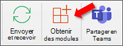

# Chargement de version test des compléments Outlook

Vous pouvez utiliser le chargement de version test pour installer un complément Outlook sans avoir à le placer au préalable dans un catalogue de compléments.

> [!IMPORTANT]
> Si votre Outlook prend en charge les appareils mobiles, chargez une version test du manifeste à l’aide des instructions de cet article pour votre client Outlook sur le web, Windows ou Mac, puis suivez les **instructions** de la section Test de vos macros supplémentaires sur mobile de l’article Sur les [macros pour Outlook Mobile](outlook-mobile-addins.md#testing-your-add-ins-on-mobile).

## Chargement de version de version automatique

Si vous avez créé votre Outlook à l’aide du générateur [Yeoman](../develop/yeoman-generator-overview.md) pour les Office, il est préférable de recharger une version de version par le biais de la ligne de commande Windows. Cela tirera parti de nos outils et chargements de version de version sur tous vos appareils pris en charge dans une seule commande.

1. Sur Windows, ouvrez une invite de commandes et accédez au répertoire racine de votre projet de add-in généré par Yeoman. Exécutez la commande `npm start`.

1. Votre Outlook de bureau est automatiquement chargé de manière Outlook sur votre ordinateur de bureau. Une boîte de dialogue s’affiche, indiquant qu’il y a une tentative de chargement de version de chargement du module, répertoriant le nom et l’emplacement du fichier manifeste. **Sélectionnez OK**, qui enregistre le manifeste.

    > [!IMPORTANT]
    > Si le manifeste contient une erreur ou si le chemin d’accès au manifeste n’est pas valide, vous recevrez un message d’erreur.

1. Si votre manifeste ne contient aucune erreur et que le chemin d’accès est valide, votre application est désormais rechargée de côté et disponible à la fois sur votre bureau et dans Outlook sur le web. Il sera également installé sur tous vos appareils pris en charge.

## Chargement de version de version manuelle

Bien que nous recommandions vivement le chargement d’une version de version secondaire automatiquement par le biais de la ligne de commande comme abordé dans la section précédente, vous pouvez également charger manuellement une version de version de chargement de version de version de base d’un Outlook basé sur le client Outlook.

### Outlook sur le web

Le processus de chargement d’une version de version Outlook sur le web dépend de l’utilisation de la nouvelle version ou de la version classique.

- Si la barre d’outils de boîte aux lettres ressemble à l’image suivante, reportez-vous à la section relative au [chargement de la version test d’un complément dans la nouvelle version d’Outlook sur le web](#new-outlook-on-the-web).

    

- Si la barre d’outils de boîte aux lettres ressemble à l’image suivante, reportez-vous à la section relative au [chargement de la version test d’un complément dans la version classique d’Outlook sur le web](#classic-outlook-on-the-web).

    

> [!NOTE]
> Si votre organisation a inclus son logo dans la barre d’outils de boîte aux lettres, le rendu sera peut-être légèrement différent de celui figurant dans les images précédentes.

#### Nouvelle Outlook sur le web

1. Accédez à [Outlook sur le web](https://outlook.office.com).

1. Créez un message.

1. Sélectionnez **...** au bas du nouveau message, puis sélectionnez **Obtenir des compléments** dans le menu qui s’affiche.

    

1. Dans la boîte de dialogue **Compléments pour Outlook**, sélectionnez **Mes compléments**.

    

1. Recherchez la section **Compléments personnalisés** en bas de la boîte de dialogue. Sélectionnez le lien **Ajouter un complément personnalisé**, puis sélectionnez **Ajouter à partir d’un fichier**.

    

1. Localisez le fichier manifeste de votre complément personnalisé et installez-le. Acceptez toutes les invites pendant l’installation.

#### Modèle Outlook sur le web

1. Accédez à [Outlook sur le web](https://outlook.office.com).

1. Cliquez sur l’icône en forme d’engrenage située en haut à droite de la barre d’outils et sélectionnez **Gérer des compléments**.

    

1. Sur la page **Gérer les compléments**, sélectionnez **Compléments**, puis **Mes compléments**.

    

1. Recherchez la section **Compléments personnalisés** en bas de la boîte de dialogue. Sélectionnez le lien **Ajouter un complément personnalisé**, puis sélectionnez **Ajouter à partir d’un fichier**.

    

1. Localisez le fichier manifeste de votre complément personnalisé et installez-le. Acceptez toutes les invites pendant l’installation.

### Outlook sur le bureau

#### Outlook 2016 ou ultérieur sur Windows ou Mac

1. Ouvrez Outlook 2016 ou une ultérieure sur Windows mac.

1. Cliquez sur le bouton **Obtenir des compléments** du ruban.

    # [Fenêtres](#tab/windows)

    

    # [Mac](#tab/mac)

    

    ---

    > [!IMPORTANT]
    > Si vous ne voyez pas le bouton Obtenir des Outlook, faites l’une des **choses** suivantes :
    >
    > # [Fenêtres](#tab/windows)
    >
    > - Si vous avez configuré la disposition du ruban sur Ruban simplifié, sélectionnez le bouton de sélection (`...`) dans le ruban, puis sélectionnez Obtenir **des modules.**
    >
    >   
    >
    > - Sélectionnez **le bouton Store** sur le ruban, si disponible.
    >
    > - Sélectionnez **le** menu Fichier, puis sélectionnez le bouton Gérer les **modules complémentaires** sous l’onglet  **Informations** pour ouvrir la boîte de dialogue Des Outlook sur le web. Vous pouvez en savoir plus sur l’expérience web dans la section précédente chargement de version de chargement d’un [Outlook sur le web](#outlook-on-the-web).
    >
    > # [Mac](#tab/mac)
    >
    > - Sélectionnez le bouton de sélection (`...`) dans le ruban, puis **sélectionnez Obtenir des modules.**
    >
    >   
    >
    > - Sélectionnez **le bouton Store** sur le ruban, si disponible.
    >
    > ---

1. S’il existe des onglets en haut de la boîte de dialogue, **assurez-vous** que l’onglet Des applications est sélectionné. Choose **My add-ins**.

    

1. Recherchez la section **Compléments personnalisés** en bas de la boîte de dialogue. Sélectionnez le lien **Ajouter un complément personnalisé**, puis sélectionnez **Ajouter à partir d’un fichier**.

    

1. Localisez le fichier manifeste de votre complément personnalisé et installez-le. Acceptez toutes les invites pendant l’installation.

#### Outlook 2013 sous Windows

1. Ouvrez Outlook 2013 sur Windows.

1. Sélectionnez **le** menu Fichier, puis sélectionnez le bouton Gérer les **modules complémentaires** sous l’onglet **Informations**. Outlook ouvre la version web dans un navigateur.

1. Suivez les étapes de la section [Chargement de version de version](#outlook-on-the-web) Outlook sur le web en fonction de votre version de Outlook sur le web.

## Supprimer un add-in chargé de nouveau

Sur toutes les versions de Outlook, la clé de la suppression d’un module de chargement de version ultérieure est  la boîte de dialogue Mes applications qui répertorie vos applications installées. Choisissez les ellipses (`...`) du module, puis sélectionnez **Supprimer**.

Pour accéder à la boîte de dialogue Mes applications pour votre client Outlook, utilisez les dernières **étapes** répertoriées pour le chargement de version  manuelle dans les sections précédentes de cet article.

Pour supprimer un add-in chargé de Outlook, utilisez les étapes décrites précédemment dans cet article pour rechercher le module dans la section Custom **add-ins** de la boîte de dialogue qui répertorie vos applications installées. Choisissez les ellipses (`...`) du module, puis choisissez **Supprimer** pour supprimer ce dernier. Fermez la boîte de dialogue.

## Voir aussi

- [Compléments pour Outlook Mobile](outlook-mobile-addins.md)