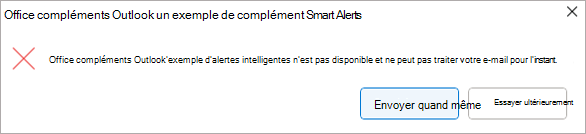
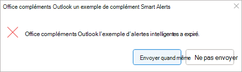

# <a name="use-smart-alerts-and-the-onmessagesend-and-onappointmentsend-events-in-your-outlook-add-in"></a>Utiliser les alertes intelligentes et les événements OnMessageSend et OnAppointmentSend dans votre complément Outlook

Les `OnMessageSend` événements et `OnAppointmentSend` tirent parti des alertes intelligentes, ce qui vous permet d’exécuter la logique après qu’un utilisateur a sélectionné **Envoyer** dans son message ou rendez-vous Outlook. Votre gestionnaire d’événements vous permet d’offrir à vos utilisateurs la possibilité d’améliorer leurs e-mails et invitations à une réunion avant leur envoi.

La procédure pas à pas suivante utilise l’événement `OnMessageSend` . À la fin de cette procédure pas à pas, vous disposez d’un complément qui s’exécute chaque fois qu’un message est envoyé et vérifie si l’utilisateur a oublié d’ajouter un document ou une image qu’il a mentionné dans son e-mail.

> [!NOTE]
> Les `OnMessageSend` événements et `OnAppointmentSend` ont été introduits dans [l’ensemble de conditions requises 1.12](/javascript/api/requirement-sets/outlook/requirement-set-1.12/outlook-requirement-set-1.12). Voir [les clients et les plateformes](/javascript/api/requirement-sets/outlook/outlook-api-requirement-sets) qui prennent en charge cet ensemble de conditions requises.

## <a name="prerequisites"></a>Configuration requise

L’événement `OnMessageSend` est disponible via la fonctionnalité d’activation basée sur les événements. Pour comprendre comment configurer votre complément pour utiliser cette fonctionnalité, utiliser d’autres événements disponibles, déboguer votre complément et bien plus encore, voir [Configurer votre complément Outlook pour l’activation basée sur les événements](autolaunch.md).

## <a name="set-up-your-environment"></a>Configuration de votre environnement

Suivez le [guide de démarrage rapide Outlook](../quickstarts/outlook-quickstart.md?tabs=yeomangenerator), qui crée un projet de complément avec le [générateur Yeoman pour les compléments Office](../develop/yeoman-generator-overview.md).

## <a name="configure-the-manifest"></a>Configurer le manifeste

Pour configurer le manifeste, sélectionnez l’onglet correspondant au type de manifeste que vous utilisez.

# <a name="xml-manifest"></a>[Manifeste XML](#tab/xmlmanifest)

1. Dans votre éditeur de code, ouvrez le projet de démarrage rapide.

1. Ouvrez le fichier **manifest.xml** situé à la racine de votre projet.

1. Sélectionnez le nœud entier **\<VersionOverrides\>** (y compris les balises d’ouverture et de fermeture) et remplacez-le par le code XML suivant, puis enregistrez vos modifications.

```XML
<VersionOverrides xmlns="http://schemas.microsoft.com/office/mailappversionoverrides" xsi:type="VersionOverridesV1_0">
  <VersionOverrides xmlns="http://schemas.microsoft.com/office/mailappversionoverrides/1.1" xsi:type="VersionOverridesV1_1">
    <Requirements>
      <bt:Sets DefaultMinVersion="1.12">
        <bt:Set Name="Mailbox" />
      </bt:Sets>
    </Requirements>
    <Hosts>
      <Host xsi:type="MailHost">
        <!-- Event-based activation happens in a lightweight runtime.-->
        <Runtimes>
          <!-- HTML file including reference to or inline JavaScript event handlers.
               This is used by Outlook on the web and on the new Mac UI. -->
          <Runtime resid="WebViewRuntime.Url">
            <!-- JavaScript file containing event handlers. This is used by Outlook on Windows. -->
            <Override type="javascript" resid="JSRuntime.Url"/>
          </Runtime>
        </Runtimes>
        <DesktopFormFactor>
          <FunctionFile resid="Commands.Url" />
          <ExtensionPoint xsi:type="MessageReadCommandSurface">
            <OfficeTab id="TabDefault">
              <Group id="msgReadGroup">
                <Label resid="GroupLabel" />
                <Control xsi:type="Button" id="msgReadOpenPaneButton">
                  <Label resid="TaskpaneButton.Label" />
                  <Supertip>
                    <Title resid="TaskpaneButton.Label" />
                    <Description resid="TaskpaneButton.Tooltip" />
                  </Supertip>
                  <Icon>
                    <bt:Image size="16" resid="Icon.16x16" />
                    <bt:Image size="32" resid="Icon.32x32" />
                    <bt:Image size="80" resid="Icon.80x80" />
                  </Icon>
                  <Action xsi:type="ShowTaskpane">
                    <SourceLocation resid="Taskpane.Url" />
                  </Action>
                </Control>
                <Control xsi:type="Button" id="ActionButton">
                  <Label resid="ActionButton.Label"/>
                  <Supertip>
                    <Title resid="ActionButton.Label"/>
                    <Description resid="ActionButton.Tooltip"/>
                  </Supertip>
                  <Icon>
                    <bt:Image size="16" resid="Icon.16x16"/>
                    <bt:Image size="32" resid="Icon.32x32"/>
                    <bt:Image size="80" resid="Icon.80x80"/>
                  </Icon>
                  <Action xsi:type="ExecuteFunction">
                    <FunctionName>action</FunctionName>
                  </Action>
                </Control>
              </Group>
            </OfficeTab>
          </ExtensionPoint>

          <!-- Can configure other command surface extension points for add-in command support. -->

          <!-- Enable launching the add-in on the included event. -->
          <ExtensionPoint xsi:type="LaunchEvent">
            <LaunchEvents>
              <LaunchEvent Type="OnMessageSend" FunctionName="onMessageSendHandler" SendMode="PromptUser" />
            </LaunchEvents>
            <!-- Identifies the runtime to be used (also referenced by the Runtime element). -->
            <SourceLocation resid="WebViewRuntime.Url"/>
          </ExtensionPoint>
        </DesktopFormFactor>
      </Host>
    </Hosts>
    <Resources>
      <bt:Images>
        <bt:Image id="Icon.16x16" DefaultValue="https://localhost:3000/assets/icon-16.png"/>
        <bt:Image id="Icon.32x32" DefaultValue="https://localhost:3000/assets/icon-32.png"/>
        <bt:Image id="Icon.80x80" DefaultValue="https://localhost:3000/assets/icon-80.png"/>
      </bt:Images>
      <bt:Urls>
        <bt:Url id="Commands.Url" DefaultValue="https://localhost:3000/commands.html" />
        <bt:Url id="Taskpane.Url" DefaultValue="https://localhost:3000/taskpane.html" />
        <bt:Url id="WebViewRuntime.Url" DefaultValue="https://localhost:3000/commands.html" />
        <!-- Entry needed for Outlook on Windows. -->
        <bt:Url id="JSRuntime.Url" DefaultValue="https://localhost:3000/launchevent.js" />
      </bt:Urls>
      <bt:ShortStrings>
        <bt:String id="GroupLabel" DefaultValue="Contoso Add-in"/>
        <bt:String id="TaskpaneButton.Label" DefaultValue="Show Taskpane"/>
        <bt:String id="ActionButton.Label" DefaultValue="Perform an action"/>
      </bt:ShortStrings>
      <bt:LongStrings>
        <bt:String id="TaskpaneButton.Tooltip" DefaultValue="Opens a pane displaying all available properties."/>
        <bt:String id="ActionButton.Tooltip" DefaultValue="Perform an action when clicked."/>
      </bt:LongStrings>
    </Resources>
  </VersionOverrides>
</VersionOverrides>
```

> [!TIP]
>
> - Pour connaître les options **SendMode** disponibles avec les `OnMessageSend` événements et `OnAppointmentSend` , consultez [Options SendMode disponibles](/javascript/api/manifest/launchevent#available-sendmode-options).
> - Pour en savoir plus sur les manifestes pour les compléments Outlook, voir [Manifestes de complément Outlook](manifests.md).

# <a name="teams-manifest-developer-preview"></a>[Manifeste Teams (préversion pour les développeurs)](#tab/jsonmanifest)

> [!IMPORTANT]
> Les alertes intelligentes ne sont pas encore prises en charge pour le [manifeste Teams pour les compléments Office (préversion).](../develop/json-manifest-overview.md) Cet onglet est destiné à une utilisation ultérieure.

1. Ouvrez le fichier **manifest.json** .

1. Ajoutez l’objet suivant au tableau « extensions.runtimes ». Notez les points suivants concernant ce balisage :

   - La valeur « minVersion » de l’ensemble de conditions requises mailbox est définie sur « 1.12 », car la [table des événements pris en charge](autolaunch.md#supported-events) spécifie qu’il s’agit de la version la plus basse de l’ensemble de conditions requises qui prend en charge l’événement `OnMessageSend` .
   - Le « id » du runtime est défini sur le nom descriptif « autorun_runtime ».
   - La propriété « code » a une propriété « page » enfant qui est définie sur un fichier HTML et une propriété « script » enfant qui est définie sur un fichier JavaScript. Vous allez créer ou modifier ces fichiers dans les étapes ultérieures. Office utilise l’une de ces valeurs ou l’autre en fonction de la plateforme.
       - Office sur Windows exécute le gestionnaire d’événements dans un runtime JavaScript uniquement, qui charge directement un fichier JavaScript.
       - Office sur Mac et le web exécutent le gestionnaire dans un runtime de navigateur, qui charge un fichier HTML. Ce fichier, à son tour, contient une `<script>` balise qui charge le fichier JavaScript.
     Pour plus d’informations, voir [Runtimes dans les compléments Office](../testing/runtimes.md).
   - La propriété « lifetime » est définie sur « short », ce qui signifie que le runtime démarre lorsque l’événement est déclenché et s’arrête lorsque le gestionnaire se termine. (Dans certains cas rares, le runtime s’arrête avant la fin du gestionnaire. Voir [Runtimes dans les compléments Office](../testing/runtimes.md).)
   - Il existe une action permettant d’exécuter un gestionnaire pour l’événement `OnMessageSend` . Vous allez créer la fonction de gestionnaire dans une étape ultérieure.

    ```json
     {
        "requirements": {
            "capabilities": [
                {
                    "name": "Mailbox",
                    "minVersion": "1.12"
                }
            ]
        },
        "id": "autorun_runtime",
        "type": "general",
        "code": {
            "page": "https://localhost:3000/commands.html",
            "script": "https://localhost:3000/launchevent.js"
        },
        "lifetime": "short",
        "actions": [
            {
                "id": "onMessageSendHandler",
                "type": "executeFunction",
                "displayName": "onMessageSendHandler"
            }
        ]
    }
    ```

1. Ajoutez le tableau « autoRunEvents » suivant en tant que propriété de l’objet dans le tableau « extensions ».

    ```json
    "autoRunEvents": [
    
    ]
    ```

1. Ajoutez l’objet suivant au tableau « autoRunEvents ». Tenez compte des informations suivantes à propos de ce code :

   - L’objet d’événement affecte une fonction de gestionnaire à l’événement `OnMessageSend` (en utilisant le nom du manifeste Teams de l’événement, « messageSending », comme décrit dans le [tableau des événements pris en charge](autolaunch.md#supported-events)). Le nom de fonction fourni dans « actionId » doit correspondre au nom utilisé dans la propriété « id » de l’objet dans le tableau « actions » d’une étape précédente.
   - L’option « sendMode » est définie sur « promptUser ». Cela signifie que si le message ne remplit pas les conditions que le complément définit pour l’envoi, l’utilisateur est invité à annuler l’envoi ou à envoyer quand même.

    ```json
      {
          "requirements": {
              "capabilities": [
                  {
                      "name": "Mailbox",
                      "minVersion": "1.12"
                  }
              ],
              "scopes": [
                  "mail"
              ]
          },
          "events": [
            {
                "type": "messageSending",
                "actionId": "onMessageSendHandler",
                "options": {
                    "sendMode": "promptUser"
                }
            }
          ]
      }
    ```

---

## <a name="implement-event-handling"></a>Implémenter la gestion des événements

Vous devez implémenter la gestion de l’événement sélectionné.

Dans ce scénario, vous allez ajouter la gestion de l’envoi d’un message. Votre complément recherche certains mots clés dans le message. Si l’un de ces mots clés est trouvé, il vérifie s’il existe des pièces jointes. S’il n’y a pas de pièces jointes, votre complément recommande à l’utilisateur d’ajouter la pièce jointe éventuellement manquante.

1. À partir du même projet de démarrage rapide, créez un dossier nommé **launchevent** sous le répertoire **./src** .

1. Dans le dossier **./src/launchevent** , créez un fichier nommé **launchevent.js**.

1. Ouvrez le fichier **./src/launchevent/launchevent.js** dans votre éditeur de code et ajoutez le code JavaScript suivant.

    ```js
    /*
    * Copyright (c) Microsoft Corporation. All rights reserved. Licensed under the MIT license.
    * See LICENSE in the project root for license information.
    */

    function onMessageSendHandler(event) {
      Office.context.mailbox.item.body.getAsync(
        "text",
        { asyncContext: event },
        getBodyCallback
      );
    }

    function getBodyCallback(asyncResult){
      let event = asyncResult.asyncContext;
      let body = "";
      if (asyncResult.status !== Office.AsyncResultStatus.Failed && asyncResult.value !== undefined) {
        body = asyncResult.value;
      } else {
        let message = "Failed to get body text";
        console.error(message);
        event.completed({ allowEvent: false, errorMessage: message });
        return;
      }

      let matches = hasMatches(body);
      if (matches) {
        Office.context.mailbox.item.getAttachmentsAsync(
          { asyncContext: event },
          getAttachmentsCallback);
      } else {
        event.completed({ allowEvent: true });
      }
    }

    function hasMatches(body) {
      if (body == null || body == "") {
        return false;
      }

      const arrayOfTerms = ["send", "picture", "document", "attachment"];
      for (let index = 0; index < arrayOfTerms.length; index++) {
        const term = arrayOfTerms[index].trim();
        const regex = RegExp(term, 'i');
        if (regex.test(body)) {
          return true;
        }
      }

      return false;
    }

    function getAttachmentsCallback(asyncResult) {
      let event = asyncResult.asyncContext;
      if (asyncResult.value.length > 0) {
        for (let i = 0; i < asyncResult.value.length; i++) {
          if (asyncResult.value[i].isInline == false) {
            event.completed({ allowEvent: true });
            return;
          }
        }

        event.completed({ allowEvent: false, errorMessage: "Looks like you forgot to include an attachment?" });
      } else {
        event.completed({ allowEvent: false, errorMessage: "Looks like you're forgetting to include an attachment?" });
      }
    }

    // 1st parameter: FunctionName of LaunchEvent in the manifest; 2nd parameter: Its implementation in this .js file.
    Office.actions.associate("onMessageSendHandler", onMessageSendHandler);
    ```

## <a name="update-the-commands-html-file"></a>Mettre à jour le fichier HTML des commandes

1. Dans le dossier **./src/commands** , ouvrez **commands.html**.

1. Juste avant la balise **head** fermante (`</head>`), ajoutez une entrée de script pour le code JavaScript de gestion des événements.

   ```js
   <script type="text/javascript" src="../launchevent/launchevent.js"></script> 
   ```

1. Enregistrez vos modifications.

## <a name="update-webpack-config-settings"></a>Mettre à jour les paramètres de configuration webapck

1. Ouvrez le fichier **webpack.config.js** qui se trouve dans le répertoire racine du projet et effectuez les étapes suivantes.

1. Recherchez le `plugins` tableau dans l’objet `config` et ajoutez ce nouvel objet au début du tableau.

    ```js
    new CopyWebpackPlugin({
      patterns: [
        {
          from: "./src/launchevent/launchevent.js",
          to: "launchevent.js",
        },
      ],
    }),
    ```

1. Enregistrez vos modifications.

## <a name="try-it-out"></a>Essayez

1. Exécutez les commandes suivantes dans le répertoire racine de votre projet. Lorsque vous exécutez `npm start`, le serveur web local démarre (s’il n’est pas déjà en cours d’exécution) et votre complément est chargé de manière indépendante.

    ```command&nbsp;line
    npm run build
    ```

    ```command&nbsp;line
    npm start
    ```

    > [!NOTE]
    > Si votre complément n’a pas été automatiquement chargé de manière indépendante, suivez les instructions fournies dans Charger une version test des [compléments Outlook](../outlook/sideload-outlook-add-ins-for-testing.md#sideload-manually) pour charger manuellement une version test du complément dans Outlook.

1. Dans Outlook sur Windows, créez un message et définissez l’objet. Dans le corps, ajoutez du texte comme « Hé, regardez cette photo de mon chien ! ».
1. Envoyez le message. Une boîte de dialogue doit s’afficher avec une recommandation pour vous permettre d’ajouter une pièce jointe.

    

1. Ajoutez une pièce jointe, puis renvoyez le message. Il ne doit pas y avoir d’alerte cette fois.

## <a name="deploy-to-users"></a>Déployer sur les utilisateurs

À l’instar des autres compléments basés sur les événements, les compléments qui utilisent la fonctionnalité Alertes intelligentes doivent être déployés par l’administrateur d’une organisation. Pour obtenir des conseils sur la façon de déployer votre complément via le Centre d'administration Microsoft 365, consultez la section **Déployer sur les utilisateurs** dans [Configurer votre complément Outlook pour l’activation basée sur les événements](autolaunch.md#deploy-to-users).

> [!IMPORTANT]
> Les compléments qui utilisent la fonctionnalité Alertes intelligentes ne peuvent être publiés sur AppSource que si la [propriété SendMode](/javascript/api/manifest/launchevent#available-sendmode-options) du manifeste est définie sur l’option `SoftBlock` ou `PromptUser` . Si la propriété **SendMode** d’un complément est définie sur `Block`, elle ne peut être déployée que par l’administrateur d’une organisation, car la validation AppSource échoue. Pour en savoir plus sur la publication de votre complément basé sur les événements dans AppSource, consultez [Options de liste AppSource pour votre complément Outlook basé sur les événements](autolaunch-store-options.md).

## <a name="smart-alerts-feature-behavior-and-scenarios"></a>Comportement et scénarios des fonctionnalités d’alertes intelligentes

Les descriptions des options **sendMode** et des recommandations pour savoir quand les utiliser sont détaillées dans [Options SendMode disponibles](/javascript/api/manifest/launchevent#available-sendmode-options). Ce qui suit décrit le comportement de la fonctionnalité pour certains scénarios.

### <a name="add-in-is-unavailable"></a>Le complément n’est pas disponible

Si le complément n’est pas disponible lors de l’envoi d’un message ou d’un rendez-vous (par exemple, une erreur qui empêche le chargement du complément), l’utilisateur est alerté. Les options disponibles pour l’utilisateur varient en fonction de l’option **SendMode** appliquée au complément.

Si l’option `PromptUser` ou `SoftBlock` est utilisée, l’utilisateur peut choisir **Envoyer quand même** pour envoyer l’élément sans que le complément ne l’archive, ou **Essayer plus tard** pour permettre à l’élément d’être coché par le complément lorsqu’il redevient disponible.



Si l’option `Block` est utilisée, l’utilisateur ne peut pas envoyer l’élément tant que le complément n’est pas disponible. (L’option `Block` n’est pas prise en charge si le complément utilise un manifeste Teams (préversion).)


### <a name="long-running-add-in-operations"></a>Opérations de complément de longue durée

Si le complément s’exécute pendant plus de cinq secondes, mais moins de cinq minutes, l’utilisateur est averti que le complément prend plus de temps que prévu pour traiter le message ou le rendez-vous.

Si l’option `PromptUser` est utilisée, l’utilisateur peut choisir **Envoyer quand même** pour envoyer l’élément sans que le complément ne termine sa vérification. L’utilisateur peut également sélectionner **Ne pas envoyer** pour arrêter le traitement du complément.


Toutefois, si l’option `SoftBlock` ou `Block` est utilisée, l’utilisateur ne pourra pas envoyer l’élément tant que le complément n’aura pas terminé de le traiter.


`OnMessageSend` et `OnAppointmentSend` les compléments doivent être courts et légers. Pour éviter la boîte de dialogue d’opération de longue durée, utilisez d’autres événements pour traiter les vérifications conditionnelles avant l’activation de l’événement `OnMessageSend` ou `OnAppointmentSend` . Par exemple, si l’utilisateur doit chiffrer les pièces jointes pour chaque message ou rendez-vous, envisagez d’utiliser l’événement `OnMessageAttachmentsChanged` ou `OnAppointmentAttachmentsChanged` pour effectuer la vérification.

### <a name="add-in-timed-out"></a>Le complément a expiré

Si le complément s’exécute pendant cinq minutes ou plus, il expire. Si l’option `PromptUser` est utilisée, l’utilisateur peut choisir **Envoyer quand même** pour envoyer l’élément sans que le complément ne termine sa vérification. L’utilisateur peut également choisir **Ne pas envoyer**.



Si l’option `SoftBlock` ou `Block` est utilisée, l’utilisateur ne peut pas envoyer l’élément tant que le complément n’a pas terminé sa vérification. L’utilisateur doit tenter de renvoyer l’élément pour réactiver le complément.


## <a name="limitations"></a>Limites

Étant donné que les `OnMessageSend` événements et `OnAppointmentSend` sont pris en charge par le biais de la fonctionnalité d’activation basée sur les événements, les mêmes limitations de fonctionnalité s’appliquent aux compléments qui s’activent à la suite de ces événements. Pour obtenir une description de ces limitations, consultez [Comportement et limitations de l’activation basée sur les événements](autolaunch.md#event-based-activation-behavior-and-limitations).

En plus de ces contraintes, une seule instance de `OnMessageSend` chaque événement et `OnAppointmentSend` peut être déclarée dans le manifeste. Si vous avez besoin de plusieurs `OnMessageSend` événements ou , `OnAppointmentSend` vous devez déclarer chacun d’eux dans un complément distinct.

Bien qu’un message de boîte de dialogue Alertes intelligentes puisse être modifié en fonction de votre scénario de complément à l’aide de la [propriété errorMessage](/javascript/api/office/office.addincommands.eventcompletedoptions) de la méthode event.completed, les éléments suivants ne peuvent pas être personnalisés.

- Barre de titre de la boîte de dialogue. Le nom de votre complément y est toujours affiché.
- Format du message. Par exemple, vous ne pouvez pas modifier la taille et la couleur de police du texte ou insérer une liste à puces.
- Options de boîte de dialogue. Par exemple, les options **Envoyer quand même** et **Ne pas envoyer** sont corrigées et dépendent de [l’option SendMode](/javascript/api/manifest/launchevent#available-sendmode-options) que vous sélectionnez.
- Boîtes de dialogue de traitement de l’activation basée sur les événements et d’informations de progression. Par exemple, le texte et les options qui apparaissent dans les boîtes de dialogue de délai d’expiration et d’opération de longue durée ne peuvent pas être modifiés.

## <a name="differences-between-smart-alerts-and-the-on-send-feature"></a>Différences entre les alertes intelligentes et la fonctionnalité d’envoi

Bien que les alertes intelligentes et la [fonctionnalité d’envoi](outlook-on-send-addins.md) offrent à vos utilisateurs la possibilité d’améliorer leurs messages et invitations à une réunion avant leur envoi, les alertes intelligentes sont une fonctionnalité plus récente qui vous offre plus de flexibilité quant à la façon dont vous invitez vos utilisateurs à effectuer d’autres actions. Les principales différences entre les deux fonctionnalités sont décrites dans le tableau suivant.

> [!IMPORTANT]
> Les alertes intelligentes ne sont pas encore prises en charge pour le manifeste Teams (préversion). Nous travaillons à fournir ce support bientôt.

|Attribut|Alertes intelligentes|En cours d’envoi|
|-----|-----|-----|
|**Ensemble de conditions requises minimales prises en charge**|[Boîte aux lettres 1.12](/javascript/api/requirement-sets/outlook/requirement-set-1.12/outlook-requirement-set-1.12)|[Mailbox 1.8](/javascript/api/requirement-sets/outlook/requirement-set-1.8/outlook-requirement-set-1.8)|
|**Clients Outlook pris en charge**|-Windows<br>- Navigateur web (interface utilisateur moderne)<br>- Mac (nouvelle interface utilisateur)|-Windows<br>- Navigateur web (interface utilisateur classique et moderne)<br>- Mac (interface utilisateur classique et nouvelle) |
|**Événements pris en charge**|**Manifeste XML**<br>- `OnMessageSend`<br>- `OnAppointmentSend`<br><br>**Manifeste Teams (préversion)**<br>- « messageSending »<br>- « appointmentSending »|**Manifeste XML**<br>- `ItemSend`<br><br>**Manifeste Teams (préversion)**<br>- Non pris en charge|
|**Propriété d’extension de manifeste**|**Manifeste XML**<br>- `LaunchEvent`<br><br>**Manifeste Teams (préversion)**<br>- « autoRunEvents »|**Manifeste XML**<br>- `Events`<br><br>**Manifeste Teams (préversion)**<br>- Non pris en charge|
|**Options du mode d’envoi prises en charge**|- Demander à l’utilisateur<br>- Bloc souple<br>- Bloquer (non pris en charge si le complément utilise un manifeste Teams (préversion))|Bloquer|
|**Nombre maximal d’événements pris en charge dans un complément**|Un `OnMessageSend` et un `OnAppointmentSend` événement.|Un `ItemSend` événement.|
|**Déploiement de compléments**|Le complément peut être publié dans AppSource si sa `SendMode` propriété est définie sur l’option `SoftBlock` ou `PromptUser` . Sinon, le complément doit être déployé par l’administrateur d’une organisation.|Le complément ne peut pas être publié sur AppSource. Il doit être déployé par l’administrateur d’une organisation.|
|**Configuration supplémentaire pour l’installation du complément**|Aucune configuration supplémentaire n’est nécessaire une fois le manifeste chargé dans le Centre d'administration Microsoft 365.|Selon les normes de conformité de l’organisation et le client Outlook utilisé, certaines stratégies de boîte aux lettres doivent être configurées pour installer le complément.|

## <a name="see-also"></a>Voir aussi

- [Manifestes de complément Outlook](manifests.md)
- [Configurer votre complément Outlook pour l’activation basée sur les événements](autolaunch.md)
- [Comment déboguer des compléments basés sur des événements](debug-autolaunch.md)
- [Options de liste AppSource pour votre complément Outlook basé sur les événements](autolaunch-store-options.md)
- [Exemple de code de compléments Office : Utiliser les alertes intelligentes Outlook](https://github.com/OfficeDev/Office-Add-in-samples/tree/main/Samples/outlook-check-item-categories)
