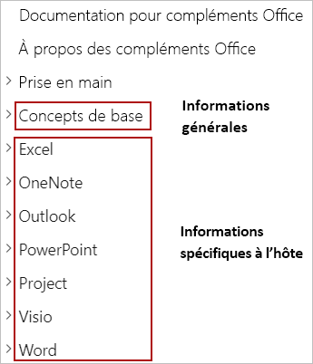

# <a name="building-office-add-ins"></a>Création de compléments Office

> [!TIP]
> Avant de lire cet article, nous vous invitons à consulter [Vue d’ensemble de la plateforme de compléments pour Office](office-add-ins.md).

Les compléments Office étendent l’interface utilisateur et les fonctionnalités des applications Office et interagissent avec du contenu dans des documents Office. Vous utilisez des technologies web que vous connaissez, pour créer les compléments Office qui étendent Word, Excel, PowerPoint, OneNote, Project ou Outlook, et interagissent avec ces programmes. Les compléments que vous créez peuvent être exécutés dans Office sur plusieurs plateformes, notamment Windows, Mac, iPad et dans un navigateur. Cet article fournit un présentation du développement de compléments Office.

## <a name="creating-an-office-add-in"></a>Création d’un complément Office 

Vous pouvez créer un complément Office à l’aide du générateur Yeoman pour les compléments Office ou de Visual Studio.

### <a name="yeoman-generator-for-office-add-ins"></a>Générateur Yeoman pour compléments Office

Le[Générateur Yeoman pour les compléments Office](https://github.com/officedev/generator-office) peut être utilisé pour créer un projet de complément Office Node.js qui peut être géré à l’aide de Visual Studio Code ou de tout autre éditeur. Le générateur peut créer des compléments Office pour les éléments suivants :

- Excel
- OneNote
- Outlook
- PowerPoint
- Project
- Word
- Fonctions personnalisées dans Excel

Vous pouvez choisir de créer le projet à l’aide de HTML, CSS et JavaScript, ou d’utiliser Angular ou React. Pour l’infrastructure de votre choix, vous pouvez également choisir entre JavaScript et Typescript . Chaque [démarrage rapide de 5 minutes](../index.md) contient des instructions détaillées qui décrivent comment créer un complément Office à l’aide du générateur Yeoman.

### <a name="visual-studio"></a>Visual Studio

Visual Studio peut être utilisé pour créer des compléments Office pour Excel, Word, PowerPoint ou Outlook. Un projet de complément Office est créé dans le cadre d’une solution Visual Studio et utilise HTML, CSS et JavaScript. Les [démarrages rapide de 5 minutes](../index.md) pour Excel, Word, PowerPoint et Outlook contient des instructions détaillées qui expliquent comment créer un complément Office à l’aide de Visual Studio. 

[!include[Yeoman vs Visual Studio comparision](../includes/yeoman-generator-recommendation.md)]

## <a name="exploring-apis-with-script-lab"></a>Exploration des API avec Script Lab

Script Lab est un complément qui vous permet d’explorer l’API JavaScript Office et d’exécuter des extraits de code lorsque vous travaillez dans un programme Office tel qu’Excel ou Word. Il est disponible gratuitement via [AppSource](https://appsource.microsoft.com/product/office/WA104380862), il s’agit d’un outil utile pour inclure votre kit de ressources de développement pendant que vous projetez et vérifiez les fonctionnalités de votre complément. Dans Script Lab, vous pouvez accéder à une bibliothèque d'exemples intégrés pour essayer rapidement des API ou même utiliser un exemple comme point de départ pour votre propre code. 

La vidéo d’une minute suivante illustre Script Lab en action.

[](https://aka.ms/scriptlabvideo)

Si vous souhaitez en savoir plus sur Script Lab, veuillez consulter[Axplorer les API Office JavaScript à l’aide d’un Script Lab](../overview/explore-with-script-lab.md).

## <a name="extending-the-office-ui"></a>Extension de l’interface utilisateur Office

Un complément Office peut étendre l'interface utilisateur d'Office à l’aide de commandes de complément et de conteneurs HTML tels que les volets de tâches, les compléments de contenu ou les boîtes de dialogue.

- [Commandes de complément](../design/add-in-commands.md) peuvent être utilisé pour ajouter des onglets, boutons et menus personnalisés au ruban par défaut dans Office, ou développer le menu contextuel par défaut qui apparaît lorsque les utilisateurs cliquent avec le bouton droit sur du texte dans un document Office ou un objet dans Excel. Lorsque les utilisateurs sélectionnent une commande de complément, ils lancent la tâche spécifiée par la commande de complément, par exemple, l’exécution d’un code JavaScript, l’ouverture d’un volet Office ou le lancement d’une boîte de dialogue.

- Les conteneurs HTML tels que [volets Office](../design/task-pane-add-ins.md), [compléments de contenu](../design/content-add-ins.md)et [boîtes de dialogue](../design/dialog-boxes.md) peuvent être utilisés pour afficher une interface utilisateur personnalisée et exposer des fonctionnalités supplémentaires dans une application Office. Le contenu et les fonctionnalités de chaque volet Office, complément de contenu ou boîte de dialogue dérivent d’une page web que vous spécifiez. Ces pages web peuvent utiliser l’API JavaScript Office pour interagir avec le contenu du document Office dans lequel le complément est exécuté, et peuvent également effectuer d’autres actions, telles que appeler des services web externes, faciliter l’authentification des utilisateurs, et bien plus encore.

L’image suivante illustre la commande d’un complément dans le ruban, un volet Office à droite du document et une boîte de dialogue ou un complément de contenu sur le document.


Pour plus d’informations sur l’extension de l’interface utilisateur d’Office, consultez[Éléments d’interface utilisateur Office pour les compléments Office](../design/interface-elements.md).

## <a name="core-development-concepts"></a>Concepts de base du développement 

Un complément Office est composé de deux parties :

- Le manifeste de complément est un fichier XML qui définit les paramètres et les fonctionnalités du complément.

- L'application web qui définit l'interface utilisateur et les fonctionnalités des composants additionnels tels que les volets Office, les compléments de contenu et les boîtes de dialogue.

L’application web utilise l’API JavaScript Office pour interagir avec le contenu du document Office dans lequel le complément est exécuté. Votre complément peut également effectuer d’autres actions que les applications web effectuent, comme appeler des services web externes, faciliter l’authentification des utilisateurs, et bien plus encore.

### <a name="defining-an-add-ins-settings-and-capabilities"></a>Définir les paramètres et les fonctionnalités du complément

Un manifeste de complément Office (fichier XML) définit les paramètres et les fonctionnalités du complément. Vous allez configurer le manifeste pour spécifier des éléments tels que :

- Métadonnées décrivant le complément (par exemple, ID, version, description, nom complet, paramètres régionaux par défaut).
- Les applications Office dans lesquelles le complément s’exécute.
- Autorisations nécessaires au complément.
- La manière dont le complément est intégré à Office, y compris toute interface utilisateur personnalisée créée par le complément (par exemple, onglets personnalisés, boutons du ruban).
- L’emplacement des images que le complément utilise pour la personnalisation et l'iconographie des commandes.
- Dimensions du complément (par exemple, dimensions pour les compléments de contenu, la hauteur demandée pour des compléments Outlook).
- Règles qui spécifient le moment où le complément est activé dans le contexte d’un message ou d’un rendez-vous (pour les compléments Outlook uniquement).

Si vous souhaitez en savoir plus sur le manifeste, veuillez consulter l’article sur le [manifeste XML de compléments Office](add-in-manifests.md).

### <a name="interacting-with-content-in-an-office-document"></a>Interaction avec le contenu d’un document Office

Un complément Office peut utiliser l’API JavaScript Office pour interagir avec le contenu du document Office dans lequel le complément est exécuté. 

#### <a name="accessing-the-office-javascript-library"></a>Accès à la bibliothèque JavaScript pour Office

La bibliothèque JavaScript Office est accessible via le réseau de distribution de contenu (CDN) d’Office JS à l’adresse suivante : `https://appsforoffice.microsoft.com/lib/1/hosted/Office.js`. Pour utiliser les API JavaScript Office dans les pages web de votre complément, vous devez référencer le réseau de distribution de contenu dans une balise `<script>`dans la balise `<head>` de la page.

```html
<head>
    ...
    <script src="https://appsforoffice.microsoft.com/lib/1/hosted/Office.js" type="text/javascript"></script>
</head>
```

> [!NOTE]
> Pour utiliser les API destinées à la prévisualisation, référencez la version d’évaluation de la bibliothèque JavaScript Office dans le CDN : https://appsforoffice.microsoft.com/lib/beta/hosted/office.js.

Si vous souhaitez en savoir plus sur l’accès à la bibliothèque JavaScript pour Office, notamment sur l’obtention d’IntelliSense, consultez [Référencement de la bibliothèque de l’interface API JavaScript pour Office à partir de son réseau de distribution de contenu (CDN)](../develop/referencing-the-javascript-api-for-office-library-from-its-cdn.md).

#### <a name="api-models"></a>Modèles API

Les API JavaScript pour Office incluent deux modèles distincts :

- **Les API spécifiques aux hôtes** fournissent des objets fortement typés qui peuvent être utilisés pour interagir avec des objets natifs d’une application Office spécifique. Par exemple, vous pouvez utiliser les API JavaScript pour Excel pour accéder à des feuilles de calcul, plages, tableaux, graphiques, etc. Les API spécifiques aux hôtes sont actuellement disponibles pour [Excel](../reference/overview/excel-add-ins-reference-overview.md), [Word](../reference/overview/word-add-ins-reference-overview.md)et [OneNote](../reference/overview/onenote-add-ins-javascript-reference.md). Ce modèle API utilise [promet](https://developer.mozilla.org/docs/Web/JavaScript/Reference/Global_Objects/Promise) et vous permet de spécifier plusieurs opérations dans chaque demande que vous envoyez à l’hôte Office. Ce type d'opérations peut améliorer sensiblement les performances des compléments dans Office sur les applications web. Les API spécifiques aux hôtes ont été introduites avec Office 2016 et ne peuvent pas être utilisées pour interagir avec Office 2013.

- Les API **Communes** peuvent être utilisées pour accéder à des fonctionnalités telles qu’une interface utilisateur, des boîtes de dialogue et des paramètres du client, qui sont communes à plusieurs types d’applications Office. Ce modèle API utilise des [rappels](https://developer.mozilla.org/docs/Glossary/Callback_function), où vous ne pouvez spécifier qu’une seule opération dans chaque demande que vous envoyez à l’hôte Office. Les API communes ont été introduites avec Office 2013 et peuvent être utilisées pour interagir avec Office 2013 ou version ultérieure. Si vous souhaitez plus en savoir sur le modèle objet API commun, qui inclut des API pour l’interaction avec Outlook et PowerPoint, veuillez consulter [Modèle d’objet API JavaScript Office](../develop/office-javascript-api-object-model.md).

> [!NOTE]
> Les fonctions personnalisées d’Excel s’exécutent au sein d’un Runtime unique qui hiérarchise l’exécution des calculs, et utilise par conséquent un modèle de programmation légèrement différent. Pour plus d'informations, veuillez vous reporter à [Architecture des fonctions personnalisées](../excel/custom-functions-architecture.md).

Pour plus d’informations sur l’interface API JavaScript pour Office, veuillez vous reporter à [Présentation de l’API JavaScript pour Office](../develop/understanding-the-javascript-api-for-office.md).

#### <a name="api-requirement-sets"></a>Ensembles de conditions requises de l’API

[Les ensembles de conditions requises](../develop/office-versions-and-requirement-sets.md) sont des groupes nommés de membres d’API. Les ensembles de conditions requises peuvent être spécifiques aux hôtes Office, tels que la configuration `ExcelApi 1.7` nécessaire (ensemble d’API pouvant être utilisées uniquement dans Excel), ou communes à plusieurs hôtes, tels que les conditions requises `DialogApi 1.1` (ensemble d’API pouvant être utilisées dans n’importe quelle application Office qui prend en charge l’API de boîte de dialogue).

Votre complément Office peuvent utiliser des ensembles de conditions requises pour déterminer si l’hôte Office prend en charge les membres d’API nécessaires. Pour plus d’informations à ce sujet, consultez la rubrique [Spécifier les hôtes Office et la configuration requise d’API](../develop/specify-office-hosts-and-api-requirements.md).

La prise en charge de l’ensemble des conditions requises varie selon l’hôte, versions et plateformes d’Office. Pour plus d’informations sur les plateformes, les ensembles de besoins et les API communes prises en charge par chaque application Office, Consultez la rubrique [Disponibilité des compléments Office sur les plateformes et les hôtes](office-add-in-availability.md).

## <a name="testing-and-debugging-an-office-add-in"></a>Tester et déboguer un complément Office

Lorsque vous développez votre complément, vous pouvez le tester localement en utilisant une technique connue sous le nom de _Sideloading_. La procédure de chargement de version test d’un complément varie en fonction de la plateforme et, dans certains cas, du produit. De même, la procédure de débogage d’un complément peut également varier selon la plateforme et le produit. Si vous souhaitez en savoir plus, veuillez consulter [Test et débogage de compléments Office](../testing/test-debug-office-add-ins.md).

## <a name="publishing-an-office-add-in"></a>Publication d’un complément Office

Lorsque vous êtes prêt à partager votre complément avec d’autres personnes, vous pouvez le faire à l’aide de la méthode de déploiement qui correspond le mieux à vos objectifs. Par exemple, pour déployer un complément auprès des utilisateurs au sein de votre organisation, vous pouvez utiliser un déploiement centralisé ou publier le complément dans un catalogue d’applications SharePoint. Si vous voulez partager votre complément publiquement pour tout le monde, vous pouvez le publier sur AppSource. Pour plus d’informations sur la publication, consultez [Déployer et publier des compléments Office](../publish/publish.md).

## <a name="next-steps"></a>Étapes suivantes

Cet article décrit les différentes façons de créer des compléments Office, a mis en place Script Lab pour l’exploration des API JavaScript Office et la fonctionnalité de création de prototypes, et décrit les fonctionnalités importantes de développement, de test et de publication de compléments Office concepts. À présent que vous avez examiné les informations d’introduction, nous vous conseillons de continuer à suivre vos compléments Office dans les trajectoires suivantes.

### <a name="create-an-office-add-in"></a>Créer un complément Office

Vous pouvez créer rapidement un complément de base pour Excel, OneNote, Outlook, PowerPoint, Project ou Word en effectuant un [démarrage rapide de 5 minutes](../index.md). Si vous avez déjà effectué un démarrage rapide et que vous voulez créer un complément légèrement plus complexe, vous devez essayer le [Didacticiel](../index.md).

### <a name="explore-the-apis-with-script-lab"></a>Explorez des API avec Script Lab

Explorez la bibliothèque d’exemples intégrés dans [Script Lab](explore-with-script-lab.md) pour avoir une idée des capacités des API JavaScript Office.

### <a name="learn-more"></a>En savoir plus

Pour en savoir plus sur le développement, le test et la publication de compléments Office, explorez cette documentation.

> [!TIP]
> Pour les compléments que vous créez, vous utiliserez les informations de la section [Concepts de base](core-concepts-office-add-ins.md) de cette documentation, ainsi que les informations de la section spécifique à l’hôte qui correspond au type de complément que vous créez (par exemple, [Excel](../excel/index.md)).
>
> 

## <a name="see-also"></a>Voir aussi 

- [Vue d’ensemble de la plateforme des compléments Office](office-add-ins.md)
- [Concepts de base pour les compléments Office](../overview/core-concepts-office-add-ins.md)
- [Développement de compléments Office](../develop/develop-overview.md)
- [Concevoir des compléments Office](../design/add-in-design.md)
- [Test et débogage de compléments Office](../testing/test-debug-office-add-ins.md)
- [Publier des compléments Office](../publish/publish.md)