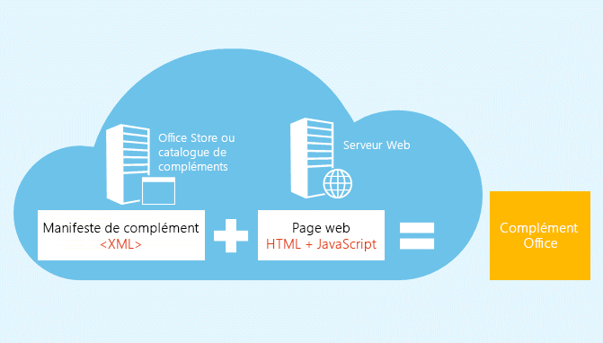
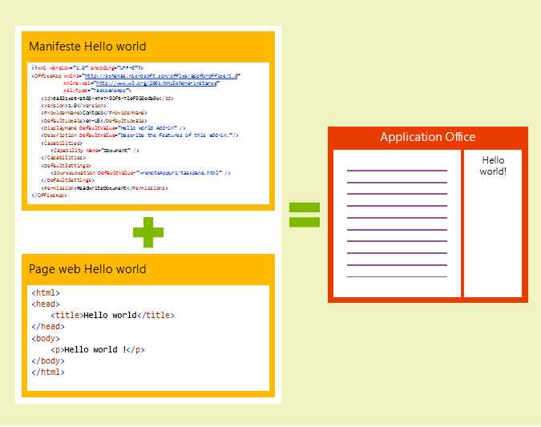
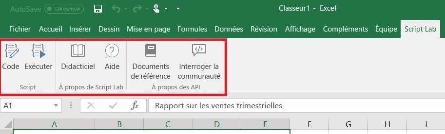
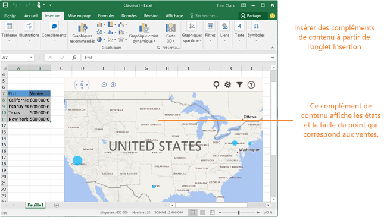

# Vue d’ensemble de la plateforme de compléments pour Office

La plateforme des compléments Office permet de créer des solutions qui étendent des applications Office et interagissent avec du contenu dans des documents Office. Les compléments Office vous permettent d’utiliser des technologies web que vous connaissez, telles que le code HTML, CSS et JavaScript, pour étendre Word, Excel, PowerPoint, OneNote, Project et Outlook, et interagir avec ces programmes. Votre solution peut être exécutée dans Office sur plusieurs plateformes, notamment Office pour Windows, Office Online, Office pour Mac et Office pour iPad.

Les compléments Office offrent presque les mêmes possibilités qu’une page web dans un navigateur. Vous pouvez utiliser la plateforme des compléments Office pour :

-  **Ajout de nouvelles fonctionnalités à des clients Office :** vous pouvez importer des données externes dans Office, automatiser des documents Office, exposer des fonctionnalités tierces dans des clients Office et bien plus encore. Par exemple, vous pouvez utiliser l’API Microsoft Graph pour établir une connexion vers des données qui améliorent la productivité. 
    
-  **Créer de nouveaux objets interactifs et enrichis qui peuvent être incorporés dans des documents Office :** vous pouvez incorporer des cartes, des graphiques et des visualisations interactives que les utilisateurs peuvent ajouter à leurs feuilles de calcul Excel et présentations PowerPoint. 
    
## En quoi les compléments Office sont-ils différents des compléments COM et VSTO ? 

Les compléments COM ou VSTO sont des solutions d’intégration à Office antérieures qui s’exécutent uniquement sur Office pour Windows. Contrairement aux compléments COM, les compléments Office n’incluent pas de code exécuté sur l’appareil de l’utilisateur ou sur le client Office. Pour un complément Office, l’application hôte, par exemple Excel, lit le manifeste du complément et insère les commandes de menu et les boutons de ruban personnalisés du complément dans l’interface utilisateur. Lorsque cela est nécessaire, elle charge le code JavaScript et HTML du complément, qui est exécuté dans le contexte d’un navigateur dans un bac à sable (sandbox). 

Les compléments Office offrent les avantages suivants par rapport aux compléments créés à l’aide de VBA, COM ou VSTO : 

- Prise en charge sur plusieurs plateformes. Les compléments Office s’exécutent dans Office pour Windows, Mac, iOS et Office Online. 

- Authentification unique (SSO) : les compléments Office s’intègrent facilement à des comptes d’utilisateurs Office 365. 

- Déploiement et distribution centralisés. Les administrateurs peuvent déployer des compléments Office de façon centralisée dans une organisation. 

- Accès facile via AppSource. Vous pouvez mettre votre solution à disposition d’un large public en l’envoyant à AppSource. 

- S’appuie sur des technologies web standard. Vous pouvez utiliser n’importe quelle bibliothèque pour créer des compléments Office. 

## Composants d’un complément Office 

Un complément Office inclut deux composants de base : un fichier manifeste XML et votre propre application web. Le manifeste définit différents paramètres, y compris la façon dont votre complément s’intègre avec les clients Office. Votre application web doit être hébergée sur un serveur web ou un service d’hébergement web, tel que Microsoft Azure.

*Figure 1. Manifeste + page web = complément Office*

### Manifeste 

Le manifeste est un fichier XML qui spécifie les paramètres et les fonctionnalités du complément, notamment : 

- Le nom d’affichage, la description, l’ID, la version et les paramètres régionaux par défaut du complément. 

- La façon dont le complément s’intègre à Office.  

- Le niveau d’autorisation et les conditions d’accès aux données pour le complément. 

### Application web 

Le complément Office le plus simple est composé d’une page HTML statique qui est affichée dans une application Office, mais qui n’interagit pas avec le document Office ou une autre ressource Internet. Toutefois, pour créer un complément qui interagit avec des documents Office ou permet à l’utilisateur d’interagir avec les ressources en ligne à partir d’une application hôte Office, vous pouvez utiliser n’importe quelle technologie, aussi bien côté client que serveur, prise en charge par votre fournisseur d’hébergement (par exemple, ASP.NET, PHP ou Node.js). Pour interagir avec des clients et des documents Office, vous pouvez utiliser les API JavaScript Office.js. 

*Figure 2. Composants d’un complément Office Hello World*

## Extension des clients Office et interaction avec ces clients 

Les compléments Office offrent les possibilités suivantes dans une application Office hôte : 

-  Étendre les fonctionnalités (toutes les applications Office) 

-  Créer de nouveaux objets (Excel ou PowerPoint) 
 
### Étendre les fonctionnalités d’Office 

Vous pouvez ajouter de nouvelles fonctionnalités aux applications Office via les éléments d’interface suivants :  

-  Commandes de menu et boutons de ruban personnalisées (collectivement appelés « commandes de complément ») 

-  Volets Office à insérer 

Les éléments d’interface personnalisés et les volets Office sont définis dans le manifeste du complément.  

#### Commandes de menu et boutons personnalisés  

Vous pouvez ajouter des éléments de menu et des boutons de ruban personnalisé au ruban d’Office pour bureau Windows et Office Online. Les utilisateurs peuvent ainsi accéder à votre complément directement à partir de leur application Office. Les boutons de commande peuvent lancer différentes actions, par exemple afficher un volet Office comportant du contenu HTML personnalisé ou exécuter une fonction JavaScript.  

*Figure 3. Commandes de complément en cours d’exécution dans Excel (version de bureau)*

#### Volets Office  

Vous pouvez utiliser des volets Office en plus des commandes de complément pour permettre aux utilisateurs d’interagir avec votre solution. Les clients qui ne prennent pas en charge les commandes de complément (Office 2013 et Office pour iPad) exécutent votre complément sous la forme d’un volet Office. Les utilisateurs lancent les compléments de volet Office via le bouton **Mes compléments** situé sous l’onglet **Insertion**. 

*Figure 4. Volet Office*

### Extension des fonctionnalités Outlook 

Les compléments Outlook peuvent développer le ruban Office et s’afficher en regard d’un élément Outlook quand vous le visualisez ou le composez. Ils fonctionnent avec un message électronique, une demande de réunion, une réponse à une demande de réunion, une annulation de réunion ou un rendez-vous quand l’utilisateur visualise un élément reçu, répond à un élément ou en crée un. 

Les compléments Outlook peuvent accéder à des informations contextuelles à partir de l’élément, telles qu’une adresse ou un ID de suivi, et utiliser ces données pour accéder à d’autres informations sur le serveur ou provenant de services web pour créer des expériences utilisateur attrayantes. Dans la plupart des cas, un complément Outlook peut être exécuté sans modification sur les différentes applications hôte prise en charge, notamment Outlook, Outlook pour Mac, Outlook Web App et Outlook Web App pour appareils, afin d’offrir une expérience homogène sur le bureau, en ligne, sur les tablettes et sur les appareils mobiles. 

Pour accéder à une vue d’ensemble des compléments Outlook, reportez-vous à la rubrique [Présentation des compléments Outlook](https://docs.microsoft.com/fr-fr/outlook/add-ins/). 

### Création d’objets dans des documents Office 

Vous pouvez incorporer des objets web, appelés compléments de contenu, dans des documents Excel et PowerPoint. Ces compléments de contenu vous permettent d’intégrer des visualisations de données web enrichies, du contenu multimédia (comme un lecteur vidéo YouTube ou une galerie d’images) et d’autres types de contenu externe.

*Figure 5. Complément de contenu*

## API JavaScript pour Office 

Les API JavaScript Office sont composées d’objets et de membres permettant de créer des compléments et d’interagir avec le contenu Office et les services web. Il existe un modèle objet commun que se partagent Excel, Outlook, Word, PowerPoint, OneNote et Project. Il existe également des modèles objet plus complets et propres à l’hôte pour Excel et Word. Ces API permettent d’accéder à des objets connus tels que des paragraphes et des classeurs, ce qui facilite la création de complément pour un hôte spécifique.  

## Étapes suivantes 

Pour plus d’informations sur la façon de commencer à créer votre complément Office, essayez notre [Démarrage rapide en 5 minutes](https://docs.microsoft.com/fr-fr/office/dev/add-ins/). Vous pouvez commencer à créer des compléments de suite en utilisant Visual Studio ou tout autre éditeur. 

Pour commencer à concevoir des solutions offrant des expériences utilisateur efficaces et attrayantes, consultez les [instructions de conception](../design/add-in-design.md) et les [meilleures pratiques](../concepts/add-in-development-best-practices.md) pour les compléments Office.    
   
## Voir aussi

- [Exemples de compléments Office](https://dev.office.com/code-samples)
- [Présentation de l’API JavaScript pour Office](../develop/understanding-the-javascript-api-for-office.md)
- [Disponibilité des compléments Office sur les plateformes et les hôtes](../overview/office-add-in-availability.md)

    
