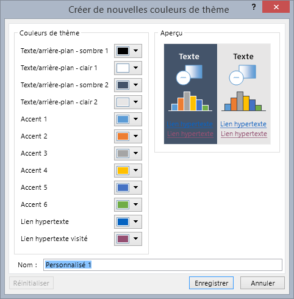
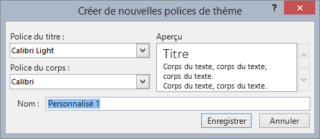
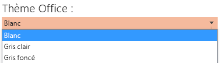
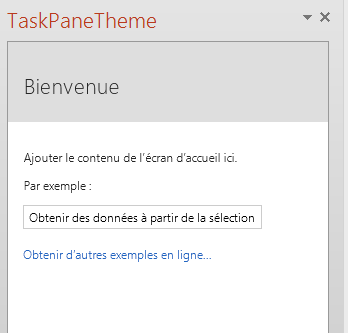

# <a name="use-document-themes-in-your-powerpoint-add-ins"></a><span data-ttu-id="2768c-102">Utiliser des thèmes de document dans vos compléments PowerPoint</span><span class="sxs-lookup"><span data-stu-id="2768c-102">Use document themes in your PowerPoint add-ins</span></span>

<span data-ttu-id="2768c-p101">Un [thème Office](https://support.office.com/Article/What-is-a-theme--7528ccc2-4327-4692-8bf5-9b5a3f2a5ef5) est constitué, en partie, d’un jeu de polices et de couleurs visuellement assortis que vous pouvez appliquer à des présentations, des documents, des feuilles de calcul et des courriers électroniques. Pour appliquer ou personnaliser le thème d’une présentation dans PowerPoint, utilisez les groupes **Thèmes** et **Variantes** dans l’onglet **Conception** du ruban. PowerPoint affecte le **thème Office** par défaut à chaque nouvelle présentation vierge, mais vous pouvez choisir parmi les autres thèmes disponibles dans l’onglet **Conception**, télécharger des thèmes supplémentaires à partir d’Office.com, ou créer et personnaliser votre propre thème.</span><span class="sxs-lookup"><span data-stu-id="2768c-p101">An [Office theme](https://support.office.com/Article/What-is-a-theme--7528ccc2-4327-4692-8bf5-9b5a3f2a5ef5) consists, in part, of a visually coordinated set of fonts and colors that you can apply to presentations, documents, worksheets, and emails. To apply or customize the theme of a presentation in PowerPoint, you use the **Themes** and **Variants** groups on **Design** tab of the ribbon. PowerPoint assigns a new blank presentation with the default **Office Theme**, but you can choose other themes available on the **Design** tab, download additional themes from Office.com, or create and customize your own theme.</span></span>

<span data-ttu-id="2768c-106">OfficeThemes.css vous permet de concevoir des compléments coordonnés à PowerPoint de deux façons :</span><span class="sxs-lookup"><span data-stu-id="2768c-106">Using OfficeThemes.css, helps you design add-ins that are coordinated with PowerPoint in two ways:</span></span>

- <span data-ttu-id="2768c-p102">**Dans les compléments de contenu pour PowerPoint**. Utilisez les classes de thèmes du document d’OfficeThemes.css pour spécifier les polices et les couleurs correspondant au thème de la présentation dans laquelle votre contenu complément est inséré ; ces polices et couleurs seront mises à jour dynamiquement si un utilisateur modifie ou personnalise le thème de la présentation.</span><span class="sxs-lookup"><span data-stu-id="2768c-p102">**In content add-ins for PowerPoint**. Use the document theme classes of OfficeThemes.css to specify fonts and colors that match the theme of the presentation your content add-in is inserted into - and those fonts and colors will dynamically update if a user changes or customizes the presentation's theme.</span></span>
    
- <span data-ttu-id="2768c-p103">**Dans les compléments du volet Office pour PowerPoint**. Utilisez les classes de thèmes de l’interface utilisateur Office d’OfficeThemes.css pour spécifier les mêmes polices et couleurs d’arrière-plan que celles utilisées dans l’interface utilisateur, de sorte que vos compléments du volet Office correspondent aux couleurs des volets Office intégrés ; ces couleurs seront mises à jour dynamiquement si un utilisateur modifie le thème de l’interface utilisateur Office.</span><span class="sxs-lookup"><span data-stu-id="2768c-p103">**In task pane add-ins for PowerPoint**. Use the Office UI theme classes of OfficeThemes.css to specify the same fonts and background colors used in the UI so that your task pane add-ins will match the colors of built-in task panes - and those colors will dynamically update if a user changes the Office UI theme.</span></span>

### <a name="document-theme-colors"></a><span data-ttu-id="2768c-111">Couleurs de thème de document</span><span class="sxs-lookup"><span data-stu-id="2768c-111">Document theme colors</span></span>

<span data-ttu-id="2768c-p104">Chaque thème de document Office définit 12 couleurs. Dix de ces couleurs sont disponibles lorsque vous définissez la police, l’arrière-plan et d’autres paramètres de couleur dans une présentation grâce au sélecteur de couleurs.</span><span class="sxs-lookup"><span data-stu-id="2768c-p104">Every Office document theme defines 12 colors. Ten of these colors are available when you set font, background, and other color settings in a presentation with the color picker.</span></span>


<span data-ttu-id="2768c-115">Pour afficher ou personnaliser l’intégralité des 12 couleurs de thème dans PowerPoint, dans le groupe **Variantes** de l’onglet **Conception**, cliquez sur le menu déroulant **Plus**, puis choisissez **Couleur** > **Personnaliser les couleurs** pour afficher la boîte de dialogue **Créer de nouvelles couleurs de thème**.</span><span class="sxs-lookup"><span data-stu-id="2768c-115">To view or customize the full set of 12 theme colors in PowerPoint, in the  **Variants** group on the **Design** tab, click the **More** drop-down - then select **Colors** > **Customize Colors** to display the **Create New Theme Colors** dialog box.</span></span>



<span data-ttu-id="2768c-p105">Les quatre premières couleurs sont pour le texte et les arrière-plans. Un texte créé avec des couleurs claires sera toujours lisible sur les couleurs foncées, tandis qu’un texte créé avec des couleurs foncées sera toujours lisible sur les couleurs claires. Les six couleurs suivantes sont des couleurs d’accentuation qui sont toujours visibles sur les quatre couleurs d’arrière-plan potentielles. Les deux dernières couleurs sont pour les liens hypertexte et les liens hypertexte visités.</span><span class="sxs-lookup"><span data-stu-id="2768c-p105">The first four colors are for text and backgrounds. Text that is created with the light colors will always be legible over the dark colors, and text that is created with dark colors will always be legible over the light colors. The next six are accent colors that are always visible over the four potential background colors. The last two colors are for hyperlinks and followed hyperlinks.</span></span>

### <a name="document-theme-fonts"></a><span data-ttu-id="2768c-121">Polices de thème de document</span><span class="sxs-lookup"><span data-stu-id="2768c-121">Document theme fonts</span></span>

<span data-ttu-id="2768c-p106">Chaque thème de document Office définit également deux polices : une pour les titres et l’autre pour le corps de texte. PowerPoint utilise ces polices pour créer des styles de texte automatiques. En outre, les galeries **Styles rapides** pour le texte et **WordArt** utilisent ces mêmes polices de thème. Ces deux polices sont les deux premières proposées lorsque vous sélectionnez des polices avec le sélecteur de polices.</span><span class="sxs-lookup"><span data-stu-id="2768c-p106">Every Office document theme also defines two fonts -- one for headings and one for body text. PowerPoint uses these fonts to construct automatic text styles. In addition,  **Quick Styles** galleries for text and **WordArt** use these same theme fonts. These two fonts are available as the first two selections when you select fonts with the font picker.</span></span>


<span data-ttu-id="2768c-127">Pour afficher ou personnaliser les polices de thème dans PowerPoint, dans le groupe **Variantes** de l’onglet **Conception**, cliquez sur le menu déroulant **Plus**. Ensuite, sélectionnez **Polices** > **Personnaliser les polices** pour afficher la boîte de dialogue **Créer de nouvelles polices de thème**.</span><span class="sxs-lookup"><span data-stu-id="2768c-127">To view or customize theme fonts in PowerPoint, in the  **Variants** group on the **Design** tab, click the **More** drop-down - then select **Fonts** > **Customize Fonts** to display the **Create New Theme Fonts** dialog box.</span></span>



### <a name="office-ui-theme-fonts-and-colors"></a><span data-ttu-id="2768c-129">Couleurs et polices de thème de l’interface utilisateur Office</span><span class="sxs-lookup"><span data-stu-id="2768c-129">Office UI theme fonts and colors</span></span>

<span data-ttu-id="2768c-p107">Office vous permet également de choisir entre plusieurs thèmes prédéfinis qui spécifient certaines des couleurs et des polices utilisées dans l’interface utilisateur de toutes les applications Office. Pour cela, utilisez le menu déroulant  **Fichier** > **Compte** > **Thème Office** (dans toutes les applications Office).</span><span class="sxs-lookup"><span data-stu-id="2768c-p107">Office also lets you choose between several predefined themes that specify some of the colors and fonts used in the UI of all Office applications. To do that, you use the  **File** > **Account** > **Office Theme** drop-down (from any Office application).</span></span>



<span data-ttu-id="2768c-p108">OfficeThemes.css inclut des classes que vous pouvez utiliser dans vos compléments du volet Office pour PowerPoint afin qu’elles utilisent ces mêmes polices et couleurs. Cela vous permet de concevoir des compléments du volet Office dont l’apparence concorde avec celle des volets Office intégrés.</span><span class="sxs-lookup"><span data-stu-id="2768c-p108">OfficeThemes.css includes classes that you can use in your task pane add-ins for PowerPoint so they will use these same fonts and colors. This lets you design your task pane add-ins that match the appearance of built-in task panes.</span></span>

## <a name="using-officethemescss"></a><span data-ttu-id="2768c-135">Utilisation d’OfficeThemes.css</span><span class="sxs-lookup"><span data-stu-id="2768c-135">Using OfficeThemes.css</span></span>

<span data-ttu-id="2768c-p109">En utilisant le fichier OfficeThemes.css avec vos compléments de contenu pour PowerPoint, vous pouvez coordonner l’apparence de votre complément avec le thème appliqué à la présentation avec laquelle elle est exécutée. En utilisant le fichier OfficeThemes.css avec vos compléments du volet Office pour PowerPoint, vous pouvez coordonner l’apparence de votre complément avec les polices et couleurs de l’interface utilisateur Office.</span><span class="sxs-lookup"><span data-stu-id="2768c-p109">Using the OfficeThemes.css file with your content add-ins for PowerPoint lets you coordinate the appearance of your add-in with the theme applied to the presentation it's running with. Using the OfficeThemes.css file with your task pane add-ins for PowerPoint lets you coordinate the appearance of your add-in with the fonts and colors of the Office UI.</span></span>

### <a name="adding-the-officethemescss-file-to-your-project"></a><span data-ttu-id="2768c-138">Ajout du fichier OfficeThemes.css à votre projet</span><span class="sxs-lookup"><span data-stu-id="2768c-138">Adding the OfficeThemes.css file to your project</span></span>

<span data-ttu-id="2768c-139">Suivez la procédure suivante pour ajouter et référencer le fichier OfficeThemes.css dans votre projet complément.</span><span class="sxs-lookup"><span data-stu-id="2768c-139">Use the following steps to add and reference the OfficeThemes.css file to your add-in project.</span></span>

#### <a name="to-add-officethemescss-to-your-visual-studio-project"></a><span data-ttu-id="2768c-140">Pour ajouter le fichier OfficeThemes.css à votre projet Visual Studio</span><span class="sxs-lookup"><span data-stu-id="2768c-140">To add OfficeThemes.css to your Visual Studio project</span></span>

> [!NOTE]
> <span data-ttu-id="2768c-141">Les étapes décrites dans cette procédure s’appliquent uniquement à Visual Studio 2015.</span><span class="sxs-lookup"><span data-stu-id="2768c-141">The steps in this procedure only apply to Visual Studio 2015.</span></span> <span data-ttu-id="2768c-142">Si vous utilisez Visual Studio 2019, le fichier OfficeThemes. CSS est créé automatiquement pour tous les nouveaux projets de complément PowerPoint que vous créez.</span><span class="sxs-lookup"><span data-stu-id="2768c-142">If you are using Visual Studio 2019, the OfficeThemes.css file is created automatically for any new PowerPoint add-in projects that you create.</span></span>

1. <span data-ttu-id="2768c-143">Dans l’**explorateur de solutions**, cliquez avec le bouton droit de la souris sur le dossier **Contenu** dans le projet _**project_name**_**Web**, sélectionnez **Ajouter** et **Feuille de style**.</span><span class="sxs-lookup"><span data-stu-id="2768c-143">In **Solution Explorer**, right-click the **Content** folder in the _**project_name**_**Web** project, choose **Add**, and then select **Style Sheet**.</span></span>
    
2. <span data-ttu-id="2768c-144">Nommez la nouvelle feuille de style **OfficeThemes**.</span><span class="sxs-lookup"><span data-stu-id="2768c-144">Name the new style sheet **OfficeThemes**.</span></span>
    
   > [!IMPORTANT]
   > <span data-ttu-id="2768c-145">Le nom de la feuille de style doit être OfficeThemes, sinon la fonctionnalité qui met à jour dynamiquement les polices et couleurs de complément lorsqu’un utilisateur modifie le thème ne fonctionnera pas.</span><span class="sxs-lookup"><span data-stu-id="2768c-145">The style sheet must be named OfficeThemes, or the feature that dynamically updates add-in fonts and colors when a user changes the theme won't work.</span></span>
   
3. <span data-ttu-id="2768c-146">Supprimez la classe **body** par défaut (`body {}`) dans le fichier, et copiez-collez le code CSS suivant dans le fichier.</span><span class="sxs-lookup"><span data-stu-id="2768c-146">Delete the default **body** class (`body {}`) in the file, and copy and paste the following CSS code into the file.</span></span>
    
    ```css
    /* The following classes describe the common theme information for office documents */ 

    /* Basic Font and Background Colors for text */ 
    .office-docTheme-primary-fontColor { color:#000000; } 
    .office-docTheme-primary-bgColor { background-color:#ffffff; } 
    .office-docTheme-secondary-fontColor { color: #000000; } 
    .office-docTheme-secondary-bgColor { background-color: #ffffff; } 

    /* Accent color definitions for fonts */ 
    .office-contentAccent1-color { color:#5b9bd5; } 
    .office-contentAccent2-color { color:#ed7d31; } 
    .office-contentAccent3-color { color:#a5a5a5; } 
    .office-contentAccent4-color { color:#ffc000; } 
    .office-contentAccent5-color { color:#4472c4; } 
    .office-contentAccent6-color { color:#70ad47; } 

    /* Accent color for backgrounds */ 
    .office-contentAccent1-bgColor { background-color:#5b9bd5; } 
    .office-contentAccent2-bgColor { background-color:#ed7d31; } 
    .office-contentAccent3-bgColor { background-color:#a5a5a5; } 
    .office-contentAccent4-bgColor { background-color:#ffc000; } 
    .office-contentAccent5-bgColor { background-color:#4472c4; } 
    .office-contentAccent6-bgColor { background-color:#70ad47; } 

    /* Accent color for borders */ 
    .office-contentAccent1-borderColor { border-color:#5b9bd5; } 
    .office-contentAccent2-borderColor { border-color:#ed7d31; } 
    .office-contentAccent3-borderColor { border-color:#a5a5a5; } 
    .office-contentAccent4-borderColor { border-color:#ffc000; } 
    .office-contentAccent5-borderColor { border-color:#4472c4; } 
    .office-contentAccent6-borderColor { border-color:#70ad47; } 

    /* links */ 
    .office-a { color: #0563c1; } 
    .office-a:visited { color: #954f72; } 

    /* Body Fonts */ 
    .office-bodyFont-eastAsian { } /* East Asian name of the Font */ 
    .office-bodyFont-latin { font-family:"Calibri"; } /* Latin name of the Font */ 
    .office-bodyFont-script { } /* Script name of the Font */ 
    .office-bodyFont-localized { font-family:"Calibri"; } /* Localized name of the Font. Corresponds to the default font of the culture currently used in Office.*/ 

    /* Headers Font */ 
    .office-headerFont-eastAsian { } 
    .office-headerFont-latin { font-family:"Calibri Light"; } 
    .office-headerFont-script { } 
    .office-headerFont-localized { font-family:"Calibri Light"; } 

    /* The following classes define font and background colors for Office UI themes. These classes should only be used in task pane add-ins */ 

    /* Basic Font and Background Colors for PPT */ 
    .office-officeTheme-primary-fontColor { color:#b83b1d; } 
    .office-officeTheme-primary-bgColor { background-color:#dedede; } 
    .office-officeTheme-secondary-fontColor { color:#262626; } 
    .office-officeTheme-secondary-bgColor { background-color:#ffffff; }
    ```
4. <span data-ttu-id="2768c-147">Si vous utilisez un autre outil que Visual Studio pour créer votre complément, copiez le code CSS de l’étape 3 dans un fichier texte, en vous assurant que le fichier est enregistré sous le nom OfficeThemes.css.</span><span class="sxs-lookup"><span data-stu-id="2768c-147">If you are using a tool other than Visual Studio to create your add-in, copy the CSS code from step 3 into a text file, making sure to save the file as OfficeThemes.css.</span></span>   

### <a name="referencing-officethemescss-in-your-add-ins-html-pages"></a><span data-ttu-id="2768c-148">Référencement d’OfficeThemes.css dans les pages HTML de votre complément</span><span class="sxs-lookup"><span data-stu-id="2768c-148">Referencing OfficeThemes.css in your add-in's HTML pages</span></span>

<span data-ttu-id="2768c-149">Pour utiliser le fichier OfficeThemes.css dans votre projet de complément, ajoutez une balise `<link>` référençant le fichier OfficeThemes.css à l’intérieur de la balise `<head>` des pages web (par exemple, un fichier .html, .aspx ou .php) qui implémentent l’interface utilisateur de votre complément au format suivant :</span><span class="sxs-lookup"><span data-stu-id="2768c-149">To use the OfficeThemes.css file in your add-in project, add a `<link>` tag that references the OfficeThemes.css file inside the `<head>` tag of the web pages (such as an .html, .aspx, or .php file) that implement the UI of your add-in in this format:</span></span>

```HTML
<link href="<local_path_to_OfficeThemes.css>" rel="stylesheet" type="text/css" />
```

<span data-ttu-id="2768c-150">Pour effectuer cette opération dans Visual Studio, procédez comme suit.</span><span class="sxs-lookup"><span data-stu-id="2768c-150">To do this in Visual Studio, follow these steps.</span></span>

#### <a name="to-reference-officethemescss-in-your-add-in-for-powerpoint"></a><span data-ttu-id="2768c-151">Pour référencer OfficeThemes.css dans votre complément PowerPoint</span><span class="sxs-lookup"><span data-stu-id="2768c-151">To reference OfficeThemes.css in your add-in for PowerPoint</span></span>

1. <span data-ttu-id="2768c-152">Choisissez **créer un nouveau projet**.</span><span class="sxs-lookup"><span data-stu-id="2768c-152">Choose **Create a new project**.</span></span>

2. <span data-ttu-id="2768c-153">À l’aide de la zone de recherche, entrez **complément**.</span><span class="sxs-lookup"><span data-stu-id="2768c-153">Using the search box, enter **add-in**.</span></span> <span data-ttu-id="2768c-154">Choisissez **complément Web PowerPoint**, puis cliquez sur **suivant**.</span><span class="sxs-lookup"><span data-stu-id="2768c-154">Choose **PowerPoint Web Add-in**, then select **Next**.</span></span>

3. <span data-ttu-id="2768c-155">Nommez votre projet et sélectionnez **créer**.</span><span class="sxs-lookup"><span data-stu-id="2768c-155">Name your project and select **Create**.</span></span>

3. <span data-ttu-id="2768c-156">Dans la fenêtre de la boîte de dialogue **Créer un complément Office**, choisissez **Ajouter de nouvelles fonctionnalités à PowerPoint**, puis sélectionnez **Terminer** pour créer le projet.</span><span class="sxs-lookup"><span data-stu-id="2768c-156">In the **Create Office Add-in** dialog window, choose **Add new functionalities to PowerPoint**, and then choose **Finish** to create the project.</span></span>

4. <span data-ttu-id="2768c-p112">Visual Studio crée une solution et ses deux projets apparaissent dans l’**explorateur de solutions**. Le fichier **Home.html** s’ouvre dans Visual Studio.</span><span class="sxs-lookup"><span data-stu-id="2768c-p112">Visual Studio creates a solution and its two projects appear in **Solution Explorer**. The **Home.html** file opens in Visual Studio.</span></span>

5. <span data-ttu-id="2768c-159">Dans les pages HTML qui implémentent l’interface utilisateur de votre complément, telles que Home.html dans le modèle par défaut, ajoutez la balise `<link>` suivante à l’intérieur de la balise `<head>` qui référence le fichier OfficeThemes.css :</span><span class="sxs-lookup"><span data-stu-id="2768c-159">In the HTML pages that implement the UI of your add-in, such as Home.html in the default template, add the following `<link>` tag inside the `<head>` tag that references the OfficeThemes.css file:</span></span>
    
    ```HTML
    <link href="../../Content/OfficeThemes.css" rel="stylesheet" type="text/css" />
    ```

<span data-ttu-id="2768c-160">Si vous créez votre complément avec un outil autre que Visual Studio, ajoutez une balise `<link>` avec le même format spécifiant un chemin d’accès relatif vers la copie d’OfficeThemes.css qui sera déployée avec votre complément.</span><span class="sxs-lookup"><span data-stu-id="2768c-160">If you are creating your add-in with a tool other than Visual Studio, add a `<link>` tag with the same format specifying a relative path to the copy of OfficeThemes.css that will be deployed with your add-in.</span></span>

### <a name="using-officethemescss-document-theme-classes-in-your-content-add-ins-html-page"></a><span data-ttu-id="2768c-161">Utilisation de classes de thèmes de document OfficeThemes.css dans la page HTML de votre complément de contenu</span><span class="sxs-lookup"><span data-stu-id="2768c-161">Using OfficeThemes.css document theme classes in your content add-in's HTML page</span></span>

<span data-ttu-id="2768c-p113">Ci-dessous figure un exemple simple de code HTML dans une complément de contenu qui utilise les classes de thèmes de document OfficeTheme.css. Pour plus d’informations sur les classes OfficeThemes.css qui correspondent aux 12 couleurs et aux 2 polices utilisées dans un thème de document, voir [Classes de thèmes pour les compléments de contenu](#theme-classes-for-content-add-ins).</span><span class="sxs-lookup"><span data-stu-id="2768c-p113">The following shows a simple example of HTML in a content add-in that uses the OfficeTheme.css document theme classes. For details about the OfficeThemes.css classes that correspond to the 12 colors and 2 fonts used in a document theme, see [Theme classes for content add-ins](#theme-classes-for-content-add-ins).</span></span>

```HTML
<body>
    <div id="themeSample" class="office-docTheme-primary-fontColor ">
        <h1 class="office-headerFont-latin">Hello world!</h1> 
        <h1 class="office-headerFont-latin office-contentAccent1-bgColor">Hello world!</h1> 
        <h1 class="office-headerFont-latin office-contentAccent2-bgColor">Hello world!</h1> 
        <h1 class="office-headerFont-latin office-contentAccent3-bgColor">Hello world!</h1> 
        <h1 class="office-headerFont-latin office-contentAccent4-bgColor">Hello world!</h1> 
        <h1 class="office-headerFont-latin office-contentAccent5-bgColor">Hello world!</h1> 
        <h1 class="office-headerFont-latin office-contentAccent6-bgColor">Hello world!</h1> 
        <p class="office-bodyFont-latin office-docTheme-secondary-fontColor">Hello world!</p> 
    </div>
</body>
```

<span data-ttu-id="2768c-164">Lors de l’exécution, lorsque le complément de contenu est inséré dans une présentation qui utilise le **thème Office** par défaut, il est restitué comme suit.</span><span class="sxs-lookup"><span data-stu-id="2768c-164">At runtime, when inserted into a presentation that uses the default  **Office Theme**, the content add-in is rendered like this.</span></span>


<span data-ttu-id="2768c-p114">Si vous modifiez la présentation afin d’utiliser un autre thème ou de personnaliser le thème de la présentation, les polices et couleurs spécifiées avec des classes OfficeThemes.css sont mises à jour dynamiquement pour correspondre aux polices et aux couleurs du thème de la présentation. En prenant l’exemple HTML ci-dessus, si la présentation dans laquelle le complément est inséré utilise le thème **Facette**, le complément est restitué comme suit.</span><span class="sxs-lookup"><span data-stu-id="2768c-p114">If you change the presentation to use another theme or customize the presentation's theme, the fonts and colors specified with OfficeThemes.css classes will dynamically update to correspond to the fonts and colors of the presentation's theme. Using the same HTML example as above, if the presentation the add-in is inserted into uses the **Facet** theme, the add-in rendering will look like this.</span></span>


### <a name="using-officethemescss-office-ui-theme-classes-in-your-task-pane-add-ins-html-page"></a><span data-ttu-id="2768c-169">Utilisation de classes de thèmes de l’interface utilisateur Office OfficeThemes.css dans la page HTML de votre complément du volet Office</span><span class="sxs-lookup"><span data-stu-id="2768c-169">Using OfficeThemes.css Office UI theme classes in your task pane add-in's HTML page</span></span>

<span data-ttu-id="2768c-170">Outre le thème du document, les utilisateurs peuvent personnaliser le modèle de couleurs de l’interface utilisateur Office de toutes les applications Office à l’aide de la zone de liste déroulante **Fichier** > **Compte** > **Thème Office**.</span><span class="sxs-lookup"><span data-stu-id="2768c-170">In addition to the document theme, users can customize the color scheme of the Office user interface for all Office applications using the **File** > **Account** > **Office Theme** drop-down box.</span></span>

<span data-ttu-id="2768c-p115">Ci-dessous figure un exemple simple de code HTML dans une complément de volet Office qui utilise des classes OfficeTheme.css pour spécifier les couleurs de police et d’arrière-plan. Pour plus d’informations sur les classes OfficeThemes.css qui correspondent aux polices et aux couleurs du thème de l’interface utilisateur Office, voir [Classes de thèmes pour les compléments du volet Office](#theme-classes-for-task-pane-add-ins).</span><span class="sxs-lookup"><span data-stu-id="2768c-p115">The following shows a simple example of HTML in a task pane add-in that uses OfficeTheme.css classes to specify font color and background color. For details about the OfficeThemes.css classes that correspond to fonts and colors of the Office UI theme, see [Theme classes for task pane add-ins](#theme-classes-for-task-pane-add-ins).</span></span>

```HTML
<body> 
    <div id="content-header" class="office-officeTheme-primary-fontColor office-officeTheme-primary-bgColor"> 
        <div class="padding">
            <h1>Welcome</h1>
        </div> 
    </div> 
    <div id="content-main" class="office-officeTheme-secondary-fontColor office-officeTheme-secondary-bgColor"> 
        <div class="padding"> 
            <p>Add home screen content here.</p> 
            <p>For example:</p> 
            <button id="get-data-from-selection">Get data from selection</button> 
            <p><a target="_blank" class="office-a" href="https://go.microsoft.com/fwlink/?LinkId=276812">Find more samples online...</a></p>
        </div>
    </div>
</body> 
```

<br/>

<span data-ttu-id="2768c-173">Lors de l’exécution de PowerPoint avec **Fichier** > **Compte** > **Thème Office** défini sur **Blanc**, le complément de volet de tâches est restitué comme suit.</span><span class="sxs-lookup"><span data-stu-id="2768c-173">When running in PowerPoint with **File** > **Account** > **Office Theme** set to **White**, the task pane add-in is rendered like this.</span></span>


<br/>

<span data-ttu-id="2768c-175">Si vous modifiez la valeur de **Thème Office** en la définissant sur **Gris foncé**, les polices et couleurs spécifiées avec des classes OfficeThemes.css seront mises à jour dynamiquement et seront restituées comme suit.</span><span class="sxs-lookup"><span data-stu-id="2768c-175">If you change **OfficeTheme** to **Dark Gray**, the fonts and colors specified with OfficeThemes.css classes will dynamically update to render like this.</span></span>



<br/>

## <a name="officethemecss-classes"></a><span data-ttu-id="2768c-177">Classes OfficeTheme.css</span><span class="sxs-lookup"><span data-stu-id="2768c-177">OfficeTheme.css classes</span></span>

<span data-ttu-id="2768c-178">Le fichier OfficeThemes.css contient deux jeux de classes que vous pouvez utiliser avec vos compléments de contenu et du volet Office PowerPoint.</span><span class="sxs-lookup"><span data-stu-id="2768c-178">The OfficeThemes.css file contains two sets of classes you can use with your content and task pane add-ins for PowerPoint.</span></span>

### <a name="theme-classes-for-content-add-ins"></a><span data-ttu-id="2768c-179">Classes de thèmes pour les compléments de contenu</span><span class="sxs-lookup"><span data-stu-id="2768c-179">Theme classes for content add-ins</span></span>

<span data-ttu-id="2768c-p116">Le fichier OfficeThemes.css fournit des classes qui correspondent aux 12 couleurs et aux 2 polices utilisées dans un thème de document. Ces classes sont adaptées aux compléments de contenu pour PowerPoint, de sorte que les polices et les couleurs de votre complément seront en harmonie avec la présentation dans laquelle votre complément est inséré.</span><span class="sxs-lookup"><span data-stu-id="2768c-p116">The OfficeThemes.css file provides classes that correspond to the 2 fonts and 12 colors used in a document theme. These classes are appropriate to use with content add-ins for PowerPoint so that your add-in's fonts and colors will be coordinated with the presentation it's inserted into.</span></span>

#### <a name="theme-fonts-for-content-add-ins"></a><span data-ttu-id="2768c-182">Polices de thème pour les compléments de contenu</span><span class="sxs-lookup"><span data-stu-id="2768c-182">Theme fonts for content add-ins</span></span>

|<span data-ttu-id="2768c-183">**Classe**</span><span class="sxs-lookup"><span data-stu-id="2768c-183">**Class**</span></span>|<span data-ttu-id="2768c-184">**Description**</span><span class="sxs-lookup"><span data-stu-id="2768c-184">**Description**</span></span>|
|:-----|:-----|
| `office-bodyFont-eastAsian`|<span data-ttu-id="2768c-185">Nom en langues d’Asie de l’Est de la police du corps de texte.</span><span class="sxs-lookup"><span data-stu-id="2768c-185">East Asian name of the body font.</span></span>|
| `office-bodyFont-latin`|<span data-ttu-id="2768c-p117">Nom latin de la police du corps de texte (par défaut, « Calibri »).</span><span class="sxs-lookup"><span data-stu-id="2768c-p117">Latin name of the body font. Default "Calabri"</span></span>|
| `office-bodyFont-script`|<span data-ttu-id="2768c-188">Nom de script de la police du corps de texte.</span><span class="sxs-lookup"><span data-stu-id="2768c-188">Script name of the body font.</span></span>|
| `office-bodyFont-localized`|<span data-ttu-id="2768c-p118">Nom localisé de la police du corps de texte. Spécifie le nom de la police par défaut en fonction de la culture actuellement utilisée dans Office.</span><span class="sxs-lookup"><span data-stu-id="2768c-p118">Localized name of the body font. Specifies the default font name according to the culture currently used in Office.</span></span>|
| `office-headerFont-eastAsian`|<span data-ttu-id="2768c-191">Nom en langues d’Asie de l’Est de la police des en-têtes.</span><span class="sxs-lookup"><span data-stu-id="2768c-191">East Asian name of the headers font.</span></span>|
| `office-headerFont-latin`|<span data-ttu-id="2768c-p119">Nom latin de la police des en-têtes (par défaut, « Calibri Light »).</span><span class="sxs-lookup"><span data-stu-id="2768c-p119">Latin name of the headers font. Default "Calabri Light"</span></span>|
| `office-headerFont-script`|<span data-ttu-id="2768c-194">Nom de script de la police des en-têtes.</span><span class="sxs-lookup"><span data-stu-id="2768c-194">Script name of the headers font.</span></span>|
| `office-headerFont-localized`|<span data-ttu-id="2768c-p120">Nom localisé de la police des en-têtes. Spécifie le nom de la police par défaut en fonction de la culture actuellement utilisée dans Office.</span><span class="sxs-lookup"><span data-stu-id="2768c-p120">Localized name of the headers font. Specifies the default font name according to the culture currently used in Office.</span></span>|

<br/>

#### <a name="theme-colors-for-content-add-ins"></a><span data-ttu-id="2768c-197">Couleurs de thème pour les compléments de contenu</span><span class="sxs-lookup"><span data-stu-id="2768c-197">Theme colors for content add-ins</span></span>

|<span data-ttu-id="2768c-198">**Classe**</span><span class="sxs-lookup"><span data-stu-id="2768c-198">**Class**</span></span>|<span data-ttu-id="2768c-199">**Description**</span><span class="sxs-lookup"><span data-stu-id="2768c-199">**Description**</span></span>|
|:-----|:-----|
| `office-docTheme-primary-fontColor`|<span data-ttu-id="2768c-p121">Couleur de police principale. Par défaut : #000000</span><span class="sxs-lookup"><span data-stu-id="2768c-p121">Primary font color. Default #000000</span></span>|
| `office-docTheme-primary-bgColor`|<span data-ttu-id="2768c-p122">Couleur d’arrière-plan de police principale. Par défaut : #FFFFFF</span><span class="sxs-lookup"><span data-stu-id="2768c-p122">Primary font background color. Default #FFFFFF</span></span>|
| `office-docTheme-secondary-fontColor`|<span data-ttu-id="2768c-p123">Couleur de police secondaire. Par défaut : #000000</span><span class="sxs-lookup"><span data-stu-id="2768c-p123">Secondary font color. Default #000000</span></span>|
| `office-docTheme-secondary-bgColor`|<span data-ttu-id="2768c-p124">Couleur d’arrière-plan de police secondaire. Par défaut : #FFFFFF</span><span class="sxs-lookup"><span data-stu-id="2768c-p124">Secondary font background color. Default #FFFFFF</span></span>|
| `office-contentAccent1-color`|<span data-ttu-id="2768c-p125">Couleur d’accentuation de police 1. Par défaut : #5B9BD5</span><span class="sxs-lookup"><span data-stu-id="2768c-p125">Font accent color 1. Default #5B9BD5</span></span>|
| `office-contentAccent2-color`|<span data-ttu-id="2768c-p126">Couleur d’accentuation de police 2. Par défaut : #ED7D31</span><span class="sxs-lookup"><span data-stu-id="2768c-p126">Font accent color 2. Default #ED7D31</span></span>|
| `office-contentAccent3-color`|<span data-ttu-id="2768c-p127">Couleur d’accentuation de police 3. Par défaut : #A5A5A5</span><span class="sxs-lookup"><span data-stu-id="2768c-p127">Font accent color 3. Default #A5A5A5</span></span>|
| `office-contentAccent4-color`|<span data-ttu-id="2768c-p128">Couleur d’accentuation de police 4. Par défaut : #FFC000</span><span class="sxs-lookup"><span data-stu-id="2768c-p128">Font accent color 4. Default #FFC000</span></span>|
| `office-contentAccent5-color`|<span data-ttu-id="2768c-p129">Couleur d’accentuation de police 5. Par défaut : #4472C4</span><span class="sxs-lookup"><span data-stu-id="2768c-p129">Font accent color 5. Default #4472C4</span></span>|
| `office-contentAccent6-color`|<span data-ttu-id="2768c-p130">Couleur d’accentuation de police 6. Par défaut : #70AD47</span><span class="sxs-lookup"><span data-stu-id="2768c-p130">Font accent color 6. Default #70AD47</span></span>|
| `office-contentAccent1-bgColor`|<span data-ttu-id="2768c-p131">Couleur d’accentuation d’arrière-plan 1. Par défaut : #5B9BD5</span><span class="sxs-lookup"><span data-stu-id="2768c-p131">Background accent color 1. Default #5B9BD5</span></span>|
| `office-contentAccent2-bgColor`|<span data-ttu-id="2768c-p132">Couleur d’accentuation d’arrière-plan 2. Par défaut : #ED7D31</span><span class="sxs-lookup"><span data-stu-id="2768c-p132">Background accent color 2. Default #ED7D31</span></span>|
| `office-contentAccent3-bgColor`|<span data-ttu-id="2768c-p133">Couleur d’accentuation d’arrière-plan 3. Par défaut : #A5A5A5</span><span class="sxs-lookup"><span data-stu-id="2768c-p133">Background accent color 3. Default #A5A5A5</span></span>|
| `office-contentAccent4-bgColor`|<span data-ttu-id="2768c-p134">Couleur d’accentuation d’arrière-plan 4. Par défaut : #FFC000</span><span class="sxs-lookup"><span data-stu-id="2768c-p134">Background accent color 4. Default #FFC000</span></span>|
| `office-contentAccent5-bgColor`|<span data-ttu-id="2768c-p135">Couleur d’accentuation d’arrière-plan 5. Par défaut : #4472C4</span><span class="sxs-lookup"><span data-stu-id="2768c-p135">Background accent color 5. Default #4472C4</span></span>|
| `office-contentAccent6-bgColor`|<span data-ttu-id="2768c-p136">Couleur d’accentuation d’arrière-plan 6. Par défaut : #70AD47</span><span class="sxs-lookup"><span data-stu-id="2768c-p136">Background accent color 6. Default #70AD47</span></span>|
| `office-contentAccent1-borderColor`|<span data-ttu-id="2768c-p137">Couleur d’accentuation de bordure 1. Par défaut : #5B9BD5</span><span class="sxs-lookup"><span data-stu-id="2768c-p137">Border accent color 1. Default #5B9BD5</span></span>|
| `office-contentAccent2-borderColor`|<span data-ttu-id="2768c-p138">Couleur d’accentuation de bordure 2. Par défaut : #ED7D31</span><span class="sxs-lookup"><span data-stu-id="2768c-p138">Border accent color 2. Default #ED7D31</span></span>|
| `office-contentAccent3-borderColor`|<span data-ttu-id="2768c-p139">Couleur d’accentuation de bordure 3. Par défaut : #A5A5A5</span><span class="sxs-lookup"><span data-stu-id="2768c-p139">Border accent color 3. Default #A5A5A5</span></span>|
| `office-contentAccent4-borderColor`|<span data-ttu-id="2768c-p140">Couleur d’accentuation de bordure 4. Par défaut : #FFC000</span><span class="sxs-lookup"><span data-stu-id="2768c-p140">Border accent color 4. Default #FFC000</span></span>|
| `office-contentAccent5-borderColor`|<span data-ttu-id="2768c-p141">Couleur d’accentuation de bordure 5. Par défaut : #4472C4</span><span class="sxs-lookup"><span data-stu-id="2768c-p141">Border accent color 5. Default #4472C4</span></span>|
| `office-contentAccent6-borderColor`|<span data-ttu-id="2768c-p142">Couleur d’accentuation de bordure 6. Par défaut : #70AD47</span><span class="sxs-lookup"><span data-stu-id="2768c-p142">Border accent color 6. Default #70AD47</span></span>|
| `office-a`|<span data-ttu-id="2768c-p143">Couleur de lien hypertexte. Par défaut : #0563C1</span><span class="sxs-lookup"><span data-stu-id="2768c-p143">Hyperlink color. Default #0563C1</span></span>|
| `office-a:visited`|<span data-ttu-id="2768c-p144">Couleur de lien hypertexte visité. Par défaut : #954F72</span><span class="sxs-lookup"><span data-stu-id="2768c-p144">Followed hyperlink color. Default #954F72</span></span>|

<br/>

<span data-ttu-id="2768c-248">La capture d’écran suivante montre des exemples de toutes les classes de couleurs de thème (sauf pour les deux couleurs de lien hypertexte) affectées à du texte d’complément lorsque vous utilisez le thème Office par défaut.</span><span class="sxs-lookup"><span data-stu-id="2768c-248">The following screenshot shows examples of all of the theme color classes (except for the two hyperlink colors) assigned to add-in text when using the default Office theme.</span></span>


### <a name="theme-classes-for-task-pane-add-ins"></a><span data-ttu-id="2768c-250">Classes de thèmes pour les compléments du volet Office</span><span class="sxs-lookup"><span data-stu-id="2768c-250">Theme classes for task pane add-ins</span></span>

<span data-ttu-id="2768c-p145">Le fichier OfficeThemes.css fournit des classes qui correspondent aux 4 couleurs affectées aux polices et aux arrière-plans utilisés par le thème de l’interface utilisateur de l’application Office. Ces classes peuvent être utilisées avec les compléments de tâche pour PowerPoint afin que les couleurs de votre complément soient en harmonie avec les autres volets Office intégrés.</span><span class="sxs-lookup"><span data-stu-id="2768c-p145">The OfficeThemes.css file provides classes that correspond to the 4 colors assigned to fonts and backgrounds used by the Office application UI theme. These classes are appropriate to use with task add-ins for PowerPoint so that your add-in's colors will be coordinated with the other built-in task panes in Office.</span></span>

#### <a name="theme-font-and-background-colors-for-task-pane-add-ins"></a><span data-ttu-id="2768c-253">Couleurs de police et d’arrière-plan de thème pour les compléments du volet Office</span><span class="sxs-lookup"><span data-stu-id="2768c-253">Theme font and background colors for task pane add-ins</span></span>

|<span data-ttu-id="2768c-254">**Classe**</span><span class="sxs-lookup"><span data-stu-id="2768c-254">**Class**</span></span>|<span data-ttu-id="2768c-255">**Description**</span><span class="sxs-lookup"><span data-stu-id="2768c-255">**Description**</span></span>|
|:-----|:-----|
| `office-officeTheme-primary-fontColor`|<span data-ttu-id="2768c-p146">Couleur de police principale. Par défaut : #B83B1D</span><span class="sxs-lookup"><span data-stu-id="2768c-p146">Primary font color. Default #B83B1D</span></span>|
| `office-officeTheme-primary-bgColor`|<span data-ttu-id="2768c-p147">Couleur d’arrière-plan principale. Par défaut : #DEDEDE</span><span class="sxs-lookup"><span data-stu-id="2768c-p147">Primary background color. Default #DEDEDE</span></span>|
| `office-officeTheme-secondary-fontColor`|<span data-ttu-id="2768c-p148">Couleur de police secondaire. Par défaut : #262626.</span><span class="sxs-lookup"><span data-stu-id="2768c-p148">Secondary font color. Default #262626</span></span>|
| `office-officeTheme-secondary-bgColor`|<span data-ttu-id="2768c-p149">Couleur d’arrière-plan secondaire. Par défaut : #FFFFFF</span><span class="sxs-lookup"><span data-stu-id="2768c-p149">Secondary background color. Default #FFFFFF</span></span>|

## <a name="see-also"></a><span data-ttu-id="2768c-264">Voir aussi</span><span class="sxs-lookup"><span data-stu-id="2768c-264">See also</span></span>

- [<span data-ttu-id="2768c-265">Création de compléments de contenu et du volet Office pour PowerPoint</span><span class="sxs-lookup"><span data-stu-id="2768c-265">Create content and task pane add-ins for PowerPoint</span></span>](../powerpoint/powerpoint-add-ins.md)
