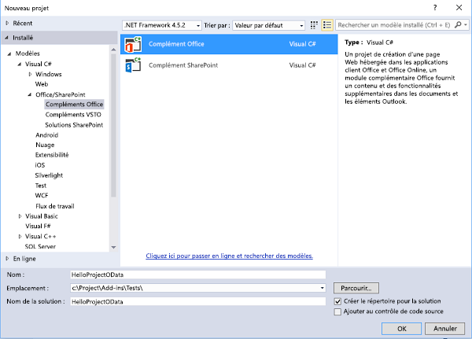
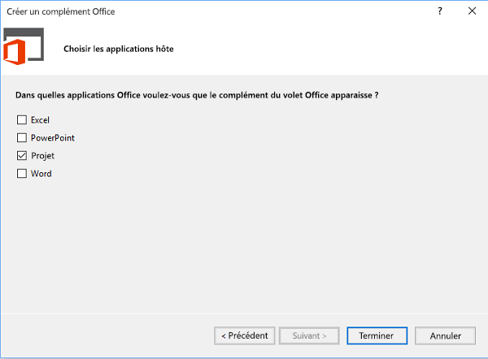
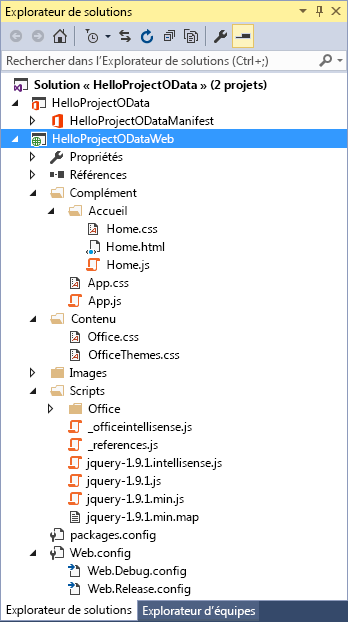
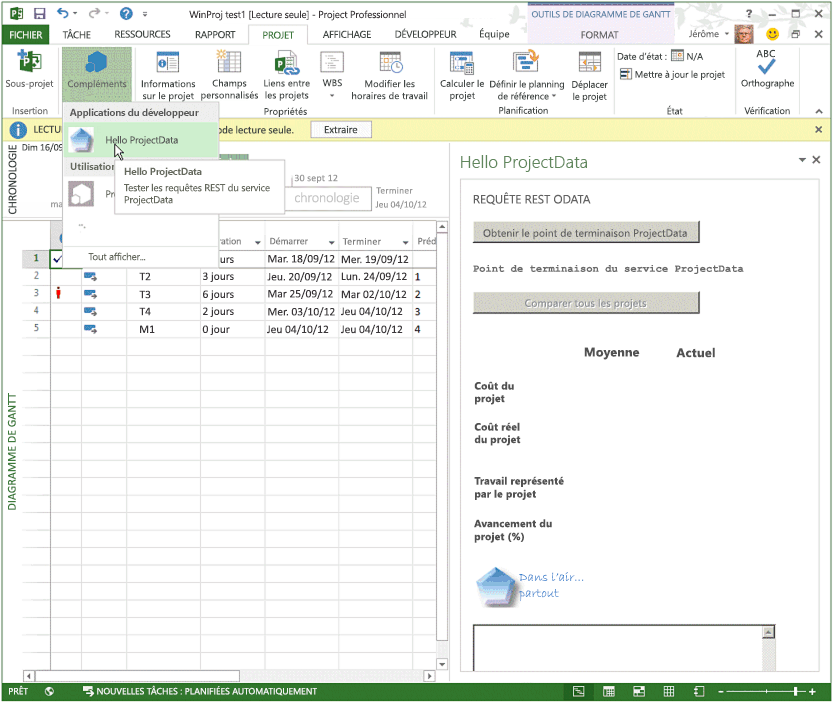
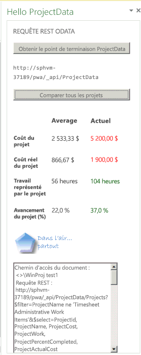
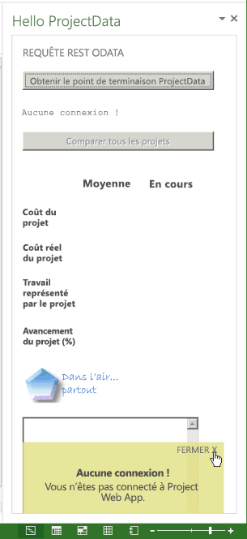
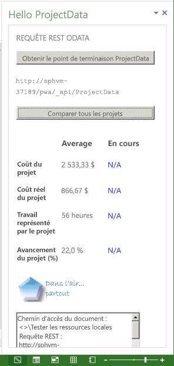

# <a name="create-a-project-add-in-that-uses-rest-with-an-on-premises-project-server-odata-service"></a>Créer un complément Project qui utilise REST avec un service OData Project Server local

Cet article décrit comment créer un complément de volet Office pour Project Professionnel 2013, qui compare les données de coût et les données de travail du projet actif avec les moyennes de tous les projets de l’instance actuelle de Project Web App. Le add-in utilise REST avec la bibliothèque jQuery pour accéder au service de rapports **OData ProjectData** dans Project Server 2013.

Le code de cet article est basé sur un exemple développé par Saurabh Sanghvi et Arvind Iyer, Microsoft Corporation.

## <a name="prerequisites-for-creating-a-task-pane-add-in-that-reads-project-server-reporting-data"></a>Conditions requises pour la création d’un complément du volet Office qui lit les données de rapport Project Server

Voici les conditions préalables à la création d’un Project du volet Des tâches qui lit le service **ProjectData** d’une instance Project Web App dans une installation sur site de Project Server 2013.

- Assurez-vous d’avoir installé les mises à jour Windows et les Service Packs les plus récents sur votre ordinateur de développement local. Le système d’exploitation peut être Windows 7, Windows 8, Windows Server 2008 ou Windows Server 2012.

- Project Professionnel 2013 est nécessaire pour la connexion à Project Web App. L’ordinateur de développement Project Professionnel 2013 doit être installé pour activer le débogage **F5** avec Visual Studio.

    > [!NOTE]
    > Project Standard 2013 peut également héberger des add-ins du volet Des tâches, mais ne peut pas se Project Web App.

- Visual Studio 2015 avec Outils de développement Office pour Visual Studio comprend des modèles permettant de créer des Compléments Office et SharePoint. Assurez-vous que vous avez installé la version la plus récente des outils de développement Office. Consultez la section  _Outils_ de la page relative aux [téléchargements de compléments Office et SharePoint](https://developer.microsoft.com/office/docs)

- Les procédures et les exemples de code de cet article accèdent au service **ProjectData** de Project Server 2013 dans un domaine local. Les méthodes jQuery de cet article ne fonctionnent pas avec Project sur le web.

    Vérifiez que le service **ProjectData** est accessible à partir de votre ordinateur de développement.

### <a name="procedure-1-to-verify-that-the-projectdata-service-is-accessible"></a>Procédure 1. Pour vérifier que le service ProjectData est accessible

1. Pour permettre à votre navigateur d’afficher directement les données XML à partir d’une requête REST, désactivez le mode Lecture du flux. Pour plus d’informations sur la façon d’y parvenir dans Internet Explorer, voir la procédure 1, étape 4 dans [Interrogation des flux OData pour les données de création de rapports Project](/previous-versions/office/project-odata/jj163048(v=office.15)).

2. Interrogez le service **ProjectData** à l’aide de votre navigateur avec l’URL suivante : **http://ServerName /ProjectServerName /_api/ProjectData**. Par exemple, si l’instance Project Web App est `http://MyServer/pwa` , le navigateur affiche les résultats suivants.

    ```xml
    <?xml version="1.0" encoding="utf-8"?>
        <service xml:base="http://myserver/pwa/_api/ProjectData/"
        xmlns="https://www.w3.org/2007/app"
        xmlns:atom="https://www.w3.org/2005/Atom">
        <workspace>
            <atom:title>Default</atom:title>
            <collection href="Projects">
                <atom:title>Projects</atom:title>
            </collection>
            <collection href="ProjectBaselines">
                <atom:title>ProjectBaselines</atom:title>
            </collection>
            <!-- ... and 33 more collection elements -->
        </workspace>
        </service>
    ```

3. Vous pouvez être amené à fournir vos informations d’identification réseau pour voir les résultats. Si le navigateur affiche un message similaire à « Erreur 403, accès refusé », cela signifie que vous n’avez pas d’autorisation d’ouverture de session pour cette instance de Project Web App, ou qu’il existe un problème réseau qui nécessite une aide de la part d’un administrateur.

## <a name="using-visual-studio-to-create-a-task-pane-add-in-for-project"></a>Utilisation de Visual Studio pour créer un complément du volet Office pour Project

Outils de développement Office pour Visual Studio comprend un modèle pour les compléments du volet Office pour Project 2013. Si vous créez une solution nommée **HelloProjectOData,** la solution contient les deux projets Visual Studio suivants :

- Le projet de complément prend le nom de la solution. Il inclut le fichier manifeste XML du complément et cible .NET Framework 4.5. La procédure 3 indique les étapes à suivre pour modifier le manifeste du module de pré-projet **HelloProjectOData.**

- Le projet web est nommé **HelloProjectODataWeb**. Il comprend les pages web, les fichiers JavaScript, les fichiers CSS, les images, les références et les fichiers de configuration du contenu web dans le volet Office. Le projet cible .NET Framework 4. Les procédures 4 et 5 montrent comment modifier les fichiers du projet web pour créer les fonctionnalités du complément **HelloProjectOData**.

### <a name="procedure-2-to-create-the-helloprojectodata-add-in-for-project"></a>Procédure 2. Pour créer le complément HelloProjectOData pour Project

1. Exécutez Visual Studio 2015 en tant qu’administrateur, puis sélectionnez Nouveau **Project** sur la page de démarrage.

2. Dans la boîte de dialogue Nouveau **Project,** développez les **modèles,** **Visual C#** et **les Office/SharePoint,** puis sélectionnez Office de **votre choix.** Sélectionnez **.NET Framework 4.5.2 dans** la liste bas de l’infrastructure cible en haut du volet central, puis sélectionnez Office Pour plus d’actualités **(voir** la capture d’écran suivante).

3. Pour placer les deux projets Visual Studio dans le même répertoire, sélectionnez **Créer le répertoire pour la solution**, puis accédez à l’emplacement de votre choix.

4. Dans le **champ** Nom, tapezHelloProjectOData, puis choisissez **OK**.

    *Figure 1. Création d’un complément Office*

    

5. Dans la boîte de dialogue **Choisir le type de complément**, sélectionnez **Volet Office** et choisissez **Suivant** (voir la capture d’écran suivante).

    *Figure 2. Choix du type de complément à créer*

    

6. Dans la boîte de dialogue **Choisir les applications hôtes**, désélectionnez toutes les cases, sauf la case **Project** (voir la capture d’écran suivante) et cliquez sur **Terminer**.

    *Figure 3. Choix de l’application hôte*

    

    Visual Studio crée le **projet HelloProjectOdata** et le **projet HelloProjectODataWeb.**

Le dossier **AddIn** (voir la capture d’écran suivante) contient le fichier App.css pour les styles CSS personnalisés. Dans le sous-dossier **Home**, le fichier Home.html contient des références aux fichiers CSS et aux fichiers JavaScript utilisés par le complément, et le contenu HTML5 pour le complément. Par ailleurs, le fichier Home.js est pour votre code JavaScript personnalisé. Le dossier **Scripts** inclut les fichiers de bibliothèque jQuery. Le sous-dossier **Office** comprend les bibliothèques JavaScript telles que office.js et project-15.js, ainsi que les bibliothèques de langage pour les chaînes standard dans les compléments Office. Dans le dossier **Content**, le fichier Office.css contient les styles par défaut pour tous les compléments Office.

*Figure 4. Affichage des fichiers de projet web par défaut dans l’Explorateur de solutions*



Le manifeste du **projet HelloProjectOData** est HelloProjectOData.xml fichier. Vous pouvez éventuellement modifier le manifeste pour ajouter une description du complément, une référence à une icône, des informations pour d’autres langues et d’autres paramètres. La procédure 3 modifie simplement le nom d’affichage et la description du add-in et ajoute une icône.

Pour plus d’informations sur le manifeste, reportez-vous à la rubrique [Manifeste XML des compléments Office](../develop/add-in-manifests.md) et [Informations de référence sur le schéma des manifestes des applications pour Office (version 1.1)](../develop/add-in-manifests.md#see-also).

### <a name="procedure-3-to-modify-the-add-in-manifest"></a>Procédure 3. Pour modifier le manifeste du complément

1. Dans Visual Studio, ouvrez le fichier HelloProjectOData.xml.

2. Le nom d’affichage par défaut est le nom du projet Visual Studio (« HelloProjectOData »). Par exemple, modifiez la valeur par défaut de l’élément **DisplayName** en « Hello ProjectData ».

3. La description par défaut est également « HelloProjectOData ». Par exemple, remplacez la valeur par défaut de l’élément Description par "Test REST queries of the ProjectData service".

4. Ajoutez une icône à afficher dans la liste déroulante **Compléments Office** sous l’onglet **PROJET** du ruban. Vous pouvez ajouter un fichier d’icône dans la solution Visual Studio ou utiliser une URL pour une icône. 

Les étapes suivantes montrent comment ajouter un fichier d’icône à Visual Studio solution.

1. Dans **l’Explorateur de** solutions, allez dans le dossier nommé Images.

2. Pour pouvoir être affichée dans la liste déroulante **Compléments Office**, l’icône doit avoir une taille de 32 x 32 pixels. Par exemple, installez le Kit de développement logiciel (SDK) de Project 2013, puis sélectionnez le dossier **Images** et ajoutez le fichier suivant à partir du Kit de développement logiciel (SDK) : `\Samples\Apps\HelloProjectOData\HelloProjectODataWeb\Images\NewIcon.png`

    Vous pouvez également utiliser votre propre icône 32 x 32 ; ou, copiez l’image suivante dans un fichier nommé NewIcon.png, puis ajoutez ce fichier au  `HelloProjectODataWeb\Images` dossier.

    

3. Dans le manifeste HelloProjectOData.xml, ajoutez un élément **IconUrl** sous l’élément **Description,** où la valeur de l’URL de l’icône est le chemin d’accès relatif au fichier d’icône 32 x 32. Par exemple, ajoutez la ligne suivante : **<IconUrl DefaultValue="~remoteAppUrl/Images/NewIcon.png" />**. Le HelloProjectOData.xml manifeste contient maintenant les informations suivantes (la valeur de votre **ID** sera différente) :

    ```XML
    <?xml version="1.0" encoding="UTF-8"?>
    <OfficeApp xmlns="http://schemas.microsoft.com/office/appforoffice/1.1"
            xmlns:xsi="http://www.w3.org/2001/XMLSchema-instance" xsi:type="TaskPaneApp">
        <!--IMPORTANT! Id must be unique for each add-in. If you copy this manifest ensure that you change this id to your own GUID. -->
        <Id>c512df8d-a1c5-4d74-8a34-d30f6bbcbd82</Id>
        <Version>1.0</Version>
        <ProviderName> [Provider name]</ProviderName>
        <DefaultLocale>en-US</DefaultLocale>
        <DisplayName DefaultValue="Hello ProjectData" />
        <Description DefaultValue="Test REST queries of the ProjectData service"/>
        <IconUrl DefaultValue="~remoteAppUrl/Images/NewIcon.png" />
        <SupportUrl DefaultValue="[Insert the URL of a page that provides support information for the app]" />
        <Hosts>
            <Host Name="Project" />
        </Hosts>
        <DefaultSettings>
            <SourceLocation DefaultValue="~remoteAppUrl/AddIn/Home/Home.html" />
        </DefaultSettings>
        <Permissions>ReadWriteDocument</Permissions>
    </OfficeApp>
    ```

## <a name="creating-the-html-content-for-the-helloprojectodata-add-in"></a>Création du contenu HTML pour le complément HelloProjectOData

Le **add-in HelloProjectOData** est un exemple qui inclut le débogage et la sortie d’erreur ; il n’est pas destiné à une utilisation en production. Avant de commencer à coder le contenu HTML, concevez l’interface utilisateur et l’expérience utilisateur du complément, et définissez également les fonctions JavaScript qui interagissent avec le code HTML. Pour plus d’informations, voir[Instructions de conception pour les compléments Office](../design/add-in-design.md). 

Le volet Des tâches affiche le nom complet du add-in en haut, qui est la valeur de l’élément **DisplayName** dans le manifeste. L’élément **body** du fichier HelloProjectOData.html contient les autres éléments d’interface utilisateur, comme suit :

- Un sous-titre indique la fonctionnalité générale ou le type de l’opération, par exemple **ODATA REST QUERY**.

- Le bouton Obtenir le point de terminaison **ProjectData** appelle la fonction pour obtenir le point de terminaison du `setOdataUrl` service **ProjectData** et l’afficher dans une zone de texte. Si Project n’est pas connecté à Project Web App, le complément appelle un gestionnaire d’erreur afin d’afficher un message d’erreur dans une fenêtre contextuelle.

- Le bouton **Comparer tous les projets** est désactivé jusqu’à ce que le complément obtienne un point de terminaison OData valide. Lorsque vous sélectionnez le bouton, il appelle la fonction, qui utilise une requête REST pour obtenir les données de coût et de travail du projet à partir du `retrieveOData` service **ProjectData.**

- Un tableau affiche les valeurs moyennes relatives au coût du projet, au coût réel, au travail et au pourcentage achevé. Le tableau compare également les valeurs actuelles du projet actif à la moyenne. Si la valeur actuelle est supérieure à la moyenne de tous les projets, elle est affichée en rouge. Si la valeur actuelle est inférieure à la moyenne, la valeur est affichée en vert. Si la valeur actuelle n’est pas disponible, le tableau affiche **NA** en bleu.

    La `retrieveOData` fonction appelle la `parseODataResult` fonction, qui calcule et affiche les valeurs du tableau.

    > [!NOTE]
    > Dans cet exemple, les données de coût et de travail du projet actif sont dérivées des valeurs publiées. Si vous modifiez des valeurs dans Project, le service **ProjectData** ne dispose pas des modifications tant que le projet n’est pas publié.

### <a name="procedure-4-to-create-the-html-content"></a>Procédure 4. Pour créer du contenu HTML

1. Dans **l’élément head** du fichier Home.html, ajoutez les éléments de lien supplémentaires pour les fichiers CSS que votre complément utilise.  Le modèle de projet Visual Studio inclut un lien pour le fichier App.css que vous pouvez utiliser pour des styles CSS personnalisés.

2. Ajoutez des **éléments de script** supplémentaires pour les bibliothèques JavaScript que votre complément utilise. Le modèle de projet inclut des liens pour les fichiers jQuery- _[version]_.js, office.js et MicrosoftAjax.js dans le dossier **Scripts.**

    > [!NOTE]
    > Avant de déployer le complément, remplacez la référence à office.js et celle à jQuery par la référence au réseau de distribution de contenu. Cette dernière permet d’accéder à la version la plus récente et d’obtenir de meilleures performances.

    Le **add-in HelloProjectOData** utilise également le fichier SurfaceErrors.js, qui affiche les erreurs dans un message électronique. Vous pouvez copier le code de la _section_ Programmation robuste de Créer votre premier add-in du volet Des tâches pour [Project 2013](../project/create-your-first-task-pane-add-in-for-project-by-using-a-text-editor.md)à l’aide d’un éditeur de texte, puis ajouter un fichier SurfaceErrors.js dans le dossier **Scripts\Office** du projet **HelloProjectODataWeb.**

    Voici le code HTML mis à jour pour l’élément **head,** avec la ligne supplémentaire pour SurfaceErrors.js fichier.

    ```HTML
    <!DOCTYPE html>
    <html>
    <head>
    <meta charset="UTF-8" />
    <meta http-equiv="X-UA-Compatible" content="IE=Edge" />
    <title>Test ProjectData Service</title>

    <link rel="stylesheet" type="text/css" href="../Content/Office.css" />

    <!-- Add your CSS styles to the following file. -->
    <link rel="stylesheet" type="text/css" href="../Content/App.css" />

    <!-- Use the CDN reference to the mini-version of jQuery when deploying your add-in. -->
    <!--<script src="http://ajax.aspnetcdn.com/ajax/jquery/jquery-1.9.0.min.js"></script> -->
    <script src="../Scripts/jquery-1.7.1.js"></script>

    <!-- Use the CDN reference to office.js when deploying your add-in. -->
    <!--<script src="https://appsforoffice.microsoft.com/lib/1/hosted/office.js"></script>-->

    <!-- Use the local script references for Office.js to enable offline debugging -->
    <script src="../Scripts/Office/1.0/MicrosoftAjax.js"></script>
    <script src="../Scripts/Office/1.0/Office.js"></script>

    <!-- Add your JavaScript to the following files. -->
    <script src="../Scripts/HelloProjectOData.js"></script>
    <script src="../Scripts/SurfaceErrors.js"></script>
    </head>
    <body>
    <!-- See the code in Step 3. -->
    </body>
    </html>
    ```

3. Dans **l’élément body,** supprimez le code existant du modèle, puis ajoutez le code pour l’interface utilisateur. Si un élément doit être rempli avec des données ou manipulé par une instruction jQuery, l’élément doit inclure un attribut  **id** unique. Dans le code suivant, les attributs **d’ID** pour les éléments **de** **bouton,** span et **td** (définition de cellule de tableau) utilisés par les fonctions jQuery sont affichés en gras.

   Le code HTML suivant ajoute une image graphique, pouvant être un logo d’entreprise. Vous pouvez utiliser un logo de votre choix ou copier le fichier NewLogo.png à partir du téléchargement du  SDK Project 2013, puis utiliser l’Explorateur de solutions pour ajouter le fichier au `HelloProjectODataWeb\Images` dossier.

    ```HTML
    <body>
        <div id="SectionContent">
        <div id="odataQueries">
            ODATA REST QUERY
        </div>
        <div id="odataInfo">
            <button class="button-wide" onclick="setOdataUrl()">Get ProjectData Endpoint</button>
            <br /><br />
            <span class="rest" id="projectDataEndPoint">Endpoint of the 
                <strong>ProjectData</strong> service</span>
            <br />
        </div>
        <div id="compareProjectData">
            <button class="button-wide" disabled="disabled" id="compareProjects"
            onclick="retrieveOData()">Compare All Projects</button>
            <br />
        </div>
        </div>
        <div id="corpInfo">
            <table class="infoTable" aria-readonly="True" style="width: 100%;">
                <tr>
                    <td class="heading_leftCol"></td>
                    <td class="heading_midCol"><strong>Average</strong></td>
                    <td class="heading_rightCol"><strong>Current</strong></td>
                </tr>
                <tr>
                    <td class="row_leftCol"><strong>Project Cost</strong></td>
                    <td class="row_midCol" id="AverageProjectCost">&amp;nbsp;</td>
                    <td class="row_rightCol" id="CurrentProjectCost">&amp;nbsp;</td>
                </tr>
                <tr>
                    <td class="row_leftCol"><strong>Project Actual Cost</strong></td>
                    <td class="row_midCol" id="AverageProjectActualCost">&amp;nbsp;</td>
                    <td class="row_rightCol" id="CurrentProjectActualCost">&amp;nbsp;</td>
                </tr>
                <tr>
                    <td class="row_leftCol"><strong>Project Work</strong></td>
                    <td class="row_midCol" id="AverageProjectWork">&amp;nbsp;</td>
                    <td class="row_rightCol" id="CurrentProjectWork">&amp;nbsp;</td>
                </tr>
                <tr>
                    <td class="row_leftCol"><strong>Project % Complete</strong></td>
                    <td class="row_midCol" id="AverageProjectPercentComplete">&amp;nbsp;</td>
                    <td class="row_rightCol" id="CurrentProjectPercentComplete">&amp;nbsp;</td>
                </tr>
            </table>
        </div>
        
        <br />
        <textarea id="odataText" rows="12" cols="40"></textarea>
    </body>
    ```

## <a name="creating-the-javascript-code-for-the-add-in"></a>Création du code JavaScript pour le complément

Le modèle d’un Project de volet de tâches inclut du code d’initialisation par défaut conçu pour démontrer les actions d’get et de set de base pour les données d’un document pour un Office 2013 classique. Étant donné que Project 2013 ne prend pas en charge les actions qui écrivent dans le projet actif et que le add-in **HelloProjectOData** n’utilise pas la méthode, vous pouvez supprimer le script au sein de la fonction et supprimer la fonction et la fonction dans le fichier `getSelectedDataAsync` HelloProjectOData.js par `Office.initialize` `setData` `getData` défaut.

JavaScript comprend des constantes globales pour la requête REST et des variables globales qui sont utilisées dans plusieurs fonctions. Le bouton Obtenir le point de terminaison **ProjectData** appelle la fonction, qui initialise les variables globales et détermine si Project est connecté à `setOdataUrl` Project Web App.

Le reste du fichier HelloProjectOData.js comprend deux fonctions : la fonction est appelée lorsque l’utilisateur sélectionne Comparer tous les projets ; et la fonction calcule les moyennes, puis remplit le tableau de comparaison avec des valeurs formatées pour les couleurs et les `retrieveOData`  `parseODataResult` unités.

### <a name="procedure-5-to-create-the-javascript-code"></a>Procédure 5. Pour créer du code JavaScript

1. Supprimez tout le code du fichier HelloProjectOData.js par défaut, puis ajoutez les variables globales et `**`Office.inifonction tialize. Les noms de variables qui sont tous des majuscules impliquent qu’il s’s’il s’est composé de constantes ; Ils sont ensuite utilisés avec la variable **_pwa** pour créer la requête REST dans cet exemple.

    ```js
    var PROJDATA = "/_api/ProjectData";
    var PROJQUERY = "/Projects?";
    var QUERY_FILTER = "$filter=ProjectName ne 'Timesheet Administrative Work Items'";
    var QUERY_SELECT1 = "&amp;$select=ProjectId, ProjectName";
    var QUERY_SELECT2 = ", ProjectCost, ProjectWork, ProjectPercentCompleted, ProjectActualCost";
    var _pwa;           // URL of Project Web App.
    var _projectUid;    // GUID of the active project.
    var _docUrl;        // Path of the project document.
    var _odataUrl = ""; // URL of the OData service: http[s]://ServerName /ProjectServerName /_api/ProjectData

    // The initialize function is required for all add-ins.
    Office.initialize = function (reason) {
        // Checks for the DOM to load using the jQuery ready function.
        $(document).ready(function () {
            // After the DOM is loaded, app-specific code can run.
        });
    }
    ```

2. Ajoutez `setOdataUrl` des fonctions et des fonctions connexes. La `setOdataUrl` fonction appelle et `getProjectGuid` `getDocumentUrl` initialise les variables globales. Dans la méthode [getProjectFieldAsync](/javascript/api/office/office.document),  la fonction anonyme  pour le paramètre de rappel active le bouton Comparer tous les projets à l’aide de la méthode dans la bibliothèque jQuery, puis affiche l’URL du `removeAttr` service **ProjectData.** Si Project n’est pas connecté à Project Web App, la fonction génère une erreur, ce qui entraîne l’affichage d’un message d’erreur dans une fenêtre contextuelle. Le SurfaceErrors.js inclut la `throwError` méthode.

   > [!NOTE]
   > Si vous exécutez Visual Studio sur l’ordinateur Project Server, utilisez le débogage **F5**, supprimez le commentaire de code après la ligne qui initialise la variable globale **_pwa**. Pour activer l’utilisation de la méthode jQuery lors du débogage sur l’ordinateur Project Server, vous devez définir la valeur de `ajax` `localhost` l’URL PWA web. Si vous exécutez Visual Studio sur un ordinateur distant, `localhost` l’URL n’est pas requise. Before you deploy the add-in, comment out that code.

    ```js
    function setOdataUrl() {
        Office.context.document.getProjectFieldAsync(
            Office.ProjectProjectFields.ProjectServerUrl,
            function (asyncResult) {
                if (asyncResult.status == Office.AsyncResultStatus.Succeeded) {
                    _pwa = String(asyncResult.value.fieldValue);

                    // If you debug with Visual Studio on a local Project Server computer, 
                    // uncomment the following lines to use the localhost URL.
                    //var localhost = location.host.split(":", 1);
                    //var pwaStartPosition = _pwa.lastIndexOf("/");
                    //var pwaLength = _pwa.length - pwaStartPosition;
                    //var pwaName = _pwa.substr(pwaStartPosition, pwaLength);
                    //_pwa = location.protocol + "//" + localhost + pwaName;

                    if (_pwa.substring(0, 4) == "http") {
                        _odataUrl = _pwa + PROJDATA;
                        $("#compareProjects").removeAttr("disabled");
                        getProjectGuid();
                    }
                    else {
                        _odataUrl = "No connection!";
                        throwError(_odataUrl, "You are not connected to Project Web App.");
                    }
                    getDocumentUrl();
                    $("#projectDataEndPoint").text(_odataUrl);
                }
                else {
                    throwError(asyncResult.error.name, asyncResult.error.message);
                }
            }
        );
    }

    // Get the GUID of the active project.
    function getProjectGuid() {
        Office.context.document.getProjectFieldAsync(
            Office.ProjectProjectFields.GUID,
            function (asyncResult) {
                if (asyncResult.status == Office.AsyncResultStatus.Succeeded) {
                    _projectUid = asyncResult.value.fieldValue;
                }
                else {
                    throwError(asyncResult.error.name, asyncResult.error.message);
                }
            }
        );
    }

    // Get the path of the project in Project web app, which is in the form <>\ProjectName .
    function getDocumentUrl() {
        _docUrl = "Document path:\r\n" + Office.context.document.url;
    }
    ```

3. Ajoutez la fonction, qui concatène les valeurs de la requête REST, puis appelle la fonction dans jQuery pour obtenir les données demandées à partir du `retrieveOData` `ajax` service **ProjectData.** La **variable support.cors** permet le partage de ressources d’origine croisée (CORS) avec la `ajax` fonction. Si **l’instruction support.cors** est manquante ou est définie sur **false,** la `ajax` fonction renvoie une erreur de transport **No.**

   > [!NOTE]
   > Le code suivant fonctionne avec une installation locale de Project Server 2013. Pour Project sur le web, vous pouvez utiliser OAuth pour l’authentification basée sur le jeton. Pour plus d’informations, voir [Résolutions des limites de stratégie d’origine identique dans les compléments Office](../develop/addressing-same-origin-policy-limitations.md).

   Dans `ajax` l’appel, vous  pouvez utiliser le paramètre d’en-tête ou _le paramètre beforeSend._ Le _paramètre_ complet est une fonction anonyme afin qu’elle se trouve dans la même étendue que les variables dans `retrieveOData` . La fonction du  _paramètre complet_ affiche les résultats dans le contrôle et appelle également la méthode pour effectuer l’étude et l’affichage de la `odataText` réponse `parseODataResult` JSON. Le _paramètre error_ spécifie la fonction nommée, qui écrit un message d’erreur dans le contrôle et utilise également la méthode pour afficher un message `getProjectDataErrorHandler` `odataText` `throwError` d’erreur.

    ```js
    // Functions to get and parse the Project Server reporting data./

    // Get data about all projects on Project Server,
    // by using a REST query with the ajax method in jQuery.
    function retrieveOData() {
        var restUrl = _odataUrl + PROJQUERY + QUERY_FILTER + QUERY_SELECT1 + QUERY_SELECT2;
        var accept = "application/json; odata=verbose";
        accept.toLocaleLowerCase();

        // Enable cross-origin scripting (required by jQuery 1.5 and later).
        // This does not work with Project on the web.
        $.support.cors = true;

        $.ajax({
            url: restUrl,
            type: "GET",
            contentType: "application/json",
            data: "",      // Empty string for the optional data.
            //headers: { "Accept": accept },
            beforeSend: function (xhr) {
                xhr.setRequestHeader("ACCEPT", accept);
            },
            complete: function (xhr, textStatus) {
                // Create a message to display in the text box.
                var message = "\r\ntextStatus: " + textStatus +
                    "\r\nContentType: " + xhr.getResponseHeader("Content-Type") +
                    "\r\nStatus: " + xhr.status +
                    "\r\nResponseText:\r\n" + xhr.responseText;

                // xhr.responseText is the result from an XmlHttpRequest, which
                // contains the JSON response from the OData service.
                parseODataResult(xhr.responseText, _projectUid);

                // Write the document name, response header, status, and JSON to the odataText control.
                $("#odataText").text(_docUrl);
                $("#odataText").append("\r\nREST query:\r\n" + restUrl);
                $("#odataText").append(message);

                if (xhr.status != 200 &amp;&amp; xhr.status != 1223 &amp;&amp; xhr.status != 201) {
                    $("#odataInfo").append("<div>" + htmlEncode(restUrl) + "</div>");
                }
            },
            error: getProjectDataErrorHandler
        });
    }

    function getProjectDataErrorHandler(data, errorCode, errorMessage) {
        $("#odataText").text("Error code: " + errorCode + "\r\nError message: \r\n"
        + errorMessage);
        throwError(errorCode, errorMessage);
    }
    ```

4. Ajoutez la méthode, qui désérialise et traite la réponse `parseODataResult` JSON à partir du service OData. La méthode calcule les valeurs moyennes des données de coût et de travail avec une précision d’une ou deux décimales, met en forme les valeurs avec la couleur correcte et ajoute une unité ( , hrs ou ), puis affiche les valeurs dans les cellules de tableau `parseODataResult` **$**  **%** spécifiées.

   Si le GUID du projet actif correspond à la valeur, la `ProjectId` variable est définie sur `myProjectIndex` l’index du projet. Si indique que le projet actif est publié sur Project Server, la méthode formate et affiche les données de coût et de `myProjectIndex` `parseODataResult` travail pour ce projet. Si le projet actif n’est pas publié, les valeurs pour le projet actif sont sous la forme **N/A** (en bleu).

    ```js
    // Calculate the average values of actual cost, cost, work, and percent complete
    // for all projects, and compare with the values for the current project.
    function parseODataResult(oDataResult, currentProjectGuid) {
        // Deserialize the JSON string into a JavaScript object.
        var res = Sys.Serialization.JavaScriptSerializer.deserialize(oDataResult);
        var len = res.d.results.length;
        var projActualCost = 0;
        var projCost = 0;
        var projWork = 0;
        var projPercentCompleted = 0;
        var myProjectIndex = -1;
        for (i = 0; i < len; i++) {
            // If the current project GUID matches the GUID from the OData query,  
            // store the project index.
            if (currentProjectGuid.toLocaleLowerCase() == res.d.results[i].ProjectId) {
                myProjectIndex = i;
            }
            projCost += Number(res.d.results[i].ProjectCost);
            projWork += Number(res.d.results[i].ProjectWork);
            projActualCost += Number(res.d.results[i].ProjectActualCost);
            projPercentCompleted += Number(res.d.results[i].ProjectPercentCompleted);
        }
        var avgProjCost = projCost / len;
        var avgProjWork = projWork / len;
        var avgProjActualCost = projActualCost / len;
        var avgProjPercentCompleted = projPercentCompleted / len;

        // Round off cost to two decimal places, and round off other values to one decimal place.
        avgProjCost = avgProjCost.toFixed(2);
        avgProjWork = avgProjWork.toFixed(1);
        avgProjActualCost = avgProjActualCost.toFixed(2);
        avgProjPercentCompleted = avgProjPercentCompleted.toFixed(1);

        // Display averages in the table, with the correct units.
        document.getElementById("AverageProjectCost").innerHTML = "$"
            + avgProjCost;
        document.getElementById("AverageProjectActualCost").innerHTML
            = "$" + avgProjActualCost;
        document.getElementById("AverageProjectWork").innerHTML
            = avgProjWork + " hrs";
        document.getElementById("AverageProjectPercentComplete").innerHTML
            = avgProjPercentCompleted + "%";

        // Calculate and display values for the current project.
        if (myProjectIndex != -1) {
            var myProjCost = Number(res.d.results[myProjectIndex].ProjectCost);
            var myProjWork = Number(res.d.results[myProjectIndex].ProjectWork);
            var myProjActualCost = Number(res.d.results[myProjectIndex].ProjectActualCost);
            var myProjPercentCompleted =
            Number(res.d.results[myProjectIndex].ProjectPercentCompleted);

            myProjCost = myProjCost.toFixed(2);
            myProjWork = myProjWork.toFixed(1);
            myProjActualCost = myProjActualCost.toFixed(2);
            myProjPercentCompleted = myProjPercentCompleted.toFixed(1);

            document.getElementById("CurrentProjectCost").innerHTML = "$" + myProjCost;

            if (Number(myProjCost) <= Number(avgProjCost)) {
                document.getElementById("CurrentProjectCost").style.color = "green"
            }
            else {
                document.getElementById("CurrentProjectCost").style.color = "red"
            }

            document.getElementById("CurrentProjectActualCost").innerHTML = "$" + myProjActualCost;

            if (Number(myProjActualCost) <= Number(avgProjActualCost)) {
                document.getElementById("CurrentProjectActualCost").style.color = "green"
            }
            else {
                document.getElementById("CurrentProjectActualCost").style.color = "red"
            }

            document.getElementById("CurrentProjectWork").innerHTML = myProjWork + " hrs";

            if (Number(myProjWork) <= Number(avgProjWork)) {
                document.getElementById("CurrentProjectWork").style.color = "red"
            }
            else {
                document.getElementById("CurrentProjectWork").style.color = "green"
            }

            document.getElementById("CurrentProjectPercentComplete").innerHTML = myProjPercentCompleted + "%";

            if (Number(myProjPercentCompleted) <= Number(avgProjPercentCompleted)) {
                document.getElementById("CurrentProjectPercentComplete").style.color = "red"
            }
            else {
                document.getElementById("CurrentProjectPercentComplete").style.color = "green"
            }
        }
        else {
            document.getElementById("CurrentProjectCost").innerHTML = "NA";
            document.getElementById("CurrentProjectCost").style.color = "blue"

            document.getElementById("CurrentProjectActualCost").innerHTML = "NA";
            document.getElementById("CurrentProjectActualCost").style.color = "blue"

            document.getElementById("CurrentProjectWork").innerHTML = "NA";
            document.getElementById("CurrentProjectWork").style.color = "blue"

            document.getElementById("CurrentProjectPercentComplete").innerHTML = "NA";
            document.getElementById("CurrentProjectPercentComplete").style.color = "blue"
        }
    }
    ```

## <a name="testing-the-helloprojectodata-add-in"></a>Test du complément HelloProjectOData

Pour tester et déboguer le add-in **HelloProjectOData** avec Visual Studio 2015, Project Professionnel 2013 doit être installé sur l’ordinateur de développement. Pour permettre différents scénarios de test, assurez-vous que vous pouvez choisir si Project ouvre les fichiers sur l’ordinateur local ou s’il se connecte à Project Web App. Par exemple, faites les étapes suivantes.

1. Sous l’onglet **FICHIER** du ruban, choisissez l’onglet **Informations** en mode Backstage, puis choisissez **Gérer les comptes**.

2. Dans la boîte Project comptes d’application  **web,** la liste Comptes disponibles peut avoir plusieurs comptes Project Web App en plus du compte **d’ordinateur** local. Dans la section **Lors du démarrage**, sélectionnez  **Choisir un compte**.

3. Fermez Project afin que Visual Studio puisse le démarrer pour le débogage du complément.

Voici les tests de base préconisés :

- Exécutez le complément à partir de Visual Studio, puis ouvrez un projet publié à partir de Project Web App, qui contient des données de coût et de travail. Vérifiez que le add-in affiche le point de terminaison **ProjectData** et affiche correctement les données de coût et de travail dans le tableau. Vous pouvez utiliser la sortie du contrôle **odataText** pour vérifier la requête REST et d’autres informations.

- Réexécutez le complément pour choisir le profil de l’ordinateur local dans la boîte de dialogue **Connexion** quand Project démarre. Ouvrez un fichier .mpp local, puis testez le complément. Vérifiez que le complément affiche un message d’erreur quand vous essayez d’obtenir le point de terminaison **ProjectData**.

- Réexécutez le complément pour créer un projet qui comporte des tâches avec des données de coût et de travail. Vous pouvez enregistrer le projet dans Project Web App mais ne le publiez pas. Vérifiez que le complément affiche les données de Project Server et **NA** pour le projet actuel.

### <a name="procedure-6-to-test-the-add-in"></a>Procédure 6. Pour tester le complément

1. Exécutez Project Professionnel 2013, connectez-vous à Project Web App, puis créez un projet de test. Affectez des tâches aux ressources locales ou à des ressources d’entreprise, définissez diverses valeurs de pourcentage achevé pour certaines tâches, puis publiez le projet. Quittez Project, ce qui permet à Visual Studio de démarrer Project pour le débogage du complément.

2. Dans Visual Studio, appuyez sur **F5**. Connectez-vous à Project Web App, puis ouvrez le projet que vous avez créé à l’étape précédente. Vous pouvez ouvrir le projet en mode lecture seule ou en mode d’édition.

3. Sous **l’onglet PROJECT** du ruban, dans la liste **Office** liste Office, sélectionnez **Hello ProjectData** (voir figure 5). Le bouton **Comparer tous les projets** devrait être désactivé.

    *Figure 5. Démarrage du complément HelloProjectOData*

    

4. Dans le volet Office **Hello ProjectData**, sélectionnez **Obtenir le point de terminaison ProjectData**. La **ligne projectDataEndPoint** doit afficher l’URL du  service **ProjectData** et le bouton Comparer tous les projets doit être activé (voir figure 6).

5. Sélectionnez **Comparer tous les projets.** Le add-in peut s’interrompre pendant qu’il récupère des données à partir du service **ProjectData,** puis il doit afficher la moyenne mise en forme et les valeurs actuelles dans le tableau.

    *Figure 6. Affichage des résultats de la requête REST*

    

6. Examinez la sortie dans la zone de texte. Elle doit afficher le chemin d’accès du document, la requête REST, les informations d’état et les résultats JSON des appels à **ajax** et **parseODataResult**. La sortie permet de comprendre, créer et déboguer du code dans la `parseODataResult` méthode telle que `projCost += Number(res.d.results[i].ProjectCost);` .

    Voici un exemple de sortie avec des coupures de ligne et des espaces ajoutés au texte pour plus de clarté, pour trois projets dans une instance Project Web App suivante.

    ```json
    Document path: <>\WinProj test1

    REST query:
    http://sphvm-37189/pwa/_api/ProjectData/Projects?$filter=ProjectName ne 'Timesheet Administrative Work Items'
        &amp;$select=ProjectId, ProjectName, ProjectCost, ProjectWork, ProjectPercentCompleted, ProjectActualCost

    textStatus: success
    ContentType: application/json;odata=verbose;charset=utf-8
    Status: 200

    ResponseText:
    {"d":{"results":[
    {"__metadata":
        {"id":"http://sphvm-37189/pwa/_api/ProjectData/Projects(guid'ce3d0d65-3904-e211-96cd-00155d157123')",
        "uri":"http://sphvm-37189/pwa/_api/ProjectData/Projects(guid'ce3d0d65-3904-e211-96cd-00155d157123')",
        "type":"ReportingData.Project"},
        "ProjectId":"ce3d0d65-3904-e211-96cd-00155d157123",
        "ProjectActualCost":"0.000000",
        "ProjectCost":"0.000000",
        "ProjectName":"Task list created in PWA",
        "ProjectPercentCompleted":0,
        "ProjectWork":"16.000000"},
    {"__metadata":
        {"id":"http://sphvm-37189/pwa/_api/ProjectData/Projects(guid'c31023fc-1404-e211-86b2-3c075433b7bd')",
        "uri":"http://sphvm-37189/pwa/_api/ProjectData/Projects(guid'c31023fc-1404-e211-86b2-3c075433b7bd')",
        "type":"ReportingData.Project"},
        "ProjectId":"c31023fc-1404-e211-86b2-3c075433b7bd",
        "ProjectActualCost":"700.000000",
        "ProjectCost":"2400.000000",
        "ProjectName":"WinProj test 2",
        "ProjectPercentCompleted":29,
        "ProjectWork":"48.000000"},
    {"__metadata":
        {"id":"http://sphvm-37189/pwa/_api/ProjectData/Projects(guid'dc81fbb2-b801-e211-9d2a-3c075433b7bd')",
        "uri":"http://sphvm-37189/pwa/_api/ProjectData/Projects(guid'dc81fbb2-b801-e211-9d2a-3c075433b7bd')",
        "type":"ReportingData.Project"},
        "ProjectId":"dc81fbb2-b801-e211-9d2a-3c075433b7bd",
        "ProjectActualCost":"1900.000000",
        "ProjectCost":"5200.000000",
        "ProjectName":"WinProj test1",
        "ProjectPercentCompleted":37,
        "ProjectWork":"104.000000"}
    ]}}
    ```

7. Arrêtez le débogage (appuyez sur **Maj + F5**), puis appuyez à nouveau sur **F5** pour exécuter une nouvelle instance de Project. Dans la boîte de dialogue **Connexion**, choisissez le profil  **Ordinateur** local et non Project Web App. Créez ou ouvrez un fichier Project .mpp local, ouvrez le volet Office **Hello ProjectData**, puis cliquez sur  **Obtenir le point de terminaison ProjectData**. Le add-in doit afficher une **connexion No!** (voir figure 7) et le bouton **Comparer** tous les projets doit rester désactivé.

   *Figure 7. Utilisation du complément sans connexion à Project Web App*

   

8. Arrêtez le débogage, puis appuyez à nouveau sur **F5**. Connectez-vous à Project Web App, puis créez un projet qui contient des données de coût et de travail. Vous pouvez enregistrer le projet mais pas le publier.

   Dans le volet Des tâches **Hello ProjectData,** lorsque vous sélectionnez **Comparer** tous  les projets, vous devez voir une na bleue pour les champs dans la colonne Actuelle (voir figure 8). 

   *Figure 8. Comparaison d’un projet non publié à d’autres projets*

   

Même si votre complément fonctionne correctement dans les tests précédents, il existe d’autres tests à exécuter. Par exemple :

- À partir de Project Web App, ouvrez un projet qui ne dispose pas de données de coût ou de travail pour les tâches. Vous devriez voir des valeurs égales à zéro dans les champs de la colonne **Actif**.

- Testez un projet qui n’a pas de tâches.

- Si vous modifiez le complément et que vous le publiez, vous devez réexécuter des tests similaires avec le complément publié. Pour d’autres considérations, voir [Étapes suivantes](#next-steps).

> [!NOTE]
> Il existe des limites à la quantité de données qui peuvent être renvoyées dans une requête du service **ProjectData** ; la quantité de données varie en fonction de l’entité. Par exemple, l’ensemble d’entités a une limite par défaut de 100 projets par requête, mais l’ensemble d’entités a une limite par défaut de `Projects` `Risks` 200. For a production installation, the code in the **HelloProjectOData** example should be modified to enable queries of more than 100 projects. For more information, see [Next steps](#next-steps) and [Querying OData feeds for Project reporting data](/previous-versions/office/project-odata/jj163048(v=office.15)).

## <a name="example-code-for-the-helloprojectodata-add-in"></a>Exemple de code pour le complément HelloProjectOData

### <a name="helloprojectodatahtml-file"></a>Fichier HelloProjectOData.html

Le code suivant se trouve dans le fichier `Pages\HelloProjectOData.html` du projet **HelloProjectODataWeb**.

```HTML
<!DOCTYPE html>
<html>
    <head>
        <meta charset="UTF-8" />
        <meta http-equiv="X-UA-Compatible" content="IE=Edge" />
        <title>Test ProjectData Service</title>

        <link rel="stylesheet" type="text/css" href="../Content/Office.css" />

        <!-- Add your CSS styles to the following file. -->
        <link rel="stylesheet" type="text/css" href="../Content/App.css" />

        <!-- Use the CDN reference to the mini-version of jQuery when deploying your add-in. -->
        <!--<script src="http://ajax.aspnetcdn.com/ajax/jquery/jquery-1.9.0.min.js"></script> -->
        <script src="../Scripts/jquery-1.7.1.js"></script>

        <!-- Use the CDN reference to Office.js when deploying your add-in -->
        <!--<script src="https://appsforoffice.microsoft.com/lib/1/hosted/office.js"></script>-->

        <!-- Use the local script references for Office.js to enable offline debugging -->
        <script src="../Scripts/Office/1.0/MicrosoftAjax.js"></script>
        <script src="../Scripts/Office/1.0/Office.js"></script>

        <!-- Add your JavaScript to the following files. -->
        <script src="../Scripts/HelloProjectOData.js"></script>
        <script src="../Scripts/SurfaceErrors.js"></script>
    </head>
    <body>
        <div id="SectionContent">
        <div id="odataQueries">
            ODATA REST QUERY
        </div>
        <div id="odataInfo">
            <button class="button-wide" onclick="setOdataUrl()">Get ProjectData Endpoint</button>
            <br />
            <br />
            <span class="rest" id="projectDataEndPoint">Endpoint of the 
            <strong>ProjectData</strong> service</span>
            <br />
        </div>
        <div id="compareProjectData">
            <button class="button-wide" disabled="disabled" id="compareProjects"
            onclick="retrieveOData()">
            Compare All Projects</button>
            <br />
        </div>
        </div>
        <div id="corpInfo">
        <table class="infoTable" aria-readonly="True" style="width: 100%;">
            <tr>
            <td class="heading_leftCol"></td>
            <td class="heading_midCol"><strong>Average</strong></td>
            <td class="heading_rightCol"><strong>Current</strong></td>
            </tr>
            <tr>
            <td class="row_leftCol"><strong>Project Cost</strong></td>
            <td class="row_midCol" id="AverageProjectCost">&amp;nbsp;</td>
            <td class="row_rightCol" id="CurrentProjectCost">&amp;nbsp;</td>
            </tr>
            <tr>
            <td class="row_leftCol"><strong>Project Actual Cost</strong></td>
            <td class="row_midCol" id="AverageProjectActualCost">&amp;nbsp;</td>
            <td class="row_rightCol" id="CurrentProjectActualCost">&amp;nbsp;</td>
            </tr>
            <tr>
            <td class="row_leftCol"><strong>Project Work</strong></td>
            <td class="row_midCol" id="AverageProjectWork">&amp;nbsp;</td>
            <td class="row_rightCol" id="CurrentProjectWork">&amp;nbsp;</td>
            </tr>
            <tr>
            <td class="row_leftCol"><strong>Project % Complete</strong></td>
            <td class="row_midCol" id="AverageProjectPercentComplete">&amp;nbsp;</td>
            <td class="row_rightCol" id="CurrentProjectPercentComplete">&amp;nbsp;</td>
            </tr>
        </table>
        </div>
        
        <br />
        <textarea id="odataText" rows="12" cols="40"></textarea>
    </body>
</html>
```

### <a name="helloprojectodatajs-file"></a>Fichier HelloProjectOData.js

Le code suivant se trouve dans le fichier `Scripts\Office\HelloProjectOData.js` du projet **HelloProjectODataWeb**.

```js
/* File: HelloProjectOData.js
* JavaScript functions for the HelloProjectOData example task pane app.
* October 2, 2012
*/

var PROJDATA = "/_api/ProjectData";
var PROJQUERY = "/Projects?";
var QUERY_FILTER = "$filter=ProjectName ne 'Timesheet Administrative Work Items'";
var QUERY_SELECT1 = "&amp;$select=ProjectId, ProjectName";
var QUERY_SELECT2 = ", ProjectCost, ProjectWork, ProjectPercentCompleted, ProjectActualCost";
var _pwa;           // URL of Project Web App.
var _projectUid;    // GUID of the active project.
var _docUrl;        // Path of the project document.
var _odataUrl = ""; // URL of the OData service: http[s]://ServerName /ProjectServerName /_api/ProjectData

// The initialize function is required for all add-ins.
Office.initialize = function (reason) {
    // Checks for the DOM to load using the jQuery ready function.
    $(document).ready(function () {
        // After the DOM is loaded, app-specific code can run.
    });
}

// Set the global variables, enable the Compare All Projects button,
// and display the URL of the ProjectData service.
// Display an error if Project is not connected with Project Web App.
function setOdataUrl() {
    Office.context.document.getProjectFieldAsync(
        Office.ProjectProjectFields.ProjectServerUrl,
        function (asyncResult) {
            if (asyncResult.status == Office.AsyncResultStatus.Succeeded) {
                _pwa = String(asyncResult.value.fieldValue);

                // If you debug with Visual Studio on a local Project Server computer,
                // uncomment the following lines to use the localhost URL.
                //var localhost = location.host.split(":", 1);
                //var pwaStartPosition = _pwa.lastIndexOf("/");
                //var pwaLength = _pwa.length - pwaStartPosition;
                //var pwaName = _pwa.substr(pwaStartPosition, pwaLength);
                //_pwa = location.protocol + "//" + localhost + pwaName;

                if (_pwa.substring(0, 4) == "http") {
                    _odataUrl = _pwa + PROJDATA;
                    $("#compareProjects").removeAttr("disabled");
                    getProjectGuid();
                }
                else {
                    _odataUrl = "No connection!";
                    throwError(_odataUrl, "You are not connected to Project Web App.");
                }
                getDocumentUrl();
                $("#projectDataEndPoint").text(_odataUrl);
            }
            else {
                throwError(asyncResult.error.name, asyncResult.error.message);
            }
        }
    );
}

// Get the GUID of the active project.
function getProjectGuid() {
    Office.context.document.getProjectFieldAsync(
        Office.ProjectProjectFields.GUID,
        function (asyncResult) {
            if (asyncResult.status == Office.AsyncResultStatus.Succeeded) {
                _projectUid = asyncResult.value.fieldValue;
            }
            else {
                throwError(asyncResult.error.name, asyncResult.error.message);
            }
        }
    );
}

// Get the path of the project in Project web app, which is in the form <>\ProjectName .
function getDocumentUrl() {
    _docUrl = "Document path:\r\n" + Office.context.document.url;
}

//  Functions to get and parse the Project Server reporting data./

// Get data about all projects on Project Server,
// by using a REST query with the ajax method in jQuery.
function retrieveOData() {
    var restUrl = _odataUrl + PROJQUERY + QUERY_FILTER + QUERY_SELECT1 + QUERY_SELECT2;
    var accept = "application/json; odata=verbose";
    accept.toLocaleLowerCase();

    // Enable cross-origin scripting (required by jQuery 1.5 and later).
    // This does not work with Project on the web.
    $.support.cors = true;

    $.ajax({
        url: restUrl,
        type: "GET",
        contentType: "application/json",
        data: "",      // Empty string for the optional data.
        //headers: { "Accept": accept },
        beforeSend: function (xhr) {
            xhr.setRequestHeader("ACCEPT", accept);
        },
        complete: function (xhr, textStatus) {
            // Create a message to display in the text box.
            var message = "\r\ntextStatus: " + textStatus +
                "\r\nContentType: " + xhr.getResponseHeader("Content-Type") +
                "\r\nStatus: " + xhr.status +
                "\r\nResponseText:\r\n" + xhr.responseText;

            // xhr.responseText is the result from an XmlHttpRequest, which 
            // contains the JSON response from the OData service.
            parseODataResult(xhr.responseText, _projectUid);

            // Write the document name, response header, status, and JSON to the odataText control.
            $("#odataText").text(_docUrl);
            $("#odataText").append("\r\nREST query:\r\n" + restUrl);
            $("#odataText").append(message);

            if (xhr.status != 200 &amp;&amp; xhr.status != 1223 &amp;&amp; xhr.status != 201) {
                $("#odataInfo").append("<div>" + htmlEncode(restUrl) + "</div>");
            }
        },
        error: getProjectDataErrorHandler
    });
}

function getProjectDataErrorHandler(data, errorCode, errorMessage) {
    $("#odataText").text("Error code: " + errorCode + "\r\nError message: \r\n"
        + errorMessage);
    throwError(errorCode, errorMessage);
}

// Calculate the average values of actual cost, cost, work, and percent complete
// for all projects, and compare with the values for the current project.
function parseODataResult(oDataResult, currentProjectGuid) {
    // Deserialize the JSON string into a JavaScript object.
    var res = Sys.Serialization.JavaScriptSerializer.deserialize(oDataResult);
    var len = res.d.results.length;
    var projActualCost = 0;
    var projCost = 0;
    var projWork = 0;
    var projPercentCompleted = 0;
    var myProjectIndex = -1;

    for (i = 0; i < len; i++) {
        // If the current project GUID matches the GUID from the OData query,  
        // then store the project index.
        if (currentProjectGuid.toLocaleLowerCase() == res.d.results[i].ProjectId) {
            myProjectIndex = i;
        }
        projCost += Number(res.d.results[i].ProjectCost);
        projWork += Number(res.d.results[i].ProjectWork);
        projActualCost += Number(res.d.results[i].ProjectActualCost);
        projPercentCompleted += Number(res.d.results[i].ProjectPercentCompleted);

    }
    var avgProjCost = projCost / len;
    var avgProjWork = projWork / len;
    var avgProjActualCost = projActualCost / len;
    var avgProjPercentCompleted = projPercentCompleted / len;

    // Round off cost to two decimal places, and round off other values to one decimal place.
    avgProjCost = avgProjCost.toFixed(2);
    avgProjWork = avgProjWork.toFixed(1);
    avgProjActualCost = avgProjActualCost.toFixed(2);
    avgProjPercentCompleted = avgProjPercentCompleted.toFixed(1);

    // Display averages in the table, with the correct units. 
    document.getElementById("AverageProjectCost").innerHTML = "$"
        + avgProjCost;
    document.getElementById("AverageProjectActualCost").innerHTML
        = "$" + avgProjActualCost;
    document.getElementById("AverageProjectWork").innerHTML
        = avgProjWork + " hrs";
    document.getElementById("AverageProjectPercentComplete").innerHTML
        = avgProjPercentCompleted + "%";

    // Calculate and display values for the current project.
    if (myProjectIndex != -1) {

        var myProjCost = Number(res.d.results[myProjectIndex].ProjectCost);
        var myProjWork = Number(res.d.results[myProjectIndex].ProjectWork);
        var myProjActualCost = Number(res.d.results[myProjectIndex].ProjectActualCost);
        var myProjPercentCompleted = Number(res.d.results[myProjectIndex].ProjectPercentCompleted);

        myProjCost = myProjCost.toFixed(2);
        myProjWork = myProjWork.toFixed(1);
        myProjActualCost = myProjActualCost.toFixed(2);
        myProjPercentCompleted = myProjPercentCompleted.toFixed(1);

        document.getElementById("CurrentProjectCost").innerHTML = "$" + myProjCost;

        if (Number(myProjCost) <= Number(avgProjCost)) {
            document.getElementById("CurrentProjectCost").style.color = "green"
        }
        else {
            document.getElementById("CurrentProjectCost").style.color = "red"
        }

        document.getElementById("CurrentProjectActualCost").innerHTML = "$" + myProjActualCost;

        if (Number(myProjActualCost) <= Number(avgProjActualCost)) {
            document.getElementById("CurrentProjectActualCost").style.color = "green"
        }
        else {
            document.getElementById("CurrentProjectActualCost").style.color = "red"
        }

        document.getElementById("CurrentProjectWork").innerHTML = myProjWork + " hrs";

        if (Number(myProjWork) <= Number(avgProjWork)) {
            document.getElementById("CurrentProjectWork").style.color = "red"
        }
        else {
            document.getElementById("CurrentProjectWork").style.color = "green"
        }

        document.getElementById("CurrentProjectPercentComplete").innerHTML = myProjPercentCompleted + "%";

        if (Number(myProjPercentCompleted) <= Number(avgProjPercentCompleted)) {
            document.getElementById("CurrentProjectPercentComplete").style.color = "red"
        }
        else {
            document.getElementById("CurrentProjectPercentComplete").style.color = "green"
        }
    }
    else {    // The current project is not published.
        document.getElementById("CurrentProjectCost").innerHTML = "NA";
        document.getElementById("CurrentProjectCost").style.color = "blue"

        document.getElementById("CurrentProjectActualCost").innerHTML = "NA";
        document.getElementById("CurrentProjectActualCost").style.color = "blue"

        document.getElementById("CurrentProjectWork").innerHTML = "NA";
        document.getElementById("CurrentProjectWork").style.color = "blue"

        document.getElementById("CurrentProjectPercentComplete").innerHTML = "NA";
        document.getElementById("CurrentProjectPercentComplete").style.color = "blue"
    }
}
```

### <a name="appcss-file"></a>Fichier App.css

Le code suivant se trouve dans le fichier `Content\App.css` du projet **HelloProjectODataWeb**.

```css
/*
*  File: App.css for the HelloProjectOData app.
*  Updated: 10/2/2012
*/

body
{
    font-size: 11pt;
}
h1
{
    font-size: 22pt;
}
h2
{
    font-size: 16pt;
}

/******************************************************************
Code label class
******************************************************************/

.rest 
{
    font-family: 'Courier New';
    font-size: 0.9em;
}

/******************************************************************
Button classes
******************************************************************/

.button-wide {
    width: 210px;
    margin-top: 2px;
}
.button-narrow 
{
    width: 80px;
    margin-top: 2px;
}

/******************************************************************
Table styles
******************************************************************/

.infoTable
{
    text-align: center; 
    vertical-align: middle
}
.heading_leftCol
{
    width: 20px;
    height: 20px;
}
.heading_midCol
{
    width: 100px;
    height: 20px;
    font-size: medium; 
    font-weight: bold; 
}
.heading_rightCol
{
    width: 101px;
    height: 20px;
    font-size: medium;
    font-weight: bold;
}
.row_leftCol
{
    width: 20px;
    font-size: small;
    font-weight: bold;
}
.row_midCol
{
    width: 100px;
}
.row_rightCol
{
    width: 101px;
}
.logo
{
    width: 135px;
    height: 53px;
}
```

### <a name="surfaceerrorsjs-file"></a>Fichier SurfaceErrors.js

Vous pouvez copier le code du fichier SurfaceErrors.js présenté dans la section _Programmation fiable_ de la page [Créer votre premier complément du volet Office pour Project 2013 à l’aide d’un éditeur de texte](../project/create-your-first-task-pane-add-in-for-project-by-using-a-text-editor.md).

## <a name="next-steps"></a>Étapes suivantes

Si **HelloProjectOData** était un add-in de production à vendre dans AppSource ou distribué dans un catalogue d’applications SharePoint, il serait conçu différemment. Par exemple, il n’y aurait pas de sortie de débogage dans une zone de texte et probablement pas de bouton permettant d’obtenir le point de terminaison de **ProjectData**. Vous devez également réécrire la fonction pour gérer Project Web App instances qui ont plus de `retireveOData` 100 projets.

Le complément devrait contenir des contrôles d’erreurs supplémentaires, ainsi qu’une logique permettant d’identifier et d’expliquer ou d’illustrer les cas extrêmes. Par exemple, si une instance de Project Web App a 1 000 projets d’une durée moyenne de cinq jours et d’un coût moyen de 2 400 €, et que le projet actif est le seul dont la durée est supérieure à 20 jours, la comparaison des coûts et du travail est faussée. Cela pourrait être illustré avec un graphique de fréquences. Vous pouvez ajouter des options pour afficher la durée, comparer les projets de durée similaire ou comparer les projets de services identiques ou distincts. Sinon, vous pouvez également permettre à l’utilisateur d’effectuer des choix parmi une liste de champs affichés.

Pour les autres requêtes du service **ProjectData,** il existe des limites à la longueur de la chaîne de requête, ce qui affecte le nombre d’étapes qu’une requête peut suivre d’une collection parente à un objet dans une collection enfant. Par exemple, une requête en deux étapes telle que  **Projects** vers **Tasks**, puis vers un élément de tâche fonctionne, mais une requête en trois étapes telle que  **Projects** vers **Tasks** vers **Assignments**, puis vers l’élément d’affectation risque de dépasser la longueur maximale par défaut de l’URL. Pour plus d’informations, voir [Interrogation des flux OData pour les données de création de rapports Project](/previous-versions/office/project-odata/jj163048(v=office.15)).

Si vous modifiez **le add-in HelloProjectOData** pour une utilisation en production, faites les étapes suivantes.

- Dans le fichier HelloProjectOData.html, pour de meilleures performances, remplacez la référence du projet local à office.js par la référence au réseau de distribution de contenu :

    ```HTML
    <script src="https://appsforoffice.microsoft.com/lib/1/hosted/office.js"></script>
    ```

- Réécrivez la `retrieveOData` fonction pour activer les requêtes de plus de 100 projets. Par exemple, vous pouvez obtenir le nombre de projets avec une requête `~/ProjectData/Projects()/$count`, puis utiliser l’opérateur _$skip_ et l’opérateur _$top_ de la requête REST pour les données de projet. Exécutez plusieurs requêtes dans une boucle, puis établissez la moyenne des données de chaque requête. Chaque requête de données de projet aura la forme : 

  `~/ProjectData/Projects()?skip= [numSkipped]&amp;$top=100&amp;$filter=[filter]&amp;$select=[field1,field2, ???????]`

  For more information, see [OData System Query Options Using the REST Endpoint](/previous-versions/dynamicscrm-2015/developers-guide/gg309461(v=crm.7)). You can also use the [Set-SPProjectOdataConfiguration](/powershell/module/sharepoint-server/Set-SPProjectOdataConfiguration?view=sharepoint-ps&preserve-view=true) command in Windows PowerShell to override the default page size for a query of the **Projects** entity set (or any of the 33 entity sets). See [ProjectData - Project OData service reference](/previous-versions/office/project-odata/jj163015(v=office.15)).

- Pour déployer le complément, voir [Publier votre complément Office](../publish/publish.md).

## <a name="see-also"></a>Voir aussi

- [Compléments du volet Office pour Project](project-add-ins.md)
- [Créer votre premier complément du volet Office pour Project 2013 à l’aide d’un éditeur de texte](create-your-first-task-pane-add-in-for-project-by-using-a-text-editor.md)
- [ProjectData – Référence de service Project OData](/previous-versions/office/project-odata/jj163015(v=office.15))
- [Manifeste XML des compléments Office](../develop/add-in-manifests.md)
- [Publier votre complément Office](../publish/publish.md)
