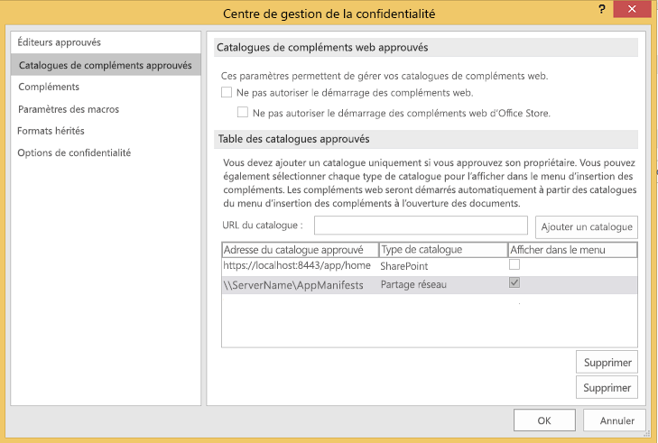
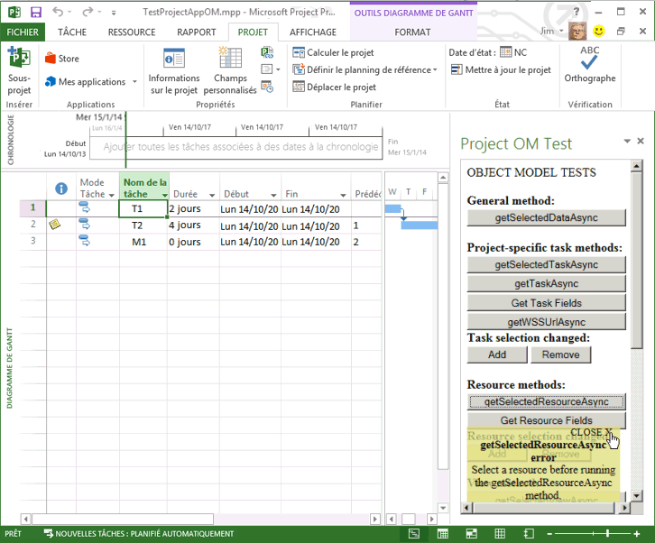

# <a name="create-your-first-task-pane-add-in-for-project-2013-by-using-a-text-editor"></a><span data-ttu-id="76576-102">Créer votre premier complément du volet Office pour Project 2013 à l’aide d’un éditeur de texte</span><span class="sxs-lookup"><span data-stu-id="76576-102">Create your first task pane add-in for Project 2013 by using a text editor</span></span>

<span data-ttu-id="76576-p101">Vous pouvez créer un complément du volet Office pour Project Standard 2013 ou Project Professionnel 2013 à l’aide de Visual Studio 2015 afin de créer une application web complexe ou à l’aide d’un éditeur de texte en vue de créer les fichiers d’un complément local. Cet article indique comment créer un complément simple utilisant un manifeste XML qui pointe vers un fichier HTML sur un partage de fichiers. L’exemple de complément Test du modèle objet de Project teste certaines fonctions JavaScript qui utilisent le modèle objet pour compléments. Une fois que vous avez utilisé le  **Centre de gestion de la confidentialité** dans Project 2013 pour enregistrer le partage de fichiers contenant le fichier manifeste, vous pouvez ouvrir le complément du volet Office à partir de l’onglet **PROJECT** sur le ruban. L’exemple de code dans cet article est basé sur une application de test créée par Arvind Iyer, Microsoft Corporation.</span><span class="sxs-lookup"><span data-stu-id="76576-p101">You can create a task pane add-in for Project Standard 2013 or Project Professional 2013 by using Visual Studio 2015 to create a complex web application or by using a text editor to create files for a local add-in. This article describes how to create a simple add-in that uses an XML manifest that points to an HTML file on a file share. The Project OM Test sample add-in tests some JavaScript functions that use the object model for add-ins. After you use the  **Trust Center** in Project 2013 to register the file share that contains the manifest file, you can open the task pane add-in from the **PROJECT** tab on the ribbon. (The sample code in this article is based on a test application by Arvind Iyer, Microsoft Corporation.)</span></span>

<span data-ttu-id="76576-p102">Project 2013 utilise le même schéma de manifeste de complément que d’autres clients Microsoft Office 2013 emploient, et la majeure partie de la même API JavaScript. Le code complet du complément qui est décrit dans cet article est disponible dans le sous-répertoire  `Samples\Apps` du téléchargement du kit de développement logiciel de Project 2013.</span><span class="sxs-lookup"><span data-stu-id="76576-p102">Project 2013 uses the same add-in manifest schema that other Microsoft Office 2013 clients use, and much of the same JavaScript API. The complete code for the add-in that is described in this article is available in the  `Samples\Apps` subdirectory of the Project 2013 SDK download.</span></span>

<span data-ttu-id="76576-109">L’exemple de complément Test du modèle objet de Project peut obtenir le GUID d’une tâche et les propriétés de l’application et du projet actif.</span><span class="sxs-lookup"><span data-stu-id="76576-109">The Project OM Test sample add-in can get the GUID of a task and properties of the application and the active project.</span></span> <span data-ttu-id="76576-110">Si Project Professionnel 2013 ouvre un projet se trouvant dans une bibliothèque SharePoint, le complément peut afficher l’URL du projet.</span><span class="sxs-lookup"><span data-stu-id="76576-110">If Project Professional 2013 opens a project that is in a SharePoint library, the add-in can show the URL of the project.</span></span> 

<span data-ttu-id="76576-p104">Le [téléchargement du kit de développement logiciel Project 2013](https://www.microsoft.com/download/details.aspx?id=30435%20) inclut le code source complet. Lorsque vous extrayez et installez le kit de développement logiciel et les exemples figurant dans le fichier Project2013SDK.msi, reportez-vous au sous-répertoire `\Samples\Apps\Copy_to_AppManifests_FileShare` pour le fichier manifeste et au sous-répertoire `\Samples\Apps\Copy_to_AppSource_FileShare` pour le code source.</span><span class="sxs-lookup"><span data-stu-id="76576-p104">The [Project 2013 SDK download](https://www.microsoft.com/download/details.aspx?id=30435%20) includes the complete source code. When you extract and install the SDK and samples that are in the Project2013SDK.msi file, see the `\Samples\Apps\Copy_to_AppManifests_FileShare` subdirectory for the manifest file and the `\Samples\Apps\Copy_to_AppSource_FileShare` subdirectory for the source code.</span></span> 

<span data-ttu-id="76576-113">L’exemple JSOMCall.html utilise les fonctions JavaScript du fichier office.js et le fichier project-15.js qui sont inclus.</span><span class="sxs-lookup"><span data-stu-id="76576-113">The JSOMCall.html sample uses JavaScript functions in the office.js file and project-15.js file, which are included.</span></span> <span data-ttu-id="76576-114">Vous pouvez utiliser les fichiers de débogage correspondants (office.debug.js et project-15.debug.js) pour examiner les fonctions.</span><span class="sxs-lookup"><span data-stu-id="76576-114">You can use the corresponding debug files (office.debug.js and project-15.debug.js) to examine the functions.</span></span>

<span data-ttu-id="76576-115">Pour découvrir l’utilisation de JavaScript dans les compléments Office, reportez-vous à la rubrique [Présentation de l’API JavaScript pour Office](../develop/understanding-the-javascript-api-for-office.md).</span><span class="sxs-lookup"><span data-stu-id="76576-115">For an introduction to using JavaScript in Office Add-ins, see [Understanding the JavaScript API for Office](../develop/understanding-the-javascript-api-for-office.md).</span></span>

## <a name="procedure-1-to-create-the-add-in-manifest-file"></a><span data-ttu-id="76576-p106">Procédure 1. Pour créer le fichier de manifeste du complément</span><span class="sxs-lookup"><span data-stu-id="76576-p106">Procedure 1. To create the add-in manifest file</span></span>

<span data-ttu-id="76576-p107">Créez un fichier XML dans un répertoire local. Le fichier XML inclut l’élément **OfficeApp** et des éléments enfant, qui sont décrits dans la rubrique [Manifeste XML des compléments Office](../develop/add-in-manifests.md). Par exemple, créez un fichier nommé JSOM_SimpleOMCalls.xml qui contient le code XML suivant (modifiez la valeur de GUID de l’élément **Id**).</span><span class="sxs-lookup"><span data-stu-id="76576-p107">Create an XML file in a local directory. The XML file includes the **OfficeApp** element and child elements, which are described in the [Office Add-ins XML manifest](../develop/add-in-manifests.md). For example, create a file named JSOM_SimpleOMCalls.xml that contains the following XML (change the GUID value of the **Id** element).</span></span>
    
```XML
<?xml version="1.0" encoding="utf-8"?>
   <OfficeApp xmlns="http://schemas.microsoft.com/office/appforoffice/1.1" 
              xmlns:xsi="http://www.w3.org/2001/XMLSchema-instance" 
              xsi:type="TaskPaneApp">
     <Id>93A26520-9414-492F-994B-4983A1C7A607</Id>
     <Version>15.0</Version>
     <ProviderName>Microsoft</ProviderName>
     <DefaultLocale>en-us</DefaultLocale>
     <DisplayName DefaultValue="Project OM Test">
       <Override Locale="fr-fr" Value="Le Project OM Test"/>
     </DisplayName>
     <Description DefaultValue="Test the task pane add-in object model for Project - English (US)">
       <Override Locale="fr-fr" Value="Test the task pane add-in object model for Project - French (France)"/>
     </Description>
     <Hosts>
       <Host Name="Project"/>
       <Host Name="Workbook"/>
       <Host Name="Document"/>
     </Hosts>
    <DefaultSettings>
       <SourceLocation DefaultValue="\\ServerName\AppSource\JSOMCall.html">
         <Override Locale="fr-fr" Value="\\ServerName\AppSource\JSOMCall.html"/>
       </SourceLocation>
     </DefaultSettings>
     <Permissions>ReadWriteDocument</Permissions>
     <IconUrl DefaultValue="http://officeimg.vo.msecnd.net/_layouts/images/general/office_logo.jpg">
       <Override Locale="fr-fr" Value="http://officeimg.vo.msecnd.net/_layouts/images/general/office_logo.jpg"/>
     </IconUrl>
     <AllowSnapshot>true</AllowSnapshot>
   </OfficeApp>
```

<span data-ttu-id="76576-p108">Pour Project, l’élément **OfficeApp** doit inclure la valeur d’attribut `xsi:type="TaskPaneApp"`. L’élément **Id** est un GUID. La valeur **SourceLocation** doit être un chemin d’accès de partage de fichiers ou une URL SharePoint pour le fichier source HTML du complément ou l’application web qui s’exécute dans le volet Office. Pour une explication des autres éléments dans le fichier de manifeste, reportez-vous à la rubrique [Compléments du volet Office pour Project](../project/project-add-ins.md).</span><span class="sxs-lookup"><span data-stu-id="76576-p108">For Project, the **OfficeApp** element must include the `xsi:type="TaskPaneApp"` attribute value. The **Id** element is a GUID. The **SourceLocation** value must be a file share path or a SharePoint URL for the add-in HTML source file or the web application that runs in the task pane. For an explanation of the other elements in manifest file, see [Task pane add-ins for Project](../project/project-add-ins.md).</span></span>
    
<span data-ttu-id="76576-p109">La procédure 2 montre comment créer le fichier HTML que le manifeste JSOM_SimpleOMCalls.xml spécifie pour le complément de test de Project. Les boutons qui sont spécifiés dans le fichier HTML appellent des fonctions JavaScript associées. Vous pouvez ajouter les fonctions JavaScript dans le fichier HTML ou les placer dans un fichier .js distinct.</span><span class="sxs-lookup"><span data-stu-id="76576-p109">Procedure 2 shows how to create the HTML file that the JSOM_SimpleOMCalls.xml manifest specifies for the Project test add-in. Buttons that are specified in the HTML file call related JavaScript functions. You can add the JavaScript functions within the HTML file, or put them in a separate .js file.</span></span>

## <a name="procedure-2-to-create-the-source-files-for-the-project-om-test-add-in"></a><span data-ttu-id="76576-p110">Procédure 2. Pour créer les fichiers sources du complément Test du modèle objet de Project</span><span class="sxs-lookup"><span data-stu-id="76576-p110">Procedure 2. To create the source files for the Project OM Test add-in</span></span>

1. <span data-ttu-id="76576-130">Créez un fichier HTML avec un nom spécifié par l’élément **SourceLocation** dans le fichier manifeste JSOM_SimpleOMCalls.xml.</span><span class="sxs-lookup"><span data-stu-id="76576-130">Create an HTML file with a name that is specified by the **SourceLocation** element in the JSOM_SimpleOMCalls.xml manifest.</span></span> 

   <span data-ttu-id="76576-p111">Par exemple, créez le fichierJSOMCall.html dans le répertoire `C:\Project\AppSource`. Bien que vous puissiez utiliser un éditeur de texte simple pour créer les fichiers source, il est plus simple d’utiliser un outil tel que Visual Studio 2015, qui fonctionne avec des types de documents spécifiques (tels que HTML et JavaScript) et propose d’autres aides à l’édition. Si vous n’avez pas déjà effectué l’exemple Recherche Bing décrit dans [Compléments du volet Office pour Project](../project/project-add-ins.md), la procédure 3 montre comment créer le partage de fichiers `\\ServerName\AppSource` que le manifeste spécifie.</span><span class="sxs-lookup"><span data-stu-id="76576-p111">For example, create theJSOMCall.html file in the `C:\Project\AppSource` directory. Although you can use a simple text editor to create the source files, it is easier to use a tool such as Visual Studio 2015, which works with specific document types (such as HTML and JavaScript) and has other editing aids. If you have not already done the Bing Search example that is described in [Task pane add-ins for Project](../project/project-add-ins.md), Procedure 3 shows how to create the `\\ServerName\AppSource` file share that the manifest specifies.</span></span>
    
   <span data-ttu-id="76576-134">Le fichier JSOMCall.html utilise le fichier MicrosoftAjax.js commun pour les fonctionnalités AJAX et le fichier Office.js pour la fonctionnalité de complément dans les applications Microsoft Office 2013.</span><span class="sxs-lookup"><span data-stu-id="76576-134">The JSOMCall.html file uses the common MicrosoftAjax.js file for AJAX functionality and the Office.js file for the add-in functionality in Microsoft Office 2013 applications.</span></span>

    ```HTML
    <!DOCTYPE html>
    <html>
        <head>
            <title>Project OM Sample Code</title>
            <meta http-equiv="X-UA-Compatible" content="IE=Edge" />
            <script type="text/javascript" src="MicrosoftAjax.js"></script>

            <!-- Use the CDN reference to office.js when deploying your add-in. -->
            <!-- <script src="https://appsforoffice.microsoft.com/lib/1/hosted/Office.js"></script> -->
            <script type="text/javascript" src="Office.js"></script>
            <script type="text/javascript" src="JSOM_Sample.js"></script>
        </head>
        <body>
            <div id="Common_JSOM_API">
                OBJECT MODEL TESTS
            </div>

            <textarea id="text" rows="6" cols="25">This is the text result.</textarea>
        </body>
    </html>
    ```

   <span data-ttu-id="76576-135">L’élément **textarea** spécifie une zone de texte qui montre les résultats des fonctions JavaScript.</span><span class="sxs-lookup"><span data-stu-id="76576-135">The **textarea** element specifies a text box that shows results of the JavaScript functions.</span></span>
    
   > [!NOTE]
   > <span data-ttu-id="76576-136">Pour garantir le bon fonctionnement de l’exemple Test du modèle objet de Project, copiez les fichiers suivants du téléchargement du kit de développement logiciel de Project 2013 dans le même répertoire que le fichier JSOMCall.html : Office.js, Project-15.js et MicrosoftAjax.js.</span><span class="sxs-lookup"><span data-stu-id="76576-136">For the Project OM Test sample to work, copy the following files from the Project 2013 SDK download to the same directory as the JSOMCall.html file: Office.js, Project-15.js, and MicrosoftAjax.js.</span></span>

   <span data-ttu-id="76576-p112">L’étape 2 ajoute le fichier JSOM_Sample.js pour les fonctions spécifiques que l’exemple de complément Test du modèle objet de Project utilise. Dans les dernières étapes, vous ajoutez d’autres éléments HTML pour les boutons qui appellent les fonctions JavaScript.</span><span class="sxs-lookup"><span data-stu-id="76576-p112">Step 2 adds the JSOM_Sample.js file for specific functions that the Project OM Test sample add-in uses. In later steps, you will add other HTML elements for buttons that call JavaScript functions.</span></span>
    
2. <span data-ttu-id="76576-139">Créez un fichier JavaScript nommé JSOM_Sample.js dans le même répertoire que le fichier JSOMCall.html.</span><span class="sxs-lookup"><span data-stu-id="76576-139">Create a JavaScript file named JSOM_Sample.js in the same directory as the JSOMCall.html file.</span></span> 

   <span data-ttu-id="76576-p113">Le code suivant obtient le contexte d’application et les informations de document en utilisant des fonctions dans le fichier Office.js. L’objet **text** est l’identifiant du contrôle **textarea** dans le fichier HTML.</span><span class="sxs-lookup"><span data-stu-id="76576-p113">The following code gets the application context and document information by using functions in the Office.js file. The **text** object is the ID of the **textarea** control in the HTML file.</span></span>
    
   <span data-ttu-id="76576-p114">La variable **\_projDoc** est initialisée avec un objet **ProjectDocument**. Le code inclut des fonctions de gestion des erreurs simples, ainsi que la fonction **getContextValues** qui extrait les propriétés de contexte d’application et de contexte de document de projet. Pour plus d’informations sur le modèle d’objet JavaScript pour Project, reportez-vous à la rubrique [API JavaScript pour Office](https://dev.office.com/reference/add-ins/javascript-api-for-office).</span><span class="sxs-lookup"><span data-stu-id="76576-p114">The **\_projDoc** variable is initialized with a **ProjectDocument** object. The code includes some simple error handling functions, and the **getContextValues** function that gets application context and project document context properties. For more information about the JavaScript object model for Project, see [JavaScript API for Office](https://dev.office.com/reference/add-ins/javascript-api-for-office).</span></span>

    ```javascript
    /*
    * JavaScript functions for the Project OM Test example app
    * in the Project 2013 SDK.
    */

    var _projDoc;
    var _app;
    var taskGuid;
    var resourceGuid;

    // The initialize function is required for all add-ins.
    Office.initialize = function (reason) {
        // Checks for the DOM to load using the jQuery ready function.
        $(document).ready(function () {
            // After the DOM is loaded, app-specific code can run.
            _projDoc = Office.context.document;
            _app = Office.context;
        });
    }

    function logError(errorText) {
        text.value = "Error in " + errorText;
    }

    function logEventError(erroneousEvent) {
        logError("event " + erroneousEvent);
    }

    function logMethodError(methodName, errorName, errorMessage) {
        logError(methodName + " method.\nError name: " + errorName + "\nMessage: " + errorMessage);
    }

    // . . . Add other JavaScript functions here.

    function getContextValues() {
        getDocumentUrl();
        getDocumentMode();
        getApplicationContentLanguage();
        getApplicationDisplayLanguage();
    }

    function getDocumentUrl() {
        text.value ="Document URL:\n" +_projDoc.url;
    }

    function getDocumentMode() {
        var docMode = _projDoc.mode;
        text.value = text.value + "\n\nDocument mode: " + docMode;
    }

    function getApplicationContentLanguage() {
        text.value = text.value + "\nApp language: " + _app.contentLanguage;
    }

    function getApplicationDisplayLanguage() {
        text.value = text.value + "\nDisplay language: " + _app.displayLanguage;
    }
    ```

   <span data-ttu-id="76576-p115">Pour plus d’informations sur les fonctions dans le fichier Office.debug.js, voir [JavaScript API for Office](https://dev.office.com/reference/add-ins/javascript-api-for-office). Par exemple, la fonction **getDocumentUrl** obtient l’URL ou le chemin de fichier du projet ouvert.</span><span class="sxs-lookup"><span data-stu-id="76576-p115">For information about the functions in the Office.debug.js file, see [JavaScript API for Office](https://dev.office.com/reference/add-ins/javascript-api-for-office). For example, the **getDocumentUrl** function gets the URL or file path of the open project.</span></span>
    
3. <span data-ttu-id="76576-147">Ajoutez les fonctions JavaScript qui appellent des fonctions asynchrones dans Office.js et Project-15.js pour obtenir les données sélectionnées :</span><span class="sxs-lookup"><span data-stu-id="76576-147">Add JavaScript functions that call asynchronous functions in Office.js and Project-15.js to get selected data:</span></span>
    
   - <span data-ttu-id="76576-p116">Par exemple, **getSelectedDataAsync** est une fonction générale d’Office.js qui recherche du texte non formaté pour les données sélectionnées. Pour plus d’informations, reportez-vous à la rubrique sur l’[objet AsyncResult](https://dev.office.com/reference/add-ins/shared/asyncresult).</span><span class="sxs-lookup"><span data-stu-id="76576-p116">For example, **getSelectedDataAsync** is a general function in Office.js that gets unformatted text for the selected data. For more information, see [AsyncResult object](https://dev.office.com/reference/add-ins/shared/asyncresult).</span></span>
    
   - <span data-ttu-id="76576-p117">La fonction  **getSelectedTaskAsync** dans Project-15.js recherche le GUID de la tâche sélectionnée. De même, la fonction **getSelectedResourceAsync** recherche le GUID de la ressource sélectionnée. Si vous appelez ces fonctions lorsqu’une tâche ou une ressource n’est pas sélectionnée, les fonctions produisent une erreur non définie.</span><span class="sxs-lookup"><span data-stu-id="76576-p117">The **getSelectedTaskAsync** function in Project-15.js gets the GUID of the selected task. Similarly, the **getSelectedResourceAsync** function gets the GUID of the selected resource. If you call those functions when a task or a resource is not selected, the functions show an undefined error.</span></span>
    
   - <span data-ttu-id="76576-p118">La fonction **getTaskAsync** recherche le nom de la tâche et les noms des ressources affectées. Si la tâche est dans une liste de tâches SharePoint synchronisée, **getTaskAsync** recherche l’ID de la tâche dans la liste SharePoint. Sinon, l’identifiant de la tâche SharePoint est 0.</span><span class="sxs-lookup"><span data-stu-id="76576-p118">The **getTaskAsync** function gets the task name and the names of the assigned resources. If the task is in a synchronized SharePoint task list, **getTaskAsync** gets the task ID in the SharePoint list; otherwise, the SharePoint task ID is 0.</span></span>
    
     > [!NOTE]
     > <span data-ttu-id="76576-p119">À des fins de démonstration, l’exemple de code comporte un bogue. Si **taskGuid** n’est pas défini, la fonction **getTaskAsync** produit une erreur. Si vous obtenez un GUID de tâche valide, puis sélectionnez une autre tâche, la fonction **getTaskAsync** recherche les données de la tâche la plus récente sur laquelle a agi la fonction **getSelectedTaskAsync**.</span><span class="sxs-lookup"><span data-stu-id="76576-p119">For demonstration purposes, the example code includes a bug. If  **taskGuid** is undefined, the **getTaskAsync** function errors off. If you get a valid task GUID and then select a different task, the **getTaskAsync** function gets data for the most recent task that was operated on by the **getSelectedTaskAsync** function.</span></span>
  
   - <span data-ttu-id="76576-p120">**getTaskFields**, **getResourceFields** et **getProjectFields** sont des fonctions locales qui appellent **getTaskFieldAsync**,  **getResourceFieldAsync** ou **getProjectFieldAsync** plusieurs fois pour obtenir les champs spécifiés d’une tâche ou d’une ressource. Dans le fichier project-15.debug.js, l’énumération **ProjectTaskFields** et l’énumération **ProjectResourceFields** affichent les champs qui sont pris en charge.</span><span class="sxs-lookup"><span data-stu-id="76576-p120">**getTaskFields**, **getResourceFields**, and **getProjectFields** are local functions that call **getTaskFieldAsync**, **getResourceFieldAsync**, or **getProjectFieldAsync** multiple times to get specified fields of a task or a resource. In the project-15.debug.js file, the **ProjectTaskFields** enumeration and the **ProjectResourceFields** enumeration show which fields are supported.</span></span>
    
   - <span data-ttu-id="76576-160">La fonction **getSelectedViewAsync** recherche le type d’affichage (défini dans l’énumération **ProjectViewTypes** dans project-15.debug.js) et le nom de l’affichage.</span><span class="sxs-lookup"><span data-stu-id="76576-160">The **getSelectedViewAsync** function gets the type of view (defined in the **ProjectViewTypes** enumeration in project-15.debug.js) and the name of the view.</span></span>
    
   - <span data-ttu-id="76576-p121">Si le projet est synchronisé avec une liste de tâches SharePoint, la fonction  **getWSSUrlAsync** obtient l’URL et le nom de la liste des tâches. Si le projet n’est pas synchronisé avec une liste des tâches SharePoint, la fonction **getWSSUrlAsync** génère une erreur.</span><span class="sxs-lookup"><span data-stu-id="76576-p121">If the project is synchronized with a SharePoint tasks list, the  **getWSSUrlAsync** function gets the URL and the name of the tasks list. If the project is not synchronized with a SharePoint tasks list, the **getWSSUrlAsync** function errors off.</span></span>
    
     > [!NOTE]
     > <span data-ttu-id="76576-163">Pour obtenir l’URL de SharePoint et le nom de la liste des tâches, nous vous recommandons d’utiliser la fonction **getProjectFieldAsync** avec les constantes **WSSUrl** et **WSSList** dans l’énumération [ProjectProjectFields](https://dev.office.com/reference/add-ins/shared/projectprojectfields-enumeration).</span><span class="sxs-lookup"><span data-stu-id="76576-163">To get the SharePoint URL and name of the tasks list, we recommend that you use the  **getProjectFieldAsync** function with the **WSSUrl** and **WSSList** constants in the [ProjectProjectFields](https://dev.office.com/reference/add-ins/shared/projectprojectfields-enumeration) enumeration.</span></span>

   <span data-ttu-id="76576-p122">Chacune des fonctions utilisées dans le code suivant inclut une fonction anonyme représentée par `function (asyncResult)` et qui est un rappel qui obtient le résultat asynchrone. Au lieu de fonctions anonymes, vous pouvez utiliser les fonctions nommées, qui peuvent améliorer la maintenabilité des compléments complexes.</span><span class="sxs-lookup"><span data-stu-id="76576-p122">Each of the functions in the following code includes an anonymous function that is specified by  `function (asyncResult)`, which is a callback that gets the asynchronous result. Instead of anonymous functions, you could use named functions, which can help with maintainability of complex add-ins.</span></span>

    ```javascript
    // Get the data in the selected cells of the grid in the active view.
    function getSelectedDataAsync() {
        _projDoc.getSelectedDataAsync(
            Office.CoercionType.Text,
            { ValueFormat: "Formatted" },
            function (asyncResult) {
                if (asyncResult.status == Office.AsyncResultStatus.Succeeded)
                    text.value = asyncResult.value;
                else
                    logMethodError("getSelectedDataAsync", asyncResult.error.name,
                                   asyncResult.error.message);
            }
        );
    }

    // Get the GUID of the selected task.
    function getSelectedTaskAsync() {
        _projDoc.getSelectedTaskAsync(function (asyncResult) {
            if (asyncResult.status == Office.AsyncResultStatus.Succeeded) {
                text.value = asyncResult.value;
                taskGuid = asyncResult.value;
            }
            else {
                logMethodError("getSelectedTaskAsync", asyncResult.error.name,
                                   asyncResult.error.message);
            }
        });
    }

    // Get the GUID of the selected resource.
    function getSelectedResourceAsync() {
        _projDoc.getSelectedResourceAsync(function (asyncResult) {
            if (asyncResult.status == Office.AsyncResultStatus.Succeeded) {
                text.value = asyncResult.value;
                resourceGuid = asyncResult.value;
            }
            else {
                logMethodError("getSelectedResourceAsync", asyncResult.error.name,
                                   asyncResult.error.message);
            }
        });
    }

    // Get data for the specified task.
    function getTaskAsync() {
        if (taskGuid != undefined) {
            _projDoc.getTaskAsync(
                taskGuid,
                function (asyncResult) {
                    if (asyncResult.status === Office.AsyncResultStatus.Failed) {
                        logMethodError("getTaskAsync", asyncResult.error.name,
                                   asyncResult.error.message);
                    } else {
                        var taskInfo = asyncResult.value;
                        var taskOutput = "Task name: " + taskInfo.taskName +
                                         "\nGUID: " + taskGuid +
                                         "\nWSS Id: " + taskInfo.wssTaskId +
                                         "\nResourceNames: " + taskInfo.resourceNames;
                        text.value = taskOutput;
                    }
                }
            );
        } else {
            text.value = 'Task GUID not valid:\n' + taskGuid;
        } 
    }

    // Get additional data for task fields.
    function getTaskFields() {
        text.value = "";

        _projDoc. getTaskFieldAsync(taskGuid, Office.ProjectTaskFields.Name,
            function (asyncResult) {
                if (asyncResult.status == Office.AsyncResultStatus.Succeeded) {
                    text.value = text.value + "Name: "
                        + asyncResult.value.fieldValue + "\n";
                }
                else {
                    logMethodError("getTaskFieldAsync", asyncResult.error.name,
                                   asyncResult.error.message);
                }
            }
        );

        _projDoc.getTaskFieldAsync(taskGuid, Office.ProjectTaskFields.ID,
            function (asyncResult) {
                if (asyncResult.status == Office.AsyncResultStatus.Succeeded) {
                    text.value = text.value + "ID: "
                        + asyncResult.value.fieldValue + "\n";
                }
                else {
                    logMethodError("getTaskFieldAsync", asyncResult.error.name,
                                   asyncResult.error.message);
                }
            }
        );

        _projDoc.getTaskFieldAsync(taskGuid, Office.ProjectTaskFields.Start,
            function (asyncResult) {
                if (asyncResult.status == Office.AsyncResultStatus.Succeeded) {
                    text.value = text.value + "Start: "
                        + asyncResult.value.fieldValue + "\n";
                }
                else {
                    logMethodError("getTaskFieldAsync", asyncResult.error.name,
                                   asyncResult.error.message);
                }
            }
        );

        _projDoc.getTaskFieldAsync(taskGuid, Office.ProjectTaskFields.Duration,
            function (asyncResult) {
                if (asyncResult.status == Office.AsyncResultStatus.Succeeded) {
                    text.value = text.value + "Duration: "
                        + asyncResult.value.fieldValue + "\n";
                }
                else {
                    logMethodError("getTaskFieldAsync", asyncResult.error.name,
                                   asyncResult.error.message);
                }
            }
        );

        _projDoc.getTaskFieldAsync(taskGuid, Office.ProjectTaskFields.Priority,
            function (asyncResult) {
                if (asyncResult.status == Office.AsyncResultStatus.Succeeded) {
                    text.value = text.value + "Priority: "
                        + asyncResult.value.fieldValue + "\n";
                }
                else {
                    logMethodError("getTaskFieldAsync", asyncResult.error.name,
                                   asyncResult.error.message);
                }
            }
        );

        _projDoc.getTaskFieldAsync(taskGuid, Office.ProjectTaskFields.Notes,
            function (asyncResult) {
                if (asyncResult.status == Office.AsyncResultStatus.Succeeded) {
                    text.value = text.value + "Notes: "
                        + asyncResult.value.fieldValue + "\n";
                }
                else {
                    logMethodError("getTaskFieldAsync", asyncResult.error.name,
                                   asyncResult.error.message);
                }
            }
        ); 
    }

    // Get data for the specified resource fields.
    function getResourceFields() {
        text.value = "";

        _projDoc.getResourceFieldAsync(resourceGuid, Office.ProjectResourceFields.Name,
            function (asyncResult) {
                if (asyncResult.status == Office.AsyncResultStatus.Succeeded) {
                    text.value = text.value + "Resource name: " + asyncResult.value.fieldValue + "\n";
                }
                else {
                    logMethodError("getResourceFieldAsync", asyncResult.error.name,
                                   asyncResult.error.message);
                }
            }
        );

        _projDoc.getResourceFieldAsync(resourceGuid, Office.ProjectResourceFields.Cost,
            function (asyncResult) {
                if (asyncResult.status == Office.AsyncResultStatus.Succeeded) {
                    text.value = text.value + "Cost: " + asyncResult.value.fieldValue + "\n";
                }
                else {
                    logMethodError("getResourceFieldAsync", asyncResult.error.name,
                                   asyncResult.error.message);
                }
            }
        );

        _projDoc.getResourceFieldAsync(resourceGuid, Office.ProjectResourceFields.StandardRate,
            function (asyncResult) {
                if (asyncResult.status == Office.AsyncResultStatus.Succeeded) {
                    text.value = text.value + "Standard Rate: " + asyncResult.value.fieldValue + "\n";
                }
                else {
                    logMethodError("getResourceFieldAsync", asyncResult.error.name, asyncResult.error.message);
                }
            }
        );

        _projDoc.getResourceFieldAsync(resourceGuid, Office.ProjectResourceFields.ActualCost,
            function (asyncResult) {
                if (asyncResult.status == Office.AsyncResultStatus.Succeeded) {
                    text.value = text.value + "Actual Cost: " + asyncResult.value.fieldValue + "\n";
                }
                else {
                    logMethodError("getResourceFieldAsync", asyncResult.error.name, asyncResult.error.message);
                }
            }
        );

        _projDoc.getResourceFieldAsync(resourceGuid, Office.ProjectResourceFields.ActualWork,
            function (asyncResult) {
                if (asyncResult.status == Office.AsyncResultStatus.Succeeded) {
                    text.value = text.value + "Actual Work: " + asyncResult.value.fieldValue + "\n";
                }
                else {
                    logMethodError("getResourceFieldAsync", asyncResult.error.name,
                                   asyncResult.error.message);
                }
            }
        );

        _projDoc.getResourceFieldAsync(resourceGuid, Office.ProjectResourceFields.Units,
            function (asyncResult) {
                if (asyncResult.status == Office.AsyncResultStatus.Succeeded) {
                    text.value = text.value + "Units: " + asyncResult.value.fieldValue + "\n";
                }
                else {
                    logMethodError("getResourceFieldAsync", asyncResult.error.name,
                                   asyncResult.error.message);
                }
            }
        );
    }

    // Get the URL and list name of the synchronized SharePoint task list.
    // Recommended: use getProjectField instead.
    function getWSSUrlAsync() {
        _projDoc.getWSSUrlAsync(function (asyncResult) {
            if (asyncResult.status == Office.AsyncResultStatus.Succeeded) {
                text.value = "SharePoint URL:\n" + asyncResult.value.serverUrl
                    + "\nList name: " + asyncResult.value.listName;
            }
            else {
                logMethodError("getWSSUrlAsync", asyncResult.error.name, asyncResult.error.message);
            }
        });
    }

    // Get the type and name of the selected view.
    function getSelectedViewAsync() {
        _projDoc.getSelectedViewAsync(function (asyncResult) {
            text.value = "View type: " + asyncResult.value.viewType
                + "\nName: " + asyncResult.value.viewName;
        });
    }

    // Get information about the active project.
    function getProjectFields() {
        text.value = "";

        _projDoc.getProjectFieldAsync(Office.ProjectProjectFields.GUID,
            function (asyncResult) {
                if (asyncResult.status == Office.AsyncResultStatus.Succeeded) {
                    text.value = text.value + "Project GUID: " + asyncResult.value.fieldValue + "\n";
                }
                else {
                    logMethodError("getProjectFieldAsync", asyncResult.error.name, asyncResult.error.message);
                }
            }
        );

        _projDoc.getProjectFieldAsync(Office.ProjectProjectFields.Start,
            function (asyncResult) {
                if (asyncResult.status == Office.AsyncResultStatus.Succeeded) {
                    text.value = text.value + "\nStart: " + asyncResult.value.fieldValue + "\n";
                }
                else {
                    logMethodError("getProjectFieldAsync", asyncResult.error.name, asyncResult.error.message);
                }
            }
        );

        _projDoc.getProjectFieldAsync(Office.ProjectProjectFields.Finish,
            function (asyncResult) {
                if (asyncResult.status == Office.AsyncResultStatus.Succeeded) {
                    text.value = text.value + "\nFinish: " + asyncResult.value.fieldValue + "\n";
                }
                else {
                    logMethodError("getProject " + errorText);
                }
            }
        );

        _projDoc.getProjectFieldAsync(Office.ProjectProjectFields.CurrencyDigits,
            function (asyncResult) {
                if (asyncResult.status == Office.AsyncResultStatus.Succeeded) {
                    text.value = text.value + "\nCurrency digits: " + asyncResult.value.fieldValue + "\n";
                }
                else {
                    logMethodError("getProjectFieldAsync", asyncResult.error.name, asyncResult.error.message);
                }
            }
        );

        _projDoc.getProjectFieldAsync(Office.ProjectProjectFields.CurrencySymbol,
            function (asyncResult) {
                if (asyncResult.status == Office.AsyncResultStatus.Succeeded) {
                    text.value = text.value + "Currency symbol: " + asyncResult.value.fieldValue + "\n";
                }
                else {
                    logMethodError("getProjectFieldAsync", asyncResult.error.name, asyncResult.error.message);
                }
            }
        );

        _projDoc.getProjectFieldAsync(Office.ProjectProjectFields.CurrencySymbolPosition,
            function (asyncResult) {
                if (asyncResult.status == Office.AsyncResultStatus.Succeeded) {
                    text.value = text.value + "\nSymbol position: " + asyncResult.value.fieldValue + "\n";
                }
                else {
                    logMethodError("getProjectFieldAsync", asyncResult.error.name, asyncResult.error.message);
                }
            }
        );

        _projDoc.getProjectFieldAsync(Office.ProjectProjectFields.ProjectServerUrl,
            function (asyncResult) {
                if (asyncResult.status == Office.AsyncResultStatus.Succeeded) {
                    text.value = text.value + "\nProject web app URL:\n  " + asyncResult.value.fieldValue + "\n";
                }
                else {
                    logMethodError("getProjectFieldAsync", asyncResult.error.name, asyncResult.error.message);
                }
            }
        );

        _projDoc.getProjectFieldAsync(Office.ProjectProjectFields.WSSUrl,
            function (asyncResult) {
                if (asyncResult.status == Office.AsyncResultStatus.Succeeded) {
                    text.value = text.value + "\nSharePoint URL:\n  " + asyncResult.value.fieldValue + "\n";
                }
                else {
                    logMethodError("getProjectFieldAsync", asyncResult.error.name, asyncResult.error.message);
                }
            }
        );

        _projDoc.getProjectFieldAsync(Office.ProjectProjectFields.WSSList,
            function (asyncResult) {
                if (asyncResult.status == Office.AsyncResultStatus.Succeeded) {
                    text.value = text.value + "\nSharePoint list: " + asyncResult.value.fieldValue + "\n";
                }
                else {
                    logMethodError("getProjectFieldAsync", asyncResult.error.name, asyncResult.error.message);
                }
            }
        );
    }
    ```

4. <span data-ttu-id="76576-p123">Ajoutez des rappels et des fonctions du gestionnaire d’événements JavaScript pour enregistrer la sélection de tâches, la sélection de ressources et les gestionnaires d’événements de changement de sélection d’affichage, et pour annuler l’enregistrement de gestionnaires d’événements. La fonction **manageEventHandlerAsync** ajoute ou supprime le gestionnaire d’événements spécifié, selon le paramètre _operation_. L’opération peut être **addHandlerAsync** ou **removeHandlerAsync**.</span><span class="sxs-lookup"><span data-stu-id="76576-p123">Add JavaScript event handler callbacks and functions to register the task selection, resource selection, and view selection change event handlers and to unregister the event handlers. The **manageEventHandlerAsync** function adds or removes the specified event handler, depending on the _operation_ parameter. The operation can be **addHandlerAsync** or **removeHandlerAsync**.</span></span>
    
   <span data-ttu-id="76576-169">Les fonctions **manageTaskEventHandler**, **manageResourceEventHandler** et **manageViewEventHandler** peuvent ajouter ou supprimer un gestionnaire d’événements, selon la valeur du paramètre _docMethod_.</span><span class="sxs-lookup"><span data-stu-id="76576-169">The **manageTaskEventHandler**, **manageResourceEventHandler**, and **manageViewEventHandler** functions can add or remove an event handler, as specified by the _docMethod_ parameter.</span></span>

    ```javascript
    // Task selection changed event handler.
    function onTaskSelectionChanged(eventArgs) {
        text.value = "In task selection change event handler";
    }

    // Resource selection changed event handler.
    function onResourceSelectionChanged(eventArgs) {
        text.value = "In Resource selection changed event handler";
    }

    // View selection changed event handler.
    function onViewSelectionChanged(eventArgs) {
        text.value = "In View selection changed event handler";
    }

    // Add or remove the specified event handler.
    function manageEventHandlerAsync(eventType, handler, operation, onComplete) {
        _projDoc[operation]   //The operation is addHandlerAsync or removeHandlerAsync.
        (
            eventType,
            handler,
            function (asyncResult) {
                if (onComplete) {
                    onComplete(asyncResult, operation);
                } else {
                    var message = "Operation: " + operation;
                    message = message + "\nStatus: " + asyncResult.status + "\n";
                    text.value = message;
                }
            }
        );
    }

    // Write the asyncResult status from the manageEventHandlerAsync function (optional). 
    function onComplete(asyncResult, operation) {
        var message = "In onComplete function for " + operation;
        message = message + "\nStatus: " + asyncResult.status;
        text.value = message;
    }

    // Add or remove a task selection changed event handler.
    function manageTaskEventHandler(docMethod) {
        manageEventHandlerAsync(
            Office.EventType.TaskSelectionChanged,      // The task selection changed event.
            onTaskSelectionChanged,                     // The event handler.
            docMethod,                // The Office.Document method to add or remove an event handler.
            onComplete                // Manages the successful asyncResult data (optional).
        );
    }

    // Add or remove a resource selection changed event handler.
    function manageResourceEventHandler(docMethod) {
        manageEventHandlerAsync(
            Office.EventType.ResourceSelectionChanged,  // The resource selection changed event.
            onResourceSelectionChanged,                 // The event handler.
            docMethod,                // The Office.Document method to add or remove an event handler.
            onComplete                // Manages the successful asyncResult data (optional).
        );
    }

    // Add or remove a view selection changed event handler.
    function manageViewEventHandler(docMethod) {
        manageEventHandlerAsync(
            Office.EventType.ViewSelectionChanged,      // The view selection changed event.
            onViewSelectionChanged,                     // The event handler.
            docMethod,                // The Office.Document method to add or remove an event handler.
            onComplete                // Manages the successful asyncResult data (optional).
        );
    }
    ```

5. <span data-ttu-id="76576-p124">Pour le corps du document HTML, ajoutez des boutons qui appellent les fonctions JavaScript pour le test. Par exemple, dans l’élément  **div** pour l’API JSOM commune, ajoutez un bouton d’entrée qui appelle la fonction générale **getSelectedDataAsync**.</span><span class="sxs-lookup"><span data-stu-id="76576-p124">For the body of the HTML document, add buttons that call the JavaScript functions for testing. For example, in the  **div** element for the common JSOM API, add an input button that calls the general **getSelectedDataAsync** function.</span></span>
    
    ```HTML
    <body>
        <div id="Common_JSOM_API">
        OBJECT MODEL TESTS
        <br /><br />       
        <strong>General function:</strong>
        <br />
        <input id="Button5" class="button-wide" type="button" onclick="getSelectedDataAsync()" 
            value="getSelectedDataAsync" />
        </div>
        <!--  more code . . .  -->
    ```

6. <span data-ttu-id="76576-172">Ajoutez une section **div** avec des boutons pour des fonctions de tâches propres à un projet et pour l’événement **TaskSelectionChanged**.</span><span class="sxs-lookup"><span data-stu-id="76576-172">Add a **div** section with buttons for project-specific task functions and for the **TaskSelectionChanged** event.</span></span>
    
    ```HTML
    <div id="ProjectSpecificTask">
      <br />
      <strong>Project-specific task methods:</strong><br />
      <button class="button-wide" onclick="getSelectedTaskAsync()">getSelectedTaskAsync</button><br />
      <button class="button-wide" onclick="getTaskAsync()">getTaskAsync</button><br />
      <button class="button-wide" onclick="getTaskFields()">Get Task Fields</button><br />
      <button class="button-wide" onclick="getWSSUrlAsync()">getWSSUrlAsync</button>
      <strong>Task selection changed:</strong>
      <button class="button-narrow" onclick="manageTaskEventHandler('addHandlerAsync')">Add</button>
      <button class="button-narrow" onclick="manageTaskEventHandler('removeHandlerAsync')">Remove</button>         
    </div>
    ```

7. <span data-ttu-id="76576-173">Ajoutez des sections **div** avec des boutons pour les méthodes et les événements de ressources, méthodes et événements d’affichage, propriétés de projet et propriétés contextuelles</span><span class="sxs-lookup"><span data-stu-id="76576-173">Add  **div** sections with buttons for the resource methods and events, view methods and events, project properties, and context properties</span></span>
    
    ```HTML
    <div id="ResourceMethods">
      <br />
      <strong>Resource methods:</strong>
      <button class="button-wide" onclick="getSelectedResourceAsync()">getSelectedResourceAsync</button><br />
      <button class="button-wide" onclick="getResourceFields()">Get Resource Fields</button><br />
      <strong>Resource selection changed:</strong>
      <button class="button-narrow" onclick="manageResourceEventHandler('addHandlerAsync')">Add</button>
      <button class="button-narrow" onclick="manageResourceEventHandler('removeHandlerAsync')">Remove</button>
    </div>
    <div id="ViewMethods">
      <br />
      <strong>View method:</strong>
      <button class="button-wide" onclick="getSelectedViewAsync()">getSelectedViewAsync</button><br />
      <strong>View selection changed:</strong>
      <button class="button-narrow" onclick="manageViewEventHandler('addHandlerAsync')">Add</button>
      <button class="button-narrow" onclick="manageViewEventHandler('removeHandlerAsync')">Remove</button>         
    </div>
    <div id="ProjectMethods">
      <br />
      <strong>Project properties:</strong>
      <button class="button-wide" onclick="getProjectFields()">Get Project Fields</button><br />
    </div>
    <div id="ContextVariables">
      <br />
      <strong>Context properties:</strong>
      <button class="button-wide" onclick="getContextValues()">Get Context Values</button>
    </div>
    ```

8. <span data-ttu-id="76576-p125">Pour formater les éléments de boutons, ajoutez un élément CSS **style**. Par exemple, ajoutez l’élément suivant comme enfant de l’élément **head**.</span><span class="sxs-lookup"><span data-stu-id="76576-p125">To format the button elements, add a CSS  **style** element. For example, add the following as a child of the **head** element.</span></span>
    
    ```HTML
    <style type="text/css">
        .button-wide
        {
            width: 210px;
            margin-top: 2px;
        }
        .button-narrow
        {
            width: 80px;
            margin-top: 2px;
        }
    </style>
    ```

> [!NOTE]
> <span data-ttu-id="76576-176">Le modèle **Complément de volet Office (Project)** dans Visual Studio 2015 inclut les fichiers .css par défaut utilisés pour l’apparence générale des compléments. La procédure 3 montre comment installer et utiliser les fonctionnalités du complément Test du modèle objet de Project.</span><span class="sxs-lookup"><span data-stu-id="76576-176">The **Task Pane Add-in (Project)** template in Visual Studio 2015 includes default .css files for a common look and feel of add-ins. Procedure 3 shows how to install and use the Project OM Test add-in features.</span></span>

## <a name="procedure-3-to-install-and-use-the-project-om-test-add-in"></a><span data-ttu-id="76576-p126">Procédure 3. Pour installer et utiliser le complément Test du modèle objet de Project</span><span class="sxs-lookup"><span data-stu-id="76576-p126">Procedure 3. To install and use the Project OM Test add-in</span></span>

1. <span data-ttu-id="76576-p127">Créez un partage de fichiers pour le répertoire qui contient le manifeste JSOM_SimpleOMCalls.xml. Vous pouvez créer le partage de fichiers sur l’ordinateur local ou sur un ordinateur distant accessible sur le réseau. Par exemple, si le manifeste se trouve dans le répertoire  `C:\Project\AppManifests` sur l’ordinateur local, exécutez la commande suivante :</span><span class="sxs-lookup"><span data-stu-id="76576-p127">Create a file share for the directory that contains the JSOM_SimpleOMCalls.xml manifest. You can create the file share on the local computer or on a remote computer that is accessible on the network. For example, if the manifest is in the  `C:\Project\AppManifests` directory on the local computer, run the following command:</span></span>
    
    `Net share AppManifests=C:\Project\AppManifests`
    
2. <span data-ttu-id="76576-p128">Créez un partage de fichiers pour le répertoire contenant les fichiers HTML et JavaScript pour le complément Test du modèle objet de Project. Assurez-vous que le chemin du partage de fichiers correspond à celui qui est spécifié dans le manifeste JSOM_SimpleOMCalls.xml. Par exemple, si les fichiers se trouvent dans le répertoire  `C:\Project\AppSource` de l’ordinateur local, exécutez la commande suivante :</span><span class="sxs-lookup"><span data-stu-id="76576-p128">Create a file share for the directory that contains the HTML and JavaScript files for the Project OM Test add-in. Ensure the file share path matches the path that is specified in the JSOM_SimpleOMCalls.xml manifest. For example, if the files are in the  `C:\Project\AppSource` directory on the local computer, run the following command:</span></span>
    
    `net share AppSource=C:\Project\AppSource`

3. <span data-ttu-id="76576-185">Dans Project, ouvrez la boîte de dialogue **Options de Project**, choisissez **Centre de gestion de la confidentialité**, puis **Paramètres du Centre de gestion de la confidentialité**.</span><span class="sxs-lookup"><span data-stu-id="76576-185">In Project, open the **Project Options** dialog box, choose **Trust Center**, and then choose  **Trust Center Settings**.</span></span>
    
   <span data-ttu-id="76576-186">La procédure d’inscription d’un complément est également décrite dans la rubrique relative aux [compléments de volet Office pour Project](../project/project-add-ins.md), qui contient aussi des informations supplémentaires.</span><span class="sxs-lookup"><span data-stu-id="76576-186">The procedure for registering an add-in is also described in [Task pane add-ins for Project](../project/project-add-ins.md), with additional information.</span></span>
    
4. <span data-ttu-id="76576-187">Dans la boîte de dialogue **Centre de gestion de la confidentialité**, dans le volet gauche, choisissez **Catalogues de compléments approuvés**.</span><span class="sxs-lookup"><span data-stu-id="76576-187">In the **Trust Center** dialog box, in the left pane, choose **Trusted Add-in Catalogs**.</span></span>
    
5. <span data-ttu-id="76576-p129">Si vous avez déjà ajouté le chemin `\\ServerName\AppManifests` pour le complément Recherche Bing, ignorez cette étape. Sinon, dans le volet **Catalogues de compléments approuvés**, ajoutez le chemin d’accès `\\ServerName\AppManifests` dans la zone de texte **URL du catalogue**, choisissez ** Ajouter un catalogue**, activez le partage réseau comme source par défaut (reportez-vous à la figure 1), puis cliquez sur **OK**.</span><span class="sxs-lookup"><span data-stu-id="76576-p129">If you have already added the `\\ServerName\AppManifests` path for the Bing Search add-in, skip this step. Otherwise, in the **Trusted Add-in Catalogs** pane, add the `\\ServerName\AppManifests` path in the **Catalog Url** text box, choose **Add catalog**, enable the network share as a default source (see Figure 1), and then choose  **OK**.</span></span>
    
   <span data-ttu-id="76576-190">*Figure 1. Ajout d’un partage de fichiers réseau pour des manifestes de complément*</span><span class="sxs-lookup"><span data-stu-id="76576-190">*Figure 1. Adding a network file share for add-in manifests*</span></span>

   

6. <span data-ttu-id="76576-p130">Après que vous avez ajouté de nouveaux compléments ou modifié le code source, redémarrez Project. Dans le ruban  **PROJECT**, choisissez le menu déroulant  **Compléments Office**, puis choisissez  **Afficher tout**. Dans la boîte de dialogue  **Insérer un complément**, choisissez  **DOSSIER PARTAGÉ** (voir la figure 2), sélectionnez **Test du modèle objet de Project**, puis choisissez  **Insérer**. Le complément Test du modèle objet de Project démarre dans un volet Office.</span><span class="sxs-lookup"><span data-stu-id="76576-p130">After you add new add-ins, or change the source code, restart Project. On the  **PROJECT** ribbon, choose the **Office Add-ins** drop-down menu, and then choose **See All**. In the  **Insert Add-in** dialog box, choose **SHARED FOLDER** (see Figure 2), select **Project OM Test**, and then choose  **Insert**. The Project OM Test add-in starts in a task pane.</span></span>
    
   <span data-ttu-id="76576-196">*Figure 2. Démarrage du complément Test du modèle objet Project qui se trouve sur un partage de fichiers*</span><span class="sxs-lookup"><span data-stu-id="76576-196">*Figure 2. Starting the Project OM Test add-in that is on a file share*</span></span>

   

7. <span data-ttu-id="76576-p131">Dans Project, créez et enregistrez un projet simple comportant au moins deux tâches. Par exemple, créez les tâches nommées T1, T2 et un jalon nomméM1, puis définissez des durées et des prédécesseurs de tâches similaires à ceux de la figure 3. Choisissez l’onglet  **PROJECT** sur le ruban, sélectionnez toute la ligne pour la tâche T2, puis cliquez sur le bouton **getSelectedDataAsync** dans le volet Office. La figure 3 montre les données qui sont sélectionnées dans la zone de texte du complément **Test du modèle objet de Project**.</span><span class="sxs-lookup"><span data-stu-id="76576-p131">In Project, create and save a simple project that has at least two tasks. For example, create tasks named T1, T2, and a milestone named M1, and then set the task durations and predecessors to be similar to those in Figure 3. Choose the  **PROJECT** tab on the ribbon, select the entire row for task T2, and then choose the **getSelectedDataAsync** button in the task pane. Figure 3 shows the data that is selected in the text box of the **Project OM Test** add-in.</span></span>
    
   <span data-ttu-id="76576-202">*Figure 3. Utilisation du complément Test du modèle objet Project*</span><span class="sxs-lookup"><span data-stu-id="76576-202">*Figure 3. Using the Project OM Test add-in*</span></span>

   

8. <span data-ttu-id="76576-p132">Sélectionnez la cellule dans la colonne  **Durée** de la première tâche, puis cliquez sur le bouton **getSelectedDataAsync** dans le complément **Test du modèle objet de Project**. La fonction  **getSelectedDataAsync** définit la valeur de la zone de texte à `2 days`.</span><span class="sxs-lookup"><span data-stu-id="76576-p132">Select the cell in the  **Duration** column for the first task, and then choose the **getSelectedDataAsync** button in the **Project OM Test** add-in. The **getSelectedDataAsync** function sets the text box value to show `2 days`.</span></span> 
    
9. <span data-ttu-id="76576-p133">Sélectionnez les trois cellules  **Durée** pour les trois tâches. La fonction **getSelectedDataAsync** renvoie des valeurs de texte séparées par des points-virgules pour les cellules sélectionnées dans différentes lignes, par exemple, `2 days;4 days;0 days`.</span><span class="sxs-lookup"><span data-stu-id="76576-p133">Select the three  **Duration** cells for all three tasks. The **getSelectedDataAsync** function returns semicolon-separated text values for cells selected in different rows, for example, `2 days;4 days;0 days`.</span></span>
    
   <span data-ttu-id="76576-p134">La fonction **getSelectedDataAsync** renvoie des valeurs texte séparées par des virgules pour les cellules sélectionnées dans une ligne. Par exemple, dans la figure 3, la ligne entière correspondant à la tâche T2 est sélectionnée. Lorsque vous choisissez **getSelectedDataAsync**, la zone de texte affiche les informations suivantes :  `,Auto Scheduled,T2,4 days,Thu 6/14/12,Tue 6/19/12,1,,<NA>`</span><span class="sxs-lookup"><span data-stu-id="76576-p134">The  **getSelectedDataAsync** function returns comma-separated text values for cells selected within a row. For example in Figure 3, the entire row for task T2 is selected. When you choose **getSelectedDataAsync**, the text box shows the following:  `,Auto Scheduled,T2,4 days,Thu 6/14/12,Tue 6/19/12,1,,<NA>`</span></span>
    
   <span data-ttu-id="76576-p135">Les colonnes **Indicateurs** et **Noms des ressources** étant toutes les deux vides, le tableau de texte affiche des valeurs vides pour ces colonnes. La valeur `<NA>` correspond à la cellule **Ajouter une nouvelle colonne**.</span><span class="sxs-lookup"><span data-stu-id="76576-p135">The  **Indicators** column and the **Resource Names** column are both empty, so the text array shows empty values for those columns. The `<NA>` value is for the **Add New Column** cell.</span></span>
    
10. <span data-ttu-id="76576-p136">Sélectionnez une cellule dans la ligne de la tâche T2, ou toute la ligne pour la tâche T2, puis choisissez  **getSelectedTaskAsync**. La zone de texte affiche la valeur GUID de la tâche, par exemple  `{25D3E03B-9A7D-E111-92FC-00155D3BA208}`. Project stocke cette valeur dans la variable  **taskGuid** globale du complément **Test du modèle objet de Project**.</span><span class="sxs-lookup"><span data-stu-id="76576-p136">Select any cell in the row for task T2, or the entire row for task T2, and then choose  **getSelectedTaskAsync**. The text box shows the task GUID value, for example,  `{25D3E03B-9A7D-E111-92FC-00155D3BA208}`. Project stores that value in the global  **taskGuid** variable of the **Project OM Test** add-in.</span></span>
    
11. <span data-ttu-id="76576-p137">Choisissez **getTaskAsync**. Si la variable **taskGuid** contient le GUID de la tâche T2, la zone de texte affiche les informations de la tâche. La valeur **ResourceNames** est vide.</span><span class="sxs-lookup"><span data-stu-id="76576-p137">Select **getTaskAsync**. If the **taskGuid** variable contains the GUID for task T2, the text box displays the task information. The **ResourceNames** value is empty.</span></span>
    
    <span data-ttu-id="76576-p138">Créez deux ressources locales R1 et R2, affectez-les à la tâche T2 à raison de 50 % chacune, puis choisissez **getTaskAsync** à nouveau. Les résultats qui apparaissent dans la zone de texte incluent des informations sur les ressources. Si la tâche se trouve dans une liste de tâches SharePoint synchronisée, les résultats incluent également l’ID de tâche SharePoint.</span><span class="sxs-lookup"><span data-stu-id="76576-p138">Create two local resources R1 andR2, assign them to task T2 at 50% each, and choose  **getTaskAsync** again. The results in the text box include the resource information. If the task is in a synchronized SharePoint task list, the results also include the SharePoint task ID.</span></span>
    
    - <span data-ttu-id="76576-222">Nom de la tâche : `T2`</span><span class="sxs-lookup"><span data-stu-id="76576-222">Task name: `T2`</span></span>
    - <span data-ttu-id="76576-223">GUID : `{25D3E03B-9A7D-E111-92FC-00155D3BA208}`</span><span class="sxs-lookup"><span data-stu-id="76576-223">GUID: `{25D3E03B-9A7D-E111-92FC-00155D3BA208}`</span></span>
    - <span data-ttu-id="76576-224">Identifiant de WSS : `0`</span><span class="sxs-lookup"><span data-stu-id="76576-224">WSS Id: `0`</span></span>
    - <span data-ttu-id="76576-225">ResourceNames : `R1[50%],R2[50%]`</span><span class="sxs-lookup"><span data-stu-id="76576-225">ResourceNames`R1[50%],R2[50%]`</span></span>

12. <span data-ttu-id="76576-p139">Sélectionnez le bouton **Get Task Fields**. La fonction **getTaskFields** appelle la fonction **getTaskfieldAsync** plusieurs fois pour le nom de tâche, l’index, la date de début, la durée, la priorité et les notes de tâches.</span><span class="sxs-lookup"><span data-stu-id="76576-p139">Select the **Get Task Fields** button. The **getTaskFields** function calls the **getTaskfieldAsync** function multiple times for the task name, index, start date, duration, priority, and task notes.</span></span>

    - <span data-ttu-id="76576-228">Nom : `T2`</span><span class="sxs-lookup"><span data-stu-id="76576-228">Name: `T2`</span></span>
    - <span data-ttu-id="76576-229">Identifiant : `2`</span><span class="sxs-lookup"><span data-stu-id="76576-229">ID: `2`</span></span>
    - <span data-ttu-id="76576-230">Début : `Thu 6/14/12`</span><span class="sxs-lookup"><span data-stu-id="76576-230">Start: `Thu 6/14/12`</span></span>
    - <span data-ttu-id="76576-231">Durée : `4d`</span><span class="sxs-lookup"><span data-stu-id="76576-231">Duration: `4d`</span></span>
    - <span data-ttu-id="76576-232">Priorité : `500`</span><span class="sxs-lookup"><span data-stu-id="76576-232">Priority: `500`</span></span>
    - <span data-ttu-id="76576-233">Remarques : il s’agit d’une note de la tâche T2.</span><span class="sxs-lookup"><span data-stu-id="76576-233">Notes: This is a note for task T2.</span></span> <span data-ttu-id="76576-234">Il s’agit uniquement d’une note de test.</span><span class="sxs-lookup"><span data-stu-id="76576-234">It is only a test note.</span></span> <span data-ttu-id="76576-235">Si elle avait été une note réelle, elle contiendrait des informations réelles.</span><span class="sxs-lookup"><span data-stu-id="76576-235">If it had been a real note, there would be some real information.</span></span>

13. <span data-ttu-id="76576-p141">Sélectionnez le bouton **getWSSUrlAsync**. Si le projet appartient à l’un des types suivants, les résultats présentent l’URL et le nom de la liste de tâches.</span><span class="sxs-lookup"><span data-stu-id="76576-p141">Select the **getWSSUrlAsync** button. If the project is one of the following kinds, the results show the task list URL and name.</span></span>
    
    - <span data-ttu-id="76576-238">Une liste de tâches SharePoint qui a été importée dans Project Server.</span><span class="sxs-lookup"><span data-stu-id="76576-238">A SharePoint task list that was imported to Project Server.</span></span>
    - <span data-ttu-id="76576-239">Une liste de tâches SharePoint qui a été importée dans Project Professionnel, puis enregistrée à nouveau dans SharePoint (sans utiliser Project Server).</span><span class="sxs-lookup"><span data-stu-id="76576-239">A SharePoint task list that was imported to Project Professional, and then saved back in SharePoint (not using Project Server).</span></span>
    
    > [!NOTE]
    > <span data-ttu-id="76576-240">Si Project Professionnel est installé sur un ordinateur Windows Server, vous pouvez utiliser le **Gestionnaire de serveur** afin d’ajouter la fonctionnalité **Expérience utilisateur** dans le cadre du réenregistrement du projet dans SharePoint.</span><span class="sxs-lookup"><span data-stu-id="76576-240">If Project Professional is installed on a Windows Server computer, to be able to save the project back to SharePoint, you can use the  **Server Manager** to add the **Desktop Experience** feature.</span></span>

    <span data-ttu-id="76576-241">Si le projet est un projet local, ou si vous utilisez Project Professionnel pour ouvrir un projet géré par Project Server, la méthode **getWSSUrlAsync** affiche une erreur non définie.</span><span class="sxs-lookup"><span data-stu-id="76576-241">If the project is a local project, or if you use Project Professional to open a project that is managed by Project Server, the  **getWSSUrlAsync** method shows an undefined error.</span></span>

    - <span data-ttu-id="76576-242">URL SharePoint : `http://ServerName`</span><span class="sxs-lookup"><span data-stu-id="76576-242">SharePoint URL: `http://ServerName`</span></span>
    - <span data-ttu-id="76576-243">Nom de la liste : `Test task list`</span><span class="sxs-lookup"><span data-stu-id="76576-243">List name: `Test task list`</span></span>
    

14. <span data-ttu-id="76576-p142">Sélectionnez le bouton **Ajouter** dans la section **Événement TaskSelectionChanged**, ce qui appelle la fonction **manageTaskEventHandler** pour enregistrer un événement de changement de sélection de tâche et renvoie `In onComplete function for addHandlerAsync Status: succeeded` dans la zone de texte. Sélectionnez une autre tâche. La zone de texte affiche `In task selection changed event handler`, qui représente la sortie de la fonction de rappel pour l’événement de changement de sélection de tâche. Cliquez sur le bouton **Supprimer** pour annuler l’enregistrement du gestionnaire d’événements.</span><span class="sxs-lookup"><span data-stu-id="76576-p142">Select the **Add** button in the **TaskSelectionChanged event** section, which calls the **manageTaskEventHandler** function to register a task selection changed event and returns `In onComplete function for addHandlerAsync Status: succeeded` in the text box. Select a different task; the text box shows `In task selection changed event handler`, which is the output of the callback function for the task selection changed event. Choose the  **Remove** button to unregister the event handler.</span></span>
    
15. <span data-ttu-id="76576-p143">Pour utiliser des méthodes de ressources, sélectionnez d’abord un affichage tel que  **Tableau des ressources**,  **Utilisation des ressources** ou **Formulaire ressource**, puis sélectionnez une ressource dans cet affichage. Choisissez  **getSelectedResourceAsync** pour initialiser la variable **resourceGuid**, puis choisissez  **Get Resource Fields** pour appeler **getResourceFieldAsync** plusieurs fois pour les propriétés de ressources. Vous pouvez également ajouter ou supprimer le gestionnaire d’événements de changement de sélection de ressources.</span><span class="sxs-lookup"><span data-stu-id="76576-p143">To use the resource methods, first select a view such as  **Resource Sheet**,  **Resource Usage**, or  **Resource Form**, and then select a resource in that view. Choose  **getSelectedResourceAsync** to initialize the **resourceGuid** variable, and then choose **Get Resource Fields** to call **getResourceFieldAsync** multiple times for the resource properties. You can also add or remove the resource selection changed event handler.</span></span>
    
    - <span data-ttu-id="76576-250">Nom de la ressource : `R1`</span><span class="sxs-lookup"><span data-stu-id="76576-250">Resource name: `R1`</span></span>
    - <span data-ttu-id="76576-251">Coût : `$800.00`</span><span class="sxs-lookup"><span data-stu-id="76576-251">Cost: `$800.00`</span></span>
    - <span data-ttu-id="76576-252">Taux standard : `$50.00/h`</span><span class="sxs-lookup"><span data-stu-id="76576-252">Standard Rate: `$50.00/h`</span></span>
    - <span data-ttu-id="76576-253">Coût réel : `$0.00`</span><span class="sxs-lookup"><span data-stu-id="76576-253">Actual Cost: `$0.00`</span></span>
    - <span data-ttu-id="76576-254">Travail réel : `0h`</span><span class="sxs-lookup"><span data-stu-id="76576-254">Actual Work: `0h`</span></span>
    - <span data-ttu-id="76576-255">Unités : `100%`</span><span class="sxs-lookup"><span data-stu-id="76576-255">Units: `100%`</span></span>

16. <span data-ttu-id="76576-p144">Choisissez **getSelectedViewAsync** pour afficher le type et le nom de l’affichage actif. Vous pouvez également ajouter ou supprimer le gestionnaire d’événements de changement de sélection d’affichage. Par exemple, si **Formulaire ressource** est l’affichage actif, la fonction **getSelectedViewAsync** affiche les informations suivantes dans la zone de texte :</span><span class="sxs-lookup"><span data-stu-id="76576-p144">Select **getSelectedViewAsync** to show the type and name of the active view. You can also add or remove the view selection changed event handler. For example, if **Resource Form** is the active view, the **getSelectedViewAsync** function shows the following in the text box:</span></span>
    
    - <span data-ttu-id="76576-259">Type d’affichage : `6`</span><span class="sxs-lookup"><span data-stu-id="76576-259">View type: `6`</span></span>
    - <span data-ttu-id="76576-260">Nom : `Resource Form`</span><span class="sxs-lookup"><span data-stu-id="76576-260">Name: `Resource Form`</span></span>
    
17. <span data-ttu-id="76576-p145">Sélectionnez **Get Project Fields** pour appeler la fonction **getProjectFieldAsync** plusieurs fois pour les différentes propriétés du projet actif. Si le projet est ouvert à partir de Project Web App, la fonction **getProjectFieldAsync** peut obtenir l’URL de l’instance Project Web App.</span><span class="sxs-lookup"><span data-stu-id="76576-p145">Select **Get Project Fields** to call the **getProjectFieldAsync** function multiple times for different properties of the active project. If the project is opened from Project Web App, the **getProjectFieldAsync** function can get the URL of the Project Web App instance.</span></span>
    
    - <span data-ttu-id="76576-263">GUID du projet : `9845922E-DAB4-E111-8AF3-00155D3BA208`</span><span class="sxs-lookup"><span data-stu-id="76576-263">Project GUID: `9845922E-DAB4-E111-8AF3-00155D3BA208`</span></span>
    - <span data-ttu-id="76576-264">Début : `Tue 6/12/12`</span><span class="sxs-lookup"><span data-stu-id="76576-264">Start: `Tue 6/12/12`</span></span>
    - <span data-ttu-id="76576-265">Fin : `Tue 6/19/12`</span><span class="sxs-lookup"><span data-stu-id="76576-265">Finish: `Tue 6/19/12`</span></span>
    - <span data-ttu-id="76576-266">Chiffres de la devise : `2`</span><span class="sxs-lookup"><span data-stu-id="76576-266">Currency digits: `2`</span></span>
    - <span data-ttu-id="76576-267">Symbole monétaire : `$`</span><span class="sxs-lookup"><span data-stu-id="76576-267">Currency symbol: `$`</span></span>
    - <span data-ttu-id="76576-268">Position du symbole : `0`</span><span class="sxs-lookup"><span data-stu-id="76576-268">Symbol position: `0`</span></span>
    - <span data-ttu-id="76576-269">URL Project Web App : `http://servername/pwa`</span><span class="sxs-lookup"><span data-stu-id="76576-269">Project web app URL: `http://servername/pwa`</span></span>
  
18. <span data-ttu-id="76576-p146">Sélectionnez le bouton **Get Context Values** pour obtenir les propriétés du document et de l’application dans lesquels le complément s’exécute, par l’obtention des propriétés de l’objet **Office.Context.document** et de l’objet **Office.context.application**. Par exemple, si le fichier Project1.mpp se trouve sur le bureau de l’ordinateur local, l’URL du document est `C:\Users\UserAlias\Desktop\Project1.mpp`. Si le fichier .mpp se trouve dans une bibliothèque SharePoint, la valeur est l’URL du document. Si vous utilisez Project Professionnel 2013 pour ouvrir un projet nommé Project1 à partir de Project Web App, l’URL du document est `<>\Project1`.</span><span class="sxs-lookup"><span data-stu-id="76576-p146">Select  the **Get Context Values** button get properties of the document and the application in which the add-in is running, by getting properties of the **Office.Context.document** object and the **Office.context.application** object. For example, if the Project1.mpp file is on the local computer desktop, the document URL is `C:\Users\UserAlias\Desktop\Project1.mpp`. If the .mpp file is in a SharePoint library, the value is the URL of the document. If you use Project Professional 2013 to open a project named Project1 from Project Web App, the document URL is  `<>\Project1`.</span></span>
    
    - <span data-ttu-id="76576-274">URL du document : `<>\Project1`</span><span class="sxs-lookup"><span data-stu-id="76576-274">Document URL: `<>\Project1`</span></span>
    - <span data-ttu-id="76576-275">Mode de document : `readWrite`</span><span class="sxs-lookup"><span data-stu-id="76576-275">Document mode: `readWrite`</span></span>
    - <span data-ttu-id="76576-276">Langue de l’application : `en-US`</span><span class="sxs-lookup"><span data-stu-id="76576-276">App language: `en-US`</span></span>
    - <span data-ttu-id="76576-277">Langue d’affichage : `en-US`</span><span class="sxs-lookup"><span data-stu-id="76576-277">Display language: `en-US`</span></span>
    
19. <span data-ttu-id="76576-p147">Vous pouvez actualiser le complément après avoir édité le code source en fermant et en redémarrant Project. Dans le ruban  **Project**, la liste déroulante  ** Compléments Office** contient la liste des compléments récemment utilisés.</span><span class="sxs-lookup"><span data-stu-id="76576-p147">You can refresh the add-in after you edit the source code by closing and restarting Project. In the  **Project** ribbon, the **Office Add-ins** drop-down list maintains the list of recently used add-ins.</span></span>
    
## <a name="example"></a><span data-ttu-id="76576-280">Exemple</span><span class="sxs-lookup"><span data-stu-id="76576-280">Example</span></span>

<span data-ttu-id="76576-p148">Le kit de développement logiciel Project 2013 contient le code complet du fichier JSOMCall.html, le fichier JSOM_Sample.js et les fichiers Office.js, Office.debug.js, Project-15.js et Project-15.debug.js associés. Voici le code du fichier JSOMCall.html.</span><span class="sxs-lookup"><span data-stu-id="76576-p148">The Project 2013 SDK download contains the complete code in the JSOMCall.html file, the JSOM_Sample.js file, and the related Office.js, Office.debug.js, Project-15.js, and Project-15.debug.js files. Following is the code in the JSOMCall.html file.</span></span>

```HTML
<!DOCTYPE html>
<html>
    <head>
        <title>Project OM Sample Code</title>
        <meta http-equiv="X-UA-Compatible" content="IE=Edge"/>

        <script type="text/javascript" src="MicrosoftAjax.js"></script>

        <!-- Use the CDN reference to office.js when deploying your add-in. -->
        <!-- <script src="https://appsforoffice.microsoft.com/lib/1/hosted/Office.js"></script> -->
        <script type="text/javascript" src="Office.js"></script>
        <script type="text/javascript" src="JSOM_Sample.js"></script>

        <style type="text/css">           
            .button-wide {
                width: 210px;
                margin-top: 2px;
            }
            .button-narrow 
            {
                width: 80px;
                margin-top: 2px;
            }
        </style>
    </head>

    <body>
        <div id="Common_JSOM_API">
            OBJECT MODEL TESTS
            <br /><br />       
            <strong>General method:</strong>
            <br />
            <input id="Button5" class="button-wide" type="button" onclick="getSelectedDataAsync()" 
                value="getSelectedDataAsync" />
        </div>
        <div id="ProjectSpecificTask">
            <br />
            <strong>Project-specific task methods:</strong><br />
            <button class="button-wide" onclick="getSelectedTaskAsync()">getSelectedTaskAsync</button><br />
            <button class="button-wide" onclick="getTaskAsync()">getTaskAsync</button><br />
            <button class="button-wide" onclick="getTaskFields()">Get Task Fields</button><br />
            <button class="button-wide" onclick="getWSSUrlAsync()">getWSSUrlAsync</button>
            <strong>Task selection changed:</strong>
            <button class="button-narrow" onclick="manageTaskEventHandler('addHandlerAsync')">Add</button>
            <button class="button-narrow" onclick="manageTaskEventHandler('removeHandlerAsync')">Remove</button>         
        </div>
        <div id="ResourceMethods">
            <br />
            <strong>Resource methods:</strong>
            <button class="button-wide" onclick="getSelectedResourceAsync()">getSelectedResourceAsync</button><br />
            <button class="button-wide" onclick="getResourceFields()">Get Resource Fields</button><br />
            <strong>Resource selection changed:</strong>
            <button class="button-narrow" onclick="manageResourceEventHandler('addHandlerAsync')">Add</button>
            <button class="button-narrow" onclick="manageResourceEventHandler('removeHandlerAsync')">Remove</button>
        </div>
        <div id="ViewMethods">
            <br />
            <strong>View method:</strong>
            <button class="button-wide" onclick="getSelectedViewAsync()">getSelectedViewAsync</button><br />
            <strong>View selection changed:</strong>
            <button class="button-narrow" onclick="manageViewEventHandler('addHandlerAsync')">Add</button>
            <button class="button-narrow" onclick="manageViewEventHandler('removeHandlerAsync')">Remove</button>         
        </div>
        <div id="ProjectMethods">
            <br />
            <strong>Project properties:</strong>
            <button class="button-wide" onclick="getProjectFields()">Get Project Fields</button><br />
        </div>
        <div id="ContextVariables">
            <br />
            <strong>Context properties:</strong>
            <button class="button-wide" onclick="getContextValues()">Get Context Values</button>
        </div>
        <br />
        <textarea id="text" rows="10" cols="25">This is the text result.</textarea>
    </body>
</html
```

## <a name="robust-programming"></a><span data-ttu-id="76576-283">Programmation fiable</span><span class="sxs-lookup"><span data-stu-id="76576-283">Robust programming</span></span>

<span data-ttu-id="76576-p149">Le complément  **Test du modèle objet de Project** est un exemple qui illustre l’utilisation de certaines fonctions JavaScript pour Project 2013 dans les fichiers Project-15.js et Office.js. L’exemple est destiné uniquement à des fins de test et n’inclut pas de contrôles d’erreur fiables. Par exemple, si vous ne sélectionnez pas de ressources et exécutez la fonction **getSelectedResourceAsync**, la variable  **resourceGuid** n’est pas initialisée et les appels à **getResourceFieldAsync** renvoient une erreur. Pour un complément de production, vous devez vérifier l’absence d’erreurs spécifiques et ignorer les résultats, masquer la fonctionnalité qui ne s’applique pas ou avertir l’utilisateur de choisir une vue et d’effectuer une sélection valide avant d’utiliser une fonction.</span><span class="sxs-lookup"><span data-stu-id="76576-p149">The  **Project OM Test** add-in is an example that shows the use of some JavaScript functions for Project 2013 in the Project-15.js and Office.js files. The example is for testing only and does not include robust error checks. For example, if you do not select a resource and run the **getSelectedResourceAsync** function, the **resourceGuid** variable is not initialized, and calls to **getResourceFieldAsync** return an error. For a production add-in, you should check for specific errors and ignore the results, hide functionality that does not apply, or notify the user to choose a view and make a valid selection before using a function.</span></span>

<span data-ttu-id="76576-288">Pour un exemple simple, la sortie d’erreur dans le code suivant inclut la variable  **actionMessage** qui spécifie l’action à effectuer pour éviter une erreur dans la fonction **getSelectedResourceAsync**.</span><span class="sxs-lookup"><span data-stu-id="76576-288">For a simple example, the error output in the following code includes the  **actionMessage** variable that specifies the action to take to avoid an error in the **getSelectedResourceAsync** function.</span></span>

```javascript
function logError(errorText) {
    text.value = "Error in " + errorText;
}

function logMethodError(methodName, errorName, errorMessage, actionMessage) {
    logError(methodName + " method.\nError name: " + errorName
        + "\nMessage: " + errorMessage
        + "\n\nAction: " + actionMessage);
}

// Get the GUID of the selected resource.
function getSelectedResourceAsync() {
    _projDoc.getSelectedResourceAsync(function (asyncResult) {
        if (asyncResult.status == Office.AsyncResultStatus.Succeeded) {
            text.value = asyncResult.value;
            resourceGuid = asyncResult.value;
        }
        else {
            var actionMessage = "Select a resource before running the getSelectedResourceAsync method.";
            logMethodError("getSelectedResourceAsync", asyncResult.error.name,
                               asyncResult.error.message, actionMessage);
        }
    });
}
```

<span data-ttu-id="76576-p150">Le développement du complément est plus simple lorsque vous utilisez Visual Studio 2015, où vous pouvez définir des points d’interruption pour simplifier le débogage du code JavaScript et rapidement intégrer des routines communes de traitement d’erreurs. Ainsi, l’exemple  **HelloProject_OData** dans le téléchargement du Kit de développement logiciel (SDK) Project 2013 inclut le fichier SurfaceErrors.js qui utilise la bibliothèque JQuery pour afficher un message d’erreur contextuel. La figure 4 affiche le message d’erreur dans une notification « toast ». L’exemple inclut également le fichier Office-vsdoc.js qui fournit Intellisense pour les fonctions JavaScript dans les fichiers Office.js et Project-15.js.</span><span class="sxs-lookup"><span data-stu-id="76576-p150">It is easier to develop an add-in when you use Visual Studio 2015, where you can set breakpoints to help debug the JavaScript code and quickly integrate common routines for error handling. For example, the  **HelloProject_OData** sample in the Project 2013 SDK download includes the SurfaceErrors.js file that uses the JQuery library to display a pop-up error message. Figure 4 shows the error message in a "toast" notification. The sample also includes the Office-vsdoc.js file that provides Intellisense for JavaScript functions in the Office.js file and the Project-15.js file.</span></span>

<span data-ttu-id="76576-293">Le code suivant dans le fichier SurfaceErrors.js inclut la fonction  **throwError** qui crée un objet **Toast**.</span><span class="sxs-lookup"><span data-stu-id="76576-293">The following code in the SurfaceErrors.js file includes the  **throwError** function that creates a **Toast** object.</span></span>

```javascript
/*
 * Show error messages in a "toast" notification.
 */

// Throws a custom defined error.
function throwError(errTitle, errMessage) {
    try {
        // Define and throw a custom error.
        var customError = { name: errTitle, message: errMessage }
        throw customError;
    }
    catch (err) {
        // Catch the error and display it to the user.
        Toast.showToast(err.name, err.message);
    }
}

// Add a dynamically-created div "toast" for displaying errors to the user.
var Toast = {

    Toast: "divToast",
    Close: "btnClose",
    Notice: "lblNotice",
    Output: "lblOutput",

    // Show the toast with the specified information.
    showToast: function (title, message) {

        if (document.getElementById(this.Toast) == null) {
            this.createToast();
        }

        document.getElementById(this.Notice).innerText = title;
        document.getElementById(this.Output).innerText = message;

        $("#" + this.Toast).hide();
        $("#" + this.Toast).show("slow");
    },

    // Create the display for the toast.
    createToast: function () {
        var divToast;
        var lblClose;
        var btnClose;
        var divOutput;
        var lblOutput;
        var lblNotice;

        // Create the container div.
        divToast = document.createElement("div");
        var toastStyle = "background-color:rgba(220, 220, 128, 0.80);" +
            "position:absolute;" +
            "bottom:0px;" +
            "width:90%;" +
            "text-align:center;" +
            "font-size:11pt;";
        divToast.setAttribute("style", toastStyle);
        divToast.setAttribute("id", this.Toast);

        // Create the close button.
        lblClose = document.createElement("div");
        lblClose.setAttribute("id", this.Close);
        var btnStyle = "text-align:right;" +
            "padding-right:10px;" +
            "font-size:10pt;" +
            "cursor:default";
        lblClose.setAttribute("style", btnStyle);
        lblClose.appendChild(document.createTextNode("CLOSE "));

        btnClose = document.createElement("span");
        btnClose.setAttribute("style", "cursor:pointer;");
        btnClose.setAttribute("onclick", "Toast.close()");
        btnClose.innerText = "X";
        lblClose.appendChild(btnClose);

        // Create the div to contain the toast title and message.
        divOutput = document.createElement("div");
        divOutput.setAttribute("id", "divOutput");
        var outputStyle = "margin-top:0px;";
        divOutput.setAttribute("style", outputStyle);

        lblNotice = document.createElement("span");
        lblNotice.setAttribute("id", this.Notice);
        var labelStyle = "font-weight:bold;margin-top:0px;";
        lblNotice.setAttribute("style", labelStyle);

        lblOutput = document.createElement("span");
        lblOutput.setAttribute("id", this.Output);

        // Add the child nodes to the toast div.
        divOutput.appendChild(lblNotice);
        divOutput.appendChild(document.createElement("br"));
        divOutput.appendChild(lblOutput);
        divToast.appendChild(lblClose);
        divToast.appendChild(divOutput);

        // Add the toast div to the document body.
        document.body.appendChild(divToast);
    },

    // Close the toast.
    close: function () {
        $("#" + this.Toast).hide("slow");
    }
}
```

<span data-ttu-id="76576-294">Pour utiliser la fonction  **throwError**, incluez la bibliothèque JQuery et le script SurfaceErrors.js dans le fichier JSOMCall.html, puis ajoutez un appel à  **throwError** dans d’autres fonctions JavaScript telles que **logMethodError**.</span><span class="sxs-lookup"><span data-stu-id="76576-294">To use the  **throwError** function, include the JQuery library and the SurfaceErrors.js script in the JSOMCall.html file, and then add a call to **throwError** in other JavaScript functions such as **logMethodError**.</span></span>

> [!NOTE]
> <span data-ttu-id="76576-p151">Avant de déployer le complément, remplacez la référence à office.js et celle à jQuery par la référence au réseau de distribution de contenu. Cette dernière permet d’accéder à la version la plus récente et d’obtenir de meilleures performances.</span><span class="sxs-lookup"><span data-stu-id="76576-p151">Before you deploy the add-in, change the office.js reference and the jQuery reference to the content delivery network (CDN) reference. The CDN reference provides the most recent version and better performance.</span></span>

```HTML
<!DOCTYPE html>
<html>
<head>
    <title>Project OM Sample Code</title>
    <meta http-equiv="X-UA-Compatible" content="IE=Edge" />

    <script type="text/javascript" src="MicrosoftAjax.js"></script>

    <!-- Use the CDN reference to Office.js and jQuery when deploying your add-in. -->
    <!-- <script src="https://appsforoffice.microsoft.com/lib/1/hosted/Office.js"></script> -->
    <script type="text/javascript" src="Office.js"></script>
    <script type="text/javascript" src="http://ajax.microsoft.com/ajax/jQuery/jquery-1.9.0.min.js"></script>

    <script type="text/javascript" src="JSOM_Sample.js"></script>
    <script type="text/javascript" src="SurfaceErrors.js"></script>

    <!-- . . . INVALID USE OF SYMBOLS . . . -->
</head>

```

<br/>


```javascript
function logMethodError(methodName, errorName, errorMessage, actionMessage) {
    logError(methodName + " method.\nError name: " + errorName
        + "\nMessage: " + errorMessage
        + "\n\nAction: " + actionMessage);

    throwError(methodName + " error", actionMessage);
}
```

<br/>

<span data-ttu-id="76576-297">*Figure 4. Les fonctions incluses dans le fichier SurfaceErrors.js peuvent afficher une notification « toast »*</span><span class="sxs-lookup"><span data-stu-id="76576-297">*Figure 4. Functions in the SurfaceErrors.js file can show a "toast" notification*</span></span>




## <a name="see-also"></a><span data-ttu-id="76576-299">Voir aussi</span><span class="sxs-lookup"><span data-stu-id="76576-299">See also</span></span>

- [<span data-ttu-id="76576-300">Compléments du volet Office pour Project</span><span class="sxs-lookup"><span data-stu-id="76576-300">Task pane add-ins for Project</span></span>](../project/project-add-ins.md)
- [<span data-ttu-id="76576-301">Présentation de l’API JavaScript pour compléments</span><span class="sxs-lookup"><span data-stu-id="76576-301">Understanding the JavaScript API for add-ins</span></span>](../develop/understanding-the-javascript-api-for-office.md)
- [<span data-ttu-id="76576-302">API JavaScript pour les compléments Office</span><span class="sxs-lookup"><span data-stu-id="76576-302">JavaScript API for Office add-ins</span></span>](https://dev.office.com/reference/add-ins/javascript-api-for-office)
- [<span data-ttu-id="76576-303">Référence de schéma pour les manifestes des compléments Office (version 1.1)</span><span class="sxs-lookup"><span data-stu-id="76576-303">Schema reference for Office Add-ins manifests (v1.1)</span></span>](../develop/add-in-manifests.md)     
- [<span data-ttu-id="76576-304">Téléchargement du Kit de développement logiciel (SDK) de Project 2013</span><span class="sxs-lookup"><span data-stu-id="76576-304">Project 2013 SDK download</span></span>](https://www.microsoft.com/download/details.aspx?id=30435%20)
    
