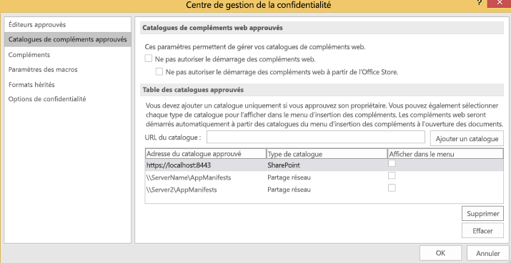
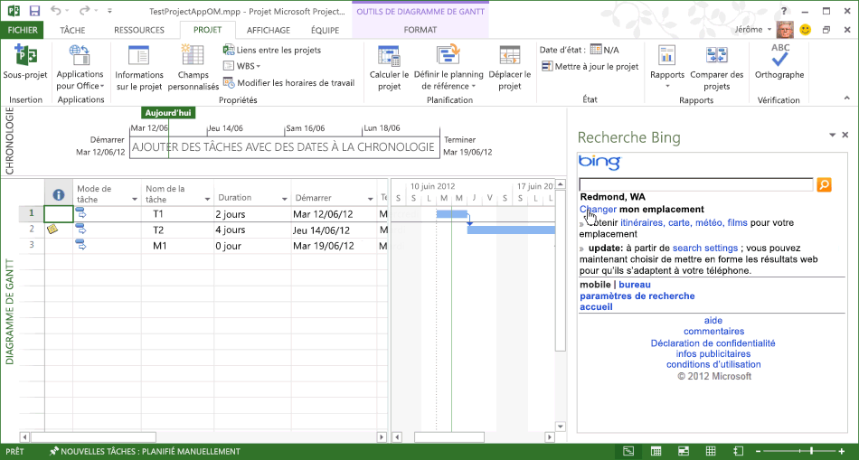

# <a name="task-pane-add-ins-for-project"></a>Compléments du volet Office pour Project

Project Standard 2013 et Project Professionnel 2013 (version 15.1 ou une version ultérieure) incluent la prise en charge des compléments du volet des tâches. Vous pouvez exécuter les compléments du volet des tâches qui sont développés pour Word ou Excel. Vous pouvez également développer des compléments personnalisés qui gèrent des événements de sélection dans Project et intégrer des tâches, ressources, affichages et autres données au niveau de la cellule dans un projet avec des listes SharePoint, compléments SharePoint, composants WebPart, services web et applications d’entreprise.

> [!NOTE]
> Le [téléchargement du kit de développement logiciel (SDK) de Project 2013](https://www.microsoft.com/download/details.aspx?id=30435%20) inclut des exemples de compléments qui montrent comment utiliser le modèle objet du complément pour Project et le service OData pour la création de rapports de données dans Project Server 2013. Après avoir extrait et installé le SDK, accédez au sous-dossier `\Samples\Apps\`.

Pour une introduction aux compléments Office, reportez-vous à [Vue d’ensemble de la plateforme des compléments pour Office](../overview/office-add-ins.md).

## <a name="add-in-scenarios-for-project"></a>Scénarios de compléments pour Project

Les gestionnaires de projet peuvent utiliser les compléments du volet Office dans Project pour les aider dans la gestion de leurs activités. Au lieu de quitter Project et d’ouvrir une nouvelle application pour rechercher les informations qu’ils utilisent fréquemment, les gestionnaires de projet peuvent accéder directement à ces informations à partir de Project. Le contenu d’un complément du volet Office peut être contextuel, basé sur la tâche sélectionnée, la ressource, la vue ou d’autres données dans une cellule de diagramme de Gantt, une vue Utilisation des tâches ou une vue Utilisation des ressources.

> [!NOTE]
> Avec Project Professionnel 2013, vous pouvez développer des compléments du volet Office qui accèdent à Project sur le web, aux installations locales de Project Server 2013, ainsi qu’aux versions locales ou en ligne de SharePoint 2013. Project Standard 2013 ne prend pas en charge l’intégration directe aux données Project Server ou aux listes de tâches SharePoint synchronisées avec Project Server.

Les scénarios des compléments pour Project comprennent les fonctionnalités suivantes :

- **Planification de projet**   Affichez les données de projets associés pouvant avoir une influence sur la planification. Un complément du volet Office peut intégrer les données d’autres projets dans Project Server 2013. Par exemple, vous pouvez afficher un ensemble de projets du service avec les dates importantes, ou afficher les données d’autres projets sur la base d’un champ personnalisé sélectionné.

- **Gestion des ressources**   Affichez un ensemble complet des ressources dans Project Server 2013, ou un sous-ensemble basé sur les compétences spécifiques, notamment les coûts et la disponibilité, afin de sélectionner les ressources appropriées.

- **État des tâches et approbation**   Utilisez une application web dans un complément du volet Office pour mettre à jour ou afficher les données d’une application ERP (enterprise resource planning) externe, d’un système de feuille de temps, ou d’une application de comptabilité. Vous pouvez également créer un composant WebPart d’approbation des états personnalisé utilisable à la fois dans Project Web App et Project Professionnel 2013.

- **Communication avec l’équipe**   Communiquez avec les ressources et les membres de l’équipe directement à partir d’un complément du volet Office, dans le contexte d’un projet. Vous pouvez également gérer facilement un ensemble de notes contextuelles pour vous aider dans votre projet.

- **Pack de travail**   Recherchez des types spécifiques de modèles de projets dans les bibliothèques SharePoint et les librairies, et dans les collections de modèles en ligne. Par exemple, trouvez des modèles pour la construction de vos projets et ajoutez-les à votre collection de modèles Project.

- **Éléments associés**   Affichez les métadonnées, les documents et les messages associés aux tâches spécifiques dans un plan de projet. Par exemple, vous pouvez utiliser Project Professionnel 2013 pour gérer un projet importé à partir d’une liste de tâches SharePoint, et continuer de synchroniser la liste des tâches avec les changements apportés au projet. Un complément du volet Office peut afficher des champs supplémentaires ou des métadonnées que Project n’a pas importés avec les tâches de la liste SharePoint.

- **Utilisation des modèles objet Project Server**   Utilisez le GUID d’une tâche sélectionnée avec les méthodes dans l’interface PSI (Project Server Interface) ou le modèle objet côté client (CSOM) de Project Server. Par exemple, l’application web d'un complément peut lire et mettre à jour les données d’états d’une tâche et d’une ressource sélectionnées, ou s’intégrer à une application de feuille de temps externe.

- **Obtenir les données de rapports**   Utilisez REST (Representational State Transfer), JavaScript, ou les requêtes LINQ pour trouver les informations associées à une tâche ou ressource sélectionnée dans le service OData pour les tableaux de rapports de Project Web App. Les requêtes qui utilisent le service OData peuvent être créées avec une installation de Project Server 2013 en ligne ou locale.

    Par exemple, reportez-vous à [Créer un complément Project qui utilise REST avec un service OData Project Server local](../project/create-a-project-add-in-that-uses-rest-with-an-on-premises-odata-service.md).

## <a name="developing-project-add-ins"></a>Développement de compléments pour Project

La bibliothèque JavaScript pour les compléments Project comprend des extensions de l’alias de l’espace de nom **Office** qui permet aux développeurs d’accéder aux propriétés de l’application Project, ainsi qu’aux tâches, ressources et vues dans un projet. Les extensions de la bibliothèque JavaScript du fichier Project-15.js sont utilisées dans un complément Project créé avec Visual Studio 2015. Les fichiers Office.js, Office.debug.js, Project-15.js, Project-15.debug.js et autres fichiers associés sont également fournis dans le téléchargement du Kit de développement logiciel (SDK) Project 2013.

Pour créer un complément, vous pouvez utiliser un éditeur de texte simple afin de créer une page web HTML avec les fichiers JavaScript associés, les fichiers CSS et les requêtes REST. Outre une page HTML ou une application web, le complément nécessite un fichier manifeste XML pour la configuration. Project peut utiliser un fichier manifeste qui inclut un attribut  **type** spécifié comme **TaskPaneExtension**. Le fichier manifeste peut être utilisé par plusieurs applications clientes Office 2013, ou vous pouvez créer un fichier manifeste spécifique pour Project 2013. Pour plus d’informations, voir la section  _Notions fondamentales de développement_ dans [Vue d’ensemble de la plateforme des compléments pour Office](../overview/office-add-ins.md).

Lorsque vous installez le Kit de développement logiciel (SDK) de Project 2013, le sous-répertoire `\Samples\Apps\` inclut les exemples de compléments suivants:

- **Bing Search :**  le fichier manifeste BingSearch.xml pointe vers la page de recherche Bing pour les périphériques mobiles. Comme l’application web Bing existe déjà sur Internet, le complément de recherche Bing n’utilise pas d’autres fichiers de code source ou le modèle objet de complément pour Project.

- **Projet Test MO :**  le fichier manifeste JSOM_SimpleOMCalls.xml et le fichier JSOM_Call.html constituent, ensemble, un exemple de test du modèle objet et de la fonctionnalité de complément dans Project 2013. Le fichier HTML fait référence au fichier JSOM_Sample.js, qui contient des fonctions JavaScript qui utilisent le fichier Office.js et le fichier Project-15.js pour les fonctionnalités de base. Le téléchargement du SDK contient tous les fichiers de code source nécessaires et le fichier manifeste XML pour le complément Projet Test MO. Le développement et l’installation de l’exemple Projet Test MO est décrit dans [Créer votre premier complément du volet Office pour Project 2013 à l’aide d’un éditeur de texte](../project/create-your-first-task-pane-add-in-for-project-by-using-a-text-editor.md).

- **HelloProject_OData :**  solution Visual Studio pour Project Professionnel 2013 qui résume les données du projet actuel, telles que les coûts, le travail et le pourcentage accompli, et les compare avec la moyenne de tous les projets publiés dans l’instance Project Web App où le projet actif est stocké. Le développement, l’installation et le test de cet exemple qui utilise le protocole REST avec le service  **ProjectData** dans Project Web App, sont décrits dans [Créer un complément Project qui utilise REST avec un service OData Project Server local](../project/create-a-project-add-in-that-uses-rest-with-an-on-premises-odata-service.md). .

### <a name="creating-an-add-in-manifest-file"></a>Création d’un fichier manifeste de complément

Le fichier manifeste spécifie l’URL de la page web du complément ou l’application web, le type de complément (volet Office pour Project), les URL facultatives de contenus pour d’autres langues ou paramètres régionaux, et d’autres propriétés.

### <a name="procedure-1-to-create-the-add-in-manifest-file-for-bing-search"></a>Procédure 1. Créer le fichier manifeste du complément pour Bing Search

- Créez un fichier XML dans un répertoire local. Le fichier XML inclut l’élément  **OfficeApp**, et ses éléments enfants, qui sont décrits dans [Manifeste XML des compléments Office](../develop/add-in-manifests.md). Par exemple, créez un fichier nommé BingSearch.xml qui contient le code XML suivant.

    ```XML
    <?xml version="1.0" encoding="utf-8"?>
    <OfficeApp xmlns="http://schemas.microsoft.com/office/appforoffice/1.0"
               xmlns:xsi="http://www.w3.org/2001/XMLSchema-instance"
               xsi:type="TaskPaneApp">
      <!--IMPORTANT! Id must be unique for each add-in. If you copy this manifest ensure that you change this id to your own GUID. -->
      <Id>01234567-89ab-cedf-0123-456789abcdef</Id>
      <Version>15.0</Version>
      <ProviderName>Microsoft</ProviderName>
      <DefaultLocale>en-us</DefaultLocale>
      <DisplayName DefaultValue="Bing Search">
      </DisplayName>
      <Description DefaultValue="Search selected data on Bing">
      </Description>
      <IconUrl DefaultValue="http://officeimg.vo.msecnd.net/_layouts/images/general/office_logo.jpg">
      </IconUrl>
      <SupportUrl DefaultValue="[Insert the URL of a page that provides support information for the app]" />
      <Capabilities>
        <Capability Name="Project"/>
      </Capabilities>
      <DefaultSettings>
        <SourceLocation DefaultValue="http://m.bing.com">
        </SourceLocation>
      </DefaultSettings>
      <Permissions>ReadWriteDocument</Permissions>
    </OfficeApp>
    ```

- Les éléments suivants sont requis dans le manifeste du complément :
  - Dans l’élément  **OfficeApp**, l’attribut  `xsi:type="TaskPaneApp"` spécifie que le complément est de type volet Office.
  - L’élément  **Id** est un UUID et doit être unique.
  - L’élément  **Version** indique la version du complément. L’élément **ProviderName** correspond au nom de l’entreprise ou du développeur qui fournit le complément. L’élément **DefaultLocale** spécifie les paramètres régionaux par défaut pour les chaînes du manifeste.
  - L’élément  **DisplayName** correspond au nom qui s’affiche dans la liste déroulante **Complément du volet Office** de l’onglet **AFFICHAGE**, dans le ruban de Project 2013. La valeur du nom peut contenir jusqu’à 32 caractères.
  - L’élément  **Description** contient la description du complément pour les paramètres régionaux par défaut. La valeur peut contenir jusqu’à 2 000 caractères.
  - L’élément  **Capabilities** contient un ou plusieurs éléments enfants **Capability** qui spécifient l’application hôte.
  - L’élément  **DefaultSettings** inclut l’élément **SourceLocation**, qui spécifie le chemin d’accès d’un fichier HTML sur un partage de fichiers ou l’URL d’une page web que le complément utilise. Un complément du volet Office ignore l’élément  **RequestedHeight** et l’élément **RequestedWidth**.
  - L’élément **IconUrl** est facultatif. Il peut être une icône sur un partage de fichiers ou l’URL d’une icône dans une application web.

- (Facultatif) Ajoutez des éléments  **Override** qui ont des valeurs pour les autres paramètres régionaux. Par exemple, le manifeste suivant fournit des éléments **Override** pour les valeurs françaises de **DisplayName**,  **Description**,  **IconUrl** et **SourceLocation**.

    ```XML
    <?xml version="1.0" encoding="utf-8"?>
    <OfficeApp xmlns="http://schemas.microsoft.com/office/appforoffice/1.0"
                xmlns:xsi="https://www.w3.org/2001/XMLSchema-instance"
              xsi:type="TaskPaneApp">
      <!--IMPORTANT! Id must be unique for each add-in. If you copy this manifest ensure that you change this id to your own GUID. -->
      <Id>01234567-89ab-cedf-0123-456789abcdef</Id>
      <Version>15.0</Version>
      <ProviderName>Microsoft</ProviderName>
      <DefaultLocale>en-us</DefaultLocale>
      <DisplayName DefaultValue="Bing Search">
        <Override Locale="fr-fr" Value="Bing Search"/>
      </DisplayName>
      <Description DefaultValue="Search selected data on Bing">
        <Override Locale="fr-fr" Value="Search selected data on Bing"></Override>
      </Description>
      <IconUrl DefaultValue="http://officeimg.vo.msecnd.net/_layouts/images/general/office_logo.jpg">
        <Override Locale="fr-fr" Value="http://officeimg.vo.msecnd.net/_layouts/images/general/office_logo.jpg"/>
      </IconUrl>
      <SupportUrl DefaultValue="[Insert the URL of a page that provides support information for the app]" />
      <Capabilities>
        <Capability Name="Project"/>
      </Capabilities>
      <DefaultSettings>
        <SourceLocation DefaultValue="http://m.bing.com">
          <Override Locale="fr-fr" Value="http://m.bing.com"/>
        </SourceLocation>
      </DefaultSettings>
      <Permissions>ReadWriteDocument</Permissions>
    </OfficeApp>
    ```

## <a name="installing-project-add-ins"></a>Installation de compléments Project

Dans Project 2013, vous pouvez installer des compléments comme solutions autonomes sur un partage de fichiers ou dans un catalogue de compléments privé. Vous pouvez également consulter et acheter des compléments dans AppSource.

Un partage de fichiers peut contenir plusieurs fichiers manifestes XML de complément et sous-répertoires. Vous pouvez ajouter ou supprimer des catalogues et des emplacements de répertoire Manifest à l’aide de l’onglet  **Catalogues de compléments approuvés** dans la boîte de dialogue **Centre de gestion de la confidentialité** dans Project 2013. Pour afficher un complément dans Project, l’élément **SourceLocation** dans un manifeste doit pointer vers un site web existant ou un fichier source HTML.

> [!NOTE]
> Si vous développez sur un ordinateur Windows, Internet Explorer ou Microsoft Edge doit être installé. Pour plus d’informations, voir [Navigateurs utilisés par les compléments Office](../concepts/browsers-used-by-office-web-add-ins.md).

Dans la procédure 2, le complément Bing Search est installé sur l’ordinateur local où Project 2013 est installé. Toutefois, comme l’infrastructure du complément n’utilise pas directement les chemins de fichiers locaux tels que  `C:\Project\AppManifests`, vous pouvez créer un partage de fichiers sur l’ordinateur local. Si vous préférez, vous pouvez créer un partage de fichiers sur un ordinateur à distance.

### <a name="procedure-2-to-install-the-bing-search-add-in"></a>Procédure 2. Installer le complément Bing Search

1. Créez un répertoire local pour les fichiers manifestes des compléments. Par exemple, créez un répertoire qui s’appelle  `C:\Project\AppManifests`.

2. Partagez le répertoire  `C:\Project\AppManifests` commeAppManifests, pour que le chemin du partage de fichiers sur le réseau devienne  `\\ServerName\AppManifests`.

3. Copiez le fichier manifeste BingSearch.xml dans le répertoire  `C:\Project\AppManifests`.

4. Dans Project 2013, ouvrez la boîte de dialogue  **Options de Project**, choisissez  **Centre de gestion de la confidentialité**, puis choisissez  **Paramètres du Centre de gestion de la confidentialité**.

5. Dans la boîte de dialogue  **Centre de gestion de la confidentialité**, dans le volet de gauche, choisissez  **Catalogues de compléments approuvés**.

6. Dans le volet  **Catalogues de compléments approuvés** (voir la figure 1), ajoutez le chemin `\\ServerName\AppManifests` dans la zone de texte **URL du catalogue**, choisissez  **Ajouter un catalogue**, puis choisissez  **OK**.

    > [!NOTE]
    > La figure 1 présente deux partages de fichiers et une URL hypothétique associée à un catalogue privé dans la liste **Adresse du catalogue approuvé**. Un seul partage de fichiers peut être défini comme partage par défaut et un seul catalogue d’URL peut être défini comme catalogue par défaut. Par exemple, si vous définissez `\\Server2\AppManifests` comme valeur par défaut, Project désélectionne la case à cocher **Par défaut** pour `\\ServerName\AppManifests`. Si vous changez la sélection par défaut, vous pouvez choisir **Effacer** pour supprimer des compléments installés, puis redémarrer Project. Si vous ajoutez un complément au partage de fichier par défaut ou au catalogue SharePoint alors que Project est ouvert, redémarrez Project.

    *Figure 1. Utilisation du centre de gestion de la confidentialité pour ajouter des catalogues de manifestes de complément*

    

7. Dans le ruban  **Project**, choisissez le menu déroulant  **Compléments Office**, puis choisissez  **Afficher tout**. Dans la boîte de dialogue  **Insérer un complément**, choisissez  **DOSSIER PARTAGÉ** (voir la figure 2).

    *Figure 2. Démarrage d’un complément se trouvant sur un partage de fichiers*

    

8. Sélectionnez le complément Bing Search, puis choisissez  **Insérer**.

    Le complément Bing Search affiche un volet Office comme dans la figure 3. Vous pouvez redimensionner manuellement le volet Office et utiliser le complément Bing Search.

    *Figure 3. Utilisation du complément Recherche Bing*

    

## <a name="distributing-project-add-ins"></a>Distribution de compléments Project

Vous pouvez distribuer des compléments via un partage de fichiers, un catalogue d’applications dans une bibliothèque SharePoint ou dans AppSource. Pour plus d’informations, voir [Publier votre complément Office](../publish/publish.md).

## <a name="see-also"></a>Voir aussi

- [Vue d’ensemble de la plateforme des compléments Office](../overview/office-add-ins.md)
- [Création de compléments Office](../overview/office-add-ins-fundamentals.md)
- [Créer votre premier complément du volet Office pour Project 2013 à l’aide d’un éditeur de texte](create-your-first-task-pane-add-in-for-project-by-using-a-text-editor.md)
- [Créer un complément Project qui utilise REST avec un service OData Project Server local](create-a-project-add-in-that-uses-rest-with-an-on-premises-odata-service.md)
- [Téléchargement du Kit de développement logiciel (SDK) de Project 2013](https://www.microsoft.com/download/details.aspx?id=30435%20)
