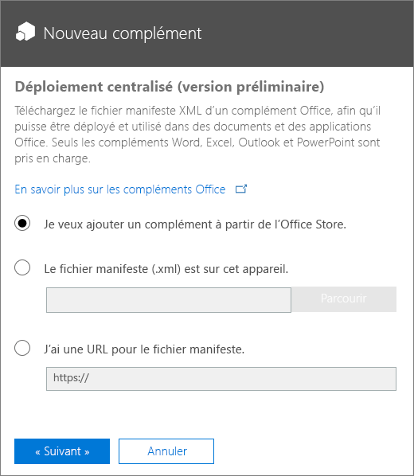
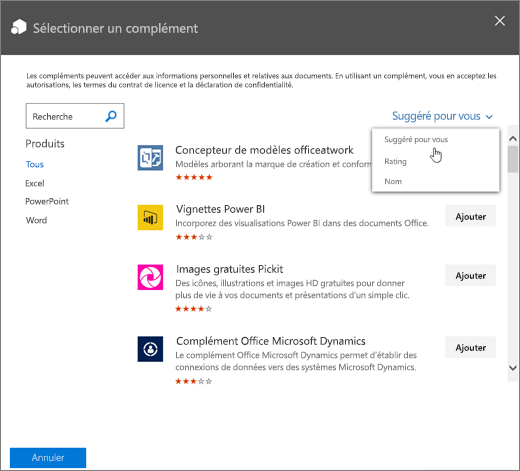
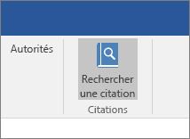
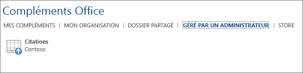
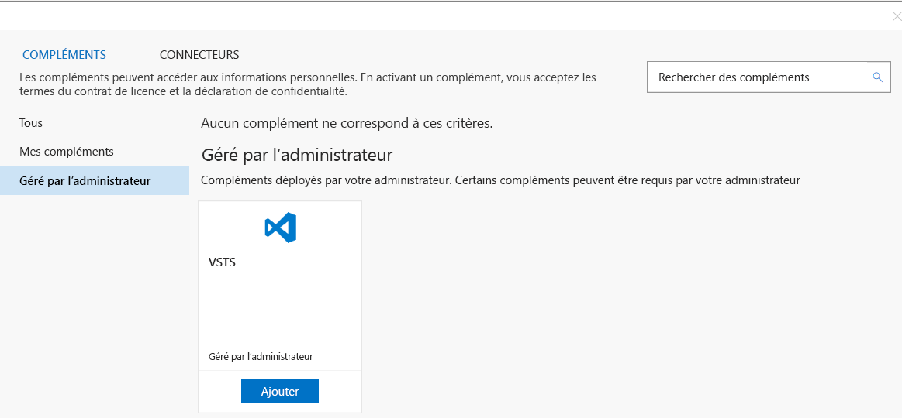

# Publication de compléments Office à l’aide du déploiement centralisé via le centre d’administration Office 365Publish Office Add-ins using Centralized Deployment via the Office 365 admin center

Le centre d’administration Office 365 permet aux administrateurs de déployer facilement des compléments Office auprès d’utilisateurs et de groupes au sein de leur organisation. Les compléments déployés via le centre d’administration sont disponibles pour les utilisateurs directement dans leurs applications Office, sans qu’aucune configuration client ne soit requise. Vous pouvez utiliser le déploiement centralisé pour déployer des compléments internes, ainsi que des compléments fournis par des éditeurs de logiciels indépendants.The Office 365 admin center makes it easy for an administrator to deploy Office Add-ins to users and groups within their organization. Add-ins deployed via the admin center are available to users in their Office applications right away, with no client configuration required. You can use Centralized Deployment to deploy internal add-ins as well as add-ins provided by ISVs.

Le centre d’administration Office 365 prend actuellement en charge les scénarios suivants :The Office 365 admin center currently supports the following scenarios:

- Déploiement centralisé de nouveaux compléments et de ceux mis à jour pour des utilisateurs, des groupes ou une organisation.Centralized Deployment of new and updated add-ins to individuals, groups, or an organization.
- Déploiement sur plusieurs plateformes, y compris Windows, Mac, iOS, Android et sur le Web.Deployment to multiple platforms, including Windows, Mac, iOS, Android, and on the web.
- Déploiement en anglais et pour les clients du monde entier.Deployment to English language and worldwide tenants.
- Déploiement de compléments hébergés sur le cloud.Deployment of cloud-hosted add-ins.
- Déploiement de compléments hébergés au sein d’un pare-feu.Deployment of add-ins that are hosted within a firewall.
- Déploiement de compléments AppSource.Deployment of AppSource add-ins.
- Installation automatique d’un complément pour les utilisateurs au lancement de l’application Office.Automatic installation of an add-in for users when they launch the Office application.
- Suppression automatique d’un complément pour les utilisateurs si l’administrateur désactive ou supprime le complément, ou si les utilisateurs sont supprimés d’Azure Active Directory ou d’un groupe auprès duquel le complément a été déployé.Automatic removal of an add-in for users if the admin turns off or deletes the add-in, or if users are removed from Azure Active Directory or from a group to which the add-in has been deployed.

Le déploiement centralisé est la méthode recommandée pour le déploiement de compléments Office par un administrateur Office 365 dans une organisation, à condition que l’organisation remplisse toutes les conditions d’utilisation du déploiement centralisé.Centralized Deployment is the recommended way for an Office 365 admin to deploy Office Add-ins within an organization, provided that the organization meets all requirements for using Centralized Deployment. Pour savoir comment déterminer si votre organisation peut utiliser un déploiement centralisé, reportez-vous à [Déterminer si un déploiement centralisé de compléments est approprié pour votre organisation Office 365](/office365/admin/manage/centralized-deployment-of-add-ins).For information about how to determine if your organization can use Centralized Deployment, see [Determine if Centralized Deployment of add-ins works for your Office 365 organization](/office365/admin/manage/centralized-deployment-of-add-ins).

> [!NOTE]
> Dans un environnement local sans connexion à Office 365 ou pour déployer des compléments SharePoint ou des compléments Office qui ciblent Office 2013, utilisez un [catalogue d’applications SharePoint](publish-task-pane-and-content-add-ins-to-an-add-in-catalog.md). Pour déployer des compléments COM/VSTO, utilisez ClickOnce ou Windows Installer, comme décrit dans la rubrique [Déploiement d’une solution Office](/visualstudio/vsto/deploying-an-office-solution).In an on-premises environment with no connection to Office 365, or to deploy SharePoint add-ins or Office Add-ins that target Office 2013, use a [SharePoint app catalog](publish-task-pane-and-content-add-ins-to-an-add-in-catalog.md). To deploy COM/VSTO add-ins, use ClickOnce or Windows Installer, as described in [Deploying an Office solution](/visualstudio/vsto/deploying-an-office-solution).

## Approche recommandée pour le déploiement des compléments OfficeRecommended approach for deploying Office Add-ins

Envisagez de déployer des compléments Office dans une approche progressive pour vous assurer que le déploiement se déroule sans problème. Nous recommandons le plan suivant :Consider deploying Office Add-ins in a phased approach to help ensure that the deployment goes smoothly. We recommend the following plan:

1. Déployez le complément auprès d’un petit groupe de parties prenantes et de membres du service informatique. Si le déploiement réussit, passez à l’étape 2.Deploy the add-in to a small set of business stakeholders and members of the IT department. If the deployment is successful, move on to step 2.

2. Déployez le complément auprès d’un groupe plus important de membres dans l’organisation qui utilisera le complément. Si le déploiement réussit, passez à l’étape 3.Deploy the add-in to a larger set of individuals within the business who will be using the add-in. If the deployment is successful, move on to step 3.

3. Déployez le complément auprès du groupe entier de membres qui utilisera le complément.Deploy the add-in to the full set of individuals who will be using the add-in.

Selon la taille de l’audience cible, vous pouvez ajouter des étapes à cette procédure ou en supprimer.Depending on the size of the target audience, you may want to add steps to or remove steps from this procedure.

## Publication d’un complément Office via le déploiement centraliséPublish an Office Add-in via Centralized Deployment

Avant de commencer, vérifiez que votre organisation est conforme à toutes les conditions d’utilisation du déploiement centralisé, comme décrit dans la rubrique [Déterminer si un déploiement centralisé de compléments est approprié pour votre organisation Office 365](/microsoft-365/admin/manage/centralized-deployment-of-add-ins).Before you begin, confirm that your organization meets all requirements for using Centralized Deployment, as described in [Determine if Centralized Deployment of add-ins works for your Office 365 organization](/microsoft-365/admin/manage/centralized-deployment-of-add-ins).

Si votre organisation répond à toutes les conditions requises, procédez comme suit pour publier un complément Office via un déploiement centralisé :If your organization meets all requirements, complete the following steps to publish an Office Add-in via Centralized Deployment:

1. Connectez-vous à Office 365 avec votre compte professionnel ou scolaire.Sign in to Office 365 with your work or school account.
2. Sélectionnez l’icône du lanceur d’applications située en haut à gauche et choisissez **Administrateur**.Select the app launcher icon in the upper-left and choose **Admin**.
3. Dans le menu de navigation, appuyez sur **Afficher plus**, puis choisissez **Paramètres** > **Services et compléments**.In the navigation menu, press **Show more**, then choose **Settings** > **Services & add-ins**.
4. Si un message annonçant le nouveau Centre d’administration Office 365 apparaît en haut de la page, cliquez dessus pour accéder à la préversion du Centre d’administration (reportez-vous à l’article [À propos du Centre d’administration Office 365](/microsoft-365/admin/admin-overview/about-the-admin-center)).If you see a message on the top of the page announcing the new Office 365 admin center, choose the message to go to the Admin Center Preview (see [About the Office 365 admin center](/microsoft-365/admin/admin-overview/about-the-admin-center)).
5. Choisissez **Déployer un complément** en haut de la page.Choose **Deploy Add-In** at the top of the page.
6. Choisissez **Suivant** après avoir consulté la configuration requise.Choose **Next** after reviewing the requirements.
7. Dans la page **Déploiement centralisé**, choisissez l’une des options suivantes :Choose one of the following options on the **Centralized Deployment** page:

    - **Je veux ajouter un complément à partir de l’Office Store**.**I want to add an Add-In from the Office Store.**
    - **J’ai le fichier manifeste (.xml) sur cet appareil**. Pour cette option, sélectionnez **Parcourir** afin de recherche le fichier manifeste (.xml) que vous voulez utiliser.**I have the manifest file (.xml) on this device.** For this option, choose **Browse** to locate the manifest file (.xml) that you want to use.
    - **J’ai une URL pour le fichier manifeste**. Pour cette option, entrez l’URL du manifeste dans le champ disponible.**I have a URL for the manifest file.** For this option, type the manifest's URL in the field provided.

    

8. Si vous avez sélectionné l’option d’ajout d’un complément à partir de l’Office Store, sélectionnez le complément.If you selected the option to add an add-in from the Office Store, select the add-in. Vous pouvez afficher les compléments disponibles via l’une des catégories suivantes : **Suggestions**, **Évaluation** ou **Nom**.You can view available add-ins via categories of **Suggested for you**, **Rating**, or **Name**. Vous ne pouvez ajouter que des compléments gratuits de l’Office Store.You may only add free add-ins from Office Store. L’ajout de compléments payants n’est pas actuellement pris en charge.Adding paid add-ins isn't currently supported.

    > [!NOTE]
    > Avec l’option Office Store, les mises à jour et améliorations du complément sont automatiquement disponibles pour les utilisateurs sans intervention de votre part.With the Office Store option, updates and enhancements to the add-in are automatically available to users without your intervention.

    

9. Choisissez **Continuer** après avoir vérifié les détails du complément, la politique de confidentialité et les termes de la licence.Choose **Continue** after reviewing the add-in details, Privacy Policy, and License Terms.

    

10. Sur la **page attribuer des utilisateurs** , choisissez **tout le monde**, **utilisateurs/groupes spécifiques**ou **moi seul**.On the **Assign Users** page, choose **Everyone**, **Specific Users/Groups**, or **Only me**. Utilisez la zone de recherche pour trouver les utilisateurs et groupes vers lesquels vous voulez déployer le complément.Use the search box to find the users and groups to whom you want to deploy the add-in. Pour les compléments Outlook, vous pouvez également choisir la méthode de déploiement **fixe**, **disponible**ou **facultative**.For Outlook add-ins, you can also choose the deployment method **Fixed**, **Available**, or **Optional**.

    

    > [!NOTE]
    > Un système d’[authentification unique (SSO) ](../develop/sso-in-office-add-ins.md) pour les compléments est actuellement en préversion, qui ne doit pas être utilisé pour des compléments en production.Lors du déploiement d’un complément utilisant une authentification unique, les utilisateurs et les groupes affectés sont également partagés avec des compléments partageant le même ID d’application Azure.A [single sign-on (SSO)](../develop/sso-in-office-add-ins.md) system for add-ins is currently in preview and should not be used for production add-ins. When an add-in using SSO is deployed, the users and groups assigned are also shared with add-ins that share the same Azure App ID. Les modifications apportées aux affectations d’utilisateurs sont également appliquées à ces compléments. Les compléments connexes sont affichés sur cette page.Any changes to user assignments are also applied to those add-ins. The related add-ins are shown on this page. Uniquement pour les compléments d’authentification unique, cette page affiche la liste des autorisations Microsoft Graph requises.For SSO add-ins only, this page displays the list of Microsoft Graph permissions that the add-in requires.

11. Lorsque vous avez terminé, choisissez **déployer**.When finished, choose **Deploy**. Ce processus peut prendre jusqu’à trois minutes.This process may take up to three minutes. Ensuite, terminez la procédure en appuyant sur **Suivant**.Then, finish the walkthrough by pressing **Next**. Votre complément apparaît à présent avec d’autres applications dans Office 365.You now see your add-in along with other apps in Office 365.

    > [!NOTE]
    > Lorsqu’un administrateur choisit **Deploy**, le consentement est donné pour tous les utilisateurs.When an administrator chooses **Deploy**, consent is given for all users.

    

> [!TIP]
> lorsque vous déployez un nouveau complément vers des utilisateurs et/ou des groupes de votre organisation, pensez à leur envoyer un courrier décrivant quand et comment utiliser le complément et incluez des liens vers un contenu pertinent de l’aide ou du forum aux questions, ou d’autres ressources de support.When you deploy a new add-in to users and/or groups in your organization, consider sending them an email that describes when and how to use the add-in, and includes links to relevant Help content, FAQs, or other support resources.

## Éléments à prendre en compte lors de l’octroi de l’accès à un complémentConsiderations when granting access to an add-in

Les administrateurs peuvent affecter un complément à tout le monde ou à des utilisateurs et/ou groupes spécifiques au sein de l’organisation. Chaque option a des conséquences spécifiques :Admins can assign an add-in to everyone in the organization or to specific users and/or groups within the organization. The following list describes the implications of each option:

- **Tout le monde** : comme son nom l’indique, cette option affecte le complément à tous les utilisateurs du client. Utilisez-la avec parcimonie et uniquement pour les compléments qui sont réellement universels pour l’ensemble de votre organisation.**Everyone**: As the name implies, this option assigns the add-in to every user in the tenant. Use this option sparingly and only for add-ins that are truly universal to your organization.

- **Utilisateurs** : si vous affectez un complément à un utilisateur particulier, vous devez mettre à jour les paramètres de déploiement centralisé pour le complément chaque fois que vous souhaitez l’affecter à des utilisateurs supplémentaires.**Users**: If you assign an add-in to individual users, you'll need to update the Central Deployment settings for the add-in each time you want to assign it additional users. De même, vous devez mettre à jour les paramètres de déploiement centralisé pour le complément chaque fois que vous souhaitez supprimer l’accès d’un utilisateur au complément.Likewise, you'll need to update the Central Deployment settings for the add-in each time you want to remove a user's access to the add-in.

- **Groupes** : si vous affectez un complément à un groupe, le complément est automatiquement affecté aux utilisateurs ajoutés au groupe.**Groups**: If you assign an add-in to a group, users who are added to the group will automatically be assigned the add-in. De même, quand un utilisateur est supprimé d’un groupe, il perd l’accès au complément.Likewise, when a user is removed from a group, the user automatically loses access to the add-in. Dans les deux cas, aucune action supplémentaire n’est requise de votre part en tant qu’administrateur Office 365.In either case, no additional action is required from the Office 365 admin.

En général, pour faciliter la maintenance, nous vous recommandons d’affecter des compléments à l’aide de groupes. Toutefois, dans les situations où vous souhaitez restreindre l’accès au complément à un très petit nombre d’utilisateurs, il peut être plus pratique d’affecter le complément à des utilisateurs spécifiques.In general, for ease of maintenance, we recommend assigning add-ins by using groups whenever possible. However, in situations where you want to restrict add-in access to a very small number of users, it may be more practical to assign the add-in to specific users.

## États de complémentAdd-in states

Le tableau suivant décrit les différents états qui s’appliquent à un complément.The following table describes the different states of an add-in.

|ÉtatState|Comment l’état se produitHow the state occurs|ImpactImpact|
|-----|--------------------|------|
|**Actif****Active**|Un administrateur a chargé le complément et l’a affecté à des utilisateurs et/ou groupes.Admin uploaded the add-in and assigned it to users and/or groups.|Les utilisateurs et/ou groupes auxquels le complément est affecté voient celui-ci dans les clients Office concernés.Users and/or groups assigned to the add-in see it in the relevant Office clients.|
|**Désactivé****Turned off**|Un administrateur a désactivé le complément.Admin turned off the add-in.|Les utilisateurs et/ou groupes auxquels le complément est affecté ne peuvent plus y accéder. Si l’état du complément est modifié, passant de **Désactivé** à **Actif**, les utilisateurs et groupes y ont de nouveau accès.Users and/or groups assigned to the add-in no longer have access to it. If the add-in state is changed from **Turned off** to **Active**, the users and groups will regain access to it.|
|**Deleted****Deleted**|Un administrateur a supprimé le complément.Admin deleted the add-in.|Les utilisateurs et/ou groupes auxquels le complément est affecté ne peuvent plus y accéder.Users and/or groups assigned the add-in no longer have access to it.|

## Mise à jour des compléments Office publiés via un déploiement centraliséUpdating Office Add-ins that are published via Centralized Deployment

Une fois qu’un complément Office a été publié via un déploiement centralisé, les modifications apportées à l’application web du complément sont automatiquement disponibles pour tous les utilisateurs dès qu’elles sont implémentées dans l’application web. Les modifications apportées au [fichier manifeste XML](../develop/add-in-manifests.md) d’un complément, par exemple, pour mettre à jour l’icône du complément, le texte ou les commandes du complément se produisent comme suit :After an Office Add-in has been published via Centralized Deployment, any changes made to the add-in's web application will automatically be available to all users as soon as those changes are implemented in the web application. Changes made to an add-in's [XML manifest file](../develop/add-in-manifests.md), for example, to update the add-in's icon, text, or add-in commands, happen as follows:

- **Complément métier** : si un administrateur a chargé explicitement un fichier manifeste lors de l’implémentation du déploiement centralisé via le Centre d’administration Office 365, il doit charger un nouveau fichier manifeste contenant les modifications souhaitées.**Line-of-business add-in**: If an admin explicitly uploaded a manifest file when implementing Centralized Deployment via the Office 365 admin center, the admin must upload a new manifest file that contains the desired changes. Une fois que le fichier manifeste a été chargé, le complément est mis à jour au démarrage suivant des applications Office concernées.After the updated manifest file has been uploaded, the next time the relevant Office applications start, the add-in will update.

  > [!NOTE]
  > Un administrateur n’a pas besoin de supprimer un complément LOB pour effectuer une mise à jour.An admin doesn't need to remove a LOB add-in to make an update. Dans la section compléments, l’administrateur peut simplement choisir le complément LOB et appeler cette fonctionnalité en appuyant sur le bouton **mettre à jour le complément** présent dans le coin inférieur droit.In the Add-ins section, the admin can simply choose the LOB add-in and invoke this functionality by pressing the **Update add-in** button present in the bottom right corner.
  > 
  > 

- **Complément de l’Office Store** : si un administrateur a sélectionné un complément dans l’Office Store lors de l’implémentation du déploiement centralisé via le Centre d’administration Office 365 et que le complément est mis à jour dans l’Office Store, le complément sera mis à jour plus tard via le déploiement centralisé.**Office Store add-in**: If an admin selected an add-in from the Office Store when implementing Centralized Deployment via the Office 365 admin center, and the add-in updates in the Office Store, the add-in will update later via Centralized Deployment. Le complément est mis à jour au démarrage suivant des applications Office concernées.The next time the relevant Office applications start, the add-in will update.

## Expérience des utilisateurs finaux avec les complémentsEnd user experience with add-ins

Une fois qu’un complément a été publié via un déploiement centralisé, les utilisateurs finaux peuvent commencer à l’utiliser sur toutes les plateformes prises en charge par le complément.After an add-in has been published via Centralized Deployment, end users may start using it on any platform that the add-in supports.

Si le complément prend en charge les commandes de complément, celles-ci apparaissent dans le ruban de l’application Office pour tous les utilisateurs vers lesquels le complément est déployé. Dans l’exemple suivant, la commande **Recherche de citation** apparaît dans le ruban pour le complément **Citations**.If the add-in supports add-in commands, the commands will appear on the Office application ribbon for all users to whom the add-in is deployed. In the following example, the command **Search Citation** appears in the ribbon for the **Citations** add-in.

Si le complément ne prend pas en charge les commandes de complément, les utilisateurs peuvent l’ajouter à leur application Office en procédant comme suit :If the add-in does not support add-in commands, users can add it to their Office application by doing the following:

1. Dans Word 2016 ou version ultérieure, Excel 2016 ou version ultérieure ou PowerPoint 2016 ou version ultérieure, choisissez **Insertion** > **Mes compléments**.In Word 2016 or later, Excel 2016 or later, or PowerPoint 2016 or later, choose **Insert** > **My Add-ins**.
2. Sélectionnez l’onglet **Géré par l’administrateur** dans la fenêtre du complément.Choose the **Admin Managed** tab in the add-in window.
3. Choisissez le complément, puis cliquez sur **Ajouter**.Choose the add-in, and then choose **Add**.

    

Toutefois, pour Outlook 2016 ou version ultérieure, les utilisateurs peuvent procéder comme suit :However, for Outlook 2016 or later, users can do the following:

1. Dans Outlook, Choisissez **Accueil** > **Store**.In Outlook, choose **Home** > **Store**.
2. Sélectionnez l’élément **Géré par l’administrateur** dans la fenêtre du complément.Choose the **Admin-managed** item under the add-in tab.
3. Choisissez le complément, puis **Ajouter**.Choose the add-in, and then choose **Add**.

    

## Voir aussiSee also

- [Déterminer si le déploiement centralisé des compléments fonctionne avec votre organisation Office 365Determine if Centralized Deployment of add-ins works for your Office 365 organization](/office365/admin/manage/centralized-deployment-of-add-ins)
