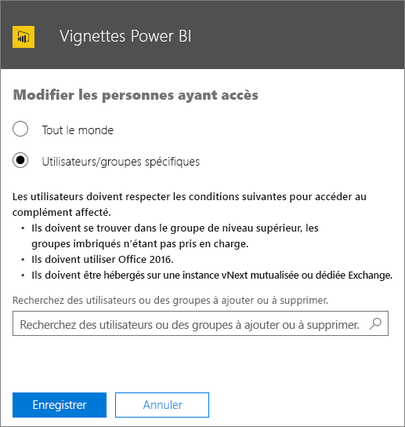
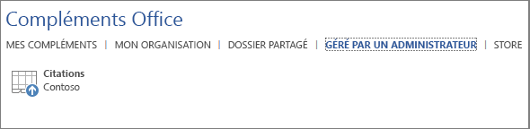

# Publication de compléments Office à l’aide du déploiement centralisé via le centre d’administration Office 365

Le centre d’administration Office 365 permet aux administrateurs de déployer facilement des compléments Office auprès d’utilisateurs et de groupes au sein de leur organisation. Les compléments déployés via le centre d’administration sont disponibles pour les utilisateurs directement dans leurs applications Office, sans qu’aucune configuration client ne soit requise. Vous pouvez utiliser le déploiement centralisé pour déployer des compléments internes, ainsi que des compléments fournis par des éditeurs de logiciels indépendants.

Le centre d’administration Office 365 prend actuellement en charge les scénarios suivants :

- Déploiement centralisé de nouveaux compléments et de ceux mis à jour pour des utilisateurs, des groupes ou une organisation.
- Déploiement de plusieurs plateformes, y compris Windows et Office Online (Mac bientôt disponible).
- Déploiement en anglais et pour les clients du monde entier.
- Déploiement de compléments hébergés sur le cloud.
- Déploiement de compléments hébergés au sein d’un pare-feu.
- Déploiement de compléments Office Store.
- Installation automatique d’un complément pour les utilisateurs au lancement de l’application Office.
- Suppression automatique d’un complément pour les utilisateurs si l’administrateur désactive ou supprime le complément, ou si les utilisateurs sont supprimés d’Azure Active Directory ou d’un groupe auprès duquel le complément a été déployé.

Le déploiement centralisé est la méthode recommandée pour le déploiement de compléments Office par un administrateur Office 365 dans une organisation, à condition que l’organisation remplisse toutes les conditions d’utilisation du déploiement centralisé. Pour savoir comment déterminer si votre organisation peut utiliser un déploiement centralisé, reportez-vous à [Déterminer si un déploiement centralisé de compléments est approprié pour votre organisation Office 365](https://support.office.com/en-us/article/Determine-if-Centralized-Deployment-of-add-ins-works-for-your-Office-365-organization-B4527D49-4073-4B43-8274-31B7A3166F92).

>**Remarque :** Dans un environnement local sans connexion à Office 365 ou pour déployer des compléments SharePoint ou des compléments Office qui ciblent Office 2013, utilisez un [catalogue de compléments SharePoint](publish-task-pane-and-content-add-ins-to-an-add-in-catalog.md). Pour déployer des compléments COM/VSTO, utilisez ClickOnce ou Windows Installer, comme décrit dans la rubrique [Déploiement d’une solution Office](https://msdn.microsoft.com/en-us/library/bb386179.aspx).

## Approche recommandée pour le déploiement des compléments Office

Envisagez de déployer des compléments Office s une approche progressive pour vous assurer que le déploiement se déroule sans problème. Nous vous recommandons le plan suivant :

1. Déployez le complément auprès d’un petit groupe de parties prenantes et de membres du service informatique. Si le déploiement réussit, passez à l’étape 2.

2. Déployez le complément auprès d’un groupe plus important de membres dans l’organisation qui utilisera le complément. Si le déploiement réussit, passez à l’étape 3.

3. Déployez le complément auprès du groupe entier de membres qui utilisera le complément.

Selon la taille de l’audience cible, vous pouvez ajouter des étapes à cette procédure ou en supprimer.

## Publication d’un complément Office via le déploiement centralisé

Avant de commencer, vérifiez que votre organisation est conforme à toutes les conditions d’utilisation du déploiement centralisé, comme décrit dans la rubrique [Déterminer si un déploiement centralisé de compléments est approprié pour votre organisation Office 365](https://support.office.com/en-us/article/Determine-if-Centralized-Deployment-of-add-ins-works-for-your-Office-365-organization-B4527D49-4073-4B43-8274-31B7A3166F92).

Si votre organisation répond à toutes les conditions requises, procédez comme suit pour publier un complément Office via un déploiement centralisé :

1. Connectez-vous à Office 365 avec votre compte professionnel ou scolaire.
2. Sélectionnez l’icône du lanceur d’applications située en haut à gauche et choisissez **Administrateur**.
3. Dans le menu de navigation, sélectionnez **Paramètres**  >  **Services et compléments**.
4. Si un message annonçant le nouveau Centre d’administration Office 365 apparaît en haut de la page, cliquez dessus pour accéder à la préversion du Centre d’administration (reportez-vous à l’article [À propos du Centre d’administration Office 365](https://support.office.com/en-ie/article/About-the-Office-365-admin-center-758befc4-0888-4009-9f14-0d147402fd23)).
5. Choisissez **Charger un complément** en haut de la page. 
6. Dans la page **Déploiement centralisé**, choisissez l’une des options suivantes :

    - **Je veux ajouter un complément à partir de l’Office Store**.
    - **J’ai le fichier manifeste (.xml) sur cet appareil**. Pour cette option, sélectionnez **Parcourir** afin de recherche le fichier manifeste (.xml) que vous voulez utiliser.
    - **J’ai une URL pour le fichier manifeste**. Pour cette option, entrez l’URL du manifeste dans le champ disponible.

    

7.  Cliquez sur **Suivant**.

8.  Si vous avez sélectionné l’option d’ajout d’un complément à partir de l’Office Store, sélectionnez le complément. Notez que vous pouvez afficher les compléments disponibles via l’une des catégories suivantes : **Suggestions**, **Évaluation** ou **Nom**. Seuls les compléments gratuits peuvent être ajoutés à partir de l’Office Store. Les compléments payants ne sont pas pris en charge pour le moment.

    >**Remarque :** Avec l’option Office Store, les mises à jour et améliorations du complément sont automatiquement mises à la disposition des utilisateurs, sans intervention de votre part.

    

9. Le complément est désormais activé. Dans la page relative au complément, l’état de celui-ci indique **Activé**, comme illustré pour le complément des vignettes Power BI dans la capture d’écran ci-dessous. Dans **Qui a accès**, sélectionnez **Modifier** pour affecter le complément à des utilisateurs et/ou groupes.

    

10. Dans la page **Modifier les utilisateurs ayant accès**, sélectionnez **Tout le monde** ou **Utilisateurs/Groupes spécifiques**. Utilisez la zone de recherche pour trouver les utilisateurs et/ou groupes vers lesquels vous voulez déployer le complément.

    

    >**Remarque :** pour les compléments à authentification unique (SSO), les utilisateurs et les groupes affectés seront également partagés avec les compléments partageant le même ID d’application Azure. Les modifications apportées aux affectations d’utilisateurs seront appliquées également à ces compléments. Les compléments connexes seront affichés sur cette page. Uniquement pour les compléments à authentification unique, cette page affiche la liste des autorisations Microsoft Graph requises par le complément.

11. Lorsque vous avez terminé, cliquez sur **Enregistrer**, passez en revue les paramètres du complément, puis cliquez sur **Fermer**. Votre complément apparaît à présent avec d’autres applications dans Office 365.
    >**Remarque :** Quand un administrateur sélectionne **Enregistrer**, le consentement est donné pour tous les utilisateurs. 

    

>**Conseil :** lorsque vous déployez un nouveau complément vers des utilisateurs et/ou des groupes de votre organisation, pensez à leur envoyer un courrier décrivant quand et comment utiliser le complément et incluez des liens vers un contenu pertinent de l’aide ou du forum aux questions, ou d’autres ressources de support.

## Éléments à prendre en compte lors de l’octroi de l’accès à un complément

Les administrateurs peuvent affecter un complément à tout le monde ou à des utilisateurs et/ou groupes spécifiques au sein de l’organisation. Chaque option a des conséquences spécifiques :

- **Tout le monde** : comme son nom l’indique, cette option affecte le complément à tous les utilisateurs du client. Utilisez-la avec parcimonie et uniquement pour les compléments qui sont réellement universels pour votre organisation.

- **Utilisateurs** : si vous affectez un complément à un utilisateur particulier, vous devez mettre à jour les paramètres de déploiement centralisé pour le complément chaque fois que vous souhaitez l’affecter à des utilisateurs supplémentaires. De même, vous devez mettre à jour les paramètres de déploiement centralisé pour le complément chaque fois que vous souhaitez supprimer l’accès d’un utilisateur au complément.

- **Groupes** : si vous affectez un complément à un groupe, le complément est automatiquement affecté aux utilisateurs ajoutés au groupe. De même, quand un utilisateur est supprimé d’un groupe, il perd l’accès au complément. Dans les deux cas, aucune action supplémentaire n’est requise de votre part en tant qu’administrateur Office 365.

En général, pour faciliter la maintenance, nous vous recommandons d’affecter des compléments à l’aide de groupes. Toutefois, dans les situations où vous souhaitez restreindre l’accès au complément à un très petit nombre d’utilisateurs, il peut être plus pratique d’affecter le complément à des utilisateurs spécifiques. 

## États de complément

Le tableau suivant décrit les différents états qui s’appliquent à un complément.

|État|Comment l’état se produit|Impact|
|-----|--------------------|------|
|**Actif**|Un administrateur a chargé le complément et l’a affecté à des utilisateurs et/ou groupes.|Les utilisateurs et/ou groupes auxquels le complément est affecté voient celui-ci dans les clients Office concernés.|
|**Désactivé**|Un administrateur a désactivé le complément.|Les utilisateurs et/ou groupes auxquels le complément est affecté ne peuvent plus y accéder. Si l’état du complément est modifié, passant de **Désactivé** à **Actif**, les utilisateurs et groupes y ont de nouveau accès.|
|**Supprimé**|Un administrateur a supprimé le complément.|Les utilisateurs et/ou groupes auxquels le complément est affecté ne peuvent plus y accéder.|

## Mise à jour des compléments Office publiés via un déploiement centralisé

Une fois qu’un complément Office a été publié via un déploiement centralisé, les modifications apportées à l’application web du complément sont automatiquement disponibles pour tous les utilisateurs dès qu’elles sont implémentées dans l’application web. Les modifications apportées au [fichier manifeste XML](../overview/add-in-manifests.md) d’un complément, par exemple, pour mettre à jour l’icône du complément, le texte ou les commandes du complément se produisent comme suit :

- **Complément métier** : si un administrateur a chargé explicitement un fichier manifeste lors de l’implémentation du déploiement centralisé via le Centre d’administration Office 365, il doit charger un nouveau fichier manifeste contenant les modifications souhaitées. Une fois que le fichier manifeste a été chargé, le complément est mis à jour au démarrage suivant des applications Office concernées.

- **Complément de l’Office Store** : si un administrateur a sélectionné un complément dans l’Office Store lors de l’implémentation du déploiement centralisé via le Centre d’administration Office 365 et que le complément est mis à jour dans l’Office Store, le complément sera mis à jour plus tard via le déploiement centralisé. Le complément est mis à jour au démarrage suivant des applications Office concernées.

## Expérience des utilisateurs finaux avec les compléments

Une fois qu’un complément a été publié via un déploiement centralisé, les utilisateurs finaux peuvent commencer à l’utiliser sur toutes les plateformes prises en charge par le complément. 

Si le complément prend en charge les commandes de complément, celles-ci apparaissent dans le ruban de l’application Office pour tous les utilisateurs vers lesquels le complément est déployé. Dans l’exemple suivant, la commande **Recherche de citation** apparaît dans le ruban pour le complément **Citations**. 

Si le complément ne prend pas en charge les commandes de complément, les utilisateurs peuvent l’ajouter à leur application Office en procédant comme suit :

1.  Dans Word 2016, Excel 2016 ou PowerPoint 2016, sélectionnez **Insérer**  >  **Mes compléments**.
2.  Sélectionnez l’onglet **Géré par l’administrateur** dans le fenêtre du complément.
3.  Choisissez le complément, puis cliquez sur **Ajouter**. 

    
