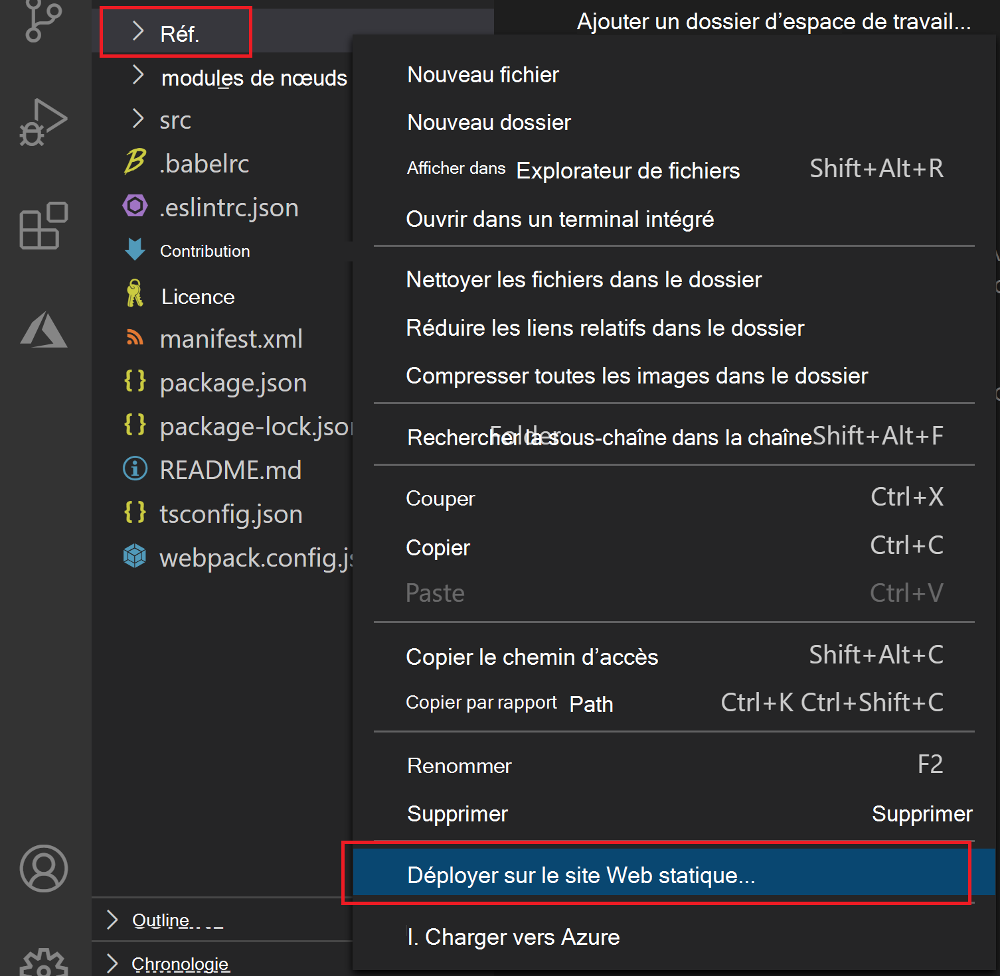

# <a name="publish-an-add-in-developed-with-visual-studio-code"></a><span data-ttu-id="8cacf-103">Publier un complément développé avec Visual Studio Code</span><span class="sxs-lookup"><span data-stu-id="8cacf-103">Publish an add-in developed with Visual Studio Code</span></span>

<span data-ttu-id="8cacf-104">Cet article explique comment un complément Office que vous avez créé à l’aide du générateur Yeoman et développé avec [Visual Studio Code (VS Code)](https://code.visualstudio.com) ou un autre éditeur.</span><span class="sxs-lookup"><span data-stu-id="8cacf-104">This article describes how to publish an Office Add-in that you created using the Yeoman generator and developed with [Visual Studio Code (VS Code)](https://code.visualstudio.com) or any other editor.</span></span>

> [!NOTE]
> <span data-ttu-id="8cacf-105">Pour plus d’informations sur la publication d’un complément Office que vous avez créé à l’aide de Visual Studio, voir [Publier votre complément à l’aide de Visual Studio](package-your-add-in-using-visual-studio.md).</span><span class="sxs-lookup"><span data-stu-id="8cacf-105">For information about publishing an Office Add-in that you created using Visual Studio, see [Publish your add-in using Visual Studio](package-your-add-in-using-visual-studio.md).</span></span>

## <a name="publishing-an-add-in-for-other-users-to-access"></a><span data-ttu-id="8cacf-106">Publication d’un complément pour accéder à d’autres utilisateurs</span><span class="sxs-lookup"><span data-stu-id="8cacf-106">Publishing an add-in for other users to access</span></span>

<span data-ttu-id="8cacf-107">Un complément Office comprend une application Web et un fichier manifeste.</span><span class="sxs-lookup"><span data-stu-id="8cacf-107">An Office Add-in consists of a web application and a manifest file.</span></span> <span data-ttu-id="8cacf-108">L’application Web définit l’interface utilisateur et les fonctionnalités du complément, tandis que le manifeste spécifie l’emplacement de l’application Web et définit les paramètres et fonctionnalités du complément.</span><span class="sxs-lookup"><span data-stu-id="8cacf-108">The web application defines the add-in's user interface and functionality, while the manifest specifies the location of the web application and defines settings and capabilities of the add-in.</span></span>

<span data-ttu-id="8cacf-109">Pendant que vous développez, vous pouvez exécuter le complément sur votre serveur Web local ( `localhost` ).</span><span class="sxs-lookup"><span data-stu-id="8cacf-109">While you're developing, you can run the add-in on your local web server (`localhost`).</span></span> <span data-ttu-id="8cacf-110">Lorsque vous êtes prêt à le publier pour permettre à d’autres utilisateurs d’y accéder, vous devez déployer l’application Web et mettre à jour le manifeste pour spécifier l’URL de l’application déployée.</span><span class="sxs-lookup"><span data-stu-id="8cacf-110">When you're ready to publish it for other users to access, you'll need to deploy the web application and update the manifest to specify the URL of the deployed application.</span></span>

<span data-ttu-id="8cacf-111">Lorsque votre complément fonctionne comme vous le souhaitez, vous pouvez le publier directement par le biais de Visual Studio code à l’aide de l’extension de stockage Azure.</span><span class="sxs-lookup"><span data-stu-id="8cacf-111">When your add-in is working as desired, you can publish it directly through Visual Studio Code using the Azure Storage extension.</span></span>

## <a name="using-visual-studio-code-to-publish"></a><span data-ttu-id="8cacf-112">Utilisation de Visual Studio code pour publier</span><span class="sxs-lookup"><span data-stu-id="8cacf-112">Using Visual Studio Code to publish</span></span>

>[!NOTE]
> <span data-ttu-id="8cacf-113">Ces étapes fonctionnent uniquement pour les projets créés avec le générateur Yeoman.</span><span class="sxs-lookup"><span data-stu-id="8cacf-113">These steps only work for projects created with the Yeoman generator.</span></span>

1. <span data-ttu-id="8cacf-114">Ouvrez votre projet à partir de son dossier racine dans Visual Studio code (VS code).</span><span class="sxs-lookup"><span data-stu-id="8cacf-114">Open your project from its root folder in Visual Studio Code (VS Code).</span></span>
2. <span data-ttu-id="8cacf-115">À partir de l’affichage extensions dans le code VS, recherchez l’extension de stockage Azure et installez-la.</span><span class="sxs-lookup"><span data-stu-id="8cacf-115">From the Extensions view in VS Code, search for the Azure Storage extension and install it.</span></span>
3. <span data-ttu-id="8cacf-116">Une fois installé, une icône Azure est ajoutée à la barre d’activité.</span><span class="sxs-lookup"><span data-stu-id="8cacf-116">Once installed, an Azure icon is added to the Activity Bar.</span></span> <span data-ttu-id="8cacf-117">Sélectionnez-le pour accéder à l’extension.</span><span class="sxs-lookup"><span data-stu-id="8cacf-117">Select it to access the extension.</span></span> <span data-ttu-id="8cacf-118">Si votre barre d’activité est masquée, vous ne pourrez pas accéder à l’extension.</span><span class="sxs-lookup"><span data-stu-id="8cacf-118">If your Activity Bar is hidden, you won't be able to access the extension.</span></span> <span data-ttu-id="8cacf-119">Affichez la barre d’activité en sélectionnant **afficher > apparence > afficher la barre d’activité**.</span><span class="sxs-lookup"><span data-stu-id="8cacf-119">Show the Activity Bar by selecting **View > Appearance > Show Activity Bar**.</span></span>
4. <span data-ttu-id="8cacf-120">Lorsque vous êtes dans l’extension, connectez-vous à votre compte Azure en sélectionnant **se connecter à Azure**.</span><span class="sxs-lookup"><span data-stu-id="8cacf-120">When in the extension, sign in to your Azure account by selecting **Sign in to Azure**.</span></span> <span data-ttu-id="8cacf-121">Vous pouvez également créer un compte Azure si vous n’en avez pas encore en sélectionnant **créer un compte Azure gratuit**.</span><span class="sxs-lookup"><span data-stu-id="8cacf-121">You can also create an Azure account if you don't already have one by selecting **Create a free Azure account**.</span></span> <span data-ttu-id="8cacf-122">Suivez les étapes décrites pour configurer votre compte.</span><span class="sxs-lookup"><span data-stu-id="8cacf-122">Follow the provided steps to set up your account.</span></span>
5. <span data-ttu-id="8cacf-123">Une fois que vous êtes connecté à votre compte Azure, les comptes de stockage Azure s’affichent dans l’extension.</span><span class="sxs-lookup"><span data-stu-id="8cacf-123">Once you have signed in to your Azure account, you'll see your Azure storage accounts appear in the extension.</span></span> <span data-ttu-id="8cacf-124">Si vous n’avez pas encore de compte de stockage, vous devez en créer un à l’aide de l’option **créer un nouveau compte de stockage** .</span><span class="sxs-lookup"><span data-stu-id="8cacf-124">If you don't already have a storage account, you'll need to create one using the **Create new storage account** option.</span></span> <span data-ttu-id="8cacf-125">Nommez votre compte de stockage un nom unique au format global, en utilisant uniquement « a-z » et « 0-9 ».</span><span class="sxs-lookup"><span data-stu-id="8cacf-125">Name your storage account a globally unique name, using only 'a-z' and '0-9'.</span></span> <span data-ttu-id="8cacf-126">Notez que, par défaut, cela crée un compte de stockage et un groupe de ressources portant le même nom.</span><span class="sxs-lookup"><span data-stu-id="8cacf-126">Note that by default, this creates a storage account and a resource group with the same name.</span></span> <span data-ttu-id="8cacf-127">Il place automatiquement le compte de stockage dans l’ouest des États-Unis.</span><span class="sxs-lookup"><span data-stu-id="8cacf-127">It automatically puts the storage account in West US.</span></span> <span data-ttu-id="8cacf-128">Cela peut être ajusté en ligne via [votre compte Azure](https://portal.azure.com/).</span><span class="sxs-lookup"><span data-stu-id="8cacf-128">This can be adjusted online through [your Azure account](https://portal.azure.com/).</span></span>
6. <span data-ttu-id="8cacf-129">Sélectionnez un compte de stockage et maintenez-le enfoncé (clic droit), en sélectionnant **configurer le site Web statique**.</span><span class="sxs-lookup"><span data-stu-id="8cacf-129">Select and hold (right-click) your storage account, choosing **Configure static website**.</span></span> <span data-ttu-id="8cacf-130">Vous serez invité à entrer le nom du document d’index et le nom du document 404.</span><span class="sxs-lookup"><span data-stu-id="8cacf-130">You'll be asked to enter the index document name and the 404 document name.</span></span> <span data-ttu-id="8cacf-131">Remplacez le nom par défaut du document d’index par `index.html` **`taskpane.html`** .</span><span class="sxs-lookup"><span data-stu-id="8cacf-131">Change the index document name from the default `index.html` to **`taskpane.html`**.</span></span> <span data-ttu-id="8cacf-132">Vous pouvez également modifier le nom du document 404, mais vous n’êtes pas obligé de le faire.</span><span class="sxs-lookup"><span data-stu-id="8cacf-132">You may decide to also change the 404 document name but are not required to.</span></span>
7. <span data-ttu-id="8cacf-133">Sélectionnez une nouvelle fois (cliquez avec le bouton droit) sur votre stockage, en sélectionnant **Parcourir le site Web statique**.</span><span class="sxs-lookup"><span data-stu-id="8cacf-133">Select and hold (right-click) your storage again, this time choosing **Browse static website**.</span></span> <span data-ttu-id="8cacf-134">Dans la fenêtre du navigateur qui s’ouvre, copiez l’URL du site Web.</span><span class="sxs-lookup"><span data-stu-id="8cacf-134">From the browser window that opens, copy the website URL.</span></span>
8. <span data-ttu-id="8cacf-135">Dans le code VS, ouvrez le fichier manifeste de votre projet ( `manifest.xml` ) et modifiez toute référence à votre URL localhost (telle que `https://localhost:3000` ) à l’URL que vous avez copiée.</span><span class="sxs-lookup"><span data-stu-id="8cacf-135">In VS Code, open your project's manifest file (`manifest.xml`) and change any reference to your localhost URL (such as `https://localhost:3000`) to the URL you've copied.</span></span> <span data-ttu-id="8cacf-136">Ce point de terminaison est l’URL du site Web statique pour le compte de stockage que vous venez de créer.</span><span class="sxs-lookup"><span data-stu-id="8cacf-136">This endpoint is the static website URL for your newly created storage account.</span></span> <span data-ttu-id="8cacf-137">Enregistrez les modifications apportées à votre fichier manifeste.</span><span class="sxs-lookup"><span data-stu-id="8cacf-137">Save the changes to your manifest file.</span></span>
9. <span data-ttu-id="8cacf-138">Ouvrez une invite de ligne de commande et accédez au répertoire racine de votre projet de complément.</span><span class="sxs-lookup"><span data-stu-id="8cacf-138">Open a command line prompt and navigate to the root directory of your add-in project.</span></span> <span data-ttu-id="8cacf-139">Exécutez ensuite la commande suivante pour préparer tous les fichiers pour le déploiement de production.</span><span class="sxs-lookup"><span data-stu-id="8cacf-139">Then run the following command to prepare all files for production deployment.</span></span>

    ```command&nbsp;line
    npm run build
    ```

    <span data-ttu-id="8cacf-140">Une fois la build terminée, le dossier **dist** dans le répertoire racine de votre projet de complément contient les fichiers que vous allez déployer dans les étapes suivantes.</span><span class="sxs-lookup"><span data-stu-id="8cacf-140">When the build completes, the **dist** folder in the root directory of your add-in project will contain the files that you'll deploy in subsequent steps.</span></span>

10. <span data-ttu-id="8cacf-141">Pour déployer, sélectionnez l’Explorateur de fichiers, sélectionnez et maintenez (clic droit) votre dossier **dist** , puis choisissez **déployer vers un site Web statique**.</span><span class="sxs-lookup"><span data-stu-id="8cacf-141">To deploy, select the Files explorer, select and hold (right-click) your **dist** folder, and choose **Deploy to Static Website**.</span></span> <span data-ttu-id="8cacf-142">Lorsque vous y êtes invité, sélectionnez le compte de stockage que vous avez créé précédemment.</span><span class="sxs-lookup"><span data-stu-id="8cacf-142">When prompted, select the storage account you created previously.</span></span>



11. <span data-ttu-id="8cacf-144">Lorsque le déploiement est terminé, un message **de navigation sur le site Web** s’affiche, que vous pouvez sélectionner pour ouvrir le point de terminaison principal du code d’application déployé.</span><span class="sxs-lookup"><span data-stu-id="8cacf-144">When deployment is complete, a **Browse to website** message appears which you can select to open the primary endpoint of the deployed app code.</span></span>

## <a name="see-also"></a><span data-ttu-id="8cacf-145">Voir aussi</span><span class="sxs-lookup"><span data-stu-id="8cacf-145">See also</span></span>

- [<span data-ttu-id="8cacf-146">Développement d’un complément Office avec Visual Studio Code</span><span class="sxs-lookup"><span data-stu-id="8cacf-146">Develop Office Add-ins with Visual Studio Code</span></span>](../develop/develop-add-ins-vscode.md)
- [<span data-ttu-id="8cacf-147">Déploiement et publication de votre complément Office</span><span class="sxs-lookup"><span data-stu-id="8cacf-147">Deploy and publish your Office Add-in</span></span>](../publish/publish.md)
