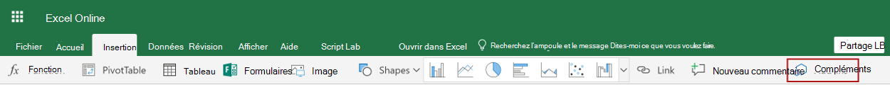

# <a name="get-started-developing-excel-custom-functions"></a><span data-ttu-id="ade2a-103">Prise en main du développement des fonctions personnalisées Excel</span><span class="sxs-lookup"><span data-stu-id="ade2a-103">Get started developing Excel custom functions</span></span>

<span data-ttu-id="ade2a-104">Avec les fonctions personnalisées, les développeurs peuvent désormais ajouter de nouvelles fonctions dans Excel en les définissant dans JavaScript ou Typescript dans le cadre d’un complément.</span><span class="sxs-lookup"><span data-stu-id="ade2a-104">With custom functions, developers can now add new functions to Excel by defining them in JavaScript or Typescript as part of an add-in.</span></span> <span data-ttu-id="ade2a-105">Les utilisateurs d’Excel peuvent accéder aux fonctions personnalisées comme ils le feraient pour n’importe quelle fonction native d’Excel, telle que `SUM()`.</span><span class="sxs-lookup"><span data-stu-id="ade2a-105">Excel users can access custom functions just as they would any native function in Excel, such as `SUM()`.</span></span>

## <a name="prerequisites"></a><span data-ttu-id="ade2a-106">Conditions préalables</span><span class="sxs-lookup"><span data-stu-id="ade2a-106">Prerequisites</span></span>

[!include[Yeoman generator prerequisites](../includes/quickstart-yo-prerequisites.md)]

* <span data-ttu-id="ade2a-107">Excel sur Windows (1904 ou version ultérieure, connecté à un abonnement Office 365) ou Excel sur le web.</span><span class="sxs-lookup"><span data-stu-id="ade2a-107">Excel on Windows (version 1904 or later, connected to Office 365 subscription) or Excel on the web</span></span>
* <span data-ttu-id="ade2a-108">Les fonctions personnalisées d’Excel sont prises en charge dans Office sur Mac (connecté à l’abonnement Office 365). une mise à jour de ce didacticiel est bientôt prévue.</span><span class="sxs-lookup"><span data-stu-id="ade2a-108">Excel custom functions are supported in Office on Mac (connected to Office 365 subscription) and an update to this tutorial is forthcoming.</span></span>

>[!NOTE]
><span data-ttu-id="ade2a-109">Les fonctions personnalisées d’Excel ne sont pas prises en charge dans Office 2019 (achat unique).</span><span class="sxs-lookup"><span data-stu-id="ade2a-109">Excel custom functions are not supported in Office 2019 (one-time purchase).</span></span>

## <a name="build-your-first-custom-functions-project"></a><span data-ttu-id="ade2a-110">Créer votre premier projet de fonctions personnalisées</span><span class="sxs-lookup"><span data-stu-id="ade2a-110">Build your first custom functions project</span></span>

<span data-ttu-id="ade2a-111">Pour commencer, vous utiliserez le Yeoman Générateur pour créer le projet de fonctions personnalisées.</span><span class="sxs-lookup"><span data-stu-id="ade2a-111">To start, you'll use the Yeoman generator to create the custom functions project.</span></span> <span data-ttu-id="ade2a-112">Cette option définit votre projet, avec la structure de dossiers correct, les fichiers source et les dépendances pour commencer le codage de vos fonctions personnalisées.</span><span class="sxs-lookup"><span data-stu-id="ade2a-112">This will set up your project with the correct folder structure, source files, and dependencies to begin coding your custom functions.</span></span>

1. [!include[Yeoman generator create project guidance](../includes/yo-office-command-guidance.md)]

    - <span data-ttu-id="ade2a-113">**Sélectionnez un type de projet :** `Excel Custom Functions Add-in project`</span><span class="sxs-lookup"><span data-stu-id="ade2a-113">**Choose a project type:** `Excel Custom Functions Add-in project`</span></span>
    - <span data-ttu-id="ade2a-114">**Sélectionnez un type de script :** `JavaScript`</span><span class="sxs-lookup"><span data-stu-id="ade2a-114">**Choose a script type:** `JavaScript`</span></span>
    - <span data-ttu-id="ade2a-115">**Comment souhaitez-vous nommer votre complément ?**</span><span class="sxs-lookup"><span data-stu-id="ade2a-115">**What do you want to name your add-in?**</span></span> `starcount`

    

    <span data-ttu-id="ade2a-117">Le générateur crée le projet et installe les composants Node.js de la prise en charge.</span><span class="sxs-lookup"><span data-stu-id="ade2a-117">The Yeoman generator will create the project files and install supporting Node components.</span></span>

2. <span data-ttu-id="ade2a-118">Le générateur Yeoman vous fournit des instructions dans votre ligne de commande sur la procédure à suivre pour le projet, mais ignorez-les et continuez de suivre nos instructions.</span><span class="sxs-lookup"><span data-stu-id="ade2a-118">The Yeoman generator will give you some instructions in your command line about what to do with the project, but ignore them and continue to follow our instructions.</span></span> <span data-ttu-id="ade2a-119">Accédez au dossier racine du projet.</span><span class="sxs-lookup"><span data-stu-id="ade2a-119">Navigate to the root folder of the project.</span></span>

    ```command&nbsp;line
    cd starcount
    ```

3. <span data-ttu-id="ade2a-120">Créez le projet.</span><span class="sxs-lookup"><span data-stu-id="ade2a-120">Build the project.</span></span> 

    ```command&nbsp;line
    npm run build
    ```

    > [!NOTE]
    > <span data-ttu-id="ade2a-121">Les compléments Office doivent utiliser le protocole HTTPS, et non HTTP, même lorsque vous développez.</span><span class="sxs-lookup"><span data-stu-id="ade2a-121">Office Add-ins should use HTTPS, not HTTP, even when you are developing.</span></span> <span data-ttu-id="ade2a-122">Si vous êtes invité à installer un certificat après avoir exécuté `npm run build`, acceptez d’installer le certificat fourni par le générateur Yeoman.</span><span class="sxs-lookup"><span data-stu-id="ade2a-122">If you are prompted to install a certificate after you run `npm run build`, accept the prompt to install the certificate that the Yeoman generator provides.</span></span>

4. <span data-ttu-id="ade2a-123">Démarrez le serveur web local qui est exécuté dans Node.js.</span><span class="sxs-lookup"><span data-stu-id="ade2a-123">Start the local web server, which runs in Node.js.</span></span> <span data-ttu-id="ade2a-124">Vous pouvez tester le complément de fonction personnalisée dans Excel sur le web ou Windows.</span><span class="sxs-lookup"><span data-stu-id="ade2a-124">You can try out the custom function add-in in Excel on the web or Windows.</span></span> <span data-ttu-id="ade2a-125">Vous serez peut-être invité à ouvrir le volet Office du complément, même si ce n’est pas obligatoire.</span><span class="sxs-lookup"><span data-stu-id="ade2a-125">You may be prompted to open the add-in's task pane, although this is optional.</span></span> <span data-ttu-id="ade2a-126">Vous pouvez continuer à exécuter vos fonctions personnalisées sans ouvrir le volet Office de votre complément.</span><span class="sxs-lookup"><span data-stu-id="ade2a-126">You can still run your custom functions without opening your add-in's task pane.</span></span>

# <a name="excel-on-windowstabexcel-windows"></a>[<span data-ttu-id="ade2a-127">Excel sur Windows</span><span class="sxs-lookup"><span data-stu-id="ade2a-127">Excel on Windows</span></span>](#tab/excel-windows)

<span data-ttu-id="ade2a-128">Pour tester votre complément dans Excel sur Windows, exécutez la commande suivante.</span><span class="sxs-lookup"><span data-stu-id="ade2a-128">To test your add-in in Excel on Windows, run the following command.</span></span> <span data-ttu-id="ade2a-129">Lorsque vous exécutez cette commande, le serveur web local et Excel s’ouvrent avec votre complément chargé.</span><span class="sxs-lookup"><span data-stu-id="ade2a-129">When you run this command, the local web server will start and Excel will open with your add-in loaded.</span></span>

```command&nbsp;line
npm run start:desktop
```

# <a name="excel-on-the-webtabexcel-online"></a>[<span data-ttu-id="ade2a-130">Excel sur le web</span><span class="sxs-lookup"><span data-stu-id="ade2a-130">Excel on the web</span></span>](#tab/excel-online)

<span data-ttu-id="ade2a-131">Pour tester votre complément dans Excel sur le web, exécutez la commande suivante.</span><span class="sxs-lookup"><span data-stu-id="ade2a-131">To test your add-in in Excel on the web, run the following command.</span></span> <span data-ttu-id="ade2a-132">Lorsque vous exécutez cette commande, le serveur web local démarre.</span><span class="sxs-lookup"><span data-stu-id="ade2a-132">When you run this command, the local web server will start.</span></span>

```command&nbsp;line
npm run start:web
```

<span data-ttu-id="ade2a-133">Pour utiliser votre complément de fonctions personnalisées, ouvrez un nouveau classeur dans Excel sur un navigateur.</span><span class="sxs-lookup"><span data-stu-id="ade2a-133">To use your custom functions add-in, open a new workbook in Excel on a browser.</span></span> <span data-ttu-id="ade2a-134">Dans ce classeur, procédez comme suit pour charger une version test de votre complément.</span><span class="sxs-lookup"><span data-stu-id="ade2a-134">In this workbook, complete the following steps to sideload your add-in.</span></span>

1. <span data-ttu-id="ade2a-135">Dans Excel, sélectionnez l’onglet **Insérer**, puis **Compléments**.</span><span class="sxs-lookup"><span data-stu-id="ade2a-135">In Excel, choose the **Insert** tab and then choose **Add-ins**.</span></span>

   
   
2. <span data-ttu-id="ade2a-137">Sélectionnez**Gérer mes Compléments** et sélectionnez **Télécharger mon complément**.</span><span class="sxs-lookup"><span data-stu-id="ade2a-137">Choose **Manage My Add-ins** and select **Upload My Add-in**.</span></span>

3. <span data-ttu-id="ade2a-138">Sélectionnez \*\*Parcourir... \*\* et accédez au répertoire racine du projet créé par le Générateur de Yo Office.</span><span class="sxs-lookup"><span data-stu-id="ade2a-138">Choose **Browse...** and navigate to the root directory of the project that the Yeoman generator created.</span></span>

4. <span data-ttu-id="ade2a-139">Sélectionnez le fichier**manifest.xml** puis sélectionnez**Ouvrir**, puis sélectionnez **Télécharger**.</span><span class="sxs-lookup"><span data-stu-id="ade2a-139">Select the file **manifest.xml** and choose **Open**, then choose **Upload**.</span></span>

---

## <a name="try-out-a-prebuilt-custom-function"></a><span data-ttu-id="ade2a-140">Essayer une fonction personnalisée prédéfinie</span><span class="sxs-lookup"><span data-stu-id="ade2a-140">Try out a prebuilt custom function</span></span>

<span data-ttu-id="ade2a-141">Le projet de fonctions personnalisées que vous avez crées en utilisant le générateur Yeoman contient certaines fonctions personnalisées prédéfinies, définies dans le fichier **./src/functions/functions.js**.</span><span class="sxs-lookup"><span data-stu-id="ade2a-141">The custom functions project that you created by using the Yeoman generator contains some prebuilt custom functions, defined within the **./src/functions/functions.js** file.</span></span> <span data-ttu-id="ade2a-142">Le fichier **./manifest.xml**dans le répertoire racine du projet indique que toutes les fonctions personnalisées appartiennent à l’ `CONTOSO` espace de noms.</span><span class="sxs-lookup"><span data-stu-id="ade2a-142">The **./manifest.xml** file in the root directory of the project specifies that all custom functions belong to the `CONTOSO` namespace.</span></span>

<span data-ttu-id="ade2a-143">Dans votre classeur Excel, essayez de reproduire la`ADD` fonction personnalisée en complétant les étapes suivantes :</span><span class="sxs-lookup"><span data-stu-id="ade2a-143">In your Excel workbook, try out the `ADD` custom function by completing the following steps:</span></span>

1. <span data-ttu-id="ade2a-144">Sélectionner une cellule, puis taper `=CONTOSO`</span><span class="sxs-lookup"><span data-stu-id="ade2a-144">Select a cell and type `=CONTOSO`.</span></span> <span data-ttu-id="ade2a-145">Notez que le menu de saisie semi-automatique affiche la liste de toutes les fonctions dans l’espace de noms `CONTOSO`.</span><span class="sxs-lookup"><span data-stu-id="ade2a-145">Notice that the autocomplete menu shows the list of all functions in the `CONTOSO` namespace.</span></span>

2. <span data-ttu-id="ade2a-146">Exécutez la`CONTOSO.ADD` fonction, en utilisant les nombres `10` et `200` comme paramètres d’entrée, en spécifiant la valeur`=CONTOSO.ADD(10,200)`suivante dans la cellule et appuyez sur entrée.</span><span class="sxs-lookup"><span data-stu-id="ade2a-146">Run the `CONTOSO.ADD` function, using numbers `10` and `200` as input parameters, by typing the value `=CONTOSO.ADD(10,200)` in the cell and pressing enter.</span></span>

<span data-ttu-id="ade2a-147">Le `ADD` fonction personnalisée calcule la somme des deux nombres que vous avez spécifiés comme paramètres d’entrée.</span><span class="sxs-lookup"><span data-stu-id="ade2a-147">The `ADD` custom function computes the sum of the two numbers that you specify as input parameters.</span></span> <span data-ttu-id="ade2a-148">La saisie de`=CONTOSO.ADD(10,200)` doit générer le résultat **210** dans la cellule une fois que vous appuyez sur ENTRÉE.</span><span class="sxs-lookup"><span data-stu-id="ade2a-148">Typing `=CONTOSO.ADD(10,200)` should produce the result **210** in the cell after you press enter.</span></span>

## <a name="next-steps"></a><span data-ttu-id="ade2a-149">Étapes suivantes</span><span class="sxs-lookup"><span data-stu-id="ade2a-149">Next steps</span></span>

<span data-ttu-id="ade2a-150">Félicitations, vous avez créé une fonction personnalisée dans un complément Excel !</span><span class="sxs-lookup"><span data-stu-id="ade2a-150">Congratulations, you've successfully created a custom function in an Excel add-in!</span></span> <span data-ttu-id="ade2a-151">Ensuite, créez un complément plus complexe avec la fonctionnalité de diffusion de données en continu.</span><span class="sxs-lookup"><span data-stu-id="ade2a-151">Next, build a more complex add-in with streaming data capability.</span></span> <span data-ttu-id="ade2a-152">Le lien suivant vous guide tout au long des étapes suivantes dans le complément Excel avec le didacticiel de fonctions personnalisées.</span><span class="sxs-lookup"><span data-stu-id="ade2a-152">The following link takes you through the next steps in the Excel add-in with custom functions tutorial.</span></span>

> [!div class="nextstepaction"]
> [<span data-ttu-id="ade2a-153">Didacticiel de fonctions personnalisées Excel</span><span class="sxs-lookup"><span data-stu-id="ade2a-153">Excel custom functions add-in tutorial</span></span>](../tutorials/excel-tutorial-create-custom-functions.md#create-a-custom-function-that-requests-data-from-the-web
)

## <a name="see-also"></a><span data-ttu-id="ade2a-154">Voir aussi</span><span class="sxs-lookup"><span data-stu-id="ade2a-154">See also</span></span>

* [<span data-ttu-id="ade2a-155">Vue d’ensemble des fonctions personnalisées</span><span class="sxs-lookup"><span data-stu-id="ade2a-155">Custom functions overview</span></span>](../excel/custom-functions-overview.md)
* [<span data-ttu-id="ade2a-156">Métadonnées fonctions personnalisées</span><span class="sxs-lookup"><span data-stu-id="ade2a-156">Custom functions metadata</span></span>](../excel/custom-functions-json.md)
* [<span data-ttu-id="ade2a-157">Exécution de fonctions personnalisées Excel</span><span class="sxs-lookup"><span data-stu-id="ade2a-157">Runtime for Excel custom functions</span></span>](../excel/custom-functions-runtime.md)