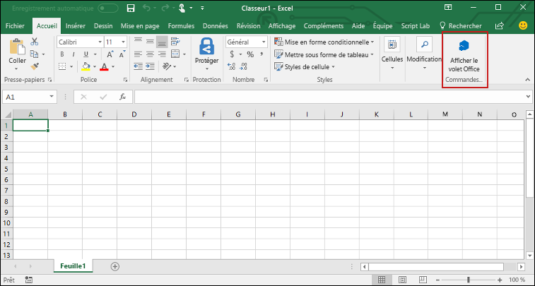

# <a name="build-an-excel-task-pane-add-in"></a><span data-ttu-id="a95f3-103">Créer un complément de volet de tâches Excel</span><span class="sxs-lookup"><span data-stu-id="a95f3-103">Build an Excel task pane add-in using Vue</span></span>

<span data-ttu-id="a95f3-104">Dans cet article, vous découvrirez comment créer un complément de volet de tâches Excel.</span><span class="sxs-lookup"><span data-stu-id="a95f3-104">In this article, you'll walk through the process of building an Outlook task pane add-in.</span></span> 

## <a name="create-the-add-in"></a><span data-ttu-id="a95f3-105">Créer le complément</span><span class="sxs-lookup"><span data-stu-id="a95f3-105">Create the add-in</span></span>

[!include[Choose your editor](../includes/quickstart-choose-editor.md)]

# <a name="yeoman-generatortabyeomangenerator"></a>[<span data-ttu-id="a95f3-106">Générateur Yeoman</span><span class="sxs-lookup"><span data-stu-id="a95f3-106">Yeoman generator</span></span>](#tab/yeomangenerator)

### <a name="prerequisites"></a><span data-ttu-id="a95f3-107">Conditions préalables</span><span class="sxs-lookup"><span data-stu-id="a95f3-107">Prerequisites</span></span>

[!include[Yeoman generator prerequisites](../includes/quickstart-yo-prerequisites.md)]

### <a name="create-the-add-in-project"></a><span data-ttu-id="a95f3-108">Création du projet de complément</span><span class="sxs-lookup"><span data-stu-id="a95f3-108">Create the add-in project</span></span>

[!include[note about Yeoman generator bug](../includes/note-yeoman-generator-bug-201908.md)]

<span data-ttu-id="a95f3-109">Utilisez le générateur Yeoman pour créer un projet de complément Excel.</span><span class="sxs-lookup"><span data-stu-id="a95f3-109">Use the Yeoman generator to create an Excel add-in project.</span></span> <span data-ttu-id="a95f3-110">Exécutez la commande suivante, puis répondez aux invites comme suit :</span><span class="sxs-lookup"><span data-stu-id="a95f3-110">Run the following command and then answer the prompts as follows:</span></span>

```command&nbsp;line
yo office
```

- <span data-ttu-id="a95f3-111">**Sélectionnez un type de projet :** `Office Add-in Task Pane project`</span><span class="sxs-lookup"><span data-stu-id="a95f3-111">**Choose a project type:** `Office Add-in Task Pane project`</span></span>
- <span data-ttu-id="a95f3-112">**Sélectionnez un type de script :** `Javascript`</span><span class="sxs-lookup"><span data-stu-id="a95f3-112">**Choose a script type:** `Javascript`</span></span>
- <span data-ttu-id="a95f3-113">**Comment souhaitez-vous nommer votre complément ?**</span><span class="sxs-lookup"><span data-stu-id="a95f3-113">**What do you want to name your add-in?**</span></span> `my-office-add-in`
- <span data-ttu-id="a95f3-114">**Quelle application client Office voulez-vous prendre en charge ?**</span><span class="sxs-lookup"><span data-stu-id="a95f3-114">**Which Office client application would you like to support?**</span></span> `Excel`

<span data-ttu-id="a95f3-115">Après avoir exécuté l’assistant, le générateur crée le projet et installe les composants Node de prise en charge.</span><span class="sxs-lookup"><span data-stu-id="a95f3-115">After you complete the wizard, the generator will create the project and install supporting Node components.</span></span>

### <a name="explore-the-project"></a><span data-ttu-id="a95f3-116">Explorer le projet</span><span class="sxs-lookup"><span data-stu-id="a95f3-116">Explore the project</span></span>

[!include[Yeoman generator add-in project components](../includes/yo-task-pane-project-components-js.md)]

### <a name="try-it-out"></a><span data-ttu-id="a95f3-117">Essayez</span><span class="sxs-lookup"><span data-stu-id="a95f3-117">Try it out</span></span>

1. <span data-ttu-id="a95f3-118">Accédez au dossier racine du projet.</span><span class="sxs-lookup"><span data-stu-id="a95f3-118">Navigate to the root folder of the project.</span></span>

    ```command&nbsp;line
    cd "my-office-add-in"
    ```

2. [!include[Start server section](../includes/quickstart-yo-start-server-excel.md)] 

3. <span data-ttu-id="a95f3-119">Dans Excel, sélectionnez l’onglet **Accueil**, puis choisissez le bouton **Afficher le volet Office** du ruban pour ouvrir le volet Office du complément.</span><span class="sxs-lookup"><span data-stu-id="a95f3-119">In Excel, choose the **Home** tab, and then choose the **Show Taskpane** button in the ribbon to open the add-in task pane.</span></span>

    

4. <span data-ttu-id="a95f3-121">Sélectionnez une plage de cellules dans la feuille de calcul.</span><span class="sxs-lookup"><span data-stu-id="a95f3-121">Select any range of cells in the worksheet.</span></span>

5. <span data-ttu-id="a95f3-122">En bas du volet Office, cliquez sélectionnez le lien **Exécuter** pour définir la couleur de la plage sélectionnée sur jaune.</span><span class="sxs-lookup"><span data-stu-id="a95f3-122">At the bottom of the task pane, choose the **Run** link to set the color of the selected range to yellow.</span></span>

    

# <a name="visual-studiotabvisualstudio"></a>[<span data-ttu-id="a95f3-124">Visual Studio</span><span class="sxs-lookup"><span data-stu-id="a95f3-124">Visual Studio</span></span>](#tab/visualstudio)

### <a name="prerequisites"></a><span data-ttu-id="a95f3-125">Conditions préalables</span><span class="sxs-lookup"><span data-stu-id="a95f3-125">Prerequisites</span></span>

[!include[Quick Start prerequisites](../includes/quickstart-vs-prerequisites.md)]

### <a name="create-the-add-in-project"></a><span data-ttu-id="a95f3-126">Création du projet de complément</span><span class="sxs-lookup"><span data-stu-id="a95f3-126">Create the add-in project</span></span>

1. <span data-ttu-id="a95f3-127">Dans la barre de menu de Visual Studio, choisissez successivement **Fichier** > **Nouveau** > **Projet**.</span><span class="sxs-lookup"><span data-stu-id="a95f3-127">On the Visual Studio menu bar, choose  **File** > **New** > **Project**.</span></span>

2. <span data-ttu-id="a95f3-128">Dans la liste des types de projet, sous **Visual C#** ou **Visual Basic**, développez **Office/SharePoint**, choisissez **Compléments**, puis **Complément Excel Web** pour le type de projet.</span><span class="sxs-lookup"><span data-stu-id="a95f3-128">In the list of project types under **Visual C#** or **Visual Basic**, expand  **Office/SharePoint**, choose **Add-ins**, and then choose **Excel Web Add-in** as the project type.</span></span> 

3. <span data-ttu-id="a95f3-129">Nommez le projet, puis cliquez sur **OK**.</span><span class="sxs-lookup"><span data-stu-id="a95f3-129">Name the project, and then choose **OK**.</span></span>

4. <span data-ttu-id="a95f3-130">Dans la fenêtre de dialogue **Créer un complément Office**, sélectionnez **Ajouter de nouvelles fonctionnalités à Excel**, puis sélectionnez **Terminer** pour créer le projet.</span><span class="sxs-lookup"><span data-stu-id="a95f3-130">In the **Create Office Add-in** dialog window, choose **Add new functionalities to Excel**, and then choose **Finish** to create the project.</span></span>

5. <span data-ttu-id="a95f3-p102">Visual Studio crée une solution et ses deux projets apparaissent dans l’**explorateur de solutions**. Le fichier **Home.html** s’ouvre dans Visual Studio.</span><span class="sxs-lookup"><span data-stu-id="a95f3-p102">Visual Studio creates a solution and its two projects appear in **Solution Explorer**. The **Home.html** file opens in Visual Studio.</span></span>

### <a name="explore-the-visual-studio-solution"></a><span data-ttu-id="a95f3-133">Explorer la solution Visual Studio</span><span class="sxs-lookup"><span data-stu-id="a95f3-133">Explore the Visual Studio solution</span></span>

[!include[Description of Visual Studio projects](../includes/quickstart-vs-solution.md)]

### <a name="update-the-code"></a><span data-ttu-id="a95f3-134">Mise à jour du code</span><span class="sxs-lookup"><span data-stu-id="a95f3-134">Update the code</span></span>

1. <span data-ttu-id="a95f3-p103">**Home.html** spécifie le code HTML qui s’affichera dans le volet Office du complément. Dans **Home.html**, remplacez l’élément `<body>` par le balisage suivant et enregistrez le fichier.</span><span class="sxs-lookup"><span data-stu-id="a95f3-p103">**Home.html** specifies the HTML that will be rendered in the add-in's task pane. In **Home.html**, replace the `<body>` element with the following markup and save the file.</span></span>

    ```html
    <body class="ms-font-m ms-welcome">
        <div id="content-header">
            <div class="padding">
                <h1>Welcome</h1>
            </div>
        </div>
        <div id="content-main">
            <div class="padding">
                <p>Choose the button below to set the color of the selected range to green.</p>
                <br />
                <h3>Try it out</h3>
                <button class="ms-Button" id="set-color">Set color</button>
            </div>
        </div>
    </body>
    ```

2. <span data-ttu-id="a95f3-p104">Ouvrez le fichier **Home.js** à la racine du projet d’application web. Ce fichier spécifie le script pour le complément. Remplacez tout le contenu par le code suivant, puis enregistrez le fichier.</span><span class="sxs-lookup"><span data-stu-id="a95f3-p104">Open the file **Home.js** in the root of the web application project. This file specifies the script for the add-in. Replace the entire contents with the following code and save the file.</span></span> 

    ```js
    'use strict';

    (function () {

        Office.onReady(function() {
            // Office is ready
            $(document).ready(function () {
                // The document is ready
                $('#set-color').click(setColor);
            });
        });

        function setColor() {
            Excel.run(function (context) {
                var range = context.workbook.getSelectedRange();
                range.format.fill.color = 'green';

                return context.sync();
            }).catch(function (error) {
                console.log("Error: " + error);
                if (error instanceof OfficeExtension.Error) {
                    console.log("Debug info: " + JSON.stringify(error.debugInfo));
                }
            });
        }
    })();
    ```

3. <span data-ttu-id="a95f3-p105">Ouvrez le fichier **Home.css** à la racine du projet d’application web. Ce fichier spécifie les styles personnalisés pour le complément. Remplacez tout le contenu par le code suivant, puis enregistrez le fichier.</span><span class="sxs-lookup"><span data-stu-id="a95f3-p105">Open the file **Home.css** in the root of the web application project. This file specifies the custom styles for the add-in. Replace the entire contents with the following code and save the file.</span></span> 

    ```css
    #content-header {
        background: #2a8dd4;
        color: #fff;
        position: absolute;
        top: 0;
        left: 0;
        width: 100%;
        height: 80px; 
        overflow: hidden;
    }

    #content-main {
        background: #fff;
        position: fixed;
        top: 80px;
        left: 0;
        right: 0;
        bottom: 0;
        overflow: auto; 
    }

    .padding {
        padding: 15px;
    }
    ```

### <a name="update-the-manifest"></a><span data-ttu-id="a95f3-143">Mise à jour du manifeste</span><span class="sxs-lookup"><span data-stu-id="a95f3-143">Update the manifest</span></span>

1. <span data-ttu-id="a95f3-144">Ouvrez le fichier manifeste XML dans le projet de complément.</span><span class="sxs-lookup"><span data-stu-id="a95f3-144">Open the XML manifest file in the add-in project.</span></span> <span data-ttu-id="a95f3-145">Ce fichier définit les paramètres et les fonctionnalités du complément.</span><span class="sxs-lookup"><span data-stu-id="a95f3-145">This file defines the add-in's settings and capabilities.</span></span>

2. <span data-ttu-id="a95f3-p107">L’élément `ProviderName` possède une valeur d’espace réservé. Remplacez-le par votre nom.</span><span class="sxs-lookup"><span data-stu-id="a95f3-p107">The `ProviderName` element has a placeholder value. Replace it with your name.</span></span>

3. <span data-ttu-id="a95f3-p108">L’attribut `DefaultValue` de l’élément `DisplayName` possède un espace réservé. Remplacez-le par **My Office Add-in**.</span><span class="sxs-lookup"><span data-stu-id="a95f3-p108">The `DefaultValue` attribute of the `DisplayName` element has a placeholder. Replace it with **My Office Add-in**.</span></span>

4. <span data-ttu-id="a95f3-p109">L’attribut `DefaultValue` de l’élément `Description` possède un espace réservé. Remplacez-le par **A task pane add-in for Excel**.</span><span class="sxs-lookup"><span data-stu-id="a95f3-p109">The `DefaultValue` attribute of the `Description` element has a placeholder. Replace it with **A task pane add-in for Excel**.</span></span>

5. <span data-ttu-id="a95f3-152">Enregistrez le fichier.</span><span class="sxs-lookup"><span data-stu-id="a95f3-152">Save the file.</span></span>

    ```xml
    ...
    <ProviderName>John Doe</ProviderName>
    <DefaultLocale>en-US</DefaultLocale>
    <!-- The display name of your add-in. Used on the store and various places of the Office UI such as the add-ins dialog. -->
    <DisplayName DefaultValue="My Office Add-in" />
    <Description DefaultValue="A task pane add-in for Excel"/>
    ...
    ```

### <a name="try-it-out"></a><span data-ttu-id="a95f3-153">Essayez</span><span class="sxs-lookup"><span data-stu-id="a95f3-153">Try it out</span></span>

1. <span data-ttu-id="a95f3-p110">À l’aide de Visual Studio, testez le nouveau complément Excel en appuyant sur\*\* F5\*\* ou en choisissant le bouton **Démarrer** pour lancer Excel avec le bouton du complément \*\*Show Taskpane \*\*(Afficher le volet Office) qui apparaît dans le ruban. Le complément sera hébergé localement sur IIS.</span><span class="sxs-lookup"><span data-stu-id="a95f3-p110">Using Visual Studio, test the newly created Excel add-in by pressing **F5** or choosing the **Start** button to launch Excel with the **Show Taskpane** add-in button displayed in the ribbon. The add-in will be hosted locally on IIS.</span></span>

2. <span data-ttu-id="a95f3-156">Dans Excel, sélectionnez l’onglet **Accueil**, puis choisissez le bouton **Afficher le volet Office** du ruban pour ouvrir le volet Office du complément.</span><span class="sxs-lookup"><span data-stu-id="a95f3-156">In Excel, choose the **Home** tab, and then choose the **Show Taskpane** button in the ribbon to open the add-in task pane.</span></span>

    

3. <span data-ttu-id="a95f3-158">Sélectionnez une plage de cellules dans la feuille de calcul.</span><span class="sxs-lookup"><span data-stu-id="a95f3-158">Select any range of cells in the worksheet.</span></span>

4. <span data-ttu-id="a95f3-159">Dans le volet Office, cliquez sur le bouton **Définir couleur** pour définir la couleur de la plage sélectionnée en vert.</span><span class="sxs-lookup"><span data-stu-id="a95f3-159">In the task pane, choose the **Set color** button to set the color of the selected range to green.</span></span>

    

---

## <a name="next-steps"></a><span data-ttu-id="a95f3-161">Étapes suivantes</span><span class="sxs-lookup"><span data-stu-id="a95f3-161">Next steps</span></span>

<span data-ttu-id="a95f3-162">Félicitations, vous avez créé un complément de volet de tâches Excel !</span><span class="sxs-lookup"><span data-stu-id="a95f3-162">Congratulations, you've successfully created an Excel task pane add-in using Vue!</span></span> <span data-ttu-id="a95f3-163">Ensuite, découvrez les fonctionnalités d’un complément Excel et créez-en un plus complexe en suivant le didacticiel sur les compléments Excel.</span><span class="sxs-lookup"><span data-stu-id="a95f3-163">Next, learn more about the capabilities of an Excel add-in and build a more complex add-in by following along with the Excel add-in tutorial.</span></span>

> [!div class="nextstepaction"]
> [<span data-ttu-id="a95f3-164">Didacticiel sur les compléments Excel</span><span class="sxs-lookup"><span data-stu-id="a95f3-164">Excel add-in tutorial</span></span>](../tutorials/excel-tutorial.md)

## <a name="see-also"></a><span data-ttu-id="a95f3-165">Voir aussi</span><span class="sxs-lookup"><span data-stu-id="a95f3-165">See also</span></span>

* [<span data-ttu-id="a95f3-166">Didacticiel sur les compléments Excel</span><span class="sxs-lookup"><span data-stu-id="a95f3-166">Excel add-in tutorial</span></span>](../tutorials/excel-tutorial-create-table.md)
* [<span data-ttu-id="a95f3-167">Concepts fondamentaux de programmation avec l’API JavaScript pour Excel</span><span class="sxs-lookup"><span data-stu-id="a95f3-167">Fundamental programming concepts with the Excel JavaScript API</span></span>](../excel/excel-add-ins-core-concepts.md)
* [<span data-ttu-id="a95f3-168">Exemples de code pour les compléments Excel</span><span class="sxs-lookup"><span data-stu-id="a95f3-168">Excel add-in code samples</span></span>](https://developer.microsoft.com/office/gallery/?filterBy=Samples,Excel)
* [<span data-ttu-id="a95f3-169">Référence de l’API JavaScript pour Excel</span><span class="sxs-lookup"><span data-stu-id="a95f3-169">Excel JavaScript API reference</span></span>](/office/dev/add-ins/reference/overview/excel-add-ins-reference-overview)
