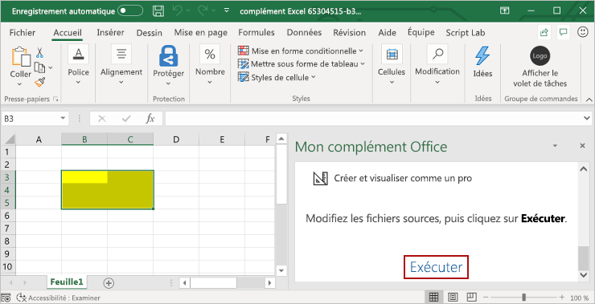

# <a name="build-an-excel-task-pane-add-in-using-react"></a>Créer un complément de volet de tâches Excel à l’aide de React

Cet article décrit le processus de création d’un complément de volet de tâches Excel à l’aide de React et de l’API JavaScript pour Excel.

## <a name="prerequisites"></a>Conditions préalables

[!include[Yeoman generator prerequisites](../includes/quickstart-yo-prerequisites.md)]

## <a name="create-the-add-in-project"></a>Création du projet de complément

[!include[Yeoman generator create project guidance](../includes/yo-office-command-guidance.md)]

- **Sélectionnez un type de projet :** `Office Add-in Task Pane project using React framework`
- **Sélectionnez un type de script :** `TypeScript`
- **Comment souhaitez-vous nommer votre complément ?** `My Office Add-in`
- **Quelle application client Office voulez-vous prendre en charge ?** `Excel`


Après avoir exécuté l’assistant, le générateur crée le projet et installe les composants Node de prise en charge.

[!include[Yeoman generator next steps](../includes/yo-office-next-steps.md)]

## <a name="explore-the-project"></a>Explorer le projet

Le projet de complément que vous avez créé à l’aide du générateur Yeoman contient un exemple de code pour un complément de volet de tâches très simple. Pour explorer les composants clés de votre projet de complément, ouvrez le projet dans votre éditeur de code et passez en revue les fichiers répertoriés ci-dessous. Lorsque vous êtes prêt à tester votre complément, passez à la section suivante.

- Le fichier **manifest.xml** du répertoire racine du projet définit les paramètres et fonctionnalités du complément.
- Le fichier **./src/taskpane/taskpane.html** définit l’infrastructure HTML du volet de tâches et les fichiers du dossier **./src/taskpane/components** définissent les différentes parties de l’interface utilisateur du volet de tâches.
- Le fichier **./src/taskpane/taskpane.css** contient le style CSS appliqué au contenu du volet de tâches.
- Le fichier **./src/taskpane/component/App.tsx** contient le code d’API JavaScript pour Office qui facilite l’interaction entre le volet de tâches et Excel.

## <a name="try-it-out"></a>Essayez

1. Accédez au dossier racine du projet.

    ```command&nbsp;line
    cd "My Office Add-in"
    ```

2. [!include[Start server section](../includes/quickstart-yo-start-server-excel.md)] 

3. Dans Excel, sélectionnez l’onglet **Accueil**, puis choisissez le bouton **Afficher le volet Office** du ruban pour ouvrir le volet Office du complément.

    

4. Sélectionnez une plage de cellules dans la feuille de calcul.

5. En bas du volet Office, cliquez sélectionnez le lien **Exécuter** pour définir la couleur de la plage sélectionnée sur jaune.

    

## <a name="next-steps"></a>Étapes suivantes

Félicitations, vous avez créé un complément de volet de tâches Excel à l’aide de React ! Ensuite, découvrez les fonctionnalités d’un complément Excel et créez-en un plus complexe en suivant le didacticiel sur les compléments Excel.

> [!div class="nextstepaction"]
> [Didacticiel sur les compléments Excel](../tutorials/excel-tutorial.md)

## <a name="see-also"></a>Voir aussi

* [Didacticiel sur les compléments Excel](../tutorials/excel-tutorial-create-table.md)
* [Concepts fondamentaux de programmation avec l’API JavaScript pour Excel](../excel/excel-add-ins-core-concepts.md)
* [Exemples de code pour les compléments Excel](https://developer.microsoft.com/office/gallery/?filterBy=Samples,Excel)
* [Référence de l’API JavaScript pour Excel](/office/dev/add-ins/reference/overview/excel-add-ins-reference-overview)
