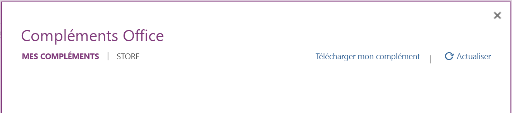
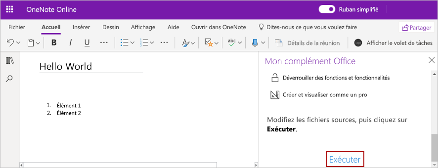

# <a name="build-your-first-onenote-task-pane-add-in"></a>Créer votre premier complément du volet Office de OneNote

Cet article décrit comment créer un complément du volet Office de OneNote.

## <a name="prerequisites"></a>Conditions préalables

[!include[Set up requirements](../includes/set-up-dev-environment-beforehand.md)]
[!include[Yeoman generator prerequisites](../includes/quickstart-yo-prerequisites.md)]

## <a name="create-the-add-in-project"></a>Création du projet de complément

[!include[Yeoman generator create project guidance](../includes/yo-office-command-guidance.md)]

- **Sélectionnez un type de projet :** `Office Add-in Task Pane project`
- **Sélectionnez un type de script :** `Javascript`
- **Comment souhaitez-vous nommer votre complément ?** `My Office Add-in`
- **Quelle application client Office voulez-vous prendre en charge ?** `OneNote`


Après avoir exécuté l’Assistant, le générateur crée le projet et installe les composants Node de prise en charge.

[!include[Yeoman generator next steps](../includes/yo-office-next-steps.md)]

## <a name="explore-the-project"></a>Explorer le projet

Le projet de complément que vous avez créé à l’aide du générateur Yeoman contient un exemple de code pour un complément de volet de tâches très simple.

- Le fichier **./manifest.xml** du répertoire racine du projet définit les paramètres et fonctionnalités du complément.
- Le fichier **./src/taskpane/taskpane.html** contient les balises HTML du volet Office.
- Le fichier **./src/taskpane/taskpane.css** contient le style CSS appliqué au contenu du volet Office.
- Le fichier **./src/taskpane/taskpane.js** contient le code d’API JavaScript pour Office qui facilite l’interaction entre le volet des tâches et l’application cliente Office.

## <a name="update-the-code"></a>Mettre à jour le code

Ouvrez le fichier **./src/taskpane/taskpane.js** dans l’éditeur de code et ajoutez le code suivant à la fonction `run`. Ce code utilise l’API JavaScript OneNote pour définir le titre de la page et ajouter un plan au corps de celle-ci.

```js
try {
    await OneNote.run(async context => {

        // Get the current page.
        var page = context.application.getActivePage();

        // Queue a command to set the page title.
        page.title = "Hello World";

        // Queue a command to add an outline to the page.
        var html = "<p><ol><li>Item #1</li><li>Item #2</li></ol></p>";
        page.addOutline(40, 90, html);

        // Run the queued commands, and return a promise to indicate task completion.
        return context.sync();
    });
} catch (error) {
    console.log("Error: " + error);
}
```

## <a name="try-it-out"></a>Essayez

1. Accédez au dossier racine du projet.

    ```command&nbsp;line
    cd "My Office Add-in"
    ```

2. Démarrez le serveur web local et chargez indépendamment votre complément.

    > [!NOTE]
    > Les compléments Office doivent utiliser le protocole HTTPS, et non HTTP, même lorsque vous développez. Si vous êtes invité à installer un certificat après avoir exécuté une des commandes suivantes, acceptez d’installer le certificat fourni par le générateur Yeoman. Il se peut également que vous deviez exécuter votre invite de commande ou votre terminal en tant qu'administrateur pour que les modifications soient effectuées.

    > [!TIP]
    > Si vous testez votre complément sur Mac, exécutez la commande suivante avant de continuer. Lorsque vous exécutez cette commande, le serveur web local démarre.
    >
    > ```command&nbsp;line
    > npm run dev-server
    > ```

    Exécutez la commande suivante dans le répertoire racine de votre projet. Lorsque vous exécutez cette commande, le serveur web local démarre (s’il n’est pas déjà en cours d’exécution).

    ```command&nbsp;line
    npm run start:web
    ```

3. Dans [OneNote sur le web](https://www.onenote.com/notebooks), ouvrez un bloc-notes, puis créez une page.

4. Choisissez **Insertion > Compléments Office** pour ouvrir la boîte de dialogue Compléments Office.

    - Si vous êtes connecté avec votre compte de consommateur, sélectionnez l’onglet **MES COMPLÉMENTS**, puis choisissez **Télécharger mon complément**.

    - Si vous êtes connecté avec votre compte professionnel ou scolaire, sélectionnez l’onglet **MON ORGANISATION**, puis choisissez **Télécharger mon complément**.

    L’image suivante montre l’onglet **MES COMPLÉMENTS** pour les blocs-notes de consommateurs.

    

5. Dans la boîte de dialogue Télécharger le complément, accédez à **manifest.xml** dans le dossier de projet, puis choisissez **Télécharger**.

6. Dans l’onglet **Accueil**, choisissez le bouton **Afficher le volet de tâches** du ruban. Le volet Office du complément s’ouvre dans un iFrame à côté de la page OneNote.

7. Au bas du volet Office, sélectionnez le lien **Exécuter** pour définir le titre de la page et ajouter un plan au corps de celle-ci.

    

## <a name="next-steps"></a>Étapes suivantes

Félicitations ! Vous avez créé un complément du volet Office de OneNote ! Ensuite, vous allez étudier en détail les concepts fondamentaux de la création de compléments Excel.

> [!div class="nextstepaction"]
> [Vue d’ensemble de la programmation de l’API JavaScript de OneNote](../onenote/onenote-add-ins-programming-overview.md)

## <a name="see-also"></a>Voir aussi

- [Vue d’ensemble de la plateforme des compléments Office](../overview/office-add-ins.md)
- [Développement de compléments Office](../develop/develop-overview.md)
- [Vue d’ensemble de la programmation de l’API JavaScript de OneNote](../onenote/onenote-add-ins-programming-overview.md)
- [Référence de l’API JavaScript de OneNote](../reference/overview/onenote-add-ins-javascript-reference.md)
- [Exemple de grille d’évaluation](https://github.com/OfficeDev/OneNote-Add-in-Rubric-Grader)
