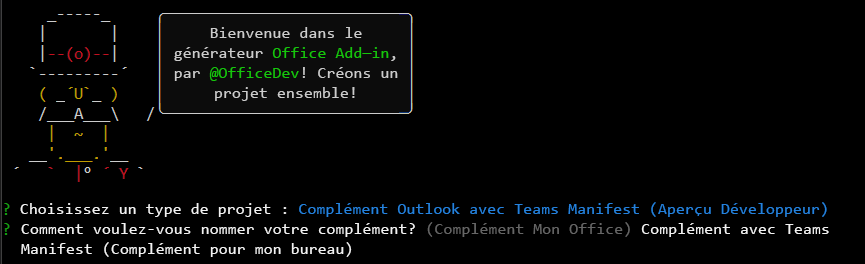

# <a name="build-an-outlook-add-in-with-a-teams-manifest-preview"></a>Créer un complément Outlook avec un manifeste Teams (préversion)

Dans cet article, vous allez parcourir le processus de création d’un complément de volet des tâches Outlook qui affiche une propriété d’un message sélectionné, déclenche une notification dans le volet de lecture et insère du texte dans un message dans le volet de composition. Ce complément utilise une préversion du manifeste au format JSON que les extensions Teams, telles que les onglets personnalisés et les extensions de messagerie, utilisent. Pour plus d’informations sur ce manifeste, consultez [le manifeste Teams pour les compléments Office (préversion).](../develop/json-manifest-overview.md)

> [!NOTE]
> Le nouveau manifeste est disponible en préversion et peut être modifié en fonction des commentaires. Nous encourageons les développeurs de compléments expérimentés à l’expérimenter. Le manifeste d’aperçu ne doit pas être utilisé dans les compléments de production. 

La préversion est uniquement prise en charge sur l’abonnement Office sur Windows. 

> [!TIP]
> Si vous souhaitez créer un complément Outlook à l’aide du manifeste XML, consultez [Générer votre premier complément Outlook](outlook-quickstart.md).

## <a name="create-the-add-in"></a>Créer le complément

Vous pouvez créer un complément Office avec un manifeste JSON à l’aide du [générateur Yeoman pour les compléments Office](../develop/yeoman-generator-overview.md). Le générateur Yeoman crée un projet Node.js qui peut être géré avec Visual Studio Code ou tout autre éditeur.

### <a name="prerequisites"></a>Conditions préalables

[!include[Set up requirements](../includes/set-up-dev-environment-beforehand.md)]

- [Runtime .NET](https://dotnet.microsoft.com/download/dotnet/6.0/runtime) pour Windows. L’un des outils utilisés dans la préversion s’exécute sur .NET.

[!INCLUDE [Yeoman generator prerequisites](../includes/quickstart-yo-prerequisites.md)]

- [Visual Studio Code (VS Code)](https://code.visualstudio.com/) ou votre éditeur de code préféré

- Outlook sur Windows (connecté à un compte Microsoft 365)

### <a name="create-the-add-in-project"></a>Création du projet de complément

1. [!include[Yeoman generator create project guidance](../includes/yo-office-command-guidance.md)]

    - **Sélectionnez un type de projet** - `Outlook Add-in with Teams Manifest (Developer preview)`

    - **Comment souhaitez-vous nommer votre complément ?** - `Add-in with Teams Manifest`

     

    > [!NOTE]
    > Pour cette préversion, le nom du complément ne peut pas comporter plus de 30 caractères. 
    
    Après avoir exécuté l’assistant, le générateur crée le projet et installe les composants Node de prise en charge.

    [!include[Yeoman generator next steps](../includes/yo-office-next-steps.md)]

1. Accédez au dossier racine du projet de l’application web.

    ```command&nbsp;line
    cd "Add-in with Teams Manifest"
    ```

### <a name="explore-the-project"></a>Explorer le projet

Le projet de complément que vous avez créé à l’aide du générateur Yeoman contient un exemple de code pour un complément de volet de tâches très simple.

- Le fichier **./manifest/manifest.json** dans le répertoire racine du projet définit les paramètres et les fonctionnalités du complément.
- Le fichier **./src/taskpane/taskpane.html** contient les balises HTML du volet Office.
- Le fichier **./src/taskpane/taskpane.css** contient le style CSS appliqué au contenu du volet Office.
- Le fichier **./src/taskpane/taskpane.ts** contient du code qui appelle la bibliothèque JavaScript Office pour faciliter l’interaction entre le volet des tâches et Outlook.
- Le fichier **./src/command/command.html** sera modifié par WebPack au moment de la génération pour insérer une balise HTML `<script>` qui charge le fichier JavaScript qui est transposé à partir du fichier command.ts.
- Au début, le fichier **./src/command/command.ts** contient peu de code. Plus loin dans cet article, vous y ajouterez du code qui appelle la bibliothèque JavaScript Office et qui s’exécute lorsqu’un bouton de ruban personnalisé est sélectionné.

### <a name="update-the-code"></a>Mettre à jour le code

1. Ouvrez votre projet dans VS Code ou votre éditeur de code préféré.

    > [!TIP]
    > Dans Windows, vous pouvez accéder au répertoire racine du projet via la ligne de commande, puis entrer `code .` pour ouvrir ce dossier dans VS Code. 

1. Ouvrez le fichier **./src/taskpane/taskpane.html** et remplacez tout **\<main\>** l'élément (dans **\<body\>** l'élément) par le balisage suivant. Ce nouveau balisage ajoute une étiquette dans laquelle le script dans **./src/taskpane/taskpane.ts** écrira les données.

    ```html
    <main id="app-body" class="ms-welcome__main" style="display: none;">
        <h2 class="ms-font-xl"> Discover what Office Add-ins can do for you today! </h2>
        <p><label id="item-subject"></label></p>
        <div role="button" id="run" class="ms-welcome__action ms-Button ms-Button--hero ms-font-xl">
            <span class="ms-Button-label">Run</span>
        </div>
    </main>
    ```

1. Dans votre éditeur de code, ouvrez le fichier **./src/taskpane/taskpane.ts** et ajoutez le code suivant dans la fonction d’**exécution** . Ce code utilise l'API Office JavaScript pour obtenir une référence au message actuel et écrire la valeur de sa propriété **objet** dans le volet des tâches.

    ```typescript
    // Get a reference to the current message.
    let item = Office.context.mailbox.item;

    // Write a message property value to the task pane.
    document.getElementById("item-subject").innerHTML = "<b>Subject:</b> <br/>" + item.subject;
    ```

### <a name="try-it-out"></a>Essayez

[!INCLUDE [alert use https](../includes/alert-use-https.md)]

1. Exécutez la commande suivante dans le répertoire racine de votre projet. Lorsque vous exécutez cette commande, le serveur web local démarre et votre complément est chargé en mode [sideload](../outlook/sideload-outlook-add-ins-for-testing.md). 

    ```command&nbsp;line
    npm start
    ```

1. Utilisez le ruban classique dans Outlook. Le reste de ces instructions suppose cela.  

1. Affichez un message dans le [volet de lecture](https://support.microsoft.com/office/2fd687ed-7fc4-4ae3-8eab-9f9b8c6d53f0) ou ouvrez le message dans sa propre fenêtre. Un nouveau groupe de contrôle nommé **Complément Contoso** s’affiche sous l’onglet **Accueil** d’Outlook (ou sous l’onglet **Message** si vous avez ouvert le message dans une nouvelle fenêtre). Le groupe a un bouton nommé **Afficher le volet des tâches** et un bouton nommé **Exécuter une action**.

    > [!NOTE]
    > Si le nouveau groupe n’est pas présent, votre complément n’a pas été chargé automatiquement. Suivez les instructions du [chargement indépendant manuellement – Outlook 2016 ou version ultérieure sur Windows ou Mac](../outlook/sideload-outlook-add-ins-for-testing.md#outlook-2016-or-later-on-windows-or-mac) pour charger manuellement le complément dans Outlook. Lorsque vous êtes invité à charger le fichier manifeste, utilisez le fichier `C:\Users\{your_user_name}\AppData\Local\Temp\manifest.xml`. Le fichier a une extension `.xml`, car pendant la période de préversion, le manifeste au format JSON est converti en manifeste XML, qui est ensuite chargé de manière indépendante.

1. Sélectionnez le bouton **Exécuter une action**. Il [exécute une commande](../develop/create-addin-commands.md?branch=outlook-json-manifest#step-5-add-the-functionfile-element) pour générer une petite notification d’information au bas de l’en-tête du message, juste au-dessus du corps du message.

1. Lorsque la boîte de dialogue **WebView Stop On Load** apparaît, sélectionnez **OK**.

    [!INCLUDE [Cancelling the WebView Stop On Load dialog box](../includes/webview-stop-on-load-cancel-dialog.md)]

1. Pour ouvrir le volet des tâches du module complémentaire, choisissez Afficher le **volet des tâches**.

    > [!NOTE]
    > Si le message d’erreur « Désolé... nous ne pouvons pas ouvrir ce complément à partir de localhost » s’affiche dans le volet Office, suivez les étapes décrites dans l’[article résolution des problèmes](/office/troubleshoot/office-suite-issues/cannot-open-add-in-from-localhost).

1. Lorsque la boîte de dialogue **WebView Stop On Load** apparaît, sélectionnez **OK**.

    [!INCLUDE [Cancelling the WebView Stop On Load dialog box](../includes/webview-stop-on-load-cancel-dialog.md)]

1. Faites défiler vers le bas du volet des tâches et choisissez le lien **Exécuter** pour copier l’objet du message dans le volet des tâches.

1. Terminez la session de débogage avec la commande suivante :

    ```command&nbsp;line
    npm stop
    ```

    > [!IMPORTANT]
    > La fermeture de la fenêtre du serveur web n’arrête pas le serveur web de manière fiable. S’il n’est pas correctement arrêté, vous rencontrerez des problèmes lors de la modification et de la réexécution du projet.

1. Fermez toutes les instances d’Outlook.

## <a name="add-a-custom-button-to-the-ribbon"></a>Ajouter un bouton personnalisé au ruban

Ajoutez un bouton personnalisé au ruban qui insère du texte dans le corps d’un message.

1. Ouvrez votre projet dans VS Code ou votre éditeur de code préféré.

    > [!TIP]
    > Dans Windows, vous pouvez accéder au répertoire racine du projet via la ligne de commande, puis entrer `code .` pour ouvrir ce dossier dans VS Code. 

1. Dans votre éditeur de code, ouvrez le fichier **./src/command/command.ts** et ajoutez le code suivant à la fin du fichier. Cette fonction insère `Hello World` au point de curseur dans le corps du message.

    ```typescript
    function insertHelloWorld(event: Office.AddinCommands.Event) {
        Office.context.mailbox.item.body.setSelectedDataAsync("Hello World", {coercionType: Office.CoercionType.Text});

        // Be sure to indicate when the add-in command function is complete
        event.completed();
    }

    // Put the function on the global namespace
    g.insertHelloWorld = insertHelloWorld;
    ```

1. Ouvrez le fichier **./manifest/manifest.json**.

    > [!NOTE]
    > Lorsque vous faites référence à des propriétés JSON imbriqués, cet article utilise la notation par points. Lorsqu’un élément d’un tableau est référencé, le numéro de base zéro entre crochets de l’élément est utilisé. 

1. Pour écrire dans un message, les autorisations du complément doivent être levées. Faites défiler jusqu’à la propriété `authorization.permissions.resourceSpecific[0].name` et remplacez la valeur par `MailboxItem.ReadWrite.User`.

1. Lorsqu’une commande de complément exécute du code au lieu d’ouvrir un volet des tâches, elle doit exécuter le code dans un runtime JavaScript distinct de la vue web incorporée dans laquelle le code du volet des tâches s’exécute. Le manifeste doit donc spécifier un runtime supplémentaire. Faites défiler jusqu’à la propriété `extension.runtimes` et ajoutez l’objet suivant au tableau `runtimes`. Veillez à placer une virgule après l’objet qui se trouve déjà dans le tableau. Notez les points suivants concernant ce balisage :

    - La valeur de la propriété `actions[0].id` doit être exactement identique au nom de la fonction que vous avez ajoutée au fichier **commands.ts**, dans ce cas `insertHelloWorld`. Dans une étape ultérieure, vous allez faire référence à l’élément par cet ID.

    ```json
    {
        "id": "ComposeCommandsRuntime",
        "type": "general",
        "code": {
            "page": "https://localhost:3000/commands.html",
            "script": "https://localhost:3000/commands.js"
        },
        "lifetime": "short",
        "actions": [
            {
                "id": "insertHelloWorld",
                "type": "executeFunction",
                "displayName": "insertHelloWorld"
            }
        ]
    }
    ```

1. Le bouton **Afficher le volet des tâches** s’affiche lorsque l’utilisateur lit un e-mail, mais le bouton permettant d’ajouter du texte ne doit apparaître que lorsque l’utilisateur compose un nouvel e-mail (ou y répond). Le manifeste doit donc spécifier un nouvel objet ruban. Faites défiler jusqu’à la propriété `extension.ribbons` et ajoutez l’objet suivant au tableau `ribbons`. Veillez à placer une virgule après l’objet qui se trouve déjà dans le tableau. Notez les points suivants concernant ce balisage :

    - La seule valeur dans le tableau `contexts` est « mailCompose ». Le bouton s’affiche donc dans une fenêtre de composition (ou de réponse), mais pas dans une fenêtre de lecture de message dans laquelle les boutons **Afficher le volet des tâches** et **Exécuter une action** s’affichent. Comparez cette valeur au tableau `contexts` dans l’objet de ruban existant, dont la valeur est `["mailRead"]`.
    - La valeur de `tabs[0].groups[0].controls[0].actionId` doit être exactement la même que la valeur de la propriété `actions[0].id` dans l’objet runtime que vous avez créé à une étape précédente.

    ```json
    {
        "contexts": ["mailCompose"],
        "tabs": [
            {
                "builtInTabId": "TabDefault",
                "groups": [
                    {
                        "id": "msgWriteGroup",
                        "label": "Contoso Add-in",
                        "icons": [
                            { "size": 16, "file": "https://localhost:3000/assets/icon-16.png" },
                            { "size": 32, "file": "https://localhost:3000/assets/icon-32.png" },
                            { "size": 80, "file": "https://localhost:3000/assets/icon-80.png" }
                        ],
                        "controls": [
                            {
                                "id": "HelloWorldButton",
                                "type": "button",
                                "label": "Insert text",
                                "icons": [
                                    { "size": 16, "file": "https://localhost:3000/assets/icon-16.png" },
                                    { "size": 32, "file": "https://localhost:3000/assets/icon-32.png" },
                                    { "size": 80, "file": "https://localhost:3000/assets/icon-80.png" }
                                ],
                                "supertip": {
                                    "title": "Insert text",
                                    "description": "Inserts some text."
                                },
                                "actionId": "insertHelloWorld"
                            }                  
                        ]
                    }
                ]
            }
        ]
    }
    ```

### <a name="try-out-the-updated-add-in"></a>Essayer le complément mis à jour

1. Exécutez la commande suivante dans le répertoire racine de votre projet.

    ```command&nbsp;line
    npm start
    ```

1. Dans Outlook, ouvrez une nouvelle fenêtre de message (ou répondez à un message existant). Un nouveau groupe de contrôle nommé **Complément Contoso** s’affiche sous l’onglet **Message** d’Outlook. Le groupe a un bouton nommé **Insérer du texte**.

    > [!NOTE]
    > Si le nouveau groupe n’est pas présent, votre complément n’a pas été chargé automatiquement. Suivez les instructions du [chargement indépendant manuellement – Outlook 2016 ou version ultérieure sur Windows ou Mac](../outlook/sideload-outlook-add-ins-for-testing.md#outlook-2016-or-later-on-windows-or-mac) pour charger manuellement le complément dans Outlook. Lorsque vous êtes invité à charger le fichier manifeste, utilisez le fichier `C:\Users\{your_user_name}\AppData\Local\Temp\manifest.xml`. Le fichier a une extension `.xml`, car pendant la période de préversion, le manifeste au format JSON est converti en manifeste XML, qui est ensuite chargé de manière indépendante.

1. Placez le curseur n’importe où dans le corps du message et choisissez le bouton **Insérer du texte**.

1. Lorsque la boîte de dialogue **WebView Stop On Load** apparaît, sélectionnez **OK**.

    [!INCLUDE [Cancelling the WebView Stop On Load dialog box](../includes/webview-stop-on-load-cancel-dialog.md)]

    L’expression « Hello World » est insérée au curseur.

1. Terminez la session de débogage avec la commande suivante :

    ```command&nbsp;line
    npm stop
    ```

## <a name="see-also"></a>Voir aussi

- [Manifeste Teams pour les compléments Office (préversion)](../develop/json-manifest-overview.md)