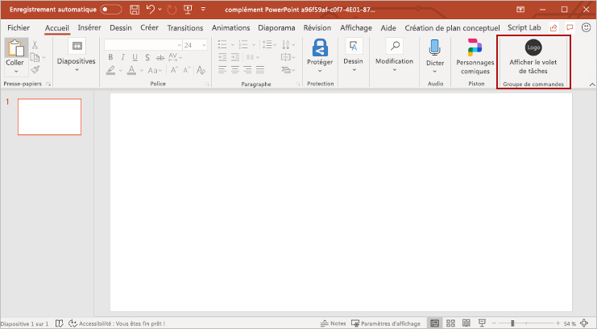
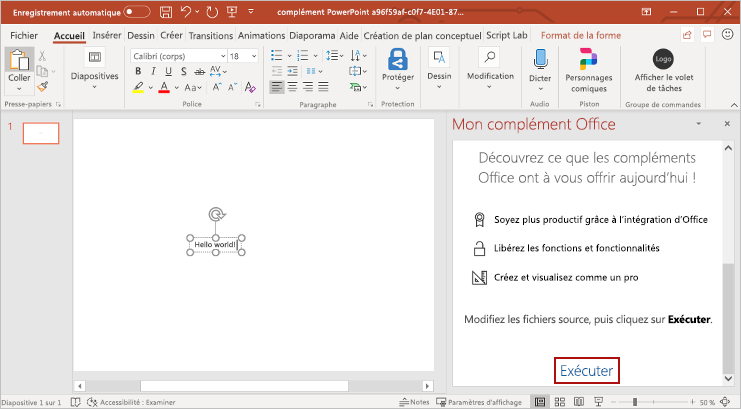
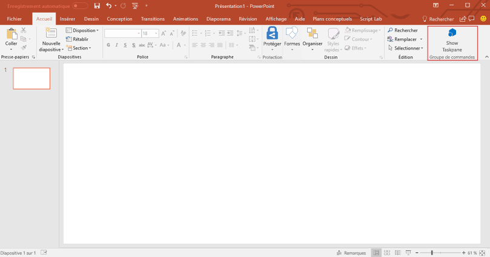
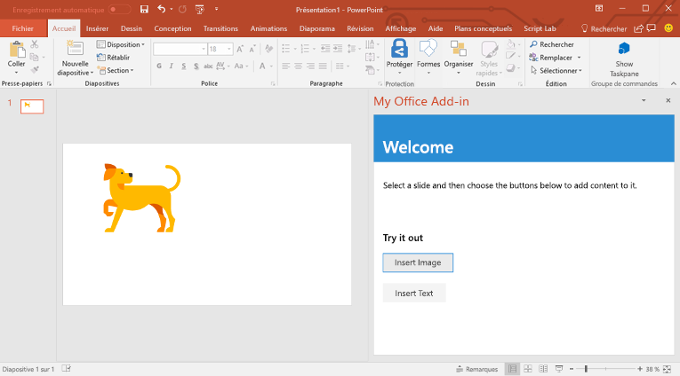
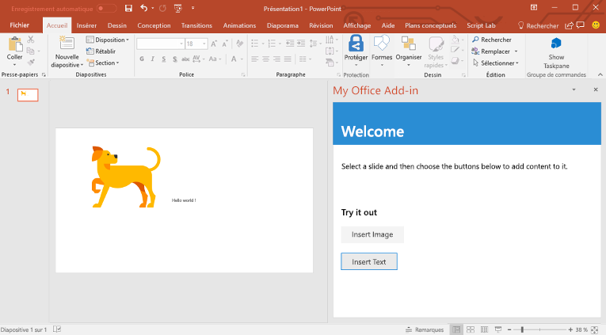

# <a name="build-your-first-powerpoint-task-pane-add-in"></a>Créer votre premier complément de volet de tâches PowerPoint

Dans cet article, vous découvrirez comment créer un complément de volet de tâches PowerPoint.

## <a name="create-the-add-in"></a>Créer le complément 

[!include[Choose your editor](../includes/quickstart-choose-editor.md)]

# <a name="yeoman-generatortabyeomangenerator"></a>[Générateur Yeoman](#tab/yeomangenerator)

[!include[Redirect to the single sign-on (SSO) quick start](../includes/sso-quickstart-reference.md)]

### <a name="prerequisites"></a>Conditions préalables

[!include[Yeoman generator prerequisites](../includes/quickstart-yo-prerequisites.md)]

### <a name="create-the-add-in-project"></a>Création du projet de complément

[!include[Yeoman generator create project guidance](../includes/yo-office-command-guidance.md)]

- **Sélectionnez un type de projet :** `Office Add-in Task Pane project`
- **Sélectionnez un type de script :** `Javascript`
- **Comment souhaitez-vous nommer votre complément ?** `My Office Add-in`
- **Quelle application client Office voulez-vous prendre en charge ?** `PowerPoint`


Après avoir exécuté l’assistant, le générateur crée le projet et installe les composants Node de prise en charge.

[!include[Yeoman generator next steps](../includes/yo-office-next-steps.md)]

### <a name="explore-the-project"></a>Explorer le projet

[!include[Yeoman generator add-in project components](../includes/yo-task-pane-project-components-js.md)]

### <a name="try-it-out"></a>Essayez

1. Accédez au dossier racine du projet.

    ```command&nbsp;line
    cd "My Office Add-in"
    ```

2. Pour démarrer le serveur web local et charger indépendamment votre complément, procédez comme suit.

    > [!NOTE]
    > Les compléments Office doivent utiliser le protocole HTTPS, et non HTTP, même lorsque vous développez. Si vous êtes invité à installer un certificat après avoir exécuté une des commandes suivantes, acceptez d’installer le certificat fourni par le générateur Yeoman.

    > [!TIP]
    > Si vous testez votre complément sur Mac, exécutez la commande suivante avant de continuer. Lorsque vous exécutez cette commande, le serveur web local démarre.
    >
    > ```command&nbsp;line
    > npm run dev-server
    > ```

    - Pour tester votre complément dans PowerPoint, exécutez la commande suivante dans le répertoire racine de votre projet. Cela a pour effet de démarrer le serveur web local (s’il n’est pas déjà en cours d’exécution) et d’ouvrir PowerPoint avec votre complément chargé.

        ```command&nbsp;line
        npm start
        ```

    - Pour tester votre complément dans PowerPoint sur un navigateur, exécutez la commande suivante dans le répertoire racine de votre projet. Lorsque vous exécutez cette commande, le serveur web local démarre (s’il n’est pas déjà en cours d’exécution).

        ```command&nbsp;line
        npm run start:web
        ```

        Pour utiliser votre complément, ouvrez un nouveau document dans PowerPoint sur le web, puis chargez la version test de votre complément en suivant les instructions de l’article relatif au [chargement de version test des compléments Office dans Office sur le web](../testing/sideload-office-add-ins-for-testing.md#sideload-an-office-add-in-in-office-on-the-web).

3. Dans Excel, insérez une diapositive vierge, sélectionnez l’onglet **Accueil**, puis choisissez le bouton **Afficher le volet Office** du ruban pour ouvrir le volet Office du complément.

    

4. En bas du volet Office, sélectionnez le lien **Exécuter** pour insérer le texte « Hello World » dans la diapositive active.

    

### <a name="next-steps"></a>Étapes suivantes

Félicitations, vous avez créé un complément de volet de tâches PowerPoint ! Maintenant, découvrez les fonctionnalités d’un complément PowerPoint et créez un complément plus complexe en suivant le [didacticiel dédié](../tutorials/powerpoint-tutorial.md).

# <a name="visual-studiotabvisualstudio"></a>[Visual Studio](#tab/visualstudio)

### <a name="prerequisites"></a>Conditions préalables

[!include[Quick Start prerequisites](../includes/quickstart-vs-prerequisites.md)]

### <a name="create-the-add-in-project"></a>Création du projet de complément

1. Dans Visual Studio, choisissez **Créer un nouveau projet**.

2. À l’aide de la zone de recherche, entrez **complément**. Choisissez **Complément web PowerPoint**, puis sélectionnez **Suivant**.

3. Nommez votre projet et sélectionnez **Créer**.

4. Dans la fenêtre de la boîte de dialogue **Créer un complément Office**, choisissez **Ajouter de nouvelles fonctionnalités à PowerPoint**, puis sélectionnez **Terminer** pour créer le projet.

5. Visual Studio crée une solution et ses deux projets apparaissent dans l’**explorateur de solutions**. Le fichier **Home.html** s’ouvre dans Visual Studio.
    
### <a name="explore-the-visual-studio-solution"></a>Explorer la solution Visual Studio

[!include[Description of Visual Studio projects](../includes/quickstart-vs-solution.md)]

### <a name="update-the-code"></a>Mise à jour du code

1. **Home.html** spécifie le code HTML qui s’affichera dans le volet Office du complément. Dans **Home.html**, remplacez l’élément `<body>` par le balisage suivant et enregistrez le fichier.
 
    ```html
    <body class="ms-font-m ms-welcome">
        <div id="content-header">
            <div class="padding">
                <h1>Welcome</h1>
            </div>
        </div>
        <div id="content-main">
            <div class="padding">
                <p>Select a slide and then choose the buttons to below to add content to it.</p>
                <br />
                <h3>Try it out</h3>
                <button class="ms-Button" id="insert-image">Insert Image</button>
                <br/><br/>
                <button class="ms-Button" id="insert-text">Insert Text</button>
            </div>
        </div>
    </body>
    ```

2. Ouvrez le fichier **Home.js** à la racine du projet d’application web. Ce fichier spécifie le script pour le complément. Remplacez tout le contenu par le code suivant, puis enregistrez le fichier.

    ```js
    'use strict';

    (function () {

        Office.onReady(function() {
            // Office is ready
            $(document).ready(function () {
                // The document is ready
                $('#insert-image').click(insertImage);
                $('#insert-text').click(insertText);
            });
        });

        function insertImage() {
            Office.context.document.setSelectedDataAsync(getImageAsBase64String(), {
                coercionType: Office.CoercionType.Image,
                imageLeft: 50,
                imageTop: 50,
                imageWidth: 400
            },
                function (asyncResult) {
                    if (asyncResult.status === Office.AsyncResultStatus.Failed) {
                        console.log(asyncResult.error.message);
                    }
                });
        }  

        function insertText() {
            Office.context.document.setSelectedDataAsync("Hello World!",
                function (asyncResult) {
                    if (asyncResult.status === Office.AsyncResultStatus.Failed) {
                        console.log(asyncResult.error.message);
                    }
                });
        }

        function getImageAsBase64String() {
            return 'iVBORw0KGgoAAAANSUhEUgAAAZAAAAEFCAIAAABCdiZrAAAACXBIWXMAAAsSAAALEgHS3X78AAAbX0lEQVR42u2da2xb53nH/xIpmpRMkZQs2mZkkb7UV3lifFnmNYnorO3SLYUVpFjQYoloYA3SoZjVZRi2AVtptF+GNTUzbGiwDQu9deg2pCg9FE3aYQ3lDssw2zGNKc5lUUr6ItuULZKiJUoyJe2DFFsXXs6VOpf/D/kS6/Ac6T2Hv/M8z3nf5zTMz8+DEEL0QCOHgBBCYRFCCIVFCKGwCCGEwiKEEAqLEEJhEUIIhUUIIRQWIYTCIoQQCosQQigsQgiFRQghFBYhhFBYhBAKixBC1hArh2CBwtlYaTRV6ac2f7Cx2Q3AsTfEsSKEwlprYQ3Gpt4bFLixfU+vpdltCwTte0JNHQFrR4ADSEgdaGCL5AVGvhkSLqyV1t/gd+wN2feGHHtClBchFJbq3Hq5b+LCGfn7sfl7nI+HWw710VyEUFhqkf1BJPuDkwrusOXgsfW94ZZDfRxb8oBCEpn4yn90BmF1ozUIq5sjVCOb4RCoxMSFMxMXzlg3+D1fjDgfD3NAzE4ph6EwMlWjeKsLziDaQvCE0BbimDHCquyX8/Fb33lapZ3b9/RueD5q8wc5zuYl2VfDVqvx9MLbB28fHCwvUFjLmUknr/3xw6oewvPMNzzPRDjUZmQsgfNHpX/cewzePvgYp1NYS/j4yw1qH8K+p3fTS/GFKV3ERLw/gCuvyN2Jww9fGP4BM5e6ONP9ATZ/j9qHmHpvcOSbobnJHEfbXBSSCuykmMbwSZwNYDiCkkkvIQpryQ1sT6guueclOotIp5Rf1NZIjMIyNfZ6LbuZSV8a/W6YA05kaWvoOM6FlIndKCxdRlh1XCc4ceFM/o0ox9wsqDRHITuItx9G2kQXEoW1ZCya3S0Hj9XtcNkfRJgYmgVfGFaXWjv/4Os4FzJJVYvCWkbz4fpNTJ+bzDPIMk30HsDuqIrOyg7i7aAZ0kNOa1ghkVzqdzx1jOlcgb9jkGUaiimkow+0UkiilFdy/1YXdkeNPV2LwlrJ6KvhwtnT5f1iQYsbdifWNcPmkH2k/SK3X5j37B/gOTIaYwlMpTCeRDaBwiW5e+t+zcDOorBWUnbKu9UGjw/OdkWPtF/SpzY9C18YG57kmTImpRwycWTiotfxmMNZFFYZlvbGarTA44PLq8Jh9sv4rMOPfTGujzW4ua7HcCWKYprOorCqlhouJ2586ygAWzO8ASWyP8WFtUDXCexm2d7w988YhiNStGVEZ1FYFYOsufSgbycaLeocwA58Son9eHrxcJx9lIzPcATpqOgi/ZGLcBqqRwiFVZ7ZD37ccOY31bIVgBZgm0K7cvbgSJKnzASRfwpDYWTFNPK2uvB4ykj3M87DKsd0znL2d1W0FQAF08zCJQyFedKMjyOAwwnsOiXiI6U8zoWMNAYUVjnifRhPq3uIJmUz2NNlGu8SQ+IfwJGLIuagFi5hOEJhGZcLUVwbVP0oihfyh8KmbTliOpxBHEnCKbgb0vBJjCUoLGMmg3i7LrejFqV3WMqbahEs00McTohw1rsGKRpQWKvCq+m86kdpUWe3FJapsLpFOKuYNkZiSGGtCK9O1uNArerstpRnJcuMzhJYz0pHUUxRWMYKr+qDDGEVpiwXPnZe+NhZ/scUFp1V5X6m/yCL87CW8FfueuSDMqaMJi67I68H7k5ZAGx2z7z83PDOzZPLtuCcLHMyEsPQcUFbPvYLXb80jBHWJ7wbq4etAMjoXnPfVgBu5Gwv/eP2VQHYJZ5JM+ILwyus96TOgywK6xM+qlcyJVVYH95ovm+r+87ieSOLdMcEJYYjp3U9/YWvqgcATOfw0Zl6HMgDSJ1AvzL7A9bbZ8ts9/OAkIWyh/7kYJWfbt68+eWXX965cycvDf18ld3YHRWUGKaj2K7XOIsRFgDgaqJOB5LXpuapA3eW/u+XP50ps5GwZf3lZXc/drtx44UXXvjwww95aegsMfT0CgiyYkwJmQ8KC6/k5XAvPXX1qQN3DmwtHNha+MYXUy/82ojkXa2O11Zw9+7db3/727w0dIaQ0KmY1u/TZKaEdYywZHcBdNpnI19MKfK7HNp2951fOKtv88477/DS0BltIXh6a3d0yMTh7dPj38cICxhPqb7UGcAGueGVshzcWuCZNyZCuv7rNsKisICM+hOXLAqEVwoLa1uhehmL6BVvHxz+GtuU8jp9JxiFVRdhdUp/OKiqs3jyjYmQzsj6DLIoLPULWK2qLR6UR2gv29GYWFj6bDhDYQHjKRV33gR0avTv/sKBO8wKjYkjUDsrZEqoW2GpVnG3AAEtJoP3KT+TixiAjloPAUt5PTZvML2wVC1gbQbsmv7rv/TpWwyyjImQd1bqMMgyvbCmVavjdMpa51wfnPZZBlnGRMjbvSgsRlgPYiuPPgaAQZYxEdJD5p7+nrqYfqa7GhFWp25stRBkJf6MLbSMSM0p74ywiL5sRQiFpSsUnIRlAfy0FdEMQuruTAlNih3YovVngoToPSWksJRgA+DV9HwrQspQyuvuV6aw5NEEbFHtPYOEEApLGda54MpjIweC6BbhL47WDHxKKIl9/fhKirYimqbmNCurmxGW0aOqAwM4OIB1bg4G0ToFA06vo7CEseMY9oWxo48jQQiFpUk6erAlhC0heorokpqd3XU4Ucv0wvIuWSNqd6MjiHVueIPYEuIFX7unEtEsQlrHsIalP45GeW1XxENr6ze8StTeRkhHB43Bp4SkMkI67RJtIqQDciuFRYwTXvUacjEaI6wH+b4OU0IKi1RAyDuEiTYpJFGs1fhbh/kghUUq0HWC4ZWOuR4TEEHr8vxSWGQVvn7s5rMIPTMq4J2DfFU9MYitumMcBh2TiQvIB3sE9VDWHpw4Sj7B4ceuqE5vvOQBaQHRsW4nrFBYpsfqQlsI3j5OYjACY4naE9wB+AcoLCKD/1ViJ/uBz81zLE3NcKT2NrrNB8EallZgb2Uin5GYscMrCksz2DgERB6lHN4XYCKrS9e5P4WlDdhkmchkKCyoR7uewysKSzOs5xAQeclg5oyg8IrCIgpgB5o4CkQShSSGjgva0j+gx/WDFJYmcXEIiHiKKZwLCdrS4TfA+lBOa9AMHuC27J38tIEDWSccftgDcAbhCMAZXJull6Uckn1CXy+4ywjLrSgsLWWFdmCKA6GX0CaNYnrZNALvMXhC8PbVaZZTKYdzIRQuCdrYe8wYaxga5uc51VAz4UwWuCbj4/t5SjQSLPfiobC6swcKSZwLCY2trC48ntJ79WoB1rA0lhWy9G4AsoMYOo6fuTEcQSmn/P4zcRG2AtAdM4atKCzt4eMQGIVSHsMncTagsLbeH0DyaRG26jphpAXtTAm1lBIu8DEwwZTQWCjSCWMsgQ8GhBatFnD24IihXqfKCEt7dAIWjoKxKKaRfBrJPomhVjGFoTDOHxVtq8MJgw0kIyztRVgAxoG0+E8xwtI+VheCcRFzIIopjMSQjorIAe8f6HBCp43bKSy9CQvALSBDYRmUXadqL5HJxJGJY+S0RC0a0VbgPCztshG4B2Q5EEbkg6+jkCzTirqUw1gCmTiyidptjs1nKwpL23QCduAGB8KIjJzG9E1s/SOUcigkUUyhkBRXojKfrZgSajglvM84cA2YZUpIarFQZTfKlKuy8Cmh5mkFdgEeDgSpiq/f8LaisGSH3/XBAnRSW6Qyu04ZaTo7haVSBF7fSoEN6AT2Ap1AK+dqkU/SwCMX9d6WT0SQwDOuMyyA55NQaxaYAmaBIsfFlAG+f8AALa4orDpGWEJeUqKqvBaawbfyZJgMXz+2R/T7ti4Kay1ocnMMSL3x9GJ7ZG36BVJYuo+wCGFURWHpA3NfOqRe98Ue+MJ4KGyGh4AUFiMsok/q3HCZwjLL3U/+cgpCltL+6zj4JoehLJyHxSCLaIw7P1GlsTKFRSgsogrXYxwDCovCIjrhSpRjQGGpgFmnwxB1KaZRSHIYKCwV8PRyDIjyZOIcAwpLBQz0DiVCYVFYzAoJEU/hEp8VUlgq4AzC4ecwEOUZZxmLwlIDD4MsogLZBMeAwlIBlrGIKlkhIywKSyVh1a1dMjEP91jDorBUwhfmGBClU8JBjgGFpQ4PUViEUFh6wRmEs4fDQAiFpRNM8+YSQigs/cPSOyEUlm6wull6J4TCYlZICKGwFMcRgK+fw0AIhaUTTPYmXkIoLAZZhBAKi0EWIRQWWRlkdZ3gMBBCYemEHRHOySJEcfgiVcFM5/BRHFcTyCQxKuDlqRuAzRw1QiisOnM1gXei+OiMuE/dBjyAncNHCIVVHzJJvDWAa1K7fIwA2ziIhFBYdeC/Inj7pKw9TAC3gQ0cSkIoLPWYzuFfQoIKVbVjNMAFNHFMCVEAPiUslwYqZSsAs0CKY0oIIyw1GE/hX0OYziu5zykgA3g5uIQwwlI2E4z3KWyrBW4BExxfQigsBXkzrFgmuJo0MMshJoTCUoQL4mdaiWIW+JijTAiFpUgy+HZE9aNMAdc41oRQWDJ5a0CV0tVqssBtDjchFJZkxlN493T9DncDyHLQCaGwpDEUq/cRr/GhISFS4Dws4N3YGhw0DWzj0mgVmZvBzBhmZzAzVuFebcO6NljXw7qeo0Vh6YVMEuPpNTjuwkNDOktRpm6ieBMzYyjexNyMiA86NsHWBvsmODah0caBpLA0y0fxNTs0naUQE1cweQUTV8RJainFmyjeRP7yoryau9DSxchLi5i+hnU1sZZHX3AW61nSaN6J7tfwRLbpsxfh65dsq9XyuvM/uPI6bv0ME1c4ytqiYX5+3tQD8LeBtUkJV9AJeHg1CsayHr/0fXQ8tfTf5iZz+Tei+Teic5NKzlCxrocnCOeONfpLPzfPs01hLeHlBq38JpvZOUsYzh4cTsDqLvtDo2mLwmJKKCMO6lVx5zeAIoe4Fr5+HElWshWAxma355lI11+mnI8r+XbI0l2M/ieu/RumbvIcMMLSS4T10jwAZJIYTSKTRCYpvXtymTQH2MsLsirdr8EXFr558XJi9NVw6bbCKb9rLzzBej1MZIRFYckV1gqU8pcH6OQFWQGHH8E4nEGxn5ubzGVfj+TffEXZX8e6Ht5HYd9EYVFYuhOWUv7yA628IMvhPYbuWJU0sCYT5+Ojr4aVrWoB8AThCar8t1NYFJa6wpLsr72AhRfkikjGhd1RUWlgJUqjqZvf6ZtJK9zvrKULHY+qmR5SWBRWXYUl0F+tgJ9X44oAphfdMTgCSu1vbjI3+t3wxAWFu57Z2rDpCdVmmVJYFNZaCquSvyb+GbZbvBwfBFbdMXj71Nj36KvhwlmFm3M02uB7ErY2Ckt1OK1hTfEGsS+Mo1E0T3EwFuk6gcdTKtkKQMeLMWVnPACYm8HIm4Czh2ePwjIBhSRKeQ4DPL147BfYHZVTX19DZ+Fwgs6isEzA9RhVhUNv4XBCwYpV/Z0Fq5vOorBMwGjcvH/7fVW1hep8ZBWd5eADFArLwPlgMW3GP9zXjyMX10RV92l/PmrzKx0QWd0IxmF18dKmsIzIWEKZ/ez8C30kIw4/dp3CE1l0xyTMXFf46m92+/400distFycQQTjvLQpLCMyElNgJ95jCPwBjiRx5CK6TmgxJbG64OvHobfwWAr+AbXL6mKdpciuZtLJB//TFsL2bygTgBMKSysUUygoMfe6a+DBvX13FI+ltGIuhx++fgR/iCdy6I6tYfZXBZs/2P7cKfn7mZ3ILfv/7RF4j8nd6b0cvyXLbnwcgrUkE1dGCqtFsGCu3VEUU8jEkU1gLFGnyRNWF9pC8ITQFlrzpE8grs8PTF1OKD4JHt0xnA1wzgqFRWEtv5NX01kA/gH4BxYDumwC40kUkgpP/vL0whlEaxDOoF4ktYKOr8aKvxdQeIH0QgH+/FFe6RSW/inlkJXdTsvqEjEp3BGAIwzfkl9gPIlSbrFQcr/8X8qVSVQdftgDD8K3JjccAdgDaA1qpyAlqzjS7O54MXbrO08rvN+2ELpO4MorvN4pLIZXkFXAtroXc8kF5W03+wlpOdTXcvCY5MSwdDtV/gc7IhiNS5y8MpXiF2XZfYVDoG9hKdF6hSxNDCXPciiNpireGHZFJf5CRQqLwtKKsGSXeH39dVvLYpbvQ7Pb80xEYWEtxLAeSS8EoLAoLIZXpAquzw9YN0iZDnJvtKpcumMUFoVlYmF5erU5rckIieGLUuSybOLoahwBdJ0QvVNOHF2RXnMIRCDhJYb7+rFveRzkDWKdWwFhPcTwSi0ce0P2Pb1T74l7hjs3mZ+bzDU2V34GsiOCkZi42SSlPIopJv6MsOp2sw5iS2jZfwu2kjkHyuFnPqgq0ipZxcuJquGBe3FCHIMsCksi61ReVe8tN4tS/oJn2qouQZbCWSEWpqGIvOSUWh5PYRmBr6Rw4ISK+y8rLJkNsKwuKTdqon6QVSPCkhZkZSksCutBhOXG0Sieu4gOFXqzdPRgnbtMhC+zAZa3zxiTy40XZE29Nzg3WWu5stggq3CJzwoprFVx0LMJ7FO6/+TBcvfS6zG5u90e4RmrD5u2lnw74fHB2Q5bs3JBltiMPsPuWhTW6lDryRhCpxTbYat/5fNBRSJ8Ty+fGdXv67HtM3YnPJvREUDnHgSC2LgdznZYK785dfK8ALmIzQoVaZpGYRmQgwN48jVldnW03GoM+Q2wGF7V+XpY+m2xoMWNjgC69qNzL1xeNK56WffE+XjtrNARENcqi1khhVWRfWEF4qx9/djRp3xsX7b1FVEz7p7f9aWyP7E50L5lMeZqWVJRnJvMTwgJssRmhQyyKKxq91U59ayOnvLhlfzLjuFV3Wn45T+svkGLGxu3o2s/nO2LAVdhUMBZ9vaJ6webjvJcUFhVEzppzw07evBsoszDQfn5oKjWV0QpvMF5187aJ8e2mCp6fJj5cLD2hCyxQVYpzyCLwqqWC+BJ8dfHgRN4PlneVpBdbtfSuxvMFWQ9/FWhXycLPJuxaTvybwgIiMRmhcOMrymsqrdWEXNKO3vxW29VzAQXkFnA4uz2taJb3MjbnShdPF2q3rwBgCMgrudMMc3EkMKqyq9Gaqzd6ezFgRN47iKeTWBLqGpIn5PVAIutr9Y03J7f8llRn2jfgsyrAjQndgX7cAQlU79Hh90aaiWGX1Po+mB4peuscN+XcfXfhW9vc6ApNVi8nHDsrXob8/YBx0X8HqU8Popgt3njLEZY9ULOEla2vlpzdoh+3NG+BXf+5vkac7KsbtHvLrzyipmXQ1NY9UJOhMXWVzrMChst8DivZl+P1NhOwpPfd8OmTQwprHrZSnIDLLa+0k5WKJIWN+bOvVJjdaFHfOxcTGPIpJcEhaX58Iq20m1WuJAYZv/6C9WeGDoCcIqf8Zc5Y85ZDhSWtoXF1ldaygrnOg6K/oJZsMl/93b0N6oVs6TNBx4+acKppBSW+sh5KTxbX2nq27Lvt6V8yoI2x3s3v/VYRWdJXsAwdNxszqKw1Oe6jEuKiwc1RfWpdpWxObCheejOqc+Ud5YzKLpvslmdRWGpj+SGyGx9pTW8wXmLXbKz2psuZP/84fLOkjNtZei4eWrwFJb6+aDkhsgMr7TH/MZfkf5ls8A+lypfgJfwrHApI6cpLKIEkuf4sfWVNr8wO4/J+fhMETZ/UOEIa+FqobCIAkiuLzC80iZSy1gLzLZVmMEgp4y18HEKi8hFcgMstr7SLDLKWAAaHzqiinQoLKIAkqdfsfWVhpl37ZL2wdIMmrY+UvHHcrJCmSUwCovIEhZnt2v5O7NLYvBbmsY6f1CVKKmVERaRSSmH7KAkW7H1ldazQokVgrsVKu4yIyyH3zzxOIXF8IrUSVhzLVXvQ1a3xId9pilgUVjaE5azh7MZtE5rQGLdfWOtpYh2SZE1hUWUEJakhshc6qwHJNTd52Zh3fpojY2k3atMU3GnsDQWXrH1lU5o2Pak2I/MTFYtYMmJlVoZYZE1ERZtpRdhbdgt9iPFu6jR3x2Q8rDFTBV3CktjwmI+qBdaRZulRsVdcoRlpgIWhaUOYwkpDbB8/ZwsqhvEL9Bp3LhfaMREYVFYOgivuHhQV8w3rBP3gY0HBG0m9kGhmSruFJY6SGiAxdZXuhOWR0QZa6oA+x5hZhEbMbUywiJykNYAi9Ur3eHsEr7tdBHrAsLM0iSmLGCyijuFpQLXY6I/4vCzN4P+vjm+A8I3LlnaG5uFmUVUiidtoimFRR6QTYj+CKtXekTUAp32/ar8DuZbFEFhKYqEBlhsfaVT1onIxRoDvao4yGSPCCkspZHwfNAX5mwGXeISmo6JqLiLhcIispDQEJnldp0ieO7ovRnBFfdFDQl7EbTVZcInyxSWcpRyovNBtr4yAffu2YVW3BdNJGxj84VXFJYG8kGiW+Zc+wRt5hHZ2kHgzAZTtiGisNZOWGx9pXcsVkFbiW2pLDB0YoRFZOWDYhtgsXqld5rW19yk4osI5UNhkfqFV2x9pX/mW2svVJ6erPriiTK3vThy/117S1NW3AFYedkpg9g3PNNWumXuys9LP33JmnvH0jBbc+N79+zOjoCg6+dKVESQbsrwisJauwiL+aAeQ6r/+9HsT79mnUrbADQIs1vNinshifcHRL9gyazVTwpLIVuJaoDF1le6Yzp374fPNV3/kdgvjPVTVZspD0cwfFLK78MIi1QL1zNxZBMS3zu/Gi4e1BfjqdLfH26avS32c6UZWDZW6EJTyuFin8Q3V1JYpKKqPhhQzFMLsPWVzsLn5Pz3HrHOz0gJyypV3Es5nAtJv67MWnGnsKrcHHMYCkt8VVd1WL3SVWw1/71HGiTZCsBMES1lhTUUlnUXNGt4RWFVtpWcG2AV2PpKR0znZv/h0xaptgIw21ZuVeBwRO6N0MTzjTkPq462AqtXemLuP37fMj0i69v10JGV/1RISqyyL7vtmbekQGGtQj1bsfWVrpLBxvdek3Xjm0HT1kdW/uv7ShQETJwSUlirwnWVbAW2vtITsz9+UW6kPr2q4j6WkP5YkMKisMokg+moivtnuV0/4ZXl+k9k7qN4d9UqQgnt0lbj6TXzmaGwlpCOSnkBqtDwiq2vdMP85e/L30mZVz1Le2ElwysKqzyK3ACr5INEL8Ia+icF9rLx4Mp8UJHbYSuFRSD1fYJC74psfaWrb0X+Xbnh1SysWx9d9k8SXqfECIvCqshYQsWds3qlI8ZT8vcxM7mqgFVIUlgUlnKUcmrtma2v9EVeAWEV78Kxd3lMfU+JC8zcFXcKqy7QVuajTMWd4ZUSNMzPz/PyIoQwwiKEEAqLEEJhEUIIhUUIIRQWIYTCIoQQCosQQigsQgiFRQghFBYhhFBYhBAKixBCKCxCCKGwCCGG4/8BAjn5LoppTCkAAAAASUVORK5CYII=';
        }

    })();
    ```

3. Ouvrez le fichier **Home.css** à la racine du projet d’application web. Ce fichier spécifie les styles personnalisés pour le complément. Remplacez tout le contenu par le code suivant, puis enregistrez le fichier.

    ```css
    #content-header {
        background: #2a8dd4;
        color: #fff;
        position: absolute;
        top: 0;
        left: 0;
        width: 100%;
        height: 80px; 
        overflow: hidden;
    }

    #content-main {
        background: #fff;
        position: fixed;
        top: 80px;
        left: 0;
        right: 0;
        bottom: 0;
        overflow: auto; 
    }

    .padding {
        padding: 15px;
    }
    ```

### <a name="update-the-manifest"></a>Mise à jour du manifeste

1. Ouvrez le fichier manifeste XML dans le projet de complément. Ce fichier définit les paramètres et les fonctionnalités du complément.

2. L’élément `ProviderName` possède une valeur d’espace réservé. Remplacez-le par votre nom.

3. L’attribut `DefaultValue` de l’élément `DisplayName` possède un espace réservé. Remplacez-le par **My Office Add-in**.

4. L’attribut `DefaultValue` de l’élément `Description` possède un espace réservé. Remplacez-le par **A task pane add-in for PowerPoint**.

5. Enregistrez le fichier.

    ```xml
    ...
    <ProviderName>John Doe</ProviderName>
    <DefaultLocale>en-US</DefaultLocale>
    <!-- The display name of your add-in. Used on the store and various places of the Office UI such as the add-ins dialog. -->
    <DisplayName DefaultValue="My Office Add-in" />
    <Description DefaultValue="A task pane add-in for PowerPoint"/>
    ...
    ```

### <a name="try-it-out"></a>Essayez

1. À l’aide de Visual Studio, testez le nouveau complément PowerPoint en appuyant sur **F5** ou en choisissant le bouton **Démarrer** pour lancer PowerPoint avec le bouton du complément **Show Taskpane** (Afficher le volet Office) qui apparaît dans le ruban. Le complément sera hébergé localement sur IIS.

2. Dans Excel, insérez une diapositive vierge, sélectionnez l’onglet **Accueil**, puis choisissez le bouton **Afficher le volet Office** du ruban pour ouvrir le volet Office du complément.

    

3. Dans le volet Office, sélectionnez le bouton **Insérer une Image** pour ajouter une image à la diapositive sélectionnée.

    

4. Dans le volet Office, sélectionnez le bouton **Insérer du texte** pour ajouter du texte à la diapositive sélectionnée.

    

### <a name="next-steps"></a>Étapes suivantes

Félicitations, vous avez créé un complément de volet de tâches PowerPoint ! Ensuite, en savoir plus sur la [création de compléments Office avec Visual Studio](../develop/develop-add-ins-visual-studio.md).

---

## <a name="see-also"></a>Voir aussi

* [Vue d’ensemble de la plateforme des compléments Office](../overview/office-add-ins.md)
* [Création de compléments Office](../overview/office-add-ins-fundamentals.md)
* [Développement de compléments Office](../develop/develop-overview.md)