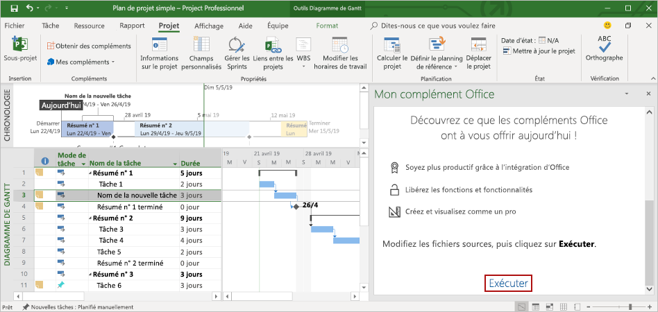

# <a name="build-your-first-project-task-pane-add-in"></a>Créer votre premier complément du volet des tâches de Project

Cet article décrit comment créer un complément du volet des tâches de Project.

## <a name="prerequisites"></a>Conditions préalables

[!include[Set up requirements](../includes/set-up-dev-environment-beforehand.md)]
[!include[Yeoman generator prerequisites](../includes/quickstart-yo-prerequisites.md)]

- Project 2016 ou version ultérieure pour Windows

## <a name="create-the-add-in"></a>Créer le complément

[!include[Yeoman generator create project guidance](../includes/yo-office-command-guidance.md)]

- **Sélectionnez un type de projet :** `Office Add-in Task Pane project`
- **Sélectionnez un type de script :** `Javascript`
- **Comment souhaitez-vous nommer votre complément ?** `My Office Add-in`
- **Quelle application client Office voulez-vous prendre en charge ?** `Project`


Après avoir exécuté l’assistant, le générateur crée le projet et installe les composants Node de prise en charge.

[!include[Yeoman generator next steps](../includes/yo-office-next-steps.md)]

## <a name="explore-the-project"></a>Explorer le projet

Le projet de complément que vous avez créé à l’aide du générateur Yeoman contient un exemple de code pour un complément de volet de tâches très simple.

- Le fichier **./manifest.xml** du répertoire racine du projet définit les paramètres et fonctionnalités du complément.
- Le fichier **./src/taskpane/taskpane.html** contient les balises HTML du volet Office.
- Le fichier **./src/taskpane/taskpane.css** contient le style CSS appliqué au contenu du volet Office.
- Le fichier **./src/taskpane/taskpane.js** contient le code d’API JavaScript pour Office qui facilite l’interaction entre le volet des tâches et l’application cliente Office.

## <a name="update-the-code"></a>Mettre à jour le code

Ouvrez le fichier **./src/taskpane/taskpane.js** dans votre éditeur de code et ajoutez le code suivant à la fonction `run`. Ce code utilise l’API JavaScript Office pour définir le champ `Name` et le champ `Notes` de la tâche sélectionnée.

```js
var taskGuid;

// Get the GUID of the selected task
Office.context.document.getSelectedTaskAsync(
    function (result) {
        if (result.status === Office.AsyncResultStatus.Succeeded) {
            taskGuid = result.value;

            // Set the specified fields for the selected task.
            var targetFields = [Office.ProjectTaskFields.Name, Office.ProjectTaskFields.Notes];
            var fieldValues = ['New task name', 'Notes for the task.'];

            // Set the field value. If the call is successful, set the next field.
            for (var i = 0; i < targetFields.length; i++) {
                Office.context.document.setTaskFieldAsync(
                    taskGuid,
                    targetFields[i],
                    fieldValues[i],
                    function (result) {
                        if (result.status === Office.AsyncResultStatus.Succeeded) {
                            i++;
                        }
                        else {
                            var err = result.error;
                            console.log(err.name + ' ' + err.code + ' ' + err.message);
                        }
                    }
                );
            }
        } else {
            var err = result.error;
            console.log(err.name + ' ' + err.code + ' ' + err.message);
        }
    }
);
```

## <a name="try-it-out"></a>Essayez

1. Accédez au dossier racine du projet.

    ```command&nbsp;line
    cd "My Office Add-in"
    ```

2. Démarrez le serveur web local.

    > [!NOTE]
    > Les compléments Office doivent utiliser le protocole HTTPS, et non HTTP, même lorsque vous développez. Si vous êtes invité à installer un certificat après avoir exécuté la commande suivante, acceptez d’installer le certificat fourni par le générateur Yeoman.

    Exécutez la commande suivante dans le répertoire racine de votre projet. Lorsque vous exécutez cette commande, le serveur web local démarre.

    ```command&nbsp;line
    npm run dev-server
    ```

3. Dans Project, créez un plan de projet simple.

4. Chargez votre complément dans Project en suivant les instructions fournies dans [Chargement de versions test de compléments Office sur Windows](../testing/create-a-network-shared-folder-catalog-for-task-pane-and-content-add-ins.md).

5. Sélectionnez une seule tâche dans le projet.

6. Au bas du volet des tâches, sélectionnez le lien **Exécuter** pour renommer la tâche sélectionnée et ajouter des notes à la tâche sélectionnée.

    

## <a name="next-steps"></a>Étapes suivantes

Félicitations, vous avez créé un complément de volet de tâches Project ! À présent, découvrez les fonctionnalités d’un complément Project et explorez des scénarios courants.

> [!div class="nextstepaction"]
> [Compléments Project](../project/project-add-ins.md)

## <a name="see-also"></a>Voir aussi

- [Développement de compléments Office](../develop/develop-overview.md)
- [Concepts de base pour les compléments Office](../overview/core-concepts-office-add-ins.md)
