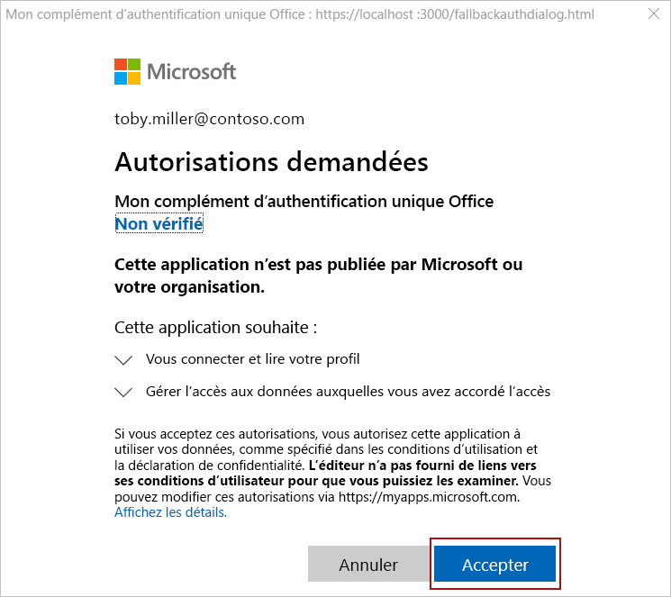
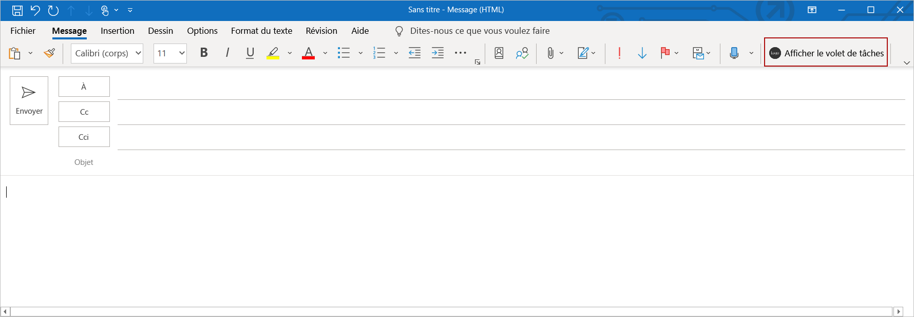

# <a name="customize-your-nodejs-sso-enabled-add-in"></a>Personnaliser votre complément compatible avec l’authentification unique Node.js

> [!IMPORTANT]
> Cet article s’appuie sur le complément à extension SSO créé en remplissant le démarrage rapide de l’authentification [unique (SSO)](sso-quickstart.md). Veuillez terminer le démarrage rapide avant de lire cet article.

Le [démarrage rapide de l’authentification unique](sso-quickstart.md) crée un complément à extension SSO qui obtient les informations de profil de l’utilisateur connecté et l’écrit dans le document ou le message. Dans cet article, vous découvrirez le processus de mise à jour du complément que vous avez créé avec le générateur Yeoman dans le démarrage rapide de l’authentification unique, afin d’ajouter de nouvelles fonctionnalités qui nécessitent des autorisations différentes.

## <a name="prerequisites"></a>Conditions préalables

* Un complément Office que vous avez créé en suivant les instructions du [démarrage rapide de l’authentification unique](sso-quickstart.md).

* Au moins quelques fichiers et dossiers stockés sur OneDrive entreprise dans votre abonnement Microsoft 365.

* [Node.js](https://nodejs.org) (la dernière version [LTS](https://nodejs.org/about/releases))

[!include[additional prerequisites](../includes/sso-tutorial-prereqs.md)]

## <a name="review-contents-of-the-project"></a>Vérifier le contenu du projet

Commençons par un examen rapide du projet de complément que vous avez [créé précédemment avec le générateur Yeoman](sso-quickstart.md).

> [!NOTE]
> Dans les emplacements où cet article fait référence à des fichiers de script utilisant l’extension de fichier **. js** , supposez plutôt l’extension de fichier **. TS** si votre projet a été créé avec une écriture.

[!include[project structure for an SSO-enabled add-in created with the Yeoman generator](../includes/sso-yeoman-project-structure.md)]

## <a name="add-new-functionality"></a>Ajouter une nouvelle fonctionnalité

Le complément que vous avez créé avec le démarrage rapide de l’authentification unique utilise Microsoft Graph pour obtenir les informations de profil de l’utilisateur connecté et écrit ces informations dans le document ou le message. Nous allons modifier les fonctionnalités du complément de sorte qu’il récupère les noms des 10 fichiers et dossiers les plus à partir de OneDrive entreprise de l’utilisateur connecté et qu’il écrit ces informations dans le document ou le message. L’activation de cette nouvelle fonctionnalité nécessite la mise à jour des autorisations d’application dans Azure et la mise à jour du code dans le projet de complément.

### <a name="update-app-permissions-in-azure"></a>Mettre à jour les autorisations d’application dans Azure

Avant que le complément puisse lire correctement le contenu de OneDrive entreprise de l’utilisateur, les informations d’inscription de son application dans Azure doivent être mises à jour avec les autorisations appropriées. Procédez comme suit pour accorder à l’application l’autorisation **files. Read. All** et révoquer l’autorisation **User. Read** , qui n’est plus nécessaire.

1. Accédez au [portail Azure](https://ms.portal.azure.com/#home) et **Connectez-vous à l’aide de vos informations d’identification d’administrateur Microsoft 365**.

2. Accédez à la page **inscriptions des applications** .
    > [!TIP]
    > Pour ce faire, vous pouvez choisir la vignette **inscriptions des applications** sur la page d’accueil Azure ou à l’aide de la zone de recherche de la page d’accueil pour rechercher et choisir les inscriptions de l' **application**.

3. Sur la page **inscriptions des applications** , sélectionnez l’application que vous avez créée au démarrage rapide. 
    > [!TIP]
    > Le **nom complet** de l’application correspond au nom du complément que vous avez spécifié lors de la création du projet avec le générateur Yeoman.

4. À partir de la page vue d’ensemble de l’application, choisissez **autorisations d’API** sous l’en-tête **gérer** dans la partie gauche de la page.

5. Dans la ligne **User. Read** du tableau autorisations, cliquez sur les points de suspension, puis sélectionnez **révoquer le consentement** de l’administrateur dans le menu qui s’affiche.

6. Sélectionnez le bouton **Oui, supprimer** en réponse à l’invite affichée.

7. Dans la ligne **User. Read** du tableau des autorisations, cliquez sur les points de suspension, puis sélectionnez **Supprimer l’autorisation** dans le menu qui s’affiche.

8. Sélectionnez le bouton **Oui, supprimer** en réponse à l’invite affichée.

9. Cliquez sur le bouton **Ajouter une autorisation**.

10. Dans le panneau qui s’ouvre, choisissez **Microsoft Graph** , puis sélectionnez **autorisations déléguées**.

11. Dans le panneau autorisations de l' **API de demande** :

    a. Sous **fichiers**, sélectionnez **fichiers. Read. All**.

    b. Sélectionnez le bouton **Ajouter des autorisations** en bas du panneau pour enregistrer ces modifications d’autorisations.

12. Sélectionnez le bouton **accorder le consentement de l’administrateur pour [nom du client]** .

13. Sélectionnez le bouton **Oui** en réponse à l’invite affichée.

### <a name="update-code-in-the-add-in-project"></a>Mettre à jour le code dans le projet de complément

Pour permettre au complément de lire le contenu de OneDrive entreprise de l’utilisateur connecté, vous devez :

- Mettez à jour le code qui fait référence à l’URL de Microsoft Graph, aux paramètres et à l’étendue d’accès requise.

- Mettez à jour le code qui définit l’interface utilisateur du volet Office, afin qu’il décrive précisément les nouvelles fonctionnalités. 

- Mettez à jour le code qui analyse la réponse à partir de Microsoft Graph et l’écrit dans le document ou le message.

Les étapes suivantes décrivent ces mises à jour.

### <a name="changes-required-for-any-type-of-add-in"></a>Modifications requises pour tout type de complément

Effectuez les étapes suivantes pour votre complément, pour modifier l’URL, les paramètres et l’étendue d’accès de Microsoft Graph, et mettre à jour l’interface utilisateur du volet Office. Ces étapes sont les mêmes, indépendamment de l’application Office ciblée par votre complément.

1. Dans le **./. ENV** (fichier) :

    a. Remplacez `GRAPH_URL_SEGMENT=/me` par : `GRAPH_URL_SEGMENT=/me/drive/root/children`

    b. Remplacez `QUERY_PARAM_SEGMENT=` par : `QUERY_PARAM_SEGMENT=?$select=name&$top=10`

    c. Remplacez `SCOPE=User.Read` par : `SCOPE=Files.Read.All`

2. Dans **./manifest.xml**, recherchez la ligne à `<Scope>User.Read</Scope>` la fin du fichier et remplacez-la par la ligne `<Scope>Files.Read.All</Scope>` .

3. Dans **./src/helpers/fallbackauthdialog.js** (ou dans **./SRC/helpers/fallbackauthdialog.TS** pour un projet de type dactylographié), recherchez la chaîne `https://graph.microsoft.com/User.Read` et remplacez-la par la chaîne, de la manière suivante `https://graph.microsoft.com/Files.Read.All` `requestObj` :

    ```javascript
    var requestObj = {
      scopes: [`https://graph.microsoft.com/Files.Read.All`]
    };
    ```

    ```typescript
    var requestObj: Object = {
      scopes: [`https://graph.microsoft.com/Files.Read.All`]
    };
    ```

4. Dans **./src/taskpane/taskpane.html**, recherchez l’élément `<section class="ms-firstrun-instructionstep__header">` et mettez à jour le texte à l’intérieur de cet élément pour décrire les nouvelles fonctionnalités du complément.

    ```html
    <section class="ms-firstrun-instructionstep__header">
        <h2 class="ms-font-m">This add-in demonstrates how to use single sign-on by making a call to Microsoft
            Graph to read content from OneDrive for Business.</h2>
        <div class="ms-firstrun-instructionstep__header--image"></div>
    </section>
    ```

5. Dans **./src/taskpane/taskpane.html**, recherchez et remplacez les deux occurrences de la chaîne `Get My User Profile Information` par la chaîne `Read my OneDrive for Business` .

    ```html
    <li class="ms-ListItem">
        <span class="ms-ListItem-primaryText">Click the <b>Read my OneDrive for Business</b>
            button.</span>
        <div class="clearfix"></div>
    </li>
    ```

    ```html
    <p align="center">
        <button id="getGraphDataButton" class="popupButton ms-Button ms-Button--primary"><span
                class="ms-Button-label">Read my OneDrive for Business</span></button>
    </p>
    ```

6. Dans **./src/taskpane/taskpane.html**, recherchez et remplacez la chaîne `Your user profile information will be displayed in the document.` par la chaîne `The names of the top 10 files and folders in your OneDrive for Business will be displayed in the document or message.` .

    ```html
    <li class="ms-ListItem">
        <span class="ms-ListItem-primaryText">The names of the top 10 files and folders in your OneDrive for Business will be displayed in the document or message.</span>
        <div class="clearfix"></div>
    </li>
    ```

7. Mettez à jour le code qui analyse la réponse à partir de Microsoft Graph et l’écrit dans le document ou le message, en suivant les instructions de la section correspondant à votre type de complément :

    - [Modifications requises pour un complément Excel (JavaScript)](#changes-required-for-an-excel-add-in-javascript)
    - [Modifications requises pour un complément Excel (machine à écrire)](#changes-required-for-an-excel-add-in-typescript)
    - [Modifications requises pour un complément Outlook (JavaScript)](#changes-required-for-an-outlook-add-in-javascript)
    - [Modifications requises pour un complément Outlook (machine à écrire)](#changes-required-for-an-outlook-add-in-typescript)
    - [Modifications requises pour un complément PowerPoint (JavaScript)](#changes-required-for-a-powerpoint-add-in-javascript)
    - [Modifications requises pour un complément PowerPoint (machine à écrire)](#changes-required-for-a-powerpoint-add-in-typescript)
    - [Modifications requises pour un complément Word (JavaScript)](#changes-required-for-a-word-add-in-javascript)
    - [Modifications requises pour un complément Word (machine à écrire)](#changes-required-for-a-word-add-in-typescript)

### <a name="changes-required-for-an-excel-add-in-javascript"></a>Modifications requises pour un complément Excel (JavaScript)

Si votre complément est un complément Excel qui a été créé avec JavaScript, effectuez les modifications suivantes dans **./src/helpers/documentHelper.js**:

1. Recherchez la `writeDataToOfficeDocument` fonction et remplacez-la par la fonction suivante :

    ```javascript
    export function writeDataToOfficeDocument(result) {
      return new OfficeExtension.Promise(function(resolve, reject) {
        try {
          writeDataToExcel(result);
          resolve();
        } catch (error) {
          reject(Error("Unable to write data to document. " + error.toString()));
        }
      });
    }
    ```

2. Recherchez la `filterUserProfileInfo` fonction et remplacez-la par la fonction suivante :

    ```javascript
    function filterOneDriveInfo(result) {
      let itemNames = [];
      let oneDriveItems = result['value'];
      for (let item of oneDriveItems) {
        itemNames.push(item['name']);
      }
      return itemNames;
    }
    ```

3. Recherchez la `writeDataToExcel` fonction et remplacez-la par la fonction suivante :

    ```javascript
    function writeDataToExcel(result) {
      return Excel.run(function (context) {
        var sheet = context.workbook.worksheets.getActiveWorksheet();
        let data = [];
        let oneDriveInfo = filterOneDriveInfo(result);

        for (let i = 0; i < oneDriveInfo.length; i++) {
          if (oneDriveInfo[i] !== null) {
            let innerArray = [];
            innerArray.push(oneDriveInfo[i]);
            data.push(innerArray);
          }
        }

        const rangeAddress = `B5:B${5 + (data.length - 1)}`;
        const range = sheet.getRange(rangeAddress);
        range.values = data;
        range.format.autofitColumns();

        return context.sync();
      });
    }
    ```

4. Supprimez la `writeDataToOutlook` fonction.

5. Supprimez la `writeDataToPowerPoint` fonction.

6. Supprimez la `writeDataToWord` fonction.

Une fois ces modifications effectuées, passez directement à la section [essayer](#try-it-out) de cet article pour tester votre complément mis à jour.

### <a name="changes-required-for-an-excel-add-in-typescript"></a>Modifications requises pour un complément Excel (machine à écrire)

Si votre complément est un complément Excel qui a été créé avec la machine à écrire, ouvrez **./SRC/TaskPane/TaskPane.TS**, recherchez la `writeDataToOfficeDocument` fonction et remplacez-la par la fonction suivante :

```typescript
export function writeDataToOfficeDocument(result: Object): Promise<any> {
  return Excel.run(function(context) {
    const sheet = context.workbook.worksheets.getActiveWorksheet();
    let data: string[] = [];

    let itemNames: string[] = [];
    let oneDriveItems = result["value"];
    for (let item of oneDriveItems) {
      itemNames.push(item["name"]);
    }

    for (let i = 0; i < itemNames.length; i++) {
      if (itemNames[i] !== null) {
        let innerArray = [];
        innerArray.push(itemNames[i]);
        data.push(innerArray);
      }
    }
    
    const rangeAddress = `B5:B${5 + (data.length - 1)}`;
    const range = sheet.getRange(rangeAddress);
    range.values = data;
    range.format.autofitColumns();

    return context.sync();
  });
}
```

Une fois ces modifications effectuées, passez directement à la section [essayer](#try-it-out) de cet article pour tester votre complément mis à jour.

### <a name="changes-required-for-an-outlook-add-in-javascript"></a>Modifications requises pour un complément Outlook (JavaScript)

Si votre complément est un complément Outlook créé avec JavaScript, effectuez les modifications suivantes dans **./src/helpers/documentHelper.js**:

1. Recherchez la `writeDataToOfficeDocument` fonction et remplacez-la par la fonction suivante :

    ```javascript
    export function writeDataToOfficeDocument(result) {
      return new OfficeExtension.Promise(function(resolve, reject) {
        try {
          writeDataToOutlook(result);
          resolve();
        } catch (error) {
          reject(Error("Unable to write data to message. " + error.toString()));
        }
      });
    }
    ```

2. Recherchez la `filterUserProfileInfo` fonction et remplacez-la par la fonction suivante :

    ```javascript
    function filterOneDriveInfo(result) {
      let itemNames = [];
      let oneDriveItems = result['value'];
      for (let item of oneDriveItems) {
        itemNames.push(item['name']);
      }
      return itemNames;
    }
    ```

3. Recherchez la `writeDataToOutlook` fonction et remplacez-la par la fonction suivante :

    ```javascript
    function writeDataToOutlook(result) {
      let data = [];
      let oneDriveInfo = filterOneDriveInfo(result);

      for (let i = 0; i < oneDriveInfo.length; i++) {
        if (oneDriveInfo[i] !== null) {
          data.push(oneDriveInfo[i]);
        }
      }

      let objectNames = "";
      for (let i = 0; i < data.length; i++) {
        objectNames += data[i] + "<br/>";
      }

      Office.context.mailbox.item.body.setSelectedDataAsync(objectNames, { coercionType: Office.CoercionType.Html });
    }
    ```

4. Supprimez la `writeDataToExcel` fonction.

5. Supprimez la `writeDataToPowerPoint` fonction.

6. Supprimez la `writeDataToWord` fonction.

Une fois ces modifications effectuées, passez directement à la section [essayer](#try-it-out) de cet article pour tester votre complément mis à jour.

### <a name="changes-required-for-an-outlook-add-in-typescript"></a>Modifications requises pour un complément Outlook (machine à écrire)

Si votre complément est un complément Outlook créé avec la machine à écrire, ouvrez **./SRC/TaskPane/TaskPane.TS**, recherchez la `writeDataToOfficeDocument` fonction et remplacez-la par la fonction suivante :

```typescript
export function writeDataToOfficeDocument(result: Object): void {
    let data: string[] = [];

    let itemNames: string[] = [];
    let oneDriveItems = result["value"];
    for (let item of oneDriveItems) {
        itemNames.push(item["name"]);
    };

    for (let i = 0; i < itemNames.length; i++) {
        if (itemNames[i] !== null) {
        data.push(itemNames[i]);
        }
    }

    let objectNames: string = "";
    for (let i = 0; i < data.length; i++) {
        objectNames += data[i] + "<br/>";
    }
    
    Office.context.mailbox.item.body.setSelectedDataAsync(objectNames, { coercionType: Office.CoercionType.Html });
}
```

Une fois ces modifications effectuées, passez directement à la section [essayer](#try-it-out) de cet article pour tester votre complément mis à jour.

### <a name="changes-required-for-a-powerpoint-add-in-javascript"></a>Modifications requises pour un complément PowerPoint (JavaScript)

Si votre complément est un complément PowerPoint créé avec JavaScript, effectuez les modifications suivantes dans **./src/helpers/documentHelper.js**:

1. Recherchez la `writeDataToOfficeDocument` fonction et remplacez-la par la fonction suivante :

    ```javascript
    export function writeDataToOfficeDocument(result) {
      return new OfficeExtension.Promise(function(resolve, reject) {
        try {
          writeDataToPowerPoint(result);
          resolve();
        } catch (error) {
          reject(Error("Unable to write data to document. " + error.toString()));
        }
      });
    }
    ```

2. Recherchez la `filterUserProfileInfo` fonction et remplacez-la par la fonction suivante :

    ```javascript
    function filterOneDriveInfo(result) {
      let itemNames = [];
      let oneDriveItems = result['value'];
      for (let item of oneDriveItems) {
        itemNames.push(item['name']);
      }
      return itemNames;
    }
    ```

3. Recherchez la `writeDataToPowerPoint` fonction et remplacez-la par la fonction suivante :

    ```javascript
    function writeDataToPowerPoint(result) {
      let data = [];
      let oneDriveInfo = filterOneDriveInfo(result);

      for (let i = 0; i < oneDriveInfo.length; i++) {
        if (oneDriveInfo[i] !== null) {
          data.push(oneDriveInfo[i]);
        }
      }

      let objectNames = "";
      for (let i = 0; i < data.length; i++) {
        objectNames += data[i] + "\n";
      }

      Office.context.document.setSelectedDataAsync(
        objectNames, 
        function(asyncResult) {
          if (asyncResult.status === Office.AsyncResultStatus.Failed) {
            throw asyncResult.error.message;
          }
      });
    }
    ```

4. Supprimez la `writeDataToExcel` fonction.

5. Supprimez la `writeDataToOutlook` fonction.

6. Supprimez la `writeDataToWord` fonction.

Une fois ces modifications effectuées, passez directement à la section [essayer](#try-it-out) de cet article pour tester votre complément mis à jour.

### <a name="changes-required-for-a-powerpoint-add-in-typescript"></a>Modifications requises pour un complément PowerPoint (machine à écrire)

Si votre complément est un complément PowerPoint créé avec la machine à écrire, ouvrez **./SRC/TaskPane/TaskPane.TS**, recherchez la `writeDataToOfficeDocument` fonction et remplacez-la par la fonction suivante :

```typescript
export function writeDataToOfficeDocument(result: Object): void {
  let data: string[] = [];

  let itemNames: string[] = [];
  let oneDriveItems = result["value"];
  for (let item of oneDriveItems) {
    itemNames.push(item["name"]);
  };

  for (let i = 0; i < itemNames.length; i++) {
    if (itemNames[i] !== null) {
      data.push(itemNames[i]);
    }
  }

  let objectNames: string = "";
  for (let i = 0; i < data.length; i++) {
    objectNames += data[i] + "\n";
  }

  Office.context.document.setSelectedDataAsync(objectNames, function(asyncResult) {
    if (asyncResult.status === Office.AsyncResultStatus.Failed) {
      throw asyncResult.error.message;
    }
  });
}
```

Une fois ces modifications effectuées, passez directement à la section [essayer](#try-it-out) de cet article pour tester votre complément mis à jour.

### <a name="changes-required-for-a-word-add-in-javascript"></a>Modifications requises pour un complément Word (JavaScript)

Si votre complément est un complément Word créé avec JavaScript, effectuez les modifications suivantes dans **./src/helpers/documentHelper.js**:

1. Recherchez la `writeDataToOfficeDocument` fonction et remplacez-la par la fonction suivante :

    ```javascript
    export function writeDataToOfficeDocument(result) {
      return new OfficeExtension.Promise(function(resolve, reject) {
        try {
          writeDataToWord(result);
          resolve();
        } catch (error) {
          reject(Error("Unable to write data to document. " + error.toString()));
        }
      });
    }
    ```

2. Recherchez la `filterUserProfileInfo` fonction et remplacez-la par la fonction suivante :

    ```javascript
    function filterOneDriveInfo(result) {
      let itemNames = [];
      let oneDriveItems = result['value'];
      for (let item of oneDriveItems) {
        itemNames.push(item['name']);
      }
      return itemNames;
    }
    ```

3. Recherchez la `writeDataToWord` fonction et remplacez-la par la fonction suivante :

    ```javascript
    function writeDataToWord(result) {
      return Word.run(function (context) {
        let data = [];
        let oneDriveInfo = filterOneDriveInfo(result);

        for (let i = 0; i < oneDriveInfo.length; i++) {
          if (oneDriveInfo[i] !== null) {
            data.push(oneDriveInfo[i]);
          }
        }

        const documentBody = context.document.body;
        for (let i = 0; i < data.length; i++) {
          if (data[i] !== null) {
            documentBody.insertParagraph(data[i], "End");
          }
        }

        return context.sync();
      });
    }
    ```

4. Supprimez la `writeDataToExcel` fonction.

5. Supprimez la `writeDataToOutlook` fonction.

6. Supprimez la `writeDataToPowerPoint` fonction.

Une fois ces modifications effectuées, passez directement à la section [essayer](#try-it-out) de cet article pour tester votre complément mis à jour.

### <a name="changes-required-for-a-word-add-in-typescript"></a>Modifications requises pour un complément Word (machine à écrire)

Si votre complément est un complément Word qui a été créé avec une machine à écrire, ouvrez **./SRC/TaskPane/TaskPane.TS**, recherchez la `writeDataToOfficeDocument` fonction et remplacez-la par la fonction suivante :

```typescript
export function writeDataToOfficeDocument(result: Object): Promise<any> {
  return Word.run(function(context) {
    let data: string[] = [];

    let itemNames: string[] = [];
    let oneDriveItems = result["value"];
    for (let item of oneDriveItems) {
      itemNames.push(item["name"]);
    };

    for (let i = 0; i < itemNames.length; i++) {
      if (itemNames[i] !== null) {
        data.push(itemNames[i]);
      }
    }

    const documentBody: Word.Body = context.document.body;
    for (let i = 0; i < data.length; i++) {
      if (data[i] !== null) {
        documentBody.insertParagraph(data[i], "End");
      }
    }
    return context.sync();
  });
}
```

Une fois ces modifications effectuées, passez à la section [essayer](#try-it-out) de cet article pour tester votre complément mis à jour.

## <a name="try-it-out"></a>Essayez

Si votre complément est un complément Excel, Word ou PowerPoint, effectuez les étapes de la section suivante pour le tester. Si votre complément est un complément Outlook, effectuez plutôt les étapes dans la section [Outlook](#outlook) .

### <a name="excel-word-and-powerpoint"></a>Excel, Word et PowerPoint

Pour tester un complément Excel, Word ou PowerPoint, procédez comme suit.

1. Dans le dossier racine du projet, exécutez la commande suivante pour générer le projet, démarrez le serveur Web local et chargement votre complément dans l’application cliente Office précédemment sélectionnée.

    > [!NOTE]
    > Les compléments Office doivent utiliser le protocole HTTPS, et non HTTP, même lorsque vous développez. Si vous êtes invité à installer un certificat après avoir exécuté la commande suivante, acceptez d’installer le certificat fourni par le générateur Yeoman.

    ```command&nbsp;line
    npm start
    ```

2. Dans l’application cliente Office qui s’ouvre lorsque vous exécutez la commande précédente (Excel, Word ou PowerPoint), assurez-vous que vous êtes connecté avec un utilisateur membre de la même organisation 365 Microsoft que le compte d’administrateur Microsoft 365 que vous avez utilisé pour vous connecter à Azure lors de la configuration de l' [authentification unique](sso-quickstart.md#configure-sso) pour l’application. Cette opération permet d’établir les conditions appropriées pour la réussite de l’authentification unique. 

3. Dans l’application client Office, sélectionnez l’onglet **Accueil**, puis choisissez le bouton **Afficher le volet Office** du ruban pour ouvrir le volet Office du complément. L’image ci-après illustre ce bouton dans Excel.

    

4. En bas du volet Office, cliquez sur le bouton **lire mon OneDrive entreprise** pour lancer le processus d’authentification unique. 

5. Si une boîte de dialogue s’affiche pour demander des autorisations pour le compte du complément, cela signifie que l’authentification unique n’est pas prise en charge pour votre scénario et que le complément est plutôt repassé à une autre méthode d’authentification des utilisateurs. Cela peut se produire lorsque l’administrateur client n’a pas accordé le consentement du complément pour accéder à Microsoft Graph, ou lorsque l’utilisateur n’est pas connecté à Office à l’aide d’un compte Microsoft valide ou d’un compte Microsoft 365 (professionnel ou scolaire). Sélectionnez le bouton **Accepter** dans la fenêtre de boîte de dialogue pour continuer.

    

    > [!NOTE]
    > Une fois qu’un utilisateur a accepté cette demande d’autorisation, il n’est plus invité à le faire à l’avenir.

6. Le complément lit les données de OneDrive entreprise de l’utilisateur connecté et écrit les noms des 10 premiers fichiers et dossiers dans le document. L’image suivante montre un exemple de noms de fichiers et de dossiers écrits dans une feuille de calcul Excel.

    

### <a name="outlook"></a>Outlook

Pour tester un complément Outlook, procédez comme suit.

1. Dans le dossier racine du projet, exécutez la commande suivante pour générer le projet et démarrer le serveur Web local.

    > [!NOTE]
    > Les compléments Office doivent utiliser le protocole HTTPS, et non HTTP, même lorsque vous développez. Si vous êtes invité à installer un certificat après avoir exécuté la commande suivante, acceptez d’installer le certificat fourni par le générateur Yeoman. Vous devrez peut-être également exécuter votre invite de commandes ou votre terminal en tant qu’administrateur pour que les modifications soient apportées.

    ```command&nbsp;line
    npm run dev-server
    ```

2. Suivez les instructions indiquées dans l’article [Chargement de version test des compléments Outlook](/outlook/add-ins/sideload-outlook-add-ins-for-testing) pour charger le complément dans Outlook. Assurez-vous que vous êtes connecté à Outlook avec un utilisateur membre de la même organisation 365 Microsoft que le compte administrateur Microsoft 365 que vous avez utilisé pour vous connecter à Azure lors de la configuration de l' [authentification unique](sso-quickstart.md#configure-sso) pour l’application. Cette opération permet d’établir les conditions appropriées pour la réussite de l’authentification unique. 

3. Rédigez un nouveau message dans Outlook.

4. Dans la fenêtre de composition du message, choisissez le bouton **Afficher le volet Office** du ruban pour ouvrir le volet du complément.

    

5. En bas du volet Office, cliquez sur le bouton **lire mon OneDrive entreprise** pour lancer le processus d’authentification unique. 

6. Si une boîte de dialogue s’affiche pour demander des autorisations pour le compte du complément, cela signifie que l’authentification unique n’est pas prise en charge pour votre scénario et que le complément est plutôt repassé à une autre méthode d’authentification des utilisateurs. Cela peut se produire lorsque l’administrateur client n’a pas accordé le consentement du complément pour accéder à Microsoft Graph, ou lorsque l’utilisateur n’est pas connecté à Office à l’aide d’un compte Microsoft valide ou d’un compte Microsoft 365 (professionnel ou scolaire). Sélectionnez le bouton **Accepter** dans la fenêtre de boîte de dialogue pour continuer.

    

    > [!NOTE]
    > Une fois qu’un utilisateur a accepté cette demande d’autorisation, il n’est plus invité à le faire à l’avenir.

7. Le complément lit les données de OneDrive entreprise de l’utilisateur connecté et écrit les noms des 10 fichiers et dossiers les plus fréquents dans le corps du message électronique.

    

## <a name="next-steps"></a>Étapes suivantes

Félicitations, vous avez personnalisé avec succès les fonctionnalités du complément à extension SSO que vous avez créé avec le générateur Yeoman dans le [démarrage rapide de l’authentification unique](sso-quickstart.md). Pour en savoir plus sur les étapes de configuration de l’authentification unique effectuées automatiquement par le générateur Yeoman et le code facilitant le processus d’authentification unique, veuillez consultez le didacticiel [Créer un complément Office Node.js qui utilise l’authentification unique](../develop/create-sso-office-add-ins-nodejs.md).

## <a name="see-also"></a>Consultez aussi

- [Activer l’authentification unique pour des compléments Office](../develop/sso-in-office-add-ins.md)
- [Démarrage rapide de l’authentification unique (SSO)](sso-quickstart.md)
- [Créer un complément Office Node.js qui utilise l’authentification unique](../develop/create-sso-office-add-ins-nodejs.md)
- [Résolution des problèmes de messages d’erreur pour l’authentification unique (SSO)](../develop/troubleshoot-sso-in-office-add-ins.md)
