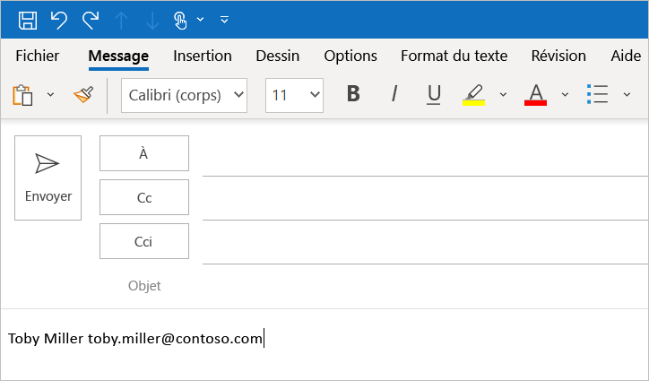

# <a name="use-the-yeoman-generator-to-create-an-office-add-in-that-uses-single-sign-on"></a>Utiliser le générateur Yeoman pour créer un complément Office qui utilise la connexion unique

Dans cet article, vous allez découvrir le processus d’utilisation du générateur Yeoman pour créer un complément Office pour Excel, Outlook, Word ou PowerPoint qui utilise l’authentification unique (SSO) lorsque c’est possible, et utilise une autre méthode d’authentification utilisateur lorsque l’authentification unique n’est pas prise en charge.

> [!TIP]
> Avant d'essayer de terminer ce démarrage rapide, consultez la section [Activer l'authentification unique pour les compléments Office](../develop/sso-in-office-add-ins.md) pour apprendre les concepts de base de l'authentification unique dans les compléments Office.

Le générateur Yeoman simplifie le processus de création d’un complément d’authentification unique en automatisant les étapes nécessaires pour configurer l’authentification unique dans Azure et la génération du code nécessaire pour qu’un complément utilise l’authentification unique. Si vous souhaitez avoir une description détaillée de la procédure à suivre pour effectuer manuellement les étapes que le générateur Yeoman automatise, veuillez consulter le didacticiel [Créer un complément Office Node.js qui utilise l’authentification unique](../develop/create-sso-office-add-ins-nodejs.md).

## <a name="prerequisites"></a>Conditions préalables

- [Node.js](https://nodejs.org) (la dernière version [LTS](https://nodejs.org/about/releases))

- La dernière version de[Yeoman](https://github.com/yeoman/yo) et du [Générateur Yeoman Générateur de compléments Office](https://github.com/OfficeDev/generator-office). Pour installer ces outils globalement, exécutez la commande suivante via l’invite de commande.

    ```command&nbsp;line
    npm install -g yo generator-office
    ```

    [!include[note to update Yeoman generator](../includes/note-yeoman-generator-update.md)]

- Si vous utilisez un Mac et que l'interface de ligne de commande (CLI) Azure n’est pas installée sur votre ordinateur, vous devez installer [Homebrew](https://brew.sh/). Le script de configuration de l’authentification unique exécuté lors de ce démarrage rapide utilise homebrew pour installer l’interface de ligne de commande Azure, puis utilise la CLI pour configurer l’authentification unique dans Azure.

## <a name="create-the-add-in-project"></a>Création du projet de complément

> [!TIP]
> Le générateur Yeoman peut créer un complément Office avec authentification unique pour Excel, Outlook, Word ou PowerPoint, et peut être créé avec des scripts de type JavaScript ou TypeScript. Les instructions suivantes indiquent `JavaScript` et `Excel`, mais vous devez choisir le type de script et l’application client Office les mieux adaptées à votre scénario.

[!include[Yeoman generator create project guidance](../includes/yo-office-command-guidance.md)]

- **Sélectionnez un type de projet :** `Office Add-in Task Pane project supporting single sign-on`
- **Sélectionnez un type de script :** `Javascript`
- **Comment souhaitez-vous nommer votre complément ?** `My SSO Office Add-in`
- **Quelle application client Office voulez-vous prendre en charge ?** `Excel`


Après avoir exécuté l’assistant, le générateur crée le projet et installe les composants Node de prise en charge.

[!include[Yeoman generator next steps](../includes/yo-office-next-steps.md)]

## <a name="explore-the-project"></a>Explorer le projet

Le projet de complément que vous avez créé à l’aide du générateur Yeoman contient un code pour un complément de volet Office avec authentification unique.

[!include[project structure for an SSO-enabled add-in created with the Yeoman generator](../includes/sso-yeoman-project-structure.md)]

## <a name="configure-sso"></a>Configurer l’authentification unique

À ce stade, votre projet de complément a été créé et contient le code nécessaire pour simplifier le processus d’authentification unique. Ensuite, procédez comme suit pour configurer l’authentification unique pour votre complément.

1. Accédez au dossier racine du projet.

    ```command&nbsp;line
    cd "My SSO Office Add-in"
    ```

2. Exécutez la commande suivante pour configurer l’authentification unique pour le complément.

    ```command&nbsp;line
    npm run configure-sso
    ```

    > [!WARNING]
    > Cette commande échouera si votre locataire est configuré pour nécessiter une authentification à deux facteurs. Dans ce scénario, vous devez effectuer manuellement les étapes d’inscription et de configuration de l’authentification unique de l’application Azure, comme décrit dans le didacticiel [Créer un complément Office Node.js qui utilise l’authentification unique](../develop/create-sso-office-add-ins-nodejs.md).

3. Une fenêtre de navigateur web s’ouvre et vous invite à vous connecter à Azure. Connectez-vous à Azure à l’aide de vos informations d’identification d’administrateur Microsoft 365. Ces informations d’identification sont utilisées pour inscrire une nouvelle application dans Azure et configurer les paramètres requis par l’authentification unique.

    > [!NOTE]
    > Si vous vous connectez à Azure à l’aide d’informations d’identification non-administrateur au cours de cette étape, le script `configure-sso` ne peut pas fournir d’accord d’administrateur pour le complément aux utilisateurs au sein de votre organisation. Par conséquent, l’authentification unique ne sera pas disponible pour les utilisateurs du complément. vous serez invité à vous connecter.

4. Une fois vos informations d'identification saisies, fermez la fenêtre du navigateur et revenez à l'invite de commande. Au fur et à mesure du processus de configuration de l’authentification unique, les messages d’État s’affichent sur la console. Comme décrit dans la section messages de la console, les fichiers du projet de complément que le générateur Yeoman a créé sont automatiquement mis à jour avec les données requises par le processus d’authentification unique.

## <a name="try-it-out"></a>Try it out

Si vous avez créé un complément Excel, Word ou PowerPoint, suivez les étapes décrites dans la section suivante pour le tester. Si vous avez créé un complément Outlook, suivez les étapes décrites dans la section [d'Outlook](#outlook) à la place.

### <a name="excel-word-and-powerpoint"></a>Excel, Word et PowerPoint

Pour tester un complément Excel, Word ou PowerPoint, procédez comme suit.

1. Une fois le processus de configuration de l’authentification unique terminé, exécutez la commande suivante pour créer le projet, démarrez le serveur web local et mettez votre complément en sideload dans l’application client Office précédemment sélectionnée.

    > [!NOTE]
    > Les compléments Office doivent utiliser le protocole HTTPS, et non HTTP, même lorsque vous développez. Si vous êtes invité à installer un certificat après avoir exécuté la commande suivante, acceptez d’installer le certificat fourni par le générateur Yeoman.

    ```command&nbsp;line
    npm start
    ```

2. Dans l’application client Office qui s’ouvre lorsque vous exécutez la commande précédente (par exemple, Excel, Word ou PowerPoint), assurez-vous que vous êtes connecté avec un utilisateur membre de la même organisation Microsoft 365 que le compte d’administrateur Microsoft 365 que vous avez utilisé pour vous connecter à Azure lors de la configuration de l’authentification unique à l’étape 3 de la [section précédente](#configure-sso). Cette opération permet d’établir les conditions appropriées pour la réussite de l’authentification unique.

3. Dans l’application client Office, sélectionnez l’onglet **Accueil**, puis choisissez le bouton **Afficher le volet Office** du ruban pour ouvrir le volet Office du complément. L’image ci-après illustre ce bouton dans Excel.

    

4. Au bas du volet des tâches, sélectionnez le bouton **Obtenir mes informations de profil utilisateur** pour lancer le processus d’authentification unique.

5. Si une boîte de dialogue s’affiche pour demander des autorisations pour le compte du complément, cela signifie que l’authentification unique n’est pas prise en charge pour votre scénario et que le complément est plutôt repassé à une autre méthode d’authentification des utilisateurs. Cela peut se produire lorsque l’administrateur client n’a pas accordé le consentement du complément pour accéder à Microsoft Graph, ou lorsque l’utilisateur n’est pas connecté à Office à l’aide d’un compte Microsoft valide ou d’un compte Microsoft 365 (professionnel ou scolaire). Sélectionnez le bouton **Accepter** dans la fenêtre de boîte de dialogue pour continuer.

    

    > [!NOTE]
    > Une fois qu’un utilisateur a accepté cette demande d’autorisation, il n’est plus invité à le faire à l’avenir.

6. Le complément récupère les informations de profil de l’utilisateur connecté et écrit celui-ci dans le document. L’image suivante montre un exemple d’informations de profil écrites dans une feuille de calcul Excel.

    

### <a name="outlook"></a>Outlook

Pour tester un complément Outlook, procédez comme suit.

1. Une fois le processus de configuration de l’authentification unique terminé, exécutez la commande suivante pour créer le projet et démarrer le serveur web local.

    > [!NOTE]
    > Les compléments Office doivent utiliser le protocole HTTPS, et non HTTP, même lorsque vous développez. Si vous êtes invité à installer un certificat après avoir exécuté la commande suivante, acceptez d’installer le certificat fourni par le générateur Yeoman. Il se peut également que vous deviez exécuter votre invite de commande ou votre terminal en tant qu'administrateur pour que les modifications soient effectuées.

    ```command&nbsp;line
    npm start
    ```

2. Suivez les instructions indiquées dans l’article [Chargement de version test des compléments Outlook](../outlook/sideload-outlook-add-ins-for-testing.md) pour charger le complément dans Outlook. Assurez-vous d’être connecté à Outlook avec un utilisateur membre de la même organisation Microsoft 365 que le compte d’administrateur Microsoft 365 que vous avez utilisé pour vous connecter à Azure lors de la configuration de l’authentification unique à l’étape 3 de la [section précédente](#configure-sso). Cette opération permet d’établir les conditions appropriées pour la réussite de l’authentification unique.

3. Rédigez un nouveau message dans Outlook.

4. Dans la fenêtre de composition du message, choisissez le bouton **Afficher le volet Office** du ruban pour ouvrir le volet du complément.

    

5. Au bas du volet des tâches, sélectionnez le bouton **Obtenir mes informations de profil utilisateur** pour lancer le processus d’authentification unique.

6. Si une boîte de dialogue s’affiche pour demander des autorisations pour le compte du complément, cela signifie que l’authentification unique n’est pas prise en charge pour votre scénario et que le complément est plutôt repassé à une autre méthode d’authentification des utilisateurs. Cela peut se produire lorsque l’administrateur client n’a pas accordé le consentement du complément pour accéder à Microsoft Graph, ou lorsque l’utilisateur n’est pas connecté à Office à l’aide d’un compte Microsoft valide ou d’un compte Microsoft 365 (professionnel ou scolaire). Sélectionnez le bouton **Accepter** dans la fenêtre de boîte de dialogue pour continuer.

    

    > [!NOTE]
    > Une fois qu’un utilisateur a accepté cette demande d’autorisation, il n’est plus invité à le faire à l’avenir.

7. Le complément récupère les informations du profil de l’utilisateur connecté et les écrit dans le corps de l'e-mail.

    

## <a name="next-steps"></a>Étapes suivantes

Félicitations, vous avez créé un complément de volet Office qui utilise l’authentification unique lorsque c’est possible, et utilise une autre méthode d’authentification utilisateur lorsque l’authentification unique n’est pas prise en charge. Pour en savoir plus sur la personnalisation de votre complément afin d’ajouter une nouvelle fonctionnalité qui requiert des autorisations différentes, voir [Personnaliser votre complément compatible avec l’authentification unique Node.js](sso-quickstart-customize.md).

## <a name="see-also"></a>Voir aussi

- [Activer l’authentification unique pour des compléments Office](../develop/sso-in-office-add-ins.md)
- [Personnaliser votre complément compatible avec l’authentification unique Node.js](sso-quickstart-customize.md)
- [Créer un complément Office Node.js qui utilise l’authentification unique](../develop/create-sso-office-add-ins-nodejs.md)
- [Résolution des problèmes de messages d’erreur pour l’authentification unique (SSO)](../develop/troubleshoot-sso-in-office-add-ins.md)