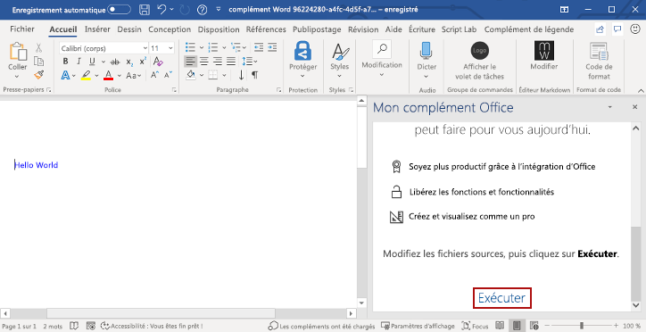
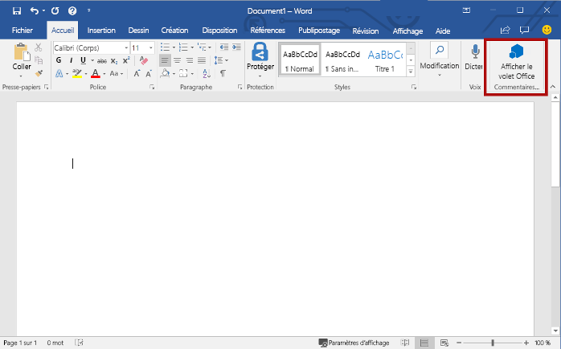
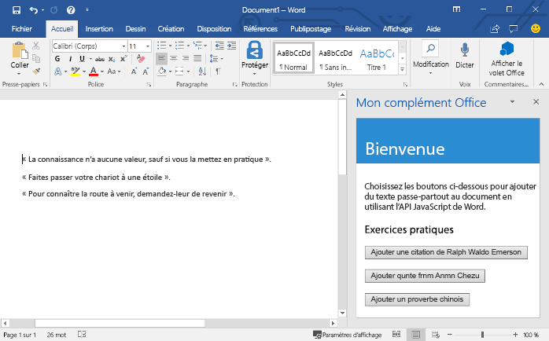

# <a name="build-your-first-word-task-pane-add-in"></a>Créer votre premier complément du volet des tâches de Word

_S’applique à : Word 2016 ou version ultérieure sur Windows, et Word sur iPad et Mac_

Cet article décrit comment créer un complément du volet des tâches de Word.

## <a name="create-the-add-in"></a>Créer le complément

[!include[Choose your editor](../includes/quickstart-choose-editor.md)]

# <a name="yeoman-generator"></a>[Générateur Yeoman](#tab/yeomangenerator)

[!include[Redirect to the single sign-on (SSO) quick start](../includes/sso-quickstart-reference.md)]

### <a name="prerequisites"></a>Conditions préalables

[!include[Yeoman generator prerequisites](../includes/quickstart-yo-prerequisites.md)]

### <a name="create-the-add-in-project"></a>Création du projet de complément

[!include[Yeoman generator create project guidance](../includes/yo-office-command-guidance.md)]

- **Sélectionnez un type de projet :** `Office Add-in Task Pane project`
- **Sélectionnez un type de script :** `Javascript`
- **Comment souhaitez-vous nommer votre complément ?** `My Office Add-in`
- **Quelle application client Office voulez-vous prendre en charge ?** `Word`


Après avoir exécuté l’assistant, le générateur crée le projet et installe les composants Node de prise en charge.

[!include[Yeoman generator next steps](../includes/yo-office-next-steps.md)]

### <a name="explore-the-project"></a>Explorer le projet

[!include[Yeoman generator add-in project components](../includes/yo-task-pane-project-components-js.md)]

### <a name="try-it-out"></a>Essayez

1. Accédez au dossier racine du projet.

    ```command&nbsp;line
    cd "My Office Add-in"
    ```

2. Pour démarrer le serveur web local et charger indépendamment votre complément, procédez comme suit.

    > [!NOTE]
    > Les compléments Office doivent utiliser le protocole HTTPS, et non HTTP, même lorsque vous développez. Si vous êtes invité à installer un certificat après avoir exécuté une des commandes suivantes, acceptez d’installer le certificat fourni par le générateur Yeoman.

    > [!TIP]
    > Si vous testez votre complément sur Mac, exécutez la commande suivante avant de continuer. Lorsque vous exécutez cette commande, le serveur web local démarre.
    >
    > ```command&nbsp;line
    > npm run dev-server
    > ```

    - Pour tester votre complément dans Word, exécutez la commande suivante dans le répertoire racine de votre projet. Cela a pour effet de démarrer le serveur web local (s’il n’est pas déjà en cours d’exécution) et d’ouvrir Word avec votre complément chargé.

        ```command&nbsp;line
        npm start
        ```

    - Pour tester votre complément dans Word sur un navigateur, exécutez la commande suivante dans le répertoire racine de votre projet. Lorsque vous exécutez cette commande, le serveur web local démarre (s’il n’est pas déjà en cours d’exécution).

        ```command&nbsp;line
        npm run start:web
        ```

        Pour utiliser votre complément, ouvrez un nouveau document dans Word sur le web, puis chargez la version test de votre complément en suivant les instructions de l’article relatif au [chargement de version test des compléments Office dans Office sur le web](../testing/sideload-office-add-ins-for-testing.md#sideload-an-office-add-in-in-office-on-the-web).

3. Dans Word, ouvrez un nouveau document, sélectionnez l’onglet **Accueil**, puis choisissez le bouton **Afficher le volet des tâches** du ruban pour ouvrir le volet des tâches du complément.

    

4. En bas du volet Office, sélectionnez le lien **Exécuter** pour ajouter le texte en police de couleur bleue « Hello World » au document.

    

### <a name="next-steps"></a>Étapes suivantes

Félicitations, vous avez créé un complément du volet des tâches de Word ! Maintenant, découvrez les fonctionnalités d’un complément Word et créez un complément plus complexe en suivant le [didacticiel dédié](../tutorials/word-tutorial.md).

# <a name="visual-studio"></a>[Visual Studio](#tab/visualstudio)

### <a name="prerequisites"></a>Conditions préalables

[!include[Quick Start prerequisites](../includes/quickstart-vs-prerequisites.md)]

### <a name="create-the-add-in-project"></a>Création du projet de complément


1. Dans Visual Studio, choisissez **Créer un nouveau projet**.

2. À l’aide de la zone de recherche, entrez **complément**. Choisissez **Complément web Word**, puis sélectionnez **Suivant**.

3. Nommez votre projet et sélectionnez **Créer**.

4. Visual Studio crée une solution et ses deux projets apparaissent dans l’**explorateur de solutions**. Le fichier **Home.html** s’ouvre dans Visual Studio.

### <a name="explore-the-visual-studio-solution"></a>Explorer la solution Visual Studio

[!include[Description of Visual Studio projects](../includes/quickstart-vs-solution.md)]

### <a name="update-the-code"></a>Mise à jour du code

1. **Home.html** spécifie le code HTML qui s’affichera dans le volet Office du complément. Dans **Home.html**, remplacez l’élément `<body>` par le balisage suivant et enregistrez le fichier.

    ```html
    <body>
        <div id="content-header">
            <div class="padding">
                <h1>Welcome</h1>
            </div>
        </div>
        <div id="content-main">
            <div class="padding">
                <p>Choose the buttons below to add boilerplate text to the document by using the Word JavaScript API.</p>
                <br />
                <h3>Try it out</h3>
                <button id="emerson">Add quote from Ralph Waldo Emerson</button>
                <br /><br />
                <button id="checkhov">Add quote from Anton Chekhov</button>
                <br /><br />
                <button id="proverb">Add Chinese proverb</button>
            </div>
        </div>
        <br />
        <div id="supportedVersion"/>
    </body>
    ```

2. Ouvrez le fichier **Home.js** à la racine du projet d’application web. Ce fichier spécifie le script pour le complément. Remplacez tout le contenu par le code suivant, puis enregistrez le fichier.

    ```js
    'use strict';

    (function () {

        Office.onReady(function() {
            // Office is ready
            $(document).ready(function () {
                // The document is ready
                // Use this to check whether the API is supported in the Word client.
                if (Office.context.requirements.isSetSupported('WordApi', '1.1')) {
                    // Do something that is only available via the new APIs
                    $('#emerson').click(insertEmersonQuoteAtSelection);
                    $('#checkhov').click(insertChekhovQuoteAtTheBeginning);
                    $('#proverb').click(insertChineseProverbAtTheEnd);
                    $('#supportedVersion').html('This code is using Word 2016 or later.');
                }
                else {
                    // Just letting you know that this code will not work with your version of Word.
                    $('#supportedVersion').html('This code requires Word 2016 or later.');
                }
            });
        });

        function insertEmersonQuoteAtSelection() {
            Word.run(function (context) {

                // Create a proxy object for the document.
                var thisDocument = context.document;

                // Queue a command to get the current selection.
                // Create a proxy range object for the selection.
                var range = thisDocument.getSelection();

                // Queue a command to replace the selected text.
                range.insertText('"Hitch your wagon to a star."\n', Word.InsertLocation.replace);

                // Synchronize the document state by executing the queued commands,
                // and return a promise to indicate task completion.
                return context.sync().then(function () {
                    console.log('Added a quote from Ralph Waldo Emerson.');
                });
            })
            .catch(function (error) {
                console.log('Error: ' + JSON.stringify(error));
                if (error instanceof OfficeExtension.Error) {
                    console.log('Debug info: ' + JSON.stringify(error.debugInfo));
                }
            });
        }

        function insertChekhovQuoteAtTheBeginning() {
            Word.run(function (context) {

                // Create a proxy object for the document body.
                var body = context.document.body;

                // Queue a command to insert text at the start of the document body.
                body.insertText('"Knowledge is of no value unless you put it into practice."\n', Word.InsertLocation.start);

                // Synchronize the document state by executing the queued commands,
                // and return a promise to indicate task completion.
                return context.sync().then(function () {
                    console.log('Added a quote from Anton Chekhov.');
                });
            })
            .catch(function (error) {
                console.log('Error: ' + JSON.stringify(error));
                if (error instanceof OfficeExtension.Error) {
                    console.log('Debug info: ' + JSON.stringify(error.debugInfo));
                }
            });
        }

        function insertChineseProverbAtTheEnd() {
            Word.run(function (context) {

                // Create a proxy object for the document body.
                var body = context.document.body;

                // Queue a command to insert text at the end of the document body.
                body.insertText('"To know the road ahead, ask those coming back."\n', Word.InsertLocation.end);

                // Synchronize the document state by executing the queued commands,
                // and return a promise to indicate task completion.
                return context.sync().then(function () {
                    console.log('Added a quote from a Chinese proverb.');
                });
            })
            .catch(function (error) {
                console.log('Error: ' + JSON.stringify(error));
                if (error instanceof OfficeExtension.Error) {
                    console.log('Debug info: ' + JSON.stringify(error.debugInfo));
                }
            });
        }
    })();
    ```

3. Ouvrez le fichier **Home.css** à la racine du projet d’application web. Ce fichier spécifie les styles personnalisés pour le complément. Remplacez tout le contenu par le code suivant, puis enregistrez le fichier.

    ```css
    #content-header {
        background: #2a8dd4;
        color: #fff;
        position: absolute;
        top: 0;
        left: 0;
        width: 100%;
        height: 80px; 
        overflow: hidden;
    }

    #content-main {
        background: #fff;
        position: fixed;
        top: 80px;
        left: 0;
        right: 0;
        bottom: 0;
        overflow: auto;
    }

    .padding {
        padding: 15px;
    }
    ```

### <a name="update-the-manifest"></a>Mise à jour du manifeste

1. Ouvrez le fichier manifeste XML dans le projet de complément. Ce fichier définit les paramètres et les fonctionnalités du complément.

2. L’élément `ProviderName` possède une valeur d’espace réservé. Remplacez-le par votre nom.

3. L’attribut `DefaultValue` de l’élément `DisplayName` possède un espace réservé. Remplacez-le par **My Office Add-in**.

4. L’attribut `DefaultValue` de l’élément `Description` possède un espace réservé. Remplacez-le par **A task pane add-in for Word**.

5. Enregistrez le fichier.

    ```xml
    ...
    <ProviderName>John Doe</ProviderName>
    <DefaultLocale>en-US</DefaultLocale>
    <!-- The display name of your add-in. Used on the store and various places of the Office UI such as the add-ins dialog. -->
    <DisplayName DefaultValue="My Office Add-in" />
    <Description DefaultValue="A task pane add-in for Word"/>
    ...
    ```

### <a name="try-it-out"></a>Essayez

1. À l’aide de Visual Studio, testez le nouveau complément en appuyant sur **F5** ou en choisissant le bouton**Démarrer** pour lancer Word avec le bouton du complément **Show Taskpane **(Afficher le volet Office) qui apparaît dans le ruban. Le complément sera hébergé localement sur IIS.

2. Dans Word, sélectionnez l’onglet **Accueil**, puis choisissez le bouton **Afficher le volet Office** du ruban pour ouvrir le volet Office du complément. (Si vous utilisez la version d’Office en achat définitif au lieu de la version d’Office 365, les boutons personnalisés ne sont pas pris en charge. Le volet Office s’ouvre immédiatement.)

    

3. Dans le volet Office, choisissez l’un des boutons pour ajouter du texte réutilisable dans le document.

    

[!include[Console tool note](../includes/console-tool-note.md)]

### <a name="next-steps"></a>Étapes suivantes

Félicitations, vous avez créé un complément du volet des tâches de Word ! Ensuite, en savoir plus sur la [création de compléments avec Visual Studio](../develop/develop-add-ins-visual-studio.md).

---

## <a name="see-also"></a>Voir aussi

* [Vue d’ensemble de la plateforme des compléments Office](../overview/office-add-ins.md)
* [Création de compléments Office](../overview/office-add-ins-fundamentals.md)
* [Développement de compléments Office](../develop/develop-overview.md)
* [Présentation des compléments Word](../word/word-add-ins-programming-overview.md)
* [Exemples de code pour les compléments Word](https://developer.microsoft.com/en-us/office/gallery/?filterBy=Samples,Word)
* [Référence d’API JavaScript pour Word](../reference/overview/word-add-ins-reference-overview.md)
