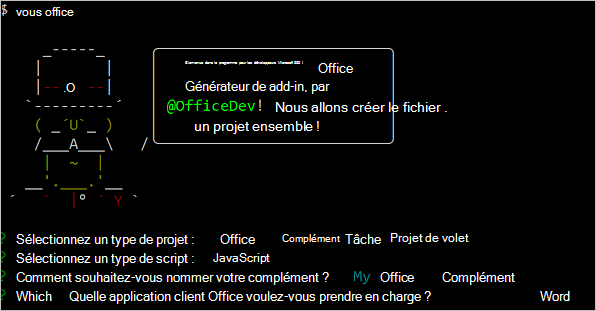

# <a name="build-your-first-word-task-pane-add-in"></a><span data-ttu-id="cb3bf-102">Créer votre premier complément du volet des tâches de Word</span><span class="sxs-lookup"><span data-stu-id="cb3bf-102">Build your first Word task pane add-in</span></span>

<span data-ttu-id="cb3bf-103">_S’applique à : Word 2016 ou version ultérieure sur Windows, et Word sur iPad et Mac_</span><span class="sxs-lookup"><span data-stu-id="cb3bf-103">_Applies to: Word 2016 or later on Windows, Word for iPad, Word for Mac_</span></span>

<span data-ttu-id="cb3bf-104">Cet article décrit comment créer un complément du volet des tâches de Word.</span><span class="sxs-lookup"><span data-stu-id="cb3bf-104">In this article, you'll walk through the process of building a Word task pane add-in.</span></span>

## <a name="create-the-add-in"></a><span data-ttu-id="cb3bf-105">Créer le complément</span><span class="sxs-lookup"><span data-stu-id="cb3bf-105">Create the add-in</span></span>

[!include[Choose your editor](../includes/quickstart-choose-editor.md)]

# <a name="visual-studiotabvisual-studio"></a>[<span data-ttu-id="cb3bf-106">Visual Studio</span><span class="sxs-lookup"><span data-stu-id="cb3bf-106">Visual Studio</span></span>](#tab/visual-studio)

### <a name="prerequisites"></a><span data-ttu-id="cb3bf-107">Conditions préalables</span><span class="sxs-lookup"><span data-stu-id="cb3bf-107">Prerequisites</span></span>

[!include[Quick Start prerequisites](../includes/quickstart-vs-prerequisites.md)]

### <a name="create-the-add-in-project"></a><span data-ttu-id="cb3bf-108">Création du projet de complément</span><span class="sxs-lookup"><span data-stu-id="cb3bf-108">Create the add-in project</span></span>

1. <span data-ttu-id="cb3bf-109">Dans la barre de menu de Visual Studio, choisissez successivement **Fichier** > **Nouveau** > **Projet**.</span><span class="sxs-lookup"><span data-stu-id="cb3bf-109">On the Visual Studio menu bar, choose  **File** > **New** > **Project**.</span></span>

2. <span data-ttu-id="cb3bf-110">Dans la liste des types de projets, sous **Visual C#** ou **Visual Basic**, développez **Office/SharePoint**, choisissez **Compléments**, puis **Complément Word Web** pour le type de projet.</span><span class="sxs-lookup"><span data-stu-id="cb3bf-110">In the list of project types under **Visual C#** or **Visual Basic**, expand  **Office/SharePoint**, choose **Add-ins**, and then choose **Word Web Add-in** as the project type.</span></span> 

3. <span data-ttu-id="cb3bf-111">Nommez le projet, puis cliquez sur **OK**.</span><span class="sxs-lookup"><span data-stu-id="cb3bf-111">Name the project, and then choose **OK**.</span></span>

4. <span data-ttu-id="cb3bf-p101">Visual Studio crée une solution et ses deux projets apparaissent dans l’**explorateur de solutions**. Le fichier **Home.html** s’ouvre dans Visual Studio.</span><span class="sxs-lookup"><span data-stu-id="cb3bf-p101">Visual Studio creates a solution and its two projects appear in **Solution Explorer**. The **Home.html** file opens in Visual Studio.</span></span>

### <a name="explore-the-visual-studio-solution"></a><span data-ttu-id="cb3bf-114">Explorer la solution Visual Studio</span><span class="sxs-lookup"><span data-stu-id="cb3bf-114">Explore the Visual Studio solution</span></span>

[!include[Description of Visual Studio projects](../includes/quickstart-vs-solution.md)]

### <a name="update-the-code"></a><span data-ttu-id="cb3bf-115">Mise à jour du code</span><span class="sxs-lookup"><span data-stu-id="cb3bf-115">Update the code</span></span>

1. <span data-ttu-id="cb3bf-p102">**Home.html** spécifie le code HTML qui s’affichera dans le volet Office du complément. Dans **Home.html**, remplacez l’élément `<body>` par le balisage suivant et enregistrez le fichier.</span><span class="sxs-lookup"><span data-stu-id="cb3bf-p102">**Home.html** specifies the HTML that will be rendered in the add-in's task pane. In **Home.html**, replace the `<body>` element with the following markup and save the file.</span></span>

    ```html
    <body>
        <div id="content-header">
            <div class="padding">
                <h1>Welcome</h1>
            </div>
        </div>
        <div id="content-main">
            <div class="padding">
                <p>Choose the buttons below to add boilerplate text to the document by using the Word JavaScript API.</p>
                <br />
                <h3>Try it out</h3>
                <button id="emerson">Add quote from Ralph Waldo Emerson</button>
                <br /><br />
                <button id="checkhov">Add quote from Anton Chekhov</button>
                <br /><br />
                <button id="proverb">Add Chinese proverb</button>
            </div>
        </div>
        <br />
        <div id="supportedVersion"/>
    </body>
    ```

2. <span data-ttu-id="cb3bf-p103">Ouvrez le fichier **Home.js** à la racine du projet d’application web. Ce fichier spécifie le script pour le complément. Remplacez tout le contenu par le code suivant, puis enregistrez le fichier.</span><span class="sxs-lookup"><span data-stu-id="cb3bf-p103">Open the file **Home.js** in the root of the web application project. This file specifies the script for the add-in. Replace the entire contents with the following code and save the file.</span></span>

    ```js
    'use strict';

    (function () {

        Office.onReady(function() {
            // Office is ready
            $(document).ready(function () {
                // The document is ready
                // Use this to check whether the API is supported in the Word client.
                if (Office.context.requirements.isSetSupported('WordApi', 1.1)) {
                    // Do something that is only available via the new APIs
                    $('#emerson').click(insertEmersonQuoteAtSelection);
                    $('#checkhov').click(insertChekhovQuoteAtTheBeginning);
                    $('#proverb').click(insertChineseProverbAtTheEnd);
                    $('#supportedVersion').html('This code is using Word 2016 or later.');
                }
                else {
                    // Just letting you know that this code will not work with your version of Word.
                    $('#supportedVersion').html('This code requires Word 2016 or later.');
                }
            });
        });

        function insertEmersonQuoteAtSelection() {
            Word.run(function (context) {

                // Create a proxy object for the document.
                var thisDocument = context.document;

                // Queue a command to get the current selection.
                // Create a proxy range object for the selection.
                var range = thisDocument.getSelection();

                // Queue a command to replace the selected text.
                range.insertText('"Hitch your wagon to a star."\n', Word.InsertLocation.replace);

                // Synchronize the document state by executing the queued commands,
                // and return a promise to indicate task completion.
                return context.sync().then(function () {
                    console.log('Added a quote from Ralph Waldo Emerson.');
                });
            })
            .catch(function (error) {
                console.log('Error: ' + JSON.stringify(error));
                if (error instanceof OfficeExtension.Error) {
                    console.log('Debug info: ' + JSON.stringify(error.debugInfo));
                }
            });
        }

        function insertChekhovQuoteAtTheBeginning() {
            Word.run(function (context) {

                // Create a proxy object for the document body.
                var body = context.document.body;

                // Queue a command to insert text at the start of the document body.
                body.insertText('"Knowledge is of no value unless you put it into practice."\n', Word.InsertLocation.start);

                // Synchronize the document state by executing the queued commands,
                // and return a promise to indicate task completion.
                return context.sync().then(function () {
                    console.log('Added a quote from Anton Chekhov.');
                });
            })
            .catch(function (error) {
                console.log('Error: ' + JSON.stringify(error));
                if (error instanceof OfficeExtension.Error) {
                    console.log('Debug info: ' + JSON.stringify(error.debugInfo));
                }
            });
        }

        function insertChineseProverbAtTheEnd() {
            Word.run(function (context) {

                // Create a proxy object for the document body.
                var body = context.document.body;

                // Queue a command to insert text at the end of the document body.
                body.insertText('"To know the road ahead, ask those coming back."\n', Word.InsertLocation.end);

                // Synchronize the document state by executing the queued commands,
                // and return a promise to indicate task completion.
                return context.sync().then(function () {
                    console.log('Added a quote from a Chinese proverb.');
                });
            })
            .catch(function (error) {
                console.log('Error: ' + JSON.stringify(error));
                if (error instanceof OfficeExtension.Error) {
                    console.log('Debug info: ' + JSON.stringify(error.debugInfo));
                }
            });
        }
    })();
    ```

3. <span data-ttu-id="cb3bf-p104">Ouvrez le fichier **Home.css** à la racine du projet d’application web. Ce fichier spécifie les styles personnalisés pour le complément. Remplacez tout le contenu par le code suivant, puis enregistrez le fichier.</span><span class="sxs-lookup"><span data-stu-id="cb3bf-p104">Open the file **Home.css** in the root of the web application project. This file specifies the custom styles for the add-in. Replace the entire contents with the following code and save the file.</span></span>

    ```css
    #content-header {
        background: #2a8dd4;
        color: #fff;
        position: absolute;
        top: 0;
        left: 0;
        width: 100%;
        height: 80px; 
        overflow: hidden;
    }

    #content-main {
        background: #fff;
        position: fixed;
        top: 80px;
        left: 0;
        right: 0;
        bottom: 0;
        overflow: auto;
    }

    .padding {
        padding: 15px;
    }
    ```

### <a name="update-the-manifest"></a><span data-ttu-id="cb3bf-124">Mise à jour du manifeste</span><span class="sxs-lookup"><span data-stu-id="cb3bf-124">Update the manifest</span></span>

1. <span data-ttu-id="cb3bf-125">Ouvrez le fichier manifeste XML dans le projet de complément.</span><span class="sxs-lookup"><span data-stu-id="cb3bf-125">Open the XML manifest file in the add-in project.</span></span> <span data-ttu-id="cb3bf-126">Ce fichier définit les paramètres et les fonctionnalités du complément.</span><span class="sxs-lookup"><span data-stu-id="cb3bf-126">This file defines the add-in's settings and capabilities.</span></span>

2. <span data-ttu-id="cb3bf-p106">L’élément `ProviderName` possède une valeur d’espace réservé. Remplacez-le par votre nom.</span><span class="sxs-lookup"><span data-stu-id="cb3bf-p106">The `ProviderName` element has a placeholder value. Replace it with your name.</span></span>

3. <span data-ttu-id="cb3bf-p107">L’attribut `DefaultValue` de l’élément `DisplayName` possède un espace réservé. Remplacez-le par **My Office Add-in**.</span><span class="sxs-lookup"><span data-stu-id="cb3bf-p107">The `DefaultValue` attribute of the `DisplayName` element has a placeholder. Replace it with **My Office Add-in**.</span></span>

4. <span data-ttu-id="cb3bf-p108">L’attribut `DefaultValue` de l’élément `Description` possède un espace réservé. Remplacez-le par **A task pane add-in for Word**.</span><span class="sxs-lookup"><span data-stu-id="cb3bf-p108">The `DefaultValue` attribute of the `Description` element has a placeholder. Replace it with **A task pane add-in for Word**.</span></span>

5. <span data-ttu-id="cb3bf-133">Enregistrez le fichier.</span><span class="sxs-lookup"><span data-stu-id="cb3bf-133">Save the file.</span></span>

    ```xml
    ...
    <ProviderName>John Doe</ProviderName>
    <DefaultLocale>en-US</DefaultLocale>
    <!-- The display name of your add-in. Used on the store and various places of the Office UI such as the add-ins dialog. -->
    <DisplayName DefaultValue="My Office Add-in" />
    <Description DefaultValue="A task pane add-in for Word"/>
    ...
    ```

### <a name="try-it-out"></a><span data-ttu-id="cb3bf-134">Essayez</span><span class="sxs-lookup"><span data-stu-id="cb3bf-134">Try it out</span></span>

1. <span data-ttu-id="cb3bf-p109">À l’aide de Visual Studio, testez le nouveau complément en appuyant sur **F5** ou en choisissant le bouton**Démarrer** pour lancer Word avec le bouton du complément \*\*Show Taskpane \*\*(Afficher le volet Office) qui apparaît dans le ruban. Le complément sera hébergé localement sur IIS.</span><span class="sxs-lookup"><span data-stu-id="cb3bf-p109">Using Visual Studio, test the newly created Word add-in by pressing **F5** or choosing the **Start** button to launch Word with the **Show Taskpane** add-in button displayed in the ribbon. The add-in will be hosted locally on IIS.</span></span>

2. <span data-ttu-id="cb3bf-137">Dans Word, sélectionnez l’onglet **Accueil**, puis choisissez le bouton **Afficher le volet Office** du ruban pour ouvrir le volet Office du complément.</span><span class="sxs-lookup"><span data-stu-id="cb3bf-137">In Word, choose the **Home** tab, and then choose the **Show Taskpane** button in the ribbon to open the add-in task pane.</span></span> <span data-ttu-id="cb3bf-138">(Si vous utilisez la version d’Office en achat définitif au lieu de la version d’Office 365, les boutons personnalisés ne sont pas pris en charge.</span><span class="sxs-lookup"><span data-stu-id="cb3bf-138">(If you are using the one-time purchase version of Office, instead of the Office 365 version, then custom buttons are not supported.</span></span> <span data-ttu-id="cb3bf-139">Le volet Office s’ouvre immédiatement.)</span><span class="sxs-lookup"><span data-stu-id="cb3bf-139">Instead, the task pane will open immediately.)</span></span>

    

3. <span data-ttu-id="cb3bf-141">Dans le volet Office, choisissez l’un des boutons pour ajouter du texte réutilisable dans le document.</span><span class="sxs-lookup"><span data-stu-id="cb3bf-141">In the task pane, choose any of the buttons to add boilerplate text to the document.</span></span>

    

# <a name="any-editortabvisual-studio-code"></a>[<span data-ttu-id="cb3bf-143">Tous les éditeurs</span><span class="sxs-lookup"><span data-stu-id="cb3bf-143">Any editor</span></span>](#tab/visual-studio-code)

### <a name="prerequisites"></a><span data-ttu-id="cb3bf-144">Conditions préalables</span><span class="sxs-lookup"><span data-stu-id="cb3bf-144">Prerequisites</span></span>

[!include[Yeoman generator prerequisites](../includes/quickstart-yo-prerequisites.md)]

### <a name="create-the-add-in-project"></a><span data-ttu-id="cb3bf-145">Création du projet de complément</span><span class="sxs-lookup"><span data-stu-id="cb3bf-145">Create the add-in project</span></span>

1. <span data-ttu-id="cb3bf-146">Utilisez le générateur Yeoman afin de créer un projet de complément Word.</span><span class="sxs-lookup"><span data-stu-id="cb3bf-146">Use the Yeoman generator to create a Word add-in project.</span></span> <span data-ttu-id="cb3bf-147">Exécutez la commande suivante, puis répondez aux invites comme suit :</span><span class="sxs-lookup"><span data-stu-id="cb3bf-147">Run the following command and then answer the prompts as follows:</span></span>

    ```command&nbsp;line
    yo office
    ```

    - <span data-ttu-id="cb3bf-148">**Sélectionnez un type de projet :** `Office Add-in Task Pane project`</span><span class="sxs-lookup"><span data-stu-id="cb3bf-148">**Choose a project type:** `Office Add-in Task Pane project`</span></span>
    - <span data-ttu-id="cb3bf-149">**Sélectionnez un type de script :** `Javascript`</span><span class="sxs-lookup"><span data-stu-id="cb3bf-149">**Choose a script type:** `Javascript`</span></span>
    - <span data-ttu-id="cb3bf-150">**Comment souhaitez-vous nommer votre complément ?**</span><span class="sxs-lookup"><span data-stu-id="cb3bf-150">**What do you want to name your add-in?**</span></span> `My Office Add-in`
    - <span data-ttu-id="cb3bf-151">**Quelle application client Office voulez-vous prendre en charge ?**</span><span class="sxs-lookup"><span data-stu-id="cb3bf-151">**Which Office client application would you like to support?**</span></span> `Word`

    

    <span data-ttu-id="cb3bf-153">Après avoir exécuté l’assistant, le générateur crée le projet et installe les composants de nœud de la prise en charge.</span><span class="sxs-lookup"><span data-stu-id="cb3bf-153">After you complete the wizard, the generator will create the project and install supporting Node components.</span></span>

2. <span data-ttu-id="cb3bf-154">Accédez au dossier racine du projet.</span><span class="sxs-lookup"><span data-stu-id="cb3bf-154">Navigate to the root folder of the project.</span></span>

    ```command&nbsp;line
    cd "My Office Add-in"
    ```

### <a name="explore-the-project"></a><span data-ttu-id="cb3bf-155">Explorer le projet</span><span class="sxs-lookup"><span data-stu-id="cb3bf-155">Explore the project</span></span>

[!include[Yeoman generator add-in project components](../includes/yo-task-pane-project-components-js.md)]

### <a name="try-it-out"></a><span data-ttu-id="cb3bf-156">Essayez</span><span class="sxs-lookup"><span data-stu-id="cb3bf-156">Try it out</span></span>

1. <span data-ttu-id="cb3bf-157">Pour démarrer le serveur web local et charger indépendamment votre complément, procédez comme suit.</span><span class="sxs-lookup"><span data-stu-id="cb3bf-157">Complete the following steps to start the local web server and sideload your add-in.</span></span>

    > [!NOTE]
    > <span data-ttu-id="cb3bf-158">Les compléments Office doivent utiliser le protocole HTTPS, et non HTTP, même lorsque vous développez.</span><span class="sxs-lookup"><span data-stu-id="cb3bf-158">Office Add-ins should use HTTPS, not HTTP, even when you are developing.</span></span> <span data-ttu-id="cb3bf-159">Si vous êtes invité à installer un certificat après avoir exécuté une des commandes suivantes, acceptez d’installer le certificat fourni par le générateur Yeoman.</span><span class="sxs-lookup"><span data-stu-id="cb3bf-159">If you are prompted to install a certificate after you run one of the following commands, accept the prompt to install the certificate that the Yeoman generator provides.</span></span>

    > [!TIP]
    > <span data-ttu-id="cb3bf-160">Si vous testez votre complément sur Mac, exécutez la commande suivante avant de continuer.</span><span class="sxs-lookup"><span data-stu-id="cb3bf-160">If you're testing your add-in on Mac, run the following command before proceeding.</span></span> <span data-ttu-id="cb3bf-161">Lorsque vous exécutez cette commande, le serveur web local démarre.</span><span class="sxs-lookup"><span data-stu-id="cb3bf-161">When you run this command, the local web server will start.</span></span>
    >
    > ```command&nbsp;line
    > npm run dev-server
    > ```

    - <span data-ttu-id="cb3bf-162">Pour tester votre complément dans Word, exécutez la commande suivante dans le répertoire racine de votre projet.</span><span class="sxs-lookup"><span data-stu-id="cb3bf-162">To test your add-in in Word, run the following command in the root directory of your project.</span></span> <span data-ttu-id="cb3bf-163">Lorsque vous exécutez cette commande, le serveur web local démarre (s’il n’est pas déjà en cours d’exécution) et Word s’ouvre avec votre complément chargé.</span><span class="sxs-lookup"><span data-stu-id="cb3bf-163">When you run this command, the local web server will start and Word will open with your add-in loaded.</span></span>

        ```command&nbsp;line
        npm start
        ```

    - <span data-ttu-id="cb3bf-164">Pour tester votre complément dans Word sur un navigateur, exécutez la commande suivante dans le répertoire racine de votre projet.</span><span class="sxs-lookup"><span data-stu-id="cb3bf-164">To test your add-in in Word on a browser, run the following command in the root directory of your project.</span></span> <span data-ttu-id="cb3bf-165">Lorsque vous exécutez cette commande, le serveur web local démarre (s’il n’est pas déjà en cours d’exécution).</span><span class="sxs-lookup"><span data-stu-id="cb3bf-165">When you run this command, the local web server will start.</span></span>

        ```command&nbsp;line
        npm run start:web
        ```

        <span data-ttu-id="cb3bf-166">Pour utiliser votre complément, ouvrez un nouveau document dans Word sur le web, puis chargez la version test de votre complément en suivant les instructions de l’article relatif au [chargement de version test des compléments Office dans Office sur le web](../testing/sideload-office-add-ins-for-testing.md#sideload-an-office-add-in-in-office-on-the-web).</span><span class="sxs-lookup"><span data-stu-id="cb3bf-166">To use your add-in, open a new document in Word Online and then sideload your add-in by following the instructions in [Sideload Office Add-ins in Office Online](../testing/sideload-office-add-ins-for-testing.md#sideload-an-office-add-in-in-office-on-the-web).</span></span>

2. <span data-ttu-id="cb3bf-167">Dans Word, ouvrez un nouveau document, sélectionnez l’onglet **Accueil**, puis choisissez le bouton **Afficher le volet des tâches** du ruban pour ouvrir le volet des tâches du complément.</span><span class="sxs-lookup"><span data-stu-id="cb3bf-167">In Word, open a new document, choose the **Home** tab, and then choose the **Show Taskpane** button in the ribbon to open the add-in task pane.</span></span>

    

3. <span data-ttu-id="cb3bf-169">En bas du volet Office, sélectionnez le lien **Exécuter** pour ajouter le texte en police de couleur bleue « Hello World » au document.</span><span class="sxs-lookup"><span data-stu-id="cb3bf-169">At the bottom of the task pane, choose the **Run** link to add the text "Hello World" to the document in blue font.</span></span>

    

---

## <a name="next-steps"></a><span data-ttu-id="cb3bf-171">Étapes suivantes</span><span class="sxs-lookup"><span data-stu-id="cb3bf-171">Next steps</span></span>

<span data-ttu-id="cb3bf-172">Félicitations, vous avez créé un complément du volet des tâches de Word !</span><span class="sxs-lookup"><span data-stu-id="cb3bf-172">Congratulations, you've successfully created a Word task pane add-in!</span></span> <span data-ttu-id="cb3bf-173">Maintenant, découvrez les fonctionnalités d’un complément Word et créez un complément plus complexe en suivant le didacticiel dédié.</span><span class="sxs-lookup"><span data-stu-id="cb3bf-173">Next, learn more about the capabilities of a Word add-in and build a more complex add-in by following along with the Word add-in tutorial.</span></span>

> [!div class="nextstepaction"]
> [<span data-ttu-id="cb3bf-174">Didacticiel sur les compléments Word</span><span class="sxs-lookup"><span data-stu-id="cb3bf-174">Word add-in tutorial</span></span>](../tutorials/word-tutorial.md)

## <a name="see-also"></a><span data-ttu-id="cb3bf-175">Voir aussi</span><span class="sxs-lookup"><span data-stu-id="cb3bf-175">See also</span></span>

* [<span data-ttu-id="cb3bf-176">Présentation des compléments Word</span><span class="sxs-lookup"><span data-stu-id="cb3bf-176">Word add-ins overview</span></span>](../word/word-add-ins-programming-overview.md)
* <span data-ttu-id="cb3bf-177">
  [Exemples de code pour les compléments Word](https://developer.microsoft.com/fr-FR/office/gallery/?filterBy=Samples,Word)</span><span class="sxs-lookup"><span data-stu-id="cb3bf-177">[Word add-in code samples](https://developer.microsoft.com/en-us/office/gallery/?filterBy=Samples,Word)</span></span>
* [<span data-ttu-id="cb3bf-178">Référence d’API JavaScript pour Word</span><span class="sxs-lookup"><span data-stu-id="cb3bf-178">Word JavaScript API reference</span></span>](/office/dev/add-ins/reference/overview/word-add-ins-reference-overview)
