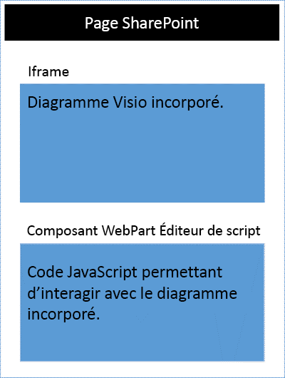
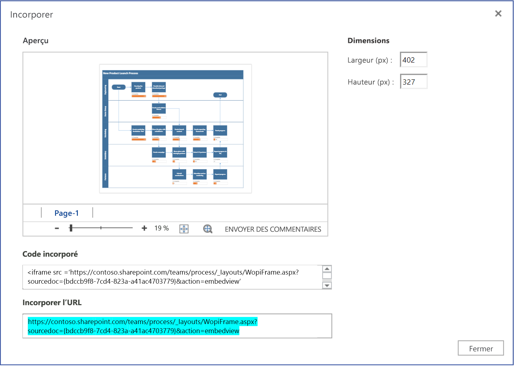

# <a name="visio-javascript-api-overview"></a><span data-ttu-id="0f1cc-102">Présentation des API JavaScript pour Visio</span><span class="sxs-lookup"><span data-stu-id="0f1cc-102">Visio JavaScript API overview</span></span>

<span data-ttu-id="0f1cc-103">Vous pouvez utiliser les interfaces API JavaScript pour Visio pour intégrer des diagrammes Visio dans SharePoint Online.</span><span class="sxs-lookup"><span data-stu-id="0f1cc-103">You can use the Visio JavaScript APIs to embed Visio diagrams in SharePoint Online.</span></span> <span data-ttu-id="0f1cc-104">Les diagrammes Visio incorporés sont stockés dans une bibliothèque de documents SharePoint et sont affichés sur une page SharePoint.</span><span class="sxs-lookup"><span data-stu-id="0f1cc-104">An embedded Visio diagram is a diagram that is stored in a SharePoint document library and displayed on a SharePoint page.</span></span> <span data-ttu-id="0f1cc-105">Pour incorporer un diagramme Visio, affichez-le dans un élément HTML`<iframe>`.</span><span class="sxs-lookup"><span data-stu-id="0f1cc-105">To embed a Visio diagram, display it in an HTML `<iframe>` element.</span></span> <span data-ttu-id="0f1cc-106">Ensuite, vous pouvez utiliser les interfaces API JavaScript pour Visio pour programmer le diagramme incorporé.</span><span class="sxs-lookup"><span data-stu-id="0f1cc-106">Then you can use Visio JavaScript APIs to programmatically work with the embedded diagram.</span></span>




<span data-ttu-id="0f1cc-108">Vous pouvez utiliser les interfaces API JavaScript pour Visio pour :</span><span class="sxs-lookup"><span data-stu-id="0f1cc-108">You can use the Visio JavaScript APIs to:</span></span>

* <span data-ttu-id="0f1cc-109">interagir avec les éléments du diagramme Visio, tels que les pages et les formes ;</span><span class="sxs-lookup"><span data-stu-id="0f1cc-109">Interact with Visio diagram elements like pages and shapes.</span></span>
* <span data-ttu-id="0f1cc-110">créer une marque de révision sur la zone du diagramme Visio ;</span><span class="sxs-lookup"><span data-stu-id="0f1cc-110">Create visual markup on the Visio diagram canvas.</span></span>
* <span data-ttu-id="0f1cc-111">écrire des gestionnaires personnalisés pour les événements de souris dans le dessin ;</span><span class="sxs-lookup"><span data-stu-id="0f1cc-111">Write custom handlers for mouse events within the drawing.</span></span>
* <span data-ttu-id="0f1cc-112">exposer les données du diagramme, tels que le texte de la forme, les données de forme et des liens hypertexte sur votre solution.</span><span class="sxs-lookup"><span data-stu-id="0f1cc-112">Expose diagram data, such as shape text, shape data, and hyperlinks, to your solution.</span></span>

<span data-ttu-id="0f1cc-p102">Cet article décrit comment utiliser les interfaces API JavaScript pour Visio avec Visio Online pour créer des solutions pour SharePoint Online. Il présente des concepts fondamentaux pour l’utilisation des API, notamment concernant les objets **EmbeddedSession**, **RequestContext**, les objets de proxy JavaScript, ainsi que les méthodes **sync()**, **Visio.run()** et **load()**. Les exemples de code vous montrent comment appliquer ces concepts.</span><span class="sxs-lookup"><span data-stu-id="0f1cc-p102">This article describes how to use the Visio JavaScript APIs with Visio Online to build your solutions for SharePoint Online. It introduces key concepts that are fundamental to using the APIs, such as **EmbeddedSession**, **RequestContext**, and JavaScript proxy objects, and the **sync()**, **Visio.run()**, and **load()** methods. The code examples show you how to apply these concepts.</span></span>

## <a name="embeddedsession"></a><span data-ttu-id="0f1cc-116">EmbeddedSession</span><span class="sxs-lookup"><span data-stu-id="0f1cc-116">EmbeddedSession</span></span>

<span data-ttu-id="0f1cc-117">L’objet EmbeddedSession initialise la communication entre le cadre du développeur et le cadre de Visio Online.</span><span class="sxs-lookup"><span data-stu-id="0f1cc-117">The EmbeddedSession object initializes communication between the developer frame and the Visio Online frame.</span></span>

```js
var session = new OfficeExtension.EmbeddedSession(url, { id: "embed-iframe",container: document.getElementById("iframeHost") });
session.init().then(function () {
    window.console.log("Session successfully initialized");
});
```

## <a name="visiorunsession-functioncontext--batch-"></a><span data-ttu-id="0f1cc-118">Visio.run(session, function(context) { batch })</span><span class="sxs-lookup"><span data-stu-id="0f1cc-118">Visio.run(session, function(context) { batch })</span></span>

<span data-ttu-id="0f1cc-119">**Visio.run()** exécute un script de commandes qui effectue des actions sur le modèle objet Visio.</span><span class="sxs-lookup"><span data-stu-id="0f1cc-119">**Visio.run()** executes a batch script that performs actions on the Visio object model.</span></span> <span data-ttu-id="0f1cc-120">Les commandes de traitement par lots incluent les définitions des objets de proxy JavaScript locaux et des méthodes **sync()** qui synchronisent l’état entre les objets locaux et Visio, ainsi que la résolution de la promesse.</span><span class="sxs-lookup"><span data-stu-id="0f1cc-120">The batch commands include definitions of local JavaScript proxy objects and **sync()** methods that synchronize the state between local and Visio objects and promise resolution.</span></span> <span data-ttu-id="0f1cc-121">L’avantage de traiter les demandes par lots avec **Visio.run()** est que, une fois la promesse résolue, tous les objets de page suivis qui ont été alloués lors de l’exécution sont automatiquement publiés.</span><span class="sxs-lookup"><span data-stu-id="0f1cc-121">The advantage of batching requests in **Visio.run()** is that when the promise is resolved, any tracked page objects that were allocated during the execution will be automatically released.</span></span>

<span data-ttu-id="0f1cc-122">La méthode d’exécution utilise les objets session et RequestContext et renvoie une promesse (en général, le résultat de la méthode **context.sync()**).</span><span class="sxs-lookup"><span data-stu-id="0f1cc-122">The run method takes in session and RequestContext object and returns a promise (typically, just the result of **context.sync()**).</span></span> <span data-ttu-id="0f1cc-123">Il est possible d’exécuter l’opération par lots en dehors de la méthode **Visio.run()**.</span><span class="sxs-lookup"><span data-stu-id="0f1cc-123">It is possible to run the batch operation outside of the **Visio.run()**.</span></span> <span data-ttu-id="0f1cc-124">Toutefois, dans ce cas, toutes les références d’objet de page doivent être suivies et gérées manuellement.</span><span class="sxs-lookup"><span data-stu-id="0f1cc-124">However, in such a scenario, any page object references needs to be manually tracked and managed.</span></span>

## <a name="requestcontext"></a><span data-ttu-id="0f1cc-125">RequestContext</span><span class="sxs-lookup"><span data-stu-id="0f1cc-125">RequestContext</span></span>

<span data-ttu-id="0f1cc-126">L’objet RequestContext facilite les demandes auprès de l’application Visio.</span><span class="sxs-lookup"><span data-stu-id="0f1cc-126">The RequestContext object facilitates requests to the Visio application.</span></span> <span data-ttu-id="0f1cc-127">Étant donné que le cadre du développeur et l’application Visio Online s’exécutent dans deux iframes différents, l’objet RequestContext (context dans les exemples suivants) est nécessaire pour accéder à Visio et aux objets associés (par exemple, des pages et des formes) depuis le cadre du développeur.</span><span class="sxs-lookup"><span data-stu-id="0f1cc-127">Because the developer frame and the Visio Online application run in two different iframes, the RequestContext object (context in next example) is required to get access to Visio and related objects such as pages and shapes, from the developer frame.</span></span>

```js
function hideToolbars() {
    Visio.run(session, function(context){
        var app = context.document.application;
        app.showToolbars = false;
        return context.sync().then(function () {
            window.console.log("Toolbars Hidden");
        });
    }).catch(function(error)
    {
        window.console.log("Error: " + error);
    });
};
```

## <a name="proxy-objects"></a><span data-ttu-id="0f1cc-128">Objets de proxy</span><span class="sxs-lookup"><span data-stu-id="0f1cc-128">Proxy objects</span></span>

<span data-ttu-id="0f1cc-p106">Les objets JavaScript pour Visio déclarés et utilisés dans un complément sont des objets de proxy correspondant aux objets réels d’un document Visio. Toutes les actions effectuées sur les objets de proxy ne sont pas réalisées dans Visio et l’état du document Visio n’est pas répercuté sur les objets de proxy tant que cet état n’a pas été synchronisé. L’état de document est synchronisé lors de l’exécution de la méthode `context.sync()`.</span><span class="sxs-lookup"><span data-stu-id="0f1cc-p106">The Visio JavaScript objects declared and used in an add-in are proxy objects for the real objects in a Visio document. All actions taken on proxy objects are not realized in Visio, and the state of the Visio document is not realized in the proxy objects until the document state has been synchronized. The document state is synchronized when `context.sync()` is run.</span></span>

<span data-ttu-id="0f1cc-132">Par exemple, l’objet JavaScript local getActivePage est déclaré pour référencer la page sélectionnée.</span><span class="sxs-lookup"><span data-stu-id="0f1cc-132">For example, the local JavaScript object getActivePage is declared to reference the selected page.</span></span> <span data-ttu-id="0f1cc-133">Cela permet par exemple de mettre en file d’attente la valeur de ses propriétés et méthodes d’appel.</span><span class="sxs-lookup"><span data-stu-id="0f1cc-133">This can be used to queue the setting of its properties and invoking methods.</span></span> <span data-ttu-id="0f1cc-134">Les actions appliquées à ces objets ne sont pas réalisées jusqu’à l’exécution de la méthode **sync()**.</span><span class="sxs-lookup"><span data-stu-id="0f1cc-134">The actions on such objects are not realized until the **sync()** method is run.</span></span>

```js
var activePage = context.document.getActivePage();
```

## <a name="sync"></a><span data-ttu-id="0f1cc-135">Sync()</span><span class="sxs-lookup"><span data-stu-id="0f1cc-135">sync()</span></span>

<span data-ttu-id="0f1cc-136">La méthode **sync()** synchronise l’état des objets de proxy JavaScript et des objets réels de Visio en exécutant les instructions mises en file d’attente sur le contexte et en récupérant les propriétés des objets Office chargés pour les utiliser dans votre code.</span><span class="sxs-lookup"><span data-stu-id="0f1cc-136">The **sync()** method synchronizes the state between JavaScript proxy objects and real objects in Visio by executing instructions queued on the context and retrieving properties of loaded Office objects for use in your code.</span></span> <span data-ttu-id="0f1cc-137">Cette méthode renvoie une promesse, qui est résolue à la fin de la synchronisation.</span><span class="sxs-lookup"><span data-stu-id="0f1cc-137">This method returns a promise, which is resolved when synchronization is complete.</span></span> 

## <a name="load"></a><span data-ttu-id="0f1cc-138">load()</span><span class="sxs-lookup"><span data-stu-id="0f1cc-138">load()</span></span>

<span data-ttu-id="0f1cc-p109">La méthode **load()** permet de remplir les objets de proxy créés dans le calque JavaScript du complément. Lorsque vous essayez de récupérer un objet, comme un document, un objet de proxy local est d’abord créé dans le calque JavaScript. Cet objet peut être utilisé pour mettre en file d’attente la valeur de ses propriétés et méthodes d’appel. Toutefois, pour la lecture des propriétés ou des relations de l’objet, les méthodes **load()** et **sync()** doivent d’abord être appelées. La méthode load() utilise les propriétés et les relations à charger lors de l’appel de la méthode **sync()**.</span><span class="sxs-lookup"><span data-stu-id="0f1cc-p109">The **load()** method is used to fill in the proxy objects created in the add-in JavaScript layer. When trying to retrieve an object such as a document, a local proxy object is created first in the JavaScript layer. Such an object can be used to queue the setting of its properties and invoking methods. However, for reading object properties or relations, the **load()** and **sync()** methods need to be invoked first. The load() method takes in the properties and relations that need to be loaded when the **sync()** method is called.</span></span>

<span data-ttu-id="0f1cc-144">L’exemple suivant montre la syntaxe de la méthode **load()**.</span><span class="sxs-lookup"><span data-stu-id="0f1cc-144">The following shows the syntax for the **load()** method.</span></span>

```js
object.load(string: properties); //or object.load(array: properties); //or object.load({loadOption});
```

1. <span data-ttu-id="0f1cc-145">**properties** est la liste des noms de propriétés à charger, fournis sous forme de chaînes séparées par des virgules ou de tableau de noms.</span><span class="sxs-lookup"><span data-stu-id="0f1cc-145">**properties** is the list of property names to be loaded, specified as comma-delimited strings or array of names.</span></span> <span data-ttu-id="0f1cc-146">Pour plus d’informations, consultez les méthodes **.load()** décrites sous chaque objet.</span><span class="sxs-lookup"><span data-stu-id="0f1cc-146">See **.load()** methods under each object for details.</span></span>

2. <span data-ttu-id="0f1cc-p111">**loadOption** spécifie un objet qui décrit les propriétés select, expand, top et skip. Pour plus d’informations, reportez-vous aux [options](/javascript/api/office/officeextension.loadoption) de chargement d’objet.</span><span class="sxs-lookup"><span data-stu-id="0f1cc-p111">**loadOption** specifies an object that describes the selection, expansion, top, and skip options. See object load [options](/javascript/api/office/officeextension.loadoption) for details.</span></span>

## <a name="example-printing-all-shapes-text-in-active-page"></a><span data-ttu-id="0f1cc-149">Exemple : impression du texte de toutes les formes de la page active</span><span class="sxs-lookup"><span data-stu-id="0f1cc-149">Example: Printing all shapes text in active page</span></span>

<span data-ttu-id="0f1cc-150">L’exemple suivant montre comment imprimer la valeur du texte de la forme d’un objet de formes de tableau.</span><span class="sxs-lookup"><span data-stu-id="0f1cc-150">The following example shows you how to print shape text value from an array shapes object.</span></span>
<span data-ttu-id="0f1cc-151">La méthode **Visio.run()** contient un lot d’instructions.</span><span class="sxs-lookup"><span data-stu-id="0f1cc-151">The **Visio.run()** method contains a batch of instructions.</span></span> <span data-ttu-id="0f1cc-152">Dans le cadre de ce traitement par lots, un objet de proxy faisant référence à des formes est créé dans le document actif.</span><span class="sxs-lookup"><span data-stu-id="0f1cc-152">As part of this batch, a proxy object is created that references shapes on the active document.</span></span>

<span data-ttu-id="0f1cc-153">Toutes ces commandes sont mises en file d’attente et sont exécutées lorsque la méthode **context.sync()** est appelée.</span><span class="sxs-lookup"><span data-stu-id="0f1cc-153">All these commands are queued and run when **context.sync()** is called.</span></span> <span data-ttu-id="0f1cc-154">La méthode **sync()** renvoie une promesse qui peut être utilisée pour y adjoindre d’autres opérations.</span><span class="sxs-lookup"><span data-stu-id="0f1cc-154">The **sync()** method returns a promise that can be used to chain it with other operations.</span></span>

```js
Visio.run(session, function (context) {
    var page = context.document.getActivePage();
    var shapes = page.shapes;
    shapes.load();
    return context.sync().then(function () {
        for(var i=0; i<shapes.items.length;i++) {
            var shape = shapes.items[i];
            window.console.log("Shape Text: " + shape.text );
        }
    });
}).catch(function(error) {
    window.console.log("Error: " + error);
    if (error instanceof OfficeExtension.Error) {
        window.console.log ("Debug info: " + JSON.stringify(error.debugInfo));
    }
});
```

## <a name="error-messages"></a><span data-ttu-id="0f1cc-155">Messages d’erreur</span><span class="sxs-lookup"><span data-stu-id="0f1cc-155">Error messages</span></span>

<span data-ttu-id="0f1cc-p114">Les erreurs sont renvoyées à l’aide d’un objet d’erreur qui se compose d’un code et d’un message. Le tableau suivant fournit la liste des erreurs qui peuvent se produire.</span><span class="sxs-lookup"><span data-stu-id="0f1cc-p114">Errors are returned using an error object that consists of a code and a message. The following table provides a list of possible error conditions that can occur.</span></span>

| <span data-ttu-id="0f1cc-158">error.code</span><span class="sxs-lookup"><span data-stu-id="0f1cc-158">error.code</span></span>            | <span data-ttu-id="0f1cc-159">error.message</span><span class="sxs-lookup"><span data-stu-id="0f1cc-159">error.message</span></span> |
|-----------------------|----------------------------------------------------------------|
| <span data-ttu-id="0f1cc-160">InvalidArgument</span><span class="sxs-lookup"><span data-stu-id="0f1cc-160">InvalidArgument</span></span>       | <span data-ttu-id="0f1cc-161">L’argument est manquant ou non valide, ou a un format incorrect.</span><span class="sxs-lookup"><span data-stu-id="0f1cc-161">The argument is invalid or missing or has an incorrect format.</span></span> |
| <span data-ttu-id="0f1cc-162">GeneralException</span><span class="sxs-lookup"><span data-stu-id="0f1cc-162">GeneralException</span></span>      | <span data-ttu-id="0f1cc-163">Une erreur interne s’est produite lors du traitement de la demande.</span><span class="sxs-lookup"><span data-stu-id="0f1cc-163">There was an internal error while processing the request.</span></span> |
| <span data-ttu-id="0f1cc-164">NotImplemented</span><span class="sxs-lookup"><span data-stu-id="0f1cc-164">NotImplemented</span></span>        | <span data-ttu-id="0f1cc-165">La fonctionnalité demandée n’est pas implémentée</span><span class="sxs-lookup"><span data-stu-id="0f1cc-165">The requested feature isn't implemented.</span></span>  |
| <span data-ttu-id="0f1cc-166">UnsupportedOperation</span><span class="sxs-lookup"><span data-stu-id="0f1cc-166">UnsupportedOperation</span></span>  | <span data-ttu-id="0f1cc-167">L’opération tentée n’est pas prise en charge.</span><span class="sxs-lookup"><span data-stu-id="0f1cc-167">The operation being attempted is not supported.</span></span> |
| <span data-ttu-id="0f1cc-168">AccessDenied</span><span class="sxs-lookup"><span data-stu-id="0f1cc-168">AccessDenied</span></span>          | <span data-ttu-id="0f1cc-169">Vous ne pouvez pas effectuer l’opération demandée.</span><span class="sxs-lookup"><span data-stu-id="0f1cc-169">You cannot perform the requested operation.</span></span> |
| <span data-ttu-id="0f1cc-170">ItemNotFound</span><span class="sxs-lookup"><span data-stu-id="0f1cc-170">ItemNotFound</span></span>          | <span data-ttu-id="0f1cc-171">La ressource demandée n’existe pas.</span><span class="sxs-lookup"><span data-stu-id="0f1cc-171">The requested resource doesn't exist.</span></span> |

## <a name="get-started"></a><span data-ttu-id="0f1cc-172">Prise en main</span><span class="sxs-lookup"><span data-stu-id="0f1cc-172">Get started</span></span>

<span data-ttu-id="0f1cc-173">Vous pouvez utiliser l’exemple de cette section pour commencer.</span><span class="sxs-lookup"><span data-stu-id="0f1cc-173">You can use the example in this section to get started.</span></span> <span data-ttu-id="0f1cc-174">Cet exemple montre comment programmer l’affichage du texte de la forme de la forme sélectionnée dans un diagramme Visio.</span><span class="sxs-lookup"><span data-stu-id="0f1cc-174">This example shows you how to programmatically display the shape text of the selected shape in a Visio diagram.</span></span> <span data-ttu-id="0f1cc-175">Pour commencer, créez une page classique dans SharePoint Online ou modifiez une page existante.</span><span class="sxs-lookup"><span data-stu-id="0f1cc-175">To begin, create a classic page in SharePoint Online or edit an existing page.</span></span> <span data-ttu-id="0f1cc-176">Ajoutez un composant WebPart Script Editor sur la page, puis copiez-collez le code suivant.</span><span class="sxs-lookup"><span data-stu-id="0f1cc-176">Add a script editor webpart on the page and copy-paste the following code.</span></span>

```js
<script src='https://appsforoffice.microsoft.com/embedded/1.0/visio-web-embedded.js' type='text/javascript'></script>

Enter Visio File Url:<br/>
<script language="javascript">
document.write("<input type='text' id='fileUrl' size='120'/>");
document.write("<input type='button' value='InitEmbeddedFrame' onclick='initEmbeddedFrame()' />");
document.write("<br />");
document.write("<input type='button' value='SelectedShapeText' onclick='getSelectedShapeText()' />");
document.write("<textarea id='ResultOutput' style='width:350px;height:60px'> </textarea>");
document.write("<div id='iframeHost' />");

let session; // Global variable to store the session and pass it afterwards in Visio.run()
var textArea;
// Loads the Visio application and Initializes communication between developer frame and Visio online frame
function initEmbeddedFrame() {
    textArea = document.getElementById('ResultOutput');
    var url = document.getElementById('fileUrl').value;
    if (!url) {
        window.alert("File URL should not be empty");
    }
    // APIs are enabled for EmbedView action only.
    url = url.replace("action=view","action=embedview");
    url = url.replace("action=interactivepreview","action=embedview");
    url = url.replace("action=default","action=embedview");
    url = url.replace("action=edit","action=embedview");
  
    session = new OfficeExtension.EmbeddedSession(url, { id: "embed-iframe",container: document.getElementById("iframeHost") });
    return session.init().then(function () {
        // Initialization is successful
        textArea.value  = "Initialization is successful";
    });
}

// Code for getting selected Shape Text using the shapes collection object
function getSelectedShapeText() {
    Visio.run(session, function (context) {
        var page = context.document.getActivePage();
        var shapes = page.shapes;
        shapes.load();
        return context.sync().then(function () {
            textArea.value = "Please select a Shape in the Diagram";
            for(var i=0; i<shapes.items.length;i++) {
                var shape = shapes.items[i];
                if ( shape.select == true) {
                    textArea.value = shape.text;
                    return;
                }
            }
        });
    }).catch(function(error) {
        textArea.value = "Error: ";
        if (error instanceof OfficeExtension.Error) {
            textArea.value += "Debug info: " + JSON.stringify(error.debugInfo);
        }
    });
}
</script>
```

<span data-ttu-id="0f1cc-177">Après cela, vous n’avez plus besoin que de l’URL d’un diagramme Visio que vous voulez utiliser.</span><span class="sxs-lookup"><span data-stu-id="0f1cc-177">After that, all you need is the URL of a Visio diagram that you want to work with.</span></span> <span data-ttu-id="0f1cc-178">Téléchargez simplement le diagramme Visio dans SharePoint Online et ouvrez-le dans Visio Online.</span><span class="sxs-lookup"><span data-stu-id="0f1cc-178">Just upload the Visio diagram to SharePoint Online and open it in Visio Online.</span></span> <span data-ttu-id="0f1cc-179">À partir de là, ouvrez la boîte de dialogue Incorporer et utilisez l’URL à incorporer de l’exemple ci-dessus.</span><span class="sxs-lookup"><span data-stu-id="0f1cc-179">From there, open the Embed dialog and use the Embed URL in the above example.</span></span>



<span data-ttu-id="0f1cc-181">Si vous utilisez Visio Online en mode d’édition, ouvrez la boîte de dialogue Incorporer en sélectionnant **Fichier** > **Partager** > **Incorporer**.</span><span class="sxs-lookup"><span data-stu-id="0f1cc-181">If you are using Visio Online in Edit mode, open the Embed dialog by choosing **File** > **Share** > **Embed**.</span></span> <span data-ttu-id="0f1cc-182">Si vous utilisez Visio Online en mode Affichage, ouvrez la boîte de dialogue Incorporer en sélectionnant « ... » puis **Incorporer**.</span><span class="sxs-lookup"><span data-stu-id="0f1cc-182">If you are using Visio Online in View mode, open the Embed dialog by choosing '...' and then **Embed**.</span></span>

## <a name="open-api-specifications"></a><span data-ttu-id="0f1cc-183">Spécifications d’ouverture de l’API</span><span class="sxs-lookup"><span data-stu-id="0f1cc-183">Open API specifications</span></span>

<span data-ttu-id="0f1cc-p118">Au fur et à mesure que nous concevons et développons de nouvelles API, nous les mettons à votre disposition sur notre page de [spécifications d’ouverture de l’API](../openspec.md) pour que vous puissiez nous faire part de vos commentaires. Découvrez les nouvelles fonctionnalités du pipeline et donnez-nous votre avis sur nos spécifications de conception.</span><span class="sxs-lookup"><span data-stu-id="0f1cc-p118">As we design and develop new APIs, we'll make them available for your feedback on our [Open API specifications](../openspec.md) page. Find out what new features are in the pipeline, and provide your input on our design specifications.</span></span>

## <a name="visio-javascript-api-reference"></a><span data-ttu-id="0f1cc-186">Référence de l’API JavaScript pour Visio</span><span class="sxs-lookup"><span data-stu-id="0f1cc-186">Visio JavaScript API reference</span></span>

<span data-ttu-id="0f1cc-187">Pour en savoir plus sur l’API JavaScript pour Visio, consultez la [documentation de référence de l’API JavaScript pour Visio](/javascript/api/visio).</span><span class="sxs-lookup"><span data-stu-id="0f1cc-187">For detailed information about Visio JavaScript API, see the [Visio JavaScript API reference documentation](/javascript/api/visio).</span></span>
