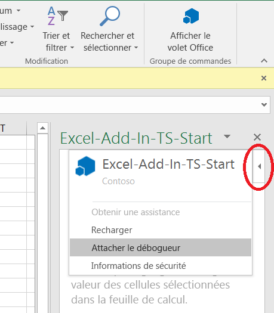
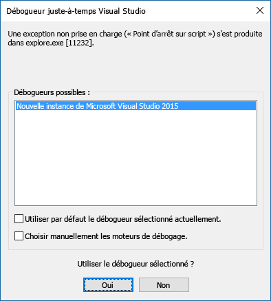

# Attacher un débogueur à partir du volet OfficeAttach a debugger from the task pane

Dans Office 2016 pour Windows, version 77xx.xxxx ou ultérieure, vous pouvez attacher le débogueur à partir du volet Office. Cette fonctionnalité attache directement le débogueur au processus Internet Explorer approprié pour vous. Vous pouvez attacher un débogueur quel que soit l’outil que vous utilisez (générateur de Yeoman, Visual Studio Code, Node.js, Angular ou autre).In Office 2016 on Windows, Build 77xx.xxxx or later, you can attach the debugger from the task pane. The attach debugger feature will directly attach the debugger to the correct Internet Explorer process for you. You can attach a debugger regardless of whether you are using Yeoman Generator, Visual Studio Code, Node.js, Angular, or another tool.

Pour lancer l’outil **Attacher le débogueur**, cliquez sur le coin supérieur droit du volet Office pour activer le menu **Caractéristique** (comme illustré dans le cercle rouge dans l’image suivante).To launch the **Attach Debugger** tool, choose the top right corner of the task pane to activate the **Personality** menu (as shown in the red circle in the following image).

> [!NOTE]
> - Actuellement, le seul débogueur pris en charge est [Visual Studio 2015](https://www.visualstudio.com/downloads/) avec la [mise à jour 3](https://msdn.microsoft.com/library/mt752379.aspx) ou une mise à jour ultérieure.Currently the only supported debugger tool is [Visual Studio 2015](https://www.visualstudio.com/downloads/) with [Update 3](https://msdn.microsoft.com/library/mt752379.aspx) or later. Si Visual Studio n’est pas installé, la sélection de l’option **attacher le débogueur** n’entraîne aucune action.If you don't have Visual Studio installed, selecting the **Attach Debugger** option doesn't result in any action.
> - Vous ne pouvez déboguer JavaScript côté client qu’à l’aide de l’outil **Attacher le débogueur**. Pour déboguer du code côté serveur, comme avec un serveur Node.js, vous disposez de nombreuses options. Pour plus d’informations sur le débogage avec Visual Studio Code, reportez-vous à la rubrique sur le [débogage de Node.js dans VS Code](https://code.visualstudio.com/docs/nodejs/nodejs-debugging). Si vous n’utilisez pas Visual Studio Code, recherchez « déboguer Node.js » ou « déboguer {nom de serveur} ».You can only debug client-side JavaScript with the **Attach Debugger** tool. To debug server-side code, such as with a Node.js server, you have many options. For information on how to debug with Visual Studio Code, see [Node.js Debugging in VS Code](https://code.visualstudio.com/docs/nodejs/nodejs-debugging). If you are not using Visual Studio Code, search for "debug Node.js" or "debug {name-of-server}".

Sélectionnez **Attacher le débogueur**. Cette action ouvre la boîte de dialogue **Débogueur juste-à-temps Visual Studio**, comme illustré dans l’image suivante.Select **Attach Debugger**. This launches the **Visual Studio Just-in-Time Debugger** dialog box, as shown in the following image. 

Dans Visual Studio, les fichiers de code s’affichent dans **l’Explorateur de solutions**.   Vous pouvez définir des points d’arrêt à la ligne de code que vous souhaitez déboguer dans Visual Studio.In Visual Studio, you will see the code files in **Solution Explorer**.   You can set breakpoints to the line of code you want to debug in Visual Studio.

> [!NOTE]
> Si vous ne voyez pas le menu Personnalité, vous pouvez déboguer votre complément à l’aide de Visual Studio.If you don't see the Personality menu, you can debug your add-in using Visual Studio. Vérifiez que votre complément de volet Office est ouvert dans Office, puis procédez comme suit :Ensure your task pane add-in is open in Office, and then follow these steps:
>
> 1. Dans Visual Studio, choisissez **DÉBOGUER** > **Attacher au processus**.In Visual Studio, choose **DEBUG** > **Attach to Process**.
> 2. Dans **Processus disponibles**, choisissez *soit* tous les processus `Iexplore.exe`disponibles, *soit* tous les processus `MicrosoftEdge*.exe` disponible selon que [votre complément utilise Internet Explorer ou Microsoft Edge](../concepts/browsers-used-by-office-web-add-ins.md), puis cliquez sur le bouton **Joindre**.In **Available processes**, choose *either* all of the available `Iexplore.exe` processes *or* all of the available `MicrosoftEdge*.exe` processes, depending on [whether your add-in is using Internet Explorer or Microsoft Edge](../concepts/browsers-used-by-office-web-add-ins.md), and then choose the **Attach** button.

Pour plus d’informations sur le débogage dans Visual Studio, consultez les rubriques suivantes :For more information about debugging in Visual Studio, see the following:

- Pour lancer et utiliser l’explorateur DOM dans Visual Studio, consultez le conseil 4 dans la section relative aux [conseils et astuces](https://blogs.msdn.microsoft.com/officeapps/2013/04/16/building-great-looking-apps-for-office-using-the-new-project-templates/#tips_tricks) du billet de blog sur la [création d’applications attrayantes pour Office à l’aide de nouveaux modèles de projet](https://blogs.msdn.microsoft.com/officeapps/2013/04/16/building-great-looking-apps-for-office-using-the-new-project-templates).To launch and use the DOM Explorer in Visual Studio, see Tip 4 in the [Tips and Tricks](https://blogs.msdn.microsoft.com/officeapps/2013/04/16/building-great-looking-apps-for-office-using-the-new-project-templates/#tips_tricks) section of the [Building great-looking apps for Office using the new project templates](https://blogs.msdn.microsoft.com/officeapps/2013/04/16/building-great-looking-apps-for-office-using-the-new-project-templates) blog post.
- Pour définir des points d’arrêt, consultez la rubrique [Utilisation des points d’arrêt](/visualstudio/debugger/using-breakpoints?view=vs-2015&preserve-view=true).To set breakpoints, see [Using Breakpoints](/visualstudio/debugger/using-breakpoints?view=vs-2015&preserve-view=true).
- Pour utiliser F12, consultez la rubrique [Utilisation des outils de développement F12](/previous-versions/windows/internet-explorer/ie-developer/samples/bg182326(v=vs.85)).To use F12, see [Using the F12 developer tools](/previous-versions/windows/internet-explorer/ie-developer/samples/bg182326(v=vs.85)).
- Pour utiliser les outils de développement Microsoft Edge, voir [Microsoft Edge DevTools](https://www.microsoft.com/p/microsoft-edge-devtools-preview/9mzbfrmz0mnj?activetab=pivot%3Aoverviewtab).To use the Microsoft Edge Developer Tools, see [Microsoft Edge DevTools](https://www.microsoft.com/p/microsoft-edge-devtools-preview/9mzbfrmz0mnj?activetab=pivot%3Aoverviewtab).

## Voir aussiSee also

- [Déboguer des compléments Office dans Visual StudioDebug Office Add-ins in Visual Studio](../develop/debug-office-add-ins-in-visual-studio.md)
- [Publier votre complément OfficePublish your Office Add-in](../publish/publish.md)
- [Complément Microsoft Office Extension de débogueur pour Visual Studio CodeMicrosoft Office Add-in Debugger Extension for Visual Studio Code](debug-with-vs-extension.md)