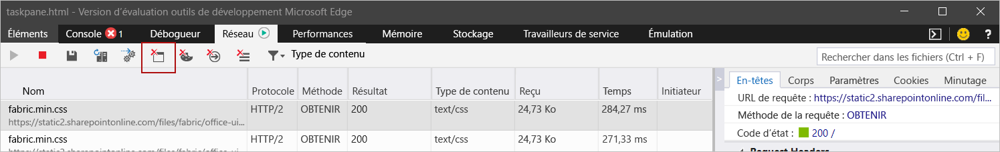
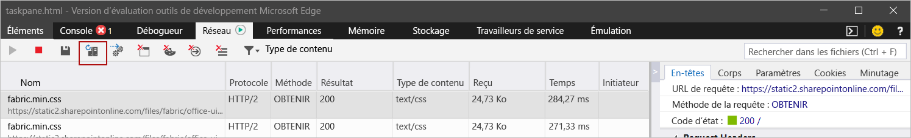

# <a name="clear-the-office-cache"></a><span data-ttu-id="8d120-103">Vider le cache Office</span><span class="sxs-lookup"><span data-stu-id="8d120-103">Clear the Office cache</span></span>

<span data-ttu-id="8d120-104">Vous pouvez supprimer un complément que vous avez précédemment chargé sur Windows, Mac ou iOS en vidant le cache Office sur votre ordinateur.</span><span class="sxs-lookup"><span data-stu-id="8d120-104">You can remove an add-in that you've previously sideloaded on Windows, Mac, or iOS by clearing the Office cache on your computer.</span></span>

<span data-ttu-id="8d120-105">En outre, si vous apportez des modifications au manifeste de votre complément (par exemple, vous mettez à jour le nom des fichiers d’icônes ou de texte de commandes du complément), videz le cache Office, puis rechargez le complément à l’aide d’un manifeste mis à jour.</span><span class="sxs-lookup"><span data-stu-id="8d120-105">Additionally, if you make changes to your add-in's manifest (for example, update file names of icons or text of add-in commands), you should clear the Office cache and then re-sideload the add-in using updated manifest.</span></span> <span data-ttu-id="8d120-106">Cette action permettra à Office d’afficher le complément tel que décrit par le manifeste mis à jour.</span><span class="sxs-lookup"><span data-stu-id="8d120-106">Doing so will allow Office to render the add-in as it's described by the updated manifest.</span></span>

## <a name="clear-the-office-cache-on-windows"></a><span data-ttu-id="8d120-107">Vider le cache Office sur Windows</span><span class="sxs-lookup"><span data-stu-id="8d120-107">Clear the Office cache on Windows</span></span>

<span data-ttu-id="8d120-108">Pour supprimer tous les compléments versions test chargées d’Excel, Word et PowerPoint, supprimez le contenu du dossier :</span><span class="sxs-lookup"><span data-stu-id="8d120-108">To remove all sideloaded add-ins from Excel, Word, and PowerPoint, delete the contents of the folder:</span></span>

```
%LOCALAPPDATA%\Microsoft\Office\16.0\Wef\
```

<span data-ttu-id="8d120-109">Pour supprimer un complément versions test chargées à partir d’Outlook, suivez les étapes décrites dans [chargement des compléments Outlook à des fins de test](../outlook/sideload-outlook-add-ins-for-testing.md) pour trouver le complément dans la section **compléments personnalisés** de la boîte de dialogue qui répertorie vos compléments installés. Choisissez le bouton`...`de sélection () pour le complément, puis cliquez sur **supprimer** pour supprimer ce complément.</span><span class="sxs-lookup"><span data-stu-id="8d120-109">To remove a sideloaded add-in from Outlook, use the steps outlined in [Sideload Outlook add-ins for testing](../outlook/sideload-outlook-add-ins-for-testing.md) to find the add-in in the **Custom add-ins** section of the dialog box that lists your installed add-ins. Choose the ellipsis (`...`) for the add-in and then choose **Remove** to remove that specific add-in.</span></span>

<span data-ttu-id="8d120-110">En outre, vous pouvez utiliser Microsoft Edge DevTools pour vider le cache Office dans Windows 10 lorsque le complément s’exécute dans Microsoft Edge.</span><span class="sxs-lookup"><span data-stu-id="8d120-110">Additionally, to clear the Office cache on Windows 10 when the add-in is running in Microsoft Edge, you can use the Microsoft Edge DevTools.</span></span>

> [!TIP]
> <span data-ttu-id="8d120-111">Si vous souhaitez que le complément sideloaded reflète les modifications récentes apportées à ses fichiers HTML ou JavaScript, il n’est pas nécessaire que vous utilisiez les étapes suivantes pour vider le cache.</span><span class="sxs-lookup"><span data-stu-id="8d120-111">If you're just wanting the sideloaded add-in to reflect recent changes to its HTML or JavaScript source files, you shouldn't need to use the following steps to clear the cache.</span></span> <span data-ttu-id="8d120-112">Il vous suffit, au lieu de cela, d’insérer le focus dans le volet de tâches du complément (en cliquant n’importe où dans le volet), puis d’appuyer sur **F5** pour recharger le complément.</span><span class="sxs-lookup"><span data-stu-id="8d120-112">Instead, just put focus in the add-in's task pane (by clicking anywhere within the task pane) and then press **F5** to reload the add-in.</span></span>

> [!NOTE]
> <span data-ttu-id="8d120-113">Pour vider le cache Office à l'aide des étapes ci-dessous, votre complément doit avoir un volet de tâches.</span><span class="sxs-lookup"><span data-stu-id="8d120-113">To clear the Office cache using the following steps, your add-in must have a task pane.</span></span> <span data-ttu-id="8d120-114">Si vous avez un complément UI-less, par exemple un complément qui utilise la fonctionnalité [on-send](../outlook/outlook-on-send-addins.md), vous devez ajouter un volet de tâches à votre complément qui utilise le même domaine pour [SourceLocation](../reference/manifest/sourcelocation.md), avant de pouvoir utiliser les étapes suivantes pour vider le cache.</span><span class="sxs-lookup"><span data-stu-id="8d120-114">If your add-in is a UI-less add-in -- for example, one that uses the [on-send](../outlook/outlook-on-send-addins.md) feature -- you'll need to add a task pane to your add-in that uses the same domain for [SourceLocation](../reference/manifest/sourcelocation.md), before you can use the following steps to clear the cache.</span></span>

1. <span data-ttu-id="8d120-115">Installez [Microsoft Edge DevTools](https://www.microsoft.com/p/microsoft-edge-devtools-preview/9mzbfrmz0mnj).</span><span class="sxs-lookup"><span data-stu-id="8d120-115">Install the [Microsoft Edge DevTools](https://www.microsoft.com/p/microsoft-edge-devtools-preview/9mzbfrmz0mnj).</span></span>

2. <span data-ttu-id="8d120-116">Ouvrez votre complément dans le client Office.</span><span class="sxs-lookup"><span data-stu-id="8d120-116">Open your add-in in the Office client.</span></span>

3. <span data-ttu-id="8d120-117">Exécutez Microsoft Edge DevTools.</span><span class="sxs-lookup"><span data-stu-id="8d120-117">Run the Microsoft Edge DevTools.</span></span>

4. <span data-ttu-id="8d120-118">Ouvrez l’onglet **Local** dans Microsoft Edge DevTools. Votre complément est répertorié par son nom.</span><span class="sxs-lookup"><span data-stu-id="8d120-118">In the Microsoft Edge DevTools, open the **Local** tab. Your add-in will be listed by its name.</span></span>

5. <span data-ttu-id="8d120-119">Sélectionnez le nom du complément pour joindre le débogueur à votre complément.</span><span class="sxs-lookup"><span data-stu-id="8d120-119">Select the add-in name to attach the debugger to your add-in.</span></span> <span data-ttu-id="8d120-120">Une nouvelle fenêtre Microsoft Edge DevTools s’ouvre lorsque le débogueur s'attache à votre complément.</span><span class="sxs-lookup"><span data-stu-id="8d120-120">A new Microsoft Edge DevTools window will open when the debugger attaches to your add-in.</span></span>

6. <span data-ttu-id="8d120-121">Sous l’onglet **Réseau** de la nouvelle fenêtre, sélectionnez le bouton **Vider le cache**.</span><span class="sxs-lookup"><span data-stu-id="8d120-121">On the **Network** tab of the new window, select the **Clear cache** button.</span></span>

    

7. <span data-ttu-id="8d120-123">Si l’exécution de ces étapes ne produit pas le résultat escompté, vous pouvez également sélectionner le bouton **Toujours actualiser à partir du serveur**.</span><span class="sxs-lookup"><span data-stu-id="8d120-123">If completing these steps doesn't produce the desired result, you can also select the **Always refresh from server** button.</span></span>

    

## <a name="clear-the-office-cache-on-mac"></a><span data-ttu-id="8d120-125">Vider le cache Office sur Mac</span><span class="sxs-lookup"><span data-stu-id="8d120-125">Clear the Office cache on Mac</span></span>

[!include[additional cache folders on Mac](../includes/mac-cache-folders.md)]

## <a name="clear-the-office-cache-on-ios"></a><span data-ttu-id="8d120-126">Vider le cache Office sur iOS</span><span class="sxs-lookup"><span data-stu-id="8d120-126">Clear the Office cache on iOS</span></span>

<span data-ttu-id="8d120-127">Pour vider le cache Office sur iOS, appelez `window.location.reload(true)` à partir de JavaScript dans le complément pour forcer le rechargement.</span><span class="sxs-lookup"><span data-stu-id="8d120-127">To clear the Office cache on iOS, call `window.location.reload(true)` from JavaScript in the add-in to force a reload.</span></span> <span data-ttu-id="8d120-128">Vous pouvez également choisir de réinstaller Office.</span><span class="sxs-lookup"><span data-stu-id="8d120-128">Alternatively, you can reinstall Office.</span></span>

## <a name="see-also"></a><span data-ttu-id="8d120-129">Voir aussi</span><span class="sxs-lookup"><span data-stu-id="8d120-129">See also</span></span>

- [<span data-ttu-id="8d120-130">Débogage des compléments Office</span><span class="sxs-lookup"><span data-stu-id="8d120-130">Debug Office Add-ins</span></span>](debug-add-ins-using-f12-developer-tools-on-windows-10.md)
- [<span data-ttu-id="8d120-131">Déboguer votre complément avec la journalisation runtime</span><span class="sxs-lookup"><span data-stu-id="8d120-131">Debug your add-in with runtime logging</span></span>](runtime-logging.md)
- [<span data-ttu-id="8d120-132">Chargement de la version test des compléments Office</span><span class="sxs-lookup"><span data-stu-id="8d120-132">Sideload Office Add-ins for testing</span></span>](sideload-office-add-ins-for-testing.md)
- [<span data-ttu-id="8d120-133">Manifeste XML des compléments Office</span><span class="sxs-lookup"><span data-stu-id="8d120-133">Office Add-ins XML manifest</span></span>](../develop/add-in-manifests.md)
- [<span data-ttu-id="8d120-134">Valider le manifeste d’un complément Office</span><span class="sxs-lookup"><span data-stu-id="8d120-134">Validate an Office Add-in's manifest</span></span>](troubleshoot-manifest.md)
